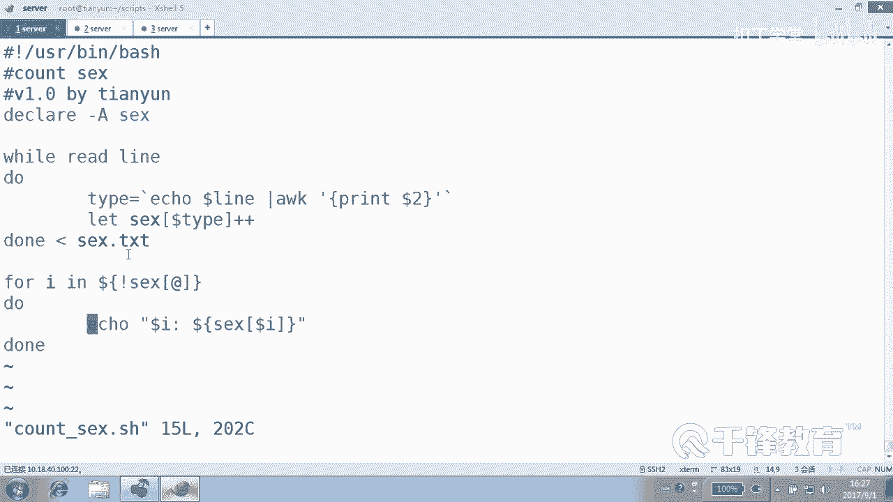
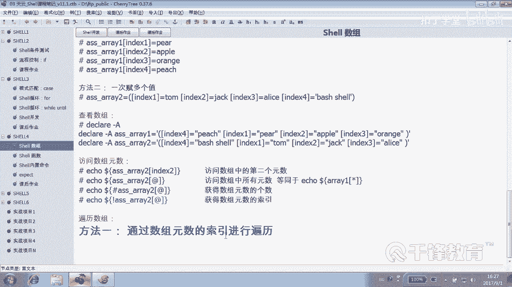
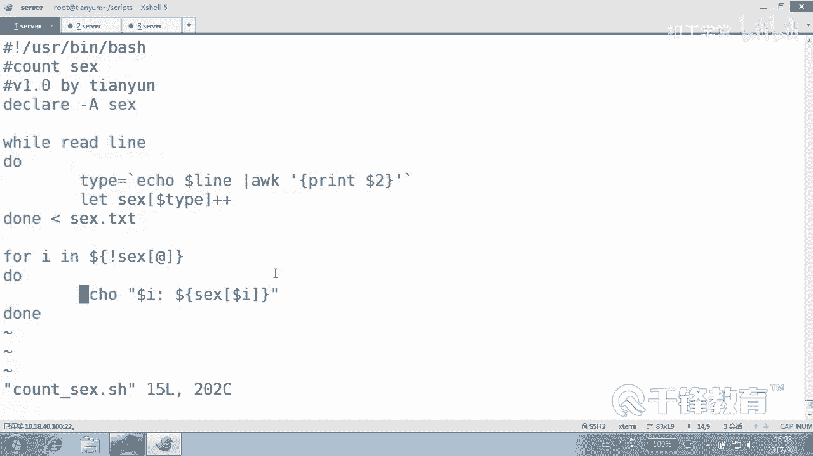

# Shell脚本自动化编程实战：P38：6.3 使用数组实现性别统计 📊


在本节课中，我们将学习如何使用Shell脚本中的数组，特别是关联数组，来统计一个文件中不同性别出现的次数。我们将从一个包含用户名和性别的文件入手，编写一个脚本，最终输出男性和女性的数量。

---

## 概述

上一节我们介绍了数组的基本赋值和遍历方法。本节中，我们来看看如何利用数组，特别是关联数组，来完成一个实际的数据统计任务：统计文件中“男”和“女”出现的次数。

## 准备数据文件

首先，我们有一个名为 `sex.txt` 的数据文件，其内容如下：
```
jack male
alice female
tom male
rose female
robin male
zhuzhu female
```
文件每行包含一个用户名和对应的性别（male 或 female）。我们的目标是统计男性和女性各有多少人。

## 脚本编写思路

虽然使用 `awk` 等命令可以快速完成统计，但本节的目的是练习数组的使用。核心思路是：
1.  定义一个关联数组，用于存储统计结果。
2.  逐行读取文件，提取性别字段。
3.  将性别字段作为数组的索引（键），并将该索引对应的值加1。
4.  遍历数组，输出最终的统计结果。

以下是实现此功能的脚本 `count_sex.sh`：

```bash
#!/bin/bash

# 声明一个关联数组，用于统计性别
declare -A sex_count

# 逐行读取 sex.txt 文件
while read line
do
    # 提取每一行的第二列（性别）
    type=$(echo $line | awk '{print $2}')
    # 以性别为索引，对对应的值进行累加
    let sex_count[$type]++
done < sex.txt

# 遍历关联数组，输出统计结果
for index in ${!sex_count[@]}
do
    echo "$index: ${sex_count[$index]}"
done
```

## 代码解析

以下是脚本关键部分的详细解释：

1.  **声明关联数组**：
    ```bash
    declare -A sex_count
    ```
    使用 `declare -A` 命令声明一个名为 `sex_count` 的关联数组。关联数组允许我们使用字符串作为索引（键）。

2.  **读取文件并提取性别**：
    ```bash
    while read line
    do
        type=$(echo $line | awk '{print $2}')
    done < sex.txt
    ```
    使用 `while read` 循环逐行处理 `sex.txt` 文件。在循环体内，使用 `awk '{print $2}'` 提取每一行的第二列（即性别），并将其赋值给变量 `type`。

3.  **核心统计逻辑**：
    ```bash
    let sex_count[$type]++
    ```
    这是统计的核心。`sex_count[$type]` 表示以变量 `type` 的值（如 “male” 或 “female”）作为数组索引。`let ...++` 操作会将这个索引对应的值增加1。
    *   当第一次遇到 “male” 时，`sex_count[male]` 从无到有，其值被初始化为0后加1，结果变为1。
    *   再次遇到 “male” 时，`sex_count[male]` 的值从1增加为2。
    *   这个过程模拟了“画正字”计票的原理。

4.  **遍历并输出结果**：
    ```bash
    for index in ${!sex_count[@]}
    do
        echo "$index: ${sex_count[$index]}"
    done
    ```
    `${!sex_count[@]}` 用于获取数组 `sex_count` 的所有索引（即所有出现过的性别类型，如 “male”, “female”）。然后通过 `for` 循环遍历这些索引，并打印出索引（性别）和其对应的值（数量）。

## 运行结果

执行脚本后，输出结果如下：
```
female: 3
male: 3
```
这表示文件中女性 (`female`) 和男性 (`male`) 各出现了3次。

## 总结





本节课中我们一起学习了如何利用Shell的关联数组进行数据统计。我们掌握了以下关键点：
*   **关联数组的声明**：使用 `declare -A`。
*   **统计逻辑**：将需要统计的类别（如性别）作为数组的索引，通过 `let array[index]++` 实现计数累加。
*   **数组遍历**：使用 `${!array[@]}` 获取所有索引，然后遍历输出。



这种方法非常灵活，可以轻松扩展到统计文件中任何类别数据的出现频率，是Shell脚本编程中一个实用且强大的技巧。