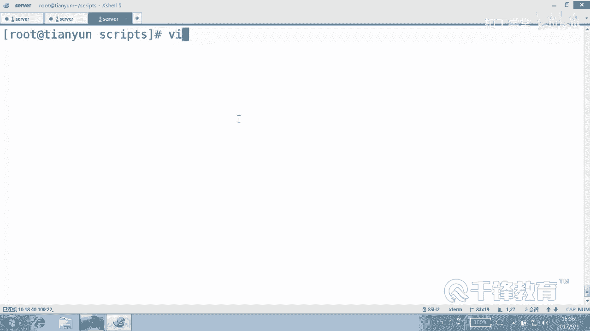
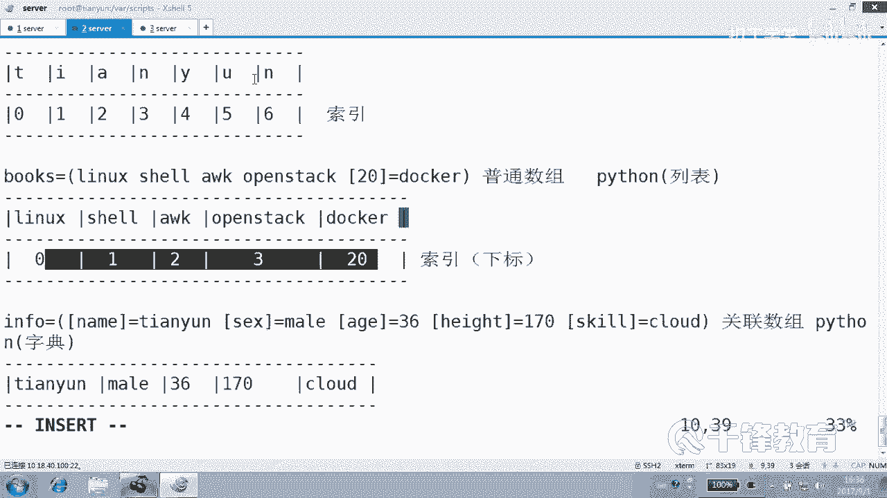
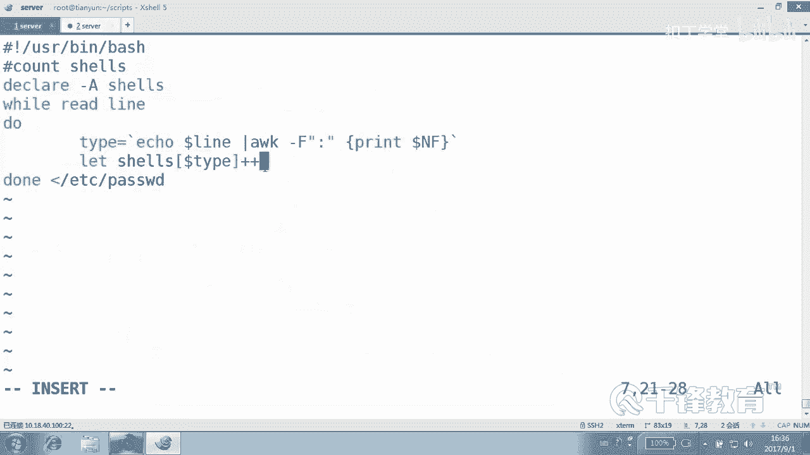
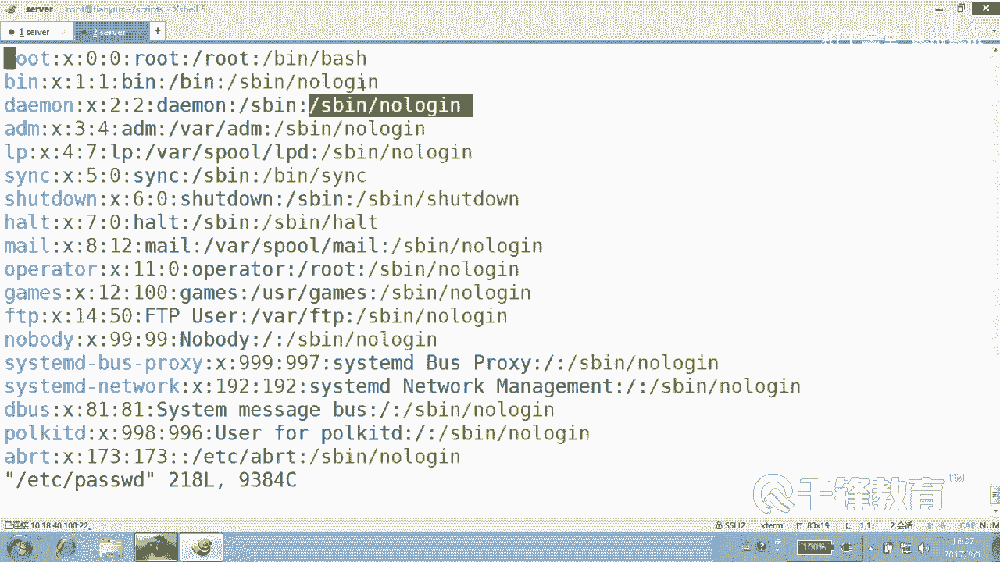
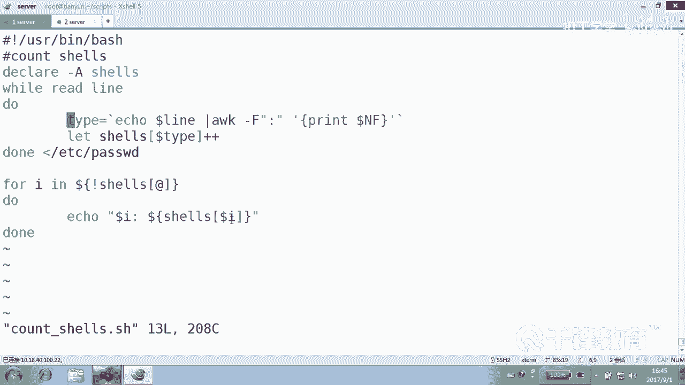

# Shell脚本自动化编程实战：P39：6.4 统计不同类型Shell的数量 📊


在本节课中，我们将学习如何使用Shell脚本中的关联数组来统计`/etc/passwd`文件中不同Shell类型的出现次数。我们将通过一个具体的例子，详细讲解如何提取数据、构建数组并最终输出统计结果。

## 概述

上一节我们介绍了关联数组的基本概念和用法。本节中，我们来看看如何利用关联数组的特性，对文本文件中的特定字段进行数量统计。我们将以统计用户Shell类型为例，演示一个完整的脚本编写过程。

## 核心思路

统计的核心方法可以总结为：**将要统计的对象作为关联数组的索引，然后对其对应的值进行累加**。

例如，统计性别时，伪代码如下：
```bash
sex["M"]++
sex["F"]++
```
这里，`M`和`F`是数组的索引，`++`操作是对索引对应的值进行加1操作。

## 脚本编写步骤

以下是编写统计Shell类型数量的脚本的具体步骤。

### 1. 定义关联数组

首先，我们需要声明一个关联数组来存储统计结果。
```bash
declare -A shells
```

### 2. 读取并处理文件



我们使用`while`循环逐行读取`/etc/passwd`文件。这是处理文本文件的常用方法。
```bash
while read line
do
    # 处理每一行
done < /etc/passwd
```



### 3. 提取Shell类型



`/etc/passwd`文件的每一行由冒号`:`分隔，Shell类型位于最后一列。我们可以使用`awk`命令来提取它。
```bash
    type=`echo $line | awk -F":" '{print $NF}'`
```
这里，`$NF`代表最后一列，`-F":"`指定了分隔符为冒号。



### 4. 进行累加统计

将提取到的Shell类型作为数组索引，并对其值进行加1操作。
```bash
    shells[$type]++
```
无论遇到哪种Shell类型，这条语句都会在其对应的“票数”上加一。

### 5. 遍历并输出结果

最后，我们遍历关联数组，打印出每种Shell类型及其出现的次数。
```bash
for i in ${!shells[@]}
do
    echo "$i: ${shells[$i]}"
done
```
`${!shells[@]}`用于获取数组的所有索引（即不同的Shell类型）。

## 完整脚本示例

将以上步骤整合，得到完整的脚本`count_shells.sh`：
```bash
#!/usr/bin/bash

declare -A shells

while read line
do
    type=`echo $line | awk -F":" '{print $NF}'`
    shells[$type]++
done < /etc/passwd

for i in ${!shells[@]}
do
    echo "$i: ${shells[$i]}"
done
```

## 运行与验证

1.  为脚本添加执行权限：
    ```bash
    chmod +x count_shells.sh
    ```
2.  运行脚本：
    ```bash
    ./count_shells.sh
    ```
    你将看到类似以下的输出，显示了每种Shell类型的数量：
    ```
    /bin/bash: 17
    /usr/sbin/nologin: 20
    /bin/sync: 1
    ```

## 其他方法说明

虽然使用关联数组是本节的重点，但我们也知道，使用`awk`配合`sort`、`uniq`命令可以更简洁地完成同样的统计：
```bash
awk -F":" '{print $NF}' /etc/passwd | sort | uniq -c
```
这种方法同样高效。但本节旨在掌握关联数组在统计场景下的应用逻辑。

## 总结



本节课中我们一起学习了如何使用Shell的关联数组进行数据统计。我们掌握了将统计对象作为数组索引、对值进行累加的核心方法，并成功编写了统计`/etc/passwd`文件中Shell类型的脚本。这种“索引-累加”的模式非常强大，适用于各种需要按类别计数的场景。