# Shell脚本自动化编程实战：P40：6.5 使用数组统计TCP连接状态数量 📊


在本节课中，我们将学习如何使用Shell脚本中的关联数组来统计服务器上TCP连接的各种状态数量。这是一个非常实用的技巧，可以帮助我们实时监控网络连接状况。

## 概述

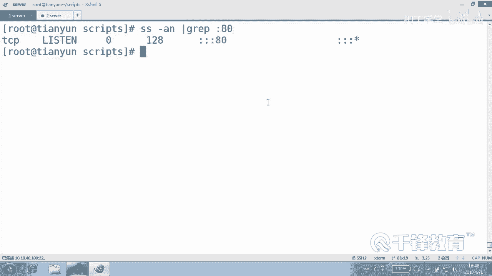

上一节我们介绍了数组的基本操作，本节中我们来看看如何将数组应用于实际场景。我们将编写一个脚本，用于统计服务器上所有TCP连接的状态（如`ESTABLISHED`、`LISTEN`、`TIME_WAIT`等），并实时显示每种状态的数量。

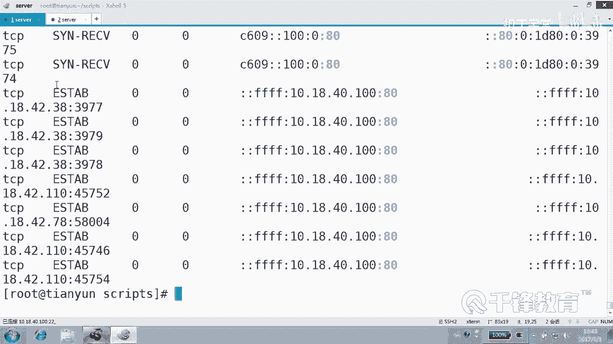

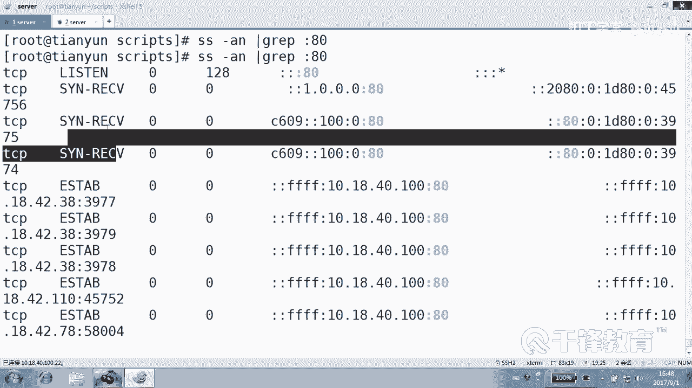

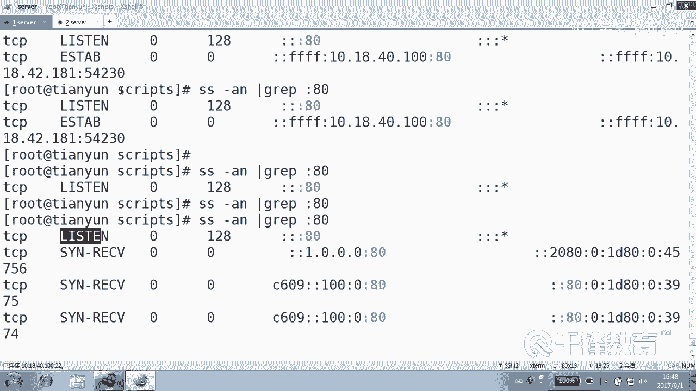

## 核心思路

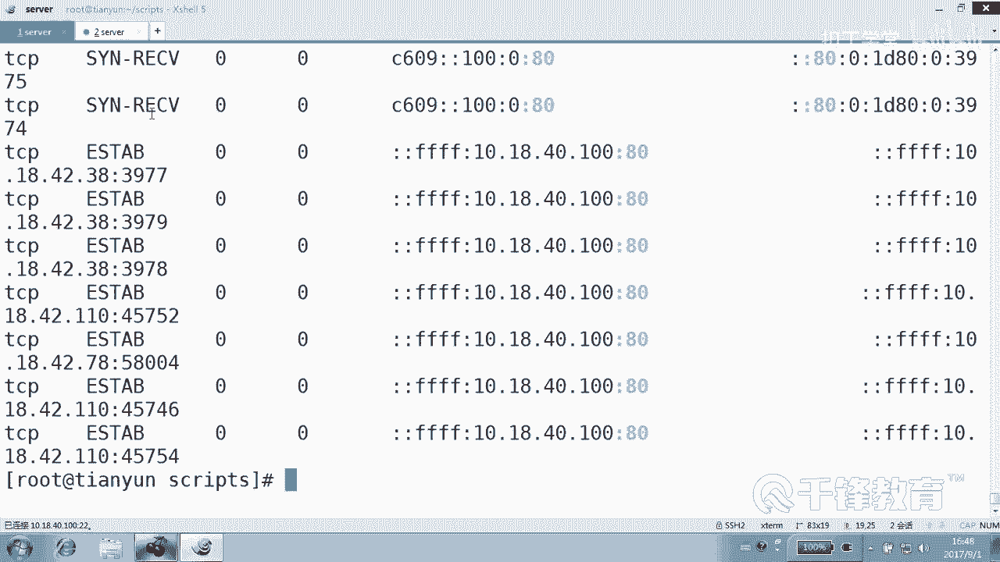

统计TCP连接状态的核心思路与之前统计文件类型类似。我们将TCP连接状态作为关联数组的**索引**，每当遇到一个状态，就将该状态对应的数组元素值**加1**。最后，遍历数组并打印出所有状态及其数量。

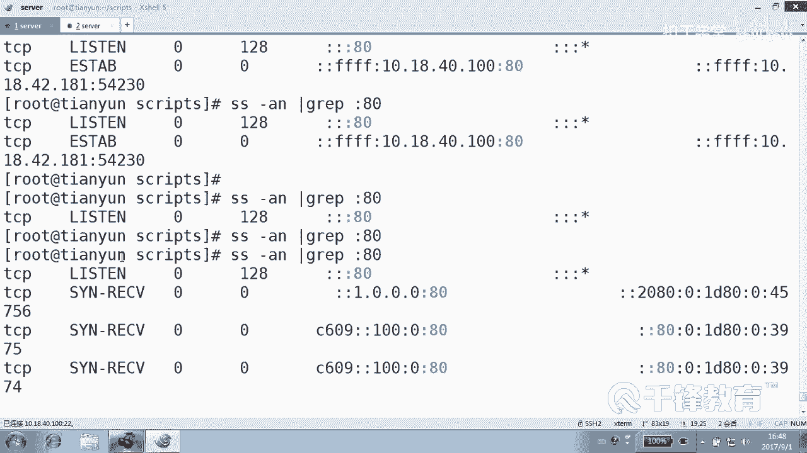

## 实现步骤

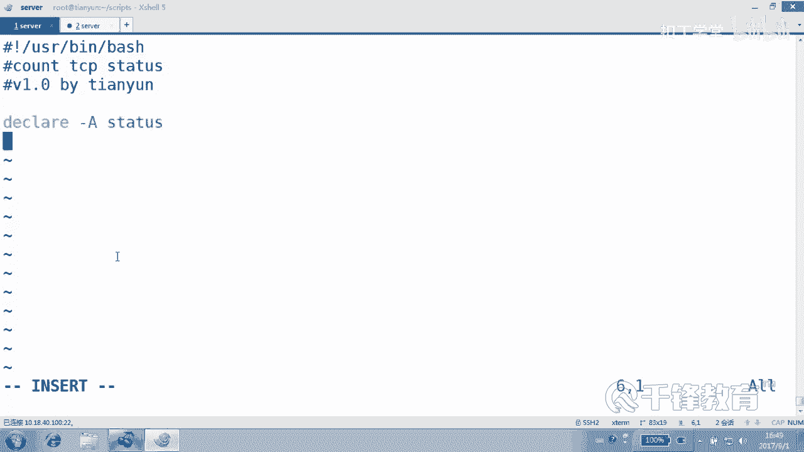

以下是实现TCP连接状态统计的具体步骤。

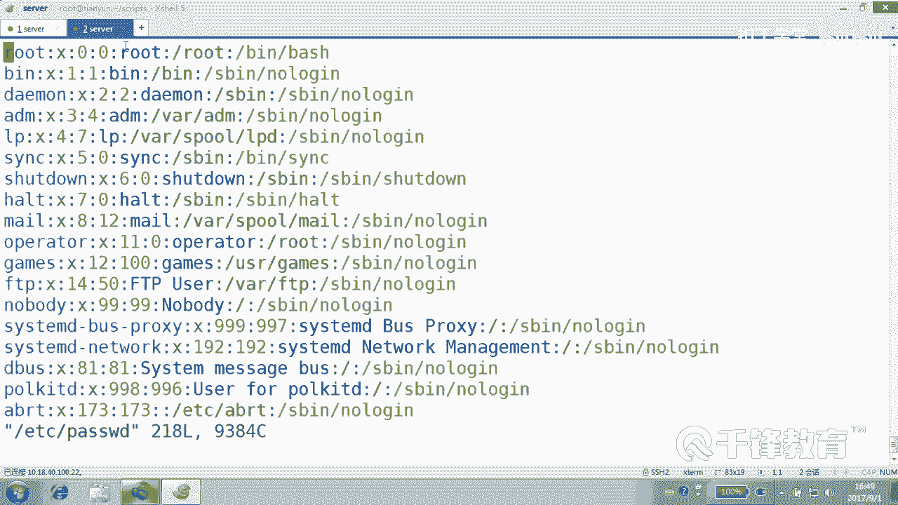

### 1. 获取TCP状态列表

首先，我们需要获取当前服务器上所有TCP连接的状态列表。这可以通过`ss`命令结合`awk`来实现。

```bash
type=$(ss -ant | awk 'NR>1 {print $2}')
```

**代码解释**：
*   `ss -ant`：显示所有TCP连接（`-t`）的详细信息（`-a`），并以数字形式（`-n`）显示端口。
*   `awk 'NR>1 {print $2}'`：`awk`命令用于处理文本。`NR>1`表示从第二行开始处理（跳过标题行），`{print $2}`表示打印每一行的第二列，即TCP状态列。

### 2. 定义关联数组并统计

接下来，我们定义一个关联数组，并遍历上一步获得的状态列表进行累加统计。

```bash
# 定义关联数组
declare -A status

# 遍历状态列表并累加
for i in $type
do
    let status[$i]++
done
```

**代码解释**：
*   `declare -A status`：声明一个名为`status`的关联数组。
*   `for i in $type`：遍历变量`$type`中保存的每一个TCP状态。
*   `let status[$i]++`：将当前状态`$i`作为数组索引，并将其对应的值加1。如果该状态首次出现，则其值被初始化为0后再加1。

### 3. 输出统计结果

统计完成后，我们需要遍历数组的索引（即所有出现过的TCP状态）并打印出其对应的数量。

```bash
# 输出统计结果
for j in ${!status[@]}
do
    echo "$j: ${status[$j]}"
done
```

**代码解释**：
*   `${!status[@]}`：获取关联数组`status`的所有索引（键名），即所有不同的TCP状态。
*   `echo “$j: ${status[$j]}”`：打印出状态名`$j`和其对应的数量`${status[$j]}`。

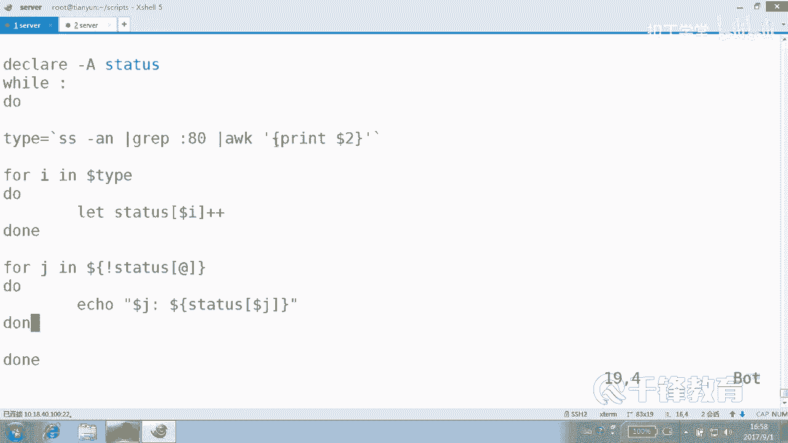

## 完整脚本与实时监控

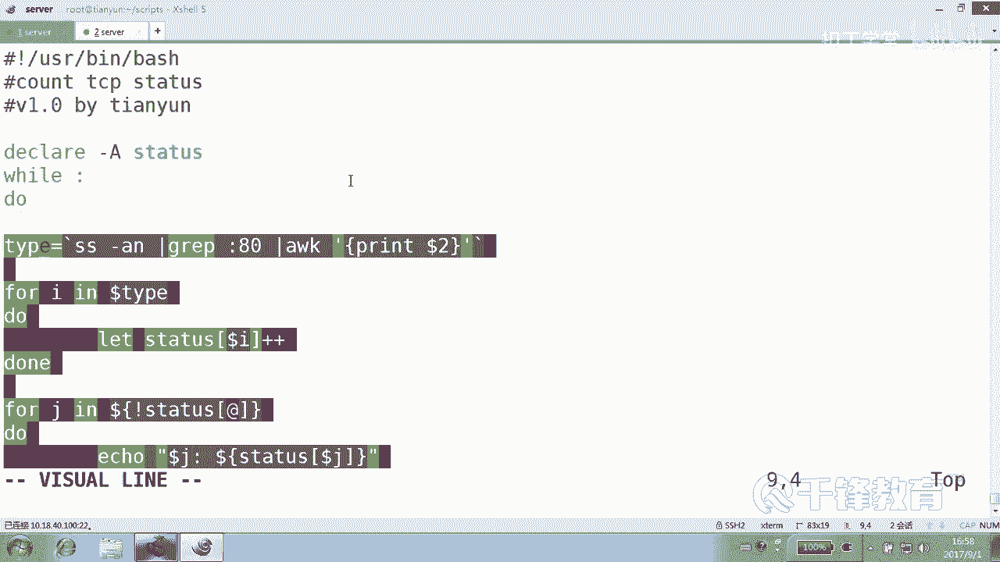

将以上步骤组合起来，就得到了一个完整的统计脚本。为了实时观察TCP状态的变化，我们可以使用`watch`命令或编写一个循环。

### 使用 `watch` 命令

`watch`命令可以定期执行指定的命令并全屏显示结果。

```bash
watch -n 1 ‘./tcp_status.sh‘
```

**代码解释**：每隔1秒（`-n 1`）执行一次`tcp_status.sh`脚本。

### 使用循环实现

我们也可以在脚本内部使用一个无限循环来实现类似`watch`的实时效果。**注意**：在每次循环开始前，需要清空之前的数组，否则统计值会不断累加，导致数据不准确。

```bash
#!/bin/bash

while true
do
    # 清空之前的统计数组
    unset status
    declare -A status

    # 获取当前TCP状态列表
    type=$(ss -ant | awk ‘NR>1 {print $2}‘)

    # 统计
    for i in $type
    do
        let status[$i]++
    done

    # 清屏并输出结果
    clear
    for j in ${!status[@]}
    do
        echo “$j: ${status[$j]}“
    done

    # 等待1秒
    sleep 1
done
```

**关键点**：
*   `unset status` 和 `declare -A status`：在每次循环开始时，清除旧的`status`数组并重新声明，确保每次统计都是独立的。
*   `clear`：清空终端屏幕，使输出更清晰。
*   `sleep 1`：让脚本暂停1秒，控制刷新频率。

## 总结

本节课中我们一起学习了如何使用Shell的关联数组来统计TCP连接状态。我们掌握了以下核心要点：
1.  **核心模式**：将需要统计的对象（如文件后缀、TCP状态）作为关联数组的**索引**，通过循环遍历和`let 数组名[索引]++`进行累加。
2.  **关键命令**：使用`ss -ant`和`awk`组合获取TCP状态列表。
3.  **实时监控**：可以通过`watch`命令或编写包含`clear`、`sleep`和数组重置逻辑的`while`循环来实现结果的动态刷新。

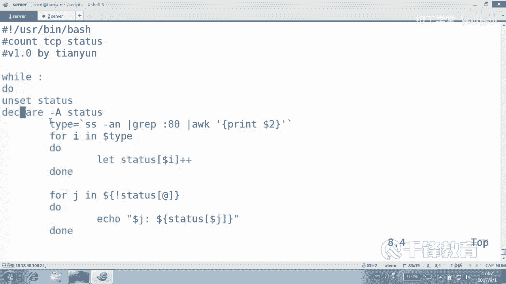

这个统计模式非常通用，你可以用它来统计日志中的IP访问次数、文件系统中各种类型的文件数量等任何需要分组计数的场景。