# Shell脚本自动化编程实战：P6：2.8 Shell脚本中各种奇怪的符号 🧩


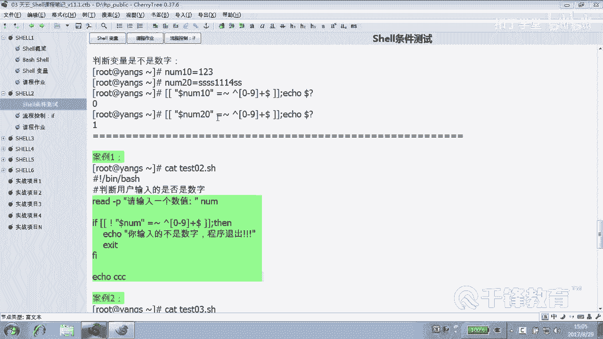

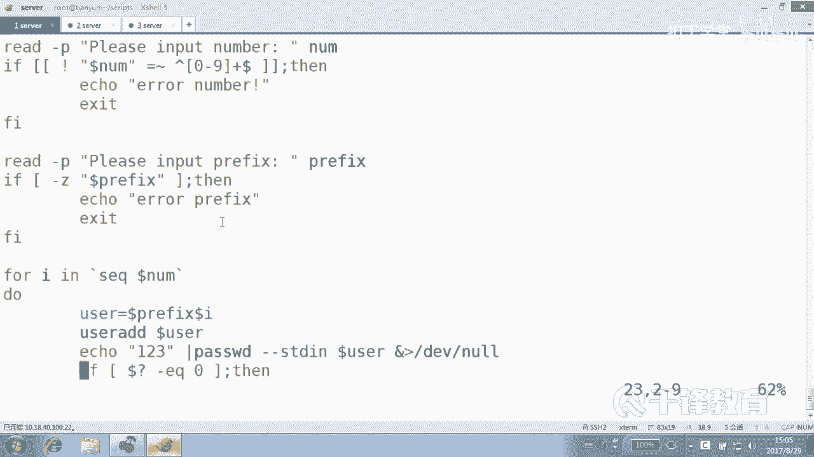

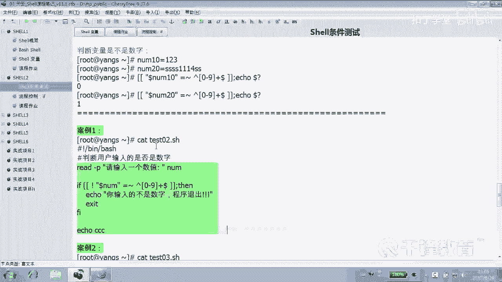

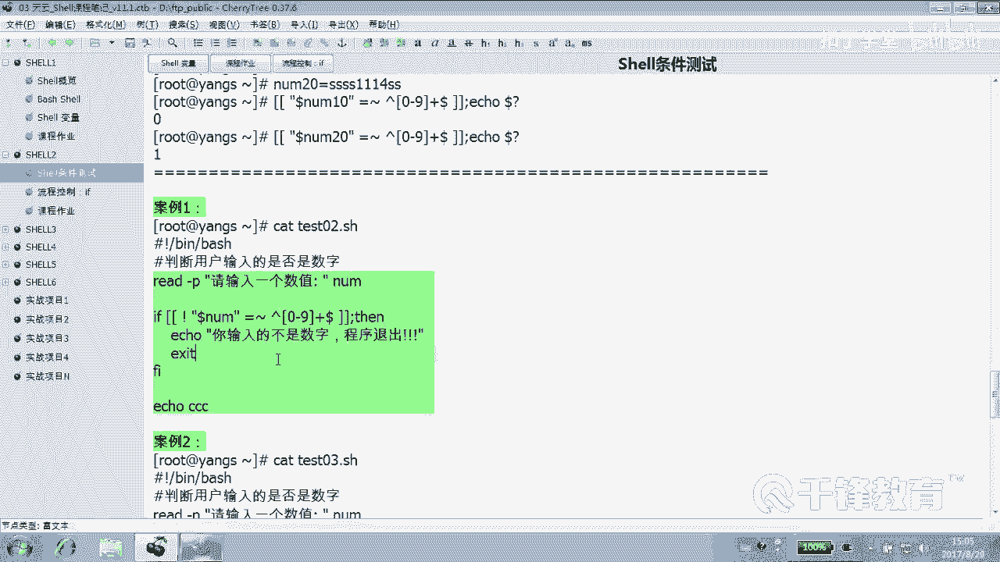

在本节课中，我们将学习Shell脚本中各种特殊符号的含义和用法。理解这些符号是编写高级脚本的基础，它们涵盖了命令执行、条件测试、变量操作等多个核心领域。

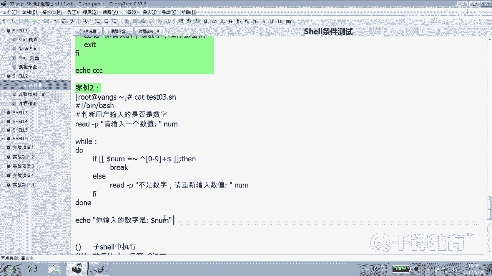

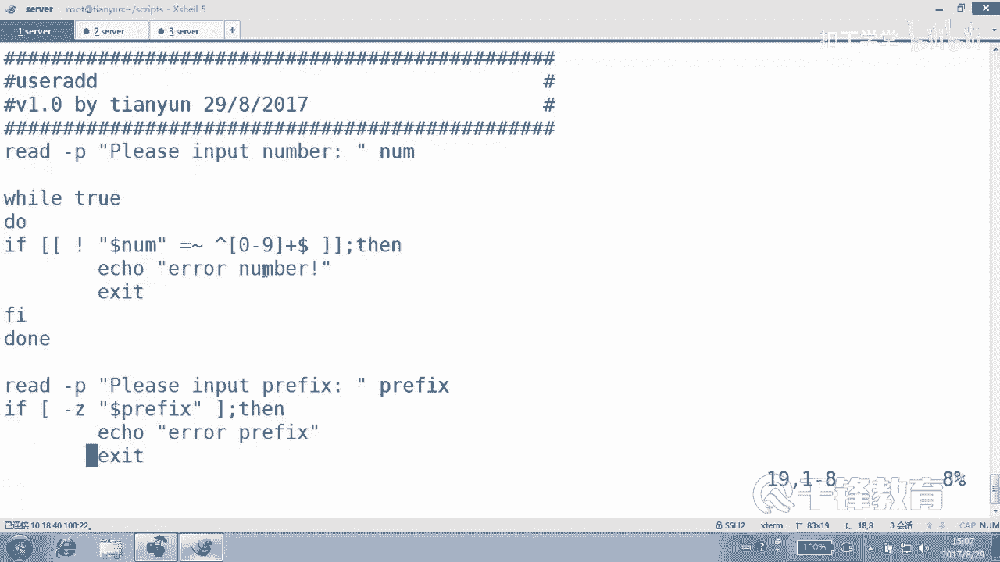

上一节我们介绍了如何利用循环和条件判断来改进用户输入验证。本节中，我们来看看Shell中那些“奇怪”但至关重要的符号。

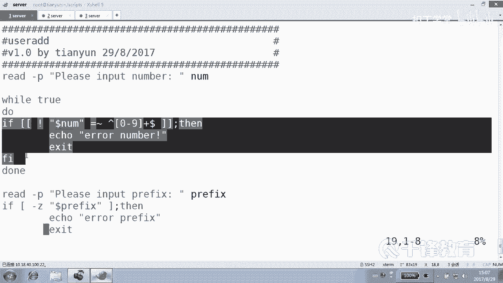

## 符号解析与应用

以下是Shell脚本中常见的几组特殊符号及其功能。

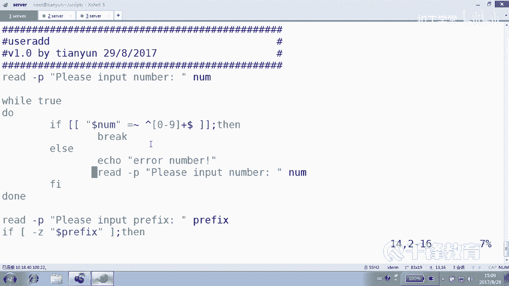

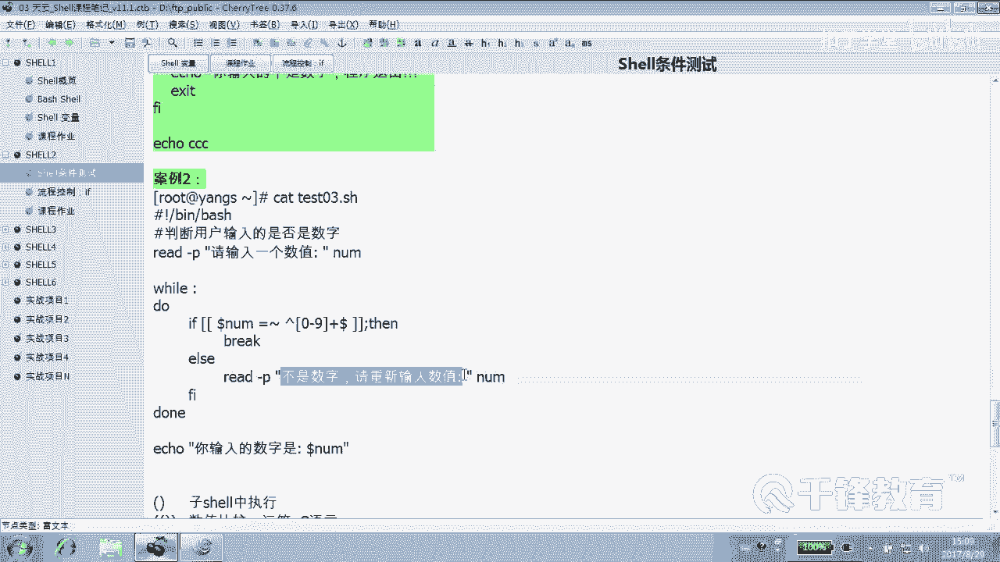

### 1. 小括号 `()` 与 `(())`
*   **`(命令)`**：在**子Shell**中执行括号内的命令。例如，`(cd /tmp && pwd)` 会在子Shell中切换目录并打印，不影响当前Shell的工作目录。
*   **`((表达式))`**：用于**数值运算和C语言风格的比较**。例如，`(( a < b ))` 或 `for ((i=0; i<10; i++))`。

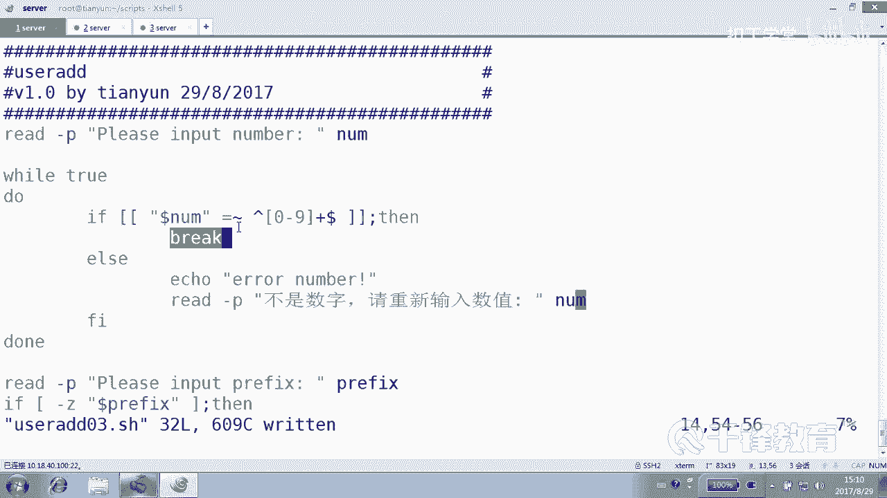

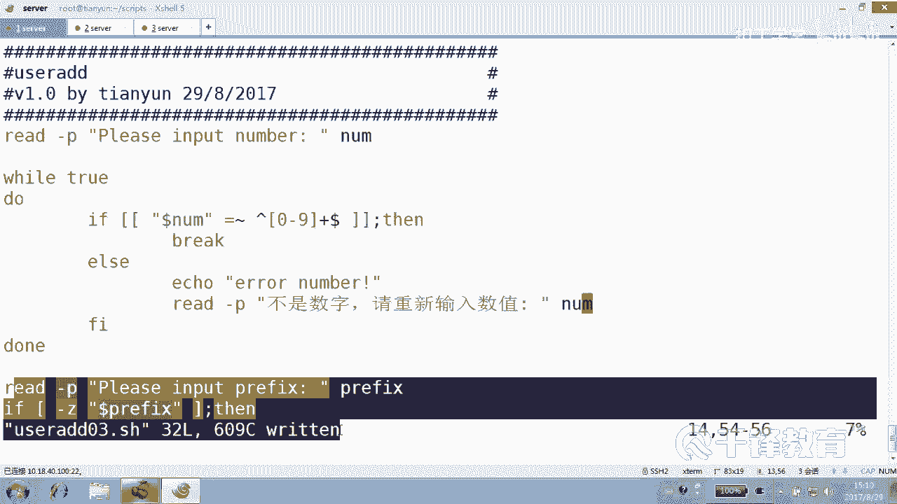

### 2. 反引号 `` ` `` 与 `$()`
*   **`` `命令` ``** 和 **`$(命令)`**：两者都用于**命令替换**，即先执行括号或反引号内的命令，然后用其输出结果替换整个结构。`$()` 是更现代且推荐的方式，因为它更清晰且支持嵌套。
    ```bash
    current_date=`date`
    # 等同于
    current_date=$(date)
    ```

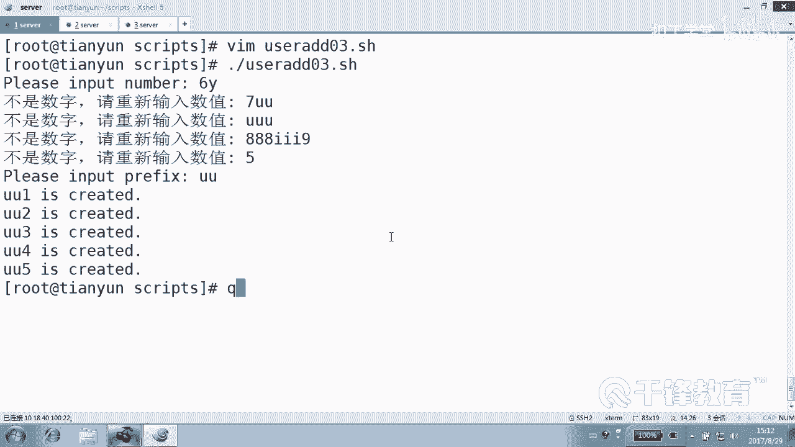

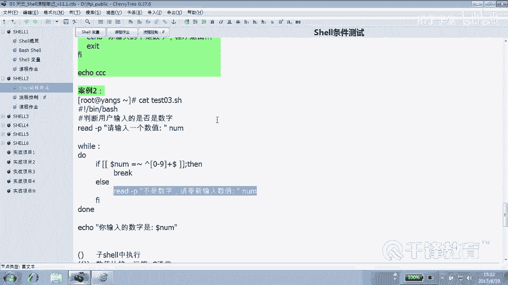

### 3. 大括号 `{}` 与 `${}`
*   **`{命令1; 命令2;}`**：用于**命令组合**，在当前Shell中顺序执行所有命令。注意命令之间用分号分隔。
*   **`${变量名}`**：用于**引用变量**，尤其在变量名需要明确边界时必不可少。它还支持各种**变量内容的替换和操作**，如 `${var:-default}`（变量为空时使用默认值）。

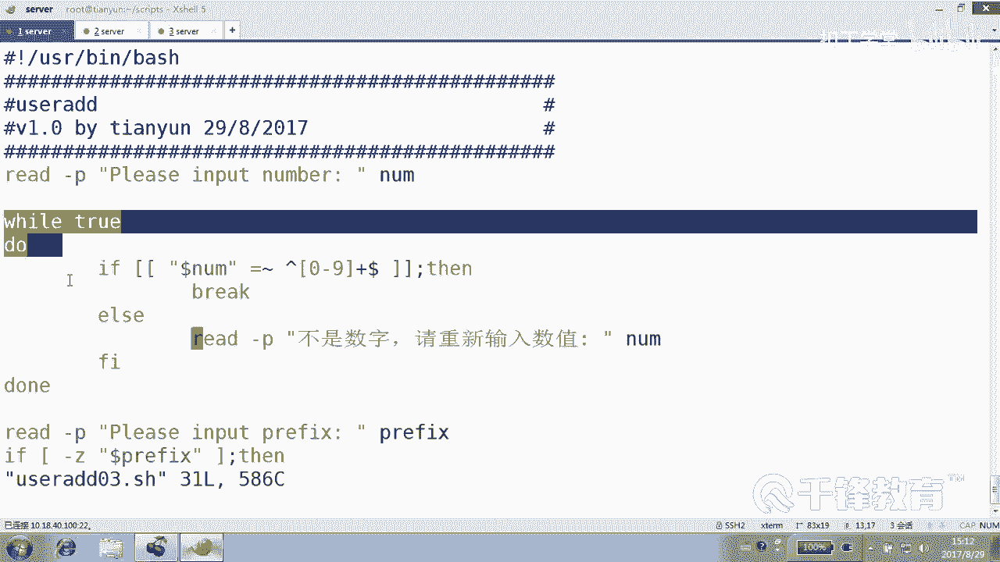

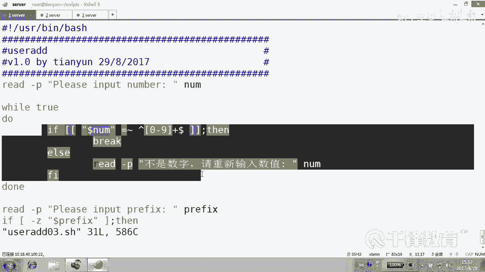

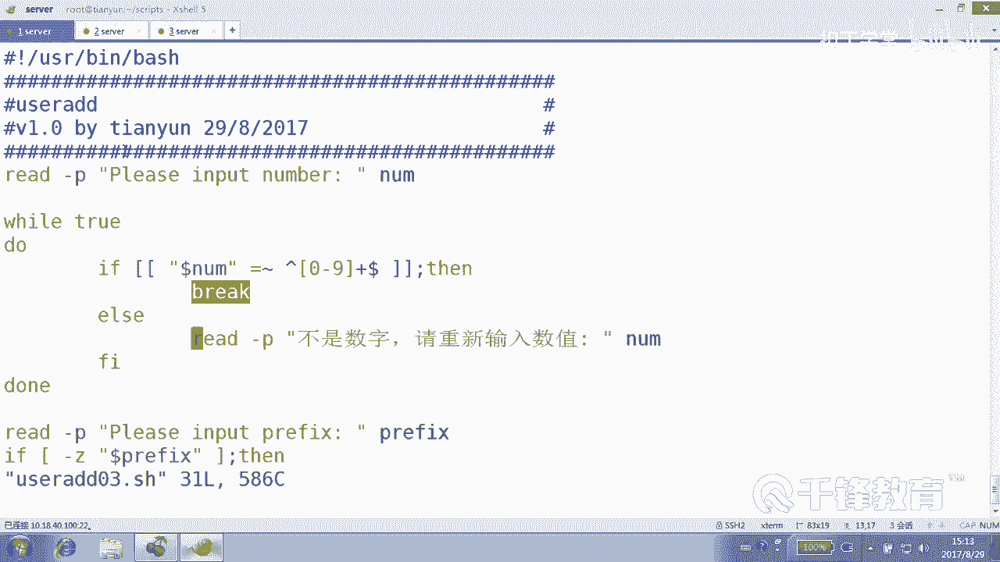

### 4. 方括号 `[]` 与 `[[]]`
*   **`[ 表达式 ]`** 或 **`test 表达式`**：用于**条件测试**，可测试文件属性、比较整数和字符串。
    ```bash
    [ -d "/tmp" ] # 测试 /tmp 是否为目录
    [ "$a" -gt "$b" ] # 测试整数 a 是否大于 b
    ```
*   **`[[ 表达式 ]]`**：功能更强的条件测试，支持**模式匹配（通配符）** 和**正则表达式匹配**。逻辑组合也更直观，使用 `&&` 和 `||`。
    ```bash
    [[ "$file" == *.txt ]] # 模式匹配，判断文件是否以 .txt 结尾
    [[ "$string" =~ ^[0-9]+$ ]] # 正则匹配，判断字符串是否全为数字
    # 组合条件
    [[ -d "$dir" && -r "$dir" ]] # 判断是目录且可读
    ```

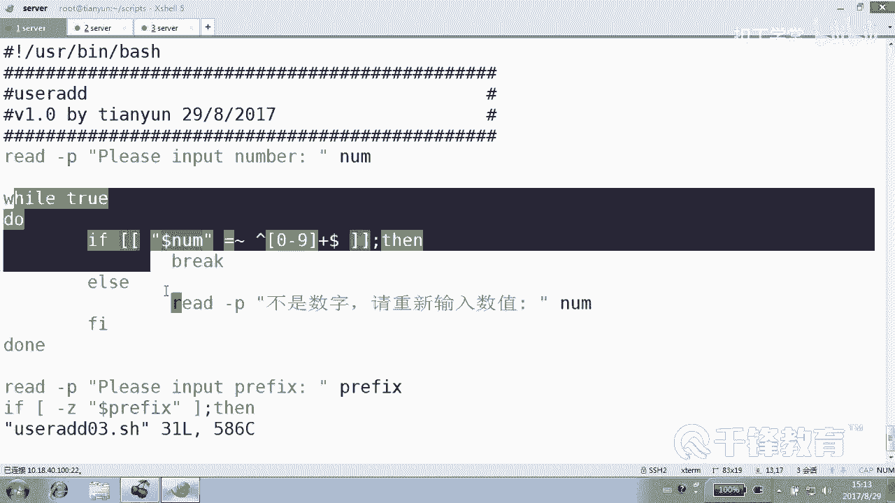

### 5. 等号与波浪号 `=~`
*   **`[[ 字符串 =~ 正则表达式 ]]`**：专门在双中括号 `[[]]` 内用于**正则表达式匹配**。

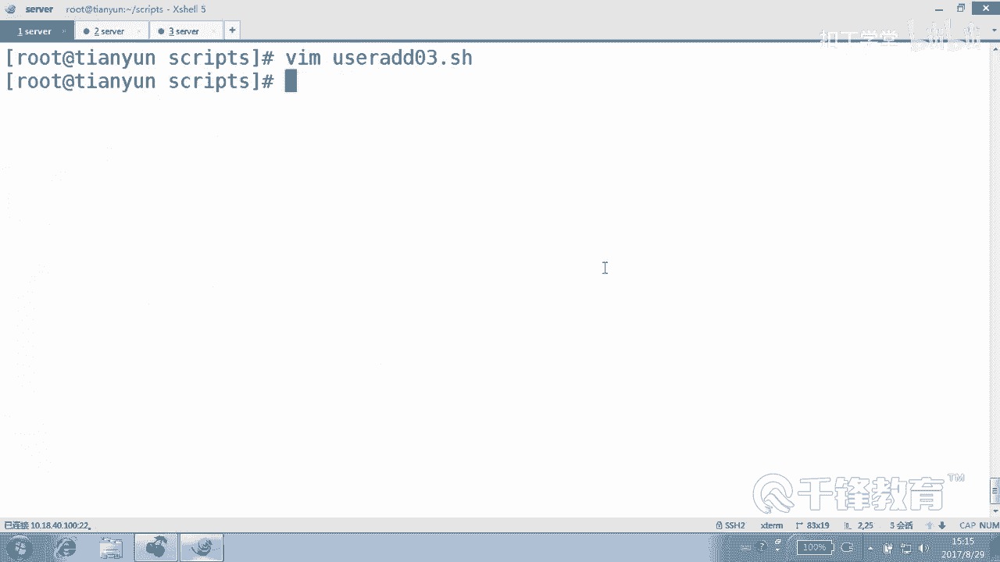

## 脚本执行方式与权限

理解脚本的不同执行方式及其对权限的要求也很重要。

*   **`/path/to/script.sh`** 或 **`./script.sh`**（路径执行）：需要在**子Shell**中执行，脚本文件**必须具有执行权限**。
*   **`bash script.sh`** 或 **`sh script.sh`**（指定解释器）：在**子Shell**中执行，脚本文件**不需要执行权限**。
*   **`. script.sh`** 或 **`source script.sh`**（点命令或source）：在**当前Shell**中执行，脚本中定义的变量和函数会影响当前环境，脚本文件**不需要执行权限**。这也是为什么修改 `~/.bashrc` 或 `/etc/profile` 后，需要执行 `source` 命令使其在当前Shell生效的原因。

## 脚本调试技巧

编写脚本时，调试是必不可少的环节。

*   **`bash -n script.sh`**：检查脚本语法错误，不实际执行。
*   **`bash -vx script.sh`**：以调试模式执行脚本。`-v` 打印读取的每一行命令，`-x` 打印命令执行过程中的每一个扩展后的命令和参数，便于追踪执行流程。

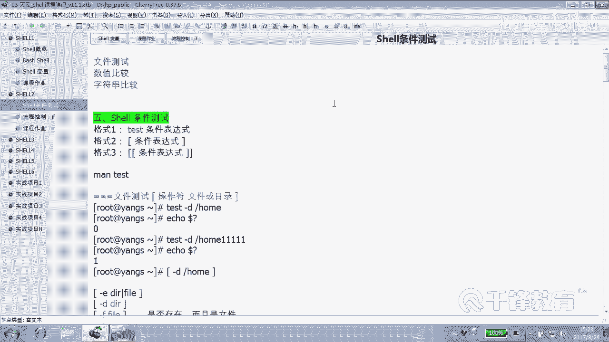

本节课中我们一起学习了Shell脚本中各种关键符号的用途，包括命令执行与替换 `()`、`$()`，变量操作 `${}`，条件测试 `[]`、`[[]]`，以及脚本执行方式和调试技巧。掌握这些符号是理解他人脚本和编写健壮、高效脚本的基石。请务必结合之前的变量和条件测试知识，多加练习以巩固理解。