# Shell脚本自动化编程实战：P8：3.2 条件测试 - 文件测试 📂


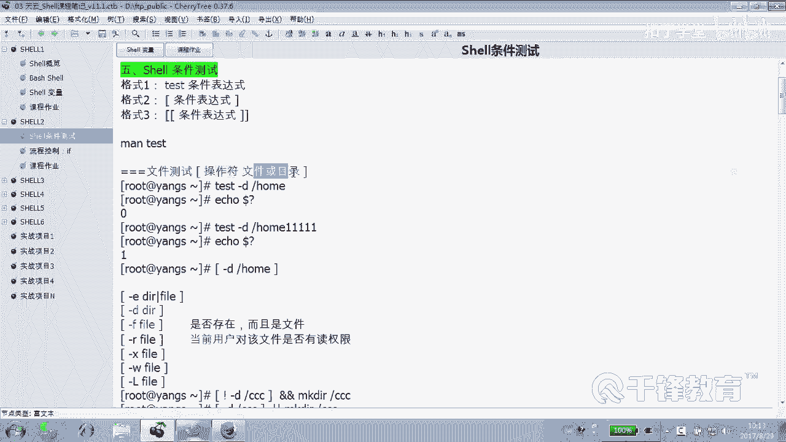

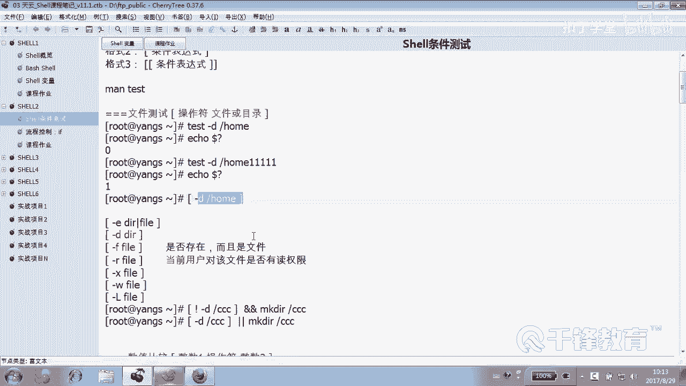

在本节课中，我们将要学习Shell脚本中条件测试的第一种类型：**文件测试**。文件测试用于检查文件或目录的各种属性，例如是否存在、类型、权限等，是编写健壮脚本的基础。

上一节我们介绍了条件测试的概览，本节中我们具体来看看文件测试的语法、常用操作符以及实际应用。

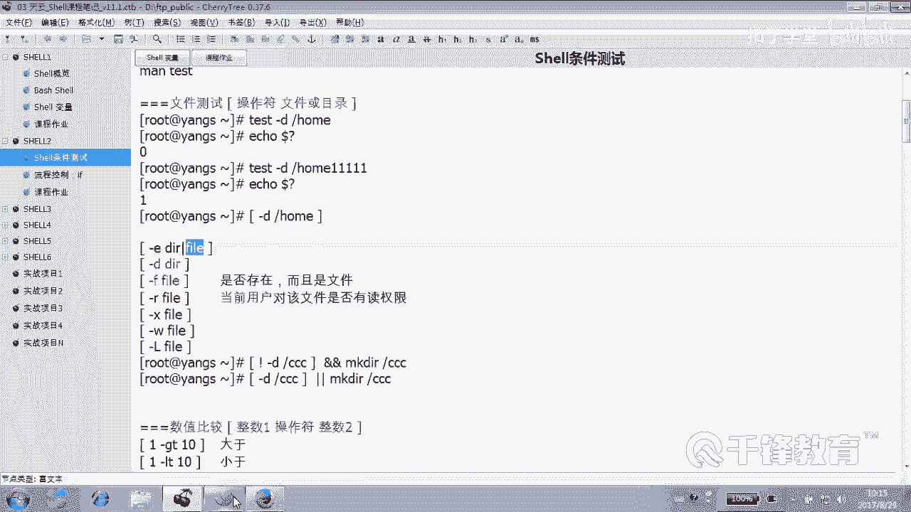

## 文件测试语法

文件测试的基本语法非常简单，其格式如下：

```
[ 操作符 文件或目录 ]
```

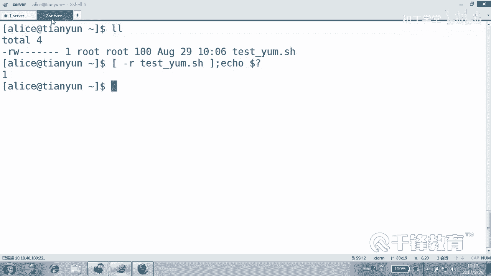

或者使用 `test` 命令：

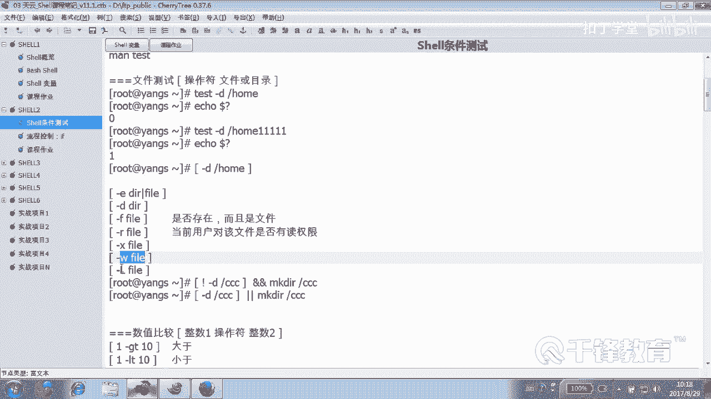

```
test 操作符 文件或目录
```

其中，`操作符`用于指定要测试的属性，后面跟上需要检查的文件或目录的路径。

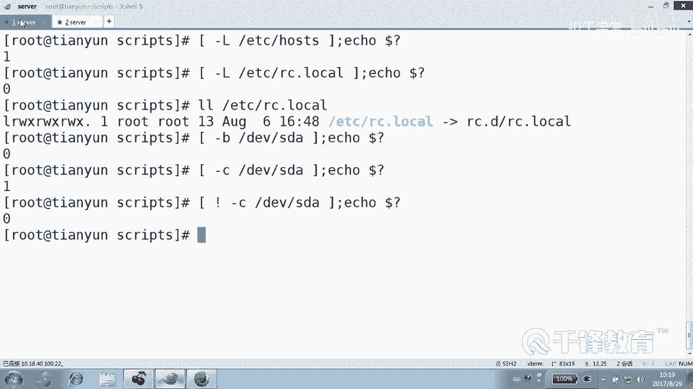

## 常用文件测试操作符

以下是文件测试中一些最常用的操作符及其含义：

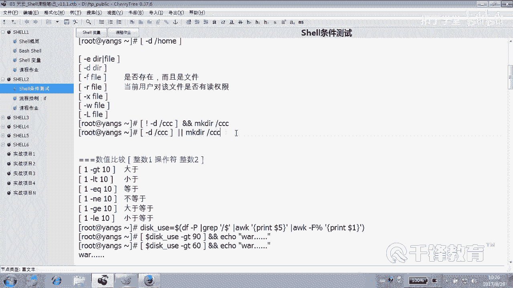

*   **`-e`**：测试文件或目录**是否存在**。只要对象存在，条件即为真。
*   **`-d`**：测试指定路径是否为一个**目录**。
*   **`-f`**：测试指定路径是否为一个**普通文件**。
*   **`-r`**：测试**当前用户**对指定文件是否拥有**读**权限。
*   **`-w`**：测试**当前用户**对指定文件是否拥有**写**权限。
*   **`-x`**：测试**当前用户**对指定文件是否拥有**执行**权限。
*   **`-L`**：测试指定文件是否为一个**符号链接**文件。
*   **`-b`**：测试指定文件是否为一个**块设备**文件。
*   **`-c`**：测试指定文件是否为一个**字符设备**文件。

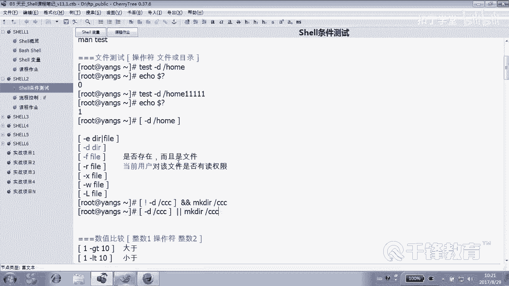

**重要提示**：权限测试操作符（如 `-r`, `-w`, `-x`）测试的是**执行此命令的当前用户**对该文件的权限，与文件本身的属主或属组权限无关。

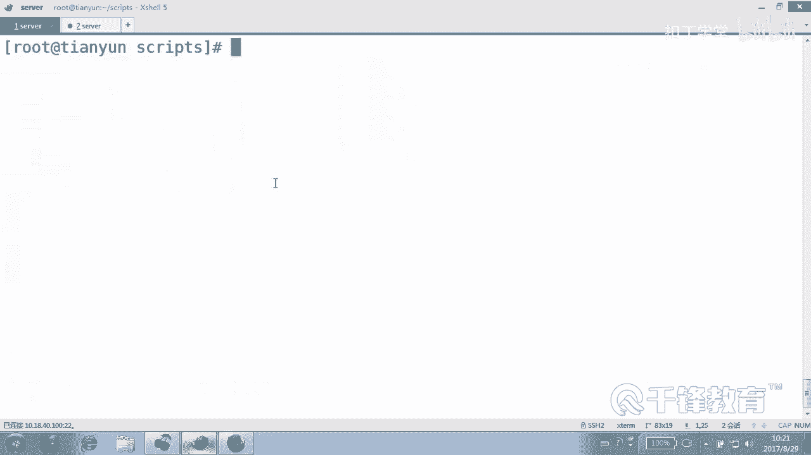

## 文件测试实例解析

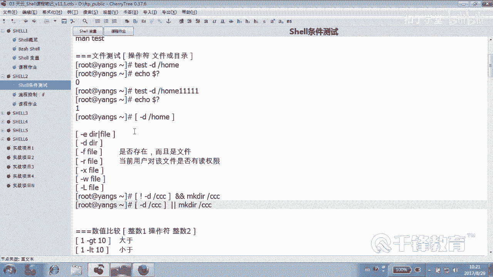

让我们通过一些具体的例子来理解文件测试的用法。

**示例1：检查目录是否存在并创建**

这是一个非常常见的场景：如果某个目录不存在，则创建它。

```bash
if [ ! -d "/tmp/mydir" ]; then
    mkdir /tmp/mydir
fi
```

这段代码解读如下：
*   `[ ! -d "/tmp/mydir" ]`：测试 `/tmp/mydir` **不是**一个目录。
*   如果条件为真（即目录不存在），则执行 `mkdir` 命令创建它。
*   如果条件为假（即目录已存在），则跳过创建步骤。

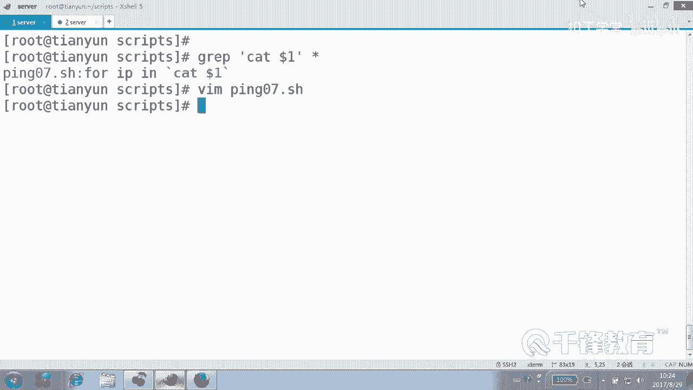

**示例2：在脚本中应用文件测试**

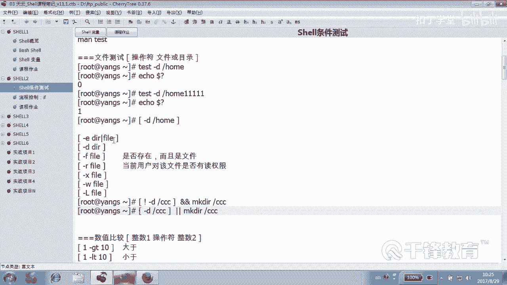

回顾我们之前编写的脚本，文件测试被广泛应用。例如，检查传入脚本的参数是否是一个文件：

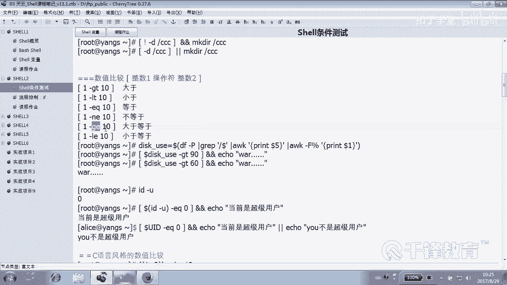

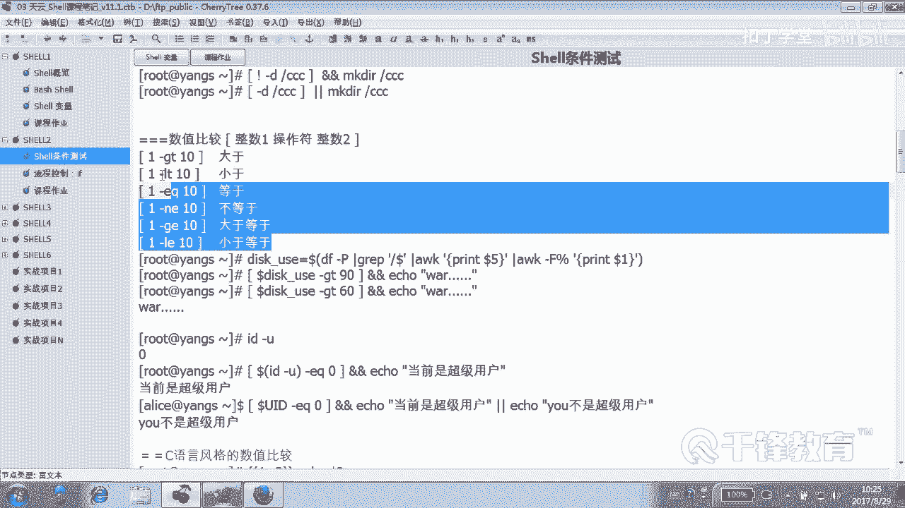

```bash
if [ -f "$1" ]; then
    # 如果第一个参数是文件，则执行某些操作
    cat "$1"
else
    echo "错误：未提供文件或文件不存在。"
    exit 1
fi
```

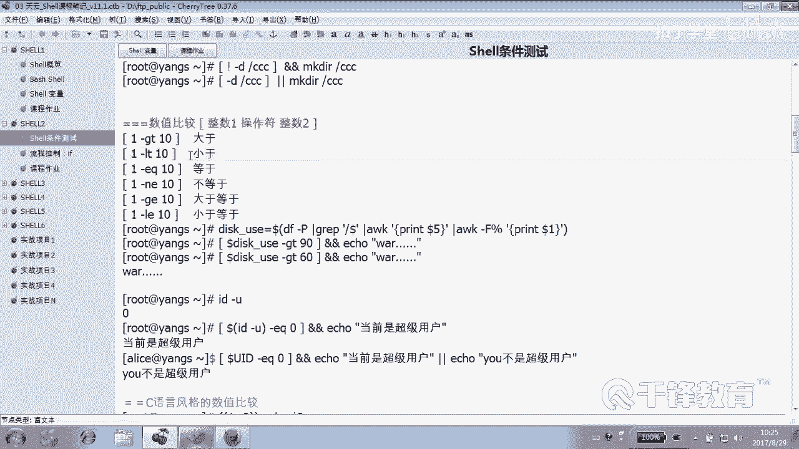

在这个例子中：
*   `"$1"` 代表传递给脚本的第一个参数。
*   `-f "$1"` 测试这个参数是否是一个已存在的普通文件。
*   根据测试结果决定是读取文件内容还是报错退出。

**示例3：综合应用 - 创建用户脚本**

下面是一个结合了数值比较和命令返回值判断的脚本示例，其功能是提示用户输入用户名，如果用户不存在则创建，并反馈创建结果。

```bash
#!/bin/bash
# 提示用户输入用户名
read -p "请输入一个用户名: " username

# 判断用户是否存在
if id "$username" &> /dev/null; then
    echo "用户 $username 已存在。"
else
    # 创建用户
    useradd "$username"
    # 判断上一条命令（useradd）是否执行成功
    if [ $? -eq 0 ]; then
        echo "用户 $username 创建成功。"
    else
        echo "用户 $username 创建失败。"
    fi
fi
```

脚本解析：
1.  `id "$username"` 命令用于检查用户是否存在。`&> /dev/null` 将命令的输出和错误都丢弃。
2.  `if` 语句直接判断 `id` 命令的返回值。返回值为0表示成功（用户存在），非0表示失败（用户不存在）。
3.  如果用户不存在，则使用 `useradd` 创建。
4.  `$?` 是一个特殊变量，用于获取**上一条命令**的退出状态码。`[ $? -eq 0 ]` 用于判断 `useradd` 命令是否执行成功。

## 数值比较的关联应用

虽然本节重点是文件测试，但在实际脚本中，它常与其他测试结合使用。例如，监控磁盘使用率的脚本会用到数值比较：

```bash
#!/bin/bash
# 获取根分区磁盘使用率（去掉百分号）
disk_usage=$(df -h / | awk 'NR==2 {print $5}' | tr -d '%')

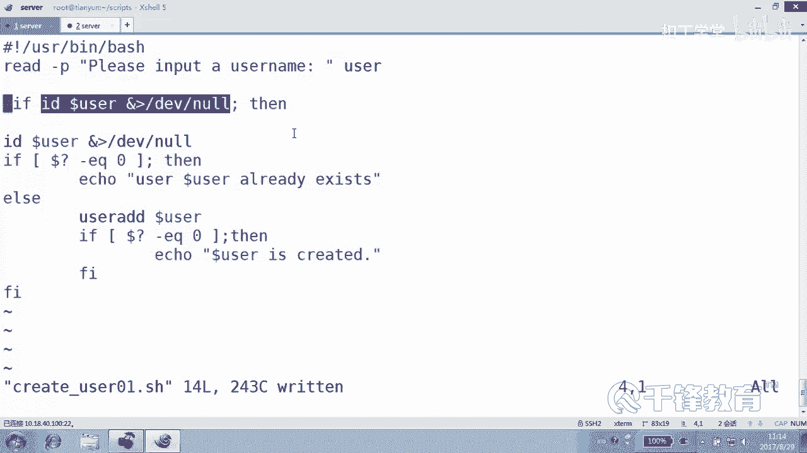

# 判断使用率是否超过90%
if [ $disk_usage -gt 90 ]; then
    echo "警告：根分区磁盘使用率已超过90%！" | mail -s "磁盘警报" alice@example.com
fi
```

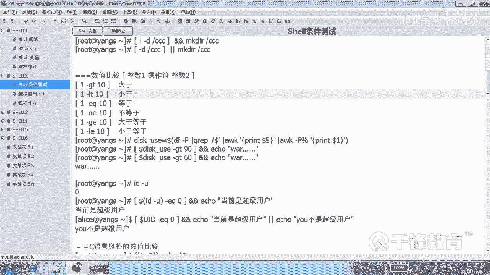

在这个例子中：
*   `df -h /` 获取根分区信息。
*   `awk` 和 `tr` 命令用于提取并清理出纯数字的使用率。
*   `[ $disk_usage -gt 90 ]` 是数值比较，判断使用率是否大于90。
*   如果条件为真，则通过邮件发送警报。

## 总结

本节课中我们一起学习了Shell条件测试中的**文件测试**。

我们掌握了文件测试的基本语法 `[ 操作符 文件路径 ]`，并熟悉了 `-e`（存在）、`-d`（目录）、`-f`（文件）、`-r`（读权限）等核心操作符。关键在于理解权限测试是针对**当前执行用户**的，并且文件测试常与 `if` 语句结合，用于在脚本中做出逻辑判断，例如检查文件是否存在后再进行读写操作，或检查目录是否存在后再决定是否创建。

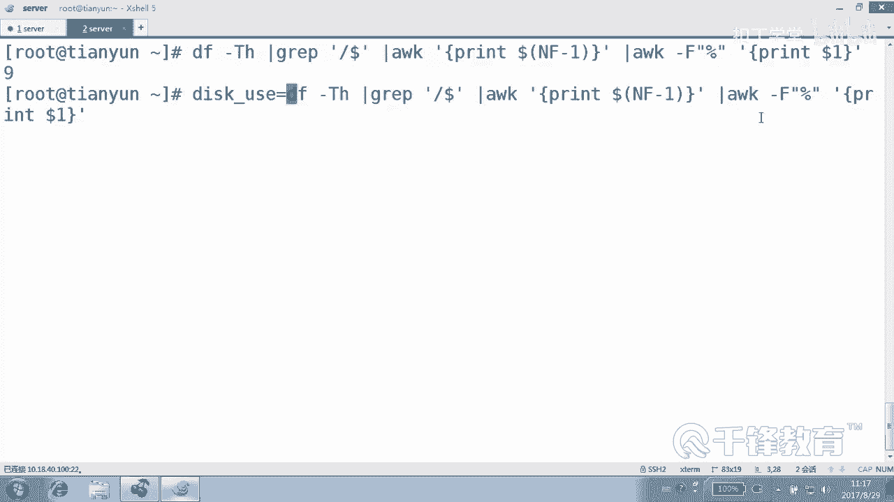

通过将文件测试与之前学习的变量、命令替换以及后续的流程控制结合，我们可以编写出更加健壮和自动化的Shell脚本。