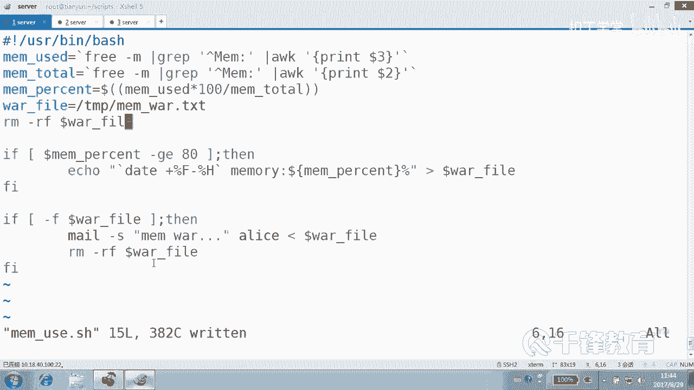
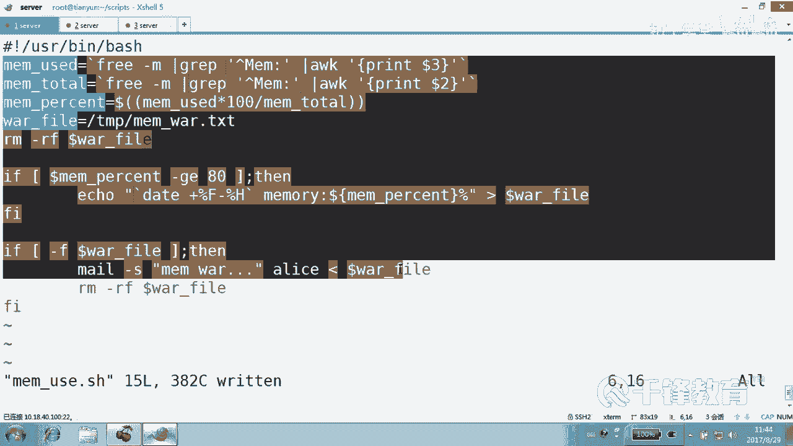
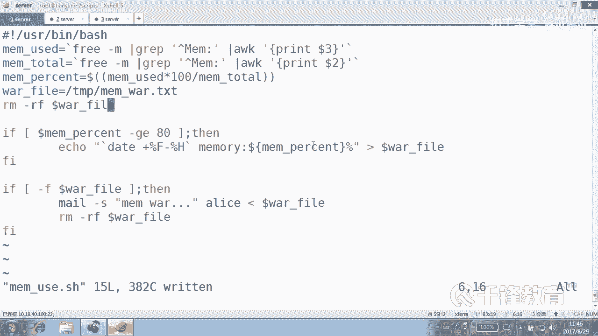

# Shell脚本自动化编程实战：P9：3.3 条件测试 内存磁盘使用告警 📊

在本节课中，我们将学习如何利用Shell脚本进行条件测试，并编写一个实用的监控脚本，用于在内存或磁盘使用率过高时自动发送告警邮件。我们将从获取系统资源使用率开始，逐步构建完整的监控逻辑。

## 概述

我们将通过两个实例来学习：磁盘使用率监控和内存使用率监控。核心是使用条件测试语句（`if`）判断资源使用率是否超过阈值，如果超过，则通过`mail`命令发送告警邮件。我们会学习如何获取系统数据、进行数值比较以及处理脚本中的一些细节问题。

---

## 磁盘使用率监控脚本 💾

上一节我们介绍了条件测试的基本语法，本节中我们来看看如何将其应用于实际监控。

首先，我们需要获取当前磁盘的使用率。可以使用`df`命令配合`grep`和`awk`来提取所需数据。

以下是获取根分区使用率的命令：
```bash
disk_use=`df | grep ‘/$’ | awk ‘{print $5}’ | sed ‘s/%//g’`
```
这条命令的执行过程是：
1.  `df` 列出磁盘使用情况。
2.  `grep ‘/$’` 过滤出根分区所在行。
3.  `awk ‘{print $5}’` 提取使用率百分比所在的第五列。
4.  `sed ‘s/%//g’` 删除百分号，得到一个纯数字。

获得磁盘使用率后，就可以进行条件判断。如果使用率大于等于90%，则触发告警。

以下是发送告警邮件的命令结构：
```bash
if [ $disk_use -ge 90 ]; then
    echo “$(date +%F-%H) 磁盘使用率达到 ${disk_use}%” | mail -s “Disk Warning” $mail_user
fi
```
这段代码的含义是：
*   `[ $disk_use -ge 90 ]`：测试变量`$disk_use`的值是否大于等于90。
*   `echo “…”`：生成包含当前时间和磁盘使用率的告警正文。
*   `mail -s “Disk Warning” $mail_user`：以“Disk Warning”为主题，将正文发送给变量`$mail_user`指定的用户。

我们可以将上述逻辑整合成一个脚本`/script/disk_use.sh`，并通过`crontab`设置计划任务，例如每隔5分钟执行一次，实现自动化监控。
```bash
*/5 * * * * /script/disk_use.sh
```

---

## 内存使用率监控脚本 🧠

接下来，我们看看内存使用率的监控。思路与磁盘监控类似，但获取数据的方法不同。

以下是计算内存使用百分比的命令：
```bash
mem_use=$(free -m | grep Mem | awk ‘{print $3}’)
mem_total=$(free -m | grep Mem | awk ‘{print $2}’)
mem_percent=$((mem_use*100/mem_total))
```
这段代码的执行过程是：
1.  使用`free -m`命令以MB为单位查看内存信息。
2.  用`grep Mem`过滤出内存总计行。
3.  分别用`awk`提取已用内存（第三列）和总内存（第二列）。
4.  通过公式 **`已用内存 * 100 / 总内存`** 计算出使用百分比。

在条件测试部分，我们展示另一种风格（C语言风格）的数值比较：
```bash
if (( mem_percent > 80 )); then
    echo “$(date +%F-%H) 内存使用率达到 ${mem_percent}%” > /tmp/mem_warning.txt
fi
```
这里`(( mem_percent > 80 ))`就是一种C语言风格的测试语句，判断`mem_percent`是否大于80。

如果判断需要告警，脚本会将告警信息写入一个临时文件`/tmp/mem_warning.txt`。然后，通过检查这个文件是否存在来决定是否发送邮件。
```bash
warning_file=“/tmp/mem_warning.txt”
if [ -f $warning_file ]; then
    mail -s “Memory Warning” $mail_user < $warning_file
    rm -f $warning_file # 发送后删除临时文件
fi
```
**注意细节**：发送邮件后，必须删除临时告警文件`rm -f $warning_file`，否则下次脚本执行时，即使内存使用率正常，也会因为该文件存在而重复发送告警。这是一种良好的“清理现场”习惯。

---

## 脚本调试与编写建议 🐛

在编写和测试脚本时，如果遇到问题，可以使用`bash -x`或`sh -x`来调试脚本。
```bash
bash -x /script/your_script.sh
```
这个命令会显示脚本执行过程中的每一行命令及其展开后的样子，非常有助于定位问题。

关于脚本编写，有以下建议：
1.  **保持风格统一**：在数值比较时，选择`[ $a -gt $b ]`（Shell风格）或`(( a > b ))`（C风格）其中一种并坚持使用，避免混用。
2.  **注意符号配对**：仔细检查引号、括号是否成对出现。
3.  **使用变量**：将邮箱地址、阈值、文件路径等定义为变量，方便修改和维护。
4.  **语法简单，知识关键**：Shell脚本的语法（如`if`语句）本身并不复杂，难点在于如何灵活组合Linux命令（如`df`, `free`, `awk`, `mail`）来实现特定管理功能。这需要对Linux系统本身有足够的了解。

---





## 总结

本节课中我们一起学习了如何编写磁盘和内存使用率的监控告警脚本。
*   我们使用`df`和`free`命令获取系统资源数据。
*   我们利用`awk`、`grep`等工具对数据进行提取和加工。
*   我们使用 **`if`条件测试语句** 进行数值比较，判断是否达到告警阈值。
*   我们使用 **`mail`命令** 在条件满足时发送告警邮件。
*   我们讨论了通过**计划任务`crontab`** 实现脚本自动周期执行。
*   我们还强调了脚本调试的方法和编写时需要注意的细节，如及时清理临时文件。



通过这两个实例，你将掌握利用Shell脚本进行系统自动化监控的基本方法，并可以将其思路扩展到监控CPU负载、网络连接数等其他系统指标。