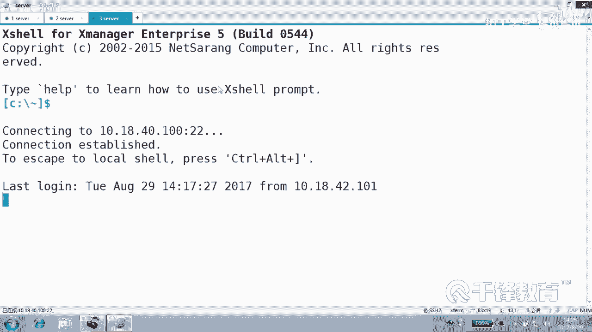
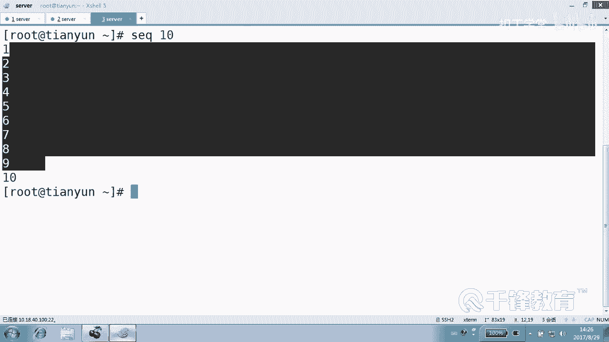
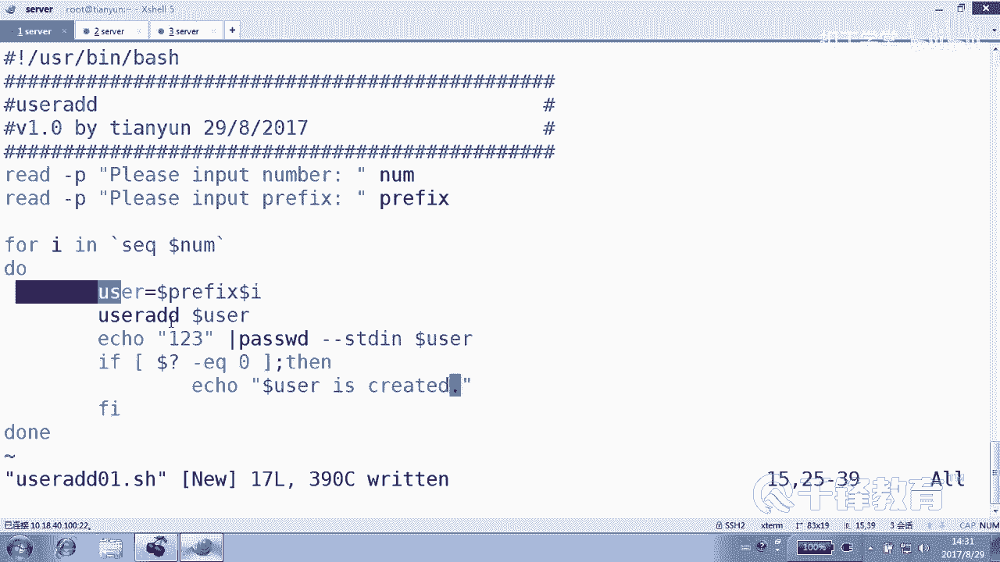
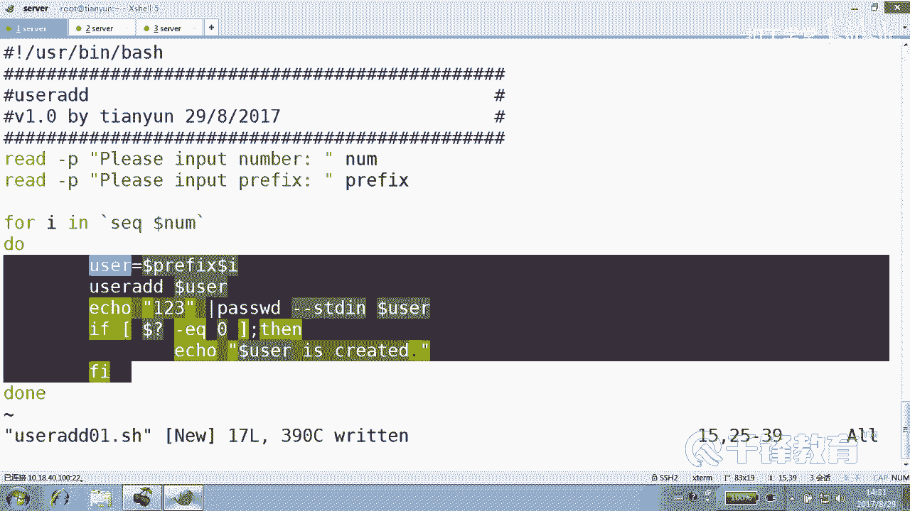
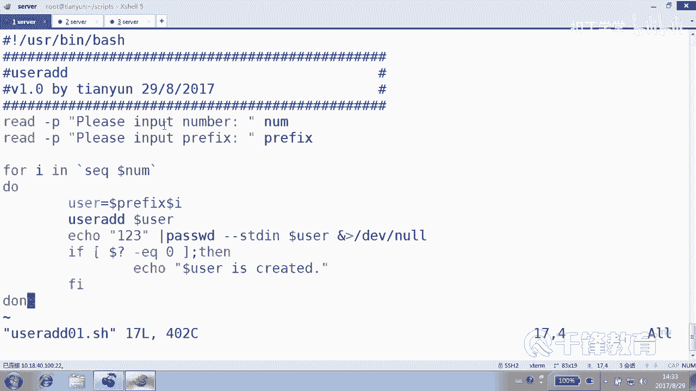
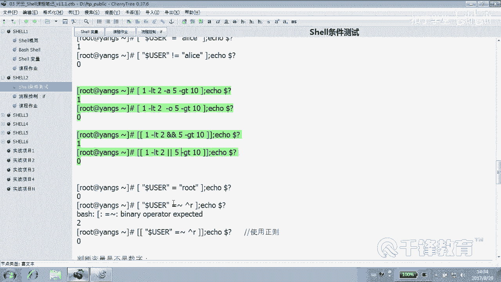
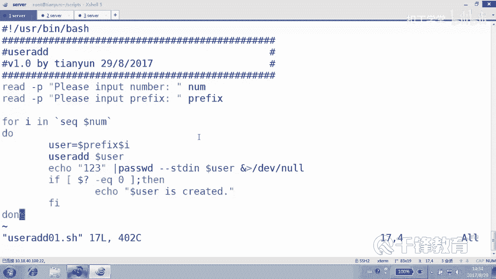

# 千锋扣丁学堂Linux云计算系列：Shell脚本自动化编程实战视频教程 - P10：3.4 条件测试 按套路出牌 创建用户 - 扣丁学堂 - BV1SE411q7vK

在前面我们去了解了这个关于数值的一个比较，主要是整数是吧？还有呢就是文件的一个测试。另外呢就是四五串比较这一块。字符串比较用到的是这个等号或者是。双等号或者是。叹号加等号不等，对不对？主要是这个了。好。

那么字母差比较呢其实非常简单。😊，比如说我们在这个这块看到当前用户是不是root是吧？😊，如果是入的话呢。条件为真。否则的话条就会讲，是不是？😊，但这边请大家注意。在使用字符串比较的时候。

请大家特别是给这个什么字符串要加双引号。字符串比较其实本身来讲挺简单的。你看我们这里给大家一个例子。😊，dous这是一个环境变量是吧？😊，等于root。Ele问号。是正据的吧。条件为真，对吗？嗯，O。

当前用户是爱丽。条件我也讲，对吧？😊，都没问题。当前疑或不是爱丽丝呢？是是不是不是爱丽丝。是的，所以呢维真确实不是爱丽丝是吧？这都没问题。😊，那么现在有一个问题。看好了。现在。😊。

有没有一个叫user的变量？或叫user name的变量，有吗？😡，照这么整的话，肯定是没有了，因为我已经把它删掉了。😊，好，我们来测试dollar。User name。等于什么？Root。

iccle到了问号，各位这个应该是什么结果？😊，啊。这应该应该是。结果是围巾还是。回家。干脆啥也不是，直接语法错误。因为这个没有这个变量，看到吗？是因没有这个变量。没有这个变量。

是不是有点相当于这种感觉一样，就是。😊，他。没有这个变量，是不是就没有值啊？😡，所以他直接报语法错误。那么真的有时候我们确实可能会。忘了去什么。或者没有在脚本当中可能没有这个变量。

但是我们也不希望他报语法错误，是不是？怎么做呢？使用。引号把它引起来。对不对？对，视为假，但是呢引号引起来。而且呢我们通常比较习惯这种方式都是用引号引起来。😊，所以字符串变量请大家尽量的使用什么引号。

将变量或者是字符串引起来。以避免一些不要不必要的麻烦。像刚才那种情况。好，那另外呢。😊，我们再看一下字符串这个比较的时候，有一个杠Z和杠N。杠Z和杠N杠Z什么意思？长度是zero是0吧，杠N呢不是0。

好okK这边我们定义了一个变量叫VR变量。😊，这个变量长度是几？其实你加不加双引号都是一样。😊，长度是零，怎么看？我们VR还记得这种看法吗？😊，长度是不是零？那我们测一下杠Z。😊，dVR它的长度是零吗？

是零吗？是不是零？所以OK正确的。😊，它的长度。不是您，对吗？不是你。不对呀，这个。你要说上面这个是零的话，我就认了，它不是零，它它它它也对啊。😡，注意到了吗？哎，你们认可下面这种还是下面这种？😡。

我们很清楚，它的长度确实就是0。0一个。你要说这个变量是0。对，确实是0。你要说它不是零，我们认为不对。😡，好吗？其实你注意看一下差别在哪儿呢？引号的问题。不是您是您，对吧？它不是您对吗？对。啊。

不他不不对不对啊，它是0。好，所以在于引号。所以你要不加引号的话，得到错误答案，你也别怪我ok。😊，字符串变量养成一个习惯，给变量加上什么双引号，这是一个重要提示。😊。

其实下面呢这一堆呢就是想告诉你这个道理，你看VRE的变量长度是几？😊，长度是3，眼睛看出来对吧？V2呢有没有负值吧？😊，这个编案有没有定义过？有有定义过V23变量压根儿就没有出现过。

我们看13个20个3显示也是0个是吧，它是0吗？他是长度是您吗是？错了，你说错了是吧？😡，它的长度。是您吗？你说对了是吧？它的长度适0吗？对，是0三也是0吧。它的长度不是你。它长度不是零成立吗？

成立它的长度不是0。他说错了是吧，一个错误答案，它的长度不是0。😊，别说错了，所以呢我们看到的是什么。😊，变量为空或者是为未定义，都是什么？都是长度都是0。明白。没有为空嘛，或者为定义都是0。好。

下面这个大家可能都看得懂，对吧？😊，当这个user变量是不是root？user变量是不是爱ice，user变量是不是爱ice，明白。😊，当然我们也可以怎么做？我们也可以这样做，就是。加杠A。

我们看到在慢里面在慢的时候，我们在前面慢的时候，各位也看到mantest是吧？这边呢表达式之间可以加上这个。😊，按A或者是什么O。并且或者是什么。或者。是不是只要条件都为真才成立这两个条件或多个条件。

然后或者是其中一个条件呢？😊，为针就可以，是不是好？所以我们可以这样去做，看比如说第一个表达式。一。小于2吗？并且五大于十吗？成立吗？一小于2，没错，五大于10呢。不对，所以条件最后为甲。

就是没有为fse是吧？一小于2。无也。或者。或者是五大于等于10，对吗？没错，只要有一个条件为真就可以，是不是一小于等于2，不是小于2或并且哎注意这什么？并且啊。😊。

注意现在符号换了换成一个什么两个方括号，看到吗？如果是两个方括号在写的时候呢，就不再是杠A或者杠O这种写法。两个方括号里面就要用到end的end。😊，就两个条件必须为帧，或者是呢竖线竖线两个条件。

其中一个为真就可以。好，有同学说是不是方括号就这么点区别呢？😊，嗯，那倒不是。好，下面我们举一个例子。这个例子呢。来创建一个用户。来创建一个用户，这个创建用户啊。我们要求什么呢？我们要求用户输入一个。

创建用户的数量。就是用户告诉我说要创建10个用户。出现10个，对它有它的定义。第二，给一个。😊，我们要要求一个laer。有用户来输入，比方说10个是吧？第二呢。我们要求用户输入一个perfi，就是前缀。

比方叫。User。那连起来就会是user一，user2，user3，按照它这个定义的数字，然后来。创建这个账号。好，我们来做这样一个小例子。然后同时呢来说明什么呢？咱们的这个。😊。

刚才我们的这个数值呃奏串比较这个这一块儿。我们通过这个例子来给大家讲一下。好，我们还没有写过用户创建例子是吧？😊，那就叫01吧，好吧，SH。😊，好，下面我们来编写一个user add01的一个脚本。呃。

首先呢是定义它的解释器，U色下的并下的bsh。那么实际上我们想告诉各位的是，这个脚本呢，你在写的时候一定要很清晰的在前面呢来表述你这个脚本是干什么的，对不对？好，我们这个脚本是创建用户的。😊，以及呢。

还有这个脚本的，比方说版本是V1。0版本。然后是by由谁创建的？然后以及呢这个脚本呢创建的时间是在。😊，298月是吧。20178月29好，用你自己的方法来写就可以。那么也就是说。

当别人或者自己打开一个脚本的时候，你应该很清楚的知道，就是通过这段注释，你能够很清楚的知道什么？你这个脚本的一些信息，明白吗？😊，而不是。别人打开你脚本呢，要自己去阅读每一行。

因为你的脚本可能要给公司其他人使用。当然甚至可以给这些注释呢加上什么，加上一个。😊，加上像这样的一些符号。这都没关系是吧？😊，明白吗？这个你可以把你的作者信息。

还有脚本的一些这个说明都写在这个注释当中去。😊，注意除了第一行是我们的解释器以外，其他都是什么？😊，都是注释说明，明白，让别人能够很直观的知道你这个脚本的一些传递的一些信息。好，现在我再说一遍。

我们想要怎么做。😊，我们想要用户输入一个。数字。然后并且呢还要输一个用户的前缀，然后我把它合起来，创建一个批量的创建账号。当然这个时候我们必须会用到循环，没办法，循环虽然还没有特别讲过是吧？

但是还要用一下。😊，怎么让用户输入数字？😡，你也。锐的吧，刚P。输入什么？输入 number。这个输入number我们就直接给这个变量。number吧或者叫NUM都可以。😊，好。那么然后紧接着呢我们来。

😊，让用户输入前缀杠P。前缀就是我们用户的那个叫user一user2那个前缀，好吧。😊，我们希望创意100个用户前缀的统一一下，这个就叫perfix。一般profix就叫前缀。

SUFX叫后缀suffix后缀看到吗？好，前缀。好，我们把每个人想的都是那种比较善良的那种人，就是他是正规输入，常规输入，好吧。😊，这人呢也有不善良的。

我们先把人想的美好美好的OK然后紧接着呢我们来作循环。😊，4。呃，这个循环呢我再次强调一遍，可能还没有讲，不过没关系forIE。😊，然后对一个范围呃多少个一个范围，这个范围肯定跟它这个数字有关系。

对不对？这个范围呢我们先认识一个我们先来认识一个东西就是。😊，我们怎样来产生一个数字训练？可以这样吗？可以吗？那问一下，那这边可不可以这样从一到dollar什么number可不可以？就是一开始。

然后到他输的那个十可不可以？系い。嗯，想法是可以的。但实际上不可以。嗯，为了给你证明一下，我们为了给你证明一下，我这边还是。😊，还是要证明一下，怎么证明看。😊，我进到一个我进到TMP里面去吧。

这里没有没有什么东西吧，touch。😊，我先定一个变量叫number10，好吧，然后我touch在fill多少？一到刀了什么？Number。没有错吧。他好像解释出来的那个十看到吗？

但是并没有按照我们所预期的那个执行。如果你这儿纯粹写个诗呢。可以后。那真的是10个，但是呢它没有办法在这里面使用变量，看到吗？变量没法在这里面用。换句话，这条路走不通，在这里面你不能出现变量。

但是我们这边需不需要变量？😡，从一到什么告诉你那个数字吧，但这没有走不通啊，换一个方法。😡，有一个。Sequence。训练数字训练。好，遇到一个min你，不会的话怎么办？先慢一下SEQ这讲过是吧？😊。

好，他说干嘛？打印一个序列，什么序列呢？数字序列方法很简单，SEQ选项last这是最后一个数。😊，嗯，这个很简单，比如说。😊。

SEQ10。30个。然后呢，或者是指定什么first last first意思就是说。

1到10是吧。第一个数和还有一个什么？那如果我们采用SEQ1到10没问题。当中各位看还有一个什么叫increment。自增或者叫不偿。就每次跨多远。默认是跨一小步，一再加一步。如果我们来个二呢。😊。

13579看到了吗？各位。就13579。好，当然一般我们没有那么复杂，我们使用什么？😊，就是定一个数字就可以1到10是不是就可以了？😊，或者干脆就一。就直接1是不是可以？但这边呢各位。啊，这个没问题。

我们来写怎么写？😊，换了换了吧。😊，注意SEQ当什么NUM这样写是不行的。😊，这样这是一条命令，是不是先要执行，所以我们加上什么？😊，反反引后来执行，然后do down这当中是循环要做的事情。

这个I的值呢分别就是几？第一次是一，第二次是2，直到数到几。示威者。嗯。好，那么怎么创建用户，相信大家都会user AD是吗？😊，当然可以这样写，看user AD等于那个叫什么？😊。

dollar perfectfi再加dollar的吗？😡，哎，是不是创建一个优酷前缀，比如叫做user一user2。这个写法没有问题，但是我我不是很喜欢这种写法，因为你看在这里面出现的非常麻烦。

紧接着我们要设密码，怎么设置？😊，如果想设密码的话，就是icle一个密码，然后123是吧？然后管道给pass word杠杠3D后面加什么dollar。😊，perfi当了什么？哎，能看懂吗？

就是我创建一个账号叫什么？叫假如说用户输的是AA，那就是AA。😊，是不是第一次是A一啊？然后紧接着呢，把密码给它设置为什么123，但是你注意到没有？

我在下面是不是很多地方用到的这个很很看起来很痛苦的变量。😊，很痛苦吧。那怎么办？建议是这样的。建议定义一个变量叫什么dollarPREFX dollar什么I下面始终就不再使用它了。user看到吗？

就是我们这个变量的定义范围是哪定义的？不是在脚本之外的，是在循环的什么内部，每次循环这个变量的值是会不会不被会被整个换掉。😊，对，是吧，没信号会换掉。好了，这个那我们如果想判断一下呢。

如果看这个时候报语法错误了，看到了吗？😊，空格赶快把这个结果先给它写完。如果。刀轮问号EQ等于什么0，那我们就注意看缩进啊。😊，这里的缩进tableable键，缩进都按tableable键。

icle说什么谁创建成功？😊，然后doer user is CRETED。明白了吗？好，这个是一个比较唯美的过程。就是大家都都什么。😡，都很正确的。你看请输入用户名哦，不是，请输入一个laumber。

再请输入一个什么perfi。然后最后循环几次呢。😊，这个反引号SEQ是不是产生一个序列，这个序练呢？😊，将是从比如1到10这样的训练。最后在本次循环的时候，用户名叫什么？叫perfi比AA1。

然后创建AA1，紧接着给AA一干嘛？封密码，然后再判断，如果上一条命令，也就是这条命令是成功的那我们就说。😊，业务创运成功。这个脚本没有那么看起来那么痛苦吧，简单吧。😊。

至少这里面的命令是我们都是我们是不是见过的，无非这上面是两个变量的负值，这个也是变量的负值，只不过这个变量的负值是发生在这个循环内部的，是不是这些命令是不是都都是我们标准的是。😊，用户管理命令。

这是一个套了一个衣服语句。那每次循环一共循环几次呢，可能是10次，每次循环都会来做一件这样的事情，能听懂吗？各位。😊。

好了，我刚刚讲了，第一，我们检测一下语法。😊，但是也行，或者或者杠那个。大概没有错误吧，这个不代表绝对没有错，不代表只能说可能衣服少了个尾巴呀或者什么会报一个错误，但是通常是检测不出来那种小细节的。😊。

好，那现在呢我们看到。😊，来测一下这个脚本怎么测？😊，给一个哦，我这个脚本没有放到那里面去啊，我把它拷过去user一找script里面去。好，进到这个目录里面去。给他一个什么。Uer。

01的1个权限那个X权限，然后执行。user01，请输入一个数字，我再说一遍，我现在把每个人想的都是那种什么。😊，善良的。他有可能说他输没有输，或者他说我输个A行吗？😡，其实不要脸是吧？那这样的话。

你后面是不是走不下去啊？😡，我现在我再说一遍，我们先把每个人想的特别的善良那种。😊，呃，怎么着？112好吧，前缀叫AA可以吗？那结果就是。哎呀，创建密码这个东西太太受不了了，不想要啊这个。😡。

对对对对对。有些地方我们输出对我们来讲是不是没有什么意义啊？😊，你显睡一把干嘛呀？那再重新搞1个12CC。是不这样的。看到了吗？好，那我们这个脚本是给谁用的？是给善良的人用的。他必须得什么？

按照套路出牌。😡，明白了吗？好，各位这个自己能不能看懂？😊，有同学老师，你讲的那个叫你你讲的这个字符串比较在哪儿啊？😡。

好像真没有出现是吧？好，那个我们稍后来看怎么给这些不按套路出牌的。😊，这个方式好吧。

