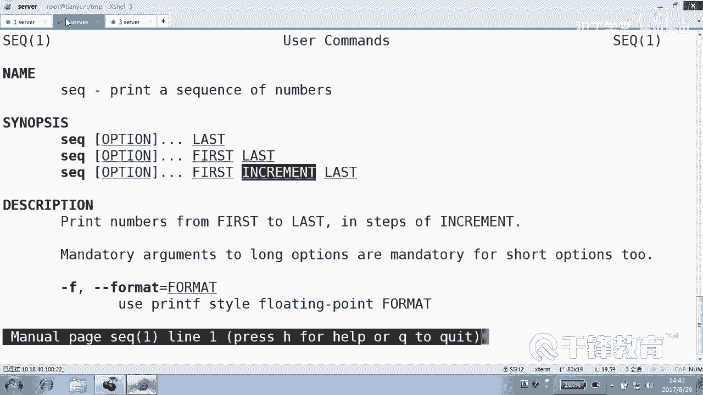

# 千锋扣丁学堂Linux云计算系列：Shell脚本自动化编程实战视频教程 - P11：3.5 条件测试 不按套路出牌 创建用户 - 扣丁学堂 - BV1SE411q7vK

好，刚才我们看到这个脚本呢。😊，是给那种善良的按按套路出牌的用户创业吧。那我们这个脚本有个问题，什么问题看啊。😊，我们再质一下。他有没有没有可能没有输啊？😡，这个还给个机会输一下吧，是不是报错呀？😊。

好。有人说让我输，我给你。😡，我一锁里面捅一个。其他东西到里面去。我看怎么弄？这这是不是就有问题了？好吧。呃，为了保留现场，我把这个。😊，这个脚本呢什么？拷贝一份成为。米2，我们来修改那个。

你二这个脚本。好吧，好，这是。02。那哪儿的问题呢？第一，我们觉得用户有可能他不去正常的输入一个数字，明白了吗？那我们是不是得判断它必须输的是数字，不是数字就直接推出啊。😡，所以我们在这输完梳字以后。

要对他输的输的那个东西进进行什么？😡，进行检查和判断。那面没归经简的判断。怎么简的判断。拿什も。呃，肯定是if服，没错。各位大家不要把这个if想的很复杂。这个if L这个if语句在这儿呢。

它就做一件事儿，什么事儿？😊，判断你是不是数字，不要给我想多了，他的意服，你只要你过我这一关，我这关可能跟下一关没有关系，好吧，但是这一关你过不了。😡，夏官你也没有接触过。我就一关。各位想想想一下。

看怎么来判断是不是数字，怎么判断。😊，大于等于0，那不是，因为有可能是个字符串呢，也可能是个空的呢。😡。

呃，这里呢不难为你们，因为还没有学政策表达式。😊，我们认识一下什么叫数字，好吧。什么叫数字？来看一下1234是数字吗？12。数字吗？这些是数字吗？你给我总结一下数字的规律是什么？😡，零到就。0到。

之间的。只要。任。什么叫数字？那有。0到9之间的数。就是我们也不知道到底会输哪个数字，所以肯定不能够具体的去干嘛，匹配他说的是八还是十，这肯定不行吧。我们得总结一种。😡，一种规律或一种模式。

这个模式只要它我这个模式往上套。只要满足这个模式，肯定就是数字，好吧。数字呢我这边解释一下啊，看没错，他说的是。😊，0-9看到吗？是不是0-9。是0-9，而且是。这个开始是数字。

接尾尔数字发你这么写的话，就一个数字。😊，就输一个一或者2，那不算，好吧。😊，中间可以讲的。中间是不是有多个呀，这叫1到多个。这是前面这个数字出现1到多个这个加号，这里我用到正则。

我我现在至少是先用了一下正则，好吧。😊，你看你上面上面这一块过，第二个也是。你就是干。当中只能是数字。当中只能加号表示这个加号什么意思？就是前面的东西可有多个，但是只能是这些。😊。

这个加号在这干的事情是啊，就是前面这一堆东东西里面啊可有多个。😊，但是这样的话出来的话，一定就是数字。我写我现在写了一个模式，这个模式呢就像一个规律一样，它一定会套出来数字。你要说这个是不是？😊。

这个确实是以什么开头？数字开头以什么结尾的数字结尾。但是呢对当中确实是。😊，1到。这个是1到多个数字啊，这个加号表示。😊，这里有几个符号，我们先认识一下这个表示什么以什么什么开头。😊，这个表示。

就是前面的前面的这个什么字符。有什么。1到多个至少都有一个。啊，然后最后那个 dollar指的是什么呀？😊，以什么。结尾好，那整个它俩一拼合，那就只能数字。明白了吗？只能是数字。好，这个关于政字表达式。

我们在后面会专门在在有有一章会学。但是现在呢你一个牢老给我记住，这就是数字，好不好？😊，保留你的意见。对不对？敬请保留你的意见，好吧。😊，什么问题，你说我给他大家翻译一下。没没事没事，说我这个很民主的。

😡，他那什么他。方法好奇怪，因为他到时候你到时候。然后他是按。按字符保存。整数。这里呢是字符，这还是字符吧，对其实它还是字符。对，这里是字符。没错，0到9这种字符。😊，然后到时候计算的时候，还要把这个。

我在转化的时候。我这里第一没有计算。第二呢。😊，我们在 shell当中，在昨天我们已经说过，在 shell里面定义的所有变量，其实本质上讲都是字符串。😊，只是说你用let它就变成了整数，看到吗？

你用exPR变成了整数，你到底是什么类型，最后取决于操作你这个。😊，操作的时候的那个那个对象那个方式。如果进行总数计算的话，是不是要把那个字符按之SP码给转化成？这个就不用管那么多了。😊。

得这个定义好奇哎。这。😊，这这这就是大神学霸级的人物研究的。你都奇怪，它里面居然全是字符。计算的时候就比较忙。在 shellll里面都是字符，全是字符。在 shellll这跟C不一样。

C的话是需要定义它的那个。数据类型的然后这里面没有，也不能说没有。这个听我说sell里面可以定义类型，可以。😊。

怎么定义类型的？

有一个命令叫。dick它可以定义数据类型。你看它可以后面加杠A。😊，或者杠数组类型、关联数字类型、整数类型看到吗？它也可以定义数据类型。但是一般没有必要定义，为什么？因为上有一个自动适应的过程。

也就是说你你在定义的时候全部都是字符串没问题。但是有一些时候不行，我们如果要定义字符定义定义那个叫什么数组的话。😊，那必须要杠A或者杠大A，这个是要定义。但是对于我们的数值来讲的话。

我们没有必要去区分数值和那个字符串，因为它全看成字符串。只要在运算的时候再做内部的一个转化。好。所以我们不能够完全从那个其他的角度去理解。好，总之这是什么？这就是。😊，你记住，这就是数字。满足这个规律。

那就是什么？😡，就是数字好吧，行，那现在我们回到主题这边来。😊。

怎怎么着到那什么？😡，对这谁比较啊，这谁呀？lember。😡，怎么着，后面用什么符？😊，是是比数字呢，还是比还是按照字符串的方式比呢？😡，对呀，它是字符串，好吧，它实际上是字符串的，你等于什么？😊。

听一。你前面加引号是吧，这我有这个习惯啊，不说你们呢？😡，然后嗯怎么写？😊，这个。开头然后是0-9，然后是。加dollar。是这样写吗？臭臭该。这个谁的。其实也是。不是的吧。看那它不是数字是吧。

那就是叹号是吗？😡，他不是数字。😡，但要不数字化，我们给个提示说打印先打一句话，然后再再见好吗？是。😊，错误的number，然后最后再见。程序就不能再往后走了吧，就应该退出了吧。我们没有写循环啊。

我们要是写一个循环的话，会返回去。好吧，循环不是还没讲嘛？是吧？会返回去说说的不对，请再说。😊，说的不对，请再说说的不对，请再说是死循环。没错，我下面应该放了个死循环在这块儿。😊。

好像还没有讲，看这不是死讯丸吗？这儿。😊，我们一会儿一会儿来说OK我现在讲的是这个案例，看到了吗？😊。

但这个案例呢有有同学可能注意到一个问题，我好像输的和屏幕上这个案例不太一样。😊，哪不样。

不是这个地方输的是英文。起毛说的是中文。

这是这是骗小孩的，好吧。😊，嗯，没没没有没有有没有没有没有，对，有同学看出来了是方括号，双方括号。😊，而且这儿的符号不是那个符号，看到吗？😊，我只能告诉你，你现在输的这个符号。😡。

是错的。你知道它怎么比吗？它会比，就是这几个字符。😡，就是间方0-9方加碳这个符号。在他的世界里面，根本就没有什么政则的概念。换句话说，单个。😊，这个单个方括号是不支持正则的。好，不相信我们试一下看啊。

我们在外面试一下。😊。

然后怎么做？方光，我们随便随便来一个变量，好吧。呃，刚才是不是有一个叫number10的？😊，请注意看啊。当了什么蓝宝。等于。肩。什么来着？0-9。加结尾。这什么东西？这条件是什么？😡，为真还是为假呀？

他他他怎么这么说？😡，他和他不等，对吗？但是我们知道他是数字。😡，所以这里比的是什么？😡，这个笔的。我们能不能这样写一下number2。😊，就是这一串，好吧。来比number2啊。那么二和它相等的吗？

😡，number2和这个后面这串是不是相等的？😡，是，所以条节为真，看到吗？所以它比的根本就不是正则的东西，明白吗？一个单方公号是不支持正则的，它纯粹是按长什么样比什么样，而我们这个地方并不是长这个样。

我们这里面代表的是数字的这种模式，明白吗？😊，所以用什么花？用双方括号，而且这边的符号是这样的写的。双方括号。好，请问大家。😊，这就是正则匹配，没有等不等于你没有不等于，就是匹配，这叫匹配，好吧。

匹配它是不是number2是数字吗？😡，是数字吗？其那那也叫数字啊，你的世你的世界里面是不是有问题啊，这也叫数字吗？😡，对，所以那么二不是数字。那那么一是不是数字呢？😊，是。等会。

没没有number一啊。😡，number是数字吗？😡，是对呀。来再看number3，骗骗它好吧，1234TT7是数字吗？😊，来，我们用挤。请告诉我最后应该输出什么结果才对。😡，他是数字吗？不是。没错。

就用这种方式看到吗？这叫做这个变量是不是匹配这个模式，这是正则模式。而且很严格的告诉你，这个地方不是字符串，千万不要加双引号，你加双引号，这就不是正则的意思，好吧。😊。

好，所以在这里的写法是怎么写的？我就不想跟你试了，直接。😊，怎么做？就是number这个变量，它匹不匹配数字啊，千万注意，警告你们，不要在这一段上加什么加引号，你加引号，那就叫字符串比较。

我现在是按照什么比较？😊，正则表达式比较，不是按照字符串。好。可以，先开屏幕，先不要敲。掀开我的屏幕。这个number现在如果如果说个十十是匹配数字吗？匹配吗？😡，然后就退出啊。是不是应该是反向的？😊。

是不是这样任何表达式前面是不是都可以加那个叹号？😊，能解读这句话吗？😊，不是能不能明白？这个它不是数字的话怎么办？退出好，我们试一下，我们先测一下这个语法是不是。有问题。没问题，好像是吧。😊。

点斜杠user02来，我们输一个U。从来我们输1个7U7，不是。我们再说个啥呢？6外那更加不是数字的终极匹配方式就是。里面只有数字。是吧不能有别的。明白吗？好。😊，然后那紧接着呢，我们。😊，输一个吧。

说一个5行吗？😡，前缀哎，能过去说明内关。😡，闯过去了，没对我们造成什么杀伤害啊，闯过去了。😊，好，那就不不再往后闯了，cl C了。😊，是不是明显的限制了输输的只能是数字啊。空。空也行吗？空怎么可能呢？

我们是不是规定里面必须要有几个？😡，是不是一个数字？😡，至少是不是一个数字，当然有人可能不要脸的说老师那数两个零可能吗？😡，数两个零的话呢。出一个零，他也没有，其实没问题，因为那就是数字。说实在的。

那脚本就不是给不按套路人准备的，是给白痴准备的。就是你得考虑白痴是不是会犯各种错误。你要知道脚本并不会给那种纯傻子准备，只是给可能我们偶尔会犯错准备。那你无耻数两个零啊。😡，那你要输两个零。

给这种白痴准备，我们也能也能够解决，怎么做？并且。😡，是吧。并且不论是零开头。本正。啊。输一个0，那也没法创进啊。😡，Uer0是吗？那有点一啊，0那就点一呀，0你咋碰1有没那个各人问题都可以考虑。😊。

就是我们可以。或者是吧是不是或者但是这里的或者不论叫或者是竖线，为什么是竖现？因为这是两个方括号，或者变量什么doer number是。😊，一个或者什么多个零好，在这个就麻烦一点啊，这个我要写的话。

就是这样写的到那是什么laumber多少匹配匹配什么？😊，匹配这种写法是。加号。0。加。一个货。多个理。这让你们看的看蒙了。这是或者要不是它不是数字是吧，或者什么。😡，你是以什么？😡，一个或多个零开始。

那我也不要你。明白？这句话本身就不应该出现在脚本里面，这是为了防止那种。😡，纯白痴的人，然后然后我们定义了这样一项。不是想不通吗？这个。不是你们非要要0是吧？要0那我就删了，这没关系。😡，行。

那现在这段解决的是什么问题，告诉我。😡，解决的是不是数字问题啊？😡，那有没有可能。这家伙在后面这个perfix什没有输入呢？有没有可能？😡，那怎么办？如果想要解决一下怎么办？这个问题解决了。

我们下一个问题快点。😊。

一起来。这个问题很好解决。😊，如果。刀刀什么？😡，Perfect。它的长度是什么？注意一下以后，它的长度是0。可以这么写吧。😊，会不会这样写？然后我们就。😊，eical说什么？错误。错误的perfi。

然后最后再见。我们试一下好吧，来，我们先过第一关，因为第一关过不去的话，进不了第二关给他个机会。😊，没戏吧。好，这两个地方解决的是两个问题。各位看到这一段这个if解决的是，如果它不是数字。

我们应该再见是吧？用到了正则方括号正则的形式。😊，明白。那然后下面这段呢，我们解决的是字符串的什么长度的问题，注意这里一定要加双引号，否则的话。😊，这个结果是错的。因为这个变量不存在。

你要只要只要没有定义过，可能不存在是吧？那极有可能报错误的效果。所以如果它的长度是零的话，说明什么？😡，那小子根本就没有输入。没有输入的话，我们就应该再建。再建的话呢，就如果不加这个exet的话，那么。

就相当于这一关过不过，对后面没有影响，他直接穿过去了，这个不可以。😊。

能听明白？各位好，那么这个解这个脚本解决的就是按什么？😊，给按不按。套路出牌的人准备的。明白吗？第一，你说的数字如果不对，我们可以处理你。😊，第二呢，你说的这个如果字符串呢你没有输。

我们念什么也会你的长度是零的话，也会处理你。😊，那你们要过来。这有没有疑问？有没有疑问？没有啊，没有自己做一下，好吧。😊。

