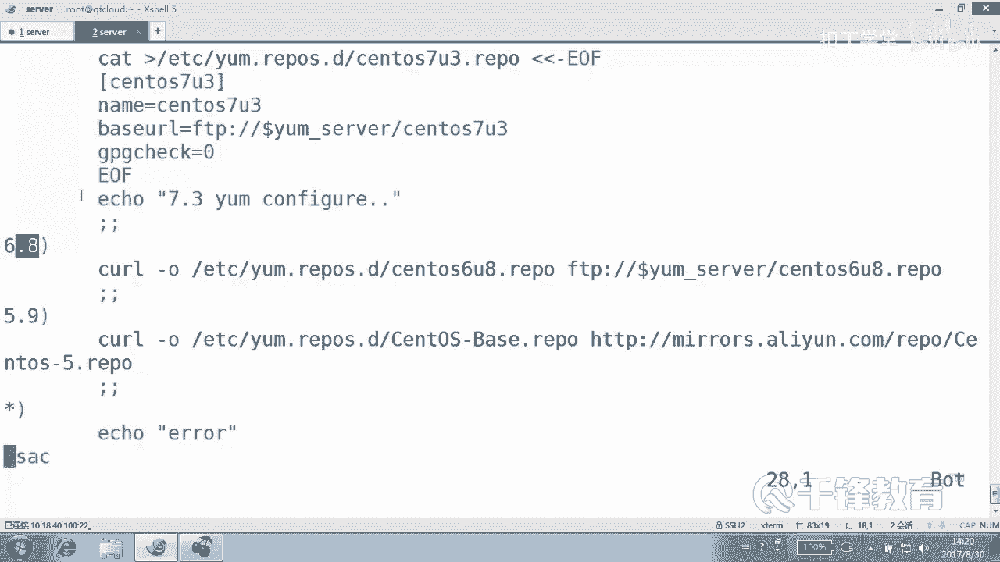
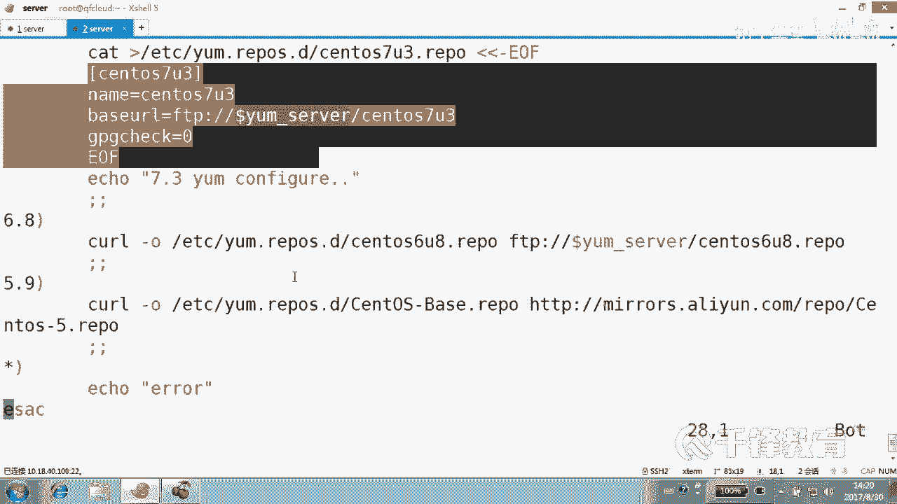
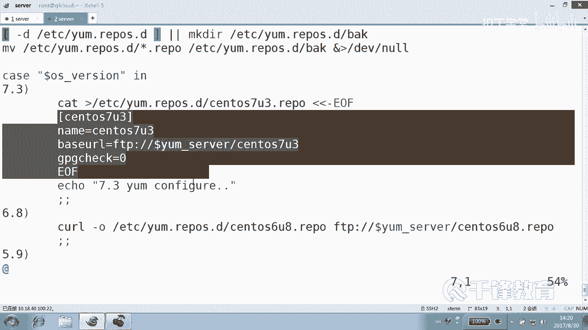
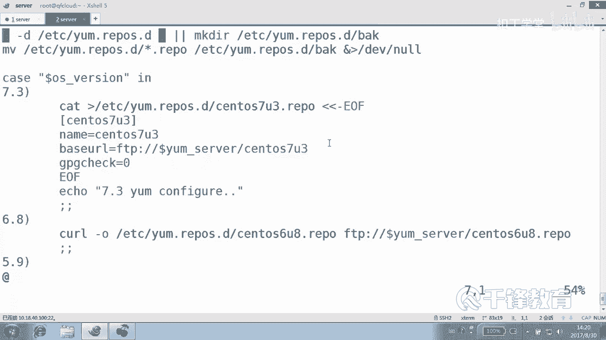
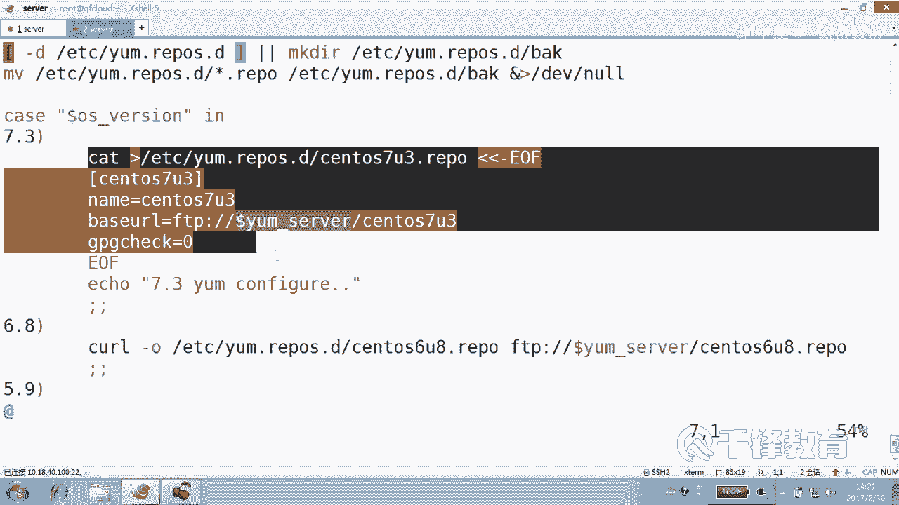
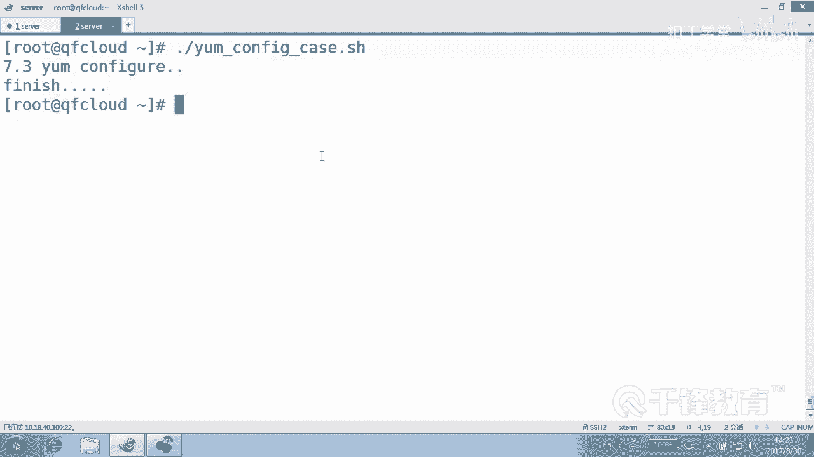

# 千锋扣丁学堂Linux云计算系列：Shell脚本自动化编程实战视频教程 - P12：3.6 case 多系统配置YUM源 - 扣丁学堂 - BV1SE411q7vK

好，再次欢迎各位再次回到课堂。嗯，在前面我们呢带大家了解了关于shall的一些基础知识。其中呢包括讲到了if else这样的语句是吧？做这种条件判断。😊，实际上我们在使用if else的时候发现。

有一些问题。比如说各位看到我们在前面写的这个脚本，ym confi这个脚本是吧？这个脚本没有问题，但是看起来感觉上可能有时候觉得比较混乱。明白吗？觉得非常混乱。你看if else if else if。

那万一还有好几个呢？😊，说还要好几个怎么办？再ISif是不是这个结构显得非常混乱了？😊，这种条件的判断非常混乱。所以我们下面呢来用一个。模式匹配其实也是条件判断。叫ki语句。嗯。case从某种义上讲。

它就是if else的一种简洁版。O。那我们下面来看一下就知道了。同样是这个y康fi这个这个。这样一个脚本是吧，我将它copy成ym configurefid的。kiss版好吧。啊，不是那个case啊。

不是KISS那个case啊。😊，好，当然有些你业不了算了。我说的他不是说不认识这个单词，他没有这种体会。所以说。Okay系。有是吧。😊，好，那个。😊，嗯。呃，我们下面呢来把它改成这种kiss版本的。😊。

那case它的一个特点是这样的，各位看啊它的case。变量名。然后什么。一。这个E呢。也就说只要。是满足这个模式的话，那就执行这一段命令。满足这个模式就去执行这个命令序列。

满足这个模式呢就执行这个是不是相当于就是if else。条件一成立。做这个alse if二成立做这个吧。 elsese if3成立是不是做这个都不成立，做这个是不是很直观？😊，好，下面呢怎么做呢？😊。

首先前面的东西是一样，你看像么ym呀、ser啊，还有OS version呢，这些都一样，去到这个版本是吧？😊，备份这是不是也没问题啊？哪儿不一样。这儿不一样。好，这儿不要怎么不要法呢？我先不删除它啊。

好，从这开始ki。😊，变量字符刷变量，我给你们提过型儿，用什么？😡，一。看到吗？结束的时候先写好ESAC。😊，是不是正样倒过来的？😡，比如说这个EIC是什么东西啊？😡，好，case是一个关键字。

ESAC呢也是个关键字，不是说仅仅倒过来不倒过来的，它是它的匹配的一个。😊，对象是吧？好，印什么东西呢？😊，如果满足条件一，也就是这个变量的值，对不起，我写少了啊，dollar是吧？

如果这个变量的值是什么？是。😊，7。3注意这是个字符串，好吧，这是个字符串，它本身就是字符串匹配。😊，这里没有数值，没法比大小啊，就是周差匹配做什么？😡，这个做的事情可以写到一行上。

比如做个LS分号分号可以写到一行上。如果你做的事情非常少，那就可以写到一行上，好不好？但一般我建议大家还是尽量。😊，做什么？就把这段事情要做的事情给他。😡，好，我采用剪切，好吧。😊，D间接。粘明白了吗？

最后结束的时候有一个。分号分号。然后如果匹配的是多少？6。8。嗯。是不是就这样？如果匹配的是多少？5。9是吗？我写的是5619是吗？下面。😊，好，然后就干嘛。是不是下载这个？这么长这个。

如果说啥也不是呢。那就是任意字符星儿看到吗？然后我们就acclearrow。😊，最后一个可以不要加那个哎，我怎么刚刚一块删除的吧，下面D。😊，大忌好吧。好，各位看一下整个结构。😊。

可能现在由于字体的原因呢，大家没有看到最清晰的结构是吧？我们可以稍微缩放一下，比如18号字。😊，还是看不到是吧？为什么看的还是不是很清晰啊？因为啊我们这里面。😊，因为我们这里面呢没有写函数。

我们使用的是一个一行一行的代码是吧？一行一行语句。如果写函数的话呢，这儿可以简单的就摆几个函数就可以。😊，看到没？各位看再说一遍，前面都没有什么区别。case变量。变量E就这个变量匹配哪个能理懂吗？

变量的值它去匹配哪个东西。如果匹配的是7。3，就是满足这个条件。😊，注意这里没有数值啊，这里只是什么一个字符串，就是7点3这三个符号，好吧，三个字符。如果7。3做这个事情，如果什么。😊，6。

8做这个事情，5。9做这个事情。然后其他的话呢，做这个事情以ESAC结束。能明了吗？能不能听明白，这其实就是一个if else all if的一个嗯。改变了一个过程吧。你看如果。如果这个变量。

等于它就条件成立这个模式一匹配就匹配第一个模式，那是不是就做这一段，否则做什么这一段注意这个分号也可以写到上面去啊，也可以写成一行，简单的写成那么三行就可以。😊，能听懂吗？各位。好，我们下面来。坐一下。

加直音权限。好，现在呢我们把这个EDCR的EM点内容呢。现在我们再时假如说亲一下，好吧，可以吗？亲一下，保持没有了，现在亚么肯定不能用，是不是？然后我们来执行一下这个语句。😊，哪个依据？Y。

Config。Cis。好，那有一个报错报错，其实我们可以接受，就是他说不能够去移动这里面的文件是吧？原因是那里没有文件。😊，看到了吗？要想不报错怎么办？😡，因为你看因为这里面那个目录倒是有创建好了。

但是呢里面原有的文件是不是没有啊？😊，被我刚刚删了吧。好，这些问题都可以解决，怎么解决？😊，啊。你要是想不出来的话了，真的不能说我讲快了啊。😊，是不是都可以解决，我们可以不要。再来做一遍。可以吧。

然后查看一下EDCR的Em点raple下面的森度I7。3有了吧，一样的。😊，这就是ki的一个非常非常标准的一个模式匹配。好，刚才的这个语句我没有来写啊。😊，满足模式一做什么。

然后模式二做什么模式三做什么，当然，满足一个模式就再也不会什么往下找，就像if else一样，条件一成立做条件一的事情。那就不会。只要做完以后就会怎么做。就为我们去跳出这个位置。明白意思吗？嗯。

下面有好几个案例啊，好几个例子。能不能看懂？刚刚这个例子能不能看懂？这个其实就是我再强调一遍，就是if else的一个结果吧。C。变量。E它匹配谁，它匹配这个做这段。这段这个代码里面的语句。

然后如果匹配这个的话呢，做这个。匹配这个做这个最后匹配做这个好，那问一个问题，如果把信号写在上面会怎么样？😊，我们讲过这是有顺序的，好吧。😊，能听懂吗？就是。现在之所以呢。你女朋友现在是和你在一起。

原因是你是他认识的第一个人。他没得他没有怎么选，觉得可以就就在一起了。不是。那如果说。他之前可能认识一个更有钱的。更帅的。那你不可能有机会啊，对不对？你在这儿没有机会，一旦匹配成功，你没有机会啊。😡。

它是一旦匹配。

就整个。执行完这个代码以后。这就结束了，跳出case，看到吗？跟那个if else一样。换句话讲，你看我写了好多个匹配，匹配一匹配2、匹配3匹配4，无论怎么样。😊。

肯定只能匹配其中什么一个，所以就跟if else一样，if else写的再多。😊，你只能够取其中一个。一旦。匹配第一个条件，如果不匹配，如果匹配则要跳出是吧？如果不匹配呢。

匹配alse if还是不匹配怎么办？第3个最后直到那个al。😊。

那这里也是一样，一旦匹配到7。3去执行完这段程序以后。

就不再执行。就不再执行，然后就会跳出什么，不是跳出程序啊，是跳出什么。😡，好，我们可以在最后艾克一句话说。😊，怎么一下跑跑到上面来了？是不是非得识？看。一旦完成这个操作，最后就finish。不会往后走。

明白。这个。No。来。😊，关于这个脚本，各位没有没有疑义吧。还有一点呢，我给大家讲强调一下，这边就算加双引号也是可以的。因为我们知道字符串面料本身是不是要加双加双引号。没有没有问题啊。😡。

加双引号也没有任何问题。下面也是一样，没有任何问题。那为什么我要强调这个呢？因为我们马上有一个有另外一个脚本呢？😊，我们是需要匹配那个空的。就是啥也不输的，啥也不输。那你啥也不说，总不能空在那吧。

你得使用一个双引号或者一对单引号。😊，那所以实际上呢我们也给大家讲过，对于字符差变量加双引号，这种是。😊，合情合理的，没有任何的问题。嗯。颜色这种东西。是真的真的那么重要吗？😡，没有那么重要吧，对不对？

好，这就是关于我们第一个就是你我们人生当中的第一个case语句，好吧。😊，啊就请珍惜吧，好吧。😊。

