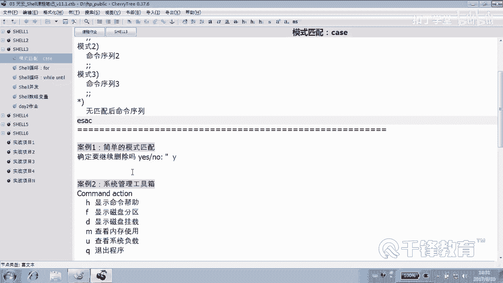

# 千锋扣丁学堂Linux云计算系列：Shell脚本自动化编程实战视频教程 - P13：3.7 case 删除用户判断 - 扣丁学堂 - BV1SE411q7vK

曾几何时我们讲过。如果说你希望让用户在操作某一个对象的时候有一个确认。那这个时候呢，你可以通过一个什么，通过一个if附语句来判断什么来判断这个。是不是说的是yes。😡，能明白吗？

就是我们来一个要配合一个什么东西呢？一个read先读入一个用户输入的内容，然后呢再配合我们的if副语句。😊，来关注用户输的是不是Y。明白。我说这种东西可以随时记住啊。

我说的那个read加什么if这种方式可以随时出现，用来干嘛？😊，你真的要这么做吗？😡，你确定要干这个事情吗？😡，那你怎么去问人家，你问人家是用让人家是不是输入啊，输入就用read。😡。

read德然后读一个读进来以后，我们判断他那个动作里面是不是Y。如果不是Y，我们就退出。好吧，我们说你很明做出了很明智的选择，没有这么做，是不是？😊，所以这种简单的配合，我们再来看一下啊。

任何地方都可以做，任何地方。😊。

好，下面我们来写一个删除用户的一个脚本。嗯，回到这边吧。DELus点SH脚本。好，这是一个崭新的脚本啊。😊，好，我们的脚本呢可能会在我们曾经学过的内容当中，先去用学过内容去写，然后再慢慢的演变成为什么？

可能你看起来更加顺眼的这种这种脚本，比如kis啊或者其他的方式。😊，好，这个脚本的作用呢是。😊，并下的bash手快的同学可以跟着敲一下，手慢的同学就算了。所以键盘一顿狂响的。那你看着办。

亲亲的爱也可以啊。😊，好，这是V1。0，然后by。今天是201。20年。8月20号。8月30号。行，然后紧接着呢我们。😊，假如说我们希望用户呢。给出一个要删哪个用户。就这个思路啊，第一。用户。

从键盘输入要删除用户。然后我们怎么做？😡，对，我们再看看对，读是读，我们再看看有没有这个用户。😊，如果有的话呢，如果没有的话，就告诉人家说没有是吧？如果有的话，就说你真的要删吗？😡，他说真的。明白？好。

现在读入red杠P。请输入一个，有很多同学可能注意到了，我这加一个空格，为的是什么？😊，和后面不是光好看。好看也是中文最重要的啊。😊，好，首先他给一个用户以后，我们是不是判断一下这个用户是不是存在啊。

怎么判断？😊，I D dollar。user哎，最好给我重定像一下，因为有可能没有建议生许，好吧。好，那这边是用ki还是用什么？😊，没必要，好吧，一般简单的简单的东西，衣服语句就说哥，我来用不着你动手。

好吧，ki总总的来讲是稍微有点档次那种人用的。😊，一般像这种普通老百姓的话。就一服就行了，好吧。😊，好，然后紧接着呢。😊，我们注意这样写，要记住，一定要先写格式，提示过各位吧。如果这个问号。

是等于零还是不等于零呢？是应该等于0还是不等于0？我们也给大家讲过，这一段没有打算去删除，这段只是做一些判断，那就不等于0。不等于零的话，说明什么？😡，是不是？没有没有这个用户啊或者low。

没有没有这个user吧。😡，是吧。你看。ID1个。哦，low suchus是不是？no such user谁呀？我们加一个吧，没有slashuser dollar user就没有用户这个。他。

然后最后再见吗？那肯定得走了，那你还想还想怎么着？😡，都已经到这个方落浆了。你应该走是吧？走的话，except各位一直没有跟大家强调过一件事儿。各位，你觉得你这次走走的光彩吗？😊，那你凭什么带着零走呢？

带个一走行不行？😡，就是。我们知道正常的程序。退出以后返回值是不是应该是零啊？这个不是那个re特啊。😊，退出值回传值是不是零？但是这一次你你。😡，你这种走本身走的就不是特别的。😡，光彩是错误的润走。

所以零跟你就没关系了。好吧，你自己那如果说像这样走的，我整的话啊，如果是这样的话看。😊，A加X user呃delete user。滴滴的user请删除用户。喂喂喂喂。😊，没有。😡，看一下返回值。

那不好吧，这样。他显得不不不真实，不诚恳。😡，所以我们应该定制定一个返位值，你到底是一还是二呢？😊，就看你喜欢哪个数字。😊，嗯，那也不是光这个问题是这样的，我们有时候有各种错。😊，是如果是。

第一种错我们可能返回一个一，好吧。第二种错呢返回一个2，第三种错返回一个3，因为我们可能会根据错误类型去做一些其他后续操作，那你就给不同的错误定义一个什么不同的回传值。😊，明白吗？

那此时此刻定一个一就可以了。来再试一下，我们一步一步来测啊。😊，有没有这个用户？😡，你甚至可以把这个用户搞红色，掌声是吧？😊，明白吗？我们可以自己是不是控制返回值？😊，好，那如果说。但是。

不是这个这个条件不成立呢。😡，那就进入到正式的删除用户的环节吧。那么按理讲是不是应该上来就删了？😊，问一下。好，问一下，我觉得问一下是对的。

问一下问怎么问啊？我刚才跟你讲过，凡事在某个地方想停下来说你真的要跟他结婚吗？😡，你想一下。No。那这个时候就要问问一下，好吧。

问一下，那就是read呀。😡，这种做法请记住。一定要什么？😡，这个你真的要确认吗？我们可以提醒用户按一下什么Y或者是low，这是提醒，好吧，善意的提醒，然后我们给action动作，它要做什么？😊。

你真的要你真的确认吗？😡，第一种做法是什么？If。只要他输的不是什么do。到乐什么？Action。呃，引号引起来还记得吗？只要他说的不是不是Y，就是叹号等于。喂hy。只要不室外，然后我们就。Iical。

艾克一个什么good。是绩很好，好吧。然后当然别忘了还要干嘛ex set2。好，我们这次也同样是一种不太，至少这个脚本没有正常退出，对吧？这个脚本并没有按照我们预期那个预期的所愿。

因此呢我们觉得返回一个二也是可以理解的。当然你要觉得这种退出是光彩的，怎么办？😊，你说这是我自己选择，我愿意好，exite。😡，有没有问题？能理解吧？好，请记住这一段在什么？

这一段其实跟上面的这个这一段儿。原则上讲什么？没有关系，我们这一段可以用在任何你想要暂停的地方，好不？任何任何想暂停地方。😊。

那我们。往下走就该干嘛了？往下走，是不是就应该删除用户了，user什么DEL杠R删除谁呢？douguser。😊，好了，能走到走到这一关，说明你俩吃这个不容易，是不是？😊，那走了。不行吗？确定哦。

确定删除吗？还没删除。😡，只要不是外。不是外，咱就再见。不是外不是外不是外就是是外L是外加是外衫啊，再加一个L。对的。像个L。对这对的，这这没有什么太大的错误，感觉只是不符合每个人的审美习惯而已。

不是为我们退出。失败了就删除，这没有毛病啊，你非要放在Ios里面去啊，那也倒是没有问题。我不是说了吗？尽量。😡。

一个if法if语句就做什么做一件事情是吧？😊，那你各位。哎，我不去影响你们的这个思考的这个空间。有些人对这种他有自己的想法。好，那你自己做好吧，没问题。😊，有人说失败就删除是吧？😡，可以啊。😮。

那我们换一个换一个怎么写？😊，等1万。然后就user。哦，缩进一下是吧，user DEL杠R dollar user可以啊。否则。这个没有错啊。好，当然后后面就没必要退出了，为什么？因为后面也没有了。

😊，后面没有东西了是吧？好，各位这个应该看得懂吧，是外就删不是外就不删。😊，你看这个我们做的就多么人性化。😊，行不行？行啊行，我们来整一个，先整一个用户叫做猪猪。😊，好，救他先猪猪有吗？😊，哪个脚本？

DELus请输入用户名。猪猪侠。い。没有就是想。😊，那我们接着删猪猪，好吧，猪猪。😊，确定吗？no。😡，做的好good好吧，就你这这件事情干的很漂亮。😊，在吧。来再来一个山牛猪猪。确定吗？Yes。哦。

应该报一个猪猪已被删除是吧？这这个死的死的都不知道咋死的。😊，啊。过得不好啊。顾的就是你没有杀人，你做的很好。😡，就这个意思。那要放什么呢？可以吧。这对郭董不满意是吧？或者干脆不要也行。😊。

不输也可以是吧？这段是不要也可以，干嘛一定要顾的？😡，干嘛一定要提要要要信息。这样是不是也可以，只要等于Y是不是删除？没问题啊，脚本可以改进啊。😊，再来看一下，我们看。新建个用户羊嘿，啥用户都没有。

这上面。😊，三重诱惑羊。喂。杨用货币删除。没了吧，look suchus。可以吗？好，那就是说可以，这跟我们的case有什么关系呢？😊，嗯，有。各位人家有没有可能是这样的啊？我问一个问题。

就有些人很纠结啊。😊，那个真真的，你看我我给你举个小例子啊，我们连到一个机器，连到你IP多少？😊，10年。18。11042的110。你看输个yes吧，有些人说个Y，他说不好使。😊，是吧。树个大叶子。哎。

他也是可以。其实你看他让你输yes，你你真的要继续连接吗？are you so。去连接吗？人家提示的多好，都唯美，看到吗？😡，所以有些人输个Y，他就不好，像我这样说个Y就不好使。他要求你输。

他说输的是yeshellow。😊，好吧。那换句话说，我现在再建一个用户还是叫猪猪。如果我在这边执行脚本的时候，我写个猪猪没问题，说个Y。😊，删了吗？清楚。这删了吗？没有钱退出了吧，大家给个提示。

但也没关系，但是也就是我说的是个Y，但是人家不匹配Y啊，你要是要大Y，那怎么做？😊，你可以把你的脚本改进一下，你说货还记得吗？😊，哇，这个就很痛苦了，马上啊马上进入痛苦环节。😊，AC TLON。

等于什么？这边少加一个空格都会犯法Y。那各位你是不是还要考虑一些别的情况，doller。😡，等于。Yeses。杠O这这有可能按这个呀，怎么着你写你写的还是人性化一点嘛。人家在很多人的认知当中。

Y和大Y是一个意思啊。😊，什么。A dollar ACTIN我我跟你说，写着写着你会发现。😊，这个你XX那个单词都写错了，一会儿都等于什么。😊，y小y小y好，没准这后面少了一个空格，多了个空格。

你眼睛看花了。😊，这个这个是可以的。来走一走。来请请上我们的语法没有错啊，没有吧。😊，叫什么羊是吧？啊，没有羊。就这个用户在。出洲。你们打算说个什么yy是吧？行，删了。😡，其中一个匹配是不是就可以。

我们用的是不是货的关系啊？😡，你看这个皮皮是不是好伤感啊，感觉。😡，能明白吗？那我们可以换成什么呢？Kiss。就是把这一段给它注释掉，怎么快速把这段注释掉，会吗？😊，考你们一下说。😡。

把这一段注释掉ctrorl加V当当当按shift加I按紧。Yesy。注意到了吧？好，不要这段换成什么语句，不就是判断这个变量是啥吗？😡，明白吗？用得着这么复杂的去写吗？好，请上我们的ki兄弟。😊。

kiss dollar变量是谁？action，然后什么？EESAC。如果是什么？如果用户按的是Y或者是Y或者是。yes或者。应该小叶子在前面好看一点啊。😊，看可以多个匹配明白吗？能听懂吗？各位好。

然后如果输出这个怎么办？😊，所以就删除用户就可以了。那分号分号，那如果是其他的呢？明白了吗？这是不是可以了，看起的结构比它要是不是清晰好多倍啊？😊，而且书写的这个语句的指令的长度也也是能够接受的吧。

看就是一个模式匹配。请用户读入一个读入那个从键盘输入一个变量的值action的变量值，然后紧接着做一个模式匹配。如果满足这个模式怎么办？那就做这件事情。哎，有没有给机位给了个漏啊，有没有？😊，没有了。

不需要漏就是任何其他的。好吧，它只要不按的不是YY，yy，那就是。😊，Arrow。O。或者说兄弟你做的好。没有杀人吗？是吧？行，我们试一下啊。出租用户应该应该已经。去掉去了啊。第二。请输入用户名猪猪。

输哪个呢？前面只是个提示，未必一定要当真。可以了吧。没有问题，这是一个模式匹配的概念，一个模式匹配。这就是case的一个用法。当然这些case我们跟大家讲过，case它其实和if else是。😊。

是相通的。我们可以把if else的语句改成什么ki语句。当然ki这里面呢不能够做大小判断，它只能做什么什么比较。😊，字符串比较字符串，如果不是字符串比较，那还代替不了，明白吗？😡。

你不能说那个文件有没有权限，他他判不了。😡，你不能说这个数字是不是比它大比他小，他做不了，那个还是要交给谁，交给if，加上那个。😊，加什么？这个去做好不好？😊，那那里面吧过。好，说到这个if呢。

我这边补充一个事情，就是我们在前面讲讲那个comd的时候，呃，当时呢我没有记得那个一个选项，就是去判断一个命令是不存在。我们讲到的if我们加一个command这样一个这样一个动作啊。

我补充一下这个知识点很小，所以内容不是很多。USR并下的bash在正式讲之前呢，我们看一下command。这个命令杠V。比如说判断一个对象是不是个命令，知道吗？判断一个东西是不是一个命令。

我们给他1个EDCR的host4。各位看它不是个命令，对吧？我们给他1个EDCR的什么？😊，pass word。那他也不是个。命令，那我们给他一个。病下的什么？LS。是不是很自然，是不是就是个命令？好。

这个就是个命令，返回为0，看到吗？所以呢我想说的是我们的if语句当中，我们的if语句啊，这个ifcom里面。😊，我们曾经用到的if服都是要不是方括号。😊，来做条形测试吧，方括号是专门做条形测试的。

明白吗？那也可以敲一条什么。😊，敲一条命令，比方说data命令指疑什么？是成功还是失败的？😊，只要成功是不是一样能够有返回值，还可以教什么呢？就是我们去拼一个东西，总之是一个能够有返回值的就行。😊。

那也可以敲什么呢？commond杠V后面加上。加什么？陛下的比方说。data这样的命令。对不对？如果反回一帧。那说明它是一个命令，否则它不是个命令看。当然我们可以加一个在上面加一个。变量啊什么都行啊。

😊，表示这是common一。是什么呢？并下的data。这个判断谁？Dollar。边量是蓝色的，对不对？好，我们告诉他说什么这。不是一个命令，对不对？哎，那能不能够如果说它是一个命令，我们啥也不做。

这怎么做？😡，如果不设命令的话呢，我们有可能干嘛去y么去安装我这个命令不存在是吧？去安装某一个软件。能理懂吗？去安装某一个软件。那。那如果说他是个命令，那怎么做呢？😡，我刚刚讲了。

我们想什么都不做怎么办？😊，这地方空着行吗？😡，有些时候你真的如果想想想空着，那是不想那个不做任何东西是不可以的，哪怕是啊。都已经打出来。不是我想什么都不做。😡，如果想什么都不做。可以这样做。

就是加一个。执行一条冒号命令。A加Xif。什么都不做完了吗？是不是什么都不做，是个命令，所以什么都不做吧。😡，那如果我换一个呢？换一个。ETCR的什么ho，这是个命令吗？好。

当家回回下来要帮我们装那那个包，我们可没有啊，是假装的，假装装一个包，好吧。😊，们打一句话吧。呃，正在y姆在安装。什么什么包打一句话啊。是不是在撞这个包？好，这个是我们额外的给大家讲到的一个com命令。

它能够判断后面的对象是不是一条。命令可执行命令。好吧，如果不是的话呢。那它反馈为假，是的话，反回为真。明白？如果说你需要。某个地方你不想做任何操作，那就执行。冒号命令冒号命令这个命令本身呢是一个干嘛的？

是用来做这个返回，它本身就是返回帧的一个动作啊，冒号哎，见过冒号吗？见过吗？没见过猫，你们应该见过他的兄弟吧，处吧，见过吗？😡，在过处没有？处是什么呢？就是冒号，冒号就是处。

这两个命令它的返回都是始终为为真，好吧，就是。这两个命令。他们的返回都为证。好，这就是关于我们这个case的一个基本的一个使用一个使用方式。就是我们怎样去用case呢去做这样一个动作，好吧。好。

怎么去删除这个用户的一个配合？

