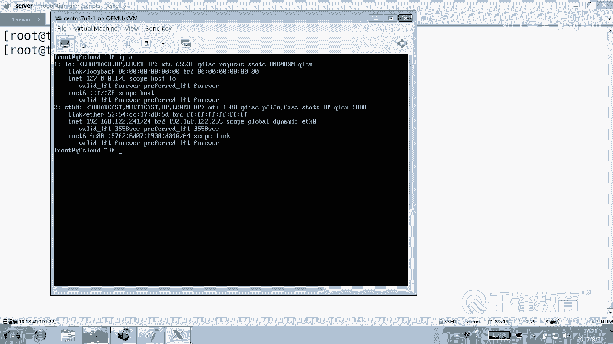

# 千锋扣丁学堂Linux云计算系列：Shell脚本自动化编程实战视频教程 - P14：3.8 case 实现jump server 上 - 扣丁学堂 - BV1SE411q7vK

好，各位欢迎各位再次回到课堂，我是你们的老朋友杨哥。😊，呃。那我们再次来看一下。ki语句的一个案例。我们写一个简单的jump server。简单的一个什么？我们叫跳板机或者叫堡垒主机。

那么我们知道在生产环境当中。在生产环境当中。我们的这些服务器提供服务的这些服务器。虽然说他们可能会有公网地址。不是可能啊，他们有固忘地址，他们提供对外提供80端口的服务。但是呢。他们未必都提供什么？😡。

远程连接。比如说你不可能你能够访问巴黎没问题，访问网站没问题。但是你想访问他们的22号端口，或者是也不一定是22，可能是一个修改过的一个什么远程连接端口，这也是做不到的。😊，因为那样的话不安全。

那怎么做呢？当然有很多方式，方式之一就是。😊，有一个什么所谓的一个我们叫跳板机，或者叫堡垒机。跳板主机或者是什么。堡垒机。堡垒机。跳了就是我们的jump server跳板机。好。

那这个呢我们可以通过python去开发专门的跳板机。😊，也可以呢去用一个轻量级的踏板机。那么也就是说我们只能够连到哪儿。连到所谓的这个跳板机能连。但是如果说想连到后端去，连不到，谁能连呢？他可以连。

它可以去连接，看到吗？比如说这里呢我们通过防火墙或者通过某种手段只对跳板机开放这种远程连接端口。😊，明白吗？那么这样做，实际上给管理师带来了一些麻烦。但是呢它的主要作用是。对，安全没错，安全。嗯。

但是这里会有另外一个问题，就是。我们可能要这个登录过程会有两次。多了依次先登到哪个地方？😊，对，先有两步。第一步。我们先登录到。跳板机。然后紧接着呢，这个登录跳版机的话，可能是一个普通账号。

可能是一个非常普通账号。比说一个叫。爱ice账号好吧，行。😊，就叫爱丽斯吧，没关系。然后紧接着呢，从从而后登的话呢，它也可能是一个什么账号。😊，普通账号。因为我们远程是不允许入户用户登录的，明白吗？

为了安全，我们远程是不允许入多用户登录的。好，我们第二步，我们使用跳板机登录到什么后面的一些otherserver上去。登录的账号哎呦改不了了啊，同样是什么账号，这就是win7的毛病。

win10的话是可以点的。😊，然后这边呢我们一样可以使用像adice这样账号，明白吗？一样可以这样使用。但是呢我们会发现整个过程会非常麻烦，就是要等两次。是不是？而且你登的时候。

你登到这个服务器上去以后，你还要知道后面那个服务器的IP地址。😊，明白。那今天我们来怎么做这个实验呢？大家看你们现在手上都有一个每个人是不是都有一个物理机？😊，啊，反正就一共有三台机器就可以解决嘛。

是不是可以处理这个这个问题。如果说你没有你现在正在听视频，没有我们这个环境怎么办？😊，你找三台机器啊。😡，你找4台机器，一个作为客户端，一个作为。😊，跳板机另外两个作为什么？😡。

其他的服务器是不是也可以？那我们现在手上有没有这这几台机器呢？😊，我们很多。我们现在手上我们是不是有好多虚拟主机对？你没有的话，你可以随便找就192168。12点，比如说十0好吧，我说的比如说啊。

这个呢。192168。12。20。Okay。这个物理机多少？0点6。10点18点。呃，我这个是40点，我是40。100这个机器明白吗？好，我至少我现在是这个IP明白。😊，那我们希望这样我们可以怎么做？

我们可以。😊，首先以爱丽丝的身份登上去以后。刚刚哪个基建？登上那个100吧，登上去以后，能够给我们干嘛呢？呈现出一个类似于这样的菜单儿。看到了吗？如果我们登上去以后。

能够给我们呈现出这样一个类似于这样一个菜单。能让我们去做出。😊，选择。比如说我们登一是连到mycyclq上去，一my登2mysql2登3。我们的这个什么北京web14help5退出看到吗？

就是我们登到这个跳板机上去。然后紧接着呢我们能够选。那我如果选一的话呢，那就连到这个机器上去，选二连这个机器看懂了吗？各位，这是一个也需要一个场景。它首先需要这样一个场景才可以。😊，呃。

这个场景很很好准备，你可以，这是你们的。😊，这台是什么机械？😡，物理。物理机好不好？这是物理机。😊，是什么账号灯，我们统一使用abice可以吗？😊，统一使用ad迪，这是我们的物理机。😊。

然后登到物理机以后。马上呈现出来一个菜单，1234。也就是说，首先这个物理机本身是应该能够登。其他主机的使用什么身份呢？😊，是不是爱丽丝身份？看到了吗？那么那样的话。

我们是不是需要在第一步在所有信息上都要准备一个什么账号？好，如果是这样的话，所有。所有主机准备什么？所有主机准备。这个远程的这种管理用户谁？爱丽丝，这只是我打个比方啊，爱丽丝因为我们不准。

不不允许什么登录。😊，然后物理机。是可以使用什么？爱丽丝诱户。登录什么。其他的。Sever。物理机可以登过去。这物理机就是我们的一个跳板机嘛，是吧？可以登过去。😊，然后呢，这个灯的时候。

你们是觉得应该是密码验证还是采用什么验证？😊，有两种方式，一种是。这个给你们选啊，一个是采用传统的。啊，别起传统的。😊，密码认证。一种采用。密钥认证。如果采用密码认证的话呢。😡。

那么你你首先你想想过没有先登到什么机器？😡，但到这个屋理机。等到物理机以后呢，出了一个菜单，撇R出菜单，这个菜单不是你自己敲的，是他自己出来的，好吧。😡，呃，说怎么自己出来？😡。

我们放到放到alice的这个可放到爱ice的那个什么，比如说ban士 shell里面，让它一登上去就干嘛。😊，我们写一个脚本，这个脚本就是一个简单的jo server。我们一一登上去，一使X用户登上去。

立马就干嘛。😊，就把这个脚本执行了，然后你连退出来的机会都没有，你就只能够在跳板机上看到什么看到这个菜单。然后你选选一，如果你选一的话呢，当然你你登爱ice是要密码的啊，是吧？你选一的话会怎么样？😊。

会调到调到个机限吧？一选一跳到这个机器。😊，有两种方式，一种是密码认证，一种是什么？😡，一种是什么？密钥认证好不好？没关系，我们可以先一步步做。我们先在做ja server使用什么认证密码认证。

然后我们再来使用这个叫。😊，密钥认证好不好？看懂了吗？各位。😊，好，这个整个要做什么事情，我是不是给大家说清楚了？😊，能看懂吗？要做的些事情已已经跟大家说的很清楚。好，那我们就先一步步做了，怎么做？

先在所有经济上是干嘛？😊，准备这个叫什么？一个账号，这个有人说入的可以吗？可以，但是什么违背了我们在生产环境当中。😊，一位规律或者原则。在生产环境当中，我们是不能够是不建议大家使用什么。

手术的用户登录的。明白意思吗？各位。😊，好。为了做这个这个东西呢，我们这是物理机，好吧，我们把虚拟机整个重新再。😊，恢复一下。好，我还是那句话，如果说你手上现在没有什么。没有这个我们这个环境，那怎么办？

那你就。准备几台在vimen world上面准备几台机器总可以吧。好，我们准备三台。😊，稍等一下，等它启动起来。由于我们现在还没有讲到循环，特别讲到循环。因此我们还没有去获得这些服务器的IP是吧？😊。

所以呢我们手动来做一下。也慢慢的再体会一下大家。也就是怎么做，在正式自动化之前啊，我们且用且珍惜吧，这种手动的机会，好吧。😊，这不多了。

嗯，怎么登登什么呢？这个是。好，这样吧，我名字给他改一下，叫web一好吗？😊，临时名啊临时的名字啊就不要紧了啊，然后装进一个账号叫。😊，爱丽丝密码呢来个简单一点的吧，太难太难了，我们也记不住。😊。

一IP多少？各位看帮我记一下241是吗？😊。

是8241。然后。叫什么？ho name什么？来吧。2、然后user name。爱丽丝。Pasword。

11。这要搞100台机器的话，就是死的心的有。好，这个机器由于没关闭，所以呢。😊，呃，刚那个IP多少？😊，嗯，那个是2411个，这是2这个是241。

这完事儿了。

这是241，这个是。呃，11好，名字呢命名一下。叫做。我也不知道叫什么呢，买ciQ一吧，好吧。😊，一会儿我也对不上号了。IP241210中间这个。

52、暖京中华帮我。好了，我们现在开始来。唉，还有在哪个机箱准备账号？😊，其实这个实验你可以分两步做，别着急，一步怎么做？你先把这个张不serv写出来。然后呢，这个。能够往后连。

第二步呢再来做前面一部分。当然我建议大家就一块来做吧，用哪个账号。😊，圈那个账号叫什么？😡，叫爱丽丝是吗？对，爱丽丝可能已经有了，我给他一个密码吧。😊，密码叫多少了？好了，OK搞定了。好，现在。😊。

我们来写这个脚本。有问我说脚本放哪儿，这有讲究吗？😡，必然会有，为什么？我们希望的是，用户一登上来以后，立马就能够被主动的执行脚本，明白吗？😡，而不是他去执行脚本，而是他登上了以后就会执行脚本。

它是以什么用户登的？😡，adice那就放到alice跟hell相关的文件里面去，让它一登上了以后，第一件事儿就执行那个脚本。各位在前面我们是不是讲过，有4个文件主要是跟sell登录相关的。😊。

EDC profile这是全局的，你别放，还有EDC2的拜2RC，这你也别放，因为这是大家的那你放在谁的？😊，爱ice丝他的profi或者是什么？😡，拜12C里面明白了吗？好，当然如果是你有觉悟的话。

那你就提前做这件事情。你没有的话呢。😊，你后座也行，后座靠过去拷贝过去是不是可以啊？😡，好，那我们放哪儿？我们就要不要不干脆就111起一步到位吧。😊，我们S准备好了啊，我们放到。😊。

我们就进到艾ice里面去做，好不好？😊，看到了吗？这个实间是有一定的条件限制的。好，我们这个脚本是进到爱ice里面去。然后紧接着呢。😊，在爱ice丝的点b是什么？哦，我们就先先写吧。

叫做jump server点SH。我放到爱丽丝家里面的唉，放到艾家合适吗？😊，也合适，没有问题啊，来回车。😊，我们一步步实现并下的USR下的什么。并下的bash。首先。我们是不是先打印一个打印一个什么？

😊，打印一个用户的选择菜单啊，怎么打印会吗？😊，怎么打印？是不是用cat。怎么打印这个东西还还要还要讲吗？cat然后是。杠UF。UF你看我写的时候先写完按里先。😊，一选一的话是web一。好当然这个一呢。

你看它是点一呢，还是括号一呢？那种方热好一点。第二一是吧，无所谓，他说的无所谓，我也觉得也无所谓。2823什么？买sql一，然后有4吗？我们直接按Q吧，呃，Q也没用，因为我们一会儿准备让脚本退不出来。

😊，我就不打算让他退出来。那就三个吧。好，打印三个三个东西。然后老的套路还记得吗？😡，不是先要一个菜单以后，然后让用户选嘛，怎么让用户选呢？😡，瑞的呀。IEAD杠P。然后给它读入一个变量number。

那怎么知道用户选的是什么呀？😡，用哪个东西啊？用ki好不好？不讲case那不用ki用什么？😡，你也联系上亚文嘛。EESAC我再次强烈提醒各位，先写什么？😊，先写结构，再写这个。内容。好，如果选一呢。

那我们这个地方是SSH。你哪个账号链接？爱ice账号点谁？好，我们来再搂一眼吧，我也不知道连谁的。😊，连谁呀？谁是外部1啊？

241是外1是吧？😡。

对，是的。也别关了，留着吧。那连那个10点。可不可以整个整个变量啊？好。lab一是10点什么？18啊，不对，192168点多少？12。241。来报2。谁知道？啊。😮，确定啊，我相信你们啊。😊。

用实际行动证明你们是值得。信任的。就7了完了。歧义的话需要我来出面解决。重新解决还关错了。

是2号机还是3号机？这是mycyclco是。哈。

myC才是LD。😊，然后那款是。

52。mycycl才是210。这正好写反了。好了，这个能看懂吗？😊，用什么账号连接？S0哪个机械W1。选一是不是连外部一？然后分号分号。啊。到了吧，不急。嗯，th web一确实写错了。

然后SSH以艾丽斯身份连接是吗？web dollar web2。然后什么以。以X身份连接。Mysl一嗯 dollar my一。还有别的事儿吗？有没有可能用户不输啊，有没有可能不输怎么解决，你们会吗？😡。

你们喜欢双银号还是单引号啊？😡，随便吧个人习惯，个人兴趣啥也不干是吧？😊，是啥也不干，还是写个处啊？😡，是啥也不干。好，可以啥也不干，也可以呢就不要写。最后一个什么？😊，最后一个是芯儿吧。

星儿的话呢就挨一个。arrowrrow往慢走吗？最后一个别填了。但是呢我这边有一个想法就是什么？😊，这个用户选一次他就不能再选了，他就退出来了是吧？所以我们应该给他一个循环，还记得吗？😊。

我们从哪儿开始给个循环，从这儿开始给一个循环。哇还记得死循环吗？do别的事情也没有跟你讲过，最后呢。😊，当另外当中这段兄弟应该。怎么着？应该往后。走一个级别好了。😊，那么这样的话。

这个加目 server从写的角度是不是就O了？😊，这是使用密码认证还是使用什么认证？现在。😡，好，我们试一下好吧，我们先试一下，给他一个权限。😊，这个还没有做完啊，还有好几个步骤要做，好吧。😊。

ja server，然后怎么做？选一。好，说一次yes吧，然后什么。😊，哦，对不起对不起，一看了吗？是不是连爱了吧，退出哎，退出以后，你看退出了吗？😊，没有，因为我写了一个死循环选2。😊。

这个密码认证吧。😡，选3。好，卡rlC可以吗？可以。😊，是吧clC可以，那我们整个结束了。好，那么这个脚本写的话是没有问题。到这儿其实我们已经看到了是。😊，以什么身份年过来？

以爱丽丝确实可以从我们可以从这个。脚本所展示的这个界面上，然后可以连过去，没问题。而且走的是哪种认证？😊，密码认证看到吗？但是这里呢如果能连能用，仅仅是完成了这个脚本功能的。第一步明白意思吗？

但是还有有一些事情需要做，这是第一步。大家看有没有问题。啊。没问题吧。好，自己先先写一下，我们稍后就来。😊，让它成为一个真正的一个什么ju server。😊。

