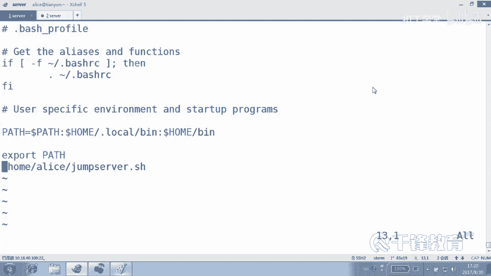

# 千锋扣丁学堂Linux云计算系列：Shell脚本自动化编程实战视频教程 - P15：3.9 case 实现jump server 下 - 扣丁学堂 - BV1SE411q7vK

好，那我们现在这个脚本呢已经实现了从跳板机到后面这个机器的一个什么？

一个登录是吧？那等一下我问一个问题，我们现在从跳板机连到后面机器是采用什么方法验证的？😊，密码密码是吧，我们想采用什么验证？😊，怎么做？SSSSH杠KEYGN生成密钥对，对吧？然后紧接着呢。

SSH杠cobe。杠ID到web1web2是不是这样拷贝过去？再问一下，以哪个账号的身份做。因为你知道的吗？我们最后用户是登录到是爱丽丝是不是登录的这个账号登了这个机器。

而这个机器是不是再是爱丽登过去啊？😊，所以我们是爱丽丝身份来做这件事情。看到了吗？当然不是说一定是爱ice，是因为我们最后确实是是是是用什么。

X登录那边的好，这是细节地方啊，来，我们把这个做一下怎么做。😊，现在是。还得是吗？当当当当产生了什么？公钥和。再点S再点SSH里面产生的公钥和私钥。然后SSH杠copy什么ID拷贝谁？192168点。

呃，多少来着？12。241241241。是什么身份？考的？没错，密码是什么？

考过去了吧，然后还要考22什么？😊，210。还要靠。52。然后是。好，下面我们再来试一下这个脚本，怎么是ja server是吧？一连过去了吗？嗯，退出来2连过去了吗？😊。

3两过去了吧。

好，现在呢这个已经完成了什么登录？😊。

密钥登录，这个是可选项，不是说一定要这么做。然后紧接着我们就要做什么事情。😊，这个脚本应该放在哪个地方？放到跳板机哪个地方？😊，我们的客户端使用什么账号登录，登录这个跳盘机的？😊。

好，那就应该放在哪个地方？😊，房子哪没关系。位置是在这儿home下的adicem server。没有加权限吗？哦。是在这个地方吧。😊，是在home下的adice下的jam server。好。

这个路径我们整个拷贝下来。😊，放到哪个地方去？alice点bash比方说besh profile里面或者RC里面都可以。只要是它能够上来就。

执行的文件明白意思吗？好，比如放到后面去。😊，不用点，直接执行就可以。做执行就可以。好，这个字怎么试啊？

台找一台机器呃，不不是找一个对，退一下或者开一台机器，然后以什么身份？😊，爱ice身份连到跳板机。10。18点多少？40。100。但我们肯定得输爱ice密码吧。

看到了吗？上来以后是不是就连到就连过来以后就进到了这个叫。😊，这个上面去了。看懂了吗？各位。然后能退出吗？

ctrl C哎能退出吧。退出好像不太好吧。退出好不好？

就是意思是说用户像这样看啊，连过来以后，密码输完以后。

他可以选一可以选2，可以选3选一。

退出。小二。退出选三退出，甚至可以这个退出没有用，因为我没有做这个。

ctrlC是不是就可以了？😊，各位，你们觉得他应该按contrl C吗？😡，我们是不是不应该让他能够出来啊？能听懂吗？还有一个连过去以后，要不要把这个屏幕清一下，要不要？😊，你觉得如果轻一下的话呢。

那就。点进去以后，首先怎么做？c一下是吧？我们看一下这个这个动作啊，可不可以执行。😊，哦，密码打错了，抱歉。😊，上面其实可以再写一点东西，就是这是一个跳板机是吧？我们加一点加一点注释，明白吗？

然后用户选择，但是我们唯独不满意的是。😊，他能c数lC。明白。那怎么做才能够我不让它卡住C呢？😊，我们有一个捕捉信号的一个指令，在 shellll里面捕捉它的按的键盘信号。捕捉什么信号？捕捉信号。

首先做什么，我们什么都不做。😡，哪信号呢？😊，HUP。int中断信号。好，这些信号呢。😊，我们捕捉到以后，什么都不做，看到吗？比键盘的中断我们都不我们都不接受了。😊，你按了，我们什么都不执行。

也就是说防止他从脚本当中什么。退出来，就算按ctrl C也不好使。我们捕捉到相应的信号，我们没有捕捉所有信号，相应的信号，然后做什么操作？😊，是不是什么也不做的操作？是不什么也不做。好。

再执行一次看一下啊。😊，卡住C。不好使。是不不好使？看除了你在这个界面上蹦，然后你整个整个退不出去。😊，你可以把这个界面关掉，但是不会让你什么。😊，退出这个脚本。没有吗？这个你退不掉了，现在除非你关掉。

😡，就没打算让你退出来，对不对？😊，另外对于这个脚本的美化工作，你可以稍微去美化一下。比如说。这个你要不要把这个打印的内容呢稍微再再再什么？啊，有时候比较喜欢使这个符号，你们看。😊，好。

这个再有一个竖签啊。是不这样也可以。你可以自己来构建一下这个整个输出的一个格式。好，我们再次呢连到以什么身份，以爱丽丝身份连到跳板机10。18点多少？100那个。40。100密码。

那这个你自己呢美化一下好吗？😊，然后请输入这些东西都可以通过颜色的方式来来做。但是我们知道readd是没有颜色。这的没有颜色，但是什么有颜色？😊，ele颜色吧。所以这个东西呢可以可以怎么做呢？就是。😊。

ja server，然后不要使readd了呃，使readd。先通过rle。是不是杠一啊来打印一个颜色。输入什么？Number。NUM啊，不它不能够输NUM。然后怎么着，readd杠什么？😊。

这个read是不是就直接仅仅是读入变量就可以了。😊，但是这里有个问题有个问题，你们看一下啊，唉，这种能看懂吗？😊，我这写颜色了吗？这个没有显颜色吧。😡，那如果想使用颜色的话呢。

可以在上面定一些颜色的变量。或者是干脆就在这个地方写什么。😊，是不是这些写颜色杠E什么方括号。😊，一分号。什么颜色？31红色我这个显示不清楚啊。32好吧。输入一个最后完了以后。

是不是要重置重置一下斜线E。一。哦，不是0M吧，0M好，看一下，我们边边做来边测试，这边再次呢。退掉以后再。连一下。哎，换行了。😮，挺不好看的吧。你希望换行还是不希要换行？😡，啊，对。

那为什么现在换行了呢？因为acle默认会打印一个换行符，知道吗？😊，我们啊。嗯，no有一个N表示不换行。好吧，有些时候我们要打一个，比方说123456就想上连续打怎么办？不会啊。😊，不换哈，明白吗？😊。

啊。N表示不换行来再保存一下，各位再来看。对不起，我也只能关了啊。😊，不好吧，说一。明白了吧？好，整个这个脚本呢，你可以根据你的需要。那我们没有办法作为用户来讲的话，它是不可能退到什么推到这个。😊。

爱ice的那个。加目录或者说那个机器上面的，因为我们没打算让它在那个机上，这个跳板机是可以登上去，但是不能够。😊，你进入到踏板机，你可以借助你踏板机什么往后走。那为什么我们在输一以后没有输密码呢？😊。

因为我们做了什么事情。

我们是不是那个。嘅。后面的这个验证使用了密钥的方式。

好，那么照这个做法来讲的话，基本上我们这个跳板机呢，这个简单的跳板机功能就实现了。当然有人说老师能不能够谁登录过，能够记录啊，做了一些操作，能够记录那个做不到。那个我们要使用python去写。😊。

写一个非常复杂的跳板机。😊，他能够对用户的行为进行一些比方示记录、录制等等等等，对不对？这个我们只是一个简单的跳本机。😊，但很多时候我们发现已经可以用了。

明白吗？再次梳理一下整个过程，看看我们做了哪些东西。😊，由于在生长环境当中有两个限制，一什么限制？在生产环境有一些限制。有两个限制，一就是。什么限制？一。我们的我们的业务这种服务器。😊，是不允许是吗？

直接。连接的通常云玉从谁？从。🤧Okay。跳板机。连接明白吗？这个怎么做到的话呢，我们可以通过防火墙来控制，是不是？😊，第二。业务我们的同样业务服务器。不允许什么？root用户。有。

还好能接上root用户什么直接登录，这是两个非常重要的限制。😊，肯定不会让你入T用登录的。😡，Yeah。那整个。我们看到。我们在后端建立了一个。爱丽丝账号是吧？😊，我们尽量所有机器都使用普通用户登录。

然后在所有机器上都建立一个idice账号，这作为我们的管理账号。当然，密码肯定应该设的比较复杂，能明白吗？特别是前面那个跳板机，密码肯定是非常复杂。😊，但是复杂没关系，用户只要登一次。

第二次是不是就不用登了？😊，但或者是呢你后端如果没有采用密钥认证的话，那你后端登的时候，你是不是还要再次输一次密码？明白吗？还要再登记密码。

那么甚至你可以呢在登的时候给用户一些提示，说我们当前登录的用户是爱ice，请输入爱ice密码。

当然实际上也可以不给。因为他在登的时候，那个标签上本身本身就显示什么。全是爱丽思吧。😊，那我们所有的工作都是在其实所有的工作几乎所有工作都是在跳板机上来做的。在跳板机上面，我们要。写这个脚本是吧？

而且这个脚本呢，我们还要避免远远程用户能够把这个脚本退出。所以我们对信号做了一个捕捉。捕捉以后呢。😊，对相应的信号做直肉罔闻的这样一个处理，就是没有做任何处理，对不对？

那另外这个脚本放哪个地方也很讲究吧，脚本放哪个地方？😊，你肯定不能放在别的用户的那个呃放哪儿没关系，我的意思说在哪个地方执行。😊，我们刚才是把整个脚本这个脚本可以放在根下面，可以放在home下面吧。😊。

但是在哪儿去吊它呢？一定要在跟爱丽丝这个登录是相关的地方，明白吗？我们在前面给大家讲过，有4个s的配置文件影响它的登录，也有两个影响他的什么退出。😊。

退出的话分别是look out那个对look out和什么和那个叫history历史记录，对不对？登录是什么呢？有两个系统级别的best profile和be RRC。也有两个什吗用户级别。

而这个事情我们想来想去都发现只能够给。😊，用户级别就是你要它作为登录跳板机对外那个用户。比如说有两个两个文件，一个是by是什么profile，一个by是什么RC。😊，其实哪个文件都可以吧。

就是把脚本放在里面，让他在登的时候，由于会读这两个文件，所以会怎么样。😊，会去执行这个脚本，从而触发什么。跳板这个脚本。然后加上也不让用户退出来，所以用户呢就只能够做这个事情。明白吗？那么这样的话。

我们可以减少用户的这样一个登录的麻烦。而且呢把整个登录的过程当中给用户明晰化。而且。😊，非常的清晰化了。😊，好，这就是我们做的这样一个ja server。其实大家可能会发现。😊。

整个脚本可以说是非常的简单的，对不对？整个脚本无非就是一个什么脚本，就是一个标准的打个菜单，然后干嘛？😊，然后读个变量。紧接着case来个判断是不是这样一个脚本，这是很常规的脚本。

包括我们前面写的那个系统工具箱，也无非是这样一个层次吧。😊，方面吗？也包括我们写的这个各位看也包括我们写的这个哦，sorry。😊。

也包括我们在后面给大家教大家写的这个虚拟机管理。😊。

也无非就三部分，哪三部分，第一，干嘛？打了菜单。第二。堵住一个东西，如果用户你要干什么？好吧。第三，kis做一个什么模式匹配。😡，看看你要干的那个事儿和哪个匹配，我们让你干哪个事儿，你是要装虚拟机6。

8呢，还是要装7。3呢？能理懂吗？其实我们现在只缺的是。😊，怎么去管理虚拟机？脚本不缺了，能听懂吗？😡，那么那个系统工具箱是不是也是这样的，先打个菜单问用户，你要干什么，你要选什么，我给你个提示。

然后紧接着呢。😊，通过readd是不是读入一个变量，你要是通过readd不读的话，没有颜色怎么办？刚才讲过怎么办？可以让谁来帮帮助一下。😊，ic echo在读的时候加一个E来可以加颜色，对吧？

可以解释里面的关键那些特殊字符加一个N来干嘛？不换行，防止的你输的东西和上一行是开的。然后紧接着来一个什么read。😊，变量就不要在加提示了。最后呢完了以后，紧接着判断这个变量的值到底是什么东西。😊。

到底是这个。A呢还是B呢，还是C呢，还是你啥玩意儿都没有输呢？还是其他的呢？你看各位套路是不是都是一样的，不同的是跳板机这个脚本，它不是说。😊。

单纯的去写一个什么。写一个脚本，它是要有一个环境的。那我相信很多人，如果说你没有理解我们这个整个登录的过程和这个环境，就算那个脚本你写的出来也没有用，对不对？你也不知道该放哪儿啊。😊。

你也不知道该在哪去调它呀，对不对？你也不知道这之间怎么验证，怎么密钥，怎么登，怎么那个还有密码认证，你也不知道怎么回事啊。所以我们说过脚本就算到现在我们是讲了个case，但是。😊，语法确实是相当简单。

是不是它的麻烦地方在哪儿呢？再问你要干什么？😡，没有需求就没有什么脚本。😡，我们讲过，你不能用脚本去，你没有必要，或者说没有完全没有什么必要去用脚本写一个金字塔或者是三角形，是不是或者圣诞树。

那个仅仅是考验你的这种逻辑思维能力。考验不了你这方面的需求。好，各位这个图片各位截了吧，应该。😊，接了吧。

OK就是这样一个场景，自己来写一下，好吧。😊。