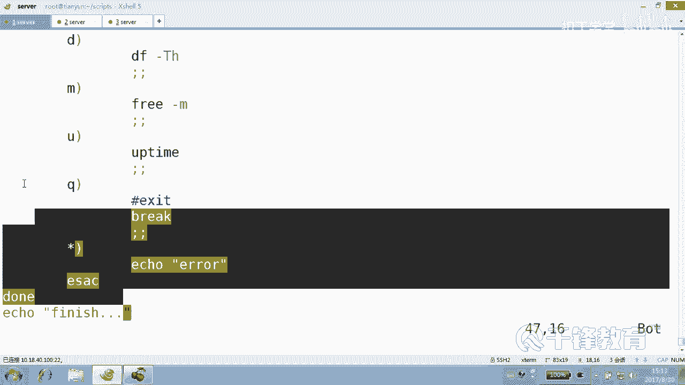

# 千锋扣丁学堂Linux云计算系列：Shell脚本自动化编程实战视频教程 - P16：3.10 case 实现简单的系统工具箱 - 扣丁学堂 - BV1SE411q7vK

好，接下来我们带大家来通过kis呢写一个非常简单的一个系统管理工具箱，就是最后所呈现的效果是什么效果？看好了，当你选择会首先给你提出给你来一个菜单，然后呢问你选择你选择什么东西？就做什么东西，看到吗？

类似于我给大家提供的这个脚本一样，类似于就是。就这样一个东西，明白吗？选几做相应的操作。这就是case的匹配啊。😡，那么大家都很清楚，很明很明显的，我这个蓝色的肯定是一个read的读入吧。😊。

就让用户输入吧，然后输的东西，然后是不是做判断到底输的是一还是二还是三还是4还是5还是Q啊。😊，那肯定是ki了，衣服可不可以？😡，可以啊，衣服是不是太过于。麻烦了。所以这个时候我们用ki来。

我们先从简单的工具箱开始，我们一直给大家强调我们的脚本这几天只是个开始，好吧。😊，好，那怎么写供应销呢？😊，手快的同学跟我一起来。😊，做一下。然后创建一个system的一个。管理的工具箱。01吧。

点SH做系统管理。好，你要是手慢的话，你敲停啥就算啥吧，好吧。😊，这名字敲到哪算哪儿。54321走。井号叹号，你要手慢的话呢，你这些这些个注释的东西就别拽了啊。😊，直接。好，我写这些同时就是为了。

等你们。我在2020年等你们啊。好，首先。我们在屏幕上有同学问我说，哎，我们在屏幕上输出这样一个东西是怎么输出的？这一段是怎么输出的整个这一段。我们read的书这么长一段。不太麻烦了吧。

这个肯定是瑞的书的，好吧。😡，而且还有颜色，哎，看到吗？😊，那怎么输的？瑞ta怎么输出颜色来，这个事情很很很很有意思啊。😊，讲过吗？readd。😡，readread带颜色的。

把那个把那一段话先给打有道理，是把那段话先用e打出来。然后read在read在书的read在读辩的的时候就不要带任何提示了，看到吗？请用两句话分开，一段是icle先打打出来，打颜色出来。另外一个是什么？

read在读的时候就不要再带任何提示了，😊，放后面热的放挨个后面啊。好，这个就先不告诉你们啊。😊，那个我想我想我想说的是这个前面这段话，你用日月打的话，你不死去吗？这么长一段疯了，你。😡。

那个要不是ele啊，不要不是那个ele打，要不然就是cat去打，要不然呢用print F去打。😊，对不对？肯定不会用那种的来，我们打吧，我们用cat。😊，这个总见过吧。这个结尾写上能认识吗？好。

如果兄弟你选的是H。😊，那我们让我们意思获得帮助。😊，明白吗？如果你写的是F。我们就是一个磁盘的。Partition。如果你选的是D呢，那就看一下磁盘的。😊，这是文件系统的。mount挂载情况。

如果你选的是M的话呢，看一下内存的。情况，但我这个英文写的比较简单了啊，因为太长我也写不出来。😊，啊。然后紧接着呢，我们还要看什么？如果看U的话呢，就是看系统的一个load负载。如果你按着Q的话呢。

那就咱们再见吧。😊，好，各位这段话没有任何意义，只是在屏幕上显示而已，仅此而已，看到吗？执执行一下啊，边整边执行。He。加X。System。是不是这样子？说打印的话。好，输入12345678910。好。

有同学说这一段呢怎么好像没有前面没有没有空格啊，是吧？😡，因为我按了个table键，其实没有任何用处。在这儿。你可以敲空格键来展示一下。也可以呢。给一个。嗯哼，不是这样。唉，全景号吧。

这个的话就会有了啊。哎，这麻烦这个。好了，那。这是否是输出？再来试一下。这可以了吧。你自己看看你要来一种效果啊，你上面还要要不来个菜单，说这是系统管理工具箱，你显示一句话，那随便这个不勉强来。

这个不是重点，重点是什么？重点是我们的。哎，你说出了这段话以后，然后该干嘛了？😊。

是不是要用户做出选择？然后怎么选择？re杠P。明白。请输入什么呢？呃，这边请输入。然后按H呢是获得。For help。同样吗？这个一定要有空，这儿一定要有空格，这是变量，前面有没有空格，不要紧是吧？好。

用户是不是输了一个，用户从这里面输了一个，输了以后，你要干嘛做。😊，模式匹配能明白吗？紧接着该谁上场了？SC case in啊，不。Dollar。action inESAC来吧，匹配谁？H是吧。

我操H就麻烦了，H怎么办？😡，H去怎怎么弄？😡，把上面那段再再打一段，那我受不了。😡，我我觉得不应该这样。我觉得应该。把它写成一个函数。没有吗？函数的作用是为了方便重复的去什么？

其中一个功能呢就是为了方便能够重复的调用，我们写一个函数。😊，函数的名字呢，我们暂且将命名为manu菜单，好吧。😊，注意这个函数啊是这样的，刚才我们在执行的时候，屏幕上是不是输出了这段话。

但是我现在只是定义了一个函数。😊，所谓的函数呢就是把一些它是一个。

一些代码的块儿或者片段。

它只是某些代码的片段或者某些块儿。一个代码块儿。它主要是为了干嘛能够实现重复的调用。主要目的之一为了实现重复调用和能够让我们的代码变得整洁。你看我想说的是，如果用户按的是H的话，那么理论上讲。

你是不是还要把上面那段再打印一遍？😊，啊，不了，那就直接。😊，什么。MENU函数调用就可以了，看到吗？当然当然当然各位上面是不是只是定那一个函数啊？😊，那么按理讲呢，这按理讲的话，刚才这个cat它是。

他是老大，他顶着边写吧。现在来了个真正老大，他应该。😊，让一让。但是如果说哥们儿你不加这个小杠的话，这个UF就会有问题，明白吗？ok好，那问问问大各位一下，上来以后，我们定义了一个函数。

有没有函数执行啊？😊。

有没有去调用函数？😡，没有，所以屏幕上任何东西都不会打，除非什么？😡，你上来不不会很突兀的说请输入东西吧。😡，那用户说说啥呀，我看了看不见。😡，你看我把下面这段话给大家注释掉，让你们观观察一下啊。😊。

请输入说什么。苏清我不知道。对呀，没有啊。所以呢我们先要上来以后，肯定要把菜单给人家。😊，先打一下吧。然后上来以后先打一下。然后你说输入人家说哦，输这些啊才懂吧。😊，没完了吗？那三个懂书这个东西。

舒克也没用，因为。你说啥我都后面没用。用不上。好，骗人的。来，如果用户输H的话会怎么样？A打一下菜单。那如果你紧紧接着输吧，输F的话呢。说F话怎么做？数F的话就是。DF杠什么？哎，F不是吧。F是分区吧。

分区磁外分区信息。那么应该用的是for disk。杠L好，这里要说明一下啊，说明一下这条这个这里面我为什么没写个函数？😊，因为太简单了，就一行语句。如果没如果像上面那个menu一样，那么长菜单怎么办？

我也整个函数。😊，然后下面呢函数调用明白吧？好，好像。😊，在你们心目中，韩数应该是一个很高高尚的东西。但是被我讲完以后发现。😊，怎这么低俗好像是吧，这为了就是为了可调用一下。😊，但是在校里面。

我大家说实话，真的很多时候。你不要把它想的太。太高大上了，他就是一个很。普通的一个人。O。好，然后紧接着呢还要干嘛？按按哪个键。😊，按地见。就会显示磁盘的挂载情况。是。啊。然后如果按什么。

M键顺序没关系，它就匹配上就可以。我们看内存吧。😊，这个M是按照显示，如果不加M的话，是按字节显示，明白吗？然后还有什么呢？按。U是不是显示？Upload。阿不太。up time这个我们可能没有说过吧。

这显示。歯水病。1分钟5分钟，还有什么15分钟的一个负载情况啊，这个和top和top看到的。上面那个老袋儿是一样的，这一行是一样的，看到吗？好了，各位现在呢还剩一个兄弟了，就是。😊。

有同学说他有没有可能啥也不输啊。😡，按Q的话肯定就退出吧。按Q的话就except。然后如果按的是芯儿。就怎么办？就告诉他。Soう。是不是说错了？没有此选项好。😊，有同学跟我说那没有书会怎么样呢？

没有输也算星儿。好吧，但是归到星儿那那去。就一会儿呢我会把把那个没有书和星儿稍微分开一下。星儿我们认为是那些乱七八糟的，而没有书就是。😊，没有书。好，这个脚本呢当然会有很多问题。😊。

这是不是你不是你想那么唯美，你看啊。😡，执行一下。system manager，然后按什么H键。哦。😮，嗯，是写着俩哈。😊，前面那个意是不是应该滚一边去？对，这个道理很简单。

可以在菜单之前先clear一下清屏吗？我们从来不用这个命令啊。😊，我们从来在在命令行下面，像这样，从来是不用这个clear命令。但是在脚本里面我们用的是ctrl加L，但是在脚本当中，谁帮你去按呢？😊。

那可怜呢。来再看一下H。可以了吧。但是让我们感到很遗憾的是，退出来了。😊，没办法，这个脚本没有循完，只能只能做一次，没问题啊。😊，D呀，没问题啊。😊，M没问题啊。😊，U没问题啊，在执行Q没问题啊。

好假是吧？😊，没有意思。什么意思？😡，就是这东西是你认为他有意思就有意思，没意思是没意思。😡，所以我们改的是版本几啊。😊，版本一呀，对呀，那那自然就是就是没意思啊。😡，现在是不是选完以后就退出来了？😊。

你按不按Q你按不按Q，他都最后也能退出来。😊，听明了乖？那怎么做才能够让他听话的不退出来呢？你记住一件事儿。想想让谁把它囚禁在一个地方，不让他出来。死循环是最好的。出不来不死循环在我们的世界里面。

死循环也不是真正的死循环。我说任何东西都有都有结界的，都能出来的，对不对？那就是那个Q。😊，明白。徐环也挡不住exact呀。😡，你挡挡不住退出啊。好，你记住，你想一个东西能够反复执行，只要你这个想法。

😊，你就来个什么死循环好不好？同样我在之前给大家讲过，你在想做一个某件事情的重要确认，怎么做，还记得吗？😊，用什么read在结合什么？😡，ki或者是if是不是去看用户输的是不是Y啊。

你同样你想把一个人囚禁在哪个地方怎么办？😡，是循环。好，怎么做呢？😊，所循花是怎么做的？什么都没有改变。这样w。😡，这个w这个循环呢，虽然说我们还没有讲，但是我们现在就开始用了，所以就会用达到什么效果。

达到后面我们讲的时候就发现没有讲的了。😊，好，Y要循环呢它有个条件就是。😊，他们都是一个他们都需要一个返回值。只要为真，他们就什么。😡，循环什么叫微针呢？😡，一等于1。这是么为针。然后怎么着哎呀。

二等于2。二等二小于一可不可以？只要为真是不是就可以啊？😊，其实我想我想说的是，你再敲个LS行不行？😡，那也为这样。你敲个da塔比例行不行？😡，不是敲这个干嘛呢？我们是不是有一位兄弟专门是出针的那种的。

就是出啊或者是什么冒号，而且还不会有什么不会有什么显示显得多么的好啊。😊，所以你要是觉得冒号不是你心目中的那个的话，你可以使用te，好不好？😡，然后紧接着呢，do看好了。😊。

当我什么都没有做我什么都没有做，我就是在这个read前面，后面套了一个死循环。看到了吗？各位，我什么都没有做。我就把他们整个这一段从用户输入开始，放到了一个什么使循环当中去。😊，明白了吗？乖。

能不能听懂？整个把整个整个放到这个死循环里面去。然后我现在再次。😊，这个do后面是当。当然这个时候其实理论上讲，这这堆兄弟们他们就应该。缩进嘛，他们以前认为自己是老大，因为没有来真正老大。

先来了个老大以后，他们应该。😊，往后走吧，当是他们也可以倚劳卖老不走。好，看一下。system manager好，现在IH退出了吗？按F退出了吗？按D退出了吗？按M退出了吗？按U没退出吧。

按Q那就再见了。因为就算死循环也挡不住。Outet。去出这样一个东西。所以实际上你看这东西没有那么复杂。😊，这个函数呢也不像你们想那么复杂，它就是一些代码块我们放在一起的，是吧？为了能够方便调用它。

你看。😊，有几次调用这个me，有几次。😡，一次两次，你要是如果还有三次4次呢，你老写这段代码是不是显得多么多么的不好啊？我们写成一个小函数，然后主程序就是这一段，然后我们把它放到一个什么里面。😊，好。

对不起，我现在该他们该干嘛了？😊，缩进了，因为他们本身就没有那个脸呆在这儿。好，这个死循环构成的方法非常简单，就是。😊，我是吗？冒号条件为为为什么？😡，为真就可以。当然不s也可以。他天为甲是不是可以啊？

😊，Until。foralse就只要为假就循环。而这for能够带来无无限制的甲，看到吗？😡，就两个两个人执行不一样啊，这个我们在后面会给讲到well和unt的区别。好吧，今天战士呢就不要管了。

今天你就认识一下那个叫well行吧，这位大哥需要条件为什么？真才执行满足他。😊，你看当你选的这个，看假如说你选的这个F是不是做了这件事情，按照case原来来讲的话，是不是就怎么着退出去了。😊。

是不是退出去了？但现在能推出去吗？就推到循环这儿一执行发现又是什么？😡，右为针，那就再来一次呗。好，那我问一个问题，我考你们一下。😊，我考你们一下啊。哎，有钱。这套语句有可能执行吗？有可能执行吗？

有没有？怎么执行说。😡，可以。说什么执心。😡，来试一下。Q没有机会啊。😡，跳出来知道什么叫跳出来吗？😡，这不叫跳出来，这跳。这就。他呀反正是要死了，反正是。对，没错，有同学想到一个命令。

这个exet这个东西是很凶的，换成它的另外一个东西叫做break，这才叫跳出。😊，这个braack是跳出程退出程序的啊，不是不sorry，这个ex是什么退出程序的，而braack跳出什么循环的。😊。

明白吗？所以呢你要是觉得不是。😡，这就看你这件事情做完以后，你你你你以后还想干点啥吗？😡，如果说啊我就死了呗，这样的话。😡，我就是我就到这儿，我我觉得活够了，已经。😡，没有什么可做的了，后面没留念子了。

好。😡，那你就不ex是不是就可以了。那如果说你觉得。😡。

这个循环它只是我这段感情嘛，谈恋爱，结婚生子，它只是我人生当中的一部分或一个过程。我可能还有下一段。😊。

那你就要跳出，而不是。退出。等能那边吗？好，现在请问大家faure是会执行吗？😊，确定。我想了这个是跳出什么？😡，循环的你觉得飞这是会会实行吗？答案是。肯定会的。那必然会吧，对不对？

因为breakack没有那么excess，那么残忍，好吧，看懂了吗？各位。😊，所以只要你想某一段代码能够反复执行怎么办？给它套上一个死循环。但是你别忘了，我们这里的死循环其实并不是真正意义上死循环。

是可以是吗？😡，还是在某种情况下可以什么再见的。比如说Q啊，不是不不sorry，比如说什么exit，比如说什么back可可以再见。😊，好，这就是我们用cases写一个简单的系统工具箱。😊，嗯。

这个工具箱其实我们个人觉得是有个遗憾的。你看什么遗憾。😊，看哎哎哎。这这这这这输错误好像显得特别的不高雅，是吧？😊，对，因为我现在输的那个就跟我说了这段东西一样。你看。😊，你看我说的这都一样。

不是你怎么能把这种纯洁的和不纯洁的去比去那个放过一起去比呢？😡，我没有输，那不代表我下一次不输啊。😡，但我输错了，是不是另外一回事儿？😡，能听懂吗？各位，所以我想说的是我们再加一个什么。😊。

加一个特殊的空的选择就是。啊夹在哪儿都行，只要不夹在哪儿。😡，空能这么写吗？😡，啊，空龙这么写吗？😡，能怎么写？嗯，双引号单引号都行。哎，做什么事儿？😊，能做什么事吗？😡，看是不是说别的是不是就报错了？

好，可以，什么都不做。可以什么都不做。明白能听懂吗？各位好，大约有一天你们能能明白这一点啊，不是大约有一天，就今天哪一点呢？😊，其实我想说的是，这里呢由于只有一行语句，所以呢写成一行也是什么？

语法上没有问题的。所以我为什么这么写？其实我不喜欢这种方式，但是有些时候你们看到别人代码都知道这是。😊，这什么意思？好，问一个问题。😊，只有最后一个可以不加分号，好吧。

最后一个啊最后一个当然也可以也可以加分号。那上面这个可不可以缩上缩上去，可不可以？😊，可不可以这样？可不可以这样？觉得可以吗？什么叫不可以啊？你能不能加个分号，一行上是不是敲多个命令话。

不是可以加个分号？😊，这有啥不可以的？这看起来是不是有点。现在直观不直观，我不太清楚了，已经。😡，就是看你们感觉直观不直观。因为这个这个事情他就。他就一件事情。他就一件事情。😡，所以。

我们可以写成单行的这种形式是吧？看结果啊，如果H的话就怎么做F怎么做D怎么做，M怎么做？如果说的是空的话，怎么做？好，整个这个脚本的过程，大家再看一下，就是咱们先排除这个函数，好吧。😊，好。

上来以后先怎么做打印一个什么。😊，菜单儿，然后紧接着呢进入到一个死循环，是不是死循环？😊，循环在外面呢。还有一番天地。进入使循环以后。根据我们其实就是一个read，结合什么ki语句的组合吧。

read的作用是让用户照着菜单去输入。然后紧接着呢，通过什么ki去做这种模式匹配，匹配什么做什么？如果匹配到Q的话，是离开这个离开这个位置的地方，那我们就可以到后面去做事情。

如果说整个程序到这儿就结束了。😊，实际上back或者是什么。😡，exite都没有任何区别。这里明白吗？各位好，这就是一个简单的系统工具箱。😊。

