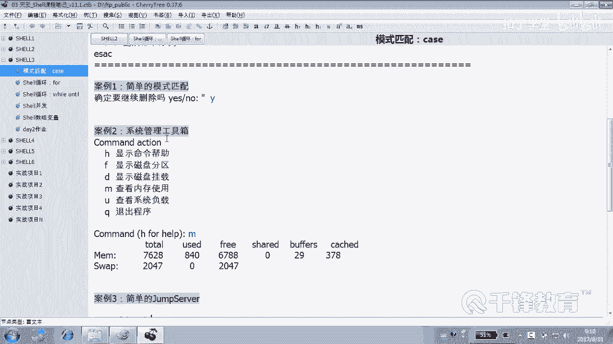

# 千锋扣丁学堂Linux云计算系列：Shell脚本自动化编程实战视频教程 - P17：3.11 case 实现多版本php安装 - 扣丁学堂 - BV1SE411q7vK

好，各位在前面我们讲到了ki的一些用法是吧？然后我们举了几个例子，包括。😊。

我们怎样去回答这个yes和low，然后来确认一件事情，确认前面的一个动作，以及我们去写过一个简单的系统管理工具箱是吧？sstem manager，然后也写过一个简单的jump server。

这个jump server呢这个脚本本身比较简单，但是呢。😊。

它的场景大家要记得。我不知道你们有没有去做好这个动作。如果说你能做好这个动作，我想说的是听好了哎。😊，现在你们的虚拟机我本身连不上的对吧？😡，没没错吧，你们的虚拟机。

每个人的虚拟机是在一个私有的网络里面，我是连不上的，但是我能连到你们的什么机器。😡，是不真实机械？有同学说，老师，你能帮我远程连过来排个错吗？你知道我要怎么连吗？😡，我先第一步连到你的真机。

使用一个账号。然后紧接着呢。我再连到你的虚拟机，是不是很麻烦？那如果说你在你的真机上面。干的什么事情？你在你的真机上面。😡，写一个jum cell的这样一个脚本。然后比方说放在爱丽账号里面，明白吗？😊。

那我这样的话，我是不是爱丽连上去以后。我就能看到你的后面的那几个瞬机啊，然后我选1234，是不是可以连过去啊？😊，那有同学说，老师，你连过来以后，你连到我最终的续机密账号是不是还是普通账号？😡。

那不一定好吧，我们昨天我问一下那个图片，我就不给大家展示了。我们昨天在跳板机上是不是往后连的时候，我们做了一个密钥的验证啊。😊，还记得吗？当时我们准备的账号统一都是哪个账号？爱丽丝。

然后我们把爱丽丝的密钥是不是传给了后面熏机。的爱丽丝用户。当然我的意思是说也可以传给谁。😊，穿个root。明白吗？就算是爱丽丝的密钥，一样可以传给后面的。Root。能领懂吗，各位。那我我这样的话。

我我要给你排错，怎么排？我连到你的跳板机，物理机，我使用爱ice，这是一个普通账号，没错吧，但是我选一夸就是什么身份？😊，root身份是不是连到后端？这样的话，我是不是就可以快速的去连到你的虚音机。

帮你进行。😊，这叫什么？一些排错啊相应的操作。明白吗？好，我希望你们准备好这个环境，否则的话我以后不会给你排错的。😊，就是在真机上面，我再再强调一遍啊，在真机作为什么机？😊，跳板机在真心上干了什么事儿？

😊，找一个，比如说比都统一吧，叫爱丽斯加号。啊，不就叫天云账号吧，好吧。统一真金上搞一个天云的账号，明白吗？密码呢就叫一OK。😊，这是一个普通账号。没错。然后我一年过去就马上会出现。

森德S7-1森德S7-2C德7-3森德S7-4。能理有吗？但是你往后连应该怎么连呢？😡，连用什么账号往后连。😡，root，否则的话，我没有权限啊。😡，那你懂么呢？然后你的天云账号的密钥推给谁？

推开后面的root。

明白吗？但推的时候要讲究了，你看推的时候有个讲究。😊，什么讲究呢？你看这里。😊，这个叫。我切换到Iice吧。😊，哇，我一切过去就没有机会了。你看因为GX是不是就会。😊，干嘛就会触发那个脚本吧。好。

换一个脚用户说说一下。哦，不，这入的一下改也可以吧，后面下载什么？😊，alice家里面的jom server是不是可以，这里什么什么往后连。😊，什么身么王后年？住的当然还不行，我们还需要做什么呢？

我再新建一个用户，比方叫猪猪吧，然后切换到这个猪猪里面去，这是一个普通用户吧。是不是首先生成这个密钥？😊，会吗？生成一次就可以。然后SS杠copy杠copy IDD给谁呀？192168点比方说12。

241。注意你这是以什么身传给他的什么用户？不是你这是传给他的什么用户？😡，猪猪，因为你是猪猪船的，他默认就会找他的猪猪去。好吧，你完全可以这样做，明白吗？😊，猪猪的密钥一样可以传给谁？😡。

其他任何用户听懂了吗？因为你不加用户名的话，默认就是以当前用户的身份去登。所以我要求的是你们怎么做。就是我连你我连跳板机的你用什么账号？😡。

天云密码是。没听明白吗？我连你的话，我这是我。😡。

这是你的。你的这里面是不是有好多虚拟机虚拟机虚拟机。我连你的话，我使用什么账号？😊，统一一下，我使用天云以后不这么做的人，我不会解决问题的啊，密码是一，好不好？我连你使用天云账号连。

但是呢跳板机你往后连使用什么账号连？😊，跳板器往后连的话，它再往后连的话，像这样往后连的话，它使的是。Root。所以你要怎么做？😡，你要第一你要在你的什么账号。天云账号里面干什么事儿？SSD杠。KEY。

GENK是吧，然后紧接着干嘛？😊，杠copy IDD以前是传的谁啊？😡，以前以前是传给表天云是吧？因为当前用户嘛，现在传给谁，对方的。😊，要求表示叫。192168，你就可以写那个对192168点。12。

2，比如说好吧，明白了吗？那这样的话，我连你使的天云吧，你往后连使的是什么？😡，ot，而且是基于什么验证咪药好不好？😡，那你脚吧你们怎么写？😡。

条本里面也要怎么写？脚本当中肯定也要写成什么？😊，脚布里面是不是这个地方也要改成root呀，听清楚了吗？我可不想连到你后面去再给你切换一次账号，我挺麻烦的。好，请各位再把你的机器整成这种形式，好吧。

否则我以后很难去跟你连到讯拟机上去解决问题。😊。

没有吗。这能听懂吧？这个昨天呢其实昨天还。

昨天师凡杰同学呢？说了一个事情。cttrol C不可以退出是吧？但是我们可以给它来一个Q退出，明白吗？Q比如说怎么退啊，exide不可以吧。😊，他做了一个什么动作，就是。我们前面是不是讲过PQ还记得吗？

😡，把那个用户的这个终端，把当前用户的终端获取到以后，给他kill掉，给它杀死。这样的话呢，它就能够推到什么推到我们外面来，是不是？😊，这个大家可以想一下，如果觉得有问题的话，可以请教他一下。

相互探讨okK。😊，你看我们这个现在是不是退不了了？😊，退不掉，我这个插效退不掉，我就关了，顺手是不是我就没关系。那如果说你退不掉的话，你觉得想退到你的这这个连接机上来怎么办？😊。

他的思路就是用PQ而预先获得是不是这个用户的。点击终端，然后再使用PQ杠9是吧？把这个终端整个给它杀死。好，这也是一种想法，没关系啊，可以相互探讨。😊，好，这是关于我们case的这一这一块。

另外其实case呢用数很多很多很多。我这边呢给大家去一一列举一些例子。比如说各位看。😊。

有这样一个场景。这个场景呢当然今天我只是给大家叙述一下啊。😊，这个场景是用来装。我们PP的。这样一个脚本。假如说是双PHP脚本。说到PHP呢，我们来联网看一下。连网看一下啊。我们搜索这个PHB。

当然抛开这些个所谓的什么。这些个。

广告，然后我们进到官网。进到官网以后，PA我们不陌生，对吧？😊，它是我们这个很重要的这个中间键，而能够帮我们去解释这个。去执行什么什么什么样的那个。程序啊。PHP吧。好。

另外你看看到这边是不是下载的时候有很多版本啊。😊，有5。67。07。1。对不对？那么也就是说在我们。甚至早期还有什么，还有5。4啊这样的一些版本。😊，那有的有同学说，那我们应该选什么版本呢？😡。

这个选什么版本，这主要是看开发人员，对呗？开发人员有关系。他如果说基于PA5。4或者5。6开发的，那么你他它的这个产品。那可能就要选择相应的版本，对不对？那所以作为我们来讲的话，我们怎样去给用户选择呢？

我们写一个脚本，那如果这个脚本只是为了装装7。1的，那么可能不合适。因此我们可能要写一个什么。😊，这种多版本的形式，就是让用户可以选1234，好吧，那怎么做？

今天的目的不是为了装PHP或者PAP我们干脆就不会装。我们只是给大家写一个结构。好，这个脚本是安装PHP。那么紧接着呢，我们去打印一些语句。打印的话可以使用icle吧。是不是可以塞口？好。

表示我们打印一些。打一些语句。呃，可以加杠E。因为杠E的话能够解释里面的什么像像什么东西。😊，像颜色的那个。类型是吧，还有呢就是。贴个贴保剑。是不table键这东西。但是实际上是ca也可以。明白了。

这个没关系。😊，啊，我我讲的是呢，如果你想要杠T的话，可以使用什么？😊，这个。Eical。港E。好，比如说我们来一个。杠T一这个是PAP杠。5。6好吧。然后二呢是PAB是吗？7点几刚看了。7。0还有7。

1是吧？还有。这个7。2是贝塔版测试版，这个一般肯定是不会乱用的，对不对？😊，贝塔测试啊。测试版本公测版测试版好，7。0。另外还有一个是。7。1。好，那这段话很显然，就是纯粹只是为了打印一个什么。😊。

ecle嘛只是为了打印一句一段话而已。明白吗？这个。所以你要是觉得这样不好不好看的话，你可以使用cat打印也行。都可以，甚至使用printF打印也成。好，然后紧接着按照我们的套路，大家还记得吗？😊。

套路是什么？三部曲，一给个菜单。第二，询问用户要。😡，干什么？第三，根据用户的选择。😊，做一个条件判断，或者叫模式匹配三部曲，记住了吗？三部曲啊，一打个菜单，菜单的设计的美观程度，你自己来吧。第二。😊。

询问用户你要干什么？第三。那啥？具体根据他的选择怎么做。好，那我们再次打开脚本。😊，询问干什么，芳芳怎么怎么做？😡，是不是使用red？如果说想要颜色的话呢，你得要谁跟你配合一下。😊，要ele。好。

我们这边呢我们问用户选择的。😊，Wren。哦，告诉用户可以选的是啊，上面有1个1-123是吧？😊，好，告诉用户的什么，就是你要选一还是到3。但甚至可以按U oneQ干嘛？退出是不是这样子？

这就可以用户可以不选啊。Q是什么？Exccept。好，那这个你自己看用户选1-3。😊，然后紧接着传给哪个变量。这个变量的名字最好是能够一看就知道是什么意思，能理懂吗？各位wordden变量。

然后我们该干嘛呢？三部曲嘛？我说过一给个菜单，第二。😊，那啥？第二个那个。做什么？现在是不是应该来判断了，判断的方法有两种，一种是使用条件判断，另外一种是使用模式匹配，其实也是条件判断。

那如果使if来做的话，那怎么做？看一下我们先去结构，好吧。😊，判断什么，这是奏差比较还是。数质比较。到了。warren匹配什么？😡，如果匹配的是一。是吧。那我们就啊注意这里呢这里应该写什么呢？

是不是应该写安装PAAPP5。6的过程啊。😊，呃，我们就暂时不写了，因为我们今天还没有讲到专门讲到PAAPP的这个安装。有同学说那y么装还行吗？其实我能写到写到这个层面上，更多的就不是使亚么的装。

而是使用什么装。😊，源码在装。明吗？源码的方法装装的过程确确定肯定不是一步两步这么简单，好吧。那么至于有人怎么装呢？那是不是应该在上面写一个函数啊？写个函数，这写几个函数啊。😊，写一个。写一个什么函数。

再问一遍。😡，写一个这个。装5。6的函数。再写1个7。0的函数，再写1个7。1的函数，看到吗？就把整个过程写到一个函数里面去。这个函数里面内容可能很长。😊，函数的命函数的这个写法我们都应该还记得吧。

怎么做？😊，就是假装一下啊假装一下。😊，函数这个是安装什么？PIB。556吧，这个函数名不要随便再点，好吧，括号函数体。😊，好，今天我们就假装一下来，我们说正在安装什么。😊，安装PI。5。6。

OK就我们只输出一下，其实今天并没有打算真的装。😊。

这个是什么？7。7。0正在安装。7。0。最后一个。这个之间加空格啊，7点1。正在安装7。1，各位上面是不是有三个函数的名字啊，这个名字最好跟变量一样，起的能够很清晰的能看到。好，那现在如果说什么。

当然上面的内容可能很多。😊，有同学说，那就是太多怎么办呢？😡，好。抬头怎么办？对，没错，写到另外一个脚本里面去，好吧，怎么用呢？就把整个函数的定义写到另外脚本里面去，在这调里调谁。😊。

在这怎么掉点儿哪个脚本儿？比比方说就是调一个叫inst杠PHP7。1点SH的脚本调过来里面是不是就有这个函数？😊，那下面这段是不是就不用再写了？对，没错，你可以把所有的安装比较复杂的这个安装过程。

以单独一个脚本的形式，就在那个脚本里面定一个函数就行。好吧，我们这边只负责做什么，做函数的要用，明白吗？😊。

那能不听懂我的意思。因为你想我这个5。6写了30行，7。0写了40行，7。1写了50行，这个脚本是不是就太乱了，不好控制，不好管理啊。😊。

所以我们就单独写一个脚本，再写一个脚本，再写一个脚本，脚本你没干嘛？😊，脚本里面不要写啊，不是写直接写安装过程，而是把安装过程写到一个。😊。

函数里面去。

就是那个脚本被调被在这儿被调用，其实并不是去干嘛执行它的过程，而是把它的函数给加载过来，明白吗？最后我们怎么做？😡，我们在这边是不是一样调用下面调用函数就可以了。能听懂我说的意思吗？😊，没明白。好。

一会儿下课想一下啊。来。😊，那紧接着我们在下面调了一个函数？😊，インスタ。PIP什么。56函数。然后然后就否则了吗？😡，否则有否则吗？然后是不是，然后是alse。If服。是不写S if。

然后第二个条件写上第二个条件。那你不是版本等于一，那你就是。😊，do VRSIN version什吗？版本等于2喽。如果是二的话，我调用哪个函数呢？instPA什么70这个函数。那也不是呢。再判断。

还是把这个写上第三个条件。😊，dollar warrant等于几？3。那我调inst什么？PA71这个函数。最后呢如果不是呢。这个还有可能是等于Q是吧，看到吗？😊，是不还可能说的是Q啊。

是不还有可能说的Q。好，那我再加一个al if什么？😊，认。对不起啊，我我这一个月得加的。dollar什么国ren。帮我看看有没有写错啊，等于什么。😊，今日。那我们就直接exit。退出吧。

否则说什么ele。arrowrrow这输错了。好，各位这个if else语句，这是一个非常典型的if else语句，看起来是非常的痛苦的一个语句。😊，不看。对呀，我们可以把它改成什么ca。😊，好。

这个能看懂吗？先问一下，哎，三部曲你明白了吗？三部曲第一步干嘛？😊，第一步给个菜单儿。列表第二步，让你选第三A步，根据你选择去做模式匹配或者做条件判断。当然前面干嘛呢？我们的最前面可以定义变量。

可以干嘛定义函数。如果说你觉得那个函数的内容比较多，怎么办呢？把整个函数的过程定义到。😊，表示其他的文件当中去以一个文件一个文件的方式定义。然后在这边我们怎么加载这个文件？😊。

点儿或者source是不是都可以？完了加过来以后呢，正常的函数调用。明白吗？就相当于如果是那样的话，我们上面是不是就没有这一堆了？😊，而是什么在上面去用点的方式去执行什么？😊，那三个脚本对不对？

这三个脚本，然后把函数给引过来。好了，那我们试一下，首先检测一下什么。😊，语法instPA语法好像没有问题是吧？这么多眼睛看着的应该没有问题。😊，然后我们来测一测inst PHP。如果选一，没错吧。😊。

有时候推出来的不好是吗？😡，我觉得挺好的，为什么你还要打算在一个系统上装好几个版本吗？当然有没有可能呢？😊，有。我们确实可能在一个系统上装什么装多个版本，明白吗？因为不同的业务可能用到的不同的版本。

它的路径不一样，这个听好了，如果说你使y母安装就麻烦大了，为什么？因为ym安装的时候，无论是5。67。0还是7。1，它的文件放的位置是一样的。这个是不是就造成了你只能选一个的这种窘计呢？😊。

如果是圆木安装呢？不是我们可以放到，比方说放到APP。😊，根下APP下面叫什么PAIP5点儿。6。在下面再放一个什么。APP下面放1个PAAPP什么7。0，看到了吗？

原码安装的好处就是其实有一个好处就是什么？你可以非常灵活的去管理它的版本。😊，而且可以都用上我不同的业务，我不同的业务是不是调不同的版本就可以啊。所以我们在后面还是会还会用到源码的方式去管理我们的软件。

😊，明白。好，对一些这种业务上用的比较重要的软件，我们还会使用源码去做。好，请大家注意看这里那有同友问我说那那个小不退出来怎么办呢啊。😊，怎么办怎么办说说。😡，嗯。如果想不退出来的话，是不是应该。

加一个循环呀。家在哪个地方？没有。在它显示这儿是吗？😡，很好啊。😊，我们加克，然后开始well。杜是吗？

down然后我们这种用法大家都习惯了吧。😊。

看。走你可以吧？好，试一试。一哎。哦，是这样的，不能够随便清屏。因为清屏完了以后啊。😊，前面的那种看不见了是吧？😊，一它抓完以后又回到了这个菜单上面来了，是不是？😊，如果你不想回的话，你可以把这一段。

也不能说不包含在里面。表问一下要不要。询问一下想不想列表是吗？😡，或者按help帮助是不是按个help，然后再打印一下帮助，再把菜单写成个函数是吧，自己设计去2，对不对？😊，3、对不对？

3是不是装装PB701，对不对？然后按Q退出，对不对？对啊，就是这样子看到吗？好，那么这个脚本好多同学说。😊，我们应该改成什么脚本ki满足你瞬间改掉来拷py一下这个叫。😊。

叫什么inst P脚本copy成instPA，然后是。case脚本ok好，都观摩一下，别的地方不会有什么变化。😊，不会有什么变化，那么是不是就把哪个地方变了？😊，read也不会变啊。

就变这儿了CASE然后变量什么dollar。😊，W认。一。好，下面就是删了吧。😊，乱糟糟的感觉。ESAC如果是什么？一的话就怎么做？安装。PHP56。分号分号，如果是什么？二的话呢。就安装什么。PIP。

70。如果是三的话，就安装PA71。如果说是Q的话呢，就干嘛？退出。如果说没有书怎么办？就啥也不干。如果说输的是其他的那我们就告诉他。ele一个。EROR是不是整个结构是逻辑上是清晰的？明白吗？

当然甚至可以给个帮助，我们可以不再打印菜单。😊，按什么键打一菜单。啊，help打印菜单是不是可以啊？那help打印菜单的话，你要加一个选项，就是Hhel是不是？😊，明白吗？各位。好，那样的话。

你就把菜单给我整到外面去，就整到最外面去。😊，就把整个菜单给我整到外面去，而且最好把它做成一个什么。😊，是不是做成一个函数啊，叫manu。小括二里面是传舱，但是我没有没有可传的。我们定义那个行参。

在这效里面没有定义的啊。好，这是不是一个菜单，先上来以后干嘛？😊，是一个菜单。完了以后外以后进来就干这个事了，请选1-3。当然很抱歉的是，这边应该还给一个帮助就是。😊，H获得什么？help是不是呃，对。

获得帮助也行，或者是打赢菜单也可以。😊，明白。那那就是不是加一加一项。加一个，如果按的是什么？H。然后先清一下屏哦，不用，然后是。没掉。好，如果要还去的话呢，我们是不是上来以后先清一下屏。😊，好。

我们来试一下各位insstorePA杠case。一。各位并没有退出，也并没有打印菜单是吧？😊，23都装了吧。如果H是不是先清屏一的打印菜单。好，就这个效果看到吗？看懂了吗？各位。

这个多少是要求你们要做一个作业的，什么作业呢？

必须得做这个作业，考察你们这个这个这个能力啊。

好，看清楚。😊，这是主菜单，就是程序运营的主菜单。主菜单好吧。就上来以后干嘛呢？大概有这样的一些选择，一安装。😊，一、选择什么？安装阿帕奇。2选择安装PIP3、选择安装mycyclq，明白意思吗？

至于4啊，Q退出，这个我就不管了，好吧，明白吗？好，然后呢，如果说哥们，你选的几？你选了一好，那选了二吧。😊，进造一个什么。子程序子脚本里面去打开再打开一个一个一个一个页面。这是另外一个页，好吧。😊。

问题怎么归？这就是PA的。inst点SH1个脚本。明白。那你可以把它全写到全写到函，把这些东西调到这里面，以函数的形式是不是写在这里面？😊，然后呢，过来以后干嘛呢？啊，当然不一定是个脚本。

你要是按了这个二以后就会出来另外一个菜单，什么菜单呢？😊，就让你选。但你可以写到可以写到这里面，写到一个文件里面去啊。😊，然后紧接着会出现，然后你是选1PA5。6呢。2PA7。0呢3PA。7点什么二呢。

还是。返回呢返回怎么写的？😊，BAK。返回是吧，返回是什么意思？回主菜单去。一般是按零按零是人工服务是吧？按0的话是归主菜单。按0的话是主回主菜单，好吧，同样你选的阿帕奇也应该出来一个什么？😊。

出了一个类似的菜单，你选到mycyclq是不是也会出来个菜单？😊，这个是不是就好一点？各位。就是你像。注意一切尽量函数化。然后呢，有人说那我选了5。6又怎么办呢？😡，那你调P调5。6这个函数。明白吗？

比如说这些语句都是怎么打印的？😡，打印都很简单，怎么选择，那肯定是case。😡，case是唯一的，不不不论讲，是我们。最相配的一个东西啊。好吗？那你们现在要你们不是现在你们在今天给我写出这个效果来。😊。

当然装的过程你可以造个假，就是正在安装PAAP正在安装阿帕奇，可以造个假行吗？但我要是这个效果。😊，好，这就是关于case的一个。用法。那么我们后面还会给大家列举很多的关于case的案例，好吧。

包括我们的这个企业顾问，也会给大家带来很多的这种实战案例。😊，这只是我们现在讲到一部分，不代表所有东西明白。

