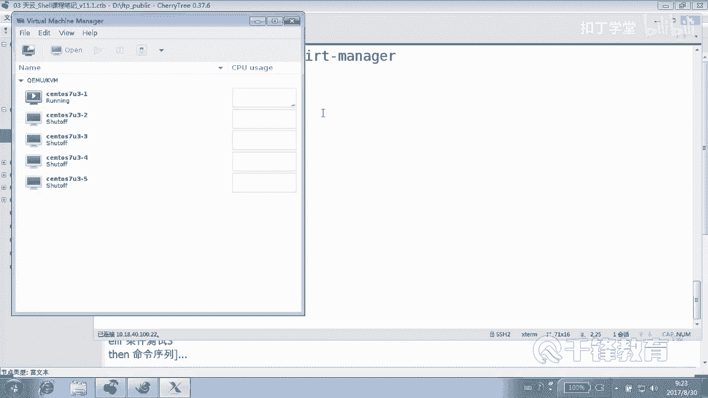

# 千锋扣丁学堂Linux云计算系列：Shell脚本自动化编程实战视频教程 - P18：4.1 if条件判断 安装apache 1 - 扣丁学堂 - BV1SE411q7vK

O。那么在前面我们了解到了这个脚本的一些基础知识，像变量，对吧？还有一个重点就是条件测试。

这个这块呢我们来简单回顾一下变量呢有。自定义变量还有环境变量，对吧？一般情况，环境变量主要是系统自带的一些环境变量。像pass啊，像shall是吧？像那个mail啊，或者像home，像user。

像UID这些环境变量，通常都是大写是吧？然后我们自定义变量呢主要是在我们脚本当中出现。呃，除了这两种变量以外，还有就是预定义变量，包括doller紧do when。do了新到了艾。

dollar叹号dollar dollar是吧？其实严格讲，dollar dollar呢或者doll用dollar去那个。😊，变量的名字其实不叫do不叫不叫那个问号，不叫那个doer问号是吧？

应该准确的讲，就叫问号。但是我们通常说的时候肯定是。到了问号上一个命令的返回值是吧？条件测试呢是非常重要的。条件测试里面我们用到的方式就是一个方括号和两个方括号，对不对？当然task的那种方式也可以。

任何这个方括号里面表达式这个表达式呢，任何表达式前面都可以取反。😊，叹号是吧？另外呢表达是这个条件测试它没有那么复杂，它只要能够返回真和什么。😊，和甲就可以。明白意思吗？好。

那么这个两个方括号和一个方框号的区别在于。😊，两个方括号，它能够使用正则匹配。比如说我们在前面我们去匹配用户输入的是不是数字的时候，我们用到了正则匹配这种方式是吧？我们写了一个模式，这个模式呢。

就是肯定是数字。除此以外，在我们的一个方括号条件测试当中，还有一个是什么呢？就两个方括号条件测试当中。😊，我们可以有多个表达式，多个表达式之间可以有什么关系，可以是与的关系，可以是或的关系。

是不是就是可以是那个多个条件必须多个表达式必须同时成立，同时为真，同时为处，对吧？或者是其中一个为 true都可以，明白吗？好，那这里呢。😊，嗯，除了这个条件测试这块呢，除了这个以外呢。

嗯另外就是主要是三种条件测试的方式，一种是对于整数是吧？整数里面用到的方法是EQ啊，LE啊GEGT是吧？然后数搜串了用的是什么？😊，一个等号，两个等号是一样的，好吧。😊。

或者不等不等于是叹号等号这种方式。另外我一直强调的是字符串变量，请大家字符串的比较的时候，请各位尊重它，就是加双引号。你要是说老师我没有加双引号，我出来的结果也是对的。那是你走了狗屎运，好吧。

或者是呢你要说老师我出来的结果和我预期的不符，你别问我这个问题。好吧，我跟你讲了，应加双引号，而且有可能那个变量如果没有的话，还有可能会报错，是不是？😊，是不是条件测试？嗯。嗯。

除了它那个整数数值比较字符串比较以外，还有一个文件测试。这个文件测试特别强调的是，如果我们要测试一个文件，是不是有读权限，注意这个看的是谁啊？当前你谁敲的这个脚本，那谁有没有多权限明白吗？

但是这个东西对root来讲的话，好像不好使是吧？因为root有 power。😊，它能够覆盖一切的pvis，覆盖一切的权限，能明白吗？好，这是前面的一个一个一个复习。除除此以外呢，其实还有一个东西呢。

我们有必要说一下。😊，有一个命令。就叫common的，看到吗？挺好玩的一个mini。😊，这个这个之前很有一段时间我是不知道他的。这什么东西？min你没有发现是吧？😊，我们看一下啊。

我这个命令我是不是用错了？😊，哎，我记得这个命令可以帮我们来测试，这个也是一个测试啊，我慢一下看COMMAND好吧。哦，是应该是要加路径的。呃，我们维持一下。贝塔好吧。这个怎么。没有任何的反应。啊。哦。

换一个别的命令看。我印象中这个命令可以帮我测试一个命令，是不是一个命令。或者或或者我再再换一个换一个正正常的啊EDCpa word。😊，好吧，那我就失败了。这个啊说失败了。

这个我我稍后来看一下它一个具体用法。这个用法呢呃我印象中可以帮我们测试我们后面的对象是不是一个命令。在这块呢呃用的少，所以没有记住啊。好，那我们下面呢。😊，来开始先了解这个流程控制。

也就是我们在执行脚本的时候，其实有人问我说什么是脚本。😊，脚本的话大家可能会发现。它其实就是我们平常所使用命令的一个堆叠。就是把我们所有命令堆到一起。😡，从上到下什么？依次执行是不这样一个过程。

比如说我现在要部署一个软件，我要。亚母装软件我要对它进行配置，我要启动，我要测试是吧？那这个过程其实就是。很自然的一步一步的去执行就可以吧。😊，从上到下把我们的linux里面的一些命密软件。

包括我们前面部署那个什么论坛啦，还有那个网站呢，这样的一些秘密这样一些过程，整个从上到下写到里面去，是不是？😊，那大家有没有注意到一个问题？那如果我们现在连网络都不通呢。那你是不是没办法装这个软件？好。

比如说我们下面来看一个啊。😊，我们写一个脚本，这个脚本干嘛呢？😊，是要去安装一个软件，随随意的一个脚本啊，我们要安装一个。阿帕奇换个名字吧。阿帕奇的就阿帕奇吧，阿帕奇软件，我们要装这个软件。

并且我们要对它做一些基本的什么。😊，可能做一些基本的配置。OK好，那首先打开这个脚本，这个名称呢是我们自己呢自定义的一个一个名称，写号叹号。😊，USR并下的什么bsh，另外给脚本加上注释。

加上一些说明信息来告诉别人，我们这个脚本是做什么的。如果这个脚本只有那么三五行的话，这个很显然每个人可能一下就能看懂。如果脚本内容比较多。有可能只有你自己能看懂，也没准也没准呢，过了一段时间以后。😡。

你自己也看不懂。好，所以我们加注实这干嘛的呢？安装一个软件叫阿帕奇啊，然后紧接着呢，我们的版本是1。0版本，等以后修改的时候就会变成更高的版本。by谁创建的几月几号是吧？20118年9月20号。好。

这是。不要奇怪，今天是8月30号没有错，但是这是我穿越回来给大家讲的。啊。这之前那会儿讲的一个脚本啊，经常我我会讲到2019年或者哪个地方去啊好。😊，好。

那我们现在呢如果说我们单纯的来看一下怎么写这个脚本的话呢。😊，我觉得我应该找一个蓄机，这个真机上其实已经不能再再这样做了啊，因为真机的话已经。装过了，退没错，我就是找一台虚拟机，好吧，7-1。

713-1，我起一台。好，那我们刚刚打开了这个熏机，呃，稍微等待了一分钟。我们下面来看一下这个熏机是不是已经开开起来了，然后打开。现在呢我们今天啊这个虚拟机呢，大家很苦恼的是IP地址我们没办法得到是吧？

对我们一会儿呢就会写脚本，获得这些IP地址，甚至对虚拟机做初始化操作。😊。

嗯。好，这个机器好像也装好了，我感觉啊。这是47的机器，是不连阿帕奇都装好了。哎呀，我去。

好，对，没错，删了删了他啊，删了他就行。这47是吧。192168。12。47。然后我们在这儿呢写一个脚本，这上面都啥都有了，是不是？好，这是之前做过实验的一个机器。😊，好，现在应该是没有阿帕奇，是不是？

好，来，我们写一个安装阿帕奇的脚本。😊，前面呢自己呢来定义我们脚本的一些初始信息。好，我这边没有加那个就是那个井号了，来把它框起来了啊，这个应该加上那样好看一点，是不是？😊，2018年杠9月20号啊。

还是那个时间。好，然后我们开始来写。其实安装和配置呢这个很简单，包括如果是纯粹的起消命令的话，就是y杠外inst是吧？是不是这意思？然后在ATTTBD装完以后s。TM systemem。

然后什么star ATPD然后system。然后CTL。还TTBD对不起，这里不能补钱啊，你想补钱的话，你可以找个终端敲一敲，然后把它粘过来，明白意思吗？然后最后是不是还有可能要防火墙什么的，哇。

这么长的命令，我们还是来找个终端敲一敲吧。😊，然后再给它复制过去吧。讲刚AD。Servicice。HTTP哦不需要回车了啊。😊，这只是为了在。好，我再把那个ATDPS加上去，然后再。

刚刚reload的吧。是不是？还有可能是不是把那个SClinux整个改一下？还记得吗？S你那个是怎么改啊，还记得吗？呃。S我们直接其实大家都已经背下来了啊，SED杠RI是吧？然后。😊，EDC。

linux configurefi这个文件是吧？这个脚本里面是不可能交互的呀，我们都知道是不是好，我们怎么做呃，S查找以SElinux。😊，等号开走的黄行。哦，不是这么查找，实接是这样查找是吧？

然后换成SElinux等于。diciable有D吗？有地好的，就是这样。呃，这个当然不能够像这样吧，甚至可能临时。把它关闭，是不是这样子？做这些操作吧。好。😊，大家想象一下。这个是在什么情况。

我们才能够。如果说你的网络没问题。第二，你的什么？你的网络没问题。第二，你的yM没问题，你是不是才可能装上？😡，所以脚本它并不是如果说第一步没装上，那第二步有必要来做吗？没有没有必要吧。所以我想说的是。

如果没有装上，第一步没有装上，那么你第二步、第三步后面的步骤实际上没有什么用处。所以脚本呢它可以是从上到下的一个堆叠，把我们要做的事情整个写到里面去是吧？但是呢有时候我们得加上一些条件判断。😊。

是不是就是如果说是这种情况。该怎么做？如果说是什么那种情况该怎么做？😡，能里白吗？那有没有可能网络不通啊，有没有可能。😡，有没有有可能吧？好，那有可能网络不通。

那这边呢我刻意呢把它的网络网关给它删了IP我临时删除啊IPR是查看IPRDEL删除删除谁呢？😊，删除这个网关，后面加上那个default这一段是吧？好，我现在刻意把网关给它删掉，然后造成这种什么。😊。

可能不通的这种状态。OK现在它肯定是装不上的，明白吗？😊，你看。他现在拼都拼不出去。是吧。好的，那现在我们就要来关注这些问题。😊，也就是说一切呢我们要判断一下。好，先可能要判断网络是不是什么通的吧。

然后如果不通的话呢，这些事情是不是没有必要再往往下进行下去？那怎么判断用到的就是一个我们叫if语句，流程控制语句，条件分支。😊，只有条件成立就怎么做。对不对？这里呢if呢从从讲解的角度来讲的话。

很复杂的。你看有单分支、多分支、双分支。什么叫单分支？就是如果条件条件成立。😊，他就做什么，没有没有不成立的事情，不成立就算了。😡，双分制就是如果成立做什么不成立呢，也做什么。😡，多分支是什么意思呢？

如果说你是男的，站左边。那不是男的，那是女的呢，站右边，那也不是怎么办？那你是其他人就站中间看到吗？😡，那你还不是的话，你再看有没有下一种情况。如果你实在最后不是人，那站在旁边。😡，所以有多个条件测试。

但是你记住你只能够满足其中一个。但这么讲的很硬。所以我们下面呢来实际看一下这种例子。刚才我们大家都承认这个脚本不能这样执行下去，这要保障一切都正常，是不是才能执行下去？😊，好。

那我们现在怎么才能够保证正常呢？😊，那我们可不可以这样认为能拼到百度啊？😡，可以吗？用名额百度就可以。或者是不P图百度也行。我看看这个机器。SSH192168。12。47是吧？

我们能想到任何办法来检测我们的。😊，这个现在通还是不通啊？这个能能作为我们判断的依据吗？不能，因为他没有他没办法很直观的来得到这样一个结果，是吧？是明办法。当然可以不要ym make。Catch。好。

这样一个结果是吧？😊，好，然后呢。也不行，有些命令他没办法给我们直观的得到让我们得到一个一个结果。好，那我们就以能能能不能拼通百度，好吧。😊，或者拼成一个主机，一个测试机就可以了。好，那怎么写呢？😊。

非常简单，就是if注意。是不是要个条件？不各位，这里呢大家可能会误会，if后面要的只有一个东西就是。😊，真假。任何能够返回真和假的。😊，都成好吧，任何。那比如说就像这样写pin杠C一拼一次，好吧。

3W点百度点com大家都很清楚，我拼的过程是肯定不要的。因为这玩意药伤呢对我们也没有什么好处。😊，好，如果条件成立，那么怎么样？这里在Z后面写那么看到了吗？现在我写了几条几条语句。😊。

几个指令if then还有什么FI在写这个东西的时候，一定要先把结构写上。其实我刚才就疏忽了一下，就先写写脚本，先写结构，明白吗？😊，就想写C的话，先写主函数，是不是？然后再往里面呢。

把结构写上以后再去写内容。你不能够上来就一行一行的写。那除非你的脑子里面就像那个。能达到你拉斯图啊资量的级别，那肯定是你不用考虑，你知道哪个地方该有个方该有一个括号，哪个地方该有一个逗号。

该有一个什么符号，否则的话我们不要轻易尝试。好，那各位大家是不是比较习惯把那个字放到上面去啊？😊，这也是被我带的。啊，放到上面去的话呢，就要加一个什么分号，因为这是几条命令。😊，这两条命令。

至于后面加不加空格，那随便你了。好了，各位我再说一遍，if它缺的就是一个什么？😊，真假，但是有些命令是不能返回真假的啊，我们后面会看到，所以说你不能把那种命令来作为我们什么测试真假的一个依据，能听懂吗？

各位好，就是如果拼得通，那肯定是为真。😊，那这个拼不通呢，就会讲是吧？就就forse。好，那怎么着拼得通就装，还是还是怎么着？😊，拼头有装是吧？

其实有时候呢很多同学呢可能会我对我们可以这样做看选中D放到这里面去是吧？然后选中缩进一下是吧？地址删除。可以可以这样做吧，如果能拼得通就装。拼不通就报错。但是呢我个人不太习惯把if服写的这么复杂。😊。

这个每个人有个人的这个你看有限性的if，可能在第二第三行FI的在什么在100行。😊，就他之间套的代码太多了，我们不就是想拼一下通不通，然后就装吗？所以我这种写法没有错，好吧好，但是看起来呢。😡。

也许你会觉得直观，但是我不会不会这么认为，因为现在代码量很小。😡，否则的话，你的衣服el的那个结构是不是套的很深啊？😡，所以我的意思是说，还有另外一种做法就是。不是我这一段就判断通不通，我不装，好吧。

我就只是判断通不通，我做的事情就是一件小事儿。😡，对不对？有同学说叹号可以啊，如果不通怎么办？😊，icical说什么？😡，是不是连接网络不可谈啊？或者是主机不通，是网络不可达，类类似于这样的话。😊。

orrangeible连接不可打。明白？好，现在我们来试一下这个脚本的执行，A加加X int。😊，好，在这个有问题，各位。😊，这个if啊，它如果条件如果不通的话。不通反是不是成立啊？😡，不通的话。

是不是在我这儿反而是成立。那成立以后，我是不是就打印一个连接不可达。但是如果说你没有做别的事情的话。😊，他还会往下什么？继续执行。😡，能明能明白吗？你看。A加X，然后。inst阿帕奇inst阿帕奇。

你看网络不通，是不好，往上再走。你觉得他能装上吗？那是不可能的，是不是我装不上？😊，明白。好，那多恶心这个事情看。😊，是不通的话，是不是就应该再建了？😊，excet是能够控制什么程序退出的。明白。

那我们是不是应该打印一句话以后，当然这两句话能不能反过来写，先写Sat再写ic。😊，就是你先。你先死了以后，再把你先死了，然后再再处理处理你自己处理你的这个事情，不可以吧。好，现在如果不通的话。😊。

网络不同版。好。这个脚本没有问题，那如果通的话呢。😡，那后面是不是就顺理成章的往后走了，我没有打算把后面的这些语句放到哪儿，放到衣服里面。我为了让if服能够完成一个非常简洁的任务。😊，好。

有同学说老师这个有点太长了吧。😊，我之所以写在这儿，不代表我认可写到这儿，我写到这儿的目的是什么？😡，我就是想告诉你，这这就是一个条件测试，明白吗？条件测试只要有返回值的就行，不一定是我们那个方括号。

明白。不一定是我们那个方工号或者test，只要任何能够返回什么。😡，真假的就可以。明白。好，有人说什么叫任何呢？😊，好，举个例子。你说我能不能这样写？😡，语法上有没有错？😡，有错还是没错，没有错呀。

data meaning能不能返回真真假，能不能能返回为真，它提示说什么连接不可达，这这这有有点风马牛不相及。但是这个语法上是没有错的，就是任何能够返回什么。😊，真假的都可以。任何okK。好，那。

我们怎么写呢？刚刚说了，我们应该建议大家这样写。😊，按照我们之前的习惯，应该这样写，先拼一下，然后呢用我们比较标准的这种。😊，条件测试语句。这个人家是专业的，好吧。S那个叫dollar问号。各位。

我问一个问题，是写等号等于零呢，还是EQ等于0呢？😊，这个事情有待商榷，为什么？你可以把理看成是。一个。数字也可以把零看成是一个字符，是不是这意思？但是其根据我的经验来讲的话呢，一般没有人这么干，好吧。

都是这样当成数字来看好一点。既然是个零的话，我们应该把它看成数字吧。😊，当是确实可以看成字符，一些等号也没有错，这是两种不同的测试方式，明白。😊，好，那如果说等于0。等于零的话，那就是通了，那就应该是。

不等于您吧，别假什么飞了，人家自带光环的，而且你不用你再给人家配一个什么东西，你人家本来就自带光环，你还给打个手电筒。😡，只有那种没有光环的那种什么。😡，你可以再打个手电筒去，好不好？能听到吗？各位。

好，这是安装阿帕奇。如果说不通，那咱们就走走了以后谁来解决这个问题呢？脚本说，那跟我有啥关系，我就是告诉你不通，然后你来解决是不是可以了？😊，能那边吗？好的。😊。

