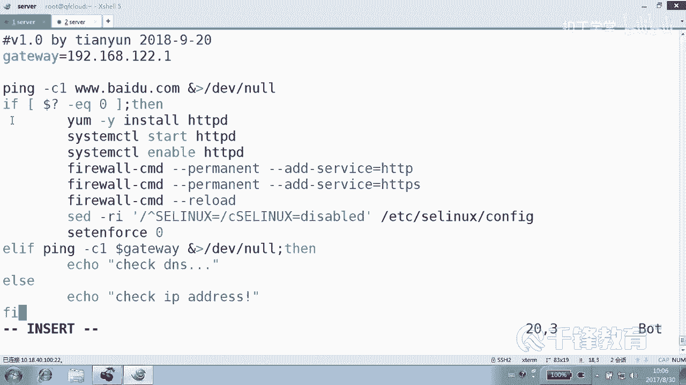
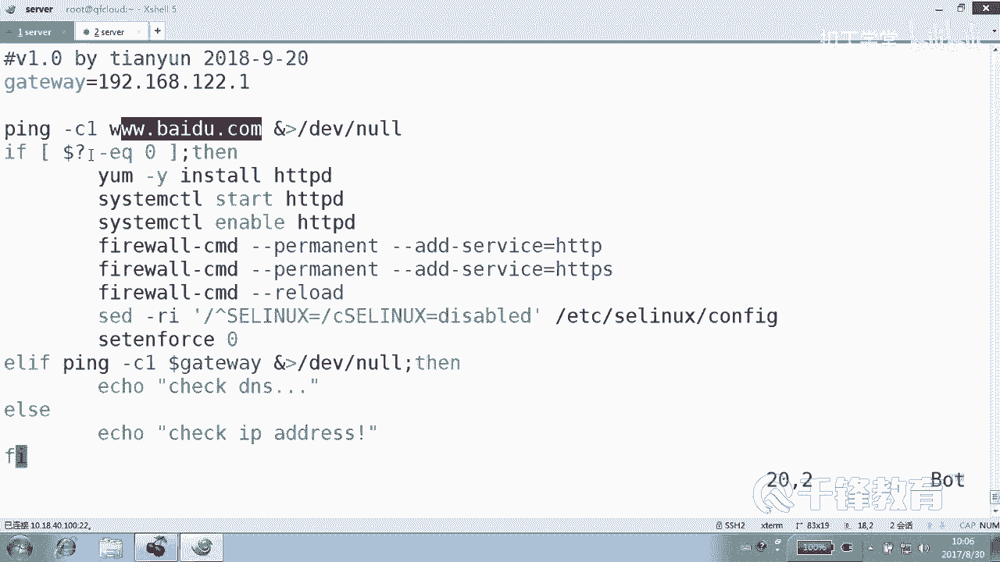
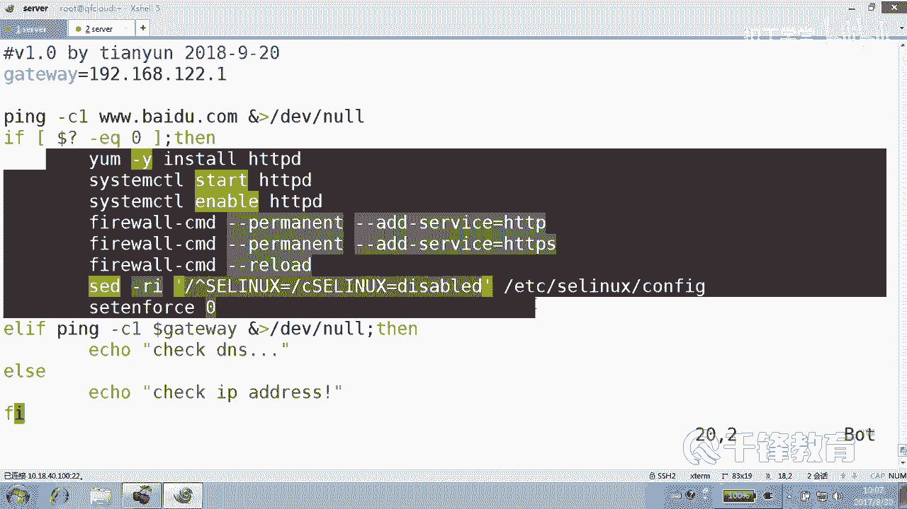
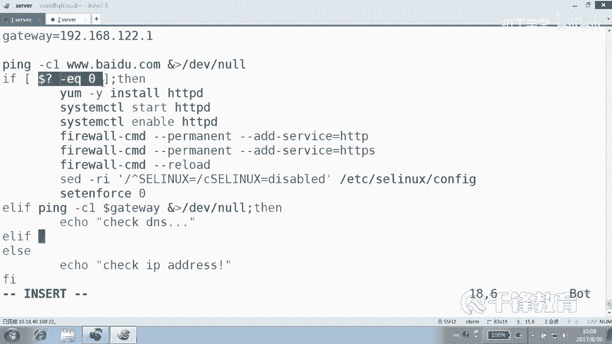

# 千锋扣丁学堂Linux云计算系列：Shell脚本自动化编程实战视频教程 - P19：4.2 if条件判断 安装apache 2 - 扣丁学堂 - BV1SE411q7vK

好了，我们刚才在那个第一个脚本当中，我们写到了。如果说拼那个主机不通是吧？然后我们整个就。退出，也就是整个下面的那些安装命令，还有部署命令都没办法得到继续，是吧？

那实际上呢这个不通有时候是有可能是有原因的。我们可以进一步去判断这个不通到底是哪一个部分造成的，哪块造成的对不对？好，所以我们下面来写一个。再写一个脚本。Inst。阿帕奇2点SH这个脚本。

USR并下的bash，然后是还是加上一些。注入信息。V1。0，然后拜。然后是201。好，OK那我们现在呢首先去拼一下，还是拼一下哪个主机。😊，3W点百度点com是吧？来拿它作为我们的目标测试主机。😊。

然后紧接着呢，这个结构再次提醒各位，结构先写上，是不是？😊，那么甚至呢如果需要IS的话，把结构先写上，然后在里面补东西。如果说到了问号。比如说等于你。Oh。也就是在通的情况下是吧？😊。

等于0的话怎么做呢？我们来安装。像安装我们的软件yinstoreITDBD当然也是可以写到把这个整个命令写到这个整个if else里面去。啊，包括呢去。S。SYST1。EMCTL。

然后是start ITDBD然后system。CTL。在GDBD还有包括什么防火墙吧。😊，是不是。嗯。这些命令呢如果写不出来的话呢，你就直接找一个机器去。敲一下复制一下，因为本身这些min。

腿挺长的防火墙。防火墙。然后faair work。杠com。刚刚reload吧。好，同样slinux呢如果你能记得的话，就直接写是吧？杠杠RI。😊，然后EDCR的C。呃，SE Linux config。

我一般都是写结构，先写结构，回来再写内容。😊，查找以SE。lininux等号开头的行换成什么SELINUX。等于。是diable是吧？😊，好，set ENFRRCE0。好，那这是在通的情况下。

我们是不是这么做？😊，是不是疏通的情况下？😊，那要是不通呢。不通的话，那我们怎么做呢？我们可以用这种多分支的形式。

如果这个条件成立，听好了，肯定是不是做这一段事情。

那就不会往后走了吧。😡，做完这段事情以后，是不是找到FI结束了？😊，那现在问题是呢。如果这个拼不通，那我们再判断拼不通到底是什么引起的，对不对？表说我们可以去尝试拼一下谁。网关。那大家想到。

如果说你连网关都拼不通的话，说明什么？😊，如果说你连网如果说你能拼得通网关，说明什么？😡，网络连接。应该是没问题，可能是其他问题，是不是？可能是DNS什么的问题。啊，在这里可能排除了网关设置的问题啊。

😊，好。那我们再来拼一下这个网关。当然这里呢大家最好了把这些东西都做成这种什么。😊，变量的形式。192168。12的1，因为有可能这个网关会换是吧？好，我们再拼一下网关。Dollar gate。We。

大家看同样这边是一个什么？是一个条件测试语句。就再次写了一个us if。如果条件成立。那又怎么做？我们可以挨可以去，就是网关是什么？是正常的吧。可能是比如说检查一下。像DNS啊等等等等。

这提示用户检查DNS是不是？当然这种情况我们是应该退出还是不应该退出？你要不退出的话。😡，当然下面也没有内容了，实际上是吧？下面也没有内容，退不退出也无所谓，因为下面确实也没有内容。😊。

如果有内容的话呢，如果下面我们还有语句的话呢，这个时候机应该让用户退出，是不是？好，各位这是什么什么意思啊？😊，就是在网关是什么情况？😡，通的情况下。条件是否成立的情况下。

认认是指的是前面那个对这个条件。成立，那我们是不是说那不是网关的事儿啊？是吧可能是你DNS的事情啊。😡，那如果连网关都不听通了，那最后就是alse，可能是最后的情况alse。然后干嘛？

让我们检查我们自己的。😊，IV地址或者是。网关通网关也网关，然后那个网网关不通的话，那我们让我们去检查一下什么我们自己的。😊，IP地址。可能是我们自己的IP呢有问题。各位看到了吗？各位。

当然这个语这个语句呢不是那么严谨。😊，我们实际上肯定不可能顾及到方方面面的情况，是不是？但是呢这个给我们之前那个脚本。😊，或者跟之前我们没有写衣服的时候是不一样的。你没有写衣服的话。

你这些语句是不是就会从上到下依次执行，也不用考虑哪一条命令执行是不是成功的。😊。

对不对？

那还有一个问题。你把这个网站装上以后。你把它启动起来，那启动起来能不能访问，你是不是想可能想关注一下？😊，好，那咱先播说那一步，先各位看一下整个这个这个例子呢能不能看懂？如果先聘这个百度是吧？😊。

这是在什么情况下？😊，成功的情况下，那我们就装。

对不对？装这一堆。当然这些东西呢都是今天是打酱油的啊，不是一定要这么做。但是实际上我们很清楚，如果防火箱开着的话呢，你应该这么做，是不是？😊，第二呢，那如果拼不通呢。

拼不通，那自然就不会走这一段了吧。😡。

对吧他走哪一段？😊，拼幕头当然可以直接上最后那个else检查IP。是不是这样子？那我们说有可能。还是别的情况呢？所以我们又加了一又再次加了一个判断。如果是网关不通。😊，那我们就检查像。DS那样的。

那么其实上还可以再加加什么？😊，就是加一个在这里面，甚至可以再加一个alse if去干嘛，去看一下DNS有没有设置。明白意思吗？我们可以看DNS这个有没有设置，在哪设置的DNS。😊。

是不是在ETC下的result点com里面设置？那怎么判断它有没有设置呢？那估计只能够过滤一下这一行了，过滤一下有没有name server好吧，怎么过滤看。😊，grab，然后是name。好。

我们说了没办法过滤的那么直接。好，有没有？😊，所以返回为什么？真，那我们过滤一个不存在的呢？😊，返回什么为甲。看了吗？所以你可以再次去，就是首先你没有问题，我们移过来看，你没有问题。好，你没有生命。

那怎么办？😡。

那你就开始工作是吧？

开始工作。那如果说你有生病，你不舒服，那我们就判断是感冒的呢。😊，那我们就当感冒的痣是吧？那不是感冒了，如果不是感冒。😡，那我们就干嘛？P网关是通的。😡。

PP网关那个P这是拼网关是通的那我们就检查可能是DNS问题，是不是？😊，那不同了。哦。所以我们可以多写这个几个这个什么Lif就可以了。😊，当这个实际上呢我们说方方面面都检测，实际上是不可能的啊。

这个肯定取决于你提前把这些网络设置好好。😊，来，如果拼网关。通那有可能是DN问题是吧？😊，如果网关都不通不通呢，那可能就是你的你自己的什么。😊，IP的问题。对不对？好，是这样一个结果，这就是一个。😊。

多分支的这样一个结构。实际上alif这种分支是可以写多个的。这个东西呢有一个例子是非常恰恰当的，就是。😊，如果你的成绩。小鱼。50分小于60分，就是什么不及格。然后你的成绩如果呢是在。60到。

69之间是哪一轮？如果再如果说你是哪一个段，是哪一轮，这个是其实是。比较合适的一种方式啊。好，那现在我们来测一下这个结果。😊，我们给他一个权限，好吧。😊，inst2这个权限执行inst2。我。

这什么意思？我们现在拼网关是不是首先拼音百度是肯定不通的？拼网关呢？192168点168点什么？12年。12点这个。1。往外通的那我们有可能就是。第二次问题。如果连网关都拼不通，那就一定是你的问题。

是不是？因为P网关我们不存在解析啊，P网关都拼不通是你的问题。当然很很抱歉，我这边没办法给大家测试，因为我一测的话，这个网络就断了是吧？你可以你你一会儿你是不是可以在你的虚机上去那个执行这个脚本。

你可以把你的IP地址改到什么？😊，改的一塌糊涂，然后你去试一下。第一，百度肯定拼不通了，所以这段话肯定就不会做了，是不是？第二呢？😊，网关你也拼不通，所以你也不要赖在人家DNS身上。😡。

你那网关的听不通，是不是你的问题啊？😡，好，这边检查DNS只是我们给你的一个建议，并不是说一定是DNS问题。😊，是不是。好，这就是一个什么。if的这种判断语句。那么实际上我们在做if else的时候。

用的可能非常多的是我们之前讲过的一个例子。就是。去拼一个主机，如果通就怎么着不通，是不是怎么着？我记得之前我们在在pin的这个脚本当中就有这样的一些例子。很多。嗯，随便一个04啊、0几都行看。

这是不是非常非常常见的这种分支结构。😊，拼一个主机。如果通就怎样，否则就怎么样。是不是？好，关于这个if的一个基本的用法，我们应该它的这种单分支和多分支呢，我们应该看的很清楚是吧？这个根据你的需要来写。

是不是就可以了？😊，当然，实际上衣服还有这种非常。哦，复杂的一些用法啊，像多分支的形式，我们可以用多分支来写什么呢？😊，有很多例子可以用到多分多分支啊呃。😊。

另外呢我最常见用的一个衣服的一个形式是这个形式。各位看。就是。我在让用户做一些重要的，比如说删除啊这样一些动作的确认的时候，我会给他个确认。我会问他，你是不是要继续安装或继续删除？

然后通过read读入一个变量，看到吗？读到比方说删除或者说安装这样一个。变当当中来。然后再判断，如果他输的这个值不是Y，那我们就直接说退出，看到吗？下面这段话，也就是这种这这段这段语句呢。

我们可以写在任何地方。来给用户一个提示。比如说用户选了我要删除虚拟主机，我要删除某个软件。我问他真的要删除吗？我怎么问他呀？😡，我就读入一个变量，看了吗？通过read读入一个变量，然后判断它输的。

只要不是外，我们就会终止这个操作。😊，其实你看这是一个非常简单的一个单分支是吧？但是呢非常有用的一个一个东西，就只要以后你想要给用户一个什么。😊，在某件事情上给他一个确认。问他一个确认。

你就可以用我这段语句。怎么做？就是把这条语加到里面去，加一个阿U醋，你确认吗？然后他说yes。只要不是yes，我们就整个就退出，或者说你输的不正确。明白。好，这就是一个分支里面的用法。

所以if语句实际上没有什么专门要讲的，它的东西是在我们的脚本里面用的，可能是最最最多的一种方式。😊，其实刚才呢抓阿帕奇这块这块呢，我们还还有还有一个地方也可以用到就是。😊，二里面啊，你看刚刚讲过。

这个装弯以后，我们是不是就启动了？😡，装完以后，我们是不是把它整个启动起来。那么启动以后能不能访问呢？😊，就能不能访问他自己的这个网站，能不能访问？😊，我们可以去怎么做？测试一下。比如说怎么测。对。

没错。CURL去访问一下自己。127。0。0。1，当然访问的这个过程呢，我们是不要的，对不对？好，可能有两种，一种是。访问的了，一种是访问不了吧。那我们就来这种访问成功的吧。如果什么。

到了问号EQ等于0，那我们就在下面呢打一句一句话说阿帕奇。安装什么？OK成功。那如果他访问自己访不了的话呢，那这句话肯定就不会打印，是不是？否则的话呢，我们可能会说阿帕奇可以在这边再加一个al。

说什么阿帕奇。😊，安装或者配置有问题，是不是？所以if这种if这种语句你随处都可以使用，随处只要你想判断一下，就可以使用它。只要你想判断某一个行为是不是达到预期。那你可以通过衣服呢来做一个判断。

所以这种if副语句呢实际上是。

非常多的。