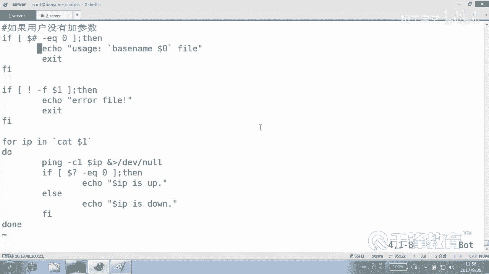

# 千锋扣丁学堂Linux云计算系列：Shell脚本自动化编程实战视频教程 - P1：2.3 变量 位置及预定义变量实战 - 扣丁学堂 - BV1SE411q7vK

到。在了解到这个环逆变量和自定义变量以后，我们下面呢来再次看一下位置变量。这个位置边呢，我们在刚才是不是已经见过了？😊，在这个脚本当中，我们已见过一次。叫拼6里面见过哈。我们用到doar一。

doller一这是个变量的名字，但是我们没有从来没有定义过所谓的dollar一。而是在执行脚本的时候呢，通过在后面。加的什么？加的参数10。18点。42。1，那后面加一个狗行吗？猪呢？也不会有影响。

为什么？因为我们刚才在脚本当中。对用的变量。引用的变量仅仅是道号一，这个是变量的值，也是我们脚本的参数。第一个参数将作为值付给什么？到了一第二个参数呢将作为变量的值付给什么？到了2。

第三个参数将作为变量值付给到3，明白吗？😊，有时候我们到底要几个参数呢？那得看你有什么需求，是不是？😊，是不具体的需求？那么说到这个参数，这个很简单，这个没什么讲的。

到了1到2到了3到了4到5到6到7到8到了10。如果非要理解的话呢，下面有例子，我们一会儿综合来看。😊，这叫位置变量，能不能理解？他不用你事先定义，它是根据什么。你在执行脚本的时候所。

所带的那个参数的位置来相应的相对应的赋值，明白吗？能理懂吗？这个它对应的去进行赋值。那么除了它以外，有一个什么？我们叫做预定义变量。😊，这是我们最后一个变量的类型，预定义变量。

同样机些变量呢也不用你定义。你看。😊，我们是不是见过到了问号？打电话是什么？上一个命令的什么返回值，临为成功吧。😡，doll叹号呢呃不能说dollar叹号，那就是其实就是叹号。

但我们一般说的话就是dollar问号，到叹号变量的名字按理讲应该叫就叫什么，就叫叹号问号，很特别的一些变量是吧？dollar叹号它是上一个进程的什么？😊，PID。是吗？😡，后台看下看一下例子啊。LS。

然后LS。我们现在dollar不dollardoll叹号是吧，为什么空的？😊，你看我执行的LS。😡，这是不是进程，我在显示为什么没有PID啊？😡，对，这个是钱的进程，不算要什么进程？😡，后台。有吧。

对它只有它只是针对上一个后台进程，它里面保存的是上一个就是紧接着那一个后台进程的PID明白吗？这个非常有有用啊非常有用。然后 dollar dollar了。当前进程的什么？PID好。

所以我们很多时候直接像这样IO用一下do dollar当前进程的PID对不对？除此以外呢，还有什么dollar几号是参数的。😊，个数。什么叫参数的个数？就是你脚本执行的时候，一共加了什么？😡，几个参数。

当那艾艾特呢。所有参数就是把你所有加的参数给你列一下，这个信号也是所有参数，到了零呢叫我的名字。😡，好，我知道大家可能对这个不太理解。没关系，我们下面呢有一个小脚本用来测试脚本。好吧，由于太多了。

所以我就直接复制一下啊。这边我创建了一个测试小测试脚本。😊，这里呢内容呢是这些。😊，好，前面多了一些空格，我们删除也很简单。controrl V。块选择吧。删除。好，如果非要在上面加个井号叹号。😊。

USR并下的拜事也行。好，这边我加了中文，各位看到了吗？ecle第二个位置参数是到底几？😊，单2第一个位置参数呢，倒数一第四个参数呢，那就是单数4，所有参数是多少？😊，到了心或者是什么。

do艾参数个数多少个，用doll仅统计当前进的PID多少多少？😊，下面呢只是重复的演演示一把。😊，下面只是重复的演示一把，下面用到了一个很特殊的一种用法叫做。😊，单引号这个。

我们知道icical dollar一，它是不是应该显示。😊，这个变量的值啊。😡，但如果呢放到一对单银行里面。他就不会显示，他就是。😊，该是啥是啥。好，这段你先不用理解了，先看一下来。😊。

我们给这个test脚本一个执行权限。来ts脚本现在有加参数吗？😡，有吗？参数个数是几？😡，它数根是0是0吗？来ABC。羊。D。E。天。好，下面只是更好的帮助你说明啊第二个参数是什么dollar two。

也就是B。第一个参数dollar one。第三第第四个参数doar4嘛，参数一共是当当当当当当当当，这个我们当时写的是什么？来对比一下看看对比一下。😊，对比一下第二个参数是不是？是不是B呀，到了。

我们就到了2了。第一个参数呢？😡，到了114还有到到4，所有参数是不是到了7？😊，然后所有参数是什么？我们现在是不是看到doer新和do艾是。😊，一个意思。😡，那听好了，我要邀请你去。

了解它俩不一样的地方在哪儿，好吧，肯定有不一样。如果一样的话，那何必还有两个呢？还有刀的个数到刀什么几，就如果你你想获得这个脚本执行的时候，参数的个数到是几当前PID用刀刀什么do看懂了吗？各位。😊。

明不明白意思？好，那。这边呢我们用了以后，大家自己去了解一下这个叫什么。😊，自己了解一下信号和景和那个那个信号按的意思。好吧。好，下面呢我们来带大家写一个一个小点的脚本，还是叫pin。😊。

这个脚本呢希望希望大家只是先观摩一下，来了解一下。你看啊唉全面都有看。😊，我在当前有一个。有一个叫IP点TSC文件，注意到了吗？里面有1。1。1，那个叫10点多少18点。😊，叫。40。100是吧，10。

18。40。110。18点。40。127。好，我这边写了3个。😊，三个那个叫什么？IP。好吧。然后呢，我想怎么做呢？我们想P一下这3个IP。好，下面我们来写一个P就零几了，现在。😊。

07点SH先观摩一下啊，同样现在讲的是变量，其他的语法呢只是先拿出来先。借用一下，好吧。几号叹号。USR并下的bash。那我是怎么希望的？我是这么希望的。😡，我是希望我在执行07的时候，后面加什么？😡。

加一个叫IP点TST。然后他能把里面的那个IP给我拼一下，明白吗？😡，我想加后面加个文件。😡，但是有可能我后面加的呢没有加像这样。😡，他应该会提示我一下，就是你没有加。😡，你没有加参数。

或者你的方法不对。好。来叫聘林姐。07。再说一遍啊，先看一下。我们写脚本的时候，一般这么写的if。😊，先把这个结构先写上，否则的话呢你会一会儿会忘掉一些内容。😊，好，我们先写第一种情况，就是什么情况。

注意几号是可以出现的，比要注释吧，是如果用户什么没有。😊，加。参数。我们是不是提示一下。怎么提示呢？怎么知道用户有没有加参数呢？😡，参数的个数是哪哪个变量？紧是不是打了紧，如果到了紧。等于0。

那是不是就么一加参数？我再说一遍啊，现在语法不是我今不是现在要讲的啊，是用来借用一下，好吧，免得你们说老师这你这个脚本有啥意思？这这这这这个这都堆在这是没意思，我们这些东西都用到脚本里面去的。😊，好。

如果参数个数是等于0能听懂吗？那应该怎么做？icle是不是应该告诉别人一下怎么用啊？😡，是不是应该说这别容用？来，我们模仿一下，好吧，我看人家有一些命令CP。😊，回车哦，他这么说的，缺少文献是吧？

你缺了。呃，有哪个命令，然后。不行，好多命令都都这个提示啊都是各式各的吧。好吧，我们提示我们自己的。😊，中文还是英文？呃，你可以打中文，但是脚本里面真的不能出现英文，不能出现中文，好吧。😊。

那样的话打印可能就乱码什么的，因为很多地方没有中文这种说法，好吧。所以你俩拼音也比那个中文强啊。😡，是这样，你要写一句中文，然后放到百度翻译里面去翻译一下，总可以吧。😊，显得你高大上吧。😡。

你能不能看不懂自己最有看不懂人。😊，不是你千万不要打拼音，恶心人啊，最次的方法是什么呢？😊，你要不写中文，要不呢你把它给我放到把你先写去中文放到百度翻译里面去，然后给我翻译正确了，然后再再出来好吗？😡。

好，我们这边呢按照一个统一的方法，这个是很多脚本都统一这么写的。我要提示说什么呢？😊，应该用脚本加上一个文件。哎，脚本名字用用什么变量？😡，我想我想提示用户用脚本的名字，后面加一个文件。只交名字。

我怎么获得？😡，对，到0看到吗？到0，然后再加一个文件。我想给用户这样一个提示，能听懂吗？各位。意思是说你要是参数等于什么？😡，零的话，那就是你没有加呗，那你应该怎么做脚本加上什么？这是使用方法，使用。

😡，OK然脚本名字加上。😊，文件来，我们测一下，好吧，怎么测？😊，执行P07，我现在有没有加参数？😊，是不是应该提示这句话？😡，那如果我这样执行呢，我root下的sscriptpped下的聘0期呢。

我天。这脚本的名字好不纯洁啊。😡，我执行路径叫什么，它是不是就叫什么？我执行路径叫这么长，是不是叫这么长？😡，这个挺挺恶心的，很多时候我们不建议这么输出，而我仅仅只想输出什么。😊，P07fi。能听懂吗？

各位，那怎么做呢？来教你们一个。😊，从来没有学过的命令。えて。这个命年从来没学过啊，在今天学，但是呢它不是那么重要，所以我们就没必要专门讲，而是在这儿讲叫base name。😊，来，认识一下啊好吗？😊。

然后。EDC says config let work。好，各位猜测一下会是什么结果。😊，猜测一下。就会显示哪一段？没错，始终会显示最后那一段好不好？能那个吗？叫bs name。

那如果说你把这个这个这个再去呢。😡，始终会显示什么？这个字。那么当然还有一个它相反的叫杯斯什么？😊，嗯。Dベ。没有装啊，这是。没有这个命令啊。😡，base name的有没有bDR，是不是感觉不合适啊？

😡，我找个终端先ym飘VIDES。心病下的。B第二。没有啊。但是我记错了。😊，再没有的话，我们就算了，好吧。😊，就是一问。啊，TFb也没有啊。😮，我印象中有一个DRb。A第 name啊我我对不起。

尴尬了一下啊。第二。😊，name来，后面还是跟上这个一整个一串，它显示什么？这造命令的人怎么不这不这么造，对不对？害的我都没记住。😊，base name多好bTR是不是多好啊？😡。

但是非要叫DI name。恶心。哦，一个是基本的名字，一个叫一个是文件的名字，一个是什么目录的名字啊，不是我们现在这个用不上，现在啊我们用哪个？😊，best name好，各位看这里，我们再打开脚本。

再打开脚本啊。😊，叫聘07。SH来，我这么直行一下，看各位能不能看懂。😊，best什么？name这样行吗？这样当然不行了。这样会完全变成一句话。😊，对，我们这边呢用一个反引号。

让他先把这条命令先执行一遍，取得这个文件的什么名字，然后再来显示。😊，其实我之所以把这个写上，完全就是想跟大家硬生生的去讲一下doer零是干什么的。好吧，是告诉你doll了0是什么文件的名字。

但是它是带路径的，带路径的，好不好？😊，带。不。好，这个刀20各位注意刀20呢是指的是文件的名字是吧？但是带路径。然后可能是绝对路径，也可能相对看你怎么输入的是吧？但是我们无论怎么样，我们只是取的是。

名字。行了，试一下啊。😊，嗯。聘07。SH。是吧。那加一个很长路径呢。😊，你怎么加，他也是取那一段。😡，好吧。好，那现在呢我们加了一个加了这样一个东西。😊。

这样的话我们就可以判断我们参数是不是有有没有参数啊，没有参数的话，是不是就。😊，不能够做往后做了。但这边呢会有一个问题。你看啊我下面呢我们再写一小段，同样这段是供雇用用来供你，现在先观摩一下。如果。

还是一样。那有同学可能在后面直接加一个，我们在执行那个脚本的时候，本身是不是应该加一个文加一个。😊，再一个什么？加一个文件，大他可能加了个目录，有有这种可能性吗？😊，对，我们在这加个什么呢？

用来判断doar一。😊，到了一是不是第几个参数？我们艾le一下，我们说错误的。😊，Fil。好，这个F呢。在我们条件测试的时候，在接下来条件测试会讲到是用来判断。😊，是不是个文件？😡，F fell吧。

到了一是不是这个文件，各位是个文件，然后报错吗？😡，播报吧，应该加一个叹号，就是它如果不是一个文件。😊，那我们就报不是个文件。对不对？😊，在这里呢有一个问题。如果。如果上面没有加参数。

它会提示我们应该加个参数，但是呢这个程序并不会退出。我们应该让让程序整个退出这个地方也要让程序什么退出，否则的话他还会往下执行，那挺没劲的是吧？好，我们让程序退出。😊，好，做到这儿，我们先试一下。😊。

P07。还往下执行了吗？😡，没有吧。然后如果后面加的是一个文件夹呢。他报了吗？是不是错误的文件？再看一下，如果参数的个数等于什么？零重点我们讲的是doller几，好吧。

然后iccle dollar零呢加我的名字吧。😊，然后如果说它不是个文件，我们又用到了什么位置变量。821。如果不是个文件，直接什么？😡，就报错，而且呢退出。那如果这两步他都能走过呢。😊，说明。

它有参数，而且呢。是个文件，那我们就往后走了。后面的这一段呢，我们先先搂一眼啊。😊，先看一下，观摩一下。先看一下说了啊，别着急。P杠C一拼拼拼什么？嗯。到了IP。呃，这个循环呢。

至少目前为止挺为难各位的，因为有些同学可能还没有了解过循环。我们说了，你写到这儿的话呢，其实我们的变量呢就讲完了。好吧，就是我们的那个什么变量，位置变量，还有。😊，这些个。预定一变量就说明白了。对吧。

你要是觉得看不懂，下面的话呢，我们就写在这写一句话，就是说假装写一个。😊，开视频呢，好吧，正在拼假装腺一个。😊，在。说明这两关都已经过去了是吧？好，假装挺没意思的，反正是很快就要学到，还不如看一下。😊。

好，单纯的写这一段能看懂吗？如果什么当然问EQ等于0，这也是这也是我们的位置那个预定变量，是不是？那我们就iccle。Dollar IP is up。否则eicalWI is done。好。

我们凑成一锅了，好吧。😊，打到紧，预定变量。刀了0呢预定变量，到了一位置变量。打了问候。预定一变量。好，我全部是想办法把它凑到一起来了啊。好，这个小循环呢，其实这一段大家看得懂的，对不对？

这段就是拼一个主机，哪个主机呢？IP如果拼通的话。😊，就这样听不通，就这样吧。那么这个循环这个cutt。😊，翻译以后cut这个文件，哪个文件？😊，我们是不是加了第一个参数那个文件。

各位你们很清楚这里面有几个IP现在。😊，我去忘了，刚才我我放了几个IP。😡，ます。三个吧。好，他会把第1个IP拿出来以后，付给哪个变量。😊，IP然后做一次循环，然后拼的就是第一个变。

第一个那个IP啊完了以后呢，再拼第二个第三个是这样一个过程。😊，好吧。可以。好，我们试一下。怎么做？P07，我们先不加参数，它提示我们应该加我加一个参数呢，他说也不是文件是吧？那我就给它满足它吧。😊。

第三个还听不通啊。😊，🎼哦，第三个写错了，第三了1个42。127。好吧，没关系，这不要紧。😊，明白了吗？各位好，今天我再说一下啊，到目前为止，大家不要为这里面的循环和那个条件判断特别累所累啊。😊。

你呢要为什么呢？😡，我们主要是里面的这个。你们可以截个图，先截一下这段，好吧。😊，好，我们主要是用到里面的这个位置变量，还有预定义变量。😊，从脚本的层面上来给大家看一下。

在脚本当中是怎么去用这个位置变量和。😊，预定一遍量。还没有吗？而不是像刚才一样给你整一个这种无无聊的脚本显示一下，而是实实在在我们呢在脚本当中，比如说要获得参数的个数到底几。😊，然后要什么要这个。

用脚本的名字到0。要用这个第一个参数到了一是吧？😊，要。获得上一个命令的返回值，要用到了。问号。能听懂吗？各位，这是一个相对来讲。

就是我把那个刚才讲到的这个位置变量和什么预定义变量相对来讲结合到一起的一个脚本。😊，明白。好，这个大家自己呢下去以后敲一下ok。😊。

