# 千锋扣丁学堂Linux云计算系列：Shell脚本自动化编程实战视频教程 - P20：4.3 if条件判断 多系统配置YUM源 - 扣丁学堂 - BV1SE411q7vK

好，接下来我们来看一下一个比较实用的一个ym的一个哎，不是ym一个if的一个多分支。

刚才我跟大家也说过，我说多分支啊，就是在里面再欠一些什么。😊，你看如果条件一成立，是不执行这个命令？那小议要是不成立呢？😡，那我就看条件二是不成立。😡，啊，条件二要是不成立呢？😡，我看条件三是不成立。

😊，所以这个方括号在这里面，大家应该还记得这个方括号表示。😊，可选吗？是不是就这一段是可选的条件3，条件4条件5，我们用N个什么al if else if else if就可以。最后如果全部都不成立。

123都不成立，那怎么办？😊。

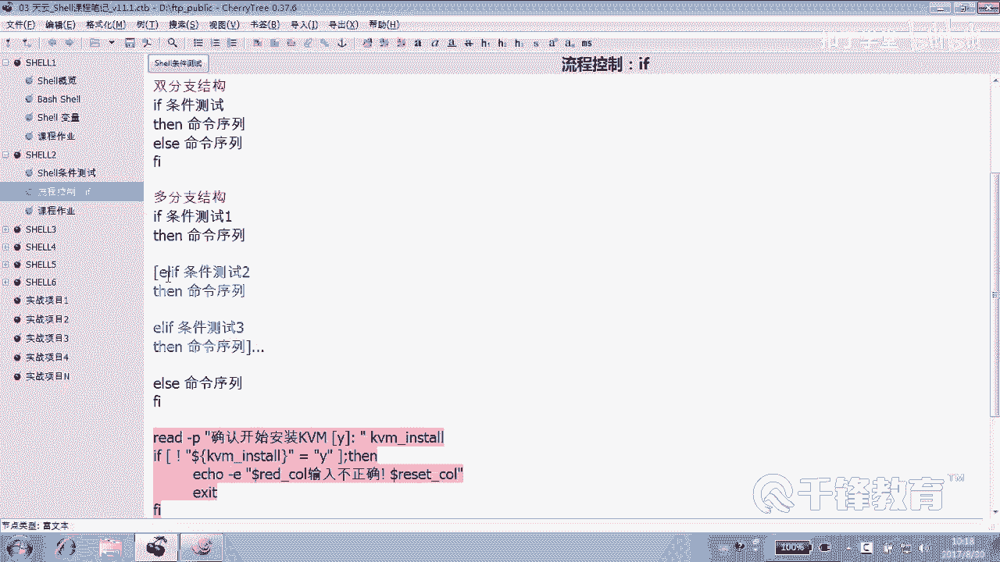

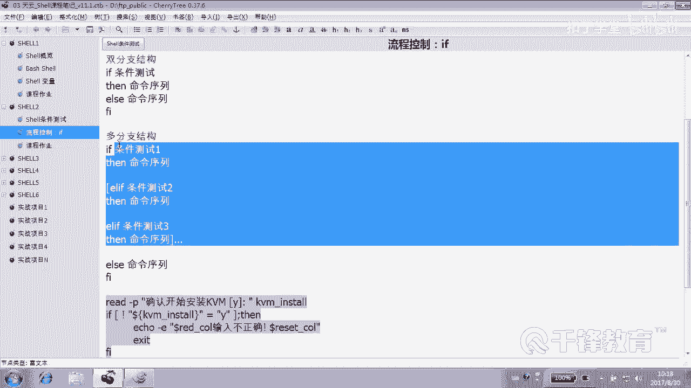

那就是os。你可以用N个L衣服明白吗？好，那我们举一个这样一个例子，各位看大家还记得我们亚目的配置吗？😊。

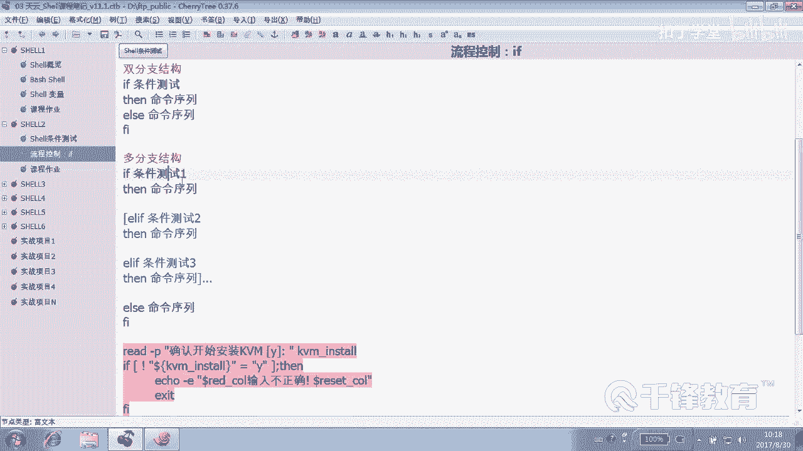

就是我们样整个样目的配置。还记得吗？那大家应该记得我们有一个我们在局网中有一个亚源是吧？这个样品源。或者说我们在互联网上这个也有这个相应的ym源，我们把局域网和互联网的都都来做一下啊。

都来做一下怎么配这个ym。😊，有人说配样不简单吗？无非你打开这个森德。😊，EDCR的森度S。这个文件然后来配置一下吗？是不是这样配置一下？那有一个问题。因为我们在生产环境当中。

我们的操作系统可能有些是6。8的，能听懂吗？有些可能是什么。😡，7。3的也有些是什么？5点几的。😡，当然你可以为。不同的系统写一个脚本来配样。明白意思吗？那我们也可以写一个脚本。

让他判断当前这个操作系统到底是什么。😊，是。哪个版本？就是根据不同的版本，如果是7。3，那我配7。3的。同样大家还记得在我们的那个呃通过163元或者通过那个阿里云的语言，是不是也有也有不同的版本啊？😊。

还有不同的版本吗？有吧，也有不同版本。好，那我们下面呢来做一下这个动作，就是根据不同的什么。😊，操作系统，然后来配置不同的源。哎，这就是可以多分支嘛。😊，啊。嗯，下面呢我们来写下这个脚本。😊。

这个脚本叫做EM的。配置。大家明白我说的意思吗？就是根据什么。😡，我们当前的操作系统，然后来给它指向不同的。亚美园。是吧因为我们要兼顾到7。36。8，甚至还要5点几，是不是系统？😊，好。

那各位大家有想过没想过？这里面最关键的一个地方在什么地方？😊，有一个关键点。就是。美观一点各位。就是你如何先要获得什么？版本号啊。你不能说你告诉你告诉小北说这个版本是哪个版本，你得让他知道是哪个版本。

对不对？😡，那么怎么获得一个系统的版本号呢？😊，在U name杠RU name杠R可以吗？杠R杠A。这也没有啊。这这是内核的版本啊，对吧？😊，我们应该是这样的，你对，有很多种方法。😊，其实啊7。37。

47。5只要只知道它是7就行，好吧。😊，我们没必要说一定是5。85点几。你。可以呢搞一个这个7。3。😊，但也可以呢这个。我们就获得是不是这一段就可以了。😊，怎么会得这段告诉我。😡，解AWK。说吧。

打括号打印dollar。到了。四是吗？😡，到4也可以。到了4就是第四列嘛，这个也们也不会变的。然后紧接着呢还要打印一下是吧？😊，第二分割第二分割好吧。打印。打印什么呀？前两个怎么写？😊，到了一对吗？😡。

然后大浪2对吗？好像，这差个点儿是吧。😊，拆了点，咱们给它加个点，双引号自己写个点看。😊，这个是变量，没错，这个是变量，到一是变量，到二是变量，这里个段嘛？😊，你当中你可以自己加一些双引号。

什么加的啥加的都可以啊。😊，好，然后是不是再给他付给一个哎，付给一个超系统的。😊，人就这么写回车可以吗？应该是怎么写？那个反引号。好很好好，现在我们看一下。😊，OS官。是不是这样子啊？好了。

终于造了一条命令，你们可不能直接抄啊，这命令是要手动什么？😊，敲的像这样敲半天敲出来的。哇，这太长了，点吧。😊，长的我想都想那个。斜线换好了，能接受吗？😊，能接受我就换一下，我我也看着挺挺痛苦的。

但是请大家记住，这个斜线后面再也不能敲任何东西啊，因为它转移的是。😊，回车。明白。好了，那现在上来以后。😊，我们先定义这个变量，定义了1个OS word的变量，这个变量的变量的值是多少，这个是不一定的。

好吧，这是看在哪个机器上运行。😊，拿到的这个值是不一样。好，那现在我们是不是就可以通过。😊，if来写这个东西了，先把结构给我写上，好吧。😊，先写结构，然后再写内容。好，可以。

当然结构上结构也可以补来看一下怎么写，告诉我一起来。😊，哎，现在是字符串比较还是数值比较？7。3是震荡数字啊，我天。字符串好吧，好，所以请大家呢使用双引号引起来。好，如果我们的这个OS。😊，我ren。

等于什么？7。3。少不懂。钱少到了儿。如果我们这个变量值是7。3，注意可以是一个等号，也可以是两个等号，那我们就怎么做？😊，呃，我们可以把原来的y么先给它整个。清掉怎么清掉呢？有一个办法啊，对。

记zap，然后直接给他给它只不论形路径还得加的，好吧。😊，窦静的家。是不是EDCR的什么ym点REPO点D下的芯儿。我不主张这么做，我我挺讨厌这么做的。

我是建议大家在EDC下的EM点REPOS点D目录下建一个什么？😊，ym的back目录。一个。备份目录，我就叫bag吧。然后再把里面的内容给他整个。😊，IEPOS点地下的芯儿哦。

不是新点什么rapple一道。哇，这路径好长啊，我天敲了敲了半天。😊，我都想识变量了。好了，有一个问题。😊，这个你现在在这写一段，说如果是7。3的话，不没关系，我们脚本是不断的在改的啊。😡。

前面这段是干嘛的？整个。😡，把元老的那个。老的那个被问一下是吧？备份一下。然后紧接着呢我们来。😊，配样吧，准配。我们要是不是建一个文件啊？😡，这怎么建文件？肯定不能为I键啊。😡，为什么见？对，没错。

cat说的没错，cat到EDCIEM点REPOS点D下载什么？叫一个表示叫做。😊，森德S什么？7。第二REPO。明白。7U3。什什么结束了？先把这个结束写上吧。看到了大哥。

后面是不是就是这里面的一行一行内容啊？😊，森WS7U3。然后name等于什么？stoS7U3baseURL等于什么？我说了这是局域网的啊，我们局域网的服务器。哪个好士啊？100是吧，能不能整个变量啊。

10。18点多少？40。100好啊，干嘛一定要用那个。So， dollar。E server下的stoS7U3看懂了吗？各位，然后。嗯，GPGCHECK等于0。好了，就这样子。明白吗？可以吧。

那如果不是77。3呢？😡，那能不能直接否则了？😊，不能吧，因为还可能有很多版本嘛，我们就写al if。😊，把这段整个给它复制下来。这段。啊，整个复制一下吧。不能写if服啊，得写什么。😊。

2 if那如果等于多少？😊，6。8。那我们是不是就应该创建一个。6U8的一个东西啊。然后这里面是。618。6喂，618。这里面是什么？6U8看到了吗？各位。好，有同学说这里面有些东西重复了，感觉是吧？

什么重复了？😊。

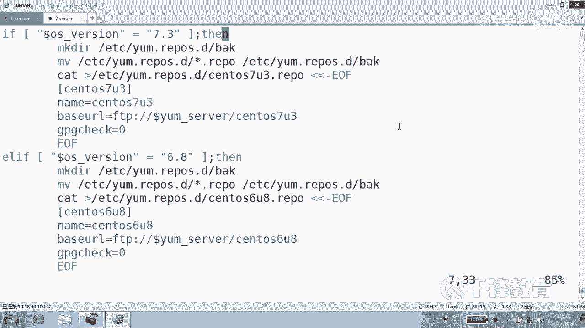

那有些东西其实跟版本没关系，比方说把原来的那个备份备份一下，是不是跟版本没关系啊？😊，所以我们可以把它放到哪。

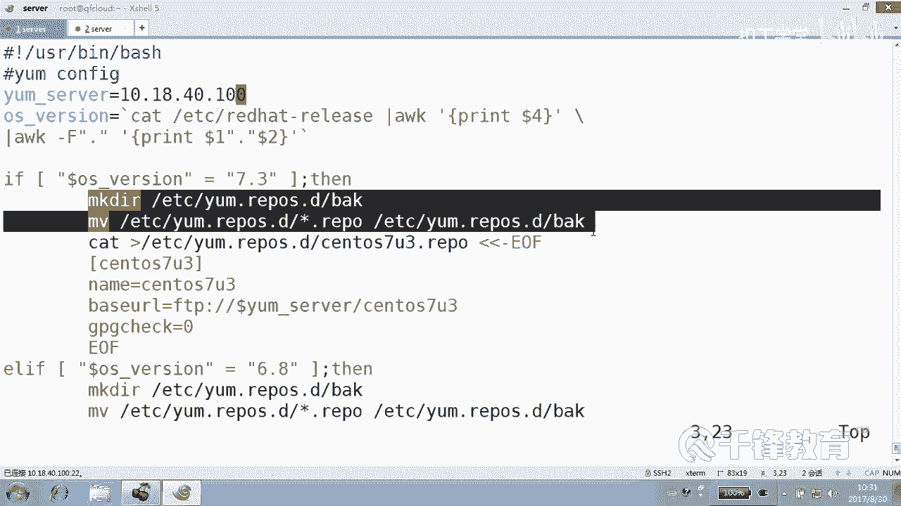

放到下面就上来就够挖这两行。😊，整一下上来就把原来的老的。老的这个给我删掉，然后下面我们就不再写这段了，是不是？😊，好，同样如果是多少，G不是6。8。那有可能是比如说5点。5点几，比如说5。9的。好。

那我们创建一个sS5U9的文件。什么来着？可能有同学说切洗还是麻烦。😡，先写，你看是不是好多东西还是重复的感觉。😡，其实其实这里面是不是只有一个地方，只有一个有一部分要改啊，就是什么这儿吧。

对我们可以把它写成什么？😊，变量。这写成个面料是吗？😊，就在这儿写一个变量。明白你说的意思，就在在每一个里面是不是写一个变量？😊，比如像这样VRIN word等于。变量是吧。但是我我说的不是那个意思。

可以这么写。我说的是呢，我们可以把写成一个函数。😊，后面我们讲的写成一个函数。😊，只是里面的参数不一样而已，看到吗？这样的话。通过传舱的方式就可以传进去。这个脚本你记住，我们能把它简化到就几行。😊。

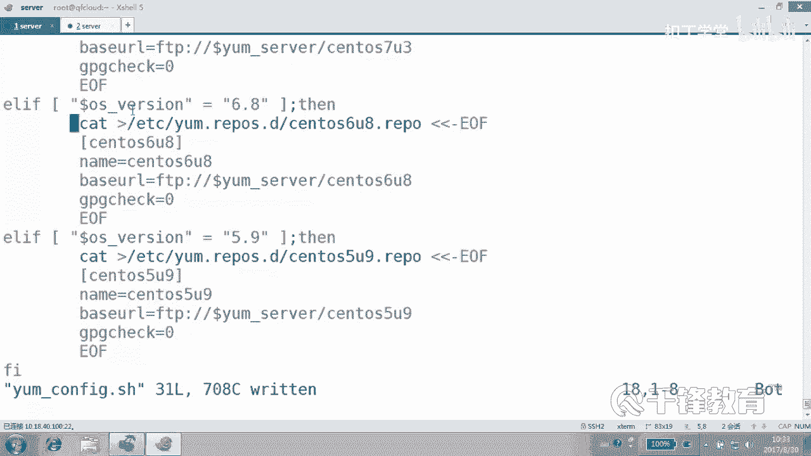

这些东西是不是完全是重复的，看到吗？😡。

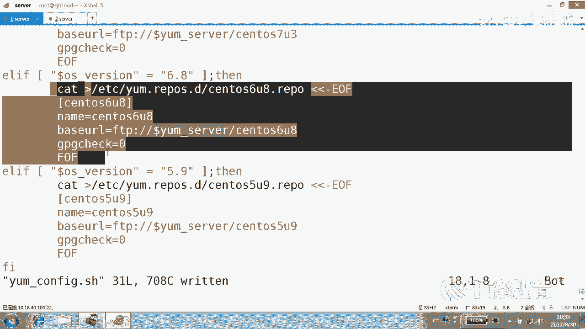

几乎重复的只是哪儿不一样，只是里面的这个位置不一样，我们可以写成一个函数。😊，就把这一段写成一个函数。然后这三个三个里面只要调用什么函数就可以，只不过传一个什么。😡，在调用函数的时候，传一个参就可以。

明白吗？就是掉的函数是一样，只不过一个传的是6U8，一个传的是什么7U3。😊，好，这个脚本大家记住，我们在后面会把它改变成带函数内容形式。O。😊，当然这个实际上呢各位我们是通过在什么？

我们是通过这个各位看一下。😊，我们通过创建这个文件的方式来配置yM吧，其实也不一定，为什么。有两种可能性。一。我们把这个删掉以后。拆掉以后怎么做？Doubble get。还记得吗？

douub get那个。从哪儿从我们的服务器，比方说y。sever把事先准备好的一个文件，比方说sS6U8。点rappper文件。下载到注意杠O哦，重林项是吧，到EDC的EM点IEPOS点D。

下面叫什么？森德拉。6U8点IEPO是不是可以从网上从那个不是网上，是不是从我们准备好的服务器下载一下，就是可以像这样创建，也可以干嘛？😊，下载吧，但还可以怎么做？😊，如果是联网的情况下怎么做？😡。

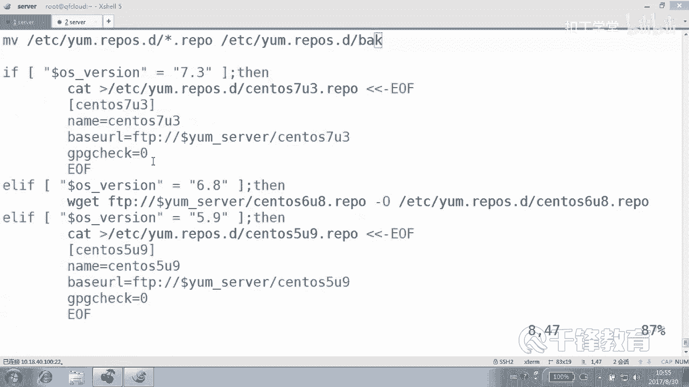

我们是不是可以直接使用像阿里云的这个语言。好，举举例s是不是hp？😊。

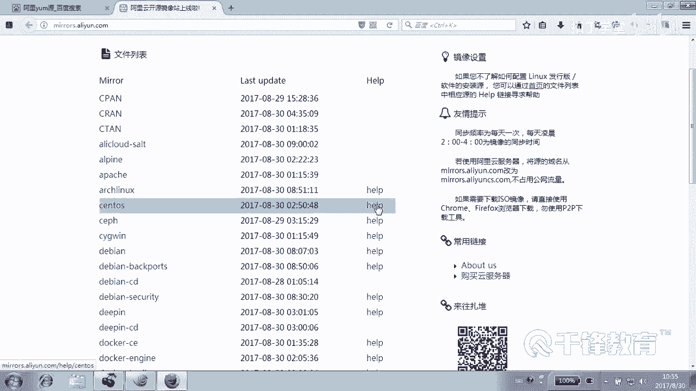

各位看到了吗？567是不都不一样？😡，人家给你取了一个怎么备份的方法，我们我们的备份方法也可以。如果是。😊，那个五的话是不是像这样？下来以后，下在哪儿下在哪儿？注意这条命令有可能做不到，为什么？

因为有时候没有get怎么办？😡，你是CURI吧，因为在没有y之前，极有可能没有没有什么。😡。

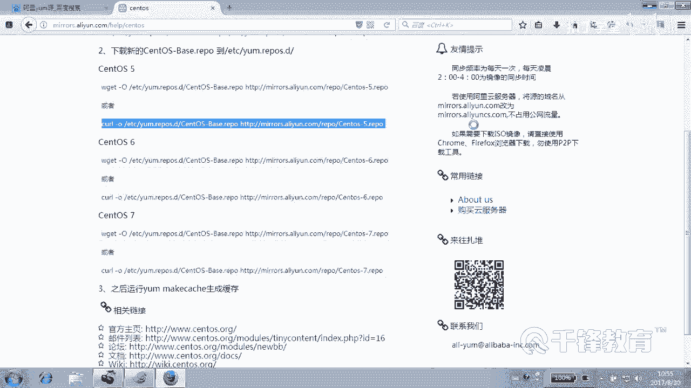

没有get meaning。OK看懂了吗？😊，好，也就是说我们这个if这个多分支这种形式，首先干嘛？获得这个版本吧？获得版本以后，把原来的这个ym呢。😊，删掉。删掉以后，原来的亚母这个配置删掉以后。

再判断。如果版本7。3，那我们就手动来。

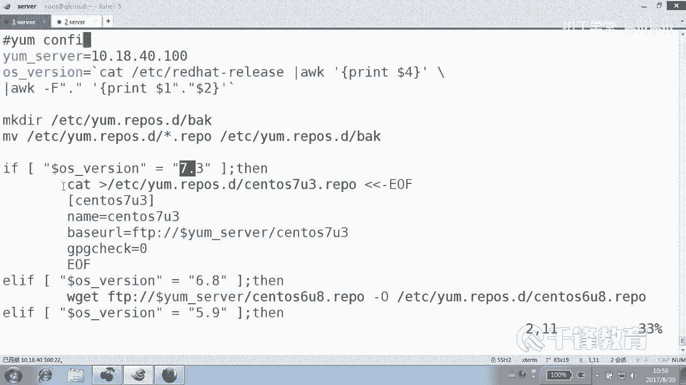

创建这个文件，因为这是局域网的源嘛，是吧？😡。

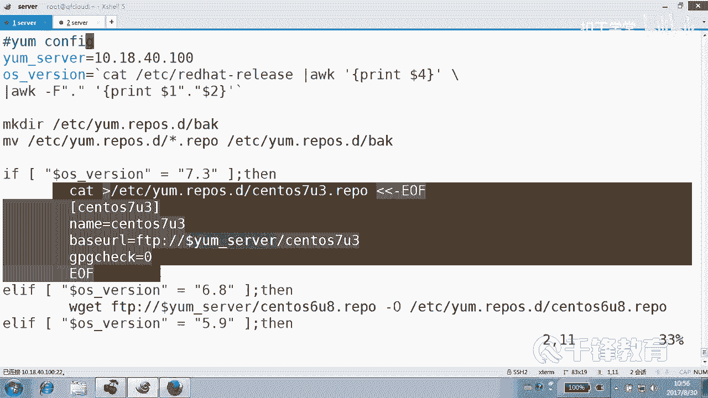

然后如果说是什么？6。8。那也是局网的，但只不过我我已经提前把这个叫什么。😡，这个文件是不是准备好了？同样如果没有这个叫什么？没有get的话怎么办？😊，get极有可能没有，是不是？那我们就直接。

CULCURL这种方式，大家以后习惯CUR的方式吧。😊，看了吗？当然他们是是把这个放到最后的，这个其实也没有影响。哦，把这段放在前面是吧？没问题吧。好，这个是从我局域网中准备好的yM。

而这个是联网的时候的yM当然实际上联网的话呢，这个yM配不配，它本本来就是配好的是吧？如果没有配好的话呢，你可以这样去做。😊，是5点几。看懂了吗？那要是其他版本呢？😡，如果还也不是这些呢。

那就打印一个什么。错误。好，各位看我们现在执行一下这个脚本A加X，然后是。😊，y config是吧？来。嘿。还，没有提示。没有任何提示，就是就没有提示的这种脚本也很也很惨，是吧？😊。

然后我们看一下EDCEM点raple。是不是这样子？是不是有一个back的目录已经搞定了back目录。哎，为什么整成7。3？😊，因为我们确实是什么？😡，7。3的这个这个版本。受气了撒。😊。

是不是一瞬间的问题，当然你可以给一些提示，就是意思是说。是不是给一些提示？说当前系统是。7。3，然后ym配置什么？对，成功或者怎么着好。在执行。怎么了？这是。不能够创建目录，这个目录已经存在哦。

那好像还要判先判断一下这个目录有没有是吧？😊，这很伤感。是哪个哪个文件？好，判断的方法也非常简单，创意这个目录怎么判断？😊，是不是首先我们连衣服都不用写就行了吧。😊。

看杠D是不是EDCR的EM点REPOS点D。这个目录如果。这个能看懂吗？如果那个目录存在。是存在吗？我们应该加是。存在的话，后面是不是就就不做了，是不是只有不存在才会做？😡，只有当前面条件测试为。

唯失败的时候，为假的时候，后面是不是做好吧，这样的话，脚本再来走一遍看。😊，可以吧。是不是？好，我们再看看这个脚本，这就是一个典型的什么？😊，多分支结构。如果一个判断不出来的话，不是满足这个条件。

那我们就。

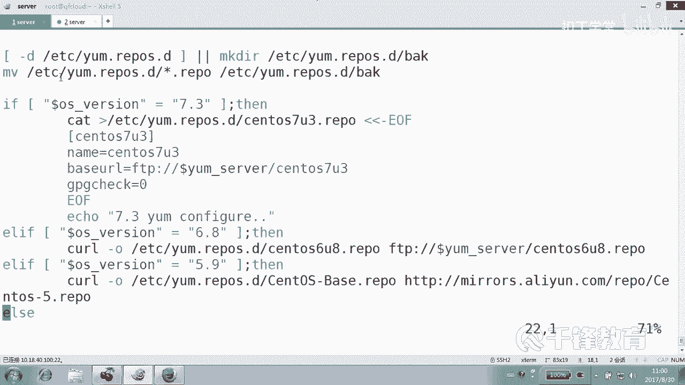

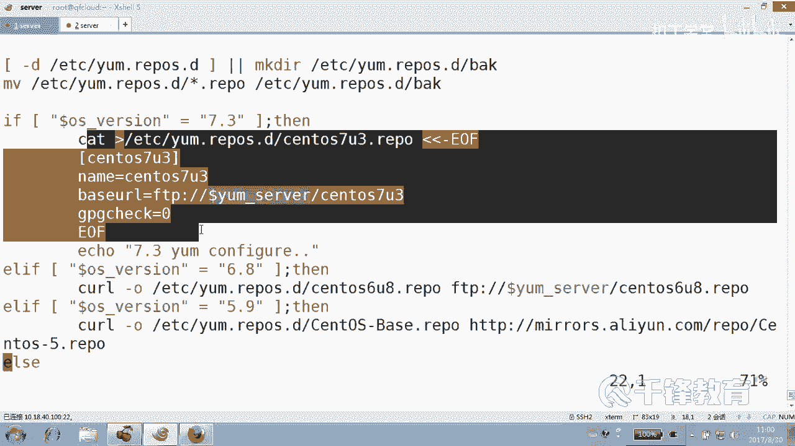

如果满足这个条件的话，那就做这一段动作。否则的话呢，再判断是不是。匹配这个条件，如果匹配的话，做这段动作，再或者是匹配这个条件，做这段动作，最后ar。O。😊，好，这就是关于呢这个。一个。

多分制的这样一个结构，好吧。

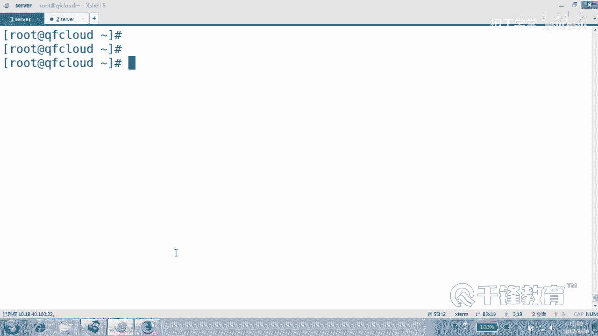