# 千锋扣丁学堂Linux云计算系列：Shell脚本自动化编程实战视频教程 - P21：4.4 if条件判断 作业解析 - 扣丁学堂 - BV1SE411q7vK

好，各位我们在前面已经带大家去了解了一下这个if语句是吧？if的 else这种结构，这种结构呢我们也讲过用的是最多的，也没有必要特别去举例说明它，对不对？然后呢，有一些作业，比方说第一个拼一个主机测试。

这个咱们是做过是吧？不个通。😊。

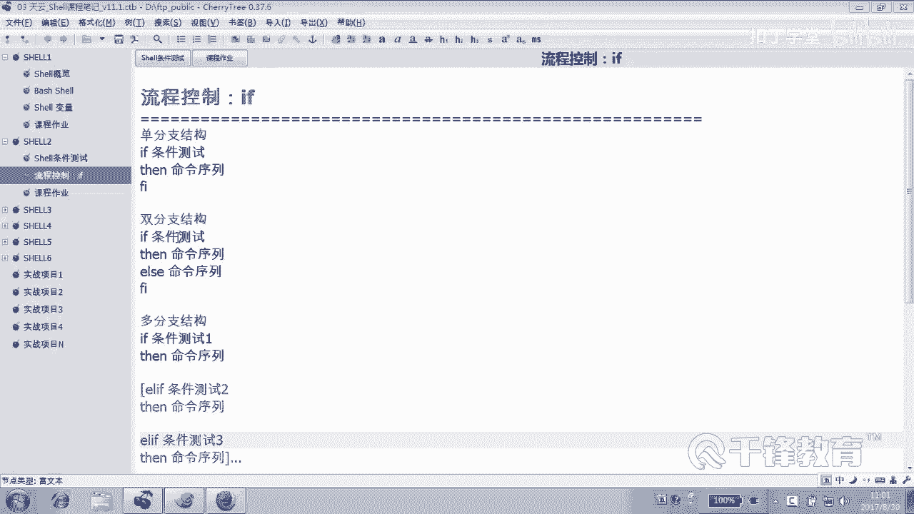

或不通怎么做？第二，判断一个用户是否存在，是不是也做过。他的用户你你你首先要你要做这种东西的话，你要先先怎么做呢？你要先。先知道怎么去判断，就怎么去得到一个。t或 force的返回值。嗯，判断方法。

判断判断主机通不通，这个拼一下是不是就知道了，拼能够给你一个返回值吧。😡，那如果要判断一个用户存在狗呢？ID好吧，ID加用户名字是不是就可以了？你不要去gra过滤什么的，这个没有意义。好吧。

ID我记得我们在这个之前的脚本当中应该有过这个脚本吧。😊。

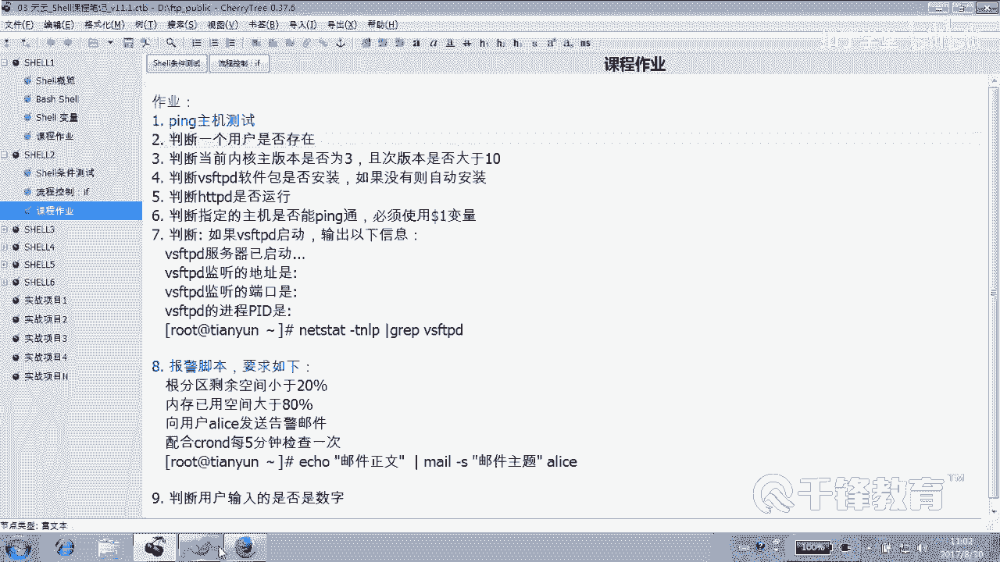

叫做。ID芯儿。看在。Greatate。啊，好像都是是吧，两个。我就1个01里面。这个我们当时做过，是不是请输入一个用户名？😊，请输一个创建的用户名，我们先判断一下用户存在不存在，是不是用的ID啊。😊。

如果返回为。为帧，那我们就说用户已经。存在用户某某某应存在，否则的话就创建用户。创建完以后呢，再紧接着嵌一个if说。创业成功了吗？yes是不是这样子，这到处都是一复一句，是不是？而且呢。😊。

这个这个例子我们就不再再来带大家一起了啊，这是非常简单的。😊。

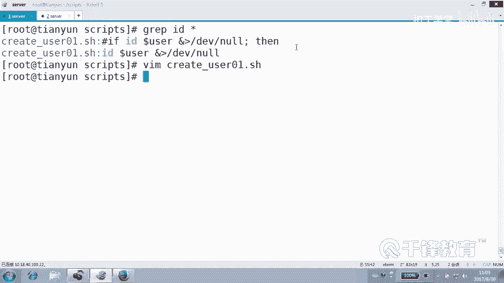

写过，那这些都是呢来帮助你来干嘛？😊，去学习呢这个衣服的一些。一些那个测试的一些一些那个要求。判断当前内核主。主版本号是不是为3，次版本号是不是大于10？为何。这怎么判断？

首先肯定是先把那个主版本号和次版本号。先拿到吧。这个你们自己一会儿去做啊，先拿到明白了吗？拿到就是定两个变量呗。😊。

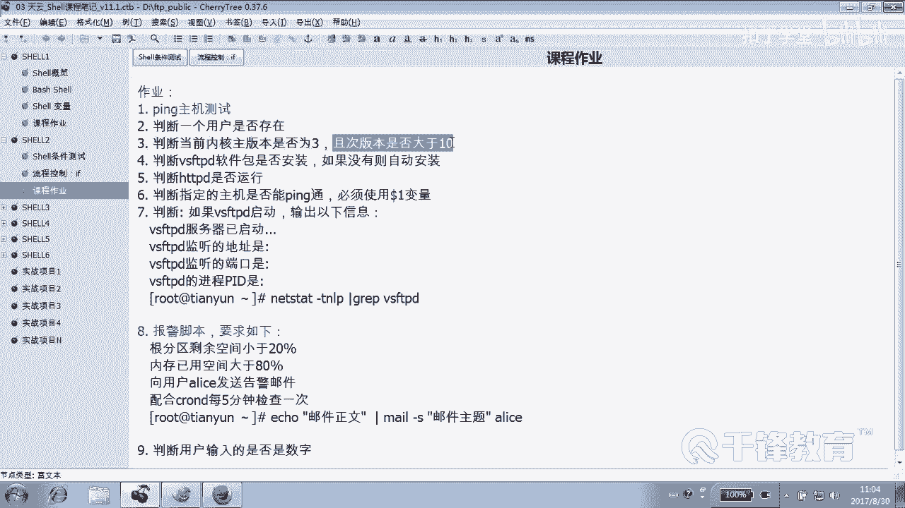

怎么拿到？U name杠R拿到第一个和第二个是不是拿到了？😊，然后再写一个脚本。是什么？是不是使用这种方式，主版本号比如说man。😊，到了啊。怎么着？那个。大大于大等于3是吧？EQ3。

但这种东西你可以把它当字符串，也可以当成数字，然后并且杠A是吧？杠A并且什么次版本号。😊，四版本哈。😊，小大于什么杠G。大于等于10。好，两个条件是不是？😊。

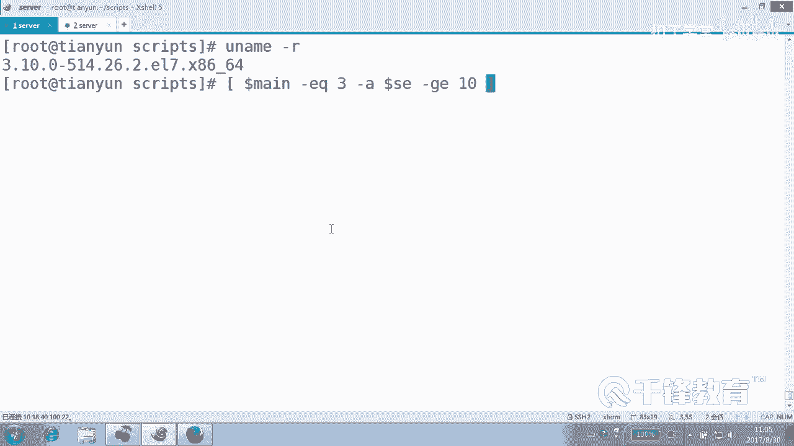

好，首先你得获得主版本号和次版本号的两个。两个值通过变量或两个值，变量是定义在前面的，对不对？然后呢来判断这两个是不是。满足这两个条件，注意这是两个条件。一个是主版本号是否为3，次版本号是否大于10O。

第二呢，判断FDB软件包是否安装，如果没有装就装，这简单吧。问题是肯定是个if else。如果什么没有装，就说怎么知道没有装呢？😡。

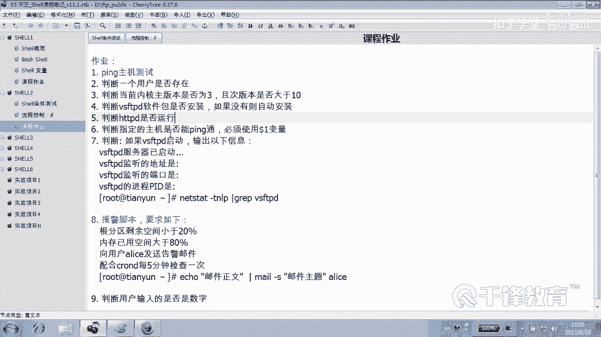

RPM杠QVSFDBD。看到吗？它会给一个返回值。这是没有装吧。

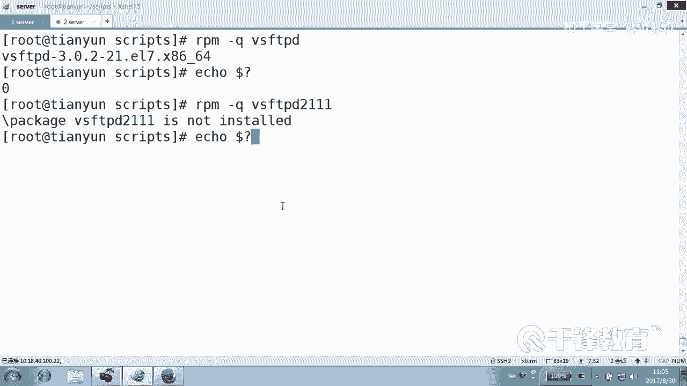

好，所以你得知道用哪个命令去判断去得到这个真和假的返回值。明白。能听明吗？好，判断。

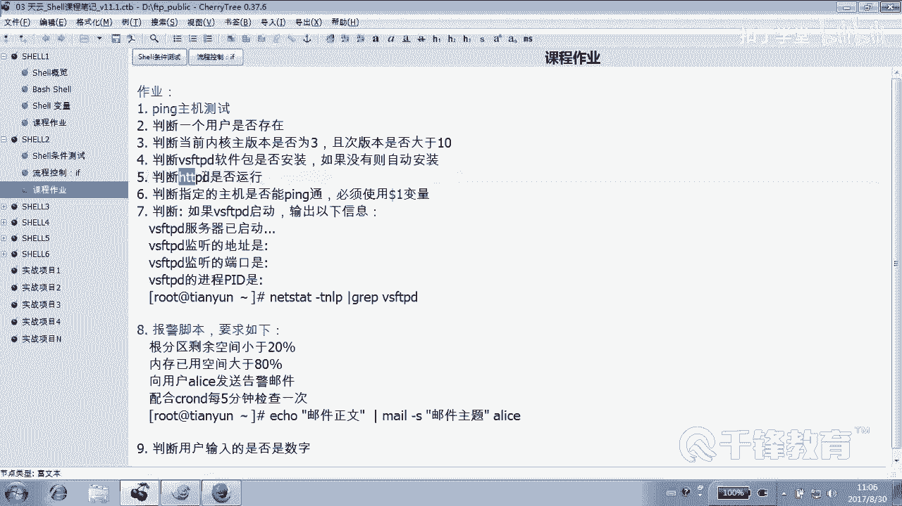

ITTP是否运行，怎么判断用什么方法？😊，system CTLIDDBD。好，你看它的返馈值。😊，你有没。好，我们找一个机器。怎没法找来找两个机器。😊，停一个服务吧，这个停这个服务。

这个是开着还是关着的？打位置？啊不不不，那个ts。明白了吗？所以你必须找一个能够帮你干嘛？😡，得到这个命令返回值的这样一个命令，然后让它判断明白吗？😊。

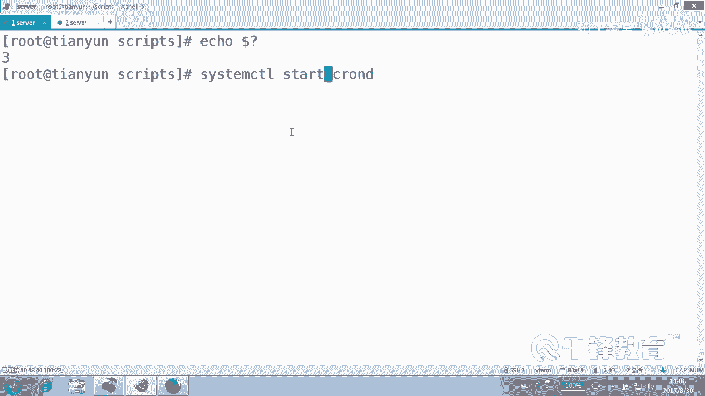

好，这个能看懂吗？这个。😊，能看懂判断指定主机是否能拼通。

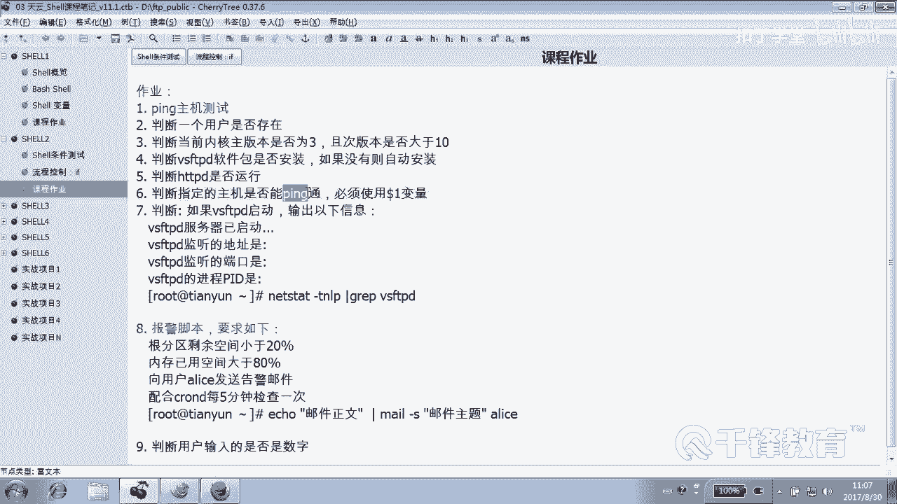

啊。必须用刀一，什么意思？就是你在执行脚本的时候，表这是king脚本。😊，点斜线是吧，后面加一个。😊，参数。来传给哪个编量。

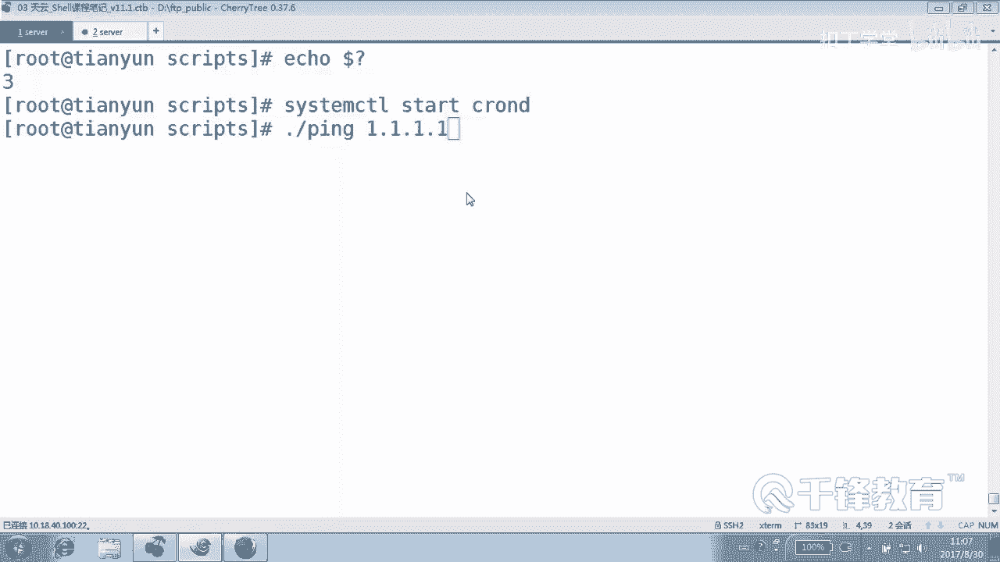

道了一变量能不能写出来？写不出来，你别吃饭啊。判断FDP是否启动，如果启动。输出以下消息，打印以下消息。eical echo echo echoical echo。😊，明白吗？就说服务器显示服务器启动。

服务器监听地址多少？这里要给大家提个醒儿，可以用哪个命令来来得到这个结果。😊，可有两个命令，一个是light state。一个是什么？SS一般老的人都用的是let state，新人都用的是SS。

你是不是要去弄几个变量，获得这个这个东西啊？😡。

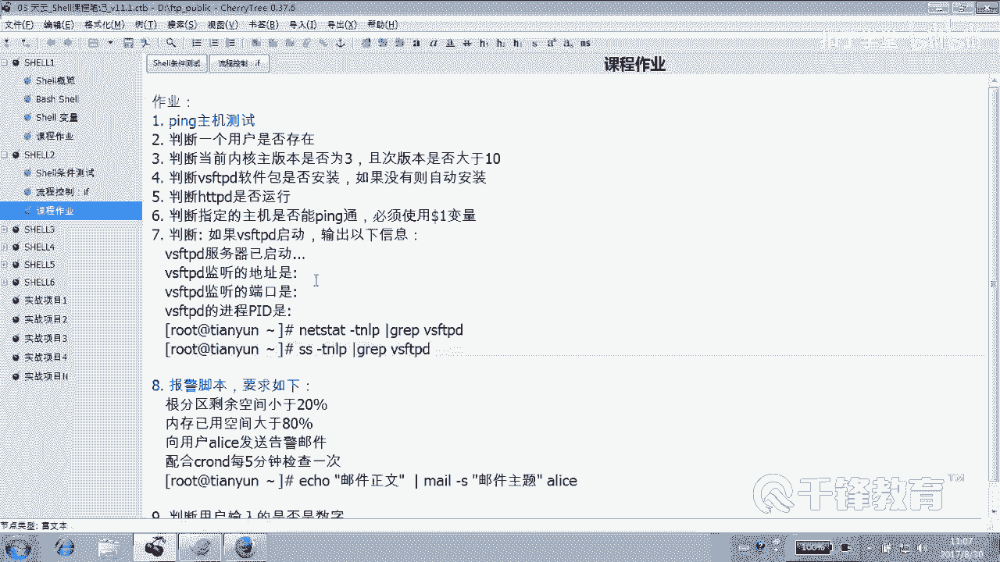

注意这个我们是不是写一个什么结构，是if。😊，啊，不是先先看看它有没有启动吧，怎么看有没有启动。😊，t是不是启动？😡，好，我简单假如说我随意的给大家。😊，展示一下啊，所以是不是首先是if。😊，嗯。然后。

二seFI。现在上面现在怎么做？😊，现在是不是system。CTL。Stayhouse。VSFTPD啊，当然这个过程就不要了嘛，对不对？明白吗？这个你自己来啊，如果。😊，成功EQ等于0。写束了吗？

最后这个结果肯定是说没有启动是吧？No running。上面就是启动的呗，下面是不Ile。😊，VR7BD。Rnie。然后在Iical什么？他的什么来着？他的啥啥啥啥啥是啥吧。好，注意那个变量写在哪儿？

写在这儿。😊，VSFDBD的port是哪个变量，明白了吗？😊，能听懂吗？各位，然后VSFDPD的什么？😊，addressss是哪个变量？你千万不要把这两个东西写到外面去，为什么他说没启动，你怎么获得呀？

😡，你一定是在它已经什么启动的情况下，是不是才能够获得这些信息？就是说怎么获得，那我管你呢？😡，SS杠TALP。然后过滤一下什么。VSFPPD。啊，没有起啊，这季啊。再见吧。听NLP过滤一下什么。哦。

不是不要我加冒号，好吧。好，过滤以后，各位有说哪是鉴定的IP呢？😊，这个是监定的端口是吧？这前面这段是监定的IP。😡，一样显示一样看到吗？这个如果是这样显示的话，就指的是任何IP。😊。

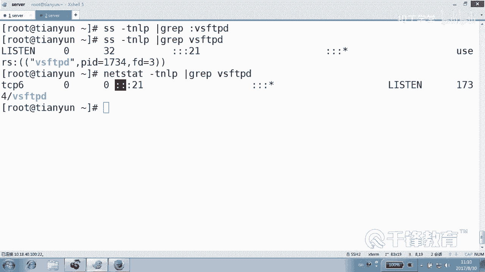

然后还有今天的地址，地址就是哪段？就是刚刚说那段端口PID那段。😊。

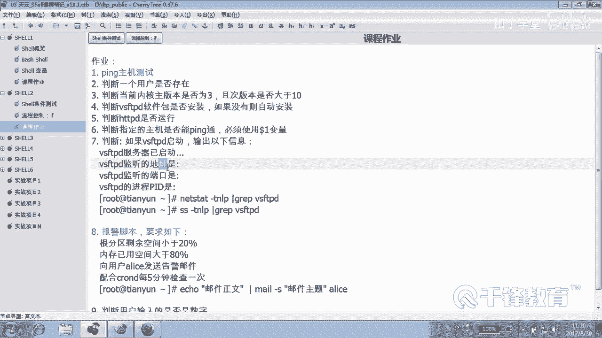

自己找了。PID在哪？1734啊，1734是吧，或者是上面这个。

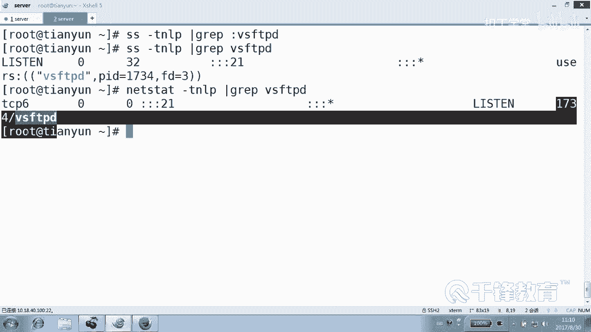

1734啊。

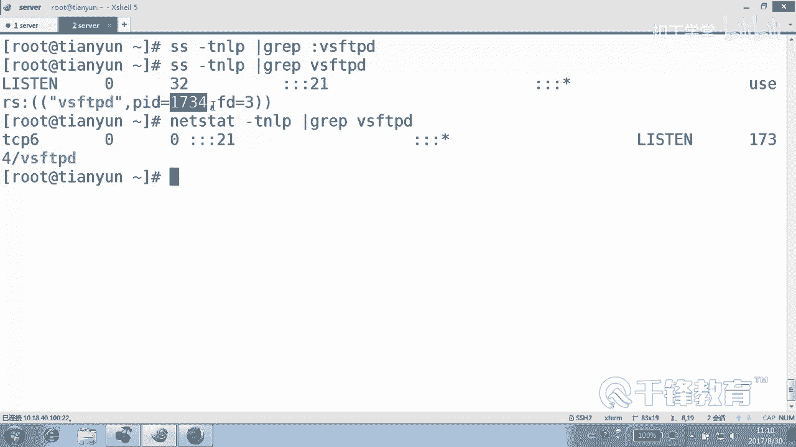

明白，你给我找出来，然后呢最后打印出来，看懂了吗？😊。

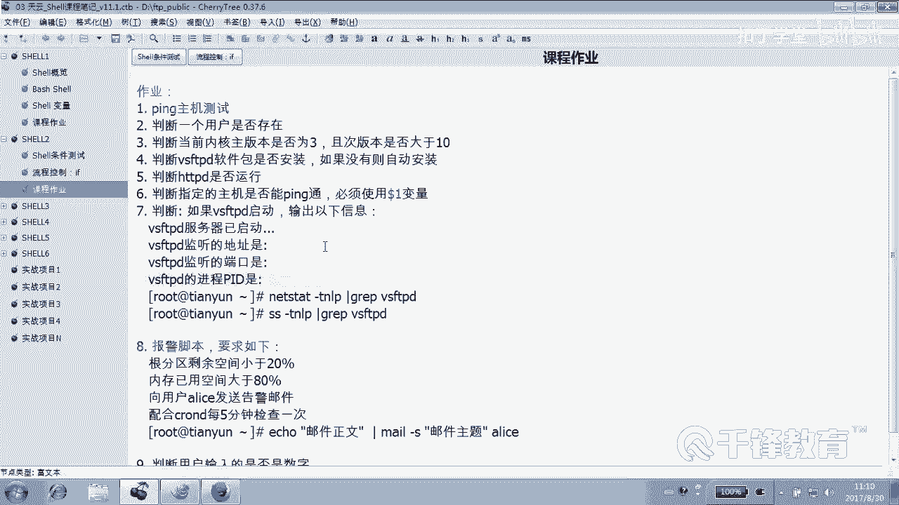

好，下面这个脚本我们是做过的，就是。😊。

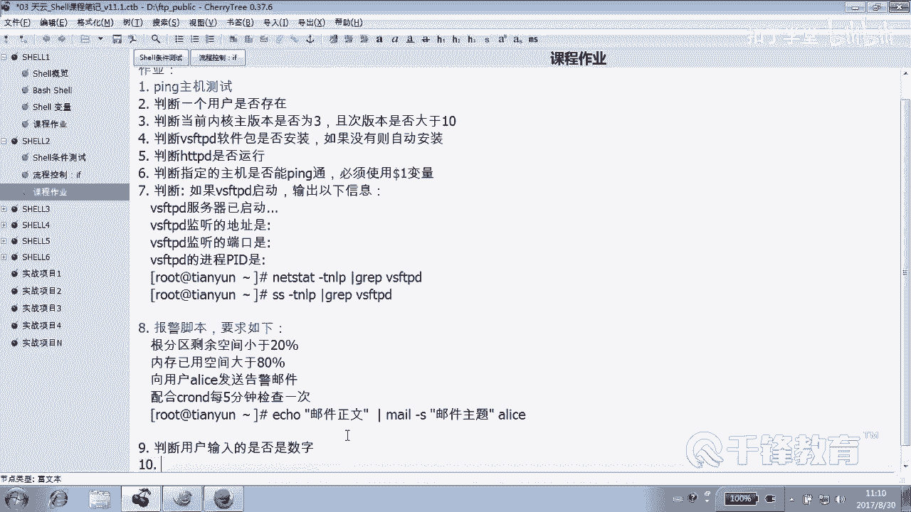

对，如果A这个地方有点不一样，如果根分区空间小于20%，内存空间小于百什%么？大于百分使用版大大于百分80%，向用户爱丽丝发个告警，5分钟一次正文邮件。这个脚本里面有两项，一对根温区。第二呢。

哪一项不合格都要报警，明白吗？就其实把我们前面脚本合起来。最后一个判断用户输的是不是数字，同样是不是还是一反义副语句？😊，好，这就是我们衣服有居的一些非常简简洁的或者小的一些使用案例，好吧。😊。

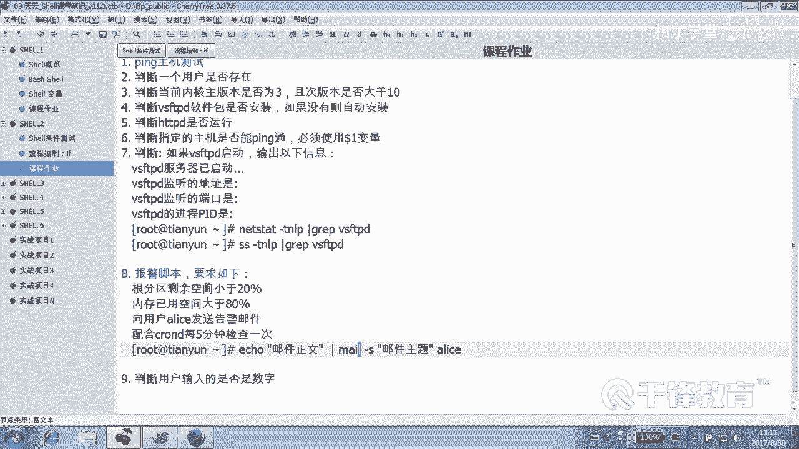

好，大家把自己呢把这几个作业呢都做一下，好吧。😊，嗯，这有这有问题吗？只是说你可能开始写的不习惯，慢慢的就慢慢习惯，一定要记住，写脚本的话，先写什么。😊，结构。在写里面的内容。

然后再可能会对结构做一些轻量级的什么。调整。好吧。能明白吗？各位。好，这就是我们的if。if当然没有结束。if呢只是一个开始。😊，啊，因为衣服实代。😊，在哪儿讲都要讲义附一句是吧？这前面无论前面的案例。

还是后面的例子。😊，都要用条件测试，这个是一个使用率像LS一样比较高的一个一个一个方式，一个命令，对吧？好，这就是关于我们在。😊，这一节的if的一个作业的一个解析。好吧。

你们自己呢把这段整个来实现一下OK。😊。

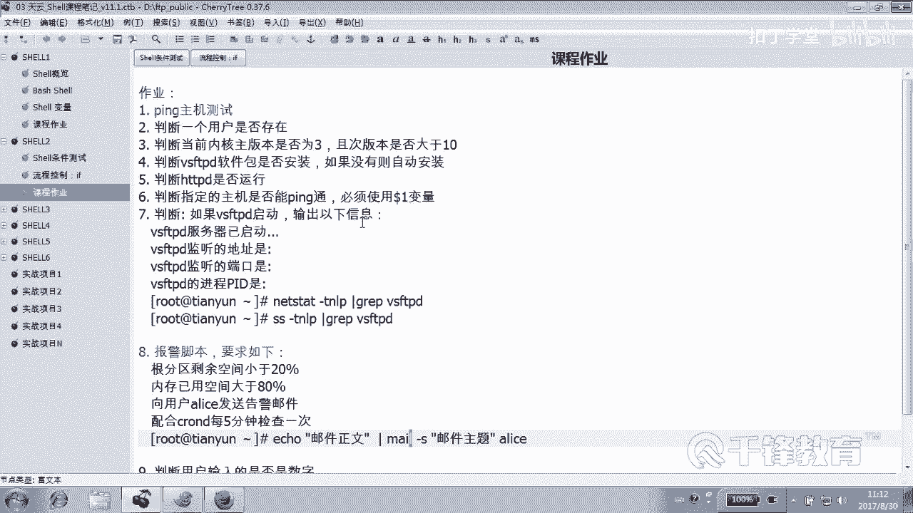