# 千锋扣丁学堂Linux云计算系列：Shell脚本自动化编程实战视频教程 - P22：4.5 for 空行的秘密 - 扣丁学堂 - BV1SE411q7vK

好，欢迎各位再次回到课堂。然后。😊，我们在前面那个脚本呢创建用户的时候有一个脚本是吧？这个脚本呢，当时我们还刻意的去。考虑了一下所谓的空行的问题。Useer。createuser2呃，user不是2。

是10什么？2。好，在这边呢我们看到。😊，我们当时还。

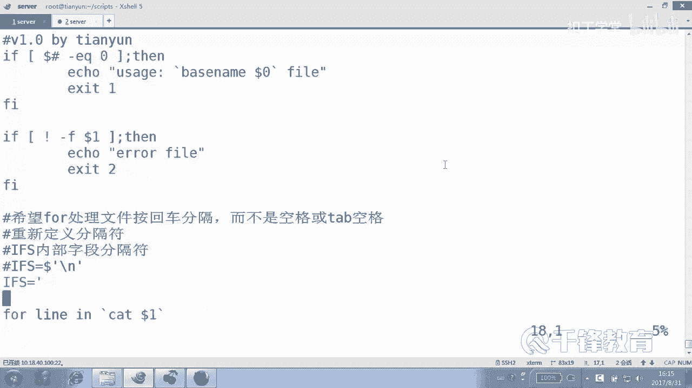

在某些同学的引导下，误导下应该准确的说啊，然后加了一个这玩意儿。😊，是吧加了一个，如果是。这个变量是长度是什么？零也就是所谓的空行的话，就直接显示nothing to do，但最后发现什么都没显示。😊。

让人感到好遗憾。这个是为什么呢？我们下面就来解开这个秘密。好，我们用一个特别。特别的文件来说明一下，就是里面只有一行看了吗？就一行没有空行。那我们执行怎么执行的呢？看。😊，bash杠VX吧。

create。102，然后user点1点TST。好，看一下，上面是我们的代码本身，下面呢。😊，看他这个文件以后，啥也没干。没有了吗？

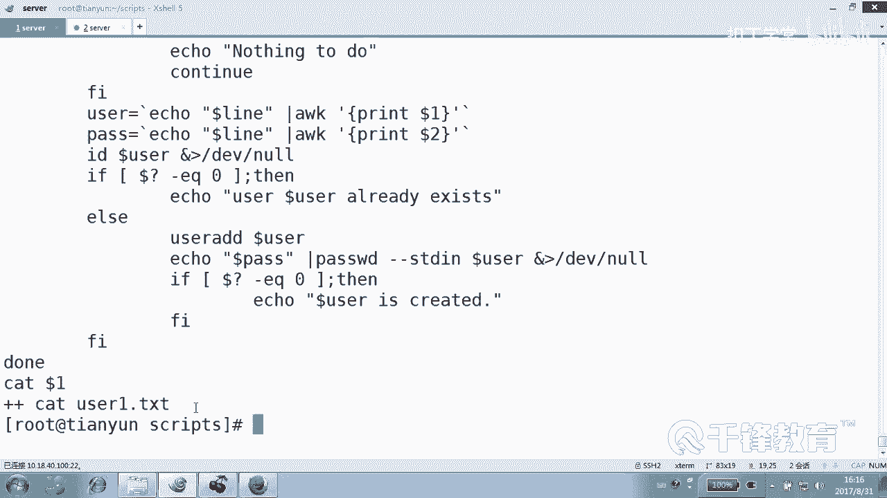

有说那这什么东西，这就相当于。然后。啥也没有一样。因为for循环，它后面默认是。按空格进行分割这个变量的。变上的列表就变上值的。也就是说，如果说你真的取上来了，像这样烂是吧，硬是吧？😊。

你是不是在后面是不是像这样ca了一下那个叫dollar一的文件。好，假如说你ca的就是ETC，就是那个user点什么E点什么TSC我们假如说这个文件里面有几行，假如说啊你看。😊。

user1点TST假如这个文件里面有羊123是吧，空行一个，然后天云456，是不是这意思？你知道他要怎么读吗？当然我们在之前是不是加了个I就变成了。😊，变成了回车分割。好，这个没问题。

那如果不按回车分割是怎么样呢？先说一下，如果不按回车，最后结果是什么？😊，最后结果相当于什么东西？这儿。相当于羊什么123。天云123是不是相当于4个变量值，循环循环几次，4次没错，是不是4次？😊。

是这样的吗？我有空喊吗？有空行在哪儿？在那大众那好吧，对，空行在哪儿呢？在这儿。😡，空网是不是相当于这个？😡，是不先空啊？那么空行其实就是个空格。号没有东西啊。所以说你看就算加个空行循环几次。孩儿四子。

所以根本就忽略他了。😡，就没有他的事儿，知道吗？😡，因为for循环本身它变量的这个值，最后在最后。赌的时候会以什么分割？这最后读的时候会有空格。那如果我们加了一个加了一个什么符号？😊。

加了一个IFS等于do。把它换成了这个化行符是吧？那么最终也是这个效果。😊，什么效果？当中但然没有东西是吧？没有东西。😊，对，还是个空格。空格没有任何意义，知道吗？

所以空格那一行那个那个东西根本就不会参与到循环中去，所以没有也不存在去对它做一个判断是不是长度是0，这本身就是一个伪命题。😊，看到吗？因为for循环，人家根本就不会理睬这个空格或者空行。

这根本就不会用到它，明白吗？所以照这么看循环循环几次。😊，起次。😊，两次为什么两次这一行循环一次，这一行循环一次，那个空行视而不见。嗯，可可不以理采。你这不是空格，空格和空行是两回事儿。这块。

如果我这儿加的是空格的话，那性质不一样。像这样这个性质不一样，好吧，空格本身是字符的。😊，但是空格的话也会有问题，就是它的变量长度绝对绝对不是0O。这是你纯粹是你自己给自己找麻烦。如果真的是一个空行。

像这样没有任何问题，因为for会忽略它。😊，不论说是for忽略它，是for本身拿到这个东西以后，就相当于你在你心目中有3个，一个是第一行，一个是第二行，还有一个是什么？第三行。

但是第二行其实在for看来。😊，根本就没有。所以也压根儿不会去什么去对这行。这个值去赋值，然后从而做相应的操作。没有吗？这能不能听懂？这就是我们为什么刚才那个问题造成的原因。好，我们细细来再分析一下。

你看啊再分析一下我现在。😊，就算加四行是吧，现在有两个正行，有两个什么空行吧，看到了是不是两个有两个有正常的行，有两个空行。好，下面我们再来执行一下脚本。😊，好，那为了能够演示呢。

我们把这个羊稍微换一下啊，是你脚本。然后这次我们还是想要我们看一下我们的脚本哈，叫什么。😊，这个小伙们。😊，各位这里定义分割符了吗？定义了吗？😊，听了吧。好，那么按我们的讲，按我们讲的话，是不应该是。

😊，四个东西啊。但实际上呢，你看它循环几次，你自己观察。巡环几次，这样我们也可以在为为了为了什么呢？我们每次循环完了以后呢，我们加一个。😊。

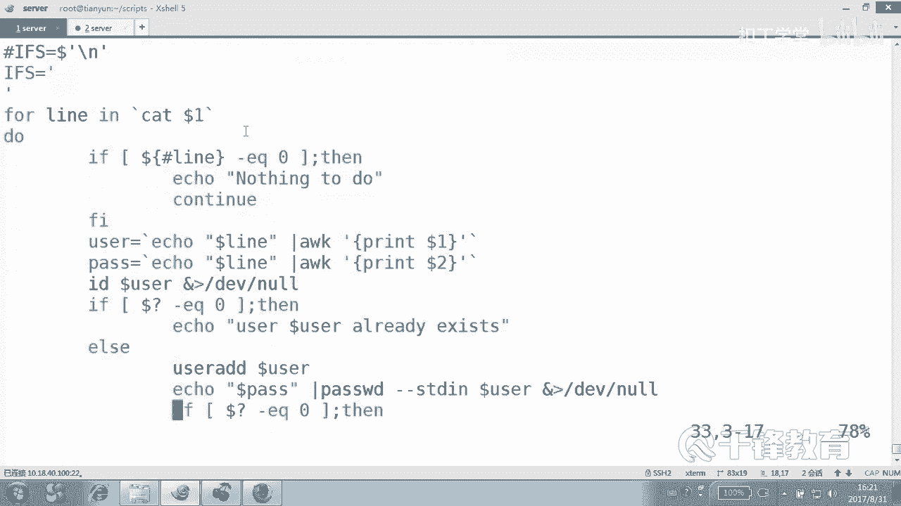

加一个什么？我们在循环开始加一个也可以。我们说这个是。😊，第一次。第一次吗？开始你就随便输，随便输一行，我们整一个整一个一长一长串，看它会出现几次，好吧。我们现在想到他应该。是四行，但是呢。

只有两个有内容，而for循环的时候是不会关注那个没有内容的东西。因为它分割的时候就是采用。空的分割。好，现在。我们怎么执行？是拜lash这种执行还是怎么执行？要想看得清楚，我重新开个终端。

保证这个终端是空的。好吧，CD到scrips下面去，然后bash杠VX，然后是。可那个user。create userer102，后面加一个user一点什么TST。

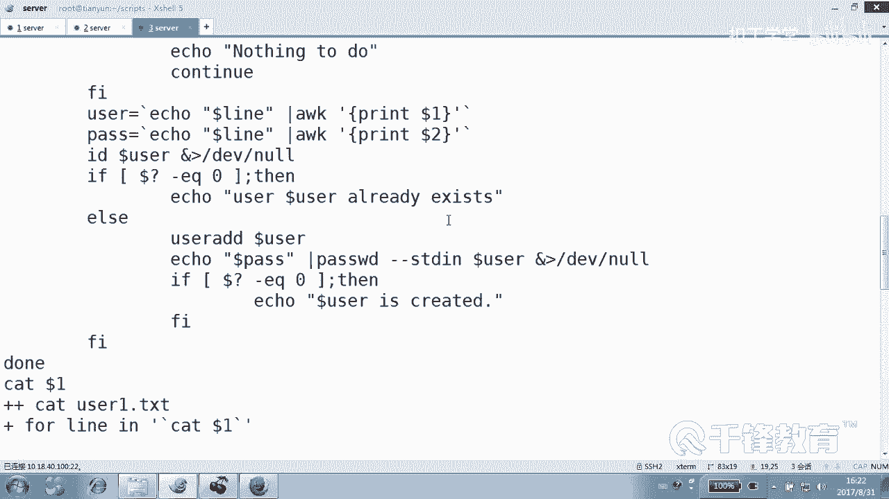

好，这到这儿为止，这是代码本身看到吗？

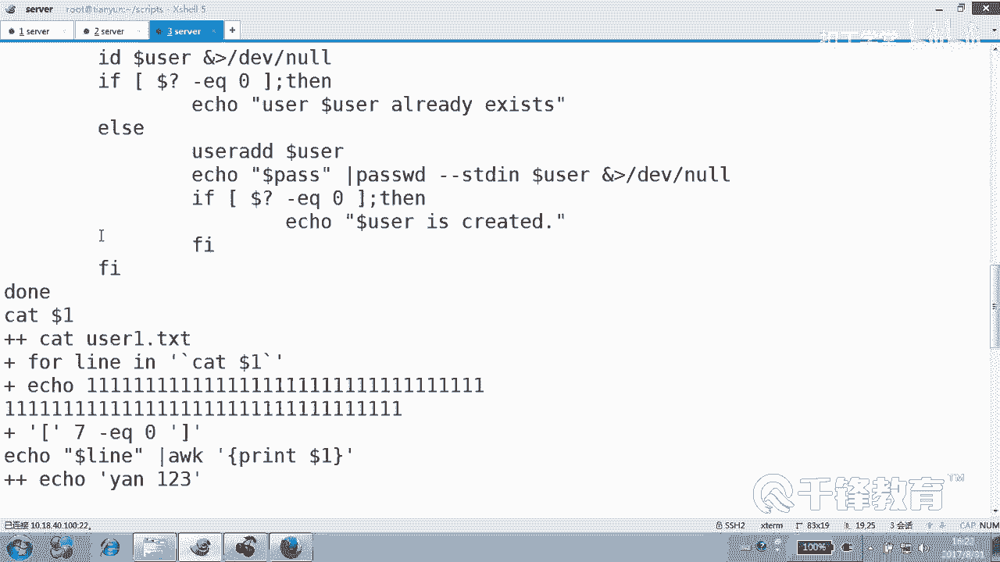

看他一个文件，然后读到内容是什么呢？他说第一个长度是7，嗯，七是指哪个？😊，是第一个长度是亲吗？😡，第一个长度，其实那个根本就根本就用不上那那一段，好吧，就是我们那个那段根本就用不上。😊。

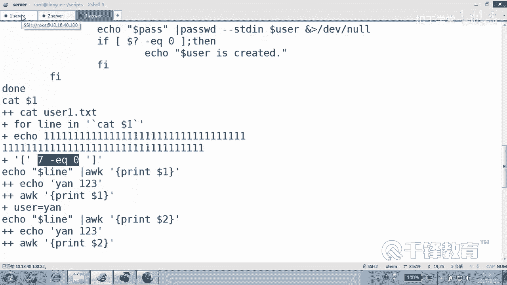

申请。是7没错，第一个是7，然后紧接，第二个是。

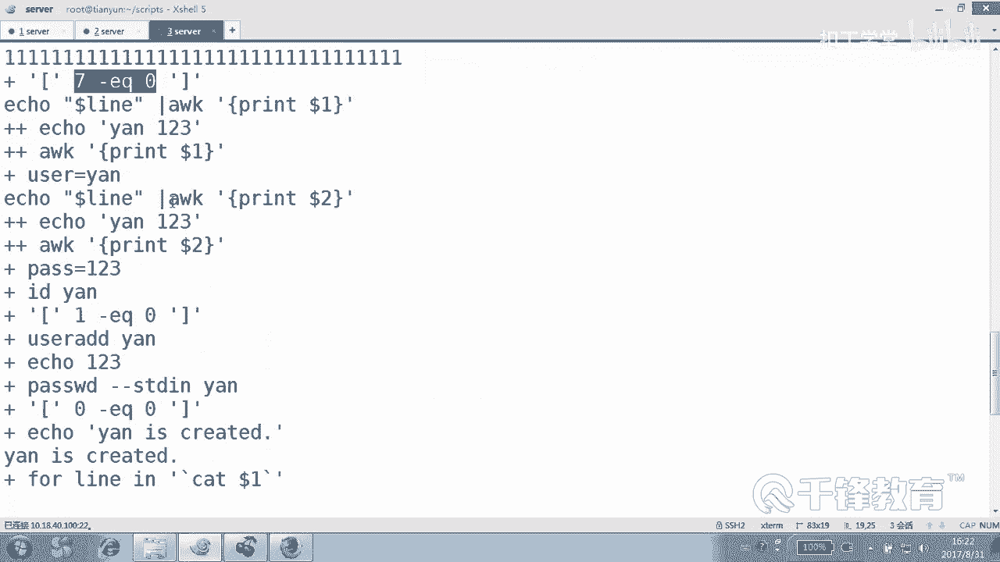

是11看到吗？所以竖出一行吧，再也没有第三个。😊。

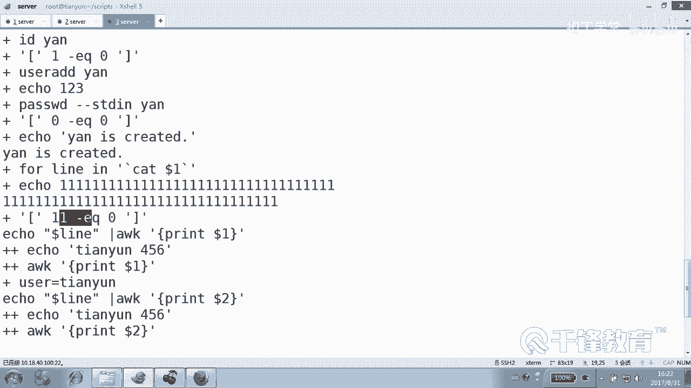

所以其实在他看来就两个变量，是不是两个变量值吧，就没有两个空行的什么事儿。再换句话说，我们刚刚写的这玩意儿有用吗？😊。

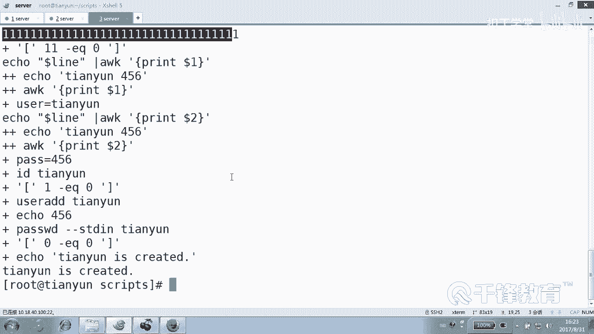

没有任何用处。就完全是就是没有用，看这这段吧，哪段？如果变量长度是零，根本是零的，连这儿来都来不了，对不对？所以根本就不需要这么做。你再看一下执行过程。

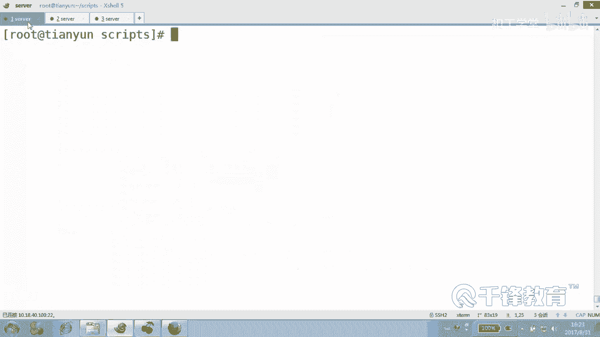

执接过程好吧。看这个报的是存用户存在。看从这儿开始，前面是脚本的那个呃所有内容。然后从这开始，第一个是。😊。

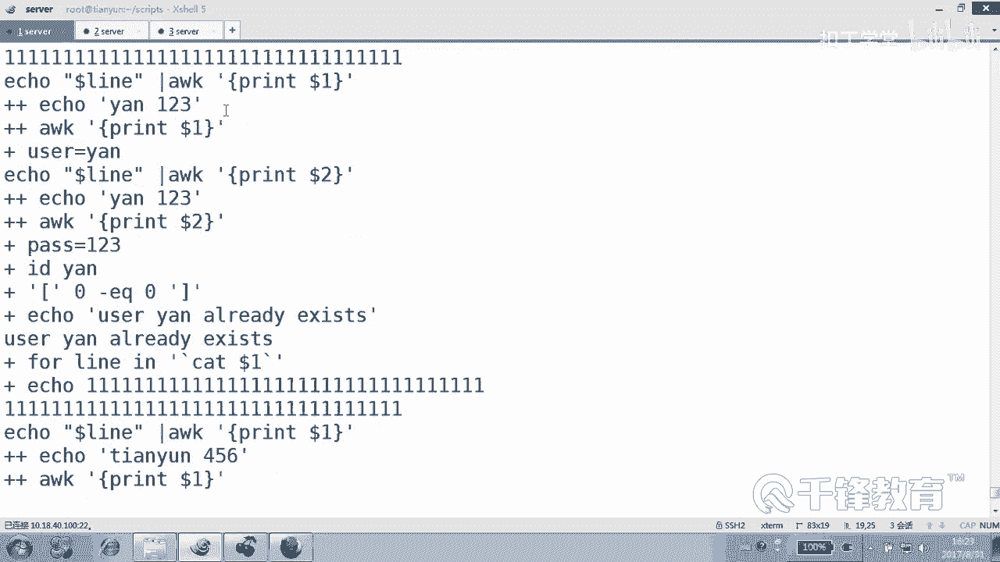

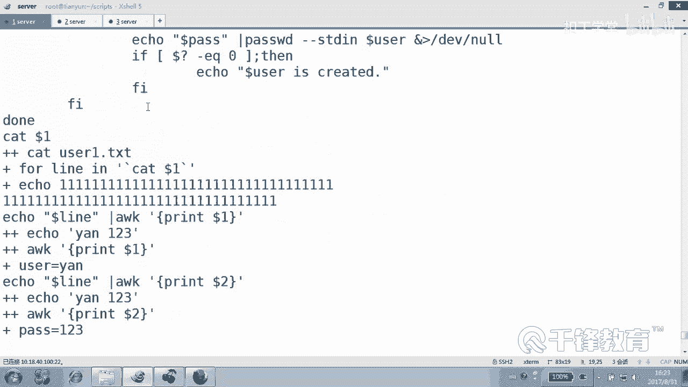

长度是几？我们两后注释掉了是吧？嗯，那上来就开始。😊。

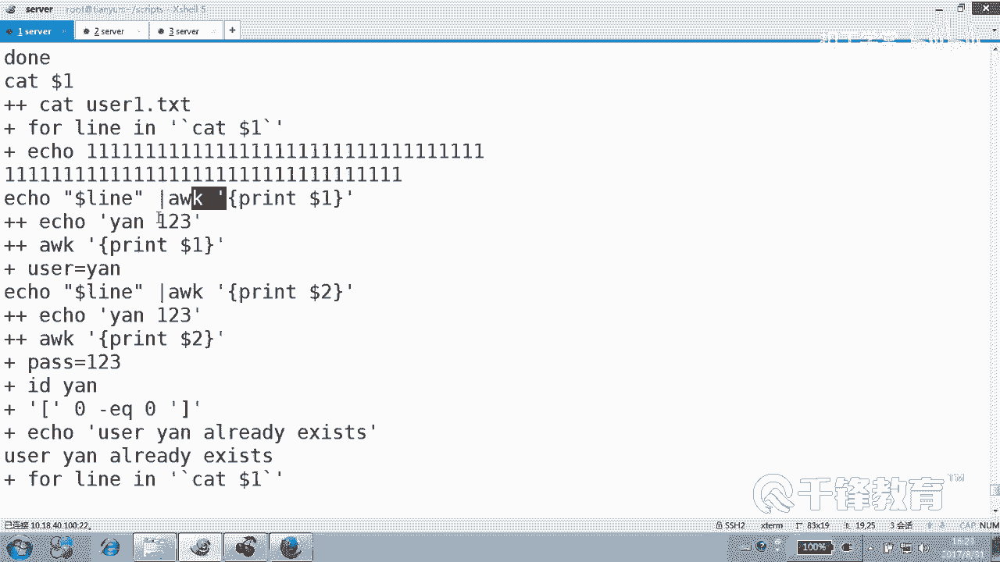

用户开始创建用户，但是用户实际上已存在了是吧？实际上是不是打印点哈，根本没有我们想的要打印几哈，就算我们没有continue一样，只是几个变量，几个变量值。😊。

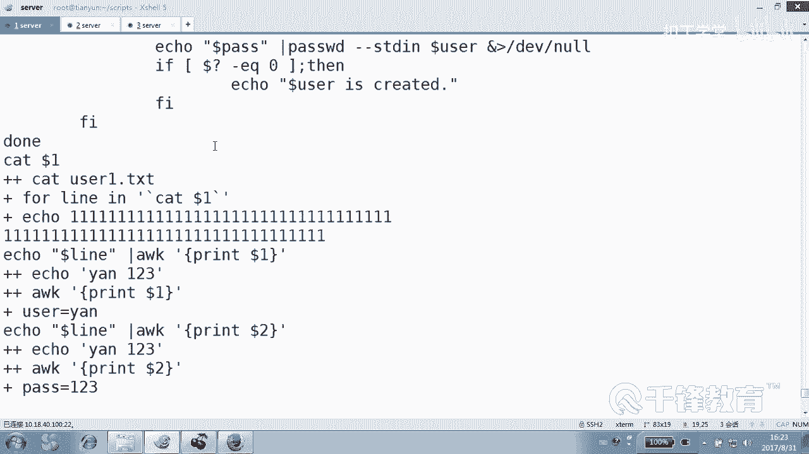

两个，因为这个文件里面。user1点TST。它纵然是有空格，其实还有我们最要是有空行，几个空行，一个、2个、3个。但是在forour看来。😊，就两个便当纸。哎，怎么情况下，for看是四个变量。

四个变量值，什么情况？😊，不是不是，就现在就现在就现在不改变的话，这个不改变的话，什么情况会是四个空四个那个变量值？哎，就是按什么分割，按空格或table键分割的话，好吧，如果只是按什么分割。

按回车分割的话呢。😊，那当然前提是我们需要去修改那个分割符是吧？这就可以了。现在看来呢，它是两个值，明白了吗？这是for循环的一个特点，它对空格是不感冒的，不不不是对空格，是对什么空行它是不感冒的。

空行在他看来就是一个空格，相对空着的一样，它不会去碰它。所以你不要去什么，你也不要去碰它。😊，明白吗？好，这就是在f里面，空行为什么不会影响我们的。秘密O。

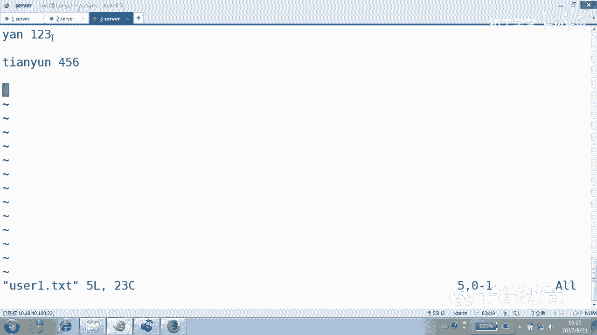