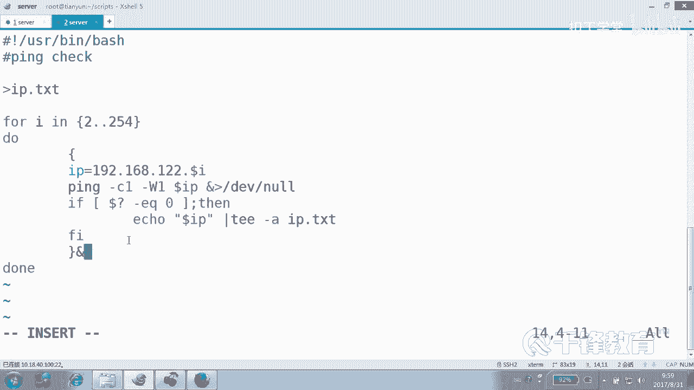
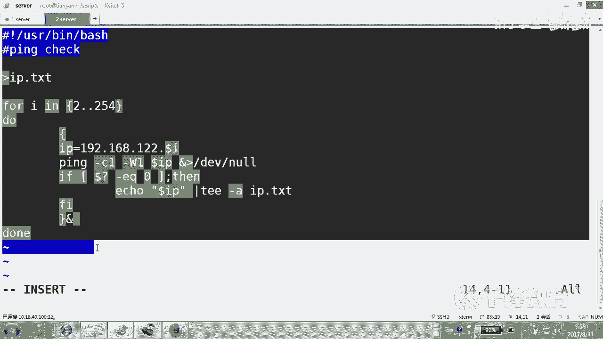
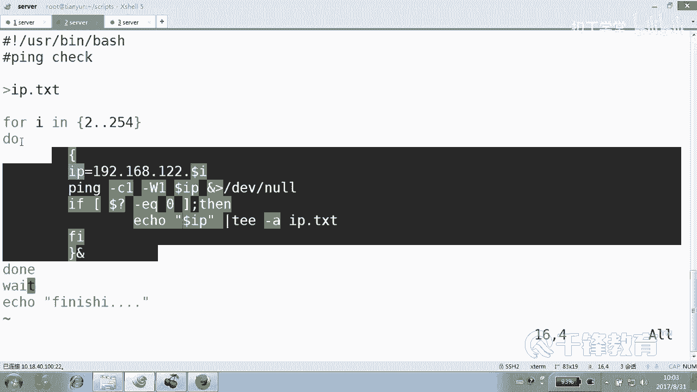
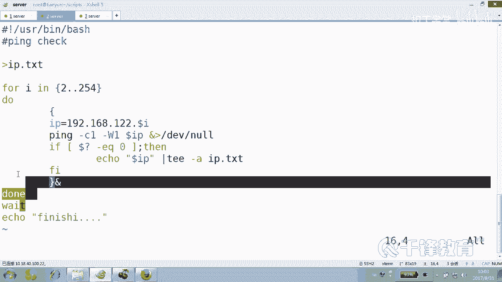
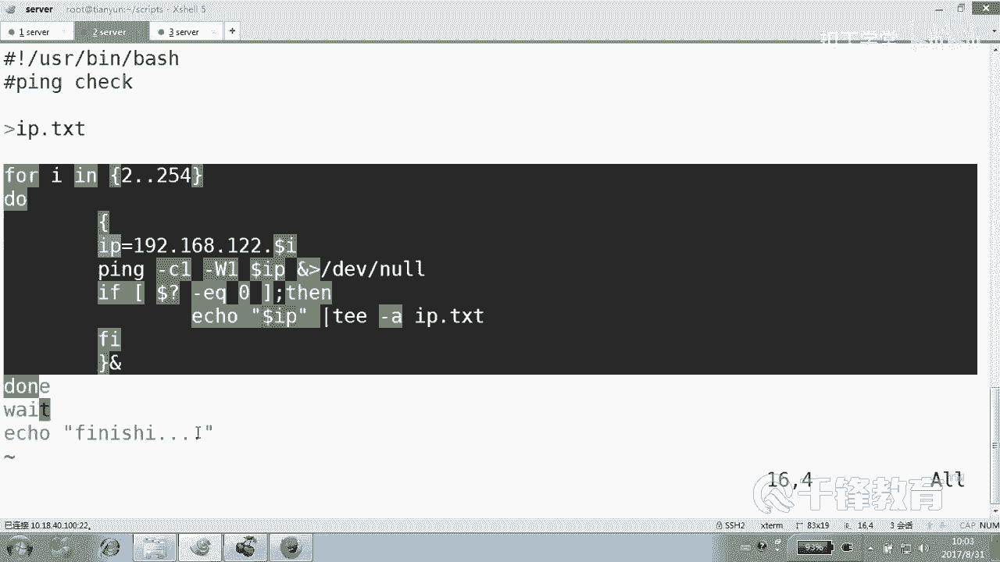
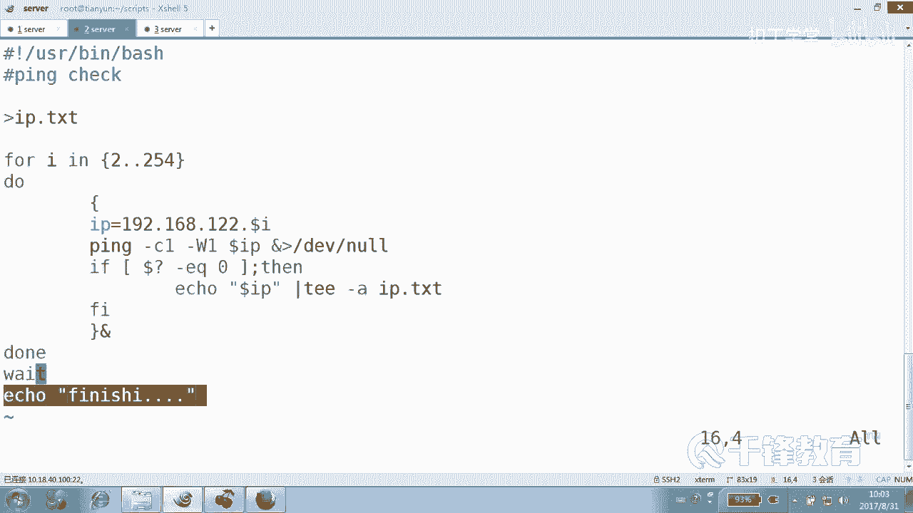
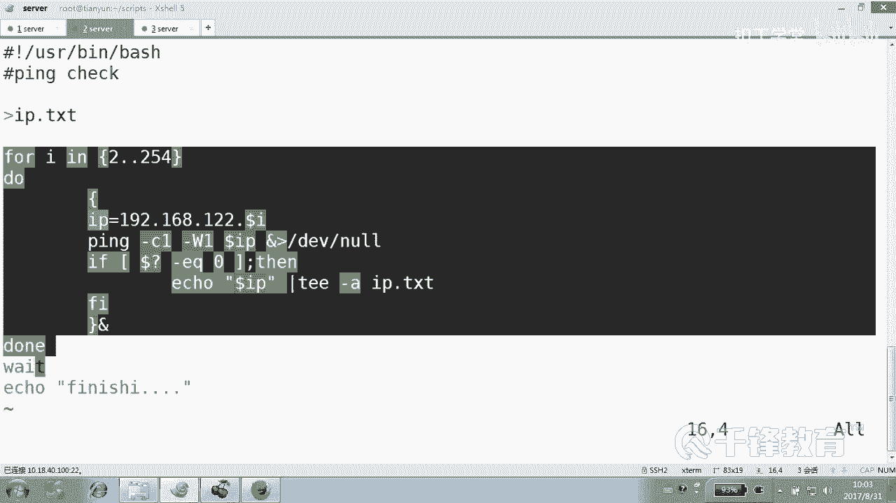
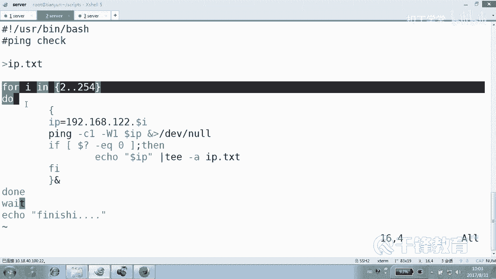
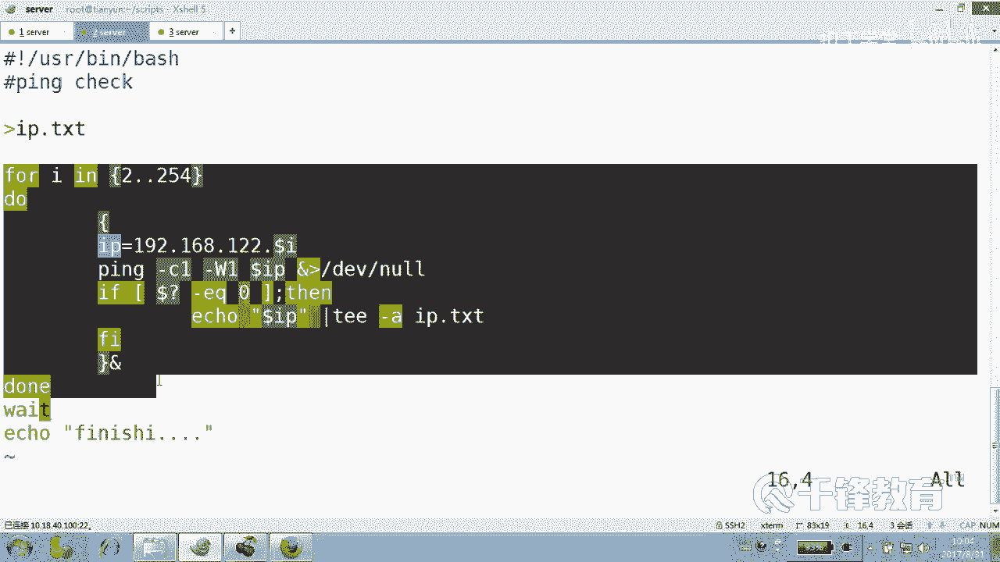
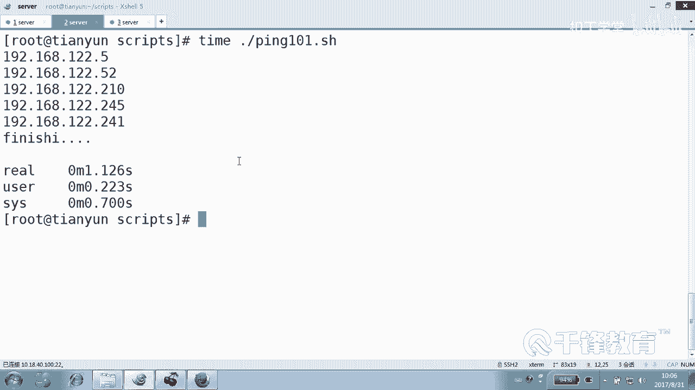

# 千锋扣丁学堂Linux云计算系列：Shell脚本自动化编程实战视频教程 - P23：4.6 for 实现批量主机ping探测 - 扣丁学堂 - BV1SE411q7vK

好，欢迎各位再次回到课堂。呃，那么我们下面呢来带大家了解的是。😊，循环一句。在之前我们给大家说过一件事情，在一开始讲那个linux基础的时候。我们说。创建100个账号。那你要写脚本的话呢。

你要是不使用循环的话，会怎么样？😡，那你就写user and写100次是吧？这是很痛苦的。但如果使用循环的话呢，我们可以定义循环的数数量次数，是不是？然后它就会帮我们去执行，就是执行的每次执行的东西是。

其实每次做的事情是一样的，但是怎么不一样呢？😡，变量看到吗？你的变量是在变，所以可以不一样，对不对？😊，那说到循环的话，这里呢在lateux里面在 shellll里面的循环呢有4种，主要有4种。

一个是for循环，一个是well循环。还有一个是。unil循环。那另外还有一个叫slack的循环。那个用的比较少，所以我们呢就没有特别去讲到它。但是后面给大家提一下。😊，当然这里面呢。

其中又以for循环使用最多。那么我们将循环主要归为归为两类，一例叫做。固定循环次数的就是非常明确的是什么？循环次数是什么？😊，是固定的。那另外一类是什么？😡，循望次数是不固定的。当然说这个不固定。

其实呢我们不能这么硬生生的去分。有人可能会说老师是不是使well循环就是不固定的呢？😊，是不是使unt循环是不固定的呢？答案是不对的。我们只能说哇这种循环。他可以。写出什么固定循环次数的，也可以写出。

不固定。他有那个能力，好吧，所以照这么看，Y还是是很高级的啊。😊，那先来认识一下for循环。😊，说for循环了。我们。😊，从这儿开始。大家还曾记得我们曾经讲过的pin吧。😊。

要不索性我们再来写一次pin，我们从100开始，我们首重新重新来写一次。那这个平啊。我们之前拼的都是一台主机是吧？几号叹号USI并下的。但是。这个是拼。拼测试。好，然后呢。我们当时写的时候这样写的。

先用来拼一个主机是吧？😊，但是最好还是给个变量，什么变量。IP是。192168点多少？第二点。12。2吧。好，这边我我顺手把这几台虚拟机都给它开起来，好吗？然后把他们都开起来啊。

当然你可以准备也可以准备那个3到5台虚拟金啊，这边其实开起来了，再开的再开吧。我现在有5台5台机器是吧？好，我现在听一个二，然后。😊，这怎么拼一起来看一下拼音杠C1。然后dollarIP。

其实这边呢我我比较习惯有一个选项跟大家说一下慢P看下慢一下P啊，都仔细看有一个。😊，W叫什么？t mode超时时间对不对？所以我一般比较习惯的在上面加一个W。比如0。1秒钟或者一秒钟超时。

这个为什么要这么做？😡，因为有时拼不通啊。屏幕通是不是卡了的，感觉。😡，好吧，那我就这么做了，拼的过程不要，这个大家都应该是有。😊，印象吧。然后紧接着干嘛，一个标准的衣服，这个地方用不了case啊。😊。

因为也没有那么多可判的，就就内心就很简单，要么是通，要么是不通，没有什么。😡，不像那个什么不像那个字符串说还有好多种可能性没有。所以这个地方用不了case。好吧，如果怎么着，到时问号EQ等于0。

这是我们是按什么判断的？数值还是字符串？😊，够了是不是好，如果通怎么办？Ile。说do。IP is。U。明白。或者干脆就写个dotaIP也可以。好，问一个小问题啊。😊，我现在。如果想把它既显示在屏幕上。

同时也搞到一个文件里面去，应该怎么做？对，没错。有同学说TE杠A追加是吧，到哪去呢？IP点TS里面去。明白吗？各位。好，当然这是一个可选项。这个作用是什么？你拼了半天，你得知道哪些主机通了吧。

你不能只是用眼睛看一下，你可能还要。😊，拿到一个实实在在的一个清单是吧？有同学说老师，你这是不是多此一举啊，拼一个主机有什么好看清单的？嗯，不是为现在做准备的，一会儿可能会要用，明白。😊。

各位看一下现在一个主机拼的过程，是不是这这这这这这几行够不够。😊，好像够了吧，试一下。change mode A加X平100。平100。这照药不通。大家还是很快看到了吗？因为我超时了。明白。😊，啊。

这个没问题啊，我应该有1个241，我记得是吧，有吗？😊，或者至少有个52。yes，很快帅气，朋友们。😊，就是这个循环什么关系呢？循环。😡，大家知道。成功啊其实就是什么？把对的事情什么。天天做。

就这件事情做多次是不是成功了？😡，好了，看一下我们请上我们的。😊，大脑for循环。破看到了吗？循环的整个，然后它是这样的，for后面跟上一个变量。因为各位你要循环100次。

不能每次都批52吧啊都都没进呢。😊，那怎么让拼的数字不一样呢？那我们就。使用一个变量来控制它是不是看清楚哦，你看这个演变过程其实非常的清晰啊。你你注意看变量变量名叫什么呢？叫I也行，叫J也行。

叫IP也成，是不是我们叫I吧E。😊，这个变量的值，我们以前定义变量的时候是不是有变量名变量值啊，这个变量值吗？注意这里定义的就不是一个值，是什么？好多值，因为循环不是一次啊。好，多个值怎么做呢？😊。

一比方说2到254，那为什么走二走呢？嗯，因为我的一是我的真机，看到吗？我的这个物理机是不想我不想拼的那就二开始好不好？😊，那这个变量。变量是不是会复制为解？第一次是2，第二次是3，第三次是4。

第四次是5，看了吗？循环一共是253次。明白，它也是一个变量的赋值嘛，这个变量的作用我们就是想让它控制。😊，然后紧接着这里面是什么？度这是什么？先站远一点，免得健身血。好。

有同学说老师这个循环现在循环多少次？😊，25344是吧，没问题，但是循环每次批52是不是挺不要脸的，应该批多少？😊，嗯，没错，把这儿换一下，一切大功告成。dollar哎我改过什么了吗？😡。

我什么都没有改过。啊，第一次你看循环第一次循环的时候拼的是。😊，点2第二循环的是拼N什么点3。😡，能懂能听懂吗？各位。所以完全你看都几乎没有做任何改变，就是成功了，就是把对的事情。

天天做做多次对的事情就可以了。那么我们做200多次。😊，就成了，明白了吗？当然按照按照中国人的礼仪啊，这个我们是要缩进的。因为来了新的老大，你应该。😊，把你的办公室腾出来。走走走走走。是吧当然了。

你要跟老大接近一点的话，你也就把这个删除，显得特别的。😊，平易近人是吧，或者说能够容易这种与人相处。好了，这就是一个循环了。😊，这个循环有人说看不懂吗？😡，我估计不可能有人看不懂。😡。

因为这里面的语句是我们讲过的。是吧。这外面循环呢无非就是一个变量的负值嘛。😡，询问多少次？第一次。I的值付给把二付给什么？I这个变量I是个变量，这个变量是我们自己。😊，随便拿过来一个人定义的，对不对？

然后循环254次。有同学说这个大括号看不懂，不可能，对不对？大括号是不是前面讲的，你要大括号看不懂，送你一个东西，就是什么？😊，有两种方法可以产生序列，一种是SEQ2到什么254是不是也可以啊。

它是不是一样产生一个序列啊？啊，但是你要觉得哪种直观一点呢？😡，我觉得好像还是那个叫。😊，那个叫什么来着？那个。这个好像看起来。我觉得比较直观一点吧。这个个人参照个人的这个感觉走吧。明白。好，那方面吗？

但现在呢也会遇到一些问题呢，我们先不要说，我们先来看看。好的，注意有一个问题。对，有人说时间太长了，没关系啊，没关系哎。😊，就我说这个杠A是干嘛？😊。

那原来的IP还那些可能已经死过好几轮的IP是不是还在啊，那怎么办呢？😊，替换行吗？😡，那可不行，TY的话，每次循环是不是就把上一次干掉了？😊，在前面先把来之前，先把战场先清理一下。你别告诉我看不懂。😡。

看不懂的话，我去学前面课。😊，重立像的看不懂。😡，所以我跟你说，脚本不是一般人能学的，语法，简单至极都没有语法。对一个搞过java C来讲的话，它这什么玩意儿，这这这哪有语法，我也没看出来有什么语法。

😊，他就是没有鱼的，但是呢这东西你要拦住你，这也会拦住你。😊，这些呢也会拦住你，还有这些，甚至这些会拦住你，还有这些会拦住你看到吗？😊，你要是没有前面指识的话，这都会拦住你。喂。好，那我就结走了呗。好。

各位啊，是这样的，现在我们来开始。😊，给给权限了吧，幸100。慢慢慢慢慢。唉，这有点慢啊，好像。那卡住C可以吗？不可以ctl C不是不可以，ctrl C是可以的。😊，你可能会终止某一次循环。

但是他有下一次开始了呀。😊，ctrl C它现在正在拼6，你可ctrl C，它会他会干嘛？均七能明了吗？对，尴尬了。现在。😊，很尴尬呀。挂到后台也可以，但是我就是想要快。😊，你。对。

所以呢现在我只能够关关掉了。现在。😊，LC不行，输了。稍后呢一直。看谁啊。那应应该不行。你们说自己身不。来看一下现在呢。😊，我们这个P100。是这样个效果吧。来拷py一下拼音，拷py一下什么。

拼100靠背证拼。101吧，别别老无限无限的往后涨啊。😊，行吗？来怎么做呢？这个事情其实在前面讲过。😊，我们有一个很特殊的一个东西叫做。对，我们可以把整个循环放到一个。大括号当中去。并且放到后台。

为什么这么做？因为原来啊它是这样，比要正在拼拼拼3，这个没有继续的话，是不是就不会往后走啊？😊，是完成一次循环才为什么？走下一次。好，有同学问我说，这还是没明白什么意思。😊，你们还记得吗？😡。

如果这个这个是这个程序在执行的时候，是不是会打开excel？

那他执行的时候呢，是在那个社的当前设有，还是在子校里面执行？😊，不不不不，我说的是这个主这个大程序，它是打开了一个子校，对吧？我们假如说这个shall叫叫A这个笑名字啊，我们想想了个名字啊，叫A。

那它里面这段代码。😊，在没有加大括号之前，适合在在同一个事里面执行吗？是的，所以同一个效执行我们大家都很很清楚。就像像什么像不是con塞不了，像sleep4000的时候。😊，那你不能干别的事啊。😡。

明白吗？那你只能够等待它结束以后才能干别的事啊。唯一的方法就是放到后台执行。没错，那怎么做呢？放到后台，把整个循环体放到后台。😊，明白。放到后台以后。这数不是就快了？看着啊。哦，我别的没有加。

我就加了一个什么。😡，后台请仔细看。哎，都看了吗？101。😊，哎哎哎。注意。好像。格式上有点乱糟糟的。而且完了没完了，我还不知道。😡，你看我也不知道玩没有，其实应该早就完了，其实瞬间就完成了。

但是我不知道。😡，所以呢。换句话说，你看啊我们在后面加一个什么。😊，Flish。当当当这能看懂吗？然后你注意看哦，抖。哎呦。怎么非得是出来的，跑的比谁都快啊，好像。😡，啊，这个他出来的这么早，好像。😮。

不合适吧，为什么？因为前面的事儿都没做完，后面的事情有很多很多那个代码，可能是对前面的那个结果是有依赖的，明白吗？你都没做完，你让我起来不合适是吧？😊，能懂吗各位？所以我们有理由相信。

或者我们心里面其实都有一个想法。😊，就是什么。我结束以后，你再什么再上。那怎么做呢？一个非常简单动作，wait。这个wat不是C里面的这个wa函数，是我们这一条wat命。好吧。

但是呢功能上和那个wat函数的功能我认为是一致的，都是干嘛的，等待等谁。😊，等你。听好了。不是等上面的。应该再加一个准确的一个限定词，就是等待他前面的所有的后台进程结束。只等后台竞争。

你要是不加这个符号，那前台可没有用，好吧，这是后台符吧。这是把整个放到一个后台里面去。wait听好了，干嘛的，再说一遍。😊，等待所有的什么。

等待这个shall当中的所有的在他前面的所有的什么后台进程结束。那也就是说我一旦把这个脚本写成这种样子。😊，明白。那么它会怎么循循怎么循环？上来以后是不是开始变成这是点点几点二吧。

咵把这个拼动作放到哪去？😊，后台，那有没有批完呢？不管，然后紧接着说P3又放到后台，后台后台，后台连续放到后台是不是很多，相当于是不是全甩到后台去了。但是甩到后台去以后一定会结束吗？😊。

一定马上就结束了吗？因为如果不加这个w，你知道会怎么样吗？只要那那么我们知道只要这个循环254次一完。😊。

从代码的层面上，这个循环就是什么？😡，结束了，那么是不是他上场按理讲无可厚非？

但是我们很清楚，其实。

只是说代码运行结束了，但是并没有。真正的结束有可能是不是这样子，所以我们觉得这边应该等待。

能听懂吗？各位为什么加wat给你论证了一下，一旦254个循环。😊。

一旦往后台一甩。这个代码一执行。他是不是应该往程序往后再继续走了？但实际上，此时此刻。有可能有一些屁。还没有结束。所以一个非常简单的动作就是wait等待前面的所有什么后台进程结束。

就是wa在这边等待它就卡在这儿了，说你们没有执行完是吗？不准过不准过不准过不准过。😡，好，这个现在才是正常效果。完了吧，你看现在拼254个主机，是不就是瞬间的一个过程啊？第一，我做了两两件事儿。一。

我帮助了他一下，就是加了个time wait。这个time with有人说定的短一点，0。1秒好吗？😡，好像你看一下。0。1秒。他可能没那么快。点一是吧。反慢注意了吗？😡，有人说是慢吗？

我们这样试一下任何脚本，任何程序在执行的时候，前面都可以加一个t来统计这次这个程序或脚本运行的所花费的时间。任何程序啊，包括IOS都可以加一个，好吧。😊，Tab。看一下对比一下啊。0三点几秒钟是吧？

好的，大家脑子里记住啊。😊，然后紧接着把这改成什么？😊，一秒钟改长了。1。12秒钟，为什么？你写的那个0。1秒不切实际，知道吗？懂吗？那你那个度人家肯定都比那个长，所以你那个超时其实是跟没写是一样的。

所以你稍微还是有点什么。😡，实际一点吧，好吧。你是你就告诉你女朋友说，你说如果我能挣到。一个一个亿，我就爱你一辈子。不切实际。你还不如说我要是能挣100万，我就爱你一辈子，是不是这还可以理解。😡。

小目标。王建林也现现在进入云计算了啊。今年的3月19号和IBM协手合作，打造云计算。啊，人家已经房地产不是他的主要的啊。嗯。对呀。好，那个各位看懂了吗？各位。😊，这是我们写的第二个拼脚本。

