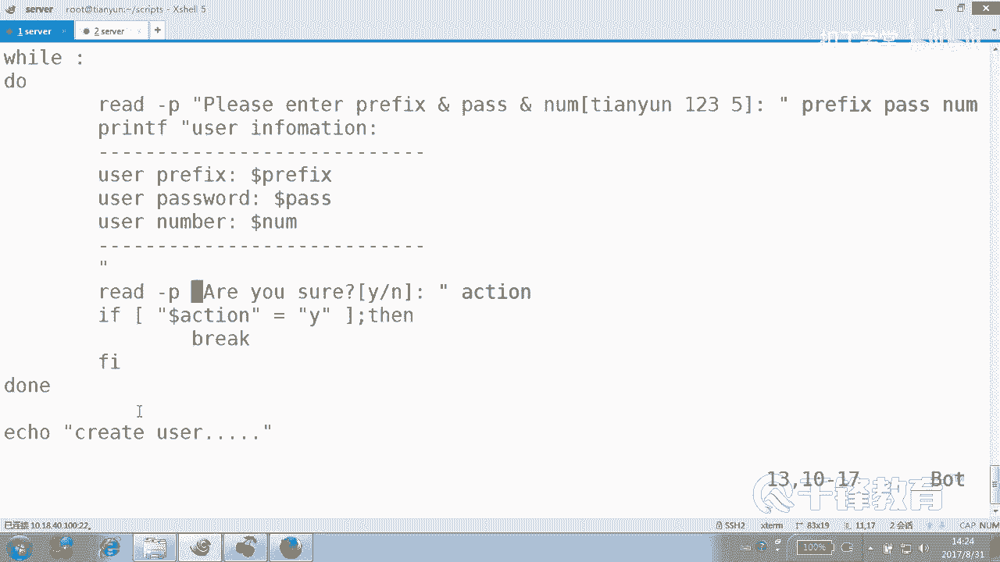
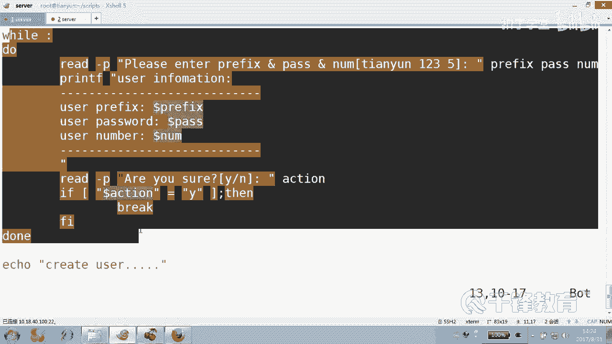
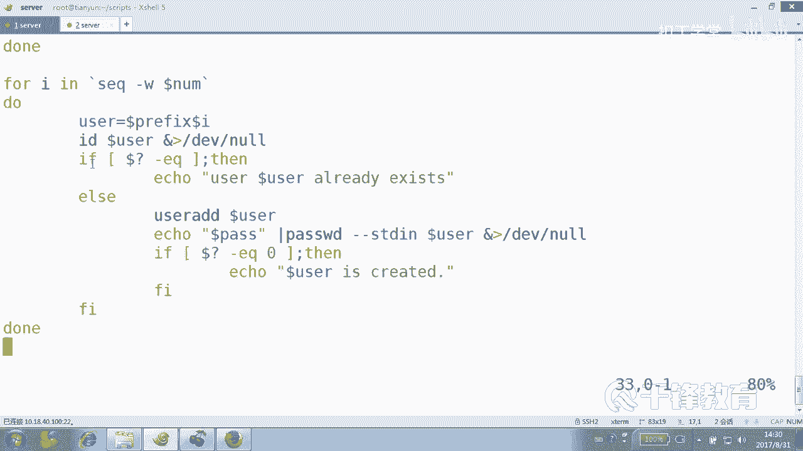
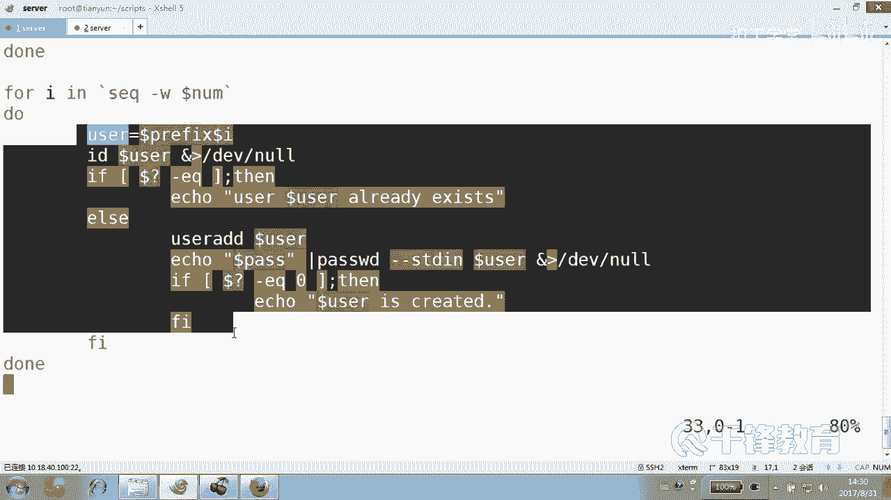
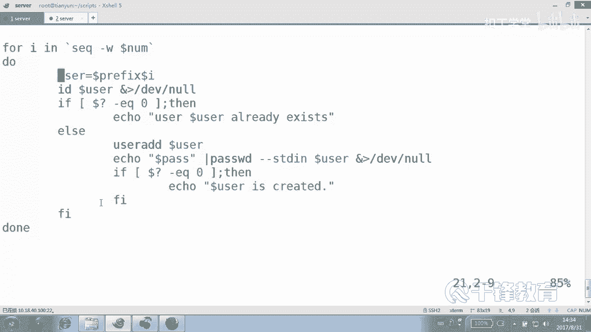
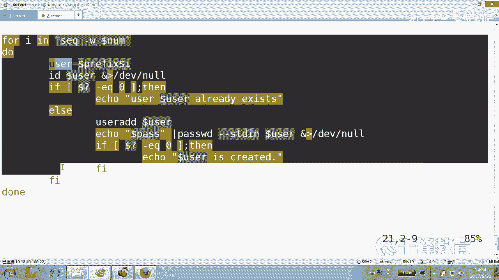
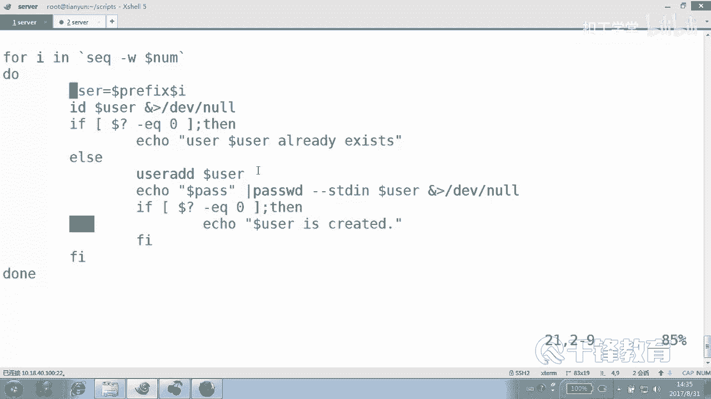

# 千锋扣丁学堂Linux云计算系列：Shell脚本自动化编程实战视频教程 - P24：4.7 for 实现批量用户创建 - 扣丁学堂 - BV1SE411q7vK

OK在前面我们讲到了怎么使用for循环。😊，呃，在这个过程当中啊。特别是那个拼多少来着？101是吧，这个脚本这个大家应该都能看懂，对不对？或循环。好，这边呢有一个地方是需要大家要注意的。

这个拼拼的是所有主机是吧？啊，应该说这个网段中的所有主机。那如果说我们要拼某些主金呢？这边呢我们来看这样做。我们要批某些主机。这边。比如说有一个叫IP点TSC的文件。

这里面有一些主机50525210245是吧，还有可能192168。12点多少？110。好，有那么六七个主机。我现在想知道这一主机是不是通的，明白意思吗？那就不像我们刚才那样，在前面那样呢。

使用一个训练是吧？2到254。😊，而是指定主机。那这怎么做？我们快速的写一下拼音。102吧，点SH。写这样一个脚本。啊，名字呢没有特别的经过加工啊。bash呃，应该准确的是USR并下的bsh是吧？好。

然后紧接着我们要拼拼什么？😊，P那个文件中所有主机大概怎么写？还是forI这个到底是I呢，还是IP呢？😊，对于可以随便。但是我们那个文件里面的每一行是不是IP啊？😊，我觉得叫IP更加。😊，确切一些。

然后inin什么？😡，Yeah， yeah。对，当然我我没有给大家写那个最傻的那种forfor循环啊，就是这种的看forourIEABCDE do。😊。

然后icle到那什么I down打印一下ABCDE这个这挺傻的这种的，我们没打算写，我只是跟你说一下。😊，每一个变量是不是都付给在每次循环的时候，依次会付给我们的前面的变量I这变量的值是吧？😊。

同样这边我怎么去写那个值呢？在我们前面我们是这样写的，一点点几是吧？😊，那相当于有多个变量值。那现在我们怎么写呢？😊，把那个文件给cut出来，看到吗？明白。但是这样写是肯定不对的。😡，你这样写的话。

他认为把cat付给IP，把这个付给IP我们要执行这条命令吧。😊，反引号或者是那个。大家都是小括号的形式，do down明白了吗？然后去干嘛拼杠C一，我们习惯加这个好吗？😊，然后拼谁呀。

dollarIP然后将整个。拼过程当中产生的任何消息做一个重连项。if。Ffi。好，这边呢我们倒了问号EQ等于0。然后怎么着？ele说这个主机。Is up。否则。icle主机is down。

这个是不是都没问题啊？好，也就是我们拼的主机并不是从1到254这样一个范围，对吧？而是来自于某一个文件，或者说我们要我们这一次循环要操作的呢。要操作的主操作的这个对象是来自于文件当中的这个整个的内容。

那我们就把这个文件内容给。打印出来给cut出来，明白吗？好，这个结果我们来试一下。😊，拼102。P102。对吧说哪些主机是当，哪主机是up吧。😊，明们能归。好。

这是呢这个我们如何从文件里面去获得我们要循环的这样一个变量值。而这个文件里面的所有主机，那比如说我要对文件里面的这些主机干个什么事情，那我们就可以呢使用它。😊，这种方式ca出来去做。看得出来啊。

那注意这里是一个。😊，命令替换吧。那你面归。好。这个大家要会啊，其实接下来的例子呢和这个例子很相似，就是创建账号。这个创建账号的命令我们在前面也讲过不是命令啊，这个循环是吧？我现在也忘了是哪个。

我们索性再写一次user从100开始吧，100点SH好吧，叫用户。😊，然后ADD吧，或者叫create。create user吧。好，叫create user100这样一个文件。批量创业账号。

我们同样使用for循环。负循环，我们先按照。😊，我们刚才在讲那个for的时呃，在讲那个呃pin的时候，用了两种模式，一种是我们给定了一个训练是吧？是不是从1到254这样的训练。另外一个是呢。

我们给定的是来自于什么文件中的主机。😊，O。😊，现在我们也一样，我们使用这个create user来创建这个账号呢，我们同样采用两种方式，一种是。😊，给定一个什么一个训练。另外一种是。来自于文件。没错。

那么给定一个序练要注意。我们创建账号的时候。我们肯定要用户输入一个。输入一个前缀，甚至是呢。要输入什么用户的一个。创建的数量吧。😡，这个东西肯定不能无限制的往下创建。我们可能希望用户能够提供什么。😊。

前缀还有呢。密码甚至还有laumber，还有它的这个数量是吧？好呃，用什么？我们首先用read吧。去读入一个。去读入一个内容。好。当然按按理讲，应该输入不叫input，应该叫。enter是吧。

输入键入输入什么呢？输入前缀perfi。并且输入。用户的。pass word。这是提示消息啊，还有输入用户的什么？😡，laumber就刷你多少个？然后我们分别给它复制给变量perfi。pass。呃。

你不能写的，最好不要写的和那个叫什么一样，和mining一样是吧？这个有问题，你要命令稍微做一个区分，然后number好。😊，这种东这种东西我们能看懂吗？😡，就是一下读读几个。😡，用为什么输？

输三个这个。出三个那个值。变量的值分别依次付给什么？😡，你要不要给用户一个提示啊？😡，提示的话就是。像这样给个提示，表示叫天云。然后空格密码是123，创建多少个5个。对你要不要给用户提示，你自己看吧。

好吧，我们再线给用户一个提示，好吧，我怕他输错了，而且顺序也必须按照这个来，明白吗？😊，紧接着怎么做？😊，紧接着是不是该创建了？😊，但是呢有时候我们建议大家可以这样做，你让用户。

还是先确认一下他输的信息是哪些。能听懂吗？并且问一问一下用户，你真的。😊，确认是这个信息吗？他没准还想重输一次呢。😡，好吧，他有可能输错了，手一快输错了。好，那我们先把用户，那怎么让用户确认？😊。

是不是先把用户的这个信息给他打印一下，说哥们儿，你输的就是。😊，这个这个这个你真的要这么干吗？还是要。😡，重新输入。能听懂吗，各位。怎么做？打印用什么？😡，我们一直以来用的是icical。

那也该换一个了吧。print F。😊，我们打印一个注意这个引号user information。然后比如说。哪个变量？用户的perfi是什么dollar。Perfect。用户的。什么。

pas word是dollar。dollarpa是吧？用户的。创建的。number是dar number。好，注意你觉得还少一个什么？这里面。😊，少个引号吧。好，这个引号这整个从这儿开始到这儿结束。

都是我们pro打印的信息，看到了吗？以前我们打印用什么打印？😊，用ecle或者用cad是吧？我们同样可以使用。print F键printF这样一个关键这样一个叫什么关键字，还是叫。😊，呃。

叫类置命令对吧？sell的一个类置命令building内置命令。好。现在就是先打印出来打印出来，我们试一下，好吧，我们尝试一下sMODA加X。当然今天这个主旨是讲循环啊，别的都是为了配合它的，请输入。

😊，这个叫什么用户的名字啊什么的，我们叫杨，密码是1111，数量是5个。好，打印出来了吗？说用户的信息是。哎，又少了东西啊。这怎么少两个？少前缀。前就没没没有复值是吧，感觉。😊，やほ。哦，PF。

这个应该没问题了吧，没有pass wordpass是这个就是pass变量这个嗯。😊，这儿。这只是提示消息。你想你如果写全，这要写全的话，就会导致和min令冲突，知道吗？很可能会冲突。

所以不要这个地方尽量和我们的min令还是有一个区分。紧接着怎么做？如果是你的话，你该怎么做？😡，你看先问用户，不是先让用户这个输入，然后给用户显示一下，说你输的信息是这些are you孙。

你真的要确认吗？😊，啊。那怎么确认还记得吗？怎么确认？😡，确认的方法就一种。😡，我们讲过就一种就是。你真的要继续吗？好，我们给动作action。你真的要确认吗？对不对？

是不是读入一个变量变量值付给action。😊，然后判断如果不是什么。如果dollar问号呃不是do问号，dollar这个双引号引起来dollar action。不等于什么？Y。然后怎么办？那就退出。哦。

咱们现在想的没那么复杂啊，创建用户还是一伙儿的事儿，你你得先确认是这些信息，我们的创建码。😡，要不是这个信息那，我们就先等一等。😊，能听明吗？各位。这这有没有有没有疑义？这一段。😡，我知道你们怎么想的。

你们是不是想输错了，还给一次机会啊。😊，那就不应该这么写。😡，那我们先试一下好好吗？怎么做？好，我们假如说在最后打一句话说正在。😊，创建user。啊，正在创建当当当当当当来。

我们示范性的看一下create user。😊，输入羊123456创建5个。是这些吗？是的话，Y创建用户吧。再来试一次。杨1235个。No。😡，就不创建。好，只要说的不是Y，是不就。我这边只要不室外。

然后肯定就有退出，明白吗？我知道你们想的是。😊，这个应该应该给人家机会，就是输到直到输到死为止是吧？那怎么做？还我还讲过讲过，你们记得吗？😡，就怎样让用户一定的输成功再走。那就是循环。

但是得有一个条件跳出循环。在什么情况下跳出循环，告诉我在输入为什么为Y就怎么跳出break，看到吗？来，这个事情呢，其实大家都很清楚，你看在哪儿说在这儿吧。😊，w什么。你们喜欢猫还是喜畜啊？😡，啊。

个个个人口味不一样，没办法。在最后加一个什么是在最后加加当，还是在这儿加档？😊，在这儿是在这后面是吗？😡，那跟人家没关系啊，是不是在这儿？😡，好，那现在我要把这段稍微什么。😊，缩进一下。

不过缩完以后可能就不好看了。少几个字母都没关系吧。😊，好，各位觉得我现在写的对吗？😊，嗯，对吧？各位。😊，好，循环先执行冒号为真吗？😊，执接包号以后返回指示针吗？😡，是真，所以呢循环。

看w我们讲讲了用了好几次了哈，还没讲到w啊，然后请输一个东西，输完以后打印一下，你真的要继续吗？😊，如果不等于Y推出啊，现在我们不打算退出了，而是什么？😊，而。而是等于Y。跳出。那是不能歪了。😡。

就回到了上面，再输，直到输的是Ybreak走下面这段来。能想通吗？这其实没有那么复杂，整个的还是挺简单的。我们脑子里面想啊，只要输的室外，我们肯定搞一个所谓的死循环是吧？但是这个死循环是有退出的条件的。

😊，我说的不是退出程序，循环结束，只能说证明你干嘛。循环结束只能证明你输的东西。什么。输东西是不是已经达到你自己满意的了，然后你再循环结束，然后我们跳出去干该干嘛？按照你刚才的那个变量的定义。

我们是不是创建用户啊？😊，好，各位都能看懂吗？😊，都能看懂吗？这一段听好了，这一段。😊，在很多地方都会用得上，就是给用户一个确认，让用户做一个确认，明白吗？好的，来我们试一试。😊，执行输入羊。

我假如说不小心输快了，输了个羊，然后1235个用户一看。什么。这是我们要的吗？😡，不是漏。接着来吧。羊。优啊不是优，然后123几个用户啊，5个用户是你要的吗？Y穿越用户看到吗？

否则的话是始终不会让你创建用户的。有同学可能觉得前面是不是有一些这个这个叫什么符？😊，呃，是空格吧，那没办法，因为。因为我们确实在这里面用到了。黑宝剑在这是吧？除非你把它们摆到前面去。

print就是这样一个一个东西。好，关于这一段有没有能不能看懂？😊，那阶段我们现在跟循环还没有关系，循环就此准备开始。😊，我们没有打算把那个循环写到这个w里面，没打算这么干，而是跳出循环以后干嘛？

你确实可以输对了，然后紧接着干嘛，是不是在这儿创建用户，是不是可以这样做？😊，没说对呢，接着再输。但是我们就是你有两种选择，一种是把用户这个创建行为放放在哪儿。放在。这里面吧。一种是呢我就放到外面。

我比较习惯放在外面，我就我想的是w这个循环在此只是帮我做了一件事，什么事情？😊。

你帮我最终确认用户输的那个东西是他想追终想要的那个东西，然后输对了，我们走，说不对呢，那怎么不走好吧？对，输对了，我们break说不对，继续。😊，好，现在呢我们怎么做？😊，4our。爱。是不是然后E。

嗯怎么弄啊，从哪儿到哪儿啊？😮，用户有没有输有没有输入最终的那个用户数量有没有有吧？好，那能这么写吗？一点点。😊，到了什么蓝宝可不可以？😡，这个我记住了，不可以，这个我讲过。我当时还创建过一个文件。

在这里面不支持变量，还记得吗？为此，我们请了一位高手就是。😊，SEQ sequence当时还讲过十，明白吗？但是我我这里想提醒各位。不是，这是min令嘛，只要是min令都要加反译号。😊。

你们是更喜欢这种还是那种？😡，这叫等位补齐。等位补齐10000100几。一千就是和最长的那个宝宝保持什么？千100不是三位吗？那也保持三位三位三位，哪怕一个一也保持001，你们喜欢哪种？😊，呃。

既友面试的问这个不要脸的问题，说怎样才能让用户假如说你创建10个用户，怎么让第一个用户是01呢？第二个用户是02，这样的就是一样长呢。😊，你知道以前好多人怎么回答吗？他说先判断一下。

如果这个数字小于9啊小于10。😊，手动就给他加个0。然后如果呢。反正挺麻烦的哈，那有这个是什么功能，叫等位补齐。😊，等位我说这字能听清楚吗？好。

那我们是不是反引哈SEQ杠W多少dollar number？😊，除非你不希望这个等位补齐。😡，好，各位那上来就创业用户吗？😊，先看眼。呃，现在有没有等等一下，先定一个变量。

叫user或者叫user name。😊，叫us点吧，是谁呢？doar。😊，perfi加doar什吗？Number。挨了是吧哎这次循环是几就是几吧，是吧哎呀。😡，然后紧接着有同学说，没错。

是不是先应该看看用户。😊，在不在？怎么看用户在不在？😡，然后呢，有事儿可能会报错哟。😊，然后如果你看你看下面的语法都报错了哈，赶快把这个尾巴。😊，给他补上看。如果EQ等于0说明什么？说明什么？

用户是不已经存在？user谁？buuser存在，否则。在干嘛？这个用户存在要不要不要打印一下，要打印是吧？😡，不打印打印，否则的话怎么做user AD用户什么dollar user能看懂吗？

有些人比较习惯在脚本里面使用路径，像这样。😊，这样写，但你你觉得你能看懂吗？😡，一样吧是吧？好好，创建用户谁，他紧接着怎么给密码？😊，Ile一个。

dollar pass管道给什么pass word杠杠standing，然后dollar user注意给密码的时候，好像会好像会那个干嘛。提示，那我们就给他拉圾桶里面去。好，给密码。

给完以后一定一定成功吗？😊，是不是还可以再加一个if服？这东西不是一下写出来的。如果。😊，到了问号EQ等于什么？0我们显示。Dollar user is credit。好了，收工了。

有同人说这写的有点有点麻烦啊。😊，你可以可以简单呀。所以衣服这种东西我们在前面都讲过，随时都可以看到它的身影吧，各种判断。😊，能看懂吗？你要说不熟悉没关系，不熟悉的话，我们可以慢慢来，对吧？😊。

你要说老师我自己好像写不出来，没关系，你照着套也行。😡，对吧一开始要求的是你能够理解，然后就是能够读懂，好吧，然后呢能够临摹就能够照着去套出来。😊，套套的时候能够稍微改动一下，最后就是自己写。😊。

最后就是根据各种需求，然后你脑子那边都想说啊，我应该怎么实现。😊，然后最后就是达到需求给根据需求去写的这样一个效果就可以了。明白吗？我觉得没有那个神人能够直接像这样一行一行往下走。

而且能预料到哪个地方怎么样的，肯定是先把这个结构先写外外层。😊。

然后我们知道这里面的主体是干嘛，建用户吧。然后第一个变的以后，先呢他的用户是否存在，如果存在，那咱们就我写错了，你明告诉我一声，好吧。😊。

写错了，别人告诉我一声，你们这。是干什么，不知道。如果问号等于0，然后那么我们就说用户存在，如果说不存在，那就开始创建用户，并且给密码。然后呢再判断是否成功，显示成功。明白，因为总有个别用户可能存在啊。

😊，那你怎么各？能不明白能明白啊，那我们检测一下语法好吗？😊，嗯，好像没问题。你看我一次都成功了。少多几个用户吧。😡，叫。RR前缀密码是123。好吧，然后。还有什么？number10个吧。

你显示一下0102这种感觉好吗？要不在创业之前，我刻意把一个叫做。😊，RR05的用04用户创建好，好吧。是不是这意思？我可以这么做的啊。😊，RR123，然后是10。这要这么做吗？啊，是的。有是不是？

R201创建R202创建03创建04创建04存在。然后如果再敲一遍的话呢，这都会保存在，明白吗？那你懂么各位。这个都能看懂吧？好，这就是这个脚本，我们再来看一眼。当然这个脚本是有问题的。

我们要一会儿来发现这个问题。😊，上面一共两段，你想过没有？你要是把整个创建用户也写到w里面去，是不是很臃肿啊，很凌乱那种感觉。😡，所以你不要想的太复杂，一个脚本一段代码，它就实现某一个单一功能。

是不是就可以了？😊，而我上面的Y循环就实现一个什么功能？😡，最终帮我确定你输入的信息是你要的那个。如果对，那就再见离开。然后完了以后呢，创建账号主体思想就是如果账号存在，就报报一个存在。

否则的话呢就创建给密码，最后还要显示还要去看一下。😊，密码成不成功，其实就是用户成不成功。然后如果有的话呢，打印说创建完成，看到了吗？这里呢一定要记住forour。度荡他们是一个级别。

那么自然这里面的东西呢是第二个级别吧，衣服也是，但是衣服里面的子句呢又是属于什么？它的下一个级别。😊，明白吗？所以我们要养成缩进的习惯。但是实际上大家知道sh就算你全部打到头。😊，都没有错，对吧？

但是那样看不懂。这样的话很难看到这个东西，而且在写if方括号hen else FI的时候，我们是先写完这一套，先写完，然后再写下一个。😊，否则一会你会你会不知道我见过一个人写的脚本里面，光这个FI啊。

😊。

就是它写在一起的，像这样写在一起的。光这个FI就这样一个、2个、3个、4个、5个、6个就将近十来个。😊。

这个真的少1个FI就很乱。我不赞成他这种写法，原因是我觉得一个if符就完成什么。😊，一个功能就可以了，你不要说把它全掏在里面去，这个想法是不太好的。😡，明白吗？你一个if从结构上。

你有时候可能会说老师那样执哪个执行快呢？不讨论这个问题，为什么sell本身执行就不快。😊，是吧这种解释性脚本本身是不是就没有C执行快啊？我们这里追求的不是快。😊，而是。结构的清晰易懂，是不是？

而且后期呢很容容易能够去对他做一些。修改。你真的想对其。真的我看别人的脚本对了十来个衣服。😡，我我想改一改，那个就有时候都不好删。😡。

好，这就是这个脚本。

