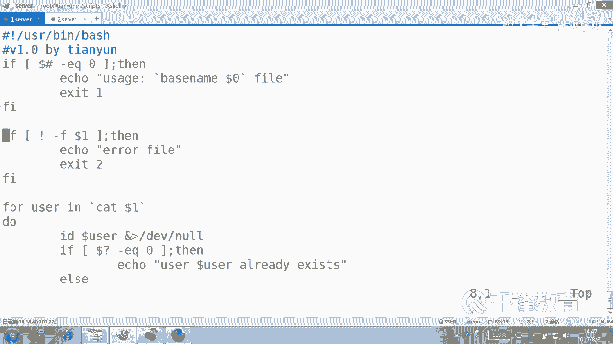
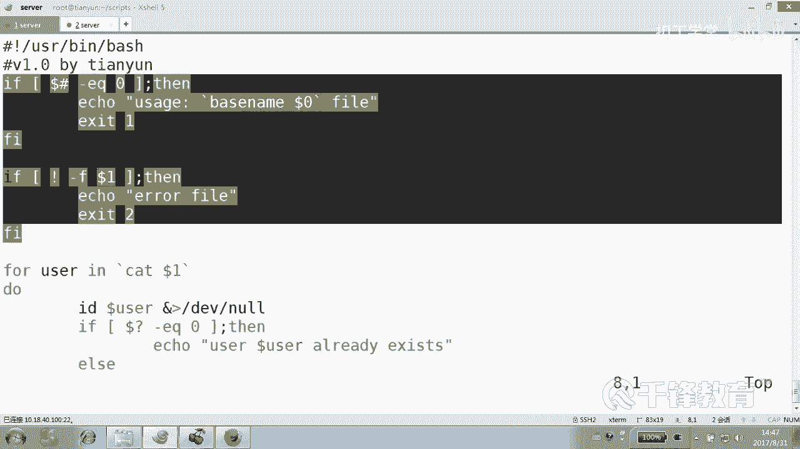
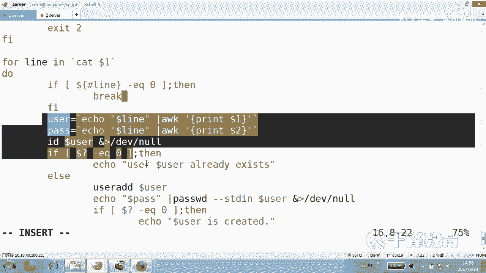
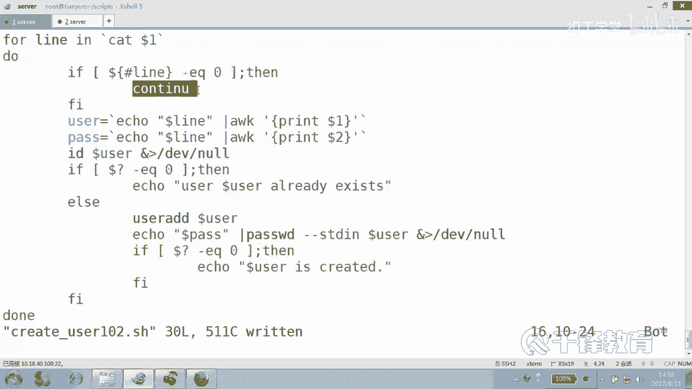
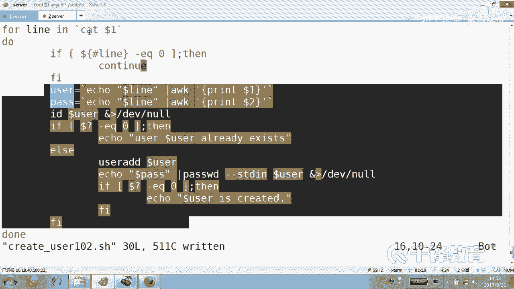
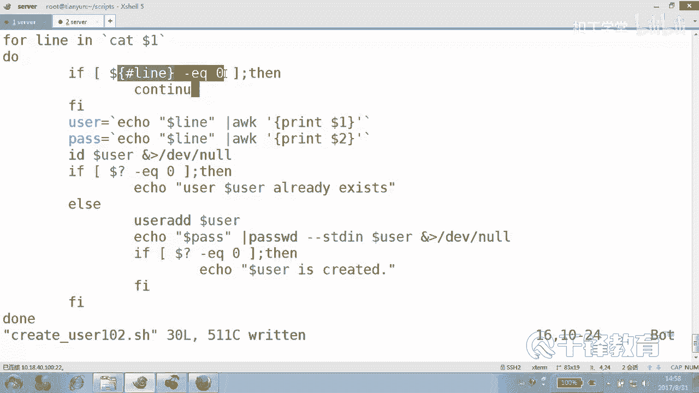
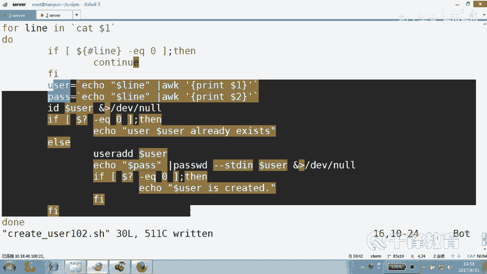
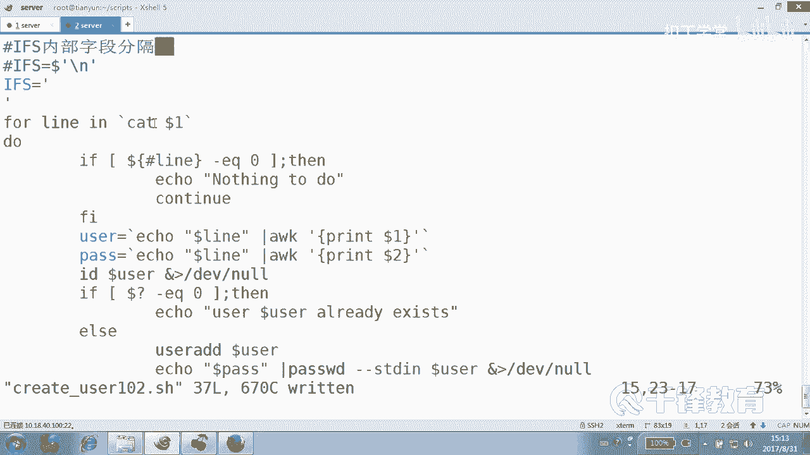

# 千锋扣丁学堂Linux云计算系列：Shell脚本自动化编程实战视频教程 - P25：4.8 for 实现文件中批量用户创建 - 扣丁学堂 - BV1SE411q7vK

好，那我们刚才在已经带大家来实现了一个批量用户创建的行为，是吧？但这里呢我们对比了一下那个拼命令。各位拼的时候我们有两种方式，一就是拼一个训练是吧？拼一个序练里面的主机，是不是？第二拼你拼什么来自于哪？

😊，来自于文件，那创建用户呢？我们刚才是来我们刚才是不是也是一个序练？😊，从几到几啊？现在呢我们也打算干嘛来自于。😊，文件。能听懂吗？各位好，这个文件呢有两种方式。😊。

看给一个文件user点TST这是我们自己命名的。😊，好，请仔细看啊，仔细看这些技巧。😊，这里面呢我们简单一点就有1个YY8，然后CC9。TT5什么的。T5吧，这不不让不让我改呢。😡，好吗？

还有甚至还有R01好，这一共有假如说有几百个用户，我们要创建一下。😊，好，这是人生中人生中最简单的一个一个啊，我们一会会复杂一点啊，会复杂一点，没事儿啊，回车喽。😊，各位全部都看到我们有这样一个文件吧。

😊，是不是对不对？好，现在来一起来，你们先可以不用写，先看我跟着我一起来来。😊，理论上写一下就可以好吗？心里面跟着写，因为你写不，因为你打字慢嘛。😊，哪哪一个脚本？C user。101点SH好吗？好的。

井号叹号USR并下的bash，然后怎么着？嗯。V1。0霸海天云。好，然然后呢。然后。然后那个文件啊。出理个文件f。限定一个文件。第一个文件行吗？有的时候它不是文件不在当前目录啊，对呀，可以不在。

所以说我说想定一这个看啊，比方说可以啊，E。😊，可以这样。Cat dollar one。能没有吗？到时都是一这个。😡，位置变量啊，当然你也可以像这样。😊，明白吗？这是写死。我们完全没必要写死嘛。

写死干什么呀，而是什么？😡，对，灵活一点。我们不要写死。Dollar一。度到。但用用户有没有可能没有输文件啊？有没有？那些事情呢交给交给谁去处理呢？😡，至少forour four这个老大说。

到我这儿肯定就是干嘛了？要开始创建了。😡，你在前面应该把一些问题解决好。应该大家还记得我们前面讲过if。😊，如果参数的个数。等于。0，那就是说怎么做。使用方法是吗？还记得这个吗？贝斯。

name吧到了什么？零是什么东西啊？后面加一个fill。是不是这样子？看不懂。看懂了吧，然后最后这个事儿就就该走了，再见了。😊，那请告诉我上面那段解决什么问题。😡，必须要输一个文件是吧？就是提示用户。

你哥们儿，你应该加上脚本，加上什么？😡，加上一个文件。加上一个文件，但也有可能他说的不是个文件，明白吗？如果说杠F什么。港F dollar one。是是文件吗？不是文件，那我们就说Io说什么？

错误的fill。然后退出来一个比较痛快的二吧，好吗？这两关你要是能迈过去。😡，我说那什么？😡，你就能够往后走了。😡，说的是不是就是文件？当然有同学说，老师不用写这段行吗？脚本又不是给又不是给傻子用的。

行。😡，好吧，那两段是为了保稍尾的，稍微什么稍微防止那种。😊，稍微有点傻的傻子用。😡，那你们需要这段吗？行行行。也是写上。没问题啊，挺好的，是吧？😡，如果他你们不会告诉我，这些都又忘了吧，这些这些内容。

😡，参数的个数，如果说你实在记不得，请参考中文。判断这个脚本是否什么有。参数。这个什么？😡，判断断是否是。对，是否是文件，你要是觉得看不懂的话，自己加个中文，反正也不要拿出去给别人说是吧？明白。

不说不就行了吗？😡，加个中文。可以吗？好，那走到这一步。😊，说明他们是一起经历过各种苦难的。他们有理由往后走了。来。但是也不一定，为什么。😡，有可能这个用户已经什么。😡。

存在下面的过程其实和我们刚才写的是一样的。😊，如果什么看这里一定要先把这个这个符号先写上。如果什么。到问号EQ等于0，那么我们就iccle。Do了 user。站过来也行，准备时刻准备好了的。拥护谁？

Do了 user。啊。存在吧已经存在吧，那要是不存在呢？😡，可以是不是在这里面在，否则啊。😊，否则就是user AD。Dollar user。然后最后ic什么密码，这边我倒没有。

我们我们有没有这个给规定密码，有没有？😊，有没有可能规定密码呢？有别着急，我现在搞一个。😊，有这个帮你变掉吗？😡，有吗？我能这么写吗？你看这写的都。手都瓢了。然后如果什么。像我这么写。

绝对不会语法上出错。到问号什么EQ等于0说。ele说什么do user is created。好的，收工，但是少了个变量是吧？😊，给个面量。第一个呗，上面还容不下一个变量吗？😡，好，有人告诉我看不懂吗？

有吗？😡，有没有看不懂的？你只要对齐了，一切都是很好商量，对齐对齐对齐一个级别一个级别一个级别一个级别一个级别。明白。好，但是这个有点是不是有点过于简单了这个。😊，这个无非就是从哪儿哪拿到一个一个东西。

我没问题啊，来拜示一下杠Nc user101。😊，点儿SH。好像没问题是吧？😊，这个文件有吗？😡，A加X create user101点SH。呀不行是吧？没跟文件啊。😮，啊，不是文件。😡，对吧好吧。

是在路径，那你自己打吧。😊，好了，可以了。😊，是吧再来一次大家都存在可以吗？你要觉得这个这个颜色不好看，你弄个大红色呀，大大红的颜颜色呀。😊，可以吗？不是这个脚本是不是有点过于的简单了？

我们应该再callpy一份啊。再copy一个叫create user对吧？101变成。Create user。102。你知道我考这个脚本，你想干什么吗？😡，好，看一下我下面这个例子啊，看清楚啊。😊。

user点TST。或者我干脆再拷贝一份user点TSC变成user什么。看我准备的这个文件是什么样喽，看好喽。😊，YYY吧，这个应该没有这吧应用吧。😡，啊。001。好，现在很想有几个用户没有没关系。

他的密码是123，他的密码是什么？456，他的密码是789。😊，他的密码是111，嗯，可以吗？允许我这么做吗？😊，谁规定天下的密码都是一样的？😡，我密码都是自带的，现在。😡，但是你就得给我用上。😡。

这个稍微给你们的这个脚本提出了一点点。难度只能说一点点哦。可以吗？不是能不能理解有没有新的有没有想法，想法就是。😊，把这个文件取出来。然后呢，第一列是什么用户名，第二列是什么密码，我觉得这个也不难。

ok我知道这东西呢，你没有做过的话呢，你想的话要想半天，你可能知道要这么做，但是你不知道怎么做。😊，是吧所以我们下面呢来修改哪个哪个脚本。😊，user102看清楚。前面这个不要了。

判断有猜这个中文我就删了啊，不想我要了。各位这一段能不能够是不是一样的？😊。

是样了吧，这个。

好的。那下面这哪儿不一样呢？你告诉我。😡，各位，这个读出来这一行是用户吗？这一行是用户吗？不是用户是什么？是一行，包括用户，也包括密码吧。所以给个变证叫user，是不是有点显得特别牵强的感觉？😡。

那换个面量名吧，叫什么？😊，你们取个什么样的名？😡，啊。不是这一行再问一遍，这一行里面有两个东西啊，既有用户名，还有什么，还有密码。那你觉得我们应该起个什么变量？😊，Lan。行的意思好不好？这个边的。

😊，不要认为出现烂就是行啊，这是个变量，好吧。😊，好去。在哪切在哪切不了，在那儿没法切。😊，你循环就是把你循环就是把那行先拿出来，然后在下面再来切。你看user是什么呢？😊，啊，是哪个？😮，怎么说来吧。

先把。老。他现在他。怎么切啊？不K黑W不K。然后怎么着？不用大F，因为那是空格，先你先在传给它。😊，你们意思是到机呀是吗？😡，怎么写呢？😮，我当然给他是吗？怎么怎么给啊？😡，引用这个变量cat不行。

因为这是个变量。直接到乱。他说的没错。ele可以，但是还有别的方法，我们先走走我们最己认认为简单方法，注意line不是个文件，知道吗？所后面不能跟他说了，没错，可以这样做，就是ele dollar。😊。

到了什么烂，然后管道给他，这个是可以的，明白吗？但是整个下来还是不对的，什么？这是一条。😡，Mi你。按照这个方法把这个改成什么？😊，pass到了几。two，然后就没有。然后了。下面一样。

下面种们编料都是统一命名的，不会有问题。😡，解决了。所以你们没想到这么做吧。😡，因为那一行拿下来以后，不是光一个用户，人家还有什么？😡，还有密码，也有可能还要也有可能还有别的信息。😊。

你只是要摘里面的前两列，好吧，第一列是用户名，第二列是什么密码？好，那我把第一列摘出来以后，注意我这每次循环干了什么事儿，每次循不是每次这个负值是干了什么事儿？😊。

把那个文件里面的一行付给哪个变量line，那我就把这个line艾一下。有问题吗？下一。下一次循环是什么？你不明白一个道理，cat dollar一，它就拿出了一行了，知道吗？😡。

它这个地方就相当于这儿有一行又一行，这又一行，这又一行四行。第一次把第一行给烂，第二次把第二行给烂，第三次把第三行给烂，看到吗？😊，没有pass变量了，被我被我删了，我也用不着他呀。

因为我的密码不是不是什么113456，而是有规定的。每一行是每一个。😊，你看对每一个他的密码都不一样。小Uer点TS不是。一点THG每一行密码是不是都不一样？😊，O。😊，不删个回。不删不会怎么样。

不删会覆盖它，不会怎么样明吗？😊，发上面。后出来的会覆盖前面的呀。这个道理很现再怎不明白，然后VR1VR变量111，现在变量的值是什么？😊，11就是重新复制啊，相当于肯定是222了，对不对？

那你留着干什么？我想问的是。😊，牛人家又不用，留的是没有任没有。😡，没有任何异议。看懂了吗？各位好。😊，呃，想不通的想不通的。😊，都得想通。我我问一个问题，到现在为止。语法难吗？就没有语法的事儿。

看了吗？这里面哪个是语法f。forour循环你们也清楚for循环是什么样子，就是forour I in。ABCD do ankle。比如说IQ一个。11。do当这什么意思？所有什么结果？😡。

就是有只要有值负制什么变量，它就会。😊，循环。第二次呢，只要有什么值负个变量，是不是就有循环？第四次是不是只要有值负盖变量是不有循环，没有值呢，循环就不再做了，到底循环这个循环体里面到底是做什么。

用不用这个变量，那不重要，我打印四个1怎么了？😊，我打14411是不是也可以啊？那当然我们一般的循环肯定是做的这个事情。😊，是一种事情，但是肯定通过变量去做一个什么。😡，区分。明白。好。

循环本身呢这个简单到起点呢，就是第一次把支付给他。如果我现在把这个什么打印的不是111，而是什么dollarI，那就是ABCD嘛。😊，就是只要有值，这个for循环就是什么呢？只要后面的这个变量。

这个列表值当中有值。就会不断的付给前面的变量，然后会触触发一次循环。没有值的话呢。😡，就没有循环，看到吗？😡，有说有同学说那个文件里面要是个空行怎么办？有空行啊。你工行怎么办啊？你把它过滤掉。

这个这个我们对你信任就没有加工行。你。😊，你这个。你水任。这个空行怎么办啊？这国外我。这个空啊不用grap，这个我本来还没打算讲，但是你非要逼我讲，那我就讲。😊，有空号是吗？😡，对呀。

看一下这你比我的啊。😡，我本来没打算在这讲啊。😊，他说有个空行怎么办？那咱们造一个空啊行吗？😊，这这说好说话，我这人。时间处的长了，你就知道我今天性格特别随和那种的。是这意思吗？满足你的心愿了吧，现在。

😊，好的，先判断。判断什么？什么叫是否有空行，怎么判断变量的长度是0。😡，想翻就不会空那那好想多了吧，烂。它的长度。是不是EQ等于0，看到吗？如果是。Continue。他知道。你看加个抗定就。

好多人就蒙了吧。😊，哎，如果是back，那个不是那个意思啊。😡，不ack是。跳出去的就是这个比如说第一次刚循环循环哪一行，你看第一次。😡，刚循环到这行。然后到这一行是不是该循欢这一行了？😊。

那碰到一个空行，如果这加的是braack会怎么样咵出去了，后面的没戏了。😊，循环就结束了，braack是跳出循环，直接把循环干到循环外面去，明白吗？而我不是要跳出循环，是什么？😡，跳过跳过什么意思？

就是这一次循环体，本来每次循环人家是不是都要往后走走走走走，是不是做这个循环体的内内容。😡。

本来每次人家是不是得往后走啊？😊，结果。嗯，只要你整个整个人吗，你的长度是零呢，那我们就。continue就是后面的那个循环代码干嘛？不再执行。就是这些东西啊，我我我我这边举的只是一种方法。

肯定还有别的方法，很多方法可以解决问题。有同学说grarab肯定可以，好吧，就是你找一个你最拿手的就行。我觉得判断变量的长度是不是也挺直观的。😊，空行的话，它的变量长度是不是就相当于空值啊？

它长度应该是0。那有同学说老师，我连这个都看不懂，那就回去看我们的变量那一张啊。我跟你们讲过，变量和条件测试非常重要。你看看这里面哪个地方用的不是变量。😊，哪个地方用的不是条件测试啊？😊。

对吧s脚本本身不高深，高深的就是它里面的这些东西。还有就是那种思想。你可能想不到这样一个东西。另外。各位我问一个问题，如果先读到这一行，读到这一行好吗？这一行来请关注line是什么？line里面是什么？

😊，是什么？是不是就是这一串啊？😡，那那它的长度是零吗？是您吗？跳跳过吗？什么叫跳过？跳过就是后面这这段什么不执行的，走下次循环。😡。

看到吗？什么叫走下一次？再读这一行，再再读这一行，看到吗？😊，那么读到这行以后，你看长度是几。

是0。那这后面还要做吗？😡。

不做循环结束吗？不循环本身结束吗？不结束，只是这次循环，后面的代码不再做了吧。那我们就跳过跳过就从这个小山包上咵翻过去。😊，还不跳到悬崖下门去。好，跳过跳过以后干嘛又回来读读第读第几行，读这一行。

然后紧接着判断长度是零吗？不是不跳，那就往后走呗。😊，明白吗？那个问一个问题。我先加两括号。😊，你你们觉得是空行还要显示一下吗？有必要吗？😡，就是哥们，就是我发一个空行，我又发一个空行。😊，用不着吗？

跳过就行了，想显示一下没关系，先ele说。😊，空的行。啥也没显示空行。就没有东西嘛，就显示一个内容啊。行，我这边说完了。然后一会儿呢，你们自己呢来看这段，好吧，我现在先来先干嘛？😊，先走一走。

先检测一下语法的这个正确性。user102。呃。然后是create user102。哎，我们用得着提供什么。用得到提供文件吗？😡，当然要提供，当然你也不能这么整，因为前面有讲究。

然后我们要提供的是user。😊，1点TST。怎么了？报错了。好。怎么这么慢啊？何がある。好，没关系，这个有错的话，我们可以验证它好吧，怎么验证呢？😊，啊讲。对，别找别说话，不准说话。然后。

其实现在就说一个一个天大错误，这个错误呢我们看一下就明白了。😊，杠什么VX是吧？然后怎么着？create user对吧？102，后面跟一个user点TST这就正如闫不是严文浩。姚光正说那句话。

中了一个中了一个。中了个圈套了。他说的是内行里面有空格什么的。你看各位。现在紧接着呢就遇到一。前面在哪儿啊？从这儿开始吧。他读的那个烂里面是什么？😡，啊，前面这段咱么不管？😡，这是从这个地方执行。

那里面是什么？line in cat一line打印多少？Y8对。是不是哎，你看。密码也是Y8呀。😡，懂了吗？怎么密码也是Y8，他没有打印第二行啊，不第二列啊。😡，密码也是。我告诉你这个结果是什么？😡。

这个文件我们再老老实实的看一下。user1点TST你知道吗？它读完以后是什么效果啊，跟你说一下。😊，它读完以后成了这个效果了，forIe是吧？它读完以后就成了这个效果。😊，然后空行。这个效果。

他就将是不是将。YYY8是不是付给I啊？😡，再加什么13覆盖Y覆盖I，它就根本就没有把它作为一个什么整体覆盖Y覆盖I能理懂吗？各位。😊，他并没有这么做。能想通我说的意思吗？不是我们期望的是什么效果？

说兄弟，你把这一行。😡，读过去。付给变量line是吧？然后前面第一列是用户名，第二列是什么密码。但是你要知道for循环这种东西是什么，它是以空格区分的。它读的时候它读的时候就有产生这个什么问题呢？😊。

就变成了这种效果。他没有并没有把他俩作为一个整体，他俩作为整体，他俩作为整体看到了吗？所以和你的预期就是不符的。能不能听明白我这意思？😊，我知道有的同学可能没有听明白，就是本来你想的应该是什么效果。😊。

你行也好。本来你想的是是不是应应该按什么分割，是按空格分割还是按回车分割？哎，你是不是按如果按回车分割的话呢，这就是一个整体，这也是一个整体，这是不是也是个整体，这是不是也是个整体。

但是事与愿违是按什么分割？😊，按照空格分割，那么结果就是先把用户名付给什么变量，再把密码付给变量。所以你看无论是取到了一，得到的是YYY88还是取到2，得到也是Y8，就根本就没有到到2，知道吗？😊。

每次就只有刀了一。你听明白了吗？这个。😊，那这个问题怎么解决呢？就是for循环就是这个有这个问题。所以我一般不太喜欢使for循环来来处理文件，而是用另外一个循环。这个循环我们稍后来说。

但是for循环真的就那么无知吗？😊，那也不是。所是我们希望什么？😡，就是我们希望他是按什么。我们希我们希望好吧，希望。在。或在什么处理文件时，按什么分割？按，回车。来分割。而不是什么。😡，空格或。

Table。分割。但是问题是事与愿违，人家就是这么分割的，好不好？怎么做呢？那我们要做的做法就是。重新。定义。分割服。重新另一份歌服。我天，我们还要重新定一分割符啊。😊，也就是说如果说你看这个视频。

你就看到前面那段，你以为就对了。其实呢错了，看到吗？但是大方向是对的，没有错，怎么地？看好了，有一个变量叫IFS叫内部字段分割符，我给加个注释好吗？这叫。😊，内部。字段什么？分割。分。叫FS还叫FFS。

这个叫内部字段。背部字段。分割。符明白吗？好，那么怎么定义？我们用RFS来重新对这个分高符进行赋值，怎么复？我们要付给他什么？😡，是不是回车啊？回车怎么表示呢？好合。这个回车有两种复制方式。

就是我们现希望是不是回车啊，看各位，你们看你们选哪一种，好吧，一种是dollar单引号反斜线N这表示回车就是把回车付给谁？😊，I发这个事要发生在什么之前？😊，发生在f处理之前。

因为for这个家伙它是按照空格和tableable键分隔的。如果说你觉得这个你看不懂，好，教你另外一种方法。就是怎么定义FS。什么叫回车是吧？这叫回车吗？😊，这叫回车，看到吗？嗯，你看你喜欢哪种？

那你得真敲个回车才可以啊。😡，像第二种。は。第二种直观是吧？第二种没准人家说你是不是敲下面去了，给你敲上去吧。😡，其实第一种那个回车还是比较标准的，好吧，好，站且我们就草根一次使用。第二种可以否？😊。

好，你看我就没有做其他任何操作，就做了这样一个操作。好吧，任何都没有做来再次看一下。😊，这样吧，为了简化，我将这个user1点TSC呢，我整成什么？就这么两行可以吗？来。

要不第一行上来就搞先搞一个空空空的，可以不？第二行YY9密码123，我整这么简单的目的是想让大我通过调试的方式来看一下，好不好？😊，好，回车。😊。

然后create user0102点SH后面加我就不去加别的了啊，加1点TSC怎么调试？😊，blash杠VX。好了，看一下。😊，你注意到了吗？应该有翻天覆地的变化了吧。😊。

打印dollar挨克一个这这个打印doer一，没错，YY。9到2呢？123。第二行什么？还有吗？零等于0，所以呢。就没做了，看到吗？能听懂吗？你要是觉得你你你要觉得看不懂，我可以给你一个方式。

就是我在这个地方continue这个这个地方还可一句话说什么？😊，有一句话叫做叫什么来着？叫lastson to two是吧，什么都没干。😊，好，我们来看一下这个拉伸to度啊什么都被做。行。

现在呢现在请请跟我一起来看。😊，我重新把这个文件干嘛？定义一下这个文件里面呢。有三种对象。一。有一个是这个。看这个是一个新用户，肯定没有过。好吧，这条的密码这个是个空行，应该是拉son to two吧。

这个是什么？😊，老用户应该保存在，这又是个空行，两个空行4一个9框。一个、2个、3个，老说这下面不是还是空行吗？😊，有波浪线的地方表示，那不是空啊啊。😊，好的，现在我们正儿八经的来运行一遍。

然后user1点TST。诶。没有乔单子组图，为什么？😡，是不是写了猪都写到下面去了？😊，102。为什么没有显示啊？他很很尴尬啊。😊，ま好けじ。嗯呵。应该给我们一个显示吧，起码得。😊，如果长度等于泥。

但是为什么有显示？各位，你们思考一下，为什么没有显示，好吧，你们一会儿下课思考一下，这个不是所有问题我都都需要给你解决的那我也我也看一下啊。好，这就是我们怎么去按什么。好，这件事情呢，我重申一遍。

有个问题就是按照这是按什么分割。😊，所以下说。按回车分割吧。按回车分割。对。但是很麻烦呀，是吧？很麻烦。因为你使for的话，你就脑子里想一下。

你大约那一行之间没有那一行里面没有什么没有空格键或table键。那这有空格键table键是什么呢？就不要指望for了，指望谁呢？我要循环。😊，人家是天生就能出理这个问题的OK就不用劳烦这堆子事儿了。😊。

