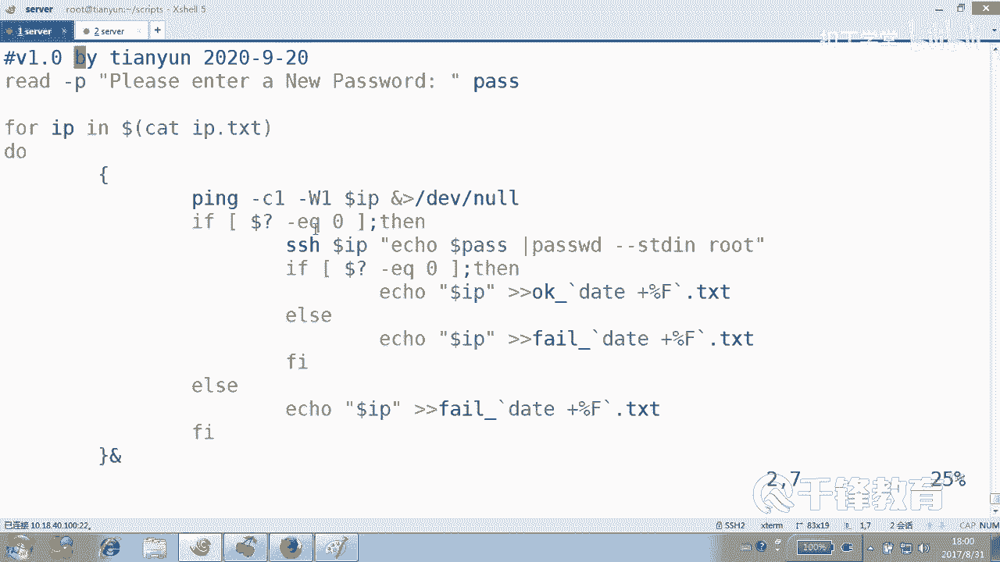
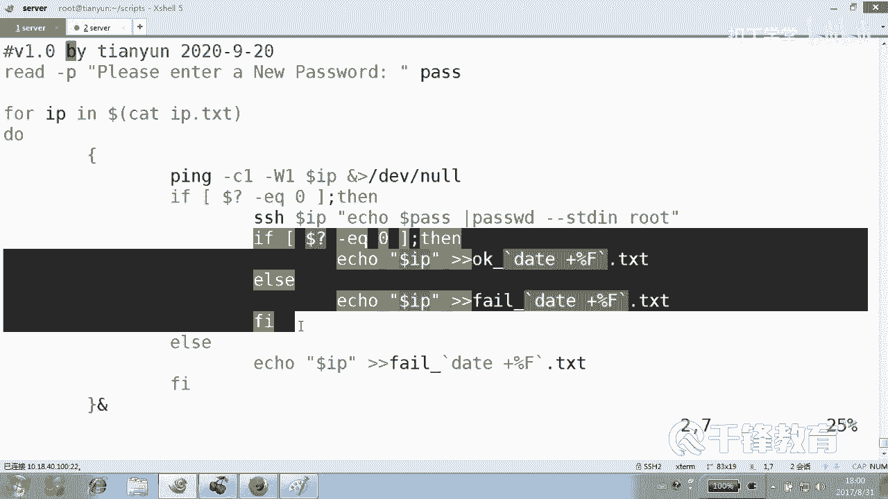
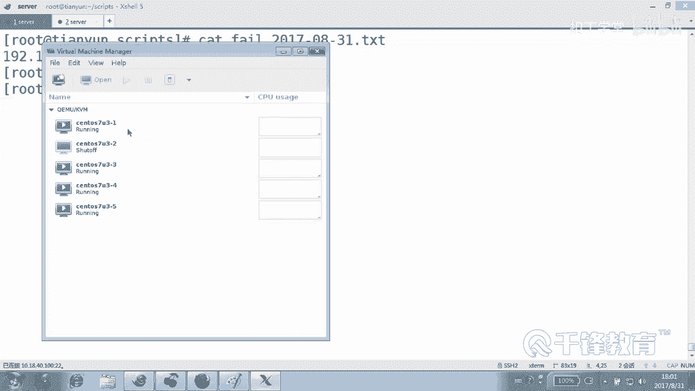
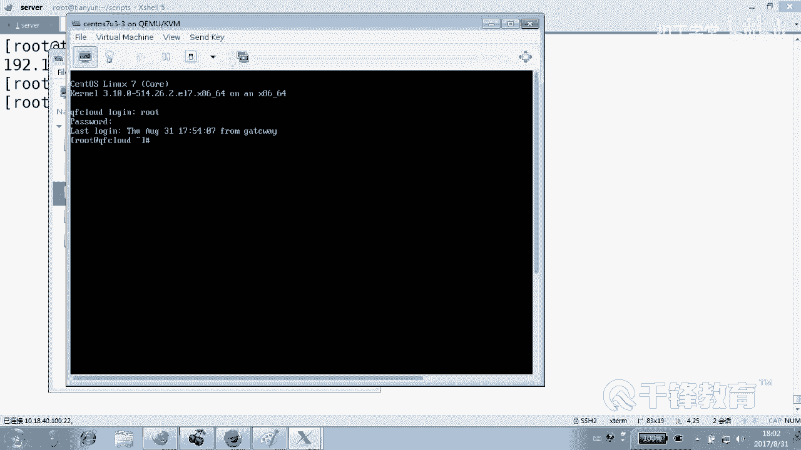
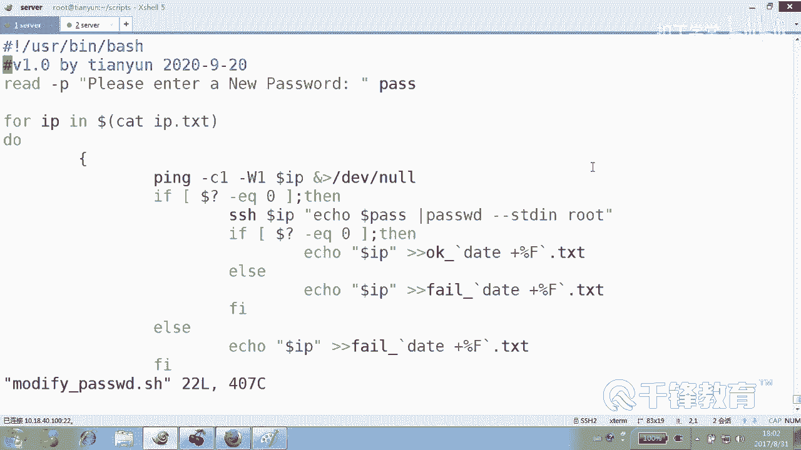

# 千锋扣丁学堂Linux云计算系列：Shell脚本自动化编程实战视频教程 - P26：4.9 for 实现批量主机密码修改 - 扣丁学堂 - BV1SE411q7vK

好，下面我们来在之前的这个基础之上呢来。😊，看一下如何批量修改密码。其实我们已经实现了第一步就是公钥认证吧。现在改密码的话，应该就跟那个什么。😊，跟我们的。交互没有关系了。是不是？

也就是不在我原来密码多少，可以随便改个新密码。😡，那改密码肯定是for循环。是不是改所谓的改密码，其实就是在远程主机上干嘛？😊，执行命令。来先认识一个改密码的命令，怎么改？就是这样S。😊，啊。

这个机器已经已经毁了啊，没这个机器了。😊，改密码的命令是不是这样子，ele一个新密码，然后它 word杠杠stand rootot回车是不是改密码什么东西都不要交互啊，交互是一件多么可怕的事情。😊。

交会的好几个人在那啊。不不不不不不不，那个我我想说什么？😊，我我想说的是要批量改密码吧。来，兄弟们，现在这些IP的拿到手了吧，已经。😊，然的时候我们呢然后这里没有空行，也没有你们所说的空格，人家是很。

😊，规范的好的，然后我们来一个去修改。什么。Pass W。是modify还是应该chan啊？随便吧，在你们想出来之前，我都已经回车了。😊，USR并下的什么bash。是办事，现在现在跟ex个sp没关系了。

😊，但是再忙也别忘了敲一下这个。2020年9月20号。嗯，超前意识。好，首先我们要读入一个变量，请输入这次请输入什么？新密码吧。😊，因为每次都要改密码。传给什么pass。O。😊。

然后紧接着for循环forIPE哪个哪个东西？😊，反引号是吗？catIP点TST是不是是不是注意我这里没有写路径，因为我很清楚我的脚本和我的那个。😊，和我的这个文本文件是不是在？同一个位置。😡，好。

当然这个反音号，好多人如果说已经看看的都不舒服了，那怎么办？😊，反正找一个你喜欢的看。我相信呢我们肯定要走这种模式是吧？😊，我们既然走这种模式的话，还不如把套路先。😊，先整上。好。

当然这种模式是有问题的。但是问题呢我们在后面会给大家讲，就是关于循环的并发的问题。这个其实好多人已经尝过他的这个苦头了。好，在现在先让你困困扰一下。😊，来，现在我们怎么做？😊，改密码是吧。

改密码的前提是能拼得通才可以改吧。😡，要是不通呢。步步通计改什么呀？是那个IP点TST文件里面是不是有100个IP或者200个IP，但是前提是这次我能拼得通才可以改吧。好。

拼杠CE杠WE拼谁doIP不要不要不要不要。😊，好，然后如果什么6快点快点快点。FI如果抱着问号EQ等于什么？你。那然后咱们就。SSH有说怎么过去改密码呢？😊，注意SSH我跟你们说一下。

看SSH连到1192168。12连接。76是吧，回不是76，是176。😊，这是不连过去。我也可以不连过去，像这样直接后面跟上一个新命令就可以。比方user ADadice看到吗？😊。

没人说一定要连过去啊，连过去干什么呀？你你你的目的不就是为了那啥吗？😡，那如果把这里面那啥换成什么？😡，换说那啥的话。是不是就改密码了？😊，这不是改密码吗？给他。😊，所以不是给我改密码啊。

是给他改密码啊。😡，能你怎么乖。啊，这这个。SSH连到哪儿？连到WIP注意这里单引号双引号其实都可以。我们。连到哪个机器？呃，改密码是吗？把这段复制一下吧。应该不是这么写的吧。

这应该是不是写dollar。😊，pass，当然这个一双引号有时候会有问题，两个双引号，所以我们省一个吧，能省一个算一个吧，好吧，好，能看懂这句话吗？😊，嘿，如果不加进的前面那个前缀是改的谁的密码？😊。

分本级啊是不是加了这个以后呢。😡，改的是什么密码，那个机器的呀，那么改密码要不要先提供源密码呢？那我们那个动作不需要，而且我们连接的时候要不要提供密码呢？我们采用的是公钥认证，密钥认证看了吗？好。

改密码一定会成功吗？😊，不一定好的，但是连不上，一定会什么。😡，失败。所以我们连不上的话，我们先告诉说什么。是不是失败了？嘿，连不上，是不是就说失败了？😊，是不是这样写WIP。这放到哪去？

放到一个fill点TS里面去，能看懂吗？各位。当有同学说，老师原来那个fiel这个文件有没有有怎么办？那你就先。😊，先整掉。先整掉，把它好啊，整掉啊。😊，那是不是还有成功的？

成功呢就把这个OK点TSC也把它重立向一下。好，现在呢请看我们知道能拼通。😊，有可能会成功改密码，但是拼不通呢。😡，一定会失败。就是你努力不一定成功，不努力一定会失败。

我怎么觉得我讲的挺有哲理的这种感觉？😊，这还讲讲还是讲脚本吗？一会讲人生了是吧？记住啊，不拼不通，一定会什么失败，但拼得通。😡，不一定成功。我，这这这这这有毛病吗？😡，努力就一定会成功吗？😡。

但是不努力呢，一定会失败。啊，那你拿我说我就没辙啊，这这这这个这这你拿我说我我没没没没办法啊。😊，好，同志们看我们连过去改密码，这个行为同样是不是也有两面性啊？😊，看了吗？如果说连过去以后。

我们是不是再加一个。如果怎么着，EQ等于什么0，然后我们就ecle哪个IP。😊，dollarIP到哪儿去？OK点TS里面去，那也有可能什么。🤧嗯。失败了，而就IQ什么？😡，dollarIP到。

fiTS里面去。有人说怎么写了这一堆if else看这是拼得通，这是努力。😊，是吧有可能成功，也有可能什么失败，但是不努力呢，一定会失败。明白了吗？看懂了吗？各位。那个但是这里有个有个有个小地方。

我们可以可以提示一下，各位这是什么时候改失败了？😊，平方万的平方。对，那这样我们可以做这件事情。上来以后呢，这次脚本执行的时候，上来先往这个。😊，先往两个文件里面扔点东西，扔一下当当月的情况。

就是我们这次改密码是什么时候，好不好？😊，可以这么做吧。不过也可以不这么做，也可以直接呢。😊，你可以直接不要上面这段话，可以不要，而是怎么做。😊，增加一个时间。是不OK的，是什么是OK的？😊。

data加百分号F，我这边只有年月日啊，我没有十分秒啊，你看你们想要点吧，我反正我是不太想要了。😊，失败，然后什么下划线。加百分F里面去。好，当然下面这个也抱歉，也要也要什么，要跟他一样的下划线。😊。

data加什么？好，各位有齐就提，没齐就就算了啊。我这个好说话。有歧义吗？有没有歧义啊？有有，你说。没有啊没有好。请输一下密码pass是吧？输完以后呢，我们循环我们循环呢cat一下这个IP点TST。😊。

明白，然后这是在我们的后台执行的。然后如果说什么。😊，拼得通，那我们就尝试去改拼得通。对吧？拼得通，是不是尝试去改，但是改呢是不是也有两种可能性？😊。

🎼但是拼不通呢，那就一种可能性失败。😊，我们把这个它的这个IP记录到哪去了？以这个日期命名的文件里面去，这样的话可以知道我们在哪一次改失败了。🎼在这一次表示在20几几年几月几号改失败了，有哪些IP好。

为了测试呢，我们。😊，做一下这个动作。bosh store那个杀档。森S什么。是杀盗吗？然后是。神toS7U3-2。好，关一个好吧，关一个造成这种改不了的局面。好吧，watch list刚刚2看一下。

但有个机器是不是杀杀杀off的。😊，好的。😊，看一下我们的脚本杠N哪个脚本。modify脚本好像没问题，这是在众目睽睽之下，应该不会有什么大问题。当然别忘了给一个。执行权限modify。C密码666。

😡，嗯，完成了好快啊。好，我们来看一下是不是有一个。😊，OK2017年8月31号改了4个。😊，fi有1个112011211。那为了验证改成功没成功，怎么验证呢？😊，打开那个熏机，我们去登一下就知道了。

看随便找一台兄弟，然后。😊。

再见root。好，我向登发室，我输的是666回车看到吗？说明我们改成功了吧。😊。

啊，看灯没用，那玩意儿不行。各位各位看到我们是不是无论现在我问一个问题，现在给你手上是5台机器吧，50台呢，500台呢？那能耗多长时间，最多就几分钟而已吧。😊，能明言吗？所以这些东西呢都是这样的。

不要去手动做。无论装软件还是什么，我们都是远程，都是可以自动化来做这些事情。😊，好，我们刚才只是以改密码为例，改密码我们是采用什么方法，就是远程的连到一个机器，然后去执行一条在他那边去执行一条什么命令。

看到吗？或者执行一个什么东西这样一个行为。😊，好，大家自己呢做一下，好吧。😊。

