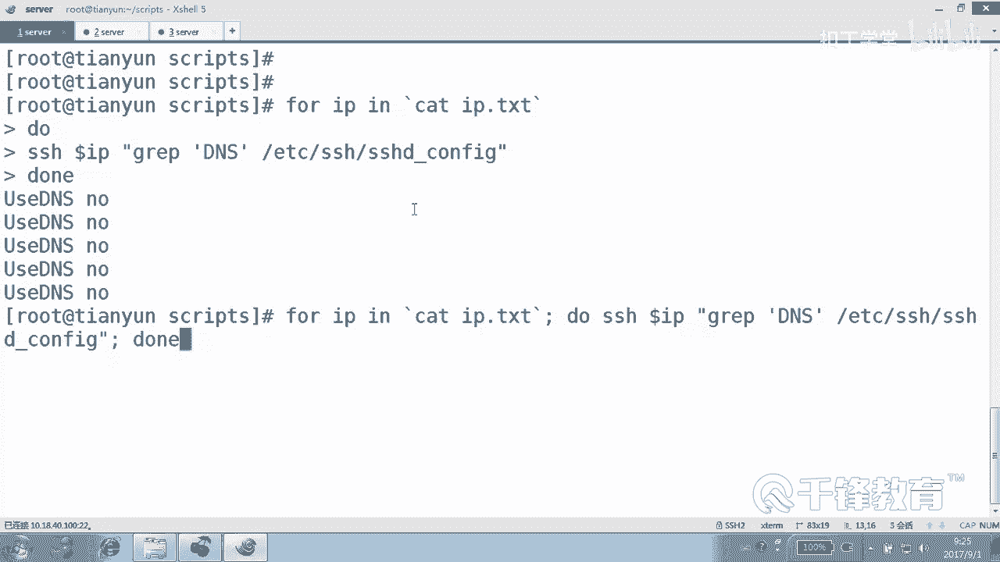

# 千锋扣丁学堂Linux云计算系列：Shell脚本自动化编程实战视频教程 - P27：4.10 for 实现批量远程主机ssh配置 - 扣丁学堂 - BV1SE411q7vK

欢迎各位再次回到课堂。😊，呃，我们接着来学习那个shall脚本这些内容。嗯，在前面呢我们已经带大家。写了一个脚本，实现了什么？实现了这个。获得IP是吧？这个获得IP的过程呢。😊，其实并不是只是获得IP。

主要是来推送公钥。我们在前面给大家画了一张图。只要公钥推送完成以后。只要公钥推送完成以后，那么后续的事情是不是特别简单？包括我们干嘛呢？是不是写了一个去modify密码的这样一个动作。

改远程主机密码动作是吧？好，我们看再试一下这个会怎么样啊，这个我们我换了一天。modify新密码是777。好的。密码都改成功了吧。哎，但是改密码的时候，是不是？😊，这个提示消息要不要啊？

要。改了4个好像是吧，应该有5台机器是吗？

因为有一台机器被我关掉了啊，是吗？好，我们把那台机器也开起来，我忘了是哪一台了。😊，啊，他其实不需要交，不需要那个不需要图形化啊。对他改了4个okK还是很快的，几乎是瞬间的一个行为，对不对？

也就是说一个机器用5秒钟时间，5台机器呢可能也是5秒钟时间，对不对？也几乎是并发的。好，那说明我们现在没问题了。那现在除了我们远程批量去改密码。还可以干嘛去做一些软件安装，或者是软件安装。

我们在后面会有一个案例啊，大的案例。那么现在我们主要是去修改那个主机的什么一些配置。比如说我们要去修改它的那个SSH配置，我们写一个modify。修改远程主机的SSH配置这样一个脚本。

其实思路都一样都一样，都是干嘛？读取那个叫IP点TST的文件。是吧那里面是不是有我们的。😊，获取到的IP啊。明白，然后紧接着呢。😊，去通过一个破循环。去聘某一个主机，如果通。

我们就连过去给他修改它的一些内容，是不是？那怎么修改？比如说我们要把我们要修改的事情呢，先想一下。我们现在要修改它的SSH或者修改它的它的那个什么它的SAlinux，这怎么修改呢？😊。

我现在想把所有主机的那个一些配置都达到我的要求。那我们这个地方肯定用到的命令不能是VI吧。是不是因为VI是一个交互式工具。虽然说我们还没用到sidead，但是我们已经。已经用了，是不是已经在用了啊？好。

怎么用呢？你看我们打开SSH的配置文件。😊，来看一下，这是SSH的主配置文件SSH服务对不对？好，在这里面呢有一有一些东西我们可以去修改。比如说。我们想要修改它的有一项叫什么？

我们搜索一下叫大写的DNS看到吗？现在默默认是yes是吧？有些时候我告诉各位，我们连接一个主机，它特别慢。就SSH去连接个主机特别慢，明白吗？它在解析它的名字，那我们应该怎么做呢？把这边改成什么？😊。

使用DNS吗？no，但是前面的注释要开启，明白吗？就是我们一会儿呢要通过一条命令去干嘛？修改这个这个东西。好，那我们一步一步来做啊，打开这个脚本，这是一个新脚本是吧？呃，USR并下的bsh，然后怎么做？

V1。0。然后白OK就样就这就这样。呃，当然应该更加主要的是说明脚本的信息吧。好，我们使用的forourIPE后面呢去ca一下IP点TI那个文件。好，我说了，先把结构写上什么结构？😊，是不是这个。

先把这个结构写上。明白，然后最后呢wait最后。什么这个打印怎么画了，你自己看。哦，O。好，我再说一下，我们先写的是结构。😊，明白，然后再来写内容。肯定是一个循环来读读这个IP。

对吧读这个IP的这个文件，然后读到以后呢，我们要干嘛？😊，平平的话，如果通了，我们才去干嘛？😡，再去修改他的那个。是不是修改它的那个叫什么配置文件吧。好，这个套路是一样的，没什么好好讲的。好。

先去拼 pin杠CE杠WE什么doarIP将这个过程的整个都。不要了。明白。然后。紧接着，if。如果。到了。问号EQ等于0，那我们就去干嘛，是不是修改它的。修改他的那个叫什么？SSI去配置。

当然你可以不用做这一段也行，为什么？如果说你相信每一个主机都是可连接的。😊，那你可以不用走这一段，但是我觉得走这段可以，为什么？因为我们要管理的主机可能有很多台吧。搞不好。有好多都是。都是有问题的。

是不是好。那怎么修改呢？远程连到。😊，IP上去是不是执行一条远程命令？C什命令。我们在这边敲在这边敲啊。😊，SED杠RI。查找什么呢？以什么开头的呃，不是。Yeah。其实我告诉你啊，我我们熟悉的话。

你搜DNS也可以。因为你里面就一个大写DNS。啊，你看看这个文件，你看搜搜DNSDNS看就一个看到吗？😊，但你也可以完完整整的来搜这这一段也可以，这样的话保保能够保证。肯定不会有问题是吧？

SCD杠RI然后搜索。什么以这个开头的行好不好？换成什么呢？C是不是替换？换成。不能不能要几号了，重新换成usDNS，然后录。注意到了吗？哪个文件EDCR的。😊。

SSH下的SSSHD杠co当然回车其实你应该试一下，好吧，试一下，回车没问题。你看一下你要验证这条命令没问题，你才才能才能去怎怎么做。你才能才能去用吧。好，那这台冰机我们验证成功了吗？可以吗？😊。

可以吧。好的，那把这条整个粘过来，注意这是在我们这儿执行，还是在远程执行？😊，远程这边我跟大家强调一下，如果说你很相信。不是说很相信，如果说你确定前面的主机都是通的那我们完全可以不走这个P的过程。

直接上来就SSH这能看懂吗？可以吗？就是如果说你你先拼一下测试一下。没问题，那你就什么怎么做，直接上来SSH就行。好。那除了改这一项以外，这一项是会影响低影响我们的SSH连接的速度啊，然后怎么做？

然后我们是不是有可能还要改一些别的东西？比如这个文件当中有一个叫GSS这一项，它同样会影响我们连接的速度。GSS叫GSS authentication这一项，我们也要把它改成什么low。好。

那这条命令呢其实。直接复制一下。把这个。GSS authentication看到吗？这些东西不是我打出来的，是什么？😊，是你必须要。很清楚的去。好，好多同学可能会看到说这个地方这个C是干嘛的？C。😊。

替换你要是觉得C，你看了跟后面挨在一起怎么办呢？可以加个斜线，好吧，这个没关系，加不加至少都没有绝对的影响。好，C。😊，C这个东西啊，它是不会它不是替换的内容，它是我们替换的命令，就是找到它是吧。

找到找到它换成它，找到它换成它明白吗？好的，这是改SSH。那有没有可能还要把防火墙什么给禁掉呢？有没有可能？😊，如果有的话呢，那怎么做？这些命令其实都不用不用试了，我们都能够自己敲出来怎么做？😊。

连到哪个IP注意你要是这条命令前面不写连到哪个IP的话，他就是干的是你自己这个机器吧。是不就是操作的是你本机啊？😡，那我们要操作是哪个机器？远程机器，所以要连过去执行，明白吗？连过去执行。

然后我们关网偶箱怎么关呢？system CDL stop failOD甚至可不可以支持分号，可不可以？System CTL。Disableable。明白吗？这些名字如果很自信的话呢，就直接敲。

如果不自信的话，就去复制过来，反正是这个没关系。好，然后紧接着呢。😊，SClinux要不要关掉？比如说。这个虽然跟SSH是没关系啊，可以关掉吧，怎么关，还记得吗？这个命令。😊。

Slinux是不是这个文件EDClinux下的config这个文件将SElinux开头的换成disable d注意到了吗？好，那我们可以复制上面那一行，随便一行。哦，这边有了。或找找什么找。

SELINUX等号开头的换成。SELINUX等号DSABLED后面的文件是。Clinux下的config。好，由于我这个字体比较大的原因呢，因此它换行了折行了，好吧。明白，这个倒没关系。

不影响你的这个整个的一个看啊。好，这个另外呢还可以将setEFCE给它设为0。是不。给关闭。好了，这样的话我们就完成了一个基本的这样一个动作。😊，是吧而且这些操作都是怎么执行的？都是。😊。

都是通过后台然后快速执行的，对不对？并发，这叫并发的执行的并发啊，这是sll的并发的一个东西。并发的概念就同时执行，明白吗？風に。SE你那个是。Re。哦，这个地方是吧？哦，这有两有两个地方。

一个叫Slin，一个叫ss。这两个文件是一样的。EDCs下一个Slin这两个文件是一样的。但我确实写错了啊。好SE。SSElin。对吗？现在。好。那现在我们来试一下，好吧，来试一下这个东西。

先测试一下语法了有没有明显的错误是吧？modify SSH配置好，这就有错误了，太太太好了。他说师弟讲。第十七行有一个引号的问题是吧？17行18行有个引号的问题。嗯。十7行是哪行？

冒号set numberIP那容。我第四个就是。这个字体太大了。这个里面哦，就忘了加引号了是吗？对。😊，这个我由于我这边字体呢挺大的原因，如果这样的话呢，就好也不好看。好。行。好。

现在我们在这后面加了个引号是吧？加引号，确实刚才少了个引号。😊，然后再来检测一下，注意这个命令，这个检测它不能够完全的检测你的语法是不是有问题，它只能检测一些。主要的一些语法规则有没有问题？

如果你里面还要写错的话，它很多地方是检检测不到的。你如果觉得有问题的话，我们只能够依靠于调试执行，还记得吗？就是加VX，让它去整个把它整个执行的效果给你。😊，显示一下。好，然后modify。😊，喂。

没有加执行权限吧。Modify SSH。当然我们这边改的其实也不只是SSHG吧。好，看一下。😊，很快吧，速度。你看有几个机器被被操作了，你感觉你感看觉到吗？😊，但这一消息要不要显示完全取决于你好不？好。

我们可以连到这个机器去看一下怎么连过去看。😊，有些时候啊不一定什么。听好了，有有些时候不一定要这个写一个脚本，我们可以直接在在这里面去干嘛？在命令行下去，是不是直接写都可以啊？不一定要完全写成一个脚本。

度我们连到哪个机械WIP干嘛呢？我们去过滤一下它的那个。过滤一下它的那个叫什么？过滤一下这个DNS那一项，好吧，从哪过滤。从它的EDC下的SSH下的SSHD杠com明白吗？看到了吗？这个有没有问题？到。

看到了？改好了吗？他们是不是都改好了？好，这种脚本呢这种脚本我们并没有专门写，但是呢这种写法不知道大家能能不能看明白啊，是不是一行、两行、三行、四行，这跟shall一样嘛，就就是笑嘛。

不是shall一样。😊，但是如果说你把它写成一行，你看你能不能习惯。就是像一行上写下来，你能不能习惯？😊，像这样一行上写下来。直接写forour IPE它然后分号是不是这第二条命令？

然后do do和后面是什么连起来的do，然后这是一条命令。如果还有第二条命令呢，也要加分号，最后down。你看你喜不喜欢这种方式，你要是喜欢这种方式的话，这就是单行脚本，对吧？一行上写个脚本。😊。

这个当然我觉得呢我更加习惯敲个回车，然后看一下这个明细的结构，而不是在单行上去写这样一个脚本。

听到吗？各位。好。所以我们可以借助于这个SSH的方式，连到远程主机去做一些什么？包括软件的部署啊，系统的初始化这样一些动作都可以去做。好吧。好。

这些我们在后面会讲到lab环境的搭建LNLNIP环境的搭建。甚至是mysql的部署这一些层面都会用到这种机制。好吧。啊，现在呢大家只要熟悉这种。风格就行，明白。好，这就是我们一个简单的。

应该说是一个简单的一个系统的初始化的动作，对不对？

