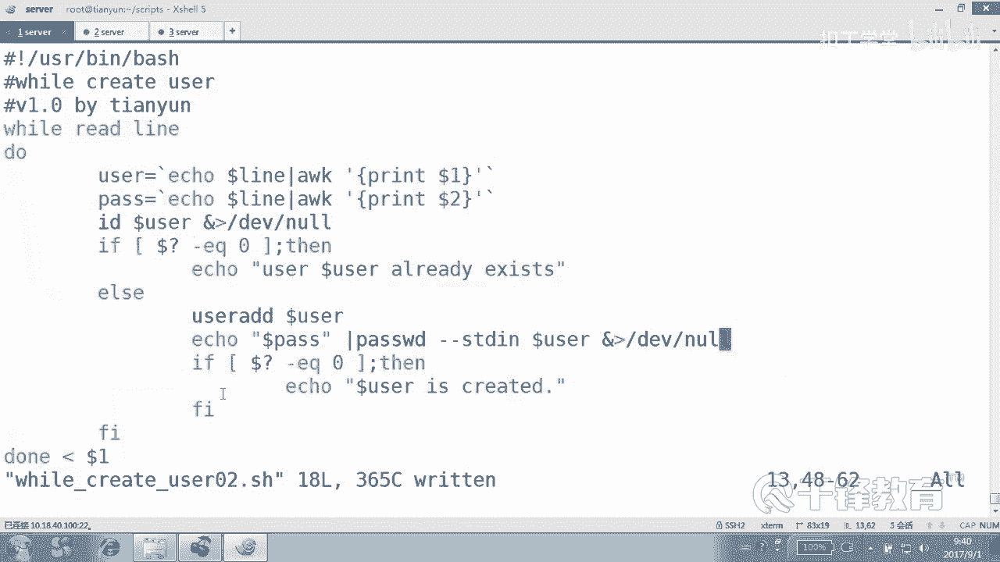
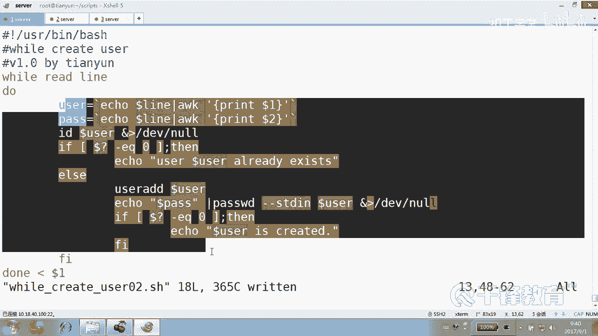
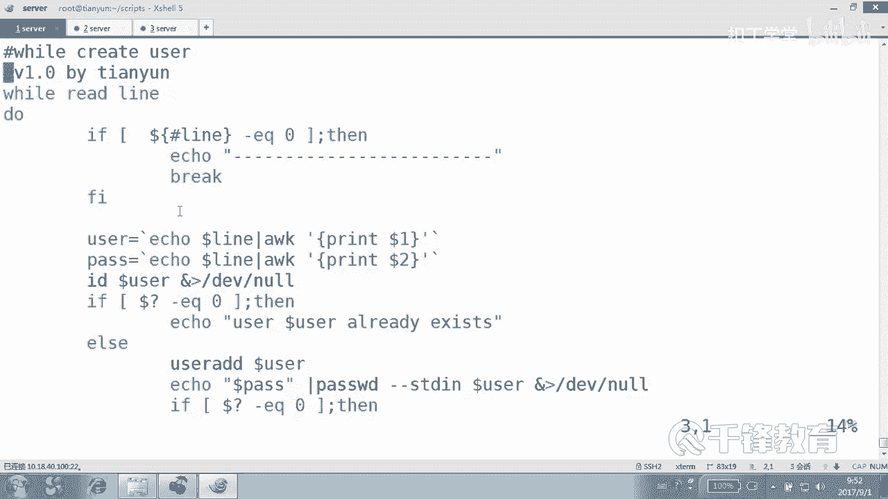
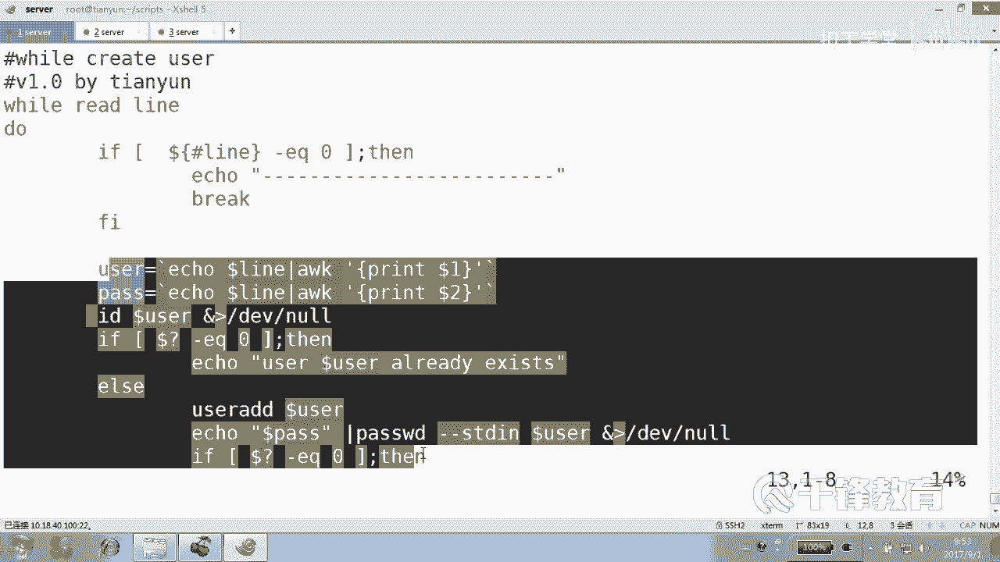
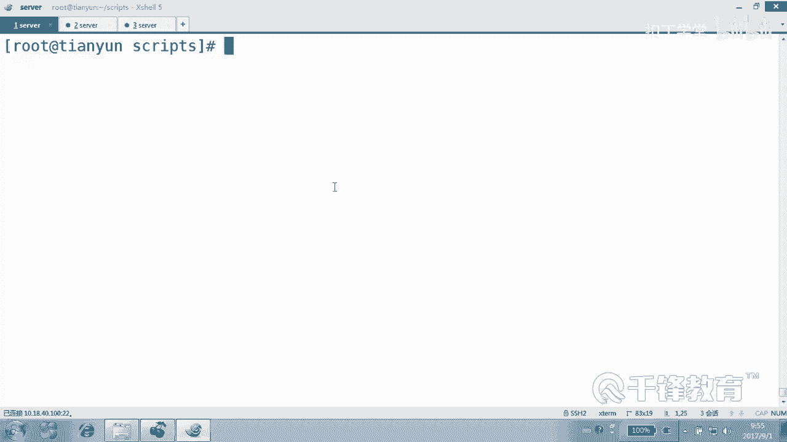

# 千锋扣丁学堂Linux云计算系列：Shell脚本自动化编程实战视频教程 - P28：4.11 while 实现批量用户创建 - 扣丁学堂 - BV1SE411q7vK

好，接下来我们来接触到这个well循环和until循环。嗯，在前面我们讲到for循环的循环次数是。固定的吧是不是是固定的这个循环次数。然后well循环和untail循环呢。😊。

他的循环次数不一定是固定的。也就是说它可以固定，也可以不固定。另外大家还记得我们在前面。用那个for循环的时候，有一个问题，就是他去读取一个文件的时候。

我们记得有一个我们有一个这个创建用户的一个脚本是吧？还记得吗？有个叫user1点TSC这样一个文件，这里面呢你看每一行有空格是吧？而且呢还有空行，空行倒不要紧，每一行是不是有空格，最主要是有空格。

那这个时候当时我记得我们在使用那个for循环的时候，就特别麻烦，还重新去把什么。把那个分高符给改了吧。😊，但这个事情如果发生在外尔者上，身上就没有问题。这个well循环怎么循环的呢？

我们下面以这个还是以创建用户开始，好吧，来well user a create。有点啊都是下划线啊。我们写一个well create user的这样一个一个脚本。其实我更加倾向于使well，而不是使用。

for在很多时候，我倾向于使用外循环的方式。好，那下面呢我们这是我们写的第一个外循环。USR并下的balash是吧？好，这是well。在干嘛？Create user。那么之前使用for循环的时候。

for i in是吧？然后循环体度荡度荡循环体。那现在使用的是well。这个Y有有一个什么条件呢？其实虽然说Y我们没有特别用过，但是我们在前面是不是用它写过所谓的死循环啊？😊，就是如果说你想要用户。

不要随随便便的退出，我们用的是well来写一个死循环吧。那今天肯定不能写个死循环吧。😊，因为今天我们要做的是创建账号，怎么创建账号呢？那如果这样写的话。where后面where和for一样啊。

where和那个if一样，后面跟的是一个条件。就是他要获得的是一个最终的一个返回值。是真还是假？明白，那LS返回值应该是真还是假？😊，所以外循环不循环？😊，好，那这个是个物聊的例子啊，先看一眼看。

那你你告诉我这是个什么什么样的循环。这是一个。这个例子只是我们看一眼，并不会把它当成什么事儿。既打了LSC打了什么？okK因为LS本身人家是也要也要什么？😊，要显示的，这样的话是不是就只打印？O。

死循环退不出的，除非你contrl C，除非conttrol C退不掉，因为它没有任何条件可退出。好，当然我们用它来了，不是用来做这个无聊的游戏，而是想告诉你，只要条件为什么。😊，有人问我说什么条件。

你随便啊，是个条件是不是都成了，只要能够有返回值的，是不是就可以随便。😡，甚至是怎么做。甚至是我们去写一个条件测试也可以，甚至写成一，是不是等于一。哦，我这样写对吗？应该是EQ是吧？

那不一定一可以是个字符串，一也可以是个字符串，好吧。所以这个是没有对和错的问题。行，那现在我们要做什么？有创业用户吧。😊，read line。Read line。userAD然后dollar。

叫赖好像不好吧，叫。User。然后user。看到了吗乖？这就是Y循环了，怎么去创建账号的一个例子，非常简单。😊，有同学说这是怎么讲呢？首先我们采用了一个输入重令项，对不对？

作为Y的一个输入重令项放到最后的，然后它会读入。他会从这里面读出读出一行，付给哪个变量user各位这个时候要不要加杠P啊？不要加，因为这个不是你不是由你去提示给你去读的，而是什么？

他读他读到一行以后放到。user编量里面明白吗？然后再做下一步。就他会从那个文件里面读一行。😊，那你怎么各位。好。如果简单的讲的话，我们试一下我们。加一再加一小段啊THEN。如果EQ等于0。

然后我们就ele说dollar user is。craed是吧。好，试一下user点TSC文件。好，这边呢。呃，我们现在没有考虑用户存在不存在，好吧，其实这里面好多用户是不是都存在了？😊，试试。

CHMOD加什么A加Xus呃，那个well执行well。好了，他告诉你用户存在。就创建的时候报错了是吧，是不是创建时候报错了，其实这是一个报错提示，是不是报错提示？😡。

看他是不是读到这个很很轻松的读到这些内容了。😊，当然我们除以尊重的话呢，应该怎么做？先ID是吗？dollar userer注意这个user它是什么？是我们从那个文件当中读到的这一行，好不好？一行。

然后紧接着呢。如果这一行呢。啊，这个用户存在。如果dollar。User。啊，不是sorry，如果什么到了问号EQ等于0，说明什么？是不是用户存在啊，就是。就是我们在前面讲的那样的这样的一个例子啊。

输一个用户存在，但是不是报错，这是我们的一个提示。这个给我们前面使用for是一样的是吧？是一样的东西。那如果不存在呢，那就是。alse，然后把这一段整个。放到这里面去，当然还有什么。缩进一下。看到了吗？

乖。这个和前面是不一样的，不同的是。你看我们使用for循环，还有那个外循环，达造的效果都一样。😊，是不是从这个文件里面是不是读入一个。堵入这样一个什么。一行读到一行付给哪个变量？付给user变量吧。

然后紧接着呢，我们判断用户是否存在。因为我们知道这个变量里面其实。😊，就一个用户吧，没有密码吧，是不是好，然后如果用户有的话，告诉用户存在。没有的话呢，说什么。😊，不没有的话就创建账号，并且呢提示用户。

最后创建成功以后，提示我们的用户存在，是不是？明白。好，再测一下。好，用户都存在是吧？好的。😊，好，那我们这个脚本好像没有体现出来和前面的那个for创建用户有什么区别，是吗？是不没有看出来。那这怎么做？

因为我们刚才的那个user点TST。这个文件确实里面没有没有空格的东西吧。好，我记得我们是不是有一个叫user1点TSE文件。😊，好，咱们。先把这里面的。这里面的内容呢先。先改一改啊。嗯。好。

现在我们看到有一行是用户名，有一行是密码吧。之前你记得for的时候遇到什么问题了吗？😊，它是不是按照空格和table键分割，它读到的是4个变量，是不是其实应该是几个变量，两个，你看Y号是怎么处理的啊。

😡，好，我们把well copypy一下，copy成welluser什么那2。02吧。好，这是我们的uYus02这个脚本。那看到了吗？我们这边用哪个？哎，我问一下能不能写do了一啊，能吗？能吗？

那怎么不能呢？执行的时候，后面加个文件是不是就可以了，到了一是不是就是位置变量啊，但这个跟那个没有影响。😊，好，那我们这里有两有两个，一个是。有一个有一个用户名，还有一个密码吧。所以我们定义两个变量。

一个user哦，不对。这个上面这个就不叫user了，因为这个确实读到的不是user，是一行，我们就叫标准的lan。注意lan不是关键字，好吧，lan在这只是一个辩量的。名字它是哪个东西啊？他是。

它是不是这一行那是不是指的这一行？好，你看我们没有改变任何分割符啊，没有改变任何分割符，而直接这么用。😊，现在呢我们定义一个变量useruser是哪个？告诉我。😊，是不是艾克一下dollar？

然后管道给AWK打印。倒耳机。这是我们的用户，另外密码是什么？😊，是不是打印我们的第二列？这有没有问题，这儿。这没问题啊。好，如果用户有的话，那我们说存在没有的话呢，就创建用户，甚至是呢还要干嘛？😊。

Dollar pass。管道给pass word杠杠stand。然后是。dollar user将整个过程呢。不要。大家注意到没有？😡，这个循环循环几次循环几次。这个循环它要循环几次，循环三次还是5次？

它首先我们这儿是不是只要条件为真，也就说只要能读到，好吧。他是不首先从这个文件当中，这个文件里面有几行，告诉我有几行。😊，有有几行有两行吧。对，有两行，它读到一行以后。😊，付给哪个变量。烂变量。

然后是不是做相应的操作？明白。

然后紧接着呢，它再读一行付给烂变量，做循环，就是做我们这个循环循环操作。那如果再再读的话，是不是就没有了？那没有的话，readline这个动作会成功吗？

不会成功，所以条件就为什么。就不为真的不为真的话，那Y循环就。结束了。Y循环有一个Y循环有一个要求，就是之它之所以能够循环有一个什么要求，就是条件必须返回值必须为真，也就是为零，看到了吗？你不为零的话。

没办法循环。所以读完以后，那么循环呢就终止了。好，各位这里我们有没有考虑那个我们说的那个空空格的问题，有没有？没有了。好。我们以调试的方式来准备执行一下调试的方式哦。lash杠VX吧，后面加上。

刚才那个脚本。说什么没有加参数是吗？😡，是比样的参数是吧？好的啊，给他加一个user1点TS。😊，好，各位看一下整个执行过程，代码从这开始执行，读到一行吧。😊，打印那个第一列是什么？读到夜堂是不是那个？

一那个叫Y呃YANOO123是整个一行。第一列是不是YNOO，第二列是不是123？所以复制给密码书，复制给这个pass啊。然后最后ID这个用户在有存在吗？ID这个用户存在吗？不存在返返位置是不是一呀。

不存在不等于0。😡，所以呢创建了这个账号，而且设了个密码，是不是？看懂了吗？各位。好，没问题吧。所以完全不用考虑。如果使用你使用外循环来处理文件。我这么告诉你吗，for循环就不太适合处理文件。😡。

我们是不是之前动不动在for循环里面怎么写？就像这样for IE，然后后面cutt一个文件。😊，不适合处理，明白吗？因为for循环它在处理的时候，它是以空格和tableable键。

它还有回收符来作为什么分割。😊，而我们的这个叫什么？😡，循环它不使用那个东西，它只使用回车来进行分割。所以有效的避免了我们说的那个问题。好，因此。😊，这种结构请大家死记硬背吧。

看wellread lineread line这个 line呢指的是行嘛。好吧，这个并没有代表什么关键字的意思。后面呢加什么重立项，就这种结构是我们在处理文件的时候。😊，最常用的。明白吗？

那刚才还记得我们的前面是不是写了一个修改远程的SSH那个命令。😊，那也适合用谁给给谁来做？😡，是不是给那个Y来做，就是你记以后给我记住，如果说你有一个文件当中有好多行，你想逐行的来处理逐行循环。

请优先想到的就是。well而不是for，好不好？能理懂吗？各位优先想到的是one，而且呢这个结构是什么结构？well read land就叫lan嘛，反正lan这个词挺好听的嘛，对不对？然后后面呢。😊。

输入处内象。可以是一个具体的文件，也可以是什么某一个变量。好，这个结构呢是非常重要。记住了吗？我在我重复了好几遍啊，我的意思是说，你以后想要对一个文件当中进行逐行处理，那你用什么？😊，有啊。

那比如说各位还记得我们在前面讲的那个叫。修改密码呃，修改那个SSH那个脚本吗？我们可以改成修改SSHcom。我们改成哪个版本？5L版，你看之前是不是这样做for天生，我觉得就不太适合处理文件。

因为它对那个那那就不要使用for了，使用什么。😊，Well。死记硬背吧，read的什么line，最后do荡，然后下面呢输入重另一项哪个文件？IP点TS。好，一切都不会有问题。OK。😊，而且很帅气。

而且行里面如果遇到的一些空格什么的那也不会有影响。记住了吗？各位。这个你要记住。但是这里好像有个问题，我们不知道大家有关注过没有？😡，这里面有没有可能有空行啊？😡，这个控行对Y有没有影响呢？

我们再来整一个9啊，这个就这个这些项。或者我们就干脆删了吧。就整一个有行的一个空行的，我们来试一下w再怎么处理这个事情。好吧，看他会不会把那个扩行给读到，明白吗？😊，怎么测试？b杠VX什么？嗯。Wow。

😮，02是不是看一下啊。哦，少了个参数是吧，少了个user1点TST。你看他他有没有遇到这个错误的问题。有没有遇到我们不不要乱说，而是要看实看实事求是的来看。我们也来看看这个文件，这个文件啊。

user1点TST这个文件第一行是有内容的，第二行没内容吧。如果给 for的话呢，for就完全视其不见了。因为for for它是遇到空的，它就当成了这个变量之间的一个什么变量值之间的一个分割而已。

它就不会不会理睬。那呢。😊，会理睬吗？请看大屏幕，好吧。他读了一行，读到的是这个嗯，这个对是吧？😊，哎，又读了一行。哦，这回好像有问题啊。读到的是什么内容？空。你看人家上面读到的是不是这一段。

那说明Y奥对空。因为w他把一行看成是一个变量值，是吧？是不是这样的？光要把一行看成变量值。所以。好像这个时候就有问题。那当然就我们一直讲过一件事儿，脚本不是给白痴用的，好吧，你不应该在这里加空哈。😊。

那如果加了呢，当我们也有防白痴的手段，还记得吗？记得怎么防白赤手的吗？是吧是吧。判断对，就是先判断。没错，先读了以后先判断。判断什么？😡，如果doar。dollar什么井号line，它的长度等于。

杠EQ等于你。那就是不是空行啊，那没有什么说的，直接。😡，是bread continuein。😡，bread就。😡，brack是什么意思？😊，Back很好玩，咱先看看braack。😊。

来来来别着急别着急啊。😊，我们我们喜欢这个这这个这个过程啊，我们一定要每我我们写脚本的时候，我在讲的时候是肯定是带着测试的性质去走的，好吧。😊，就是每一步出错，我都会给你展示一下。

而且会看让你去看那个调音测那个测试的过程。😊，调试的过程是不是？但你写的时候不一定要这么干吧，因为一个很简单的东西。😡，我调试只是为了看让你看到什么。😡，换一个吧，叫张张。张张一密码是145括行。猪猪。

周周期是111空行。明白。现在我们看一下，如果说写的是back会怎么样？这个braack这个这个家伙挺狠的。是back。好，我们我们不用打印呢，直接直接就这这么打印也行。😊，打印一个。行吗？

就这打印纸是为了看一眼啊。😡，可以吗？我们之前知道for在遇到这个空行的时候，根本就不屌他是吧？因为for的世界里面没有空的呀，他认为空就应该是变量值之间的一个分割。而well呢好像不是这样的，来。

请同学们注意看喽。😊，现在按照我们的猜想会是什么效果来吧。😊，cat user1。TSE。首先读第一行是不是读第一行？user是张张一，密码是145。OK行，然后读第二行付给哪个变量。😊，烂变量吧。

读到以后呢。😡，完了，由于有有什么又没有东西，所以我们往下走是不是也没有意义啊？😊，下面的循环代码对他来讲是不是太奢侈了，根本就没用，那怎么办？我们想的是跳是吧？那怎么跳，它的长度肯定是零，那怎么跳？

如果我们采用的是braack会怎么样？😊，那就那猪猪还有机会吗？突出没有机会循环就结束了，知道吗？所以back这个东西是很狠的，挺不要脸这种的。😊，是不是猪猪再也没有机会了？好，为了验证这个效果。

请大家。😊，我把下面这个地方换成一个，我都不想不想再再那个啥了啊，写死了好吗？😊，好，请看啊，看调试的过程。上面这一段，上面这段是我们的代码本身到这儿没有写加号的，表示只是他解释他他给你看了一眼。

有加号的表示我们执行过的吧，是不是加号表示执行过的这个这样一些东西read line哎，长度是15，哎，所以等于0吗？所以没有跳，然后icical打印猪猪创建的不是张张创建的，然后紧接着读了一行零等0。

😊，哇塞，执行的这个代码，这个加号表是系统执行的东西啊，这个表是最后显示的我们显示给我们的结果是吧？所以brag走了。😊，跳的悬崖下去了。跳下去了，知道吗？这个叫跳，这个叫什么？😡，哦，我为了这个事情。

其实我对不起啊，我我写的话应该是这样写的话，更好看一点。我们说。😊，Or O。好，为了演示的更好一点呢，我还是把这个文件的用户一用户呢先重新来定义一下，叫张张2。好，全班都有看一下。😊。

猪猪还是没有机会，因为breakack了，但是后面的有机会吗？各位跳出循环哎。你觉得如果从狠的角度来排，有exite break和contin，你觉得最狠的那家伙是谁？😡。

iside那家伙逮住以后就根本就不是跳出循环了，是终止程序看到吗？我们没有写，所以这是因为没有写，因此谁才有机会。😡，循环以外的那个打印OK是不是才有机会？😊，而我写了一个breakack。😊。

我写了个braack是吧？braack并不是跳出程序，而是什么离开循环。😡，但是我们是要离开循环吗？😡，我们只是说，如果兄弟，如果你读到的是什么？如果说你读到的这个行是空行。

你后面的代码就是这一次循环就不要做了，行吗？就是跳过剩余的循环。不跳过本次循环里面的代码。本次继续什么？下一次循环。你找猪猪去啊。所以这个时候我们有理由相信不应该使用back，应该使用。😊。

continue继续看到吗？就是这儿这篇翻过去。😡，继续下一轮，看到了吗？😡，能看到吗？所以continue break，我们有时候你用一用，你就懂到底是该什么地方用了。好吧。

这个这个这个你看有三个选择，你们你们选吧，一ex。😊，不合适吧。😡，excite如果上场的话，后面的代码这些代码循环以外，代码还会执行吗？不会执行。那如果是back呢，braack倒没有那么狠。😊。

循环以外的代码是不是还是可以执行的，但循环没戏了，但是我们要的并不是我们要的值从哪儿跳过去。😊，只是说这次循环不跳，对吧？这次循环呢呱机跳过去，看到吗？😊，这循环呢不跳这循环跳过去看到吗？好。

所以我们用continue来用事实证明一点，事实证证明一下我们的猪猪有没有机会。好，这边其实。这里呢我的这个continue break，还有exit不是针对well循环啊，只是啊是针对什么循环。

记住了吗？只要循环都会针对。来这个怎怎么着？来吧。看我们的猪猪有机会上场。是不是？好，这就是我们使用while循环，而且我们很明晰的告诉你，while循环非常适合处理什么文件，逐行处理文件。

就是你想对文件中的每一行干什么，我今天不知道你要干什么，好吧，你可能就要打杀，随便你。😊，你只要逐行处理文件，是不是叫循环？这个文件有3000条，你要逐行进行处理处理处理处理是吧，那你就我要循环。

这是不是最棒的？好，外要循环。我们刚才看了条件为什么？😊，什么情况会循环？😡，真循环。然后为甲了。就。结束循环是不是？

