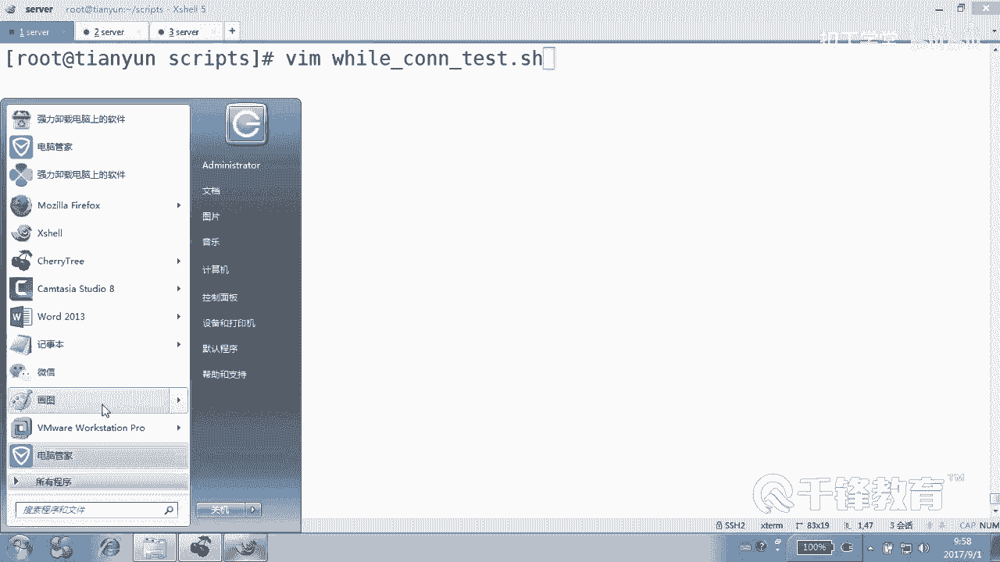
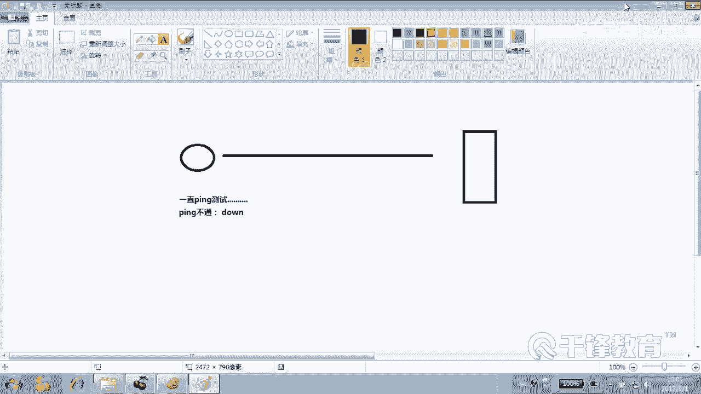

# 千锋扣丁学堂Linux云计算系列：Shell脚本自动化编程实战视频教程 - P29：4.12 while until 测试远程主机连接 - 扣丁学堂 - BV1SE411q7vK

嗯，刚才我们介绍的是well在处理能处理文件方面的这个优势和能力，对不对？请大家记住well read line do down。输入重林项。这种格式好不好？另外呢，万遇到空行会怎么处理？人家也会处理。

好吧，所以怎么办呢？你可以把空行给怎么着，contin掉，给跳过掉，是不是，而不是其他的动作。当然w呢，其实我们觉得呢w的能力很强，它不只是在处理文件方面，它也可以写出这种什么。刚才处理文件。

其实我问大家，他处理文件的时候，逐行处理文件，它的循环次数是固定的吗？是不是固定的？是固定的。对我们说W循环它的循环次数可以是固定的，也可以是什么？不固定的。那不固定的话呢。for肯定是没有机会。

for是不可能做这种事情的。😡，那怎么办？

那我们就可以使用YL来做。那比如说我们现在有这样一个写这样一个脚本看啊。通过Y去做一个。连接测试。collection test测试的一个脚本。好，我们使用Y要去写一个连接测试的脚本。

OK那回车这要干什么？我我先把这个示意图画一下。现在呢我有一个主机在这儿。😊。

我呢一直想监控它是不是通的。那是你的话，你怎么做？我想监控它是不是通的，这个服务器是不通的。益制品。一直拼吧。但有同学说老师我写个写个脚本，然后写个加个交个计划任务，每个时间拼一次也可以。

但我我说的是我不想靠计划任务，我就靠我自己。我对我一直拼，我我我们会一直拼，就是我们。😊，一直去拼，是不是测试？那拼多少次呢？拼多少次？不知道。是不是不知道P多少次。😡，直到有一次什么拼的时候。听不通。

听不通的时候，我们就打一句话说什么。😊，那个主机到了。这个特别适合。使用while循环来写。特别适合怎么做？就相当于一直是通的，一直通的一直通，只要是通道就怎么办？一直拼。哎，拼通的话条件是否为真啊？

拼通的话条件为真，所以只要为真呢，我们就什么。😡，一直片。那如果拼不通呢？😡，Y循环是不是就结束了？好，所以呢这个例子呢其实特别简单，你看啊这是。😊。

不。哇的一个最。USRB下的bsh最简单应用。Well。干嘛？P杠CE杠W。一。聘我们一个主机啊，这个主机是哪个呢？IP吧。1。0。18是18吗？42点。我们找个学生机器测一下你的你是多少？😊。

127好吧，127那127好的那我就do什么IP拼的过程呢，怎么着？呃。不要是吧。度。到。好，那如果拼通怎么做啊？这个有可能这个不是有可能啊，这个拼得通的话，我们循环是不是才会循环？😡，这么讲吧。

拼通以后不能连续拼那么快，我们可以稍微让它切个一秒或者2秒钟。sleep在这干的事情就是。间隔一下，休息一下，sleep2秒钟或1秒钟。然后最后。我们还克一句话说，主机。远程主机IP is done。

好。各位看一下。Yeah。这个能看懂吗？

是不是一直拼拼怎么着通的。😡，通的话就干干就是不就循环，只有条件为真，是不是才循环？😊。

只有条件为真才循环。条件为假呢，就条件为真循环循环什么？😡，停一秒。然后紧接着。再拼还是通再停一秒，再拼通通通通通，不是拼多少次，有有数字吗？😡，拼多少次，这个循环是固定的吗？循环多少次我们是不知道啊。

循环是不固定的。而你使for循环，你说for循环是应该写上100字还是拼1000字呢？这个事情是不知道的，明白吗？所以for循环实际上不太适合去干嘛。😊。

写这种就是没有感觉循环次数是不固定的这种行为是不太方便写的，是很难的，对不对？我也没有尝试去写过这首。我们用它都是well。好，各位如果通的话，这个这一行有机会执行吗？没有，因为通的话就不会退出循环。

循环就会无限制进行下去，只有不通就会当退出来了。明白。好。现在呢我们给他一个。😊，一个这个。权限。当然我们通的话并没有显示任何东西，对吧？是不是没显示任何东西，等一下现在是不是一直在通。

所以我们这个程序有没有结束？😊，没有好，那现在呢石凡杰把网线拔一下。那我没有动啊，对不对？我没有动任何东西是不是就已经结束了？😊，好，等一下吧，等一下先别再唱啊。好，看到了吗？各位。😊。

你们再看看这个脚本能不能理解，听简单了吧，拼的次数我不知道多少次，我们也不用去算这个多少次。总之。😡，那个你就拼吧，只要条件为什么？😡，为真，那我们就循环循环干的事情好无聊啊。😊，不是你得干点啥事。

你要是不加sleep，那拼是不是就太快了，不能那样拼啊，你肯定得间隔一下，拼，是不是一秒钟，那只只是我们在这定义的时间啊。😡，好了。😊，有一位兄弟正好跟他相反。就是。onil看一下。

所以我每次讲的时候把它连起来讲onUNTIL好，请看先不要插网线插了。😊，没上网线。好，等一下。😊，看着几号叹号USRB下的bsh。until循环平，你看我写的跟他一模一样，看好啊？

我写的跟他一模一样啊，杠C1杠什么杠W1。😊，我说了，既然写一模一样，那就整个10。18点多少？12点。127是吗？是17吧，dollar什么IP。嗯，一模一样啊，咱。好，那当然不能写的一模一样啊。😊。

它俩的循环正好相反。刚才那个w是什么？什么情况下循环？😡，条件为什么？为Y循环。我说的是。😡，YR循环是微针，微针就就通了嘛。😡，好吧，通了是不是就循环，但是呢until是什么？正相反，哎。

不通我就循环，不通，我就循环，要是通了呢？😊，我就离开循环。能理懂吗？现在这个师潘杰的它这个它这个主机现在是拔着网线的。😊，那正符合我这个unt的口味。我现在就一直拼不通是吧，我再来。😡。

我不通我就我就再寻不通我就再寻不通我就再寻不通，我就再寻。突然呢一拼某一次拼说什么通了，那我就循环就是什么，我就我就循环这个循环本身就结束了，然后我就走了，我就打印这个app，看懂了吗？各位。😊。

就一个是说你是好你你好的是吗？你是好的吗？你是好的吗？你是好的吗？一直是好的。😡，如果突然发现什么，你不好了，我说我来。😡，这就是Y循环。😡，是不是。unmt虚幻正好可以开什么？相反，你只有是坏的。😊。

他才寻坏的才寻。是不是？你要现在是在受伤或者困苦当中，那我帮不了你，你变好了，我再帮你。😊，好，当然我们试一下，然后我给大家再举一个例子啊。😊，这个。A加XUNTL这个吧。UNTUNTL好。

现在现在没有反应说明什么？😊，啊，好的什么呀？😮，unil正好是坏的，他才他才高兴呢。他说挺好挺好挺好呃，插网线了，该插网线了。😊，猜了马上好使吗？你这个USB的电脑，USB的网好。

ont循环是不是结束了？他说好了，看到吗？😊。

好了，就离开循环。😊，所以这两个的循环次数都不是固定的。哎，等一下啊，其实它俩都可以固定啊，它俩都可以固定。刚才我们在处理文件的时候是不是固定的？😊，好，until当然也可以做这个事情啊。😊，呃。

我们看到。until和well这两种循环。他们的格式都一样，w条件测试。until什么？条件测试do当循环体循环体。当条件测试成立时。当条件测试成立时。但是他俩对成立的定义。是不一样的。

这个w尔说我认为的成立是什么？😡，微针好吧，我就寻。😊，而until任务的成立是什么？为甲就成立。当然说这个话了，好多人听不懂，我们换一句生活中的例子，好吧。来说一下。某些大学老师讲课和我讲课的特点。

这个。我讲课有一个什么特点呢？就是。😊，只有当你们是清醒的。认真在听，那我就讲。😡，大学老师是什么呢？只有当你们睡着了，全趴烂的时候。😡，他就讲。我俩都有一个条件，我俩都有条件成立。

我是说当什么乔易成立，当你们都都什么。😡，当你们都清醒的时候，都在认真听的时候，满足这个条件的时候，我就想好吧，而。😊，很多很多大学老师是怎么讲的？😊，就是也是他也有个条件，什么条件？😊。

当你们都睡着了。😡，当这个条件成立的时候，他就讲，那你告诉我我是well还是unm till。well是吧，他们是什么unil。😡，明白了吗？所以这是while until，我们在写那种什么。😊。

只有他俩非常适合去写这种循环字数，是不固定的这种循环。比如说刚才就真有很多例子，我再给大家举个例子，我现在去。😊，去检测一个账号，有没有登到我电脑上来，看到了吗？😊，听明了吗？如果我我我要我要手腕要写。

就是。我一旦检测到它，我就说什么。😡，哦，我一旦检测它掉下去了，它本来一直在嘛，对吧？这个账号是不是一直连着我的这个这个这个IP或者这个账号一直是连着我的。😊，一旦他掉去的话，我就说什么下线了，是不是？

😡，那unt适合写什么上线了，对不对？他一直没在没在没在，我一检测没在，后老我就在检测，没在，我就再检测，突然他上线了，我就说什么上线。😊，对不对？所以while适合写下线呢，until适合写上那个。

😊，上限了。能听懂吗？各位好，这都是我们这个well on例子。那么后面我们还会给大家去举一些well until的例子。😊，好，关于这个能看懂吗？各位。😊。

关于这个我们写的这个通过w和 until去写的这样一个条件测试啊，不是条件测试，是一个什么连接测试的方式。你注意它俩都有一个条都要条件测试，它是为真就循环，它是为什么为假就循环，或者它是为处循环。

它是为forse循环，明白吗？😊。

说直白一点直白一点啊，看一下啊。我这边不写脚本了啊，哇。😡，这是不是真？告诉我这什么玩意儿。😡，这就是个死循环呀。😡，而且满足well的这个。满足是不是well的那个循环的特征。

真的冒号是不是返回帧处是不是也是微针？走啊一秒钟一次啊一秒钟是不是一次，没有结束的时候。那如果用until来写打印时间怎么写呢？😊，有人还问我说这个w可不可以这样写？😊，敲一条错误的命令。😡，是不行哈。

这个是正确的命令。😊，然后不要显示。好，这是无聊的做法啊。😊，叫什么？这个和刚才是不是一样的效果？😊，肯定为帧啊，因为data面令怎么执行，是不是都为帧啊？😡，或者说你要实在不喜欢他的话。

你换一个换一个什么呢？😡，换一个这个叫。一等于一吗？一等于1吗？哎呦，惨了一等1吗？😡，等啊，所以呢循环吗？只要能够返回任何能够返回条件为真的这个结果的命令，无论是一条命令还是一个测试等等等等。

随便啥都行。看到吗？那有如说until写怎么写？😊，他是不是条件为甲啊？😡，Fse。人家也是无限循环呀，头像为甲是不是循环？V甲还不好整。😡，微甲可以这样。一。这个也可以一等于2吗？肯定不等。

所以肯定就就什么。😊，是不是也值行？或者是写什么呢？我告诉你一个中极技巧。😊，你觉得怎么样？它的反位值应该是真样还是假？😡，好，正好说我我就是符合我这个啊。Data。也执行开了吗？

所以它俩的这个区别在于，一个是调节为真执行，一个是为假执行。好，请记住大悦老师讲课和我讲课的。条件好吧，这就是这个until while。

