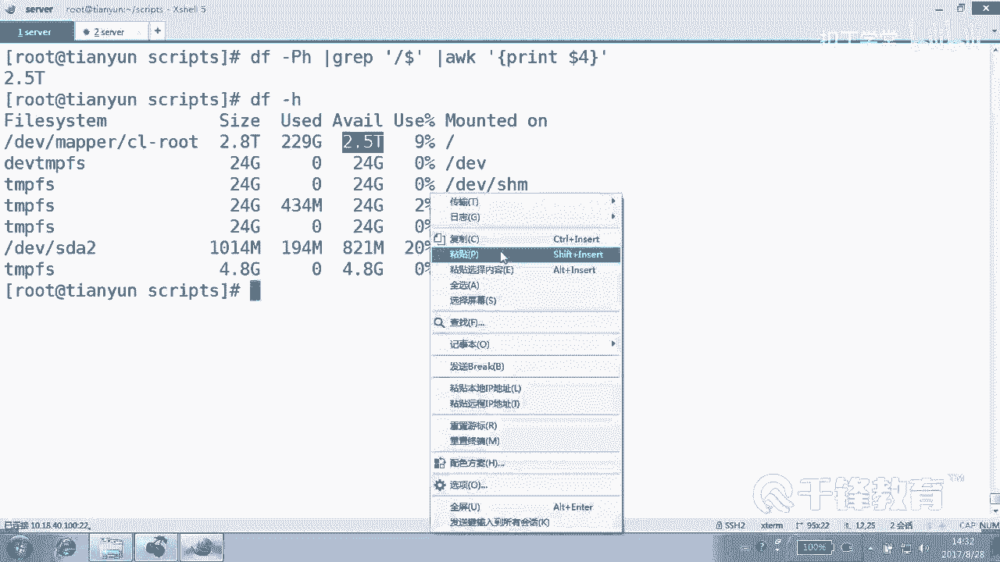

# 千锋扣丁学堂Linux云计算系列：Shell脚本自动化编程实战视频教程 - P2：2.4 变量 的赋值方式 - 扣丁学堂 - BV1SE411q7vK

好，欢迎各位再次回到课堂呃。😊，在前面我们带大家做了一些基本的一些实验。呃，包括了怎么去。使用变量我们讲到了自定义变量。还有呢环境变量是吧，以及位置变量和。预定一变量。这边说到环境变量的话。

大家必须要很清楚。就是其实系统给我们定义好了很多相应的环境变量。比如说我们最常见的。

UID是吧，还有。有的。还有了像home呀，或者是PWD呀，对吧？等等等等。如果想看到所有环境变量，用什么命令？😊，ENV好吧，回车当然可以过滤一下其中某一些环境变量。对吧我们在脚本当中也给大家谈到过。

一般是没有没有任何必要去定义什么所谓的。环境变量的。是不是但是给大家谈到一个思想，就是如果一个项目，我们要拆成很多小的脚本。我们可以在一个其中某一个脚本当中去定义一些全局性的变量是吧？然后定义好以后。

在别的脚本当中怎么去使用它？😊，去sourcece或者是点儿执行，是不是在执行的时候就可以把它使用过去。好。那谈到这个变量，我们也大家也在前面隐约的感觉到了，我们也讲到就说有有一种是显示负值。

这个显示负值这个很清楚是吧？什么叫显示负值？很明显的就是变量值。😊，辩了名。对吧大部分都是这样的，变成值变成名。比如说。

我们有一个叫KVM杠MNHER这个脚本。当然这是我们自己呢写的一个脚本。这个在后面也带大家去写。这个写呢是有条件的，什么条件？就是你必须要会了KVM管理才可以写，是不是？😊，所以脚本我们讲过，这几天。

无论是8天还是10天，这只是个开始。后面呢我们在讲到具体的应用的时候，会用到脚本。你看这边呢。😊，比如这里面很多地方都是变量吧。😊，包括我们将一些目录，像镜像目录叉m mail的目录。

当然这个变成盖什么的，得取决于这个脚本的需求，是不是？我们甚至将颜色，red color，blue color。😊，reite color是不是都定义成了变量，在后面我们根本就不可能去写这种。😊。

很长的这种颜色的这种标记，而是使用什么？变量的方式，包括我们的八的镜像，6。8的镜像，7。3的镜像，win7的镜像，这都是定义的整变量，看到吗？😊，都定义成变量的方式。那么这种定义叫什么定义？

显示很明显吗？对，大部分都是这样的。😡。

都显示物值。好，这个显示符只要说一下，无论是后面跟的是一个，就是在我们看来，这个linux shell啊，有一点大家要清楚，它跟C不一样。😊。

在C源中，如果说你要使用一个变量，你还要先什么？通过int呀定义这个变量的。类型。是整数类型呢，还是fot浮点数小数类型呢，还是字符串类型呢？你要先定义好才能使用。其实在 shell当中。

变量是没有类型的。或者说shall默认将变量看成是什么。strring字付查的。明白什么？所以大家不要不要以为说什么，你看有一个变量number的值是10，然后这个什么number2写少写了1个20。

比如说把两个数字一加是不是30呢？啊，不是好吧。😊，🤧。我是把这个dollar number10。加上。dollar number20是不是30，还真不是。哦，写错了。

应该是dollar number是吗？number和大 number。2。肯定不是30，而它就是明显的这是变量的一个。

引用啊，对不对？好，不是你想那样的，它就是字符串。如果说字符串当中带有什么空格的话，编章里面确实可能有空格啊。编上的纸里面可能有空格。那如果带有空格的话怎么办呢？😊。

那就使用引号引起来，你看啊。标示name。这样写没问题吧，这样写就有问题。他认为。这个没问题，这是个变量的负值是吧？它认为云是一个命令，看到吗？但如果说我们使用引号将其引写的话呢，这个就没问题。😊。

I call T name。这个变量不仅是在shall的命令行下可以来定义，在脚本里面也可以，反正是无论是脚本还是在这儿，都是shall是行吧。啊，所以这个你别不要特别的。😊。

说有问题。好，另外我们在定义变量的时候，还可以将什么？我们甚至可以将一个变量的值付给另一个变另外一个变量都可以。😊。

你看那个。OY这个变量是吧？我们可以直接用什么呢？doner name is good。这样的话是不是将一个变量的值付给另外一个变量？😊，这个变章的值是上面的这个这一段吧。好，最后我们艾克一下。

是不是这样子？

好，另外呢我们也可以怎么做呢？去通过这种我们叫命令替换的方式。😊，反引号注意反引号表示什么意思？

对，先执行。当然有同学说是不是这样子，data加摆放号F。首先，摆放F是干嘛的？data加摆放F是可以显示以这种格式去显示当前的时间和日期是吧？那有同学说。😊，这是什么意思？这个土地。一里面是。

什么当天的日期吗？不是，就这段话好吧，就是纯粹这段话，因为除非你。😊，把这个引号换成。反音引号，也就是也就是我们所说的命令替换。那它里面是。今天的时间看了吗？当或者是呢。

对2或者这个反引号有另外一种写法，有另外一种写法就这么写的。这都叫做命令替换，看到吗？就是无论使用反引号还是使用dollar小括号，都表示的是。命令替换，就是先会把这个命令整个。执行一遍。

然后呢再来做别的事情，看到了吗？好，因此today2也是。也是一样的。明白了吗？好，所以这个变量的复制很灵活，可以把一个常规字符串覆给变量，也可以把一个带有空格的字符串覆给变量。但是一定要用什么引起来？

😊。

用引号引起来，那么也可以怎么做？😊，也可以把某一个变量的值，把某一个变量再付给变量也可以，甚至可以把什么把命令执行的结果。其实我想说的是，无论是这种方式还是这种方式还是这种方式，还是这种方式。😊。

最终都是一个字符串，看到吗？就无无非都是把字符串或直接或间接的付给我们的变量的名称。

听懂了吗对？变到负值是不是很简单？那另外除此以外呢，我们看看另外一种赋值，我们在前面是不是讲过叫什么叫从键盘读入吧，叫read。这个从键盘读入呢。😊。

后面只要跟上变量的名称是不是就可以？后面只要跟变量的名称就可以。但是这个。这种方式有时候我们说他没有提醒的话呢，会显得比较突兀，或者在人看来呢是。非常的不爽的，对不对？但是在计算机。😊，使用的时候。

有时候我们是不能加提示的，想加提示使用干P明白吗？

我这边特别再次强调，我在这里面所敲的东西和在脚本里面是一样的。好吧，这都是这样嘛，对不对？这都是这样。后面加上1个IP读入1。1。1。1，那么就是将1。1。1。1复制给什么变量。IP那这个时候呢。

IP的变量呢就是1。1。1，是不是？那另外加上那个叫什么？😊，叫提示，这个我就不演示了，好吧，我只不过提示各位加提示的时候。最好在后面加一个空格。

这样的话能够把后面那个变量的名字和我们把把变量的这个输入的这个值啊和前面的这个提示消息稍微做一个分割，当然不会有什么影响，好吧。只是说好看一点，更清晰一点。

除此以外呢，我们还可以怎么做呢？加上一个倒计时杠T。等待时间，比方5秒钟时间。如果你觉得需要的话呢，你可以等待一下5秒钟时间。这个你自己可以试一下啊，另外呢还有杠N2，什么意思？😊。

re杠N2是吧，变动加IP啊叫name吧。你看啊我输个12结束了，看到吗？他只需其中的什么两个字符就OK了。你书多也没用，他不会要你的这个字符，他就要其中前面的两个字符。😊，明白。瑞兹是不是很强大？

但是这里呢。如果说就简单的。这样做的话呢。这个没有什么意义，对不对？好，那怎么做看一下。😊，read的。他后面可以输什么呢？你看啊。我们这边呢就不给提示了啊。我们输入看IP1IP2、IP3IP4。

这什么意思？定义了几个变量。好，如果就来个1。1。1。1回车。那你猜一下会什么结果？是不是四个都有想错了吧。一个有二没有哪四个都有。1。1。1。1。2。2。2。23。3。3。34。4。4。4。

这是可以的，看到吗？😊，就他会按照空格，然后依次呢来按空格进行一个拆分。对吧可以取四个值。对，可以取四个值。呃，那么到这儿呢，我们来看一下就是。那这种有什么用？😡，这东西有什么用？

那比如说我现在要想输入用要想用户输入什么姓那个姓名。年龄还有性别。是吧。那我们写一个这样一个脚本，我让用户我说请输入你的姓名、年龄、性别。那么你有两种方式，你看我们这个叫什么？😊，input点SH吧。

好吧啊。呃，或叫read你read点SH。前号叹号USR并下的。Blash。然后有两种方法，一。READre杠P请输入什么？输入这个。姓名。然后命名给给lam，好吧。然后紧接着呢，再输入什么。性别。

再复制给加个加个那个叫空，这里千万不要出现中文的那个。中文的那个引号或者是什么符号啊？在再输入什么？年龄。可以吧，所以我们在结果呢，eical说你的这个姓名是什么？😊，你输入的。姓名是。

这里面其实出现个中文引号，中也没关系，倒是因为他在引号当中Lmb，然后。然后什么还有。性别。Dollar。6。还有了。还有歧义吗？那个逗会有歧义吗？各位。还有。年龄。

注意千万不要随便出现那个中文的那个符号啊。好，这个你看我们为了获取这三个值，好像让用户输三次是吧？那挺麻烦的。这个但我们看下效果啊。😊，给他一个。给他一个直行权限。你看依次姓名。杨性别M对吧？

manner还有了年龄呢？40岁。这没问题，这个是没问题是吧？😡，但太麻烦了是吧？提示3次。😡，所以我们可以把它整个河道。😊，合到一起。姓名。性别。年龄。甚至可以加一个加一个这个提示给用户。比方说。

提示是吧，例如什么。张三。然后空格M年龄呢20岁，但是你愿意加提示，加提示，不加提示，不提示啊，这只是一段说明性的东西。然后整个呢我们就可以把变量定义在这个后面。明白了吗？那你最好给用户一个提示。

给用户一个提示，这样的话他才知道该怎么输入。所以read是可以同时输入，是吗？😊，可以同时去定义多个变量，我们可以它是以空格分割，然后来进行截取。R的。杨M40岁。结果是不是一样的？看到吗？

当然我们在后面还会用到readd的一些更加其其他的一些方法。这边呢你记住，你要是现在如果只输了一个变量呢，如果只输了一个值会怎么样，可不可以？羊可不可以？😊，回车那就只有只有姓名，对不对？没有年龄。

明白意思吧？好，他是这样去截取的。因此。read这块是可以同时去定义多个变量的。来看你的输入，你以空格分割就可以。那没必要像刚才第一次那样，我们为了去获得他的姓名、年龄，还有性别呢。

我们分别做了三次readd，可以一次让用户提供出来，对不对？可以这样去提供。😊，好，这是关于readread总之是从键盘。😊。

读入好，下面呢有一个脚本，这个脚本非常简单，也没什么好给大家演示的。看forrsst SH。😊。

定义的一个变量，这是怎么定义的？这是显示还是键盘输入？显示的负值对吧？很明显负值的这个是什么？从键盘输入，最后艾克一下，应该都没有问题，是不是最后来执行这个脚本。😊。

P2了。这个也是我们在前面看过的，看请输入一个什吗？IP注意这里面一定要空格，哪有空格，这有空格啊，最后拼拼两次到了IP，然后呢引用变量。最后如果说上一次命令执行成功。

那么就icical主机谁ok否则的话就失败是吧？😊。

这个没问题吧，各位。这是变量的一个复值方式。那我们主要是变量的一个显示，还有一个是readd。另外呢还有一个就是我们的位置变量，doer一是位置变量这do一到2这三种是我们比较常见的变量的复值手段。😊。

那么另外呢变量在我们在用的时候还有一些问题。各位你看啊有有一些双引号和单引号的问题。

这边刚才大家可能已经看到了，我有一个变量叫做Lmb，它的值是。

这个吧。然后还有一个包外。然后后面写的是。到了什么。啊，不不不，do name is good是吧？但这里有个问题，你看这个结果。😊，好，那我要是这样写的话，你们能理解吗？😊，这我写了一行上能理解吗？

就是先把这边上定一下，然后再输出一下吧。嗯，好，最后显示天音 is good没问题吧。但是如果说把这换成单引号，那事情就会有问题。😊，猜测一下。name is good看了吗？

就我们这边呢叫什么呢？叫双引号，叫弱引用。单引号叫。强应用。就是在单引号当中。

对，是啥就是啥，没有变量。没有变量这个说法注意到了吗？大家注意，也就是说，凡是在单引号当中，就算你是变量，你也会化成一滩血水，对吧？😊，然后把你给。是就完全没办法去。换成那个变量的值，明白？所以请记住。

单引号里面是不能出现变量的。OK出现变量的话，变量的意思就没有了。😊，所以我们一般要想引用变量的值的话，那么一定要放在双引号里面，能明白吗？当然单然引号里面有些东西也是要也是要注意的。

你看像叹号这种东西。哦，不是不是放单银行里面，是放在。双银行里面谈号。看报错吧。因为叹号一般我们知道出现叹号的话都表示。历史命令什么东西啊？在这是历史的什么东西？😡，在这里呢很想有问题。

那一般这种情况需要怎么做？😊，需要。转移好吧，需要转移。凡是有特殊含义的，我们都可以哎呦。但居算看转移转完以后也也也。尴尬了吧。单一浩行不行了？但一号本身就没问题。但是单银号里面。😊。

这个变量又又很讨厌，那怎么办？有办法吗？这也不行啊。嗯。🎼那就不要把它放到双引号里面，好吧，各放各的一那一堆。😊，这都没问题是吧？你能想到很多办法。😊，另外这个变这个这个引号啊，我告诉各位。

嵌套以后有问题。有时候嵌套的时候，他会找你记住他只是会找那个他离他最。最近的那个符号，作为它的匹配。所以我们有时候呢会在一对双引号里面套单引号，或者在一对单引号里面套双引号。😊。

你不能说在单银行里面套单引号。另样的话其实它并不是套，而是他找他会找到他最近的一个符号。😊，这会增增加我们这个脚本的一些麻烦的程度。好，记住双引号叫做什么？😊。

就是在双银行里面的变量依然还是。还是变量，而且会替换成相应的变量的值，是不是？但是在单引号里面呢。😊，强饮用。另外，除了双引号单引号以外，我们还见过一个叫min令替换。

其实和这个dollar小括号是等价的。它表示我们就叫反引号了，它表示什么？😊，这里面的命令会被shall先执行。大家比较常见的是这种用法，各位看。

to是一个文件是吧？我们touch一个文件，data加摆放F。嗯ん。

这什么意思？是不是到先会把它解析成为执行完以后变成当天的日期啊？😊。

然后整个文件是不是带有当天日期？这种用法是非常常见，为什么？因为我们在写mysql的备份脚本的时候。😊，我们会写一个mysql的备份脚本，告诉他把mysql的这个数据是备份到一个文件里面去。😊。

而且通过计划任务呢每天去做吧，但是我们肯定不能把这个文件名写死吧。为什么？因为写死的话，第二天会把头一天的覆盖掉，是不是？那怎样才能不写死呢？😡，我们可以以当天的日期作为文件名的一部分。

对吧或者是我们以后的日志也可以采用这种方式，然后然后使用这种命名替换的方式来作为什么？😊，文件名的一部分。呃，除了两个反引号以外，还有呢就是这个叫dollar小括号，它和这种两个反引号是等价的。

而且在 shell当中，我们比较建议大家使用这种方式。你看我我起了个名字啊，叫fill一是吧？看是不是效果是一样的。😊。

叫反引号，这个反引号叫命令替换。各位这边呢下面有一个有一个这个小例子来，我们先看看这个例子是什么意思。😊。

这个P其实不用加了，因为在7里面好多功能都已经什么。😊，在七里面这个这个六里面要加，为什么在六里面加？在六里面这个逻辑逻逻辑卷啊，它会换行，它这一段会换成另外一行下去。😊，而加P呢，P是po。

也就是按照这个po标准打印，它会自动成为一行。无论在场都会是一行。😊，但是在心里面呢，我试过。😊，嗯不需要加P，那你这个加上吧，反正没问题，好吧。好，各位这个看到的是不是我们整个挂载情况。

然后最后过滤什么？😊，过滤什么结尾的？跟跟结尾的吧，打印第几列，1234是不是变是不是那个可用空间？😊，明白吗？我是想将这个2。5T付给谁啊？😊。

我想付给这个disk free3这个变量。

但是这种做法是错的，为什么是错的？😡。

嗯嗯。变量负值没有问题，但是什么？😡，结果。不是对的，disk free3，结果是不是就整行啊，因为双引号它并不是会把这套min令先去执行，而是直接把这里面整个字符串，它完全不会看成是什么min令。

看到吗？付给这个变量。😊。

有没有达到我们想要的效果？😡，没有吧。对不对？对你有两种方式，一种是到数小括号，一种是什么？😡。

反以后你你自己选择一种，你看我们来一个4。反引号ctrorl加E到最后是吧，反引号。再来一个小括号，crl加A到前面。然后dis free5。然后这样子吧。再加个什么到ll。来，我们看看icical。

😊，Disk free。42。5T52。5T注意到了吗？嗯，好。

呃，应该准确的讲，这不论叫错的，只是。

这不是我们想要的效果是吧？我们本来想要的是去过滤出那个叫什么值。对，没错，然后执行命令的结果付给变量。但是呢。😊，你并没那么做。好，这是变量的一个定义。在定义的时候。

变量的赋值啊在赋值的时候还要注意一点，我们可以各种各样的方式，包括什么一个字符串，包括一个带空格的字符串，也包括什么？😊，一个命令执行的结果也包括。带有变量的这种形式都可以覆给变量。总之。

实际上最终都是付给他一个什么字符串，一个值，对不对？而我们知道在sha当中，变量是没有所谓的。😊。

数据类型的对吧？没有什么整形、浮点型字符串类型，它全是字符串类型。那那照那么说的话，那那个一它是个数字一还是一个整数一啊？😡，是不是数字一那个整数那个sorry数字，它是一个字符串一，还是一个数值的一？

😊，如果我们负一个变量，它的值是一。那各位这个一你感觉是字符串一还是一个整数值的一？😊，字符串，那这两两者区别在什么地方？😡，字符串是不能运算的，好吧，数值是可以参与什么运算的那那照那么说的话。

我们后面怎么运算呢？好，你放心，在shael当中虽然说我们没必要去定义变动的类型，但是。😊，我们预算的时候。它就会把它转成什么数值，到底是个字符串还是一个数值，得看你用什么。方式去使用它。

你操作这个变更的时候，你采用什么方式，它会自动的匹配你操作内容内容，明白吗？😊，好，那么这就是变量的一个负值。另外请大家记住双引号单引号和反引号的这个作用。除此以外呢，这个两个反引号它等价于do小括号。

😊。

明白。好，这个自己呢看一下。