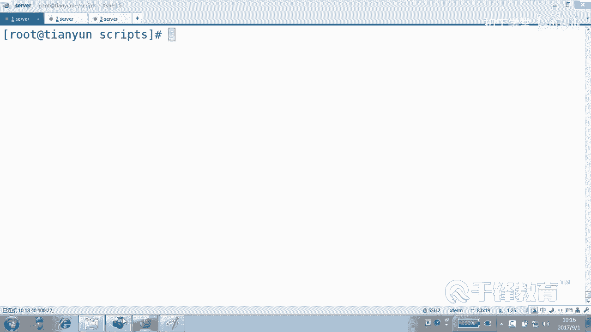
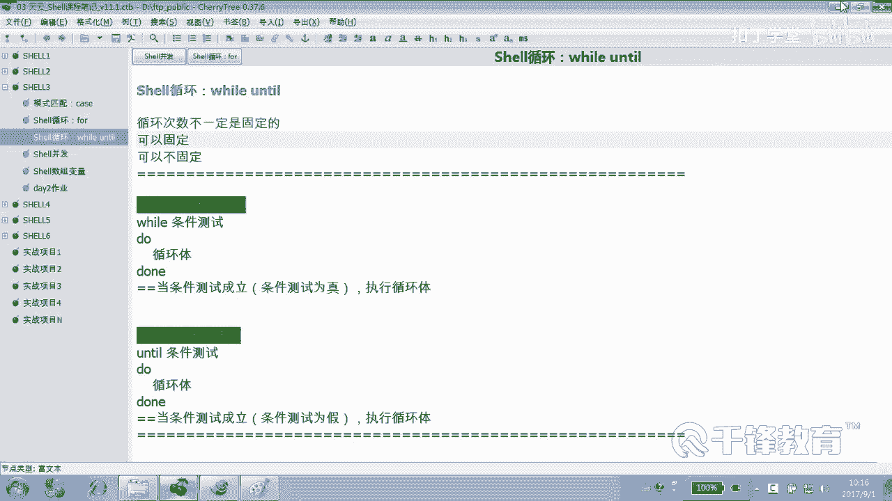
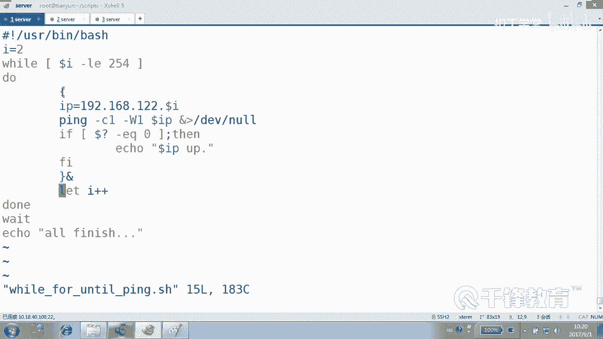
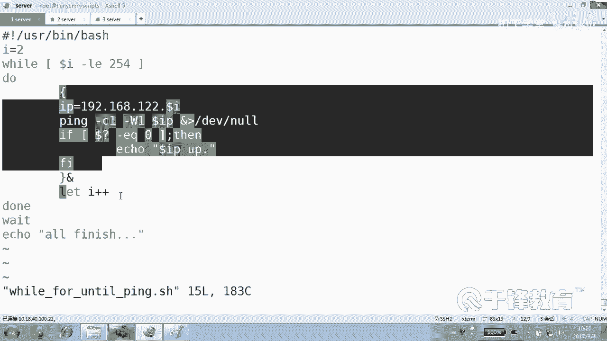
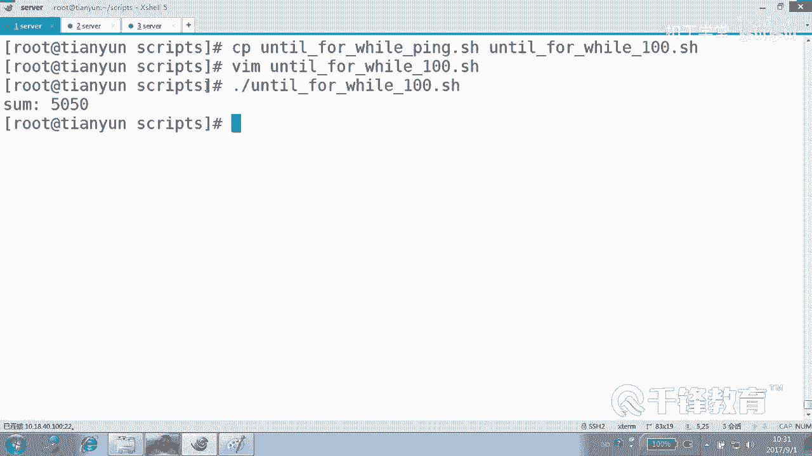

# 千锋扣丁学堂Linux云计算系列：Shell脚本自动化编程实战视频教程 - P30：4.13 for while until 终极对决 - 扣丁学堂 - BV1SE411q7vK

接下来我们来来对比一下for while和 on。嗯，应该不漏说对比，应该是各位还记得吗？我们说while while until一样能够写出和for一样的什么。😊，固定循环的那种风格，明白吗？

而且我们也给大家给大家打了个标签，就是w这家伙非常适合去逐行处理文件，是不是这样子？😊，那他们有共性吗？我们也看到well循环unil循环，它们一样可以循环次数是什么固定的。好的，那我们用什么？😊。

我们用那个。for循环Y循环和unt循环。😊，来写一个。P主级探测好吧，各写一个P组级探测。行，我们用快点的方式。😊，呃。four不是for。4。好，谁排前面就是谁的谁是老大，好吧，他在前面负来。

请看一下。😊，哎，干嘛这是干嘛写写什么？我们用下划线吧，统一啊。😊，这儿写的是P好吧，P主机。for p主机怎么拼呢？我们不考虑那些其他因素，好吧，forourI in。😊，2到254。是这样的吗？

do大。当中还有一个什么来着？这玩意儿吧。哎呀，越着急越不行。手不行了。后面是不是喂他。然后Iical。Or finish。好了，然后是不是写那个IP没事，一会儿我们复制一下就可以啊。IP192168。

12点什么WI。😊，然后P杠CE杠WE杠dollIP1起来，你们别别整。你们也没有没有这个速度。If服。好，我们就写通了情况吧。😊，哎呀。空格儿。如果什么。到了问号EQ等于0，我们就ic说什么。

Dollar IPP is up up吧。简单一点。好，这个有没有问题，快点看。😊，这复循环有没有问题？😊，没问题吧。A加X。然后执行一下for。好了，我们知道五个主义通不通行不行？😊，改一下。

开车改成什么呢？把Y排到前面来，让forour。我这边是做他们仨对比啊，是吧？然后well。哇，怎么写这个东西呢？写固定次数呢？😊，好，这个时候Y写的话要付初值，I等于2，我们要从二开始，是不是？

然后这边呢就是。我要。干嘛？Dollar I。呃，小小于等于254，看到吗？254只要条件为真就可以，明白吗？A，二小不小于等小不小于等于24。😊，那其他的我也没这么改的呀。😡，现在还改什么？😡，没了。

各位，这个循环次数是固定的吗？是对对？是不是固定的？好，来，我们依次请上这位第一位兄台。然后再请上。第二位兄台。怎么办？这么多。啊。哦，错了错了一件事儿。这个是错了一件事儿，死循环了。

然后II的值我们要。在循环结束的时候。let什么？😡，哦，这边还有一些问题这样做。这样做有有一个我们看有没有问题。爱佳佳是吧？还，可以是吧，也没问题，是不是佳佳。😊，在循环结束的时候。

我们在整个循环结束的时候做一个letI加加。😊，是不是看这个不能放到里面去啊，为什么？😡。

你放到里面去可能等不完。下一个我们要求他一走就来一个，他一走，是不是来一个。😊。

哎I加加就是I变成变成解34567890，是不是？那怎么使用怎么写成untail呢？well for改成。好，请这位兄弟上场。当然在这件事情上面，我们还是看到的，其实for还是还是有优势的，是吧？😊。

在这种事情上面，就是在处理固定循环上面富有优势。但是在处理文件逐行的时候呢。😊，Y优势如果是不固定呢，那肯定是Y和un优势。这个你要不要说啊这么多循环选哪个啊，肯定又各有各它的优势，明白吗？😊，好。

那这个改成什么呢？😊，不是。I。大于254。吃了后就改这个就完事了。你看还差哪啊，你看看出来我就改。😡，啊。哦，那儿啊那那是要改。😊，啊，这个是要感。😊，这个确实要改。你看他说我只要比25斯大。

那我我必要不是他号吗？现在。😡，比尔乌斯比我先比尔乌斯大吗？😡，不比，那条件就为为假了，我想我循环呀，我就加，我直到我加到二五姐。😡，254哎，各位到底是用大于还是用大于等于，你告诉我。😡。

大于等于是吗？那就说它于等于啊。😡，大于等于254就没机会，知道吗？254254大于等于254吗？😡，大于等于24，那254都没有机会。所以这个时候你得想想，到底是用大于还是大于等于，肯定是大于。😊。

Okay。想不通的人，中午就别吃饭了。UNTIL4。这个说实在的呢，我们现在是让w和unt再盖一件他们。😊，不擅长的事情看到吗？😡，能听懂吗？各位。其实我想说的是。我们可以把这三个脚本再改一下。

改成什么？这个其实到这儿为止，你们已经已经看明白了哈，到当初干什么事儿。😡，这个不重要来，你看我们再把我们再写一下。我们用这个什么f来还是改成for，只不过这儿不叫不叫什么拼了，是。😊，100。

1100就是1加2加3加4加5加6加7加加8加到100。😊，啊，这是很无聊的一个小游戏是吧？😊，回车。four while什么100。好，只是循环体这个时候这个时候就不能并发了啊，很多时候不能并发的。

😊，也不能也不能这个。然后应该是怎么做？SUM等于。还是还毋食。到了什么？dollar I是这样写，可以吗？那肯定不可以得写let。算是吧，是不得算。能看懂吗？这个。就是说。

这个变量是不其实没有这个变量，一开始是零嘛，那用零加上。😡，加上加这个不是254，抱歉啊，应该是一加到。1加到100。最后打印最后结束的时候打印什么？打印我们的。SUM的值是WSUM。看了吗？哎哎。

light是不是运算的？😡，light运算。SUM等于什么？原来的SU呃，sorry。😡，这写不对，这个是dollar SUM好吧。😊，是不是？就是SUM的值这个变量用原来的值加上什么？😊，加上那个。

加上这次循环的那个I的值。所以结果是什么呢？我们试一下for while until105050，看到吗？就是1加2加3加4加5加6加到100这样一个结果，是不是？😊，看不懂。没问题吧，这个。

那我还没写那个东西呢，我要写那个东西的话，你更看不懂。😊，net SUM加等。到了来。你是要5050。就两种写法是什么？SUM加等WI就是等价于什么SUM等于。😊。

SUM的值加上doI的值重新赋给SUM看到吗？加等有加等，还有减等，还有乘等，还有除等，是不是？什么加加等？加等就是。用它的值。去加上这个。WI再重新付给谁？😡，他自己。要加等减等是什么呢？

用它的值去减去后面那个值，再重新付给他自己。😊，橙等也是一样，储灯也是一样。明白吗？这是一种写的一种一种方式。对但是方便看不方便看，我就不知道了。我看你觉得怎么样吧。😊，但是我这边写了两种方案。

是给两种人准备的。😊，一种是给A类人准备的，一种B类人准备的啊，自己选吧。😊，不知道。看明了各位。询完多少次啊，100次学完这100次干什么？一定是拼吗？不一定我给干点别的事情，看到吗？😊，明白吗？

能听懂吗？各位。好，那这样的话是不是计算一下，将刀乐SUMSUM有是哪来的和嘛，是吧？但是SUM这个变量随便我们随便抓过来的一个家伙就就就放到这了，它没有什么。😊，一定的意义，这是一个变量。好吧。

各位我们很清楚，一个变量如果没有负过值，它的值应该是几？理论上讲应该是几？😊，零吧好，那就是。😡，SUM这个变量用零加什么一得几。😡，一付给谁？SMSM直是几？现在一第二次循环的时候呢。😊。

SUM的值已经是一了，一加上什么？2再付个SUM就变成3，看到吗？是不是这样一个过程？😊，明白。同样各位用那个那几个加我怎么写？😊，用well。4。怎么写成那个。100。一样的，好吧。好，这边I等于几。

一开始。😊，一、然后。把这里面去掉，好吧。但是这个完全是不是他的强项，所以呢。SUM dollar什么SUM好，这样写对吗？还是不是是不是letSUM等于。能不能写加等？加到什么doI。可以这样写吗？

可以吧，一样的。😊，也就是说。S。你们更加喜欢哪一种吧，我。能看明白就可以，这是个奇惯问题。好，也就是说这样的话加等它，但是这里要注意。😊，是不是然后紧接着。哦。

上面当然不能不能小于小于这个小于254了，应该是小于多少？😊，100。小于等于100。别忘了，还有一个let。哎。加加你的I值如果不加的话，它始终是几一看了吗？明白吗？那let个I减减呢？😊，啊。

就是减一A加加了就是加一好不好？是不是好，最后结果。😊，看一下。5050。OK好，如果把那个改一下，我们这块了就暂时告一段落，好吧。😊，我知道。呃，for while什么。100很快的啊。😊，爱登姐。

一I大于等于多少，大于大于多少？在101可以。到100就行是吧？😊，大100行，100大100肯定是假的，是吧？😊，好，给我几十秒钟搞定它。S虽M。Dollar。SUM。

一样let SUM加等dollarIletI加加。一样的。一样的看到吗？好了，我们分别用for one和un写了一个P循环字是不是固定的。然后我们又做了一个什么？做了一个1到100的累加。

甚至是阶乘是吧？其实都是固定的。😊，是不是都是固定的，对不对？好，没问没问题，但是这不是它俩的强项。如果循环自制固定，请使用。four如果说处理文件，逐行处理请使用well。如果循环字数不固定。

像那种上限下限那种等待，用while和until明白了吗？

