# 千锋扣丁学堂Linux云计算系列：Shell脚本自动化编程实战视频教程 - P31：4.14 FD和命名管道实现shell并发控制 - 扣丁学堂 - BV1SE411q7vK

好，欢迎各位回到课堂。呃，我是你们老朋友杨哥。😊，呃，下面呢我们来看一下，再次看一下关于并发的一个问题。这是我们在写sell程序的时候，并发，就怎么去并发执行，对不对？😊，好，那这里。我们来写一个。平。

还是拼的一个测试。这个呢叫。采用必发的方式多进程。其实这里没有什么多线程啊，多进程的方式，也就是同时多个进程去。😊，去实现这种并发的操作，是不是？否则的话呢，我们大家都很清楚。

它是一个一个的去一个循环结束，一次循环结束以后再做下一次循环，很慢。😊，拼254个主机呢，这个没问题。但是很慢，是不是？这个没问题。这个病这个病发是怎么写的？我们来回忆一下。😊。

我们叫多线程或者叫多进程。其实呢理论上讲。我们叫做多线程。其实严格讲的这个话不对的，因为这里面没有多线程，但是很多人说叫多线程，其实指的是多进程，好吧啊，就这么叫吧。😊，我们写第一个脚本01脚本。

mtyth多进程或多县程啊。好，这个怎么写的？其实我们在前面一直是有过有过写了，是吧？😊，井号叹号USR并下的bash。然后这是我们的对。拼。0一吧，对，多进程。呃，怎么拼？

我们说这种固定循环的交给for吧，对不对？fIE。😊，1到254。当时我们记得是不是这样写的？😊，后面加一个放到后台多进程。然后最后wait就结束的时候呢。干点别的事情。我们是把整个P是放在这里面的？

P杠CE杠W1do什么IP。然后将整个过程。不要。然后如果。通提示一下到那。问号EQ等于0。然后什么icical。WIP。Is up。是不是这是多进程的方式？这个是我们曾经写过的，我们也不再此多做停留。

这确实是多进程，你看。我们去执行一下这个程序。IB写错了。没有。IP等于192168。12点，到了什么哎。还是姚光正看的比较仔细啊。那么只要采用多进程的方式，或者是干脆一要做线程吧那。

他回他返回的时间是乱续的，对不对？146147，这绝对不是按照常规方法来返回的。但是我们感觉好像是哈，因为这几几个IP有有点巧啊。那如果我们再加上那个不通的，你可以你可以更加感觉到这一点。😊。

else什么Iical。DoIP is down。你看这个结果。看后面是顺序的吗？不是吧，因为都放到后台谁先回来，那谁就回来吧。所以你不要指望他有顺序，你想要他有顺序的话呢，你可能还要排序，这很正常。

你不这个不重不重要。😊，对不对？但是我们确实实现了。并发的方式就是并发执行。就采用什么方法？发括号把整个循环体放到什么后台加什么加and放到后台，最后wait去等待。各位有没有想过这个程序是没问题的。

但是呢有些程序可能会有问题。各位还曾记得我们这个有一个创建用户啊。user ADD然后也写1个MULTITHR。AD01点SH。好，我们照着这个方法来写一个也写一个什么必发创建用户的这样一个脚本，好吧。

看到了吗？刚才那个P没问题吧。😡，姓柿没问题。快点一个一起跟我来啊，几号叹号USR并下的哦，说的是跟我来，不一定敲啊，呃，怎么着？😊，这个是user AD创建用户。然后。forourIE咱不说多。

就创建100个用户吧。好吗？杜到。嗯。user等于什么？哦，还是先写这个符号是吗？😊，好，然后紧接user等于好，我们这些这边就死死给一个吧，我们现在才不给什么，不去手动的说什么前缀叫。PPP。算了。

叫TTT吧。TT dollarI然后最后user AD其他的地方不判断了啊，重点不是去判断存不存在啊，dollar什么。user，然后紧接着呢ele一个密码啊，这就死死死死的密码吧。

passWD杠杠standing。然后是。dollar user这个过程呢。不要吧，可以吗？然后最后呢，如果。哦，对不起。如果成功。dollar问号EQ等于0提示一句话就行了。

叫做dollar user is created好吧。这个应该都没有歧义吧，各位有没有歧义？好，各位这个是不是并发的，他是不是也并发的？😊。

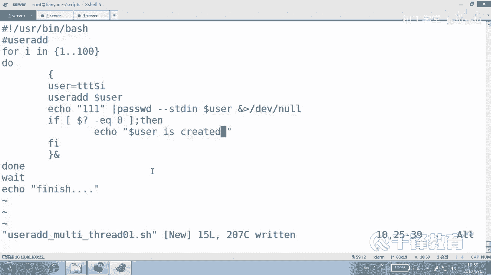

必发执行，原来我们好像没有这么干过哈。😊。

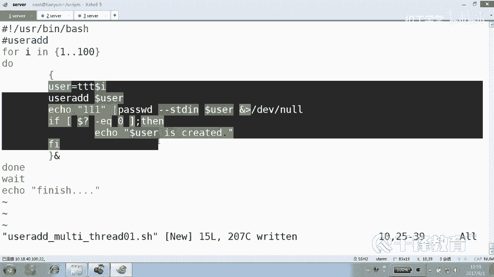

批发执行100个不多吧。100个不多，对不对？好的，请看屏幕啊。😊，USC加ADD什么marRT user。加上一个执行权限。好，请看大屏幕。好像没有什么问题是吧？不要。挺好的。这速度挺快啊。100个。

你来。这我这个机器完全扛得住啊。好吧，没关系，考考个一个。😊，啊。考个一个这个轻量级的小机器，192168。12点多少？那机器有多少来着？46好吧，46考到它的root下去。然后连到。192168。

12。46，这个机器脚本在这儿执行一下这个脚本。100个看来是完全没挑战啊。对对对1000个好家伙。就出了100个计并发他他没问题。你0是吧。嗯。各位拼了拼一个拼IP的话，也无非就是一个网段。

200多个吧。😡，但是有些事情。处理起来可能。达到上千或者更多的。更多的处理。我们再来试一下。这这这个程度现在。说好有问题的。而且我还见到的就是它有问题的话，它明显就报错。看报错了，看到吗？

是不是有问题啊？😊，就是你不能够你并发这个想法是没有错，但是不能无限制并发，看到吗？😡，是不能无限制变吧。有些进程他不能够像这样去狂灭吧。对。明白吗？因为。好吧，后面还得出来，被我刚刚干掉了几个是吧？

😊，我们现在整个并发的数量还比较少，所以一般可能看不到这个问题。如果说呢。这个必发数量比较多的话呢。有可能就会有问题。所以我的意思是说。你看我们刚才循环式循环100次或者1000次或者1万次是吧？

你要是不不去给他控制的话，它就可以给你并发1万次。😊，实际上我们知道那是那是有问题的，能明白吗？😡，不家知道我想说什么吗？😡，我们想控制什么并发的数量。那么传统的这种并发的方式。并发的方式。

是有一些问题的。因为。你一旦写到这个并发的数量，写相应的这一个数量的话，那么他在执行的时候就会你看开一个进程，放到后台，开一个放到后台，开一个放到放到后台。他可不管前面那个结束没结束吧。

他开了可能同一时间可能开不了1000个，因为在开的时候，前面有可能已经有结束的了，是吧？可能同一时间开的数量其实也是有限制的。😊，所以我们可以去控制并发的数量。明白意思吗？好。

那么这个当然不是说一定要这么做，就是我们给大家一个选项，可以去做这个并发的什么控制。

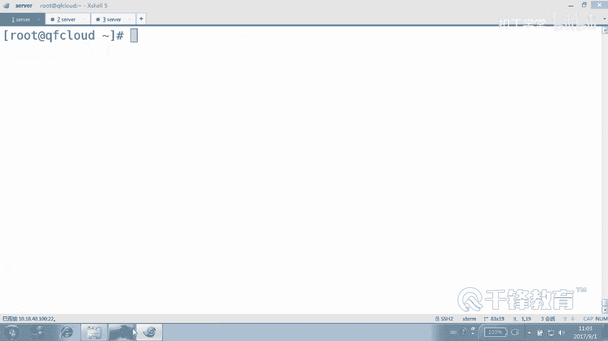

那怎样做并发控制呢？我们得先回顾一下，我们在前面学过内容。

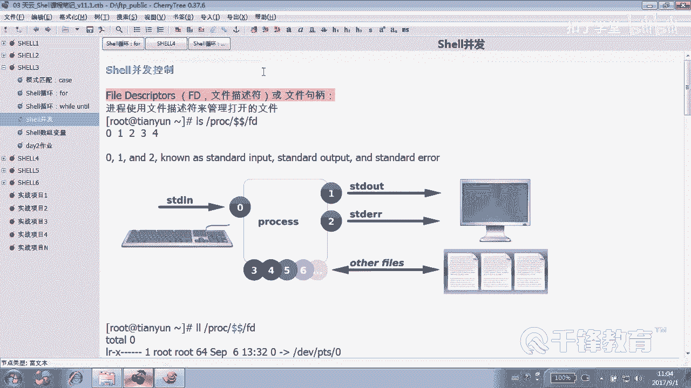

就是你默认情况下，你是控制不了的，看到吗？你你没法控制啊。😡，你写了这么多，你除非你不写这个后台服，那他就没问题，他是不是一个一个直接？😊，但是我们需要的是它并发，但是可能又不能够让他什么。😡。

我们说先来一批人，100个或者50个，完了以后再再来一批。😊，再来一批，是不是这样子去适当的控控制病发的数量。好，那我们先先要回顾一下我们在前面学的内容。

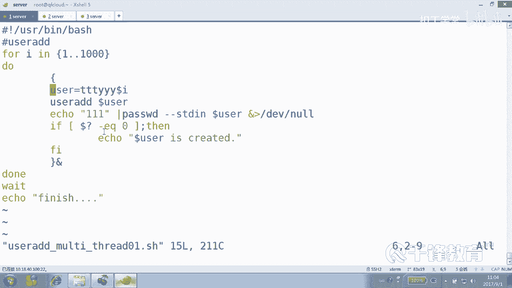

一个是文件描述服务，一个是。管道的概念。各位应该知道我们的每个进程呃，文件描述符合文件具品这个概念。我不想再特别强调，好吧，大家知道每一个进程在运行的过程当中会打开一些文件是吧？

会给每一个文件一个数字标识，而这个标识呢就是我们所说的FD文件。😊，描述服对不对？只要是这个文件是处于被打开的状态，比如被写的状态。那么。描述符是一直是保存的，直到把这个文件关闭，或者把描述符释放。

也或者是把文件句柄释放，明白。

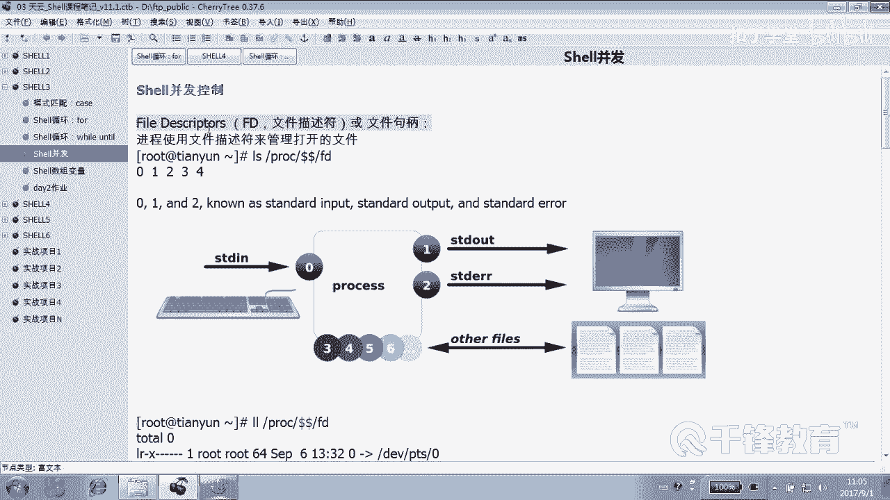

那每一个进程。这个怎么看文件描述否责哪个地方，应该还记得吧。😡，是不是在PLC下的进程的ID目录下的一个叫FD的目录里面。能听懂吗？那有人问我说do叨什么意思？

当前进程当前进程PID那我们不一定看dollar dollar。

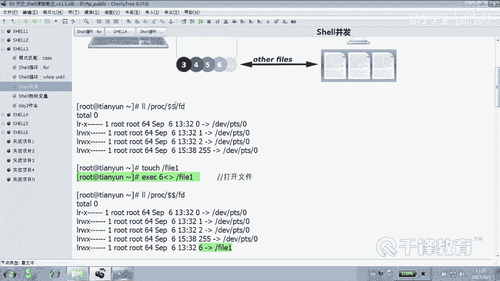

好，你看我们看。😊，回到这边啊，我们看当前进程的FD下面一共打开了几个文件，现在。😊，三个是不是有三个描述符？

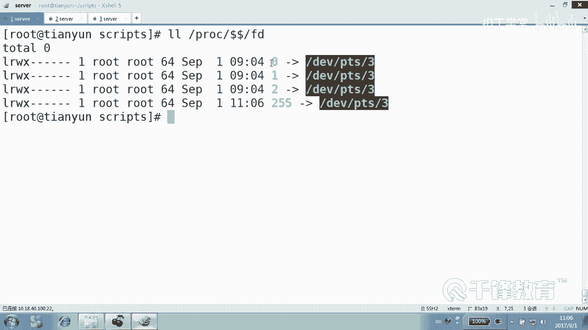

那我们打开一个可以吗？好，我们可以我们创建一个什么。😊。

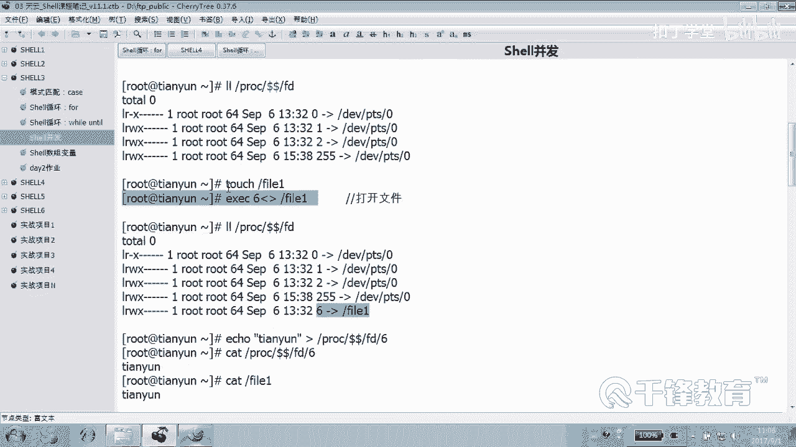

一个比如说在根下创一个fell一的文件，内容肯定是空的吧。然后用哪个命令呢？用EXEC描述符6，这个是自己控制的，只要这边没有6，没有占用，好吧。

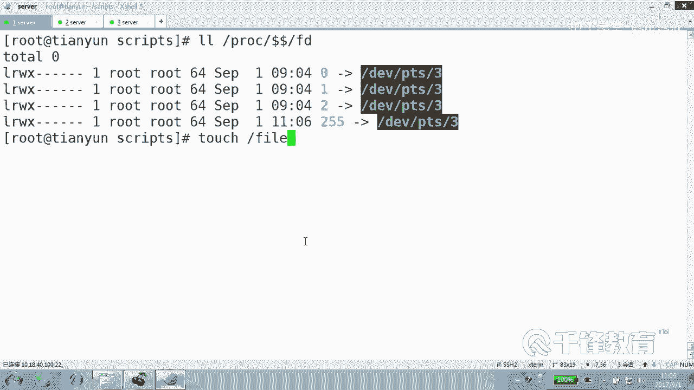

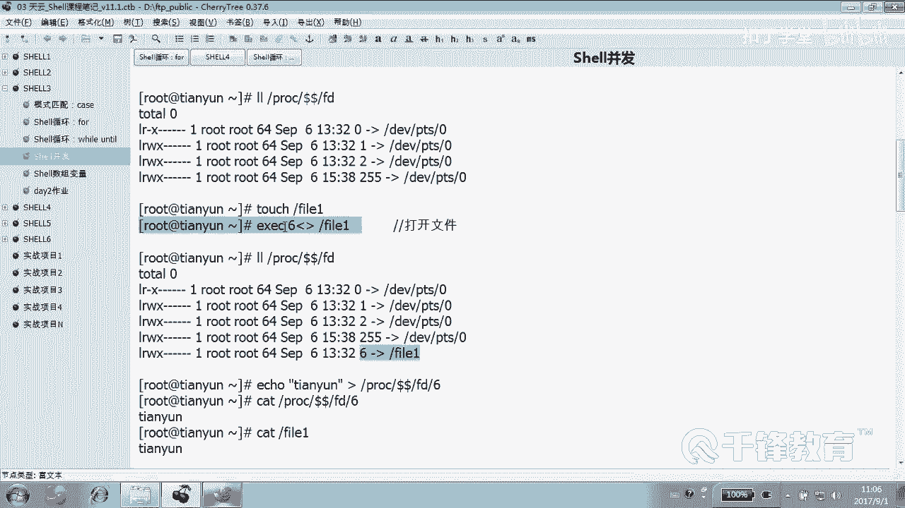

EXCC6文件描述符。6、然后打开哪个文件，跟下的fi一。就是是不是在我当前进程打开了这样一个文件。所以你再看呢。😊，是不是多了一个秒述符啊？就是我当前进程又开了一个又打开了一个文件。

我我手动的给它定义了描述不是几。😊，6啊。注意到了吗？明白吗？

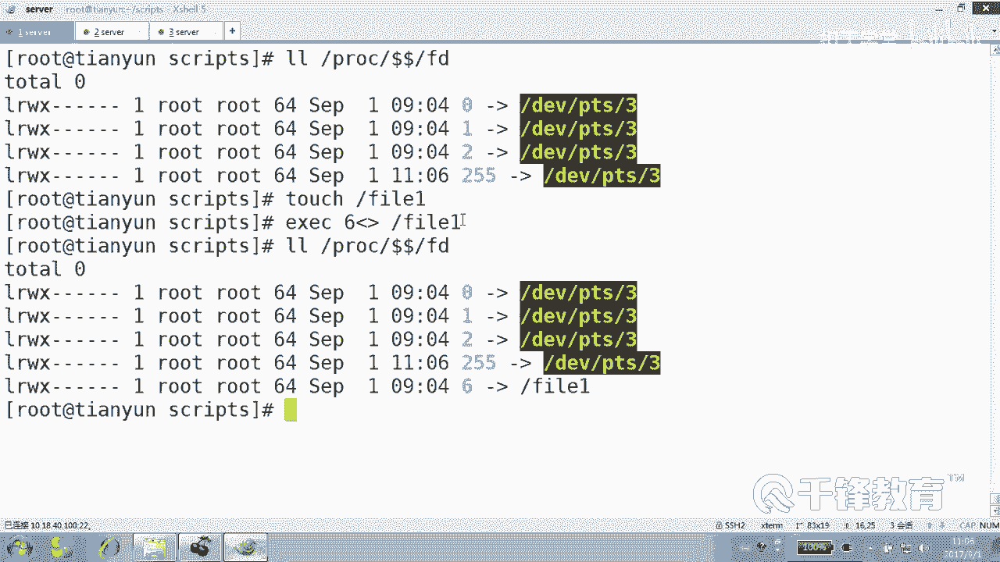

好。然后紧接着呢。我呢把这个文件呢，我要改这个文件，我要修改这个文件。其实系统啊在修改的时候，它它改的是描述符，而不是文件名字。你看我往我往这个六里面。😊，6它然也是一个文件。

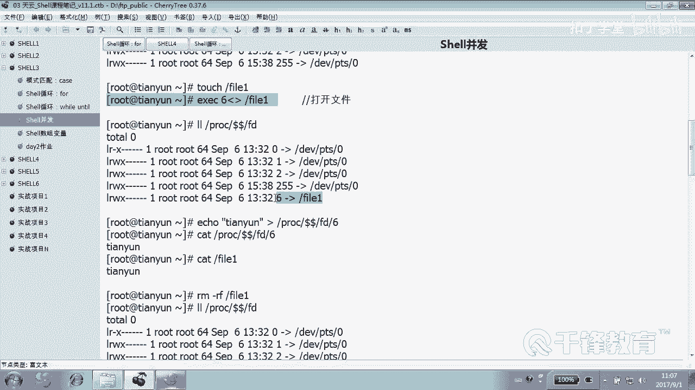

里面写点内容。往那个哪个地方？6、写1个111一行加到哪个地方去？PC就直接叨了叨了吧，是不可以啊？哪个FD下的哪个文件六里面，你看啊现在看一下跟下的fill一是不是有内容啊，那肯定有了，对不对？😊。

农民吗归。

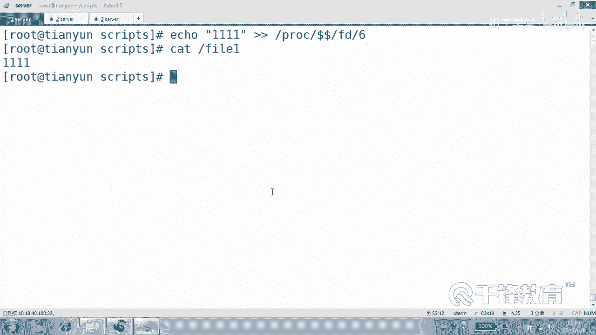

好，弄明白。那如果我现在要把这个文件删了呢？

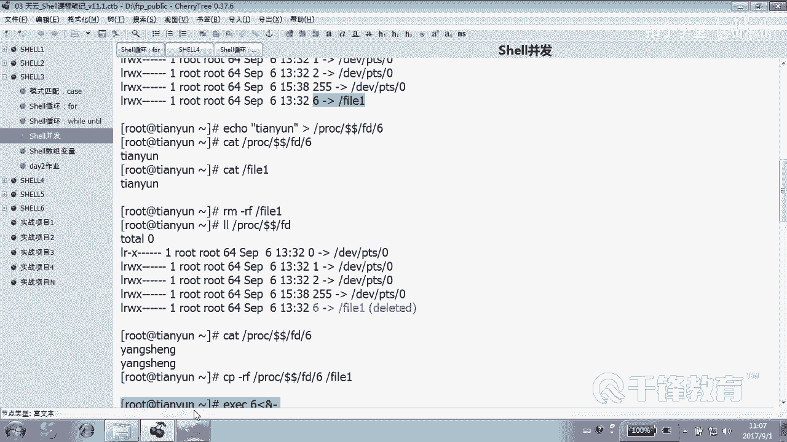

哦，不是把这个叫fi什么13的呢。😊，各位，我删的时候，请问大家文件居名有释放了吗？我们只是EXC是不是打开了，没有释放。所以它的这个这里面还有一个6，但是处于已经被。删除的这样一个状态，注意到了吗？

对呀，这个我们曾经见过吧，还记得吗？我们曾经是不是见过这这样的一个效果。那现在如果把这个POC下的dollar dollar下的FD6拷出来，考成跟下的fa一，这个文件是不是又回来了？😊，回来了吗？

是不回来了？因为这个文件具笔没有释放。那这个文件内容呢就一直还在。好，那这是我们之前讲过的概念，我们之前还用过一个叫LSOF。😊。

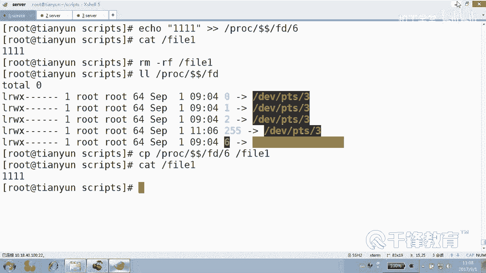

去列出打开的文件是吧？好，看拷贝过去就可以了。

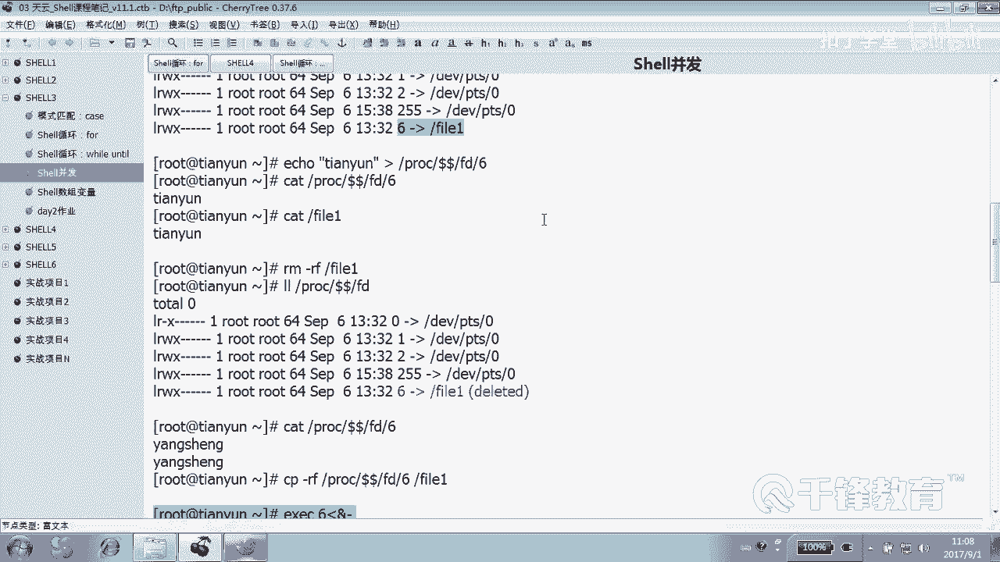

好，考的时候最好不要加这个RF啊，不要加这个RF直接考就行。

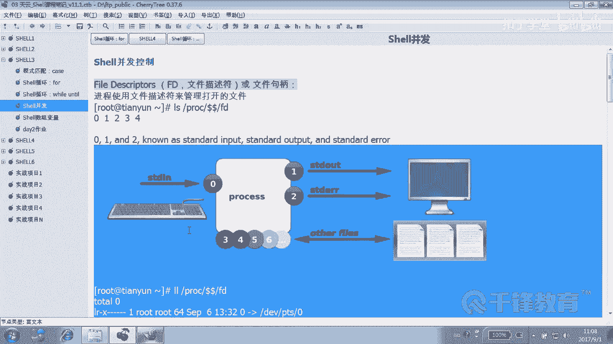

当然有打开就有什么。关闭这个是打开一个文件，而这个是关闭一个文件。6加号描述符啊，减号，我们再来看一下。

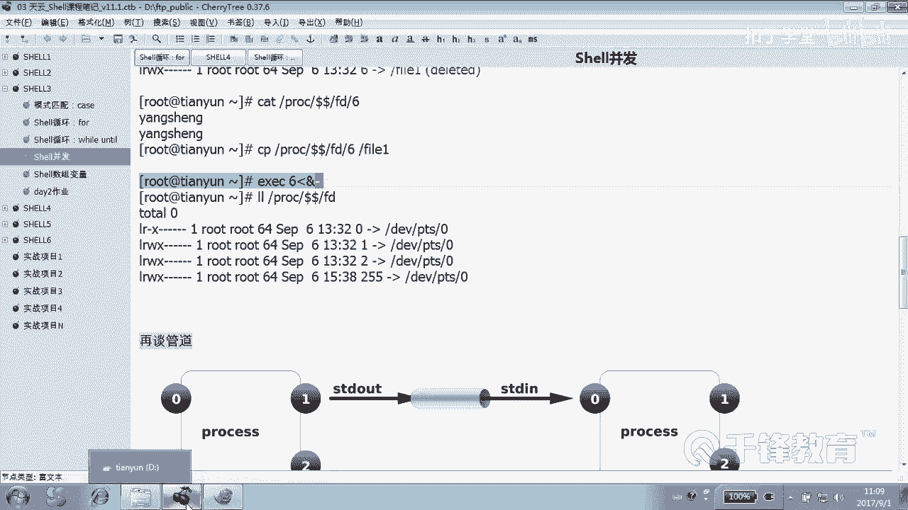

EXEC好，但然如果现在再看看这个文件。这个。怎么还是显示被删除啊？😡，啊。那个文件不是有了吗？😡，文件虽然说有了，但是那文件的那个。我们说每一个文件会有一个i load的编号。

这个肯定不是之前那个文件，明白吗？因为一个新文件都会有一个重新会有一个新的I load的编号。因为它打开的那个文件啊。😊，L的编号已变了。明白吗？所以显示被删除也正常的。好，那怎么关闭？😊。

6、间号什么？关闭当前进程的这个文件距离6释放量。我们再看一下，这里面就没有了，对不对？

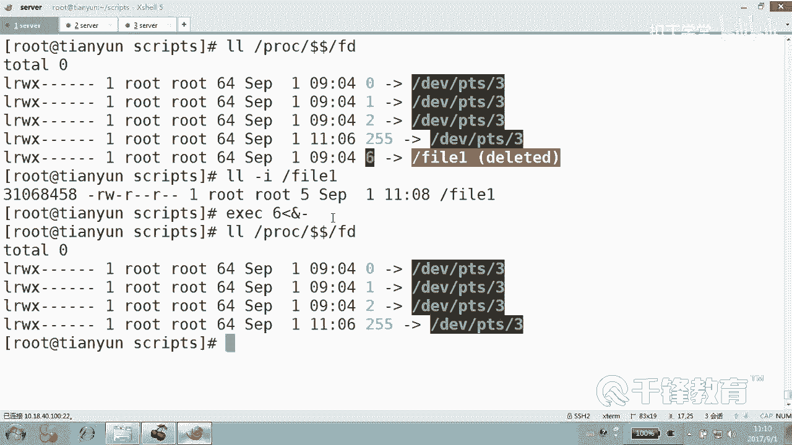

好，这边给大家讲的是什么呢？就是如何去打开一个文件，用EXCC。😊，文件描述符对吧？后面给一个文件，以及怎么去什么关闭一个文件。好，因为我们今天的并发是要借助于这个概念和机制才能够讲并发的。

讲这种这种并发的数量的。好。我们再来讲一个知识。因为要用到这两个知识，一个是描述符的概念，一个是什么？管道的概念。啊，描述符这边你就记住一件事儿，就是。这什么事啊？就是。打开怎么打开？

EXC描述符的编号，后面加一个什么两个间号，打开一个文件吧，关闭是这么关闭吧。😊，另外还有一件事情是什么？你要知道三件事儿，怎么打开一个文件。第二，怎么关闭一个描怎么打开一个文件。

然后怎么去释放一个描述符。你还要掌握的一件事是什么呢？😊，哎。如果一个文件的聚比没有被释放，就算把文件删了有没有影响？内容还在不在？😡，在好，你把这件事情记住就行了。😊，就是三件事儿，一怎么打开。

通过EICC打开一个描述符，打开一个文件，给它一个描述符。第二，怎么释放文件距离。第三。😊，如果一个稳定的距比没有被释放。或者是描述符没有被释放。然后怎么办？就算是把文件删了。那个文件描述符依然在。

好不好？好，如果这块呢觉得听不懂。那就是前面我们讲的linux基础部分。明白吗？我们讲的基础可不是那种纯基础啊，明白吗？好这是一个概念。😊，这个地方要掌握什么？要掌握三个点。一、如何EXCC去。

打开一个什么一个文件。然后第二个是呢如何通过ESCC去。关闭。关闭一个什么。文件应该说就是说准确点就是释放什么。释放文件的。区比是不是？还有一个就是。当一个文件处以被什么呃，当。当一个文件的FD。

违背什么？😡，释放的情况下。会被释放。删除。原文件。是是吧，也。也不会。影响这个什么我们的FD。就是我们的文件还在好不好？记住这三件事情，因为这是我们要用到的。😊。

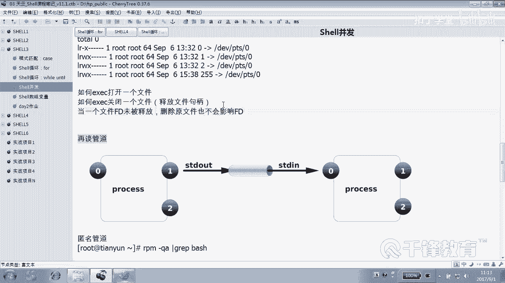

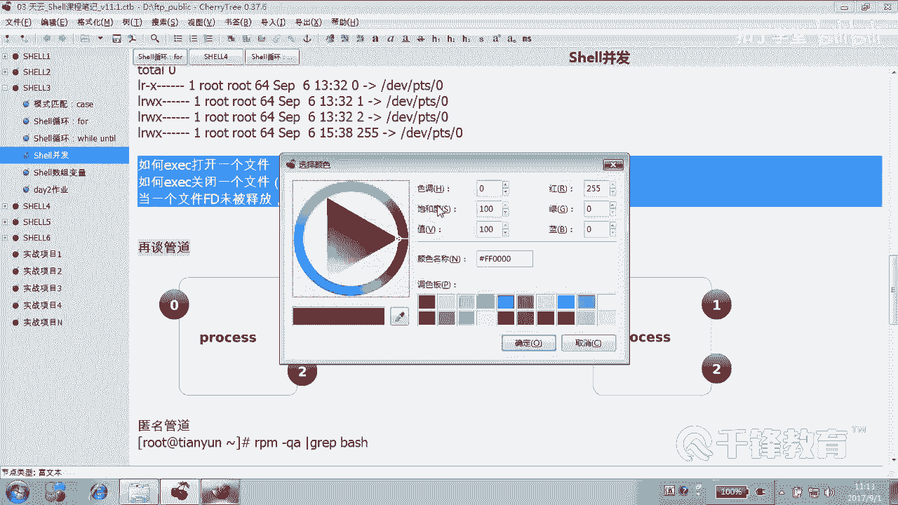

好，那然后紧接着再谈管道。我记得之前跟你们讲过一件事儿，就是我们说。😊。

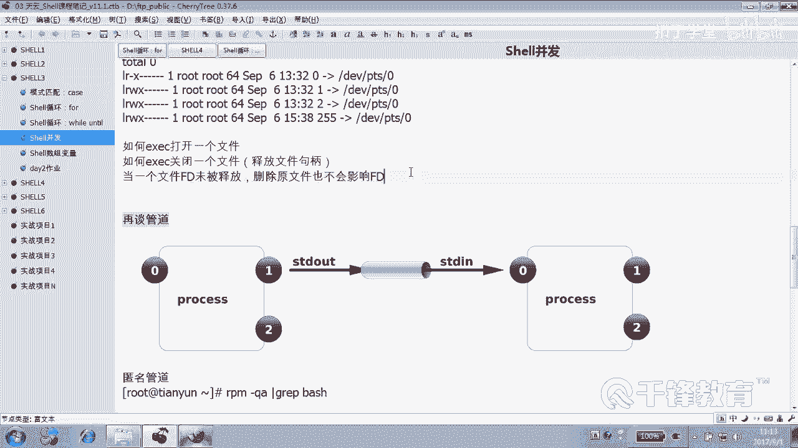

这个。L cut。呃，比如LLDV下的这个东西，然后过滤一下SDA好，这是管道吧。什么叫管道？就是第一个进程产生的输出，通过管道输给什么？另外一个文件。但是这里各位这个管道这个东西我们有看见吗？😊。

那它是个什么东西呢？😡，它也是个文件，知道吗？那管道这种它有什么特征？管道和常规文件有什么特征，什么区别，你能想到吗？😊，就是一个管道，管道是个文件，它跟常规文件有什么区别？😡，常规文件就是你看多少次。

你看你cut一次，看完以后，你再看它还有看到吗？😡，明白意思吗？就是你怎么看怎么拦，它还有你又没有删嘛，而管道不是管道是什么？😡，用这是。你放到里面去以后。你看了你用了就没了。O。

那我们刚刚讲了这个管道也是一个文件，但是你没看见，因为我们没有专门去创建一个所谓的管道文件。😊。

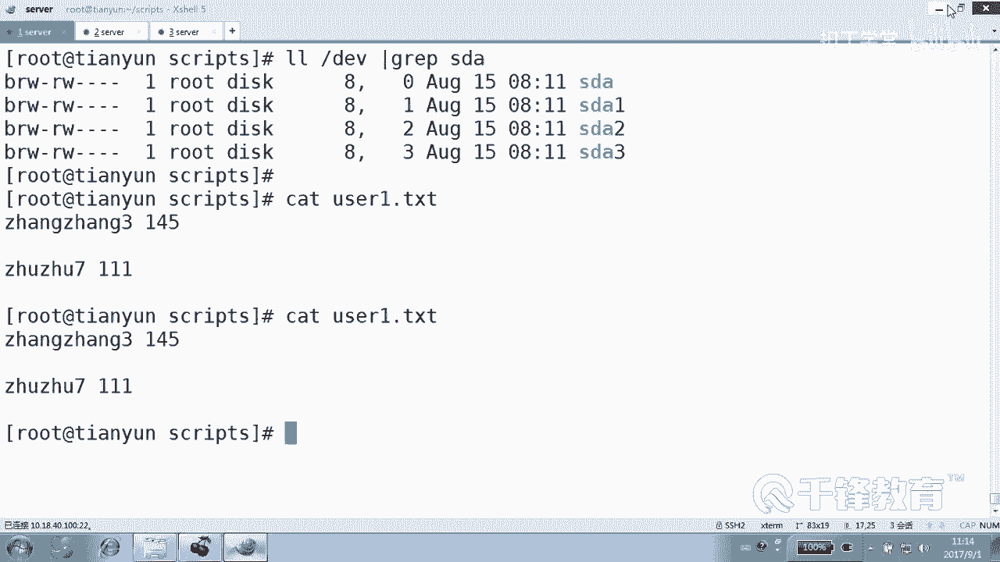

那么这种管道叫什么？管道叫匿名管道，就是没有名儿的。😡，你看无论是我们RPM杠QA过滤一下bash这个管道这个管道的文件其实在只在我们的心目中存在，根本你没有看到有一个什么所谓的管道。😊。

但另外一个管道叫什么？管道叫匿名管道，还记得MKfi吗？管道它的特征，除了你看了它就没有了。另外它还有一句话叫做first input。 first output叫先进先出。😊，先进去的一定是什么？

先放到里面个一再放个2，那你看一定是肯先看一再看2。😊，看完就没了，拿到就没了。管道里面东西一旦被别人拿拿走了就没了，看到吗？它不是永恒存在的。😊，好，你看我们在这儿建立一个管道，建立一个管道。

我们做什么事情呢？😊。

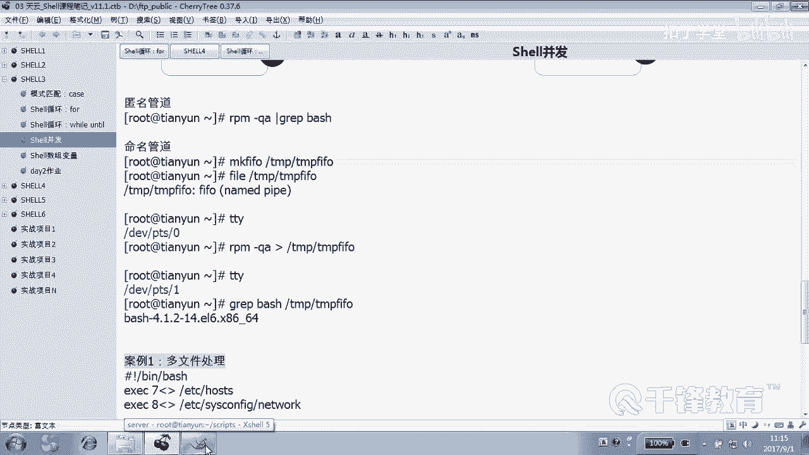

我们在这边呢。我开几个终端，两个终端。这个终端是这个PDS杠3是吧？这个终端是PDS14。而且我们之前的管道大家应该有印象，是不能跨终端的。明白吗？就是你只能在同一个终端商使用。

但如果说你想要跨终端怎么办？那叫什么？我们叫。叫这个名字吧，好吧。好。怎么看类型？这是不是一个file匿名管道归匿名管道啊，就是有名字的。什么叫匿名？这这不就是名儿吗？是不是有名字的管道。

但是它不是常规文件。😊，它有具备两个特征，一、先进先出的特征。第二。管道的数据不是说永恒存在的，是你读完以后就没了，好吧。它不是常规文件，所以你要是看内容呢，它肯定也是。也是这样看有没有内容。没有啊。

好，现在你看啊我找一个终端。😊，过滤一下里面有没有什么STA的，有没有哪个文件？😊，天僻下的fial有没有？为什么还为什么现在没有？😡，因为那管道里面没有东西，看到吗？是不没有东西啊？那怎么弄呢？

我们在这边去干嘛？LL。什么。DV，然后给重立向到哪儿去？从逆向到我们的。那个管道文件TNPfi里面去看到吗？哎，是不是？看这边是不是还在等啊，说给我给我给我。😊，这边回车那边就拿到了，看到吗？

它管道我们借助于管道来干嘛？就是一个程序的一个进程的输出，作为下个进程的输入，是不是？😊，那他是不是就是等着半天啊，在这儿他缺少输入啊。😡，OK那这边我不是需要输入，是它里面它这个管道里面现在没有东西。

那有人说现在再看还有吗？😊，没了不可能有啊，除非我们再往管道里面装，看到吗？再装忘就有。😊，这是管道特征。管道也是一个文件。

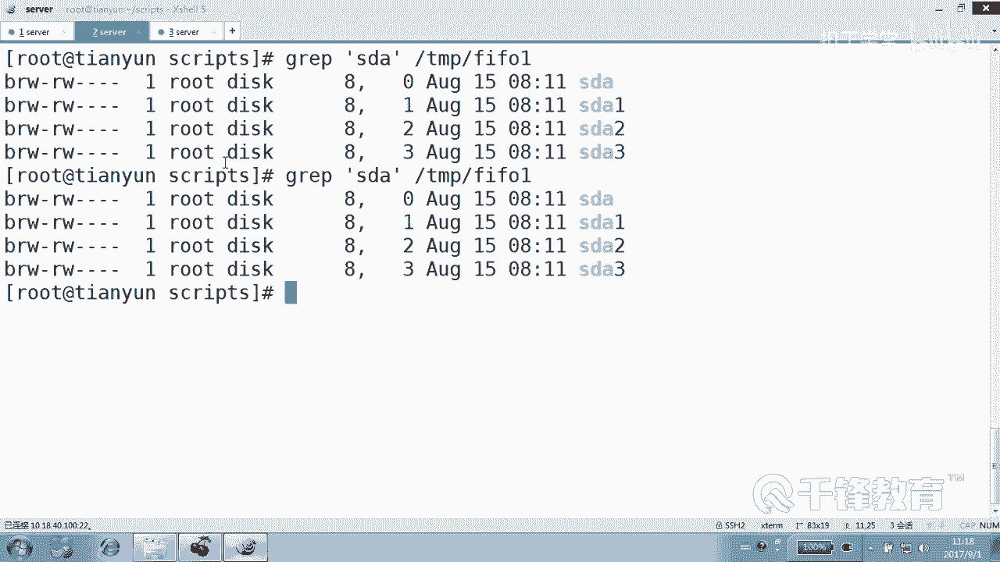

你看。进程A进程A输出的东西输到哪个文件里面去。管道文件里面去进程B从里面去什么去取。😊，但是呢我们以前讲到的管道叫匿名管道，它只能在一个终端。什么叫一个终端？

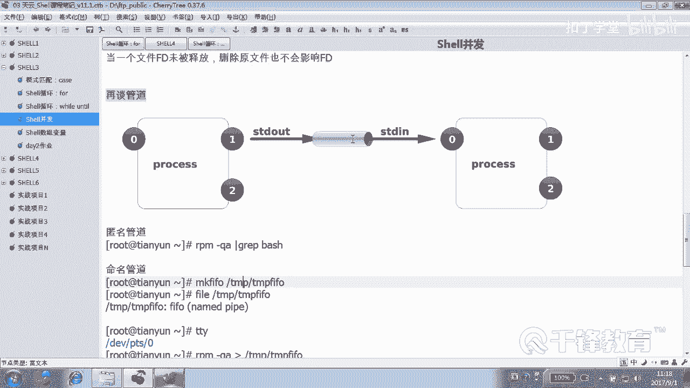

像这种管道，你看。是不是就一个终端上玩的？😡，是不是在同一个终端？那你要跨终端呢，两个进程嗯，秘密管道秘密管道做不到呃，怎么做？😊，创建，你一切要管道玩的东西都可以创建秘密管道来玩。看到吗？

我只要去关注这个文件是不是就可以了？管道本身是不是也是个文件？😊。

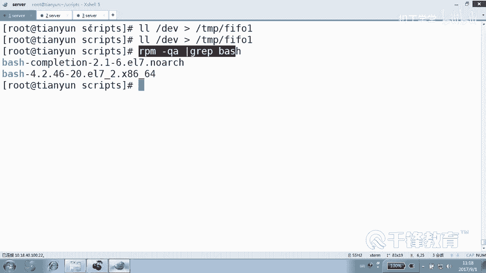

听懂了吗？各位。好的，那这就是我们要用到的两个什么基本的。概念一个叫文件描述符，一个是管道的概念。这是我们要实现什么并发的控制的一个。

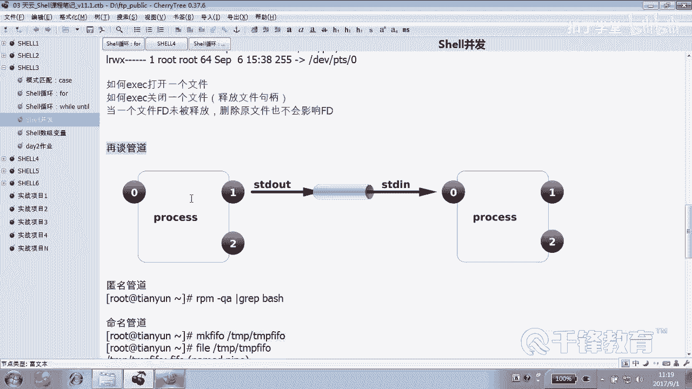

基础吧，对不对？好，我们讲到的并发不是那种并发，是什么？我们要控制并发。😊，的数量，而不是让它无限制的这种蔓延。

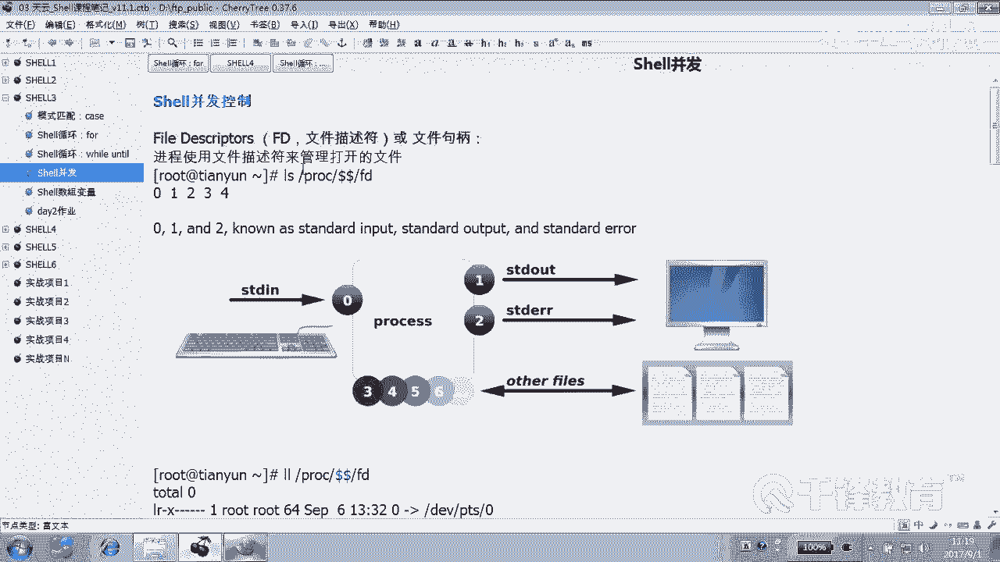

能灭吗？