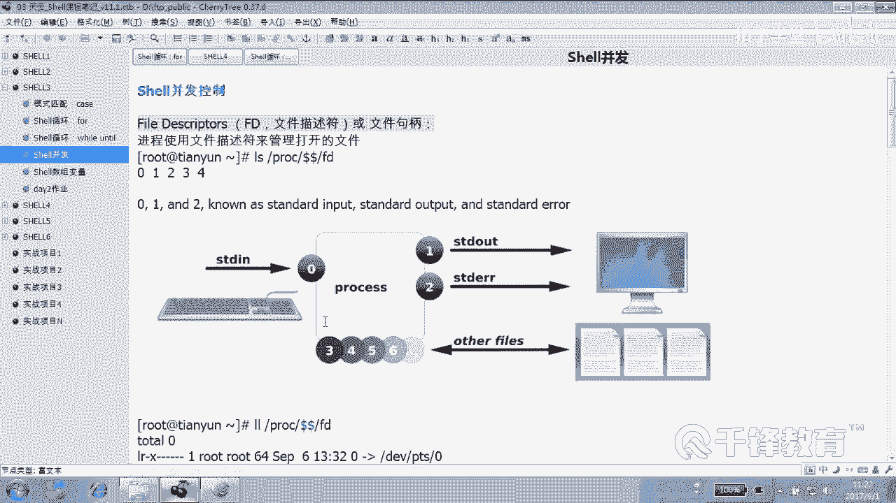
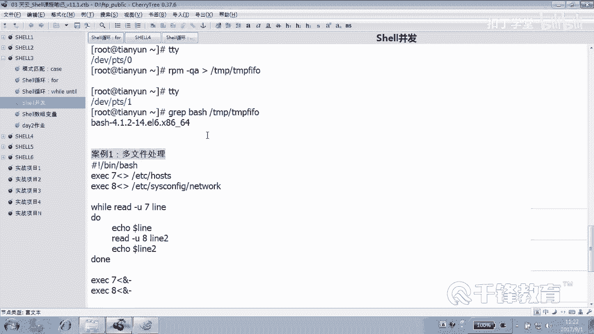
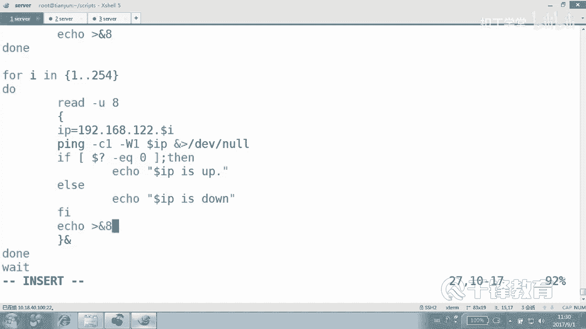
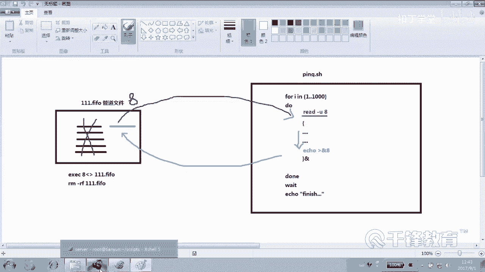
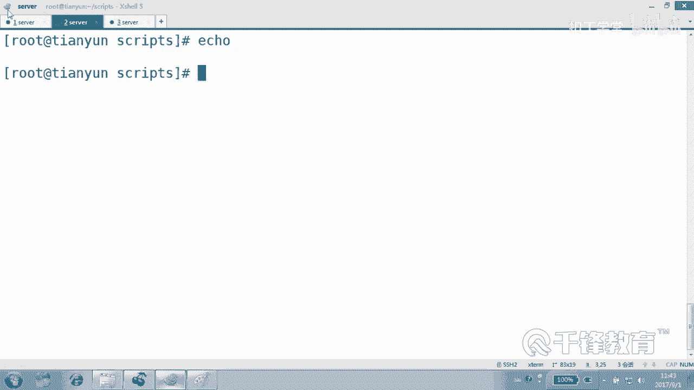
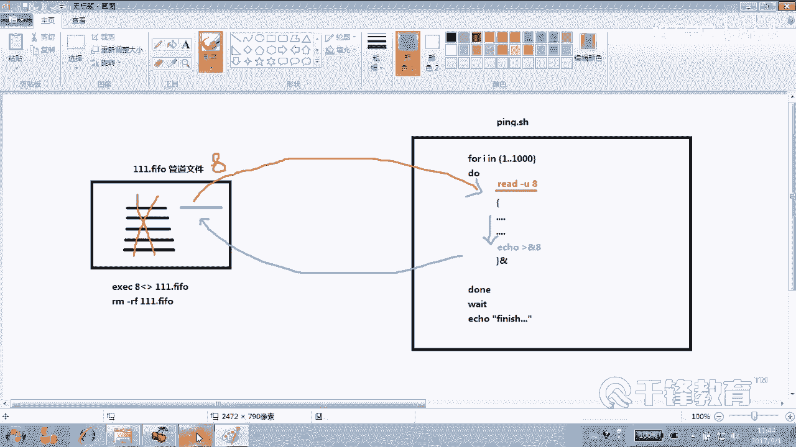
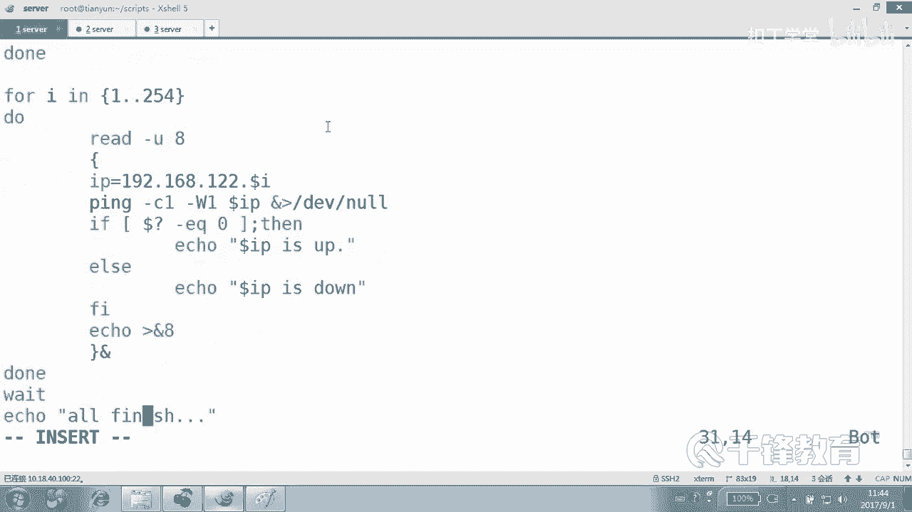
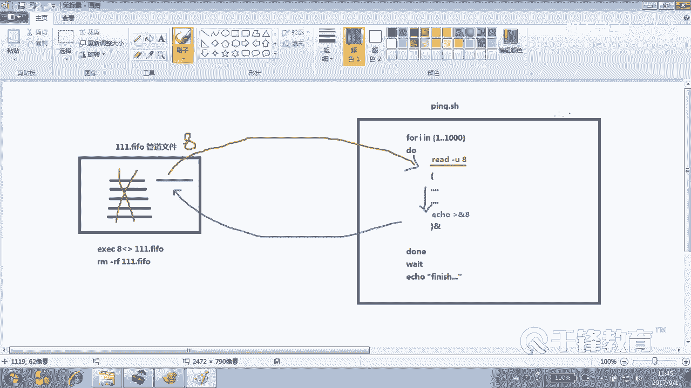
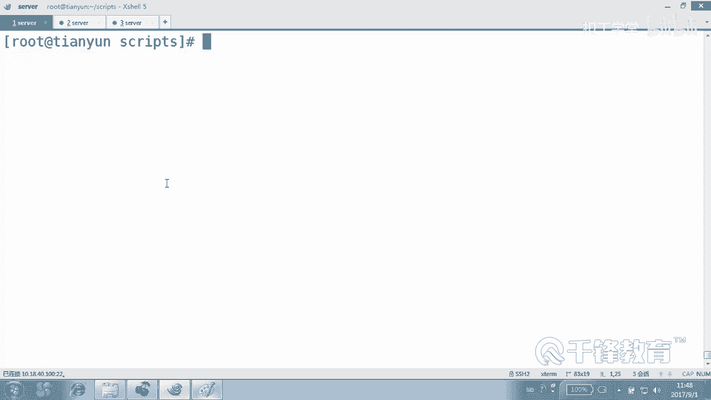
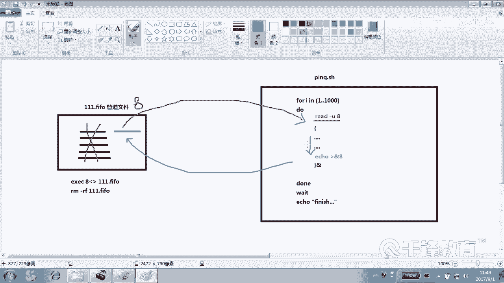

# 千锋扣丁学堂Linux云计算系列：Shell脚本自动化编程实战视频教程 - P32：4.15 shell 并发控制项目实战 - 扣丁学堂 - BV1SE411q7vK

对。呃，在前面我们了解了，我们要实现这种并发 shellll的并发控制的这样一些基础概念，像什么？文件描述符怎么打开一个文件，怎么释放一个描述符？对吧还有呢怎么创建一个秘密管道。😊，还有一些管道的特征。

是不是先进先出这样一特征，而且管道就是鎏金，一旦鎏金就没了就过去了，是不是读道就没有了，不会再。😊，一直像文件那样去还存在里面内容。好，那下面如何来控制这个事情呢？😊。

如何来利用这些机制来完成我们的并发呢？这边呢也就不卖关子啊，这边我直接给出一个例子。😊。

好，各位看一下这个例子，能不能看懂？哦，这个这是多文件处理，不是这个例子，例子是例2和例3在这没有写出来啊，这是另外一个例子，抱歉抱歉啊，这个还还还暂时看不懂。😊。

那这是什么概念呢？我这边说一下，我说一下原原原理啊。或者我来边写，然后写完要边再解释一下。因为这个例子有点有点稍微有点长。刚才是第一个P程序是吧？叫做。刚刚那个脚本叫什么？🎼哦，对。

copy一下pin marty three变成。pinm marty three变成02。就是前面那个并发是完全没有控制的，就是让它无限制的蔓延那种一种状态是吧？现在的并发是要控制的，怎么控制呢？

大概的脚本肯定还是这个。这样。我们通不通都都展示，像刚才一样。怎么写呢？这个是我们的02脚本是吧？多并发的脚本。😊，首先各位我们定义一些变量。比如说我们定义下这个。哎。并发的数量，假如说是5，好吧。

注意这里没有关键词，这里这个threet是现成的意思啊，但是我们取了它的名字，但实际上我们知道这里并不是现成，而是。😊，进程的数量就这么叫吧，好吧。😊，伪伪叫法也可以。然后我们要利用管道。

我们创建一个管道文件。file file是什么呢？是在TNP下面创建一个管道文件叫做。呃，这样啊。这个管道文件你肯定不能和别人的名字冲突嘛，是吧？所以我们就定义了一个在天陛下以当前什么。😊。

PID来命名的一个fival，这是不是肯定一般不会跟别人冲突啊？然后紧接着我们来创建这样一个。F腐创业谁到了。好，这名字起的好长啊，起长了点。😊，然后紧接着呢把它给打开，还记得打开吗？给它一个描述符吧。

比如比方说那个8描述符。😊，打开哪个文件？Dollar TNP。fi。fill然后紧接着呢把这个文件删掉。有人说怎么打创意，刚创建完以后打开又删掉呢？😊，各位，我们很清楚，删掉是不影响的，对不对？

删掉重然是删掉了，但是是不影响那个。描述符的那个8还在。那么林总。这段至好能看懂吗？虽然说还没明明没有明白我我的这个原理啊，但是这段奇葩是能看懂，这是我创建了一个管道文件。

然后呢打开了给他的一个描述和扒的一个。😊，编号是吧，然后以及又把它删掉了。但是我们也很清楚，删掉以后不不影响，是不是？😊，好，然后呢。这个。我们往管道里面扔点东西。扔多少扔多少东西呢？

这里我们如果想扔5个东西的话，就一点点什么5循环5次。但是这里呢要要开几个县程或者几个进程。😊，上面有这个定义过呀，这儿改成什么doll。😊，有问题吗？有没有问题？有，因为这里不识别变量，还记得吗？

所以只能采用。Secrets。down看好了，ele。往这个。描述符几。8里面。扔点东西。好，现在我操作的就不是文件喽，而是什么文件描述符。8看了吗？好，有同学说不对啊。

是不是不是不是在PLC下的什么地方吗？这个可以相当于简写了。😊，艾艾8就指的是什么？😡，文件描述好吧。明白。好说这是干什么？这是我创建的一个管道文件是吧？然后往里面呢扔了8个回车。

我并没有扔的是什么实性有用的东西，我就扔了8个回车进去，看到吗？😊，这个文件里面有8个回车，然后紧接着我们要循环吧循环。😊，干什么事呢？以前是不是上来就放把它放到后台去？😡，现在不是了。

而是这样子read。好，我们认识一下read这个命令，read杠杠hp。他有一个杠。杠U的一个选项，后面跟的是文件描述符，看到吗？好，杠U。哪个读哪个比较舒服？8。好了，各位大家现在要倾楚一件事儿。

什么事情呢？😊，现在这个循环就不是想循就循了。就是你哥们儿你能读到。😡，你就学读不到，你甭寻。你看瑞的这个命令如果不下去，这个会走吗？😡，不会，那read下它读的是哪儿？你给我记住，这里面有几个东西。

现在。有88个，这里面有什么东西不重要，好吧，内容不重要。😡，无论是里面有空内容，是换行符还是有点内容，这都不重要，重要的是有有几个。有8个，然后有8个，就是你不是想循环吗？你得先怎么做？😡，读一个U。

注意这步，这里U表示后面接着是文件描述符，看到吗？从哪个文件里面读。从描述符里面读八里面读，你要是读不到，你就循环读不到了。你就等着。你直到独到为止。有人说那一开始有8个是吧？😡。

那读一个是不是就少一个啊？😡，那我们想一下有。😊，5个有有5个，sorry，说错了，你开始我们给的是5个是吧？😡，给是5个好，一开始有5个有5描述58，有5个读一个，是不是少一个？😊。

那他读一个嗯可以循环，第二次变成二的时候，这个循环。第二次变成二的时候又读一个循环，变成5的时候循环的时候又读一个循环。那各位循环的跟6次的时候，还有那个读吗？😊，那就循环不下去了，就等着了。在这儿。

能听明吗？就说白了，你从那个秒从那个管道里面拿不到东西，你就没有入场券。😡，你就没有办法开始循环。但是有一句话叫做。好借好还。再接不难。借了不还。就这句话明白吗？就意思是说你不能老拿，你得还呀。

你用完以后你得什么？😡，还啊，怎么还呢？😡，在我们这个循环结束什么时候还？我走的时候还哦，不是释放这里。我往里面往哪个往那个八里面再加一个。哦，不是描述-8里面再再什么加一个。

可能各位还是没看明白这个意思。没关系，我给你画个图好吧，现在就可以画图了。现在我们这边有一个循环。😊。

这边这个是循环。这边呢是一个管道文件，看到吗？来看别别说话。😊，看这边是我们的管道文件，管道文件叫什么名呢？不重要吧，比就叫做TMP点。😊，比如叫111点fgo吧。好不好？是不是有管道文件？😊，嗯。

管道文件是不是这样子？这边呢我们是不是写了一个所谓的for循环for循环，然后in forI in什么？😊，然后假装吧。1到多少1000好吗？1到1000。然后。度。到。😡，然后原来是不是这样写的。

一个大括号。😊，他过去哪了？按子。是不是原来是这样写的？哎呦还了个ESA一切都结束了。😊，哎呦，我伤伤感了，这个是。哎呀。嗯什么来着？1到1000。嗯。这个一气呵成啊，这个因为。😊，杜。到。大括号。

当中要循环干什么呢，我能不写吗？😡，可以不写吧。😊，然后。大哥。艾特。原来我记得是这样干的吧，原来。😊，原来是不是这样干的，原来最后在结束的时候wait是吧？😊，为这家伙还是他想上场的机会。

他想上场还还早的很呢。😊，好，原来我记得是这么干的。😊，明白意思吗？是不是上了就可以循环。😊，1000个他有可能有可能必发1000个吧，现在不行了。现在是怎么做？这里面有有几个有几行，现在。😊。

有我们在这个文件里面一开始初始扔了几行。初始是不是扔了5行。你管他五行是啥玩意儿呢？我就扔了5个回车，看到吗？怎么往里面扔5个回车，我觉得很容易循环5次，刚刚刚刚进去了。😊。

这个管道的管管道我们打开的这个文件，我们打开的是候怎么打开的，是不是ELCC给了个解？😊，我放这给了个8哪个文件，这上面那个11点什么fi文件。😊，然后我比较狠，就把八又把这个文件给。删掉了。

你这这这这事儿做的。山是删掉了，但管道还没有释放，好不好？啊，不是但那个什么。文件的描述符或者剧品还没有释放。记住我里面有几个。各位，这两个文件是不是按理讲是风马牛不相提的两个文件。

现在他俩之间都没有介绍人，看到吗？😊，没有关系啊。他说你跟我有啥关系啊，是没有关系啊，确实没关系。我现在呢加了个关系，我说兄弟，你要想在这循环，你得去拿那个什么READ杠U从哪了啊？😊，8明白吗。

是不是我加了这哈。😊，在哪加的，在循环开始之前加的，看了吗？这个时候他俩之间是不是有关系呢？😡，意思就是说我要想要执行，我需要先去那边什么？我去去读一个读一行过来，我从哪个文件里面呢？😡。

描述符为8的这个文件里面拿read，大家知道read这家伙是读不到就不罢休的吧。😊，我们以前readd是不是从键盘读，现在从哪儿读？😊，从一个文件描述符里面读U啊，是不是FD里面读各位，我们试想一下。

它是第一次循环，它能读到吗？😊，那前前五次循环是不是都能读到？因为里面有一共有5个，我们知道管道这东西可是独一个就少一个啊。😊，明白吗？所以我们理由理由相信前五个循环亏夸夸夸夸夸5个就开始了。😊。

然后读完以后，这这些东西是不是就。就没了。5个拿完以后是不是没了？那有人循华到第六次的时候再读。就读不下去了，就卡那了，永远就不会来了。😊，那我们讲了，既然你借走一个。你读了一个。

那你在最后你你这个循环都已经什么？😡，结束了，就是你这一次循环都已经结束，你把任何命令都完成了，你是不是应该往那个哪个地方往那个文件描述不解，把里面又扔一个回去啊。啊。效果是一样的。不一样吗？不是。

这是什么时候你还过去的？😡，你把你的事情做完以后，你还回去的，我们不在乎你还什么，我不在乎你还什么。你刚刚借了个凳子，你先还个板凳都可以。我要的是那里面有东西，你看你用完了以后，那你又什么？😊。

你原来是不是你五个都没有了，那你又还了一个蓝色的进去。😊，那下一个人是不是有机会再读到啊？看到这个思想了吗？就是你要想循环得干嘛？得去那个管那个管道文件里面读一个。就是能读成功，我不在问你读什么，好吧。

你要读成功。😡，读成功呢，你有资格循环。但是你记住，你要是老借只借不还，那这里面就空了。人家就没有小凳子坐了，看到吗？等你做完以后，你再把这个小凳子什么。像这样。这是环轨。这个朝朝这个箭头。

这是朝这个箭头。是还没看懂啊。懂了吗？就是这两个文件本身之间没有没有任何联系。😊，那现在我告诉你说什么。😡，你要想在。想在我这儿这个领领取一个小礼品是吧？你得先去那儿消费一次。这样的话是不是有关系了？

去那消费一次才可以。啊。这个有没有看懂这个原理啊？😊，有没有看懂？看不懂怎么办啊？滚到文件里。对，提问最好了，提问我我解释一下，那捆到我院里面。😊，怎么分工资。管道里面油涛刚有同学问管道里面有什么东西？

有啥都不重要，只要是有行就行。而read大家知道他他读一个文件，他就读的是行，只要能由行读到，我这个条件就为我只要读到。我不在乎我不在乎读的是什么东西，我只要读到我这条命令就会往下走，看到吗？😊。

我其实这儿并不在乎他读的是什么，我在乎的是这个read命令。读到他就不卡住，他读不到，他就在那卡住，知道吗？😡，你看那个1000不是多容易报错吗？对，容易报错。这个并发不是为了处理这个问题。对。

这个我他也是并发，他也是并发，但是这个并发是用来我们可以控制并发的数量，看到吗？那现在这个readd读一个，然后执行一个之后又加一个，他们永远是我们相。不是啊，是这个事情是我做完了，我再加的呀。😡。

我不是说我读一个就立马加，是我的循环里面的代码的执行完了，我已经不会对系统造成任何的伤害了。我走的时候我才会板凳还回去的循循环。😡，有同学有同学问我说，他说这个读一个，然后再还一个，这没有影响啊。

还是什么时候还？😡，我的整个事情，我的整个所有的循环的动作做完了，我才还的。那相当于我这个我这次这个进程就结束了，我才还的，我在死之前还还过去。😊，我觉地球不会有什么什么什么样的影响看。😊，还没开头。

有没有看懂的？有没有理解这个机制的？没有理解的话，我们暂停5分钟看一下。😊，各位有同学说是这样的，5个人玩5个人接完以后是吧，整个用完以后。😊，再来5个人，这是不对的。😡，而是什么？

就像我上次去那个什么那个公园玩那个有船一样，借那个船登船一样，而是有一个船回来，一共就100个船。😊，有一个船回来，立马就有有一个人可以上，看到吗？而不是等了100个船利一波回来再上，那多慢啊。😊。

船就一共100个。😡，能听明白吗？我们假如传你5个好吗？传5个，先有5个人借走了。😡，是不是就没船了？但是有一个人已经到时间回来了呀。😡，那是不是这个船就还了一个进来了，那他还了一个就有人上。

但是始终保持有5个人在玩就行。😊，我还没说明白。😡，那个没有那个看你的情况，这个5个只是我这边给的一个一个值。就到底应该控制几个，这个嗯没没没法定论啊。😊，一看就是你们没有去玩过这样的项目。哎。

我再说一遍。😡，公园里面一共有5个船，5条船好吗？那么是不只能虽现在有排队的有多少人在排？1000人在排队。是不是这样子？那么第一波人。前5个人当当当当是把5跳船接走了。那么这个时候没有人还船。

那第六个人呢就等不等不就没办法读到。明白吗？然后有一个人他可能提前就把这个事他事情做完了，他说他我不登了，我现在我不开船了，我就把这船先还回来。😊，那么这个时候这是不是又就有又有一一个船回来了。

然后第六个人可以什么上。😊，能明白吗？但随时随地只有5条船。只有5个人在玩。不是这还说不明白，我我怎么说呀，我我我我。😡，懂了吗？Ile控格。个玻璃块。回车啊回车服啊。😊，ele往里面扔的东西。

你要是觉得这个ele的东西是没有意义的话，你可以怎么做？😊。

你可以扔点有意义的那都不重要，好吗？😡，你你要是ele本身一个icle就是一个什么？这是一个回车符，看到吗？回收服也算是有货呀。😡。

回车服也算有货，你要觉得挨ical挨扣的没有东西，你没有感觉怎么办？你随便往里面扔一点，扔点书折点草都行。你们下次去公园里面玩船，去去那个那个颐和园去玩一下，你就知道了。那船真的有限的。

就几十就应该就几十个那种电动船。😊，只要我们带了一堆牌。追加啊。追追追加。点我到。那呃你说追加是吗？你这个地方为什么不是追加是吧？管道文件是覆盖不了的。😊。

跟常规文件不一样，管道文件往里面去一个，对前面那个是没有影响的，除非前面那个有人借，有人读走管道文件，你用追加也罢，你用间号也好，没有影响。😊，它不是常规文件，明白吗？我们今天用到的是匿名管道。😊。

Okay。行，你们下次花30块钱去那个看一看。😊，但是那个船是120啊。也算。系多面。哦，对，那个船好像不是120是180，因为120是脚踏船，踏踏踏踏踏的船啊，180那个是电动船。

你可以开一个小时来到你，你就说我不跑了。😊。

う。免费对还有我说后面有没有小鱼，来，我们再捋一下啊，这白个。😊，你去就是为了验证一下杨老师讲的这个多多多必发这个道理，没有别的意思。😊，就是哎看啊来再说一遍，公园的这个地方有5条船。

一开始是不是5条船？😊，不是一开始始终就5条，然后呢，前有1000个人排队。然后呢，前5个人都顺利的拿到了船，所以才可以滑。😊，是吧第六个人呢在等等什么情况呢？他不用等5个人都回来。

他等什么回来一个他就有船，回来一个是不是就还船了。你回来以后你不还船的话，那那后面就没船了啊，你回来你得还船的。😊，能听懂吗？各位啊，行想说说的。别人在看这个视频的话，就觉得你们好幼稚。

就讲了半天还没听明白。😊，肯定不会归功于我讲的问题吧。😊。

好，钻随便钻。好，所以呢你看。😊，先。准备了一个准备了一个公园，就准备了一个公公园的这个这个专门的划船的地方，这是一个管道文件，看到吗？😊，然后把这个文件打开了，用来描述不解。😊，为什么要这么打开？

因为我们后面要用看到吗？我们给了个八打开了，然后为什么删了？因为我们知道删不删都对那个描述符没有影响，因为描述符没有是没有什么没有释放，能听懂吗？然后公园一开始公园呢一开始就买了什么？😊，买了几条船。

5条船，因为three的我们设的是5，你要改成十的话呢，就是买了10条船，好不好？😊，能听懂吗？我然后呢。下面那个循环想循环得有传。那你得先看看有没有船。有船你就寻巡完以后呢，你还船好吧，能听懂吗？好。

那大家都排队等着。最后这有一个问题，这个问题呢倒不是那么重要，但是我们要做，这是原则问题，这是做人的原则问题就是。😊，然后。and什么。减号就是这个是文件描述符，释放一下，明白吗？

这个不是不是管道的事啊，这是释放什么？😊，问你描述服。有打开就应该有释放，明白吗？好的，请看大屏幕。应该不用再再。你要了。看看看。看见吗？一波波出来的，看到吗？你要是觉得看不清楚的话，给给来的更小一点。

几个。😊，两个让你看一是不是一波波出来的。不是你也可以让用户去输入什么。😡，请输入现成的或者进成的什么数量，看两个两个、两个、两个，几乎是这样的吧。是不几乎是这样出来的，它就不可能超过2个。来。

你要是控制10个呢？😡，这不是什么县城啊，我在我说这个伪伪叫法好吗？这叫进程啊，但是好多人都会说，哎，你会写是要多县程吗？😊，那你怎么回答呢？你还得你要给纠正一下，你说你说的不对，你说的是进程。

那你面试官问你这个话的话，你还这么回答。😊，很显然不合适吧，走走走是不是一波波的好了，这就是可以控制。当我们进程的并发的数量太过于庞大的时候，而对你的系统产生影响的时候，会报错的时候。

你处理不过来的时候怎么办？😊。

请记得。去公园里面体会一下这个。船的事情好吧。没有生活经验，所以有时候就没法讲。啊。

好，这就是我们的多线程啊，多进程。