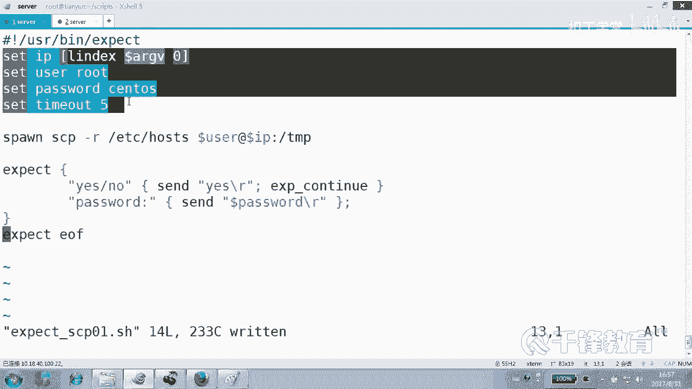

# 千锋扣丁学堂Linux云计算系列：Shell脚本自动化编程实战视频教程 - P33：5.1 expect 实现scp非交互传输文件 - 扣丁学堂 - BV1SE411q7vK

。好，刚才我们已经实现了一个最基本的expect是吧？但是这个脚本有一个问题。😊，写的太死了。没有变量。是吧。那我们可以把它这个脚本呢改一下，或者我们重新再来写一写都可以。我们copy一份好吗？

expect PEC哎，没有了，这是在这个机忆上是吧？copy。😊，成为02，打开expect02这个脚本。这也是脚本啊，上面呢我们就要变化了，我们要设置IP了。设置IP用什么指令呢？set。😊，啊。

不是开设置变量，sorryIP变量后面是变量的值，看到了吗？是不是192168点12点。52。Se。你可以呢设置很多的变量，比如userroot set。他斯。word是吧，是密码是不是sOS？😊。

这个是变量的名字，这个是变量的什么？😊，值。这是变量的一个赋值方式。OK还有呢甚至可以设一下time out5秒钟时间。😊，因为有时候时间太长的话，它会一直会等待OK我们可以设一个超时时间5秒钟。

但是不设置的话呢，这个time out也是存在的。好，那下面我们就要采用什么方法？😊，变量的方式吧，这个叫用户名换成什么？它的变量引用一样是。😊，user它这个一样是什么？dollarIP这个地方呢。

密码是什么？到了他是。Word。好，这个别的地方我没有改变，我仅仅是改变了一下这个。😊，变量。因为这样的话，我们脚本以后再改的话呢，是可以改上面的变量就可以了，对不对？你不用再改别的地方。😊。

能不能看到？好，接下来我们试一下。😊，expect002是吧？成不成？一样可以吧。那么同样把这边改成多少？241。再执行一下是不是样可以？怎么了？不可以吗？

但是这种变量好多人是不是有点不太觉得不太舒服啊？各位，这种变量其实也是一种类似于我们的显示赋值，很明确的给哪个变量赋值是吧？那它有没有类似于我们sha的这种位置变量呢？😊，do一到2到3到4呢肯定有的。

好吧，所以我们下面呢把这个脚本做一个。copy成为。Expect。03点SH。实实际上SSI那个SH啊是他对它的一种亵渎啊，但是那又怎么样了，对不对？好，没关系。刚才我们说变量在后面写死了的，写的是。

😊，我们写的是那个一个具体的值是吧？我们可以换成位置变量，哪个变量dollar一那是不可以的。😊，啊，不支持这种写法，他用到的这个位置变量是。😊，LINDX。

后面是dollar ARGV argumentsments，从零开始。这是第一个位置参数。第一个位置参数看到吗？有空哥。好，你说这两边是吧？啊，这不是条件测试啊。😊，这不是我们的调音测试。

在这里面放括号的意思呢不是调音测试。哎，你需要加几个参数。😊，不是你可以写成写成一啊，那就是第二个位置参数，好吧，是不是第二个位置参数？好，我们用0，它第一个这个你要不要变成参数，要不要还是写死。

还是就这样这样。😊，就这一下吧。就这样是吗？那好歹我们也再再再再再变一个吧，好吧，好歹再变一个。😊，dollar ARGV arguments一好吧，好了，现在我们有两个变量需要接收位置参数。

需要接收值就是IP和什么。第一个是IP第二个用户ok。😊，好，看一下。能看到吗？各位。我们再来执行expect0几03，现在是报错了，为什么？没有传舱。第一个参数应该是192168点。12点几241。

第二个参数是用户名。Yes。看到吗？再打开看一眼。零表示我们将零相当于什么？社里面的什么东西？😡，doer一 dollar一第一个位置参数，而一相当于do那个s里面的do2，第二个位置参数明白吗？

看懂了吗？各位好了，各位，现在我们只是连过去停在那边，那有什么用啊？😊，我们还能不能干点别的事情啊？😊，那就不要把那个。interactive给大家什么注释调，要干点什么事情？😊。

那我们首先得知道你粘过去以后是什么效果。😊，连过去以后，是不是会出现一个提示符啊？我们再看一眼看你要连过去以后，像这样连过去以后是不是会出现一个提示符井号什么的。好，我们说当出现比如说这一段的时候。

又该干点什么事情，好吧。😊，明白。看。好，我们就不不不采用这交互的方式，而是再次出现EXPT好，注意这里可以简单的就直接不用大括号也可以，就写一行出现井号的时候。😊，然后干点什么事呢？发送一个。

我们有创建一个用户叫做。杨洋。斜线N表示。呃，斜线R表示什么？😊，回车对不对？然后我们还可以呢发送一个什么呢？发送。一些别的东西，比如说PWD，然后按R回车，然后再发送一个。干什么？EXIT。

然后按回车。最后各位这里呢要注意我们之前使用使用的这个交互，其实并没有结束什么expect吧。但现在呢我们想要结束它怎么做？我们用exBCT。😊，EOF结束。嗯，这个是字我们把它结除掉。

而为什么之前没有结束？是因为我们之前一直是在在什么在什么模式，在interactive，也是在交互模式。😊，交付模式的结束是由谁来结束的？😊，由你来结束是吧？来由你来终止他的生命。

而我们现在是告诉我们的expect，你做完事儿以后，你就该干什么？😊，结束了退出了，那他不会留在那边，而是把事情做完以后，结束expect看到吗？好，这些脚本我都给大家留下啊。

也就是说整个演变过程从圆到人的过程呢，我都给大家留下，每一步都给大家留下。好吧，ok看到了吗？我这边去掉了什么expect那个interactive，而是换成了当出现井号的时候。

发送这个发送这个发送这个最后结束。😊，看到了吗？各位。好。哦，好像要传餐吧，现在要传餐吗？要，因为上面有缺两个餐，当然我们可以不要不要第二个餐，我们把它。😊，换成root，好吧。也可以连这个都不设置。

下面就直接换成root，是不是也可以啊？😊，好，先传几个餐。😊，好的。看好了。😊，再见了，走了。看出来了吗？各位。你你只要把这个路数套路给它设计好了，也就是说当出现这个的时候输密码吧，按回车吧。

当出现警字号的时候干嘛建账号，然后。😊，干嘛？PWD没错，最后exet。最后结束expect整个结束掉了，看了吗？好，所以你可以完全可以通过expect去实现这种控制。

当然前提是你一定要计划好它走到哪一步，碰到什么东西该怎么走，碰到什么东西该怎么走，明白吗？😊，好，各位，我们现在看到了是已经实现了这样一个功能是吧？那另外呢我刚刚讲过。

我们可以使用expect实现任何需要什么交互的东西。就比方说我们刚才是走的SSH吧，传了餐。那我们要拷文件呢。😊，我们要拷文件呢？拷文件我们用过什么命令？😊，SCPICP可以啊，怎么着，这是。😊。

拷贝哪个？expect03成为expect。这是SCP吧，好吗？点SH行吗？😊，SAP。你要啊也可以。😊，打开expect SSCP01。在这里面呢这样。😊，这个餐上面的餐要不要传呢？

这个看你的情况好不好？我们只不过把绘画的名字给他换一下，换成什么？😊，换成。SCP杠RETCR的host看到吗？传到以这个用户传到对方IP下的TMP下面，好像没有什么要写的了，好像下面都。哦。

没有差不多，下面没有差不多。下面直接是。传完以后也不交互，也不再干点别的事，而只是直接退出。因为这个跟SSH不一样，SSH是不是传过去，连过去以后还要在那边，人家逗留在那边。😊，而我们的这个。

传文件那就不要逗留了。传文就你也不你传文件，你为什么要停在那边，你也停不住啊，是不是？😡，都听什么各位。所以你也停不住。因此呢。咱们传过去就可以了，好不好？好。我们试一下啊，这个整个思路没问题没问题吧。

上面这段打酱油的，可以不传菜。😊。

直接在这在这什么？😡，用户名写死IP。写死。能听懂吗？各位嘿，能不能理解，别光看着能不能能不能明白这意思？其实实际上就几行。😊。

就就这几行啊。上面那一堆。从某种程度上讲都可以。没有啊，你只要把变量的不要定义变量，你就直接用用户名IP完事了吧。😡。

好不好？看到了吗？还整得我有传餐，用户这个不一经。😊，哦，没有了。有啊，这不是这不是用user变量吗？😡，这这不叫写死写死什么叫写死？写死。撤销写死好不好？我上面用的还是变量，只不过没有传参而已，好吧。

而是我定义好的一个变量。我没有从位置变量的那个方式给它传过来，参数没有干这个事情，好不好？😊，我没有写词啊。O。😊，你们是主张国写子。不知道。然后怎么做？再执行一下。是这个吗？你。SCP01吧。好。

很抱歉的是，我依然还要传个参数，因为你该需要个参数是吧？😊，好，然后呢。走考过去了。其实我想说的是，你注意你观察，我真的给他们拷文件是需要需要密码的。你不要不相信这一点好吗？😡，12点多少？

241放到他的TNP是要密码的呀。但是你别看人家跑的光鲜亮丽，人家是解决了这个问题啊。😡，同样还有什么？我们要考边。对，52没问题啊。是不是是不是只要换一下就可以了？好，这就是我们可以做任何的。

只要使用sport来启动一个绘画，任何交互都能解决。哪怕你是连连FTB下个文件，你只要把这个套路给你设计好。😊，是不是就能解决？那回到这个主题上来，我们要干什么？

对。批掉。嗯，我们要批量。等着我刚刚讲过，我们想要拼量之前先要解决密钥的问题。如果密钥okK的话，后面是不是就不用不用expect？所以往往我们用expect来干嘛呢？先打前站，先把密钥给我搞定就行。

😊，而且我不打算只整一个主机，而是一批主机。这个时候就要用到循环。明白吗？所以刚才的expect只是小喽啰，只是一个轻量级的一个用法，那都没劲呢，是不是这样的？😊，好，接下来我们准备来干嘛呢？

来写一个脚本，而且呢能够实现把密钥给它推过去。😊，Okay。

