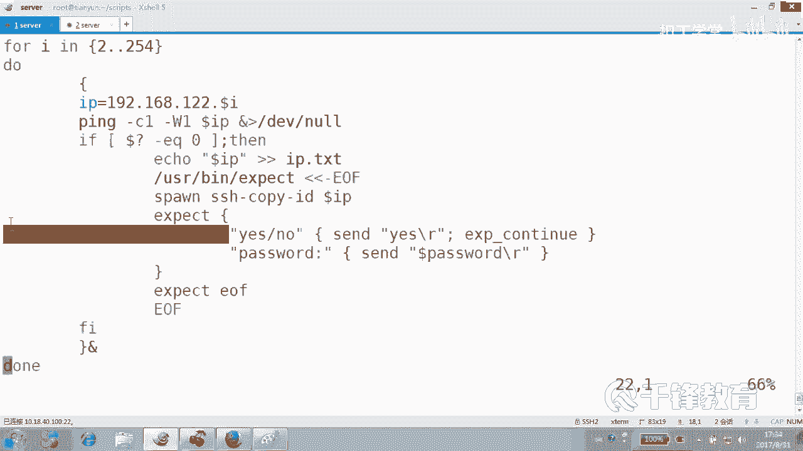
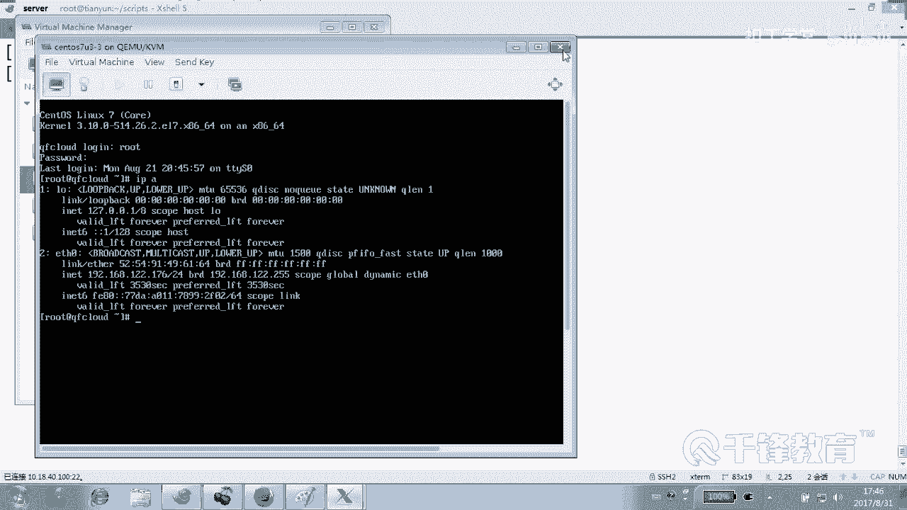

# 千锋扣丁学堂Linux云计算系列：Shell脚本自动化编程实战视频教程 - P34：5.2 expect 实现批量主机公钥推送 - 扣丁学堂 - BV1SE411q7vK

好，欢迎回到课堂。呃，下面我带大家来来了解，或者说应该说是我们来实现这样一个推公要这样一个动作，是吧？实际上我们知道我们现在对对这几个主机的IP呢。都是不知道的对吧？😊，明白吗？我们是不都不清楚的？😊。

那怎么办？现在我们可以这样拼通一个推一个拼通一个推一个可不可以这样？好。看一下啊，下面我们来写一个。Get。IP并且呢。获取IP并且去push什么。退工药的这样一个动作。uplic个 key啊。

这个桥背名字太长了点吧。😊，好像感觉好像这么长。😊，其实其实我们我们就叫getIP吧，好吗？就获取IP。但是大家很清楚，这个脚本不只是获得IP，而且还要。😊，推工药。这里会有几个解需要解决的问题。

看好了，一个是怎么用，怎么把expect和。😊，是要去。放到一起去。好。😊，井号叹号USR并下的呃漏漏漏哎，是病下的拜s吗？是。对呀，是拜师啊，因为我们要我们主要的这个主要的这个脚本还是拜师啊，对不对？

好，然后呢怎么做？😊，呃，平是吧，是平吗？不是吧，for吧。for I in吧，然后是从2到254一我们不做了，因为一这边。一是我们的真机，我们不做，好吧。😊，度大。你要是聪明的人的话，你就知道。

这里面的每个动作我们都要放在。后台执行。最后在结束的时候呢。我们要wait是吧？要做一个wait这样一个动作。好，我们先就这样吧。来。😊，上来以后，是不是先。去聘IP啊。拼哪个IP？もうね。

建议大家定一个变量，192168。12点dollar。I键样也变量。对吧然后紧接着呢我们去拼杠C一，记住我们的WE拼 dollarIP将拼的过程呢。不要了吧，是不是好。

如果哎这个语法现在已已报在报错的感觉啊，如果。😊，对于不通的，我们就不关注了，好不好？当着问号EQ等于。😊，您。1扣0。那拼通怎么做？拼咚啊放起来好放起来。😊，le把这个IP放起来，重新注意。

这里纯粹只是IP，别的不要了啊，不要打印什么话通不通的，我们不要，我们就IP地址，明白吗？放哪儿去？😊，是居加还是覆盖啊？追佳。但是问题来了，原来有没有IP点TS文件？😊，嗯，在这个事情做之前呢。

先清一下IP点TSC文件，看到吗？好，我们只是把它记录下来吗？这是我们的目标吗？😡，我们的目标是给他推公钥过去，拼通一个公钥给他推过去。好不好？那怎么推供药？推工药需要具备什么条件？一得有公钥对吧？

是不是得有公钥？好，那我们先不管那个问题，我们先假假设直接就开始推了，怎么推？😊，能不能直接切SID copypy IDD啊，可以吗？😊，那你解决不了交互的问题。没有吗？你解决不了交互东西。

所以现在开始就要请出那位大神。expect，而且我们之前在第一节课的时候就讲过怎么去请帮忙的人。还记得怎么帮忙吗？是不是用当然路径敲不敲，其实无所谓。为了尊重它呢，我们敲路径。是不是这样子？杠UF。

明白吗？这里千万不能敲空格，只能敲table键。😊，否则的话就会出问题。然后UF。好，现在所有的这个动作我们都交给expect来处理。好，现在expect上场该干嘛呢？😊，sport是吧。

SPAAWN启动一个绘画，什么绘画SSH杠cobeID给谁考？😊，刀了什么？IP它一样可以用那个变量O。看到了吗？各位啊刀的IP是是哪个呀？😊，是不是就是这个变量IP变量。然后紧接着table波间啊。

这里千万不要按任何一个空格，包括语法会错误。😊，出现什么？出现。嗯，no肯定是yes很low吧。这个如果你你没有没有记住的话呢，你就再去看一遍，好吧，春现怎么做？出现我们发送一个。yes。

然后按回车是不是？如果没有的话呢。continue那然后又出现了什么？😡，pass word有还有好像还有一个冒号吧，但是冒号输不输都可以。然后我们发送一个什么发送一个。😊，密码叫叫叫什么来着？

是不是多娃子？当然你可以在上面定一下。他是。WD。好，是不是定义成变量？那么下面我们是不是可以用这个变量，一切的地方尽量不要用什么用那种字符串。😊，然后按回车吧。好，那等一下。呃，我们给它拷过去以后。

是不是就要结束啊？考过去以后，是不是就把那个什么结束掉？😊，expect是不是结入掉EXPCTUF是不是结入掉？好，大家看到我们这个整个for循环当中请了一位大神就是expect他帮我们干嘛呢？

在每次循环通了的情况下。帮我们去干嘛？处理这个。IP问题吧。是吧。好，当然最后我们加一个wait。😊，最后icical什么？Fish。这是我们的藏务套路啊，来再看一下这段。

他有没有有没有理解或有没有觉得有没有问题。😊，那么整个整个脚本是什么？脚本？整个脚本。😊，是b事脚本，是要脚本吧。expect只是我们临时请过来的。我再三叮嘱各位前面一半个空格都不能加，汇报语法错误。

明白吗？这全部是按的什么键，table键。😊，那怎么看是前面有空格还是推播间呢？😊，set list，你看我前面按的全是什么？😊，听不见吧，那个符号。😊，好，stlow。list好，回到这边。好。

我们如果我们去拼一个主机，拼了一个主机，这个循环是循环254次啊，253次是吧？而且每次循环是不是都放到后台。换句话说，循环的速度应该很快。如果拼的这个过程当中通了。😊，我们可选择这个是可选项。

把IP给记录下来。然后呢，其实记不记录都不影响什么东西吧。😊，然后紧接着干嘛，找expect来帮你推一下。公钥推给谁？这次循环的这次的IP如果遇到了yes和low。

那咱按yes按回车在ex那个EXPcontin。那如果说遇到了password怎么办？那咱就发送一个。password上面定义过这个变量，对吧？然后OK下一次循环再干这个事情。😊。

当然前提是通了的情况下。弄明白吗乖。好，有同学说这里有问题吗？肯定有。这个是在一切都OK的情况下，什么情况OK的情况下。😊，第一，有装过expect。第二，还已经有密钥。那有没有可能没有呢？哎。

我们现在有没有密钥？😊，这样吧，我们先不考虑那个问题。第一，我们expect装过没装过。😊，装国好，我们相信他行吗？第二，我们有没有密钥？😊，有好吧。明白我说的意思吗？我们试一下脚本。给这个脚本一个。

权限执行getIP点SH脚本。看到了吗？各位。那有时候有没有成功啊，嗯，这个怎么测啊？😊，SSH。我们看一下这个IP点TH有没有有吧，SSH随便连一个主机。😊，245好吧，192168。12。

245连上去了吗？说明没问题吧，再换一个5。推过去了吧。好，瞬间是不是得到了所有主机的IP，而且完成了公钥推送这样一个动作。我们也很清楚，只要公钥推送结束。😊，这个以后的事情是不是就一帆风顺了？

以后expect就可以歇着去了吧。我们以后就没有在远程，无论是远程传输文件还是干嘛？😊，还是去修改密码，还是安装软件，是不都是。非交互式的方式呢。好像expect在这边就帮我干了个什么事儿。

帮我打了个前站，就是。😊，完成了密钥的一个推送，别的事情没有，而且他是给谁打下手的，现在。😊，给我们的shall，而且我们的循环依然是什么循环？shall里面的for循环看到了吗？😊。

他只是在每次循环的时候，如果拼通了。那他就帮我们把公钥推过去，否则不推。看到了吗？乖。😊，能不能理解？那以后各位熏机恢复以后，再获得熏机的IP再推公钥，这事儿难吗？😊，是不来了。可能我再强调一遍。

前面你敢按任何一个空格，你在是找死。千万不让恐觉好不好？

好，而且expect的语法在这儿是不是都表现的特别简单啊，就那么几行。😊，四五行嘛。😡，是不是就四五行这些行全部传给谁，传给expect这个程序，这个解释区去解释。当然这边呢有一点我要说一下。😊。

就有可能在有些地方卡住。Se。time out比方说10秒钟。我们稍微定一个超长的时间，一个一个叫什么一个超时时间，以防止在哪一步卡住。一旦一旦它时间长了，它就会退出了，知道吗？它就会结束掉。

而且它不会可能不会给你推公钥，所以我们设了一个time mode。各位，这个time mode是谁？现在你看到这个这段颜色整个是给谁的，这段代码是给谁的。😊。

expect是在我们临时请过来助手。当然他一样认我们的变量IP。明白吗？他一样是我们在sell当中定义的变量。😊，Pass word。好了，这个脚本没有问题。那我们把这个脚本呢，比方说copy一下。

copygeIP1点SH为什么呢？因为我们有些时候把有些事情想的太。😊，太唯美了。就是。什么在。就有可能什么密钥没有啊。😡，也有可能什么？😡，expect没装啊。😡，对吧好，那怎么做呢？😊，拼通是错的。

拼通。密码。密码是错的。续知の。密码这个是错的问题呢，这个这个就暂时不在考虑范围当中了。好，然后一般我们是针对初始化的环境，我们去做。好，现在呢我们怎么做？看好了，刚刚讲过，尤其事情我们要考虑第一。

有没有可能expect没有装啊。😊，怎么测试啊？可不可以这样？当然这里呢有一个过程是不要的，就是这个过程。😊，如果什么。如果doer问号no。0，那我们就ym杠外int什么？这边可以挨克一句话啊。

他挨克一句话也看不见，因为在跑平在一顿的跑。😊，如果说这个exse没有装，那我们可以呢尝试装一遍，是不是装了咱就不装了。明白，这是第一个问题。第二个问题什么问题？公钥是不是有可能没有啊？😊。

怎么测公药有没有呢？😊，怎么测公样有没有？或者公钥如果没有的话，我们怎么办？😊，我们是不是可以提示用户去建立公钥啊啊建立这个密钥。看到了吗？各位。那你能能能明白吗？各位。好，我们判断一下姑药这长什么样。

😊，在应该在用户的加下面一个叫点SSH的目录里面，你看到了吗？这个是什么私钥，这是什么公钥。其实我们推当然推的是公钥。当然如果公钥和私钥任何一个不在都可以有问题，是不是？😊。

所以我们可以判断一下怎么判断在用户的家下面有没有什么。😊，就一个就行了，随便找一个找一个代表代表的就可以了。看我们在这边判断。😊，如果什么。如果这个文件。是存在还是不存在？不存在。是不存在，那我们就。

爱口用户。是不是说low没有这个什么？直接就算。创建是吧。谁创建吗？到底是艾le以下，还是直接创建？😡，那你你这X出来的话，你应该改善创建哈，你没有就建嘛，对不对？😡，也需要对。

但是创建又个麻烦事儿来了。你们观察一下SSH杠KEYGEN回车。他要按回车按回车按回车是不是这样子？那这怎么办呢？用什么？😡，用用什么来解决他的问题？😡，这看。各位看到是不是它创建过程也需要密码呀？

那我们刚才有讨论过使用什么expect，但实际上不需要，为什么？因为他自己就有。😊，避免交互的那个命令看到吗？它怎么避免交互？好，我给你演示一下，我登到其中1个192168。

12点多少5的机器上去看啊怎么创建SSA点comKEYGN按理讲是不是应该回车回车一路啊，不回车了，指定密码为空。😊，你看他他他刚刚创建的时候啊，他会要求你输入这个。输入位置，看输入什么位置。这个。

私要的位置，然后还会邀请你输入什么呢？😊，输入那个默认也不行，默认还有一个回车以后，会让你输密码。那这两项呢我们可以这样做，就是。😊，一杠P指定密码为空，好吧，第二杠F。指定这个私钥的位置。

注意它指定私钥在哪加下的点SSH叫什么IDRSA看到了吗？回车啥也不用你敲就可以了，看到吗？😊，啊，所以不用，不是说一定要随时请那个expect上来帮忙的。人家很多脚很多命令。

人家有自己有什么有一些避免交互的手段，明白吗？比如说在我们之前学过那个创建逻辑卷的时候，或者删除逻辑卷的时候，你要是。😊，你要是不按Y的话，他不让你删，但是他支持杠F就强制删除。😡，能听懂明能听懂吗？

好，所以我们只需要这条命令。确实刚才有同学说我给别人挨一句话，显得多么的什么不专业，那就整一下呗。😊，好，上面说的安装。上面安装哪的时候会出些东西，把它给放到。😊，这个安装的过程当中。

那个跑一下就跑一下吧，跑一下，我心里比较踏实。😡，刚有同友说，这边安装的时候会跑一堆屏幕，跑一堆。😊，那快成习惯了。好吧，你要是把它放到这里面。那就告诉用用户说正在安装。正在安什安装什么安装。

EXPTplease wait。请等待，请稍后，那也可以，好吧，算了这个。😊，就正在干什么？请稍后你打一句话，然后紧接着下面这句话呢，那这个指令就什么就不再显示了。😊，啊，可以，就是正在干什么？

请稍后好吧，完了以后呢，又干又干嘛了？就正在推公钥，请稍后。😊，都打打来多来几个，请稍后就行。😊，明白怎么来个请消后呢？用icical打印。😊，然后紧接着下面的这些指令呢，我们就用。

输出到那个垃圾桶里面去。好了，这两条其实从某种程度上讲不是必须的。第一，这这个这段用来干嘛的？😊。

检测，并且如果说你没有装expect帮你装。下面那段什么意思？如果说你没有创建me钥对，帮你创建，而且我们采用了这种非。交互的创建方式。好了，那走到这一步的话就应该是干嘛了？😊，干干嘛了？这不。😊。

是不是这样做的？是推公钥了。好的，那我们最后已经彻底的完成了公钥的一个推送，看到了吗？各位。😊，明白了吗？现在我们到目前为止，我们完成的第一步，哪一步以及。😊，从我的这台机器。

这台客户端往这四台甚至5台机上推了公钥。而且我们说了，一旦实现了公钥推送，一切就。😊，简单了，好吧，后面就再也没有什么expect的什么。😊，事儿了。明白吗？因为我们后面已经实现了什么认证。😊。

所以你们把虚机恢复了以后，比如说现在我们看我们把虚机恢复一下。当然如果没有没有这个脚本的同学呢，你就手动的把虚拟机恢复一下，好吧，比方说把快照。😊，微么 word快到，回复一下。😊，好。

反正恢我们恢复一下几。😊，3。Y是吧。然后把他们都起来，怎么起来？😊，For IE。然后起到几1到6还是5？5，然后do washstar c。7U3杠doI down写了半天，也许我早就敲完了，好吧。

好，这就是一个小型小型的脚本呢，是吧？小型脚本没有任何含量的脚本。好，现在各位这些脚本，这机器是不是又又要需要退公药啊？没关系，而且我们连他的IP都不知道。😊，但是我们手上有那个。脚本可以瞬间获得IP。

并且。推送公钥。好，等他们起一下啊，稍等一下。好，我们稍等了几分钟，然后我们下面呢来看一下。😊，我们。随便找一台机器，我先观察一下他有没有公密钥，也给他有没有给他什么。😊，推过去应该没有推啊。

我们找一台3号3号3号机。

这IP多少是176，很明显IP数字变了。

来，我们连到192168。12。176，没戏，好吧，怎么做？Get。IP几？好，保险呢是1点SH是吧？回车。😊，好，一切结束了，看到吗？😊，看一下IP地址。可以吧。然后随便连一个机器，刚t176乘是吧。

再连。211乘好吧，所以以后我们就不要劳劳烦说，你看我们以前讲讲讲课的时候，把虚拟恢复以后啊，每次还要打开去看一看里面的IP还要看一看里面的这大的，还要连的时候还要输密码，这个时代早就过去了。

是不是再也不用获得IP再也不用去输所谓的密码，这就是expect帮我们的工帮我们的忙，是不是？😊。

