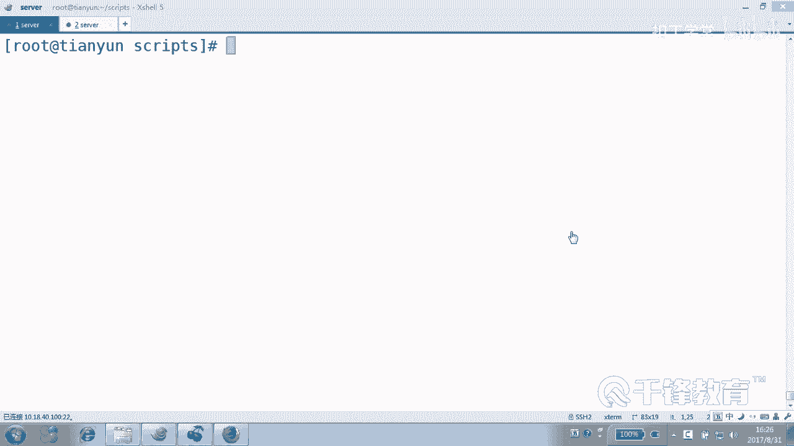
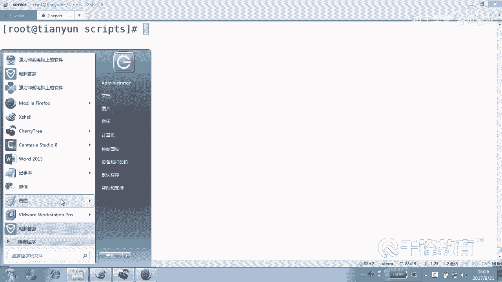
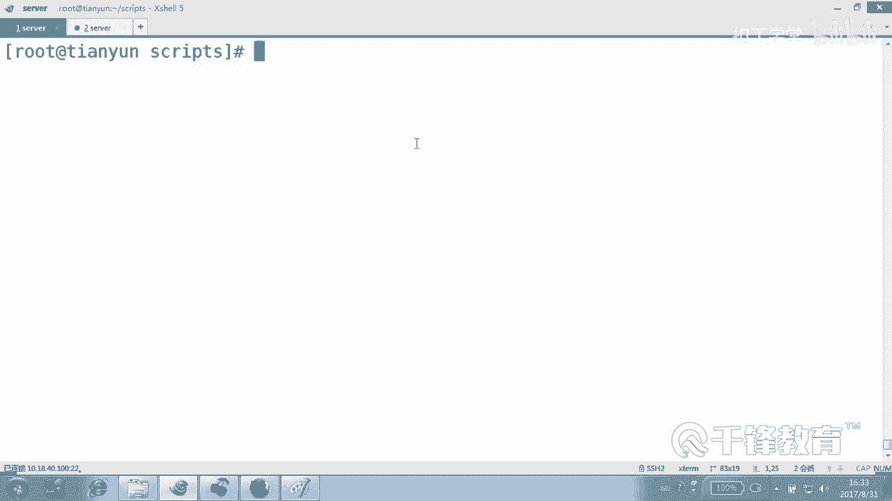
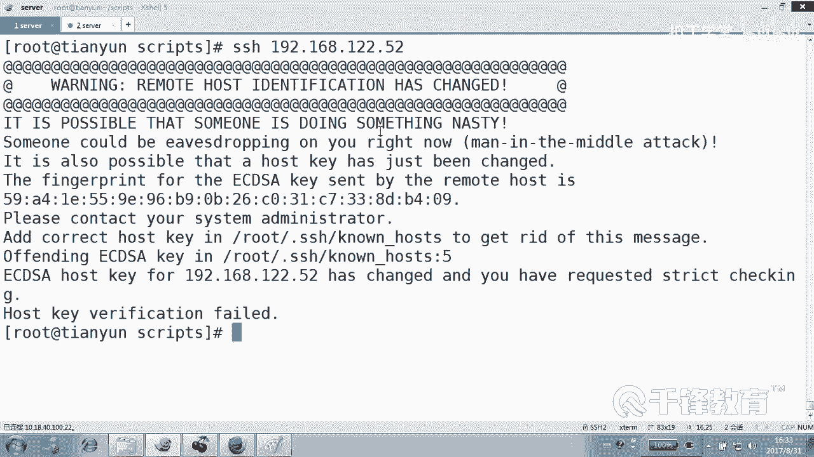
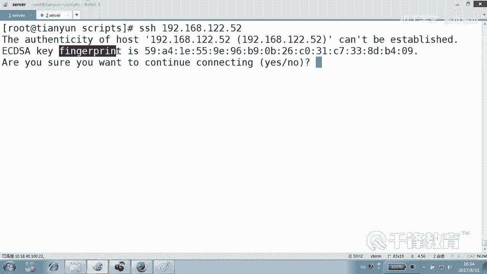
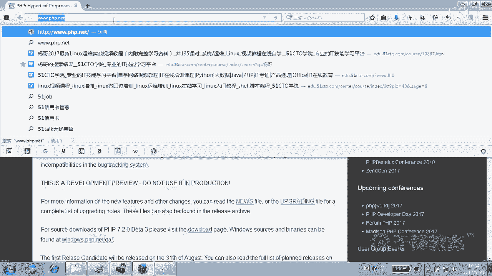
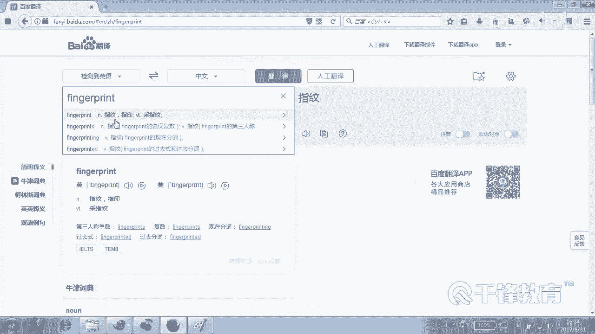
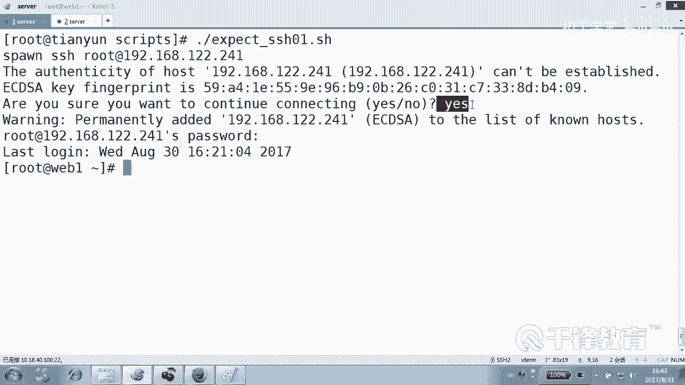

# 千锋扣丁学堂Linux云计算系列：Shell脚本自动化编程实战视频教程 - P35：5.3 expect 实现ssh非交互登录 - 扣丁学堂 - BV1SE411q7vK

哦，接下来我们呢去再讲一些for的一些案例啊，不能说for应该是循环的一些案例。是吧来下面有这样一个例子，什么例子呢？就是我们有这样一个想法。😊。

我现在呢这边有好多台机器，好多台好多台好多台好多台是不是机器可能有100台。我现在想要批量修改他们的密码。😊，我可能想要比方说什么动作呢？我在我的记忆上面。😊，在我的这台机上面啊，我有这样一些想法。

一可能要。😊，获得呃批量去干嘛呢？批量去给他们传输。文件。第二。批量我们需要做这种远程的。秘密。执行执行什么？比方说。修改密码。对吧。或者是呢。我们要在他们上面安装软件。能听懂没各位。

我们想要做这个行为。就是我想要就在这个机器上创建一个脚本，然后能够对他们做一个远程的一些。😊，实现远程的一些稳件传输，然要把一个文件传到他们上面去。第二呢把什么？😊，密码给他们修改掉。

或者是给他们装软件。那各位这要怎么做？首先我相信我们应该有这样一个文件。这个文件里面呢，假如说有一个叫IP点TSC文件里面列出来什么？😊，A主机的IP12。1，假如说2这样的我我只是举例说明啊。

是不列是个IP。好，全给他用。然后紧接着我们是不是可以根据这个IP来做什么做for循环，当然不一定是for啊，也可以是也可以是well做循环循环干嘛呢？来做这个事情，就是针对这期做这个事情。😊。

但是有一个问题大家需要先知道。就是。我们在传输文件的时候。对，还有了这个密码的时候，装软件的时候，可能需要一步一步又一步的交互。这个事情麻烦，我说这简单呀，怎么简单？😊，使用什么验证就可以。

对这些机器使用我们的。民谣认证。当然严格讲叫公要认证，好吧。好，只要我们使用密钥认证。现还没有那个啥，我们只要使用密钥认证的话，那么自然呢我们在。😊，无论是传输文件还是什么修改密码。

安装软件都会非常轻松，对不对？那所以我们要怎么做？啊。你好像得走第一步吧，就至少要把公钥给他推过去吧。😡，那么按理讲的话，你要先在做循环之前，你肯定先要SSH。杠KEY。GN Kgen是吧？

然后你还在使用for循环或者是well循环，那干嘛？😊，来做什么事情，来SSH杠copyID当然你可以。你可以啊一个一个的手动来考，我觉得那太慢了吧，你也可以使用我们的循环来实现拷北。但是无论怎么样。

你一样会面对。😡，交互的这样一个问题。对不对？就是交互在脚本的时候是一件很痛苦的事情，我们不太可能。不太可能去在脚本当中交互，因为一次可能能够可以吧。那脚本那么那么多动作，那么多命令，向那么多主机推送。

那么多主机装软件交互这个事情显得。可能就不太合适。好吧，但是有一点我们心里很清楚，只要实现了什么。😊，一旦。实现了公钥认证是吧，那就没有交互了，好吗？所以我们第一件事情就是先要解决这种。

交互认证的这个过程就是把公钥给他们什么推过去，才能实现我们这个宏伟的目标。😊，明白吗？好，这一切都可以通过。但是你要推的话呢，也是需要。交互的就是总之你你你在一开始肯定要交互，明白吗？😊，能理懂吗？

各位好，那么在正式介入这个项目之前呢，我们先来认识一个有用的东西，有用的一个工具，或者说一个。😊，也是一个解释器，对吧？也是一个程也是一个程序语言，它不是sll，也不是p，更不是PHP是。Expect。

他能帮我们解决交互的问题。嗯，EXPCT。

那么下面呢我们先来认识一下expect对的一个基本的用法。好，先看一下EXPT。😊，装了吧，这什么邮件？讨厌哦哇。这么当时我们的计划任务是不是没有没有关呀。没有5会。5分钟一次，哪有5分钟一次上。

那可不是我写的。那不是我写的，不能乱来。😊，好。那个各位呃，我的意思是要我们要干什么？😊，先认识一个小小工具或者小小软，不是软件，它也是一个程序。不是我们的balash，是expect是吧？

那如果没有装的同学呢，那就先。😊，那啥PCT好吧。😊，明白，好，我们先在拿一个机器为例，我们现在连到19号168。12。241是很费劲的，是要输入yes，甚至还要干嘛输密码，对不对？

那我们能不能够让他帮我们来输一下呢？😊，241还有52，你看我们拿一个机器做实验。哦，对了，这有个问题，所以呢我们要给大家提一下，你们也会遇到类似的问题。😊。

就是我连接一个机器的时候啊，他报的意思是说他兄弟。😊，你这一次去连接那个机器获得的指纹。和上一次留的那个指纹不一样啊。😮，意思就是说，可能现在的这个52不是我曾经认识的那个52。就是有人改了52。😡。

那所以呢我要把老的指纹给他什么删除，在哪儿呢？在当前加目录下点SH1个nose文件。这里面有一个找到52那行，看到那行了吗？这行了吗？DD删除就可以了。😊，然后再次连接是不是就可以了，重新记录它的指纹。

就相当于我刚刚讲了，你现在看到的这个人已经不是你曾经。😊，认识的那个人呢，所以要把曾经那个人的信息。先抹掉。明白好，现在是不是要保存它的指纹信息呢？😊，好的，要保存这个单子什么意思？😊。

指纹。对不对？就指纹信息。

好，那现在我们看到我们现在来写一个什么，来写一个脚本。😊，叫做注意啊，我们现在先是先还没有完成什么正式的项目。好吧，我们只是先来带大家认识一下。😊，Expect。写一个脚本。叫。SSH01这样一个脚本。

好，我们来就是哎SSH的过程当中要要不要交互啊？😊，好，让他来帮我解决交互的问题。好，有同学说后缀叫什么？叫SH行吗？其实我们也很清楚这个脚本本身。😊，叫什么东西不要紧，那既然都叫惯了，就叫SH吧。

我也确实没有给expect专门起一个什么后缀，不像python叫PY吧。😊，他就叫SH。OK行吧，就他吧，不要再讲究那么多了。😊，UR并下的bsh。哎呦， no no， no no， no。

USR并下的什么 expectpect，只有他才能解释他的语句。好吧，他有他自己的说话的风格，他自己的语言。😊，好，我们来一个。😊，首先用SPAANWAWN开启一个绘画。开启一个会画，用这个指令。

开启一个绘画，开启一个什么会画呢？连到ESSH，我们可能会加root啊，root连到192168。12点什么52上去。😊，是不是？然后紧接着我们看一下会出现什么。会出现什么？嗯。

会出现按yes或low这样的字样吧，是不是？所以我们可以复制一下这个行里面可能带有关键性的这样一些语句。说白了就是事先把出现什么。😊，要怎么做这种事情，先什么写好能听明吗？就是你现在遇到了狼。😊。

打开锦囊，一看。然后高手说遇到狼应该怎么怎么做，事先写好了，他已经把你这路上遇到的每一步什么。😊，艰难险阻都给你算好了。并且呢怎么应对些什么写好了，所以再也没有交互的问题，知道吗？😊，好了。

他算到首先会遇到一头野狼，就他。😊，那我们使用expect期望。这颜色怎么变都会变呀？expect位置写错了。EXPECCTPT。是对的吧。好，没有没有变就没有变吧，这个忍不了。好，期望什么呢？

期望出现什么，大括号出现什么。😊，表出现一个字符串叫做。这个不是是我们要边写边复制的，出现了yes和low看了吗？那应该怎么处理呢？应该发送一个。剩的发送一个。首先是Ees。yes，然后回车看到吗？

紧接着。啊，有这种可能性就是呢有可能这个yes的不出现啊，是不是有可能不出现？😊，那步署现的话一样呢，我们是要continue的啊，或者说发完以后，这个对有可能不出现。因为你第二次连接的时候。

是不是就不出现了？😊，好，然后紧接着呢。然后我们我们模拟现在走一遍嘛，说yes吧，然后又出现了什么哦，伸长了伸长了啊，是不是出现了什么？😊，啊，这个没关系，这是你自己。😊，当出现什么，怎么怎么处理。

这个写在这里面就可以了。再出现呢。Pass word。我们发送一个。指令叫发送一个字符串叫做。stoOS，然后回车注意stoOS是我的密码，好不好？好，最后结束的时候，分号。最后呢。

也就是说整个我们先开启一个绘画，这样的话会受到expect的他的一个接手啊，他会接手这个绘画。这这个绘画是由expect去处理的。😊，然后如果说出现了什么yes和low发送yes。

按按啊Y哎不是按那个回车是吧？如果没有出现也可以。如果出现了pas word，这不是我们猜的，这是刚才一步一步走的吧，发送一个什么s，注意这是我们设置的密码回车。然后完了怎么做呢？

最简单的interactive。😊，就是停在对方那边。交互停在对方那边。明白意思吗？就停在那边，就是不不退出来嘛，好吧。😡，好，这个其实非常简单。😊，非常简单。看。

就是期望出现什么y和low发送一个yes，是要输y吧，然后回车出现狼的时候应该怎么做？😊，这没出现呢，接着往后走，然后出现password的时候呢，该怎么做，明白吗？然后做完以后，如果一切顺利的话。

我们留在那边interactive。😊，交互。看到了吗？各位。好的，现在我们写好以后就准备执行了吧。😊，啊，怎么了？😊，哪儿哪有问题？先启动一个，一定要用spand启动一个绘画啊呃启启动一个绘画以后呢。

我们才去用expect去处理。怎么了？单词是吧。这个单词的原因是什么？看看。Spot。产卵产生一个啊引起一个引起一个引起就产生一个绘画，只有只有它能够产生一个绘画。

sports sorryor sport，然后产生一个规划，注意任何规划都是由他来产生的。好吧，好，然后出现这个的时候干这个事儿，出现这个时候干这个事儿，这是一个它的一个函数啊，一个一个一个命令。

就如果我一出现的话，会怎么做？最后停在对方那边，好吧，来试一下。😊，嗯，是。是52是吧。给一个。给一个什么执行权限。注意这个是谁执行，那一定不能是b师执行，因为belash根本执行不了。

他不认识这个语法，明白吗？谁执行可以使用ex backexPT用它来执行，其实也不用输了，为什么？😊，本来里面解释器已经写好了吧。😊，看到了吗？是不是开启一个会话，然后输入密码。懂懂了吗？那我们现在。

把它换一下，换成那个连到22什么。214是吗？241吧。可以啊，他不会输y死的。😊，是不是人家跟你说好了？说好了吧，各位。那么这么整的话，其实挺有意义的。他能帮我们解决交货的问题，是不是？😊。

应该这个能看懂，对不对？这是一个我们写的一个最基本的一个。通过expect来实现1个SSH的登录。在整个登录过程当中帮我们去处理那个。啊yes和。密码的这样一个过程，是不是？那有人说它能处理什么呢？😡。

任何东西。任何只要是要交互的，他都能帮你处理。但是你一定要算好什么？哪一步要干什么，出现啥干什么出现什么干什，这不是算好的，这是你要一定要怎么模拟的。😊，走一遍操作一遍才可以这么做，这玩意儿不是算好的。

能明白吗？各位。好，这个自己呢一会儿来尝试一下，好吧。😊。

