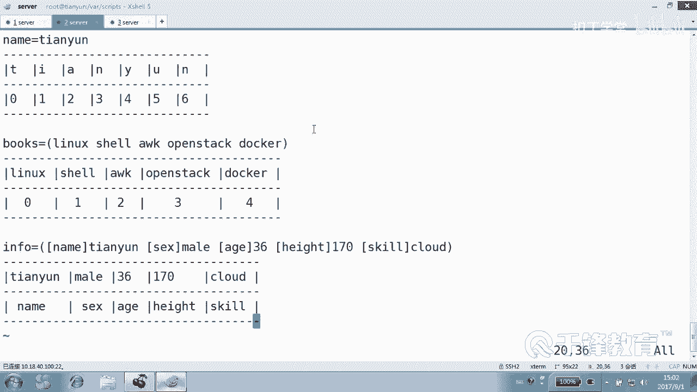
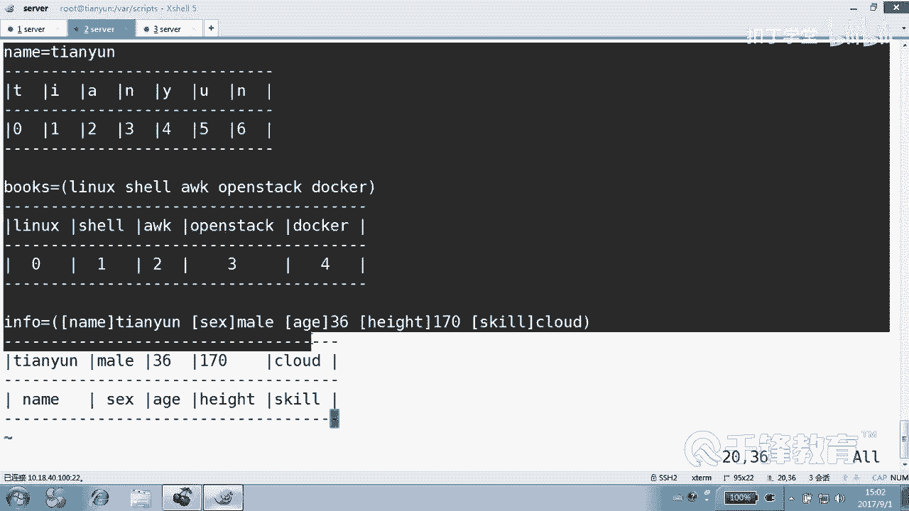
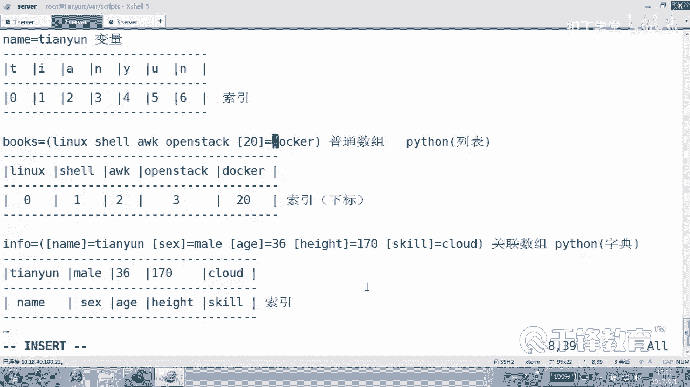

# 千锋扣丁学堂Linux云计算系列：Shell脚本自动化编程实战视频教程 - P36：6.1 array 数组的基本概念 - 扣丁学堂 - BV1SE411q7vK

嗯，大家好，欢迎各位再次回到课堂。😊，嗯，接下来呢我们来一起学习少数组。首先数组这块呢，我们会接触到两种数组，一种叫普通数组，一种叫关联数组。首先数数是什么东西？如果曾经学过C语言的话呢。

应该知道C语言里面有一位数组、二位数组甚至多位数组，对吧？数组其实它也是变量。我们大家知道常规的变量里面。常规一个变量里面是不是只能保存一个值啊？一个变量是不是里面只能够存储一个值？而数组变量呢？

也是一种变量，但是它可以存储。多个值。对，多个值。好。刚才这边呢给大家。

我给大家。快速的敲了一个东西，在你们练习的时候啊。

各位，这是一个什么？对，没错，变量。这是一个变量。对不对？这个变量啊。被告的名字叫name。变量的值是什么？😡，是天云是吧，这其实已经是C当中的二维数组了。但是我们se里面实际上是没有这个。

多位数组的概念啊。好，这边我们看到。这个变量里面它只能够存。一个纸。而下面两个都是变量，好吧，但是这个变量呢？不是常规变量，是数组变量，它里面能够存。多个值看到了吗？这个也是一个数组变量。

我分别用三个三个这个变量来表示，一个是name名字里面存了一个天云，对不对？它的值是天云。那么有一个数组变量叫books，里面有linux的书，sha书，AWK的书，opent的书，docker的书。

是不存了5个变量，5个变量值啊，不是五个值，一个变量里面存了存了5个值。这就是一个数组。那下面你看这个以否信息这个数组当中，同样你也可以看成是一个变量，对吧？这里面有几个值。

也是一个、2个、3个、4个、5个吧，但是有点不同，注意到了吗？我们之前我记得给大家讲过变量它的每一个。每一个字符都有一个索引，对应的索引，还记得吗？我们当时也讲过这个索引的切片操作。

是不是我们只获取变量中某一部分值。你这是这个T对应的索引。123456好，每一个数字呢都对应了一个准确的说是这个变量这个字符串中的。一个字符看到吗？这是常规的变量，常规的变量。

而我们现在看到这个数组当中。它也有索引看到吗？但是它的这个索引。对应的可是一个一个字符串。比如说零对应的是linux一对应的是sll。2对应的是这个AWK3对应的是opent4对应的docker。

而我们这个命令的作用是用来定义变量的，而这个命令的作用是干嘛的？定义一个数组，创建这样一个数组变量。看到了吗？好，所以下面呢这是一个数组。那这个数组和下面那个数组有什么不同？各位看到。

这个数组和下面数字什部不同，下面这块我们叫做这个叫索引，对吧？这块也叫什么？所以。当然也可以叫也可以叫做什么。下标。O。😊，同样这个也叫什么？😡，索引也会或者叫下标，好像不好了吧？索引叫索引好一点了。

就叫索引，不要叫什么下标了。😊，那两者之间有什么区别？你们看。一个是证明的。不是一个是指定的，一个是默认的。这个数组它的下标只能是整数。注意到了吗？而这个数组的下标呃，所以是什么？搜上。看到了吗？

它是字符串，这也是数组。那么在这里呢叫什么数组呢？我们叫关联数组。所以在sh里面，这个叫关联数组。你看我们上面这个书啊。所引编号为零的是lininux是吧？所以编号为3的是opent。

是不是我们如果定义了这样一个books数组，定义这样一个变量，我们变量不是说只是定义的，后面我们可能还会再引用它，是不是引用变量值。如果我们引用books，所以因为几啊？

3、那么就是open style，是不是？那如果说我们希望我们的索引是字符串呢？你看比方说有一个信息，信息总不动12345表是吧？一是姓名，二是性别，三是年龄，是不是这个不好啊，应该是什么？姓名是天云。

性别是manor。年龄是36，身高是170，技能是cloud。技得视云吗？云计站吗？看懂了吗？各位那这个地方你说用上面的数组方式，用0123来作为索引好吗？您123多不好看呀。😡，看到了吗？交什么数组？

关键数组，而普通数组它的索引只能是什么？整数，而关点数组可以是一个字符串。那你喜欢哪种呢？我觉得我还是比较喜欢观点数组，你们的意思呢？其实这里的叫法不一样叫法不一样啊。😊。

这个东西在python当中叫什么？叫原叫原组排列表。叫列表。而我们下面这个这个东西在牌子当中叫什么？对字典。叫字典。那么字典呢其实就没有顺序的，最后最后就没有顺序关系。那么它最后在便利的时候。

同样也没有顺序关系。你只要找到对应的索引，然后对应的值就可以了。这个叫列表。这个叫字典看了吗？所以在不同的在不同的这个语言当中，叫法不一样而已。ok。今天我们要这个变量，今天过来是给大家做。

凑热闹的或者做类比的，明白？这个变量确实可以有，它也有下标，它也有索引。这个索引可以帮助我们去对变量的做一个切片操作，就是切取它身体当中的某一片，是不是？比如说怎么切的哦，我怎么知道前面讲过。

你又不记一下。😡，切面表切这一段啊，是不是切这一段下来啊，从索引一到索引解。😊，是忘了吗？是不是这样子？变量doer变量U name。然后从四开始是不是这样子？是不是4，然后取三个，还记得吗？

这不讲过切片吗？之前这是变量的操作，这是变量。而我们今天讲到的是。😊，收组。各位看明白了吗？变量里面能存几个值。一个值，而数组当中可以存什么多个值。而我们的普通数组，它的索引只能是。整数对吧？

而我们的关联数组，它的索引可以是字符串，而我们更加希望在保存用户信息的时候，名字是天云，性别是M，对吧？年龄是36，身高体重，还有scale技能。这个时候你要用零表示一表示二表示34。

这个非常的难受是吧？而且很难以后很难去很难去干嘛？很难去搜索或者去使用到它去引用这个这个值，是不是？但我们上面的书没关系，都是书嘛，输输输输书一号输3号输4号输5号输是不没关系？那么数组既然是变量。

它跟变量一样，我们怎么去定义数组？其实这怎么定义啊，看好了怎么定义。这不听好了。怎么引用到了？😡，do了什么。Books。各位，它的索引值只有什么？只有这个只有0123，这个是01这1加23。

那请问大家，你想你喜欢这个应该是几？4。这真能鼠。当然这个回车肯定不行，我们引用的话，要不然你显示一下，要不然你干点别的，总之这样是不是opent？😊，看中了没乖。怎么着这有歧义啊？这么清楚。

四是docker。而我们的。这叫什么？这叫关联数组，也是python当中的字典，但是定义方法不太一样啊，字典是大括号定义，对不对？不字典在pyython里面是大括号定义，这里呢是这样定义的。

其实也是个数组。😊，好，然后我们紧接着ecle什么。😊，你想找哪个呗。😡，先先说变量啊，先说数组变量，然后索引是什么？😊，想看看我有什么看我体重。好吧。性别。这怎么不可以呢？对，这怎么不可以看。这个。

这不一样是吧？打印的第一个。你再出来再加去。加个上。好，所以这里呢各位看我们不同的数组的定义方式是不太一样。同时呢还有什么不一样？还有他们的这个。去怎么去引用他们的值。你用它们的值。好。

这边呢我们来看一看。😊，呃。为什么有问题呢？有一个很重要的原因，我没有写错什么？其实。但是也不得不承认结果是错的，是吧？明白。那为什么错了吗？那是不是我做错了，我不不敢承认。我我不是那种人OK我做错了。

我肯定会承认。好，我想说的是。各位，这是一个普通数组，对吧？这是个什么数作？普通数组。为什么？不是那个问题，是sell默认不支持关联数组。哦。😮，啊，那不是那个意思，不是是你要先声明。

这是一个关联数才可以。通过dec来杠A。Aray大A声明小A是普通数组，大A是什么关联数组。所以我刚才定义的那个其实根本就不是所谓的。关念数组明白了吗？好，也就是说。dla尔杠大A衣。哦。

这个他说已经存在了那再换一个，好吧，呃，叫infor一可以吗？😊，然后紧接着呢，我们再来看好了。😊，再来听一下，哎呦这么长。没法换行啊，来，我再来从这儿敲一下。呃，叫cloud OUD。小块吧。

一一一一。可以吗？然后了，还又错了。😡，INFO1。这就对了。一切。紫线肉。他不让我定义关键数组啊。我们看一下，先申命一个关联数组，然后去对它做一个赋值赋值复值复值赋值。没问题啊。没有等于号。

哪没等一号。哦，少了一个东西是吧，少了一个等号。这边。如果没有的话呢，它就是一个普通数组，对不对？他就认为这是一串儿。一串自串儿。OK那if否一是if否一现在是不是就有关键数组了，看一下啊。

dollar什么。😊，小大括号，然后是数字的名字叫inle一。然后我们看哪一个索引。36是吧。那同样呢我们再看一下证明这一点啊，各位。😊，我们来一个一 for2。有我们有没有声明过一方二是关联数组。

没有吧。来再看一方二。不对吧。Ele2我们也像eO一那样去定义了一下，名字是天云，sex是manor，年龄是36，最后没有没有错吧。但是呢我们在去获得inferer二的 edge的这样一个索引的时候。

错了。对不对？因为它不是关联数组，明白吗？所以你要先要声明才行。所以这两种数组。这两种数组这边呢定义的方法不太一样。这边少了个等号，没错。好了。😊，来，我们具体来看一下这个数组的一些怎么去定义。

还有怎么去使用。嗯，首先这个普通数组啊，我们刚才看过它的只能使用整数来作为数组的索引，对吧？只能使用整数，而关联数组可以使用。字串。数组的这个定义方式呢是可以一次付一个值，也可以什么一次付多个值。

那比如说各位看到这个数组，数组的名字加上索引。我们都统一叫索引，好吧，叫索引，后面呢是变量的值。这样的话，你看同样是这个数组是are一这样一个数组，我们分别为它的所以0123是不是复制了这个相应的水果？

这个没问题。但这个麻烦一次是不是付一个值？那一次付多个值怎么付呢？可以像刚才一样，是不是小括号，这个小括号注意它会自动从索引几开始。00开始012开始。当然还可以怎么做？去cutt一个文件。

他会将文件中的每一行作为一个元素的值付给欧瑞3。但是这里有个希望。希望只是说我们一厢情愿的。好，这个反译号是什么意思？应该看得懂，对吧？是我们的命令替换，它表示先会执行这个命令。但是为什么说希望呢？

各位能猜到是什么原因吗？对分割符的问题。因为这个文件当中有些行上是有空格的。所以分高符本来这个文件可能只有40行，但是可能最后的值呢有50个或者60个，因为它有空格。对不对？就说这个问题能不能解决？😊。

能我们重新定义一下什么？分割服好，这都可以看tom jack爱ice。嗯，那这里它是这是几个元素。4个还是5个4个，因为加了一个引号，同样也可以也可以怎么做？我们把颜色颜色使用这个。

颜色使用这个变量来定义。你看我们定义了几个变几个变量，red ，blue ，gr。recolor重重置颜色嘛是吧？这个前面定义过的变量，然后统一付给colors。所以我们调colors的。数组远。

所以零掉的是红色，一掉的是blue，看到吗？那也可以怎么做呢？还可以这样做。😊，前面几个1234567，所以编号分别是几？01234567，那么后面是不是有一个。换一个名字吧。我们都不讲那个了啊。好。

换一个st，这个从几开从几20。换句话讲，你可以跳过这个什么。😊，那个中间的这个索引的值可以跳过。没关系，可以跳过。好，这是数组的一个赋值。比如说我们刚才我们有复制过一个叫books的数组是吧。

是不是好，这个数组呢。😊，我们是在哪边定义的，在这儿是吧？😊，布格式数组。这个有没有声明一下？其实这条命令是用来干嘛的？它是无效的啊，我写错了，这条命令是用来声明我们的变量的。类型的。

杠小A表示声明它是一个。普通数组。而杠大A是一个。关联数组。而杠I是一个。整数对int型fl型浮点型，对不对？但实际上我们一般从来没用过这个，也没用过这个，你根没用过这个。我们只有在遇到谁的时候用A。

因为它默认情况下。他。不知道为什么不会识别成一个关键数组。😡，只有你自己明确先要声明一下就可以，看到了吗？别的地方我们都不用定义，别的地方不用不用碰的话呢，它自动知道是什么变量类型。😊，好。

那可也可以怎么做。😊，d layer杠小A查看现在目前这个hell当中所有的什么。哎，你看到了吗？刚才那个叫eale那个数组是什么数组？我们一开始以为它是什么数字？😊，普通数他以为它是关联数组是吧？

其实只是一个普通数组复制的这个。复值的这个索引自动是0123，是不是？好。DK2杠什么？大A能够查看现在系统中所有的。乱不乱，咱不管。我们可以搜一下我们自己的。我天。啊看最后这一行吧。

什吗in for一，这是不是一个关联数组？好。那怎么去访问数组中的元素呢？这刚才是不是试过用。不要跟我说ele啊，ele只是为了显示的数组的名字，加上索引。是不是？那么。如果说你是普通数组的话。

你要非常明确的知道你要找的那个值是在是哪一个索引，是不是很麻烦？你得很清楚知道才行。那如果是关联受阻呢？😡，你不用你不用关注它在哪个地方，你只要提供索引的名字就可以。比方说名名字叫什么，年龄是多少是吧？

但是这些东西我们都汇到一个叫做信息的一个数组当中去了，是不是信息？😊，Information。好，那这个是查看什么？艾特。查看数值的所有的。嗯，有一个books。这是普通数组，我们是不是常看它所有的。

所有的这个值啊对所有的值元素或者值。那另外还有一个叫if for。一好，一样能查到所有的，对不对？这里呢有一个非常重要的一个动作，这是我用颜色。哦，这个这个它不是这个颜色，几号还记得几号吗？😊。

几号以前我们用在变量上是不是去看变量的一个长度，现在是看数组元素的一个个数5个。注意到了吗？5个，同样呢还有一个是。不个词是不是也是5个？明白。一共有多少个元素，而不是多少个变量有多长。

这里面最最最关键的是这个蓝色这一项。加一个叹号看到了吗？获得数组的。所有的索引看。所以您1234。衣服。一恋。性别技能等等等，对吧？好，所以这个非常重要。为什么要讲这个呢？😊。

因为我们要对数组进行便历的时候，最好的手段就是。获得它的索引，按照索引来进行便历。好，那。什么叫便利？就是把里面的。每一个元素都。打印一遍都显示一遍，都取到这个叫便利。那这里的便利的手段有两种。

各位看到一种是。一种是什么？😡，一种是按照数组的个数变历，这个我直接给它划掉了。这将它成为历史吧，好吧。一种是按什么命例？就是无论你看无论是关联数组还是普通数组，我都给你的建议是按照。索引便历。

而不是构数便历。另外这个应该看得懂吧。😊，这之前我们是不是讲过？之前讲的时候是不是变量了，变量从下标几开始，从缩引几开始。一我记得有一个叫name的变量是吧？天云是不是这样子？😊。

Iical dollar。然后什么。那二什么？啊，le name name name。二是不是012，这个图片应该能看见吧。012是不是从A开始？是不是以后都看吧。看是不是以后都看。

然后也可以从二开始取几个取两个二是哪个地方？二是这儿二取两个一个两个。😊，明白了吗？嗯，这叫切片操作。那只不过今天我们是切谁？😡，切的是数组，对不对？看这个。这是不是所有元素？所有的。然后从从几开始。

哦，这个e一有吗？有几开始吗？首先首先那个叫做book是有的是吧？从第几个开始。从2开始。是不是切片二开始一共取几个取两个，看到了吗？好，所以可以这样做这样的一操作。那么那个关联数组是没有这样的动作的。

因为它没有不是它里面的顺序，不是不是那种。哦，他他没有没有这个数字下标。所以它本身没法这样去做，它里面也不是按你想的那样排列的。你可能以为你可能以为这个这个叫什么。你你给他像这样的顺序给它敲进去。

给它复值的。但是它其实里面不一定是排列的，它就是字典一样，它不需要有排序。对不对？他你只要知道索引是不是就可以对他进行访问？所以他实际上是排序，对他来讲没有意义的。好，那这些东西怎么怎么玩呢？

我们来举几个例子看一下。😊，在举例子之前啊，我们再回过头来看一下这个这个表，好吧。呃，当然这个表未来写的好看一点的话呢，也可以写成什么？😊，本来应该是4是吗？是不是可以改成1啊？20啊。啊。

是不是等号是不是加等号加等号吗？等号是不是都要加等号？这索引和那个。刚刚就写掉了。好，前面呢我们看到都是从正常的0123开始，是不是？那这个呢我们跳了一下，在 shell里面是可以跳的。没错吧。好。

这是我们的普通数组。它使用的是整数作为它的下标，不如作为索引。它类似于我们的python中的列表。而我们的关联数组，它使用的是什么？可以使用字符串来作为索引。类似于字典。

那么只要它俩之间有一个一一对应关系就可以了。所以实际上它的排序。是不必要的。对不对？你只要假如说你想知道我的技能，那就是哪个数组information所所因为什么scale是不是知道我的技能？OK好。

这就是变量数组的这样一个区别。变量里面存一个值，而数组里面存什么？多个值或者一类值。明白。好，这三个大家自己呢回过头去看一下这三个三个三个例子，好吧，然后下面都有索引，这玩意儿是可以切片的。

这玩意儿也是可以什么切片的，这玩意儿切不了，它不不能切。😊，啊，他也不需要签。好，这就是数组的一个基本概念。

