# 千锋扣丁学堂Linux云计算系列：Shell脚本自动化编程实战视频教程 - P37：6.2 array 数组的赋值及遍历 - 扣丁学堂 - BV1SE411q7vK

OK我们了解了数族的一些基本概念以后是吧？😊。

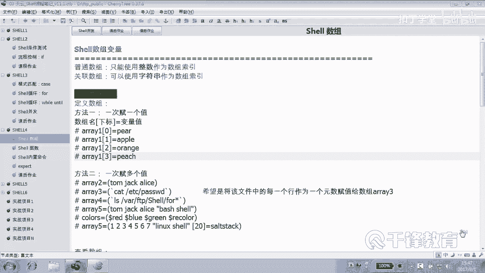

了解了数字基本概念以后，下面我们就开始来定义这个。使用数组。好，首先我们来看看几个数组的例子啊。好，下面呢我们来将hos文件的。将后四次文件的什么每一行作为数组的一个元素来做一个赋值以及。

对他做一个便译。好，我们首先使用。well循环的方式去读入每一行。然后分别呢来覆盖数组。奥瑞是数组这个名字啊这个。这个单词本身就是数组嘛，或者正列，对不对啊？井号叹号us are并下的bsh。好。

大家应该还记得我们出力行的话，well是比较擅长的吧。怎么一个语法，还记得吗？WHILEwell。read learn do down，然后是。文件名。

当然也可以把这个文件名使用doer一或者do什么来表示，对不对？好，然后紧接着呢。😊，我们先定一个普通数组，所以呢。好。我们是交是每一行付给数组。😊，那个是小谢的一个东西。这边有一个值。那。

有一个变量啊，I加加加加I是干嘛的？😊，是真是真。那我们应该是写爱加加还是加加爱呢，还是爱加加呢？😊，不是说都行，肯定不一样。加加I这取的不是I的值是。😡，所以表达式的值。如果是I加加，那就是从零开始。

因为I的值一开是零嘛。那如果是加加I呢，就是先加再负值，那就从一开始。哎，我怎么少了一半？你系。这个没关系，从我我觉得从一开始挺好的。😡，就跟那个索引匹配。啊，这这就是索引啊，这就是索引0开始。😡，嗯。

那那你看你们我反正是喜欢从一开始。😊，好。好，然后这这个完成了什么动作，告诉我。😊，这个完成了一个数组的一个赋值。循环结束以后，这里面如果有三行的话，读一行在这儿是不是host4节？

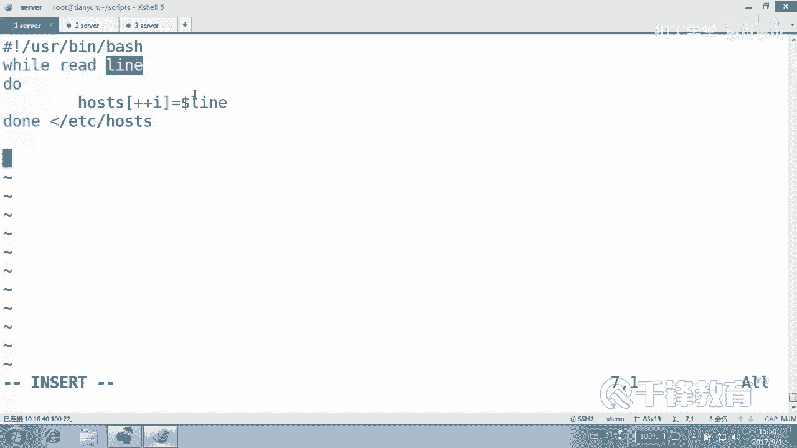

这就是单个单个赋值嘛，你看前面是不是单个单个负值。😊。

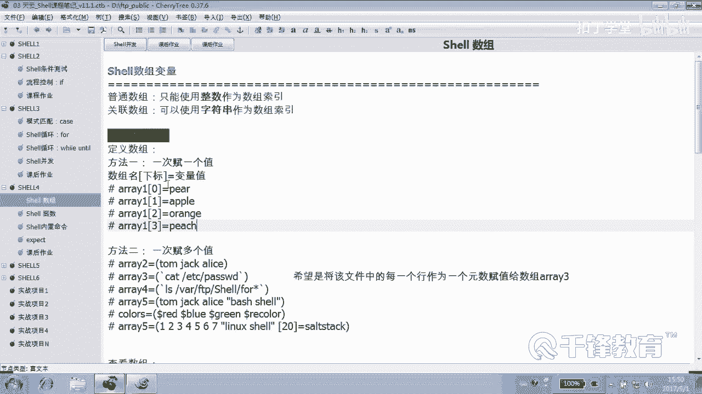

01234是不是粘个单个复制？OK那这个完成了复制以后，下面紧紧接着呢我们可以打印一下，比方说。😊，第一个元素是多少？hosts这个数组的。第一个元素。应该是哪个变量？Host是。应该是一吧。

因为我们下标是从索引是从一开始，对不对？好，这样我再加个空行。然后呢，我们下面呢来对数组做一个遍历，也就是把每一行把数组中的每一个。元素给它便历出来。For爱意。二审辩例呢？无论是普通书组还是。

关念数组我们建议大家使用索引命历，怎么获得数组的索引？嗯。是不是dollar大括号数组的名字，host是所有元素，然后加一个。叹号。还记得吗？这个是不是获得了数字的缩益？可能是0123啊。

不是1234这样的索引，然后最后度大。ecle一下哪个。那。达erI是什么东西？I这个变证里面存的是什么？😡，对，所以没错。好，WI是什么呢？是do。hos4hos4，然后是。到了来。

这里面当然这个I可以不加可以不加那个。到了福。好，那么这样的话就完成了一个。数组的一个定义以及。便秘的过程。便利啊整个把它便利一次啊。看看有没有问题，这儿。有问题吗？哪有疑问吗？这是什么？😡。

这是获得数族的缩引，对不对？是不是获得数字索引，然后索引可能是什么1234这样的数字，不是可能是就是啊，然后分别将这个值付给I，所以I里面保存的就是数组的索引。好，然后host是I，那就是。

这个索引对应的值。我们试一下。我们先看一下这个。host文件里面有几行？几航。三行最后这是一行吗？下一把。来三行看一下。A加X什么？A瑞。好，问问问各位一下，最后。这里面是有空格的。

这个文件里面是不是有空格，是有好多空格，看到吗？那问问各位，一共有几个元素，应该是。😊，是三个还是几个？好，第一个是不是第一个元素是不是这个？然后我打印那个空行，然后有123。

这个123就是我们刚才的那个索引。😊，3号。各位再看一下这这个整个这个文件。那脚本。好，现在并没有做实际的这个使用啊，这只是我们先来练习了一下怎么去给数组赋值以及什么。以及。

怎么去把数组的里面的这个元素给。便历出来。我现在还没有具体的怎么去。用一些例子。哪个地方看不懂，有没有。hos4是我抓过来的一个数族的名字吧。由于它不是关联数组。

所以也没有必要在上面deeclar一下杠大AD一下，是不是它就是个普通数组。这个加加I呢我们很清楚I的值一开始肯定是0。😊，加加I以后呢，这个表达式的值就是几就是解一那I加加呢？😊，那就是零开始。

就先赋值在运算嘛。最后这个我们可以想象一下，读到第一行。因为我们在前面给大家讲过，Y是比较擅长处理文件的，它读到的时候它就是一行嘛，管它有没有空格，是不是就一行。😊，明白吗？好。

它读到一行以后付给变量line，然后再将这个变量的值付给hos一再读一行，再把这个lan的值付给hos是什么？2、再读一行付给hosts3。如果没有的话呢，那就结束，对不对？结束又怎么变利呢？便历。

我们一定要按照什么变历？😊，所以那么doar。大括号数组名字艾艾这个艾呢是。所有的元素嘛，对吧？如果加一个叹号呢。这个ar是所有元素，你看数组是不是就两个东西啊，一个数组是它的值元素的值。

一个是什么对应的索引嘛。你们看一下数组是不是一个就是。一个是它的这个值，一个是什么？所以可以把这个地方理解为相反的意思好吗？你看相反的话。除了值以外，是不是就是索引？本来打印的把这个叹号去掉，是不是？

去掉是什么？😡，是它对应的值，然后一加它后呢就变成所引。O。好，我们获得索引以后就好办了。你看。😊，数组名加什么，所以那就得到是对应的值。至于前面这个刀的I在这干什么，只是为了显示一个编号。

123冒号编号，只是我们想看一下。😊，他得到他就是。所以。想不通。😊，能想通吧？数组这种东西是很很有用的啊，我们在后面会经常用到数组这种这样一个一种机制。好，没关系，我们下面呢再来带大家做一下。😊。

这个叫or瑞。host是for。就是使用for来把那个文件给。😊，读一遍，然后呢。最后来便历看一下啊，井号叹号USR并下的bash，这个我们使用for。是不是首先是for？表line in哪个文件？

Cat。EDCR的hoss杜当。这是干嘛？一样ho是什么？加加爱。你要不喜欢就加在这也行。OK。😊，换一个换一个方式吧。把谁付给他呢？dollar lie。但是大家很清楚，这个时候就要出事儿，什么事儿？

与 four循环。他他的分割，他不是只是按那个。行换行符，而是按照空格，而那个文件里面空格是不是特别多啊？好，最后呢我们来假装便利一下数组，还是使用for是吧？这个时候呢我们用I吧。😊，后面呢。一。

跟什么？索引怎么写？叹号数字名字叫hos4，所有的这个圈RAA。对，没错，do down打印一下什么。比第一个WI。然后是冒号，这前面的只是我的为了显示看的啊，那不重要，然后是der。😊。

hos host4。然后还。好了，这个脚本其实跟那个w脚本呢在写法上没有什么不同。是吧但是不同的是，我们知道for的一个特性就是。😊，空格分割tableable分割，还有回车分割。因此。

现在我们这个脚本。A加X。A瑞。host4点four。是不是十几号？为什么十几号？因为他就这么认为你怎么办？他是以空格和table键，还要以回车，他建到空格，他建到table，他见了什么回车之后分割。

是不是？😊，好了，这是有问题的那怎么解决？这个大家见过吧。😊，嗯。是不是IS等于。Dollar。斜线N。是不是这是化张符拼义一下。再来看。3号。明白好，那这里呢实际上你不应该为难你自己。

你应该使用Y是不是就可以？😊，在这里呢我还是想说一件事儿，各位，如果说我们后面请问大家，后面如果我再做一些别的操作的时候。括号符现在变成什么呢？换行符是不是变成了那个回车了啊，不是不是换行符。

那个分高符是不是变成回车了？那如果你想还回来那怎么办？😊。

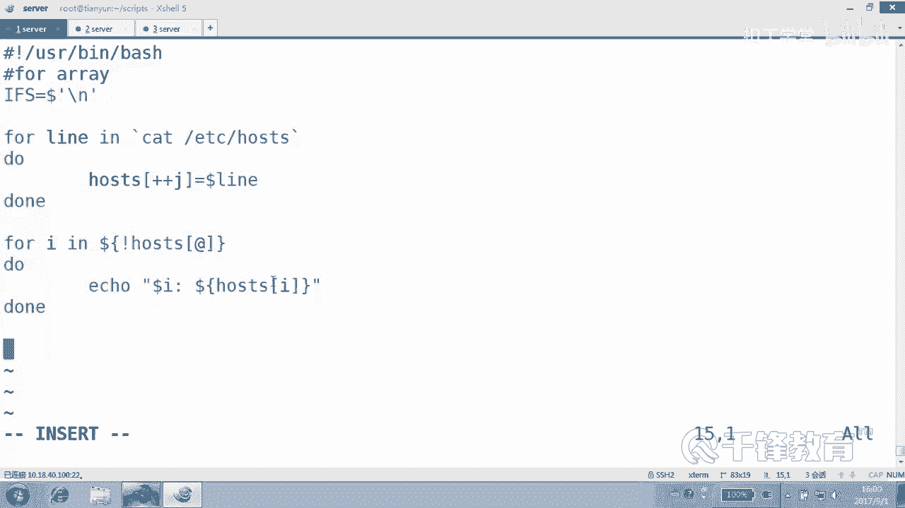

我就想这一段这么做，后面我又想还回来怎么办？😊。

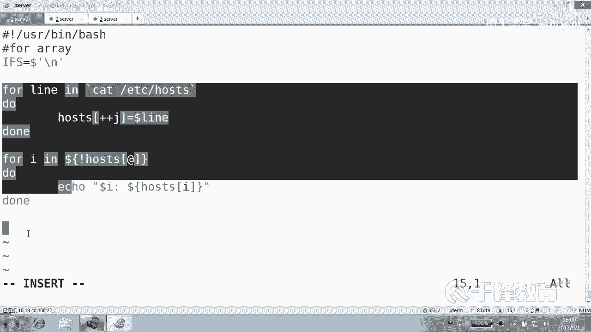

啊。No。定一个函数变一个什么？那就要看不懂就没辙了。把原来的IFS分割符先附起来，放在那儿。最后呢要的话呢，再重新付回去。所以这个很重要啊，因为你不是想这个全文都这么干啊，你可能只是在某一段是吧？

你某一段要用这个新的这个直接只是回车作为分割符。好啊，那你先把这个老的分割符先什么存起来，先付给一个老变量。😊。

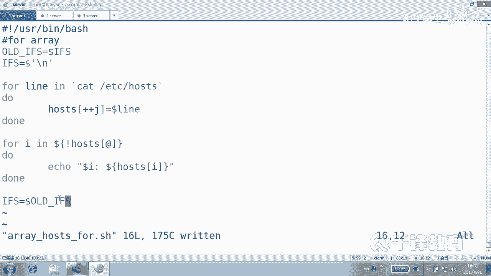

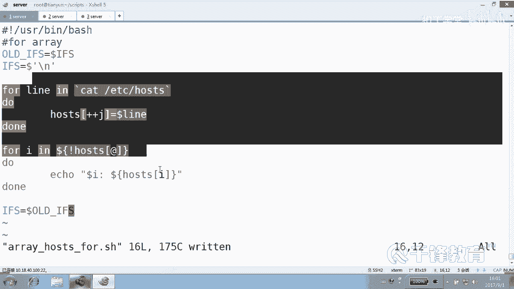

没有吗？这个编章的名字叫什么都无所谓，然后你再改，改完以后你再给还回去。😊，这能听懂吗？那如果有这样的需求，你你会不会这个。😊，好，这就是数组的一个基本的一个定义和便利。再看清楚这个地方打酱油的。啊。

重点呢还是谁？还是我们的数组的定义和编利这块。呃，既然Y这么好，那你干嘛还要使用？for因为我们一直强调哇在逐行处理文件的时候有它优势。当然如果说你就想添，你就想把什么按空格分割。那你找那个谁去？

找获去是不是？明白，但是Y见到空行，他也走不动路，还记得吗？那你可以continue。如果。这个line边上的长度是零的话，是不是可以contin？明白了吗？对Y尔界的空行，它也它有它的它的局限性。好。

那整个这是一个数组的一个。

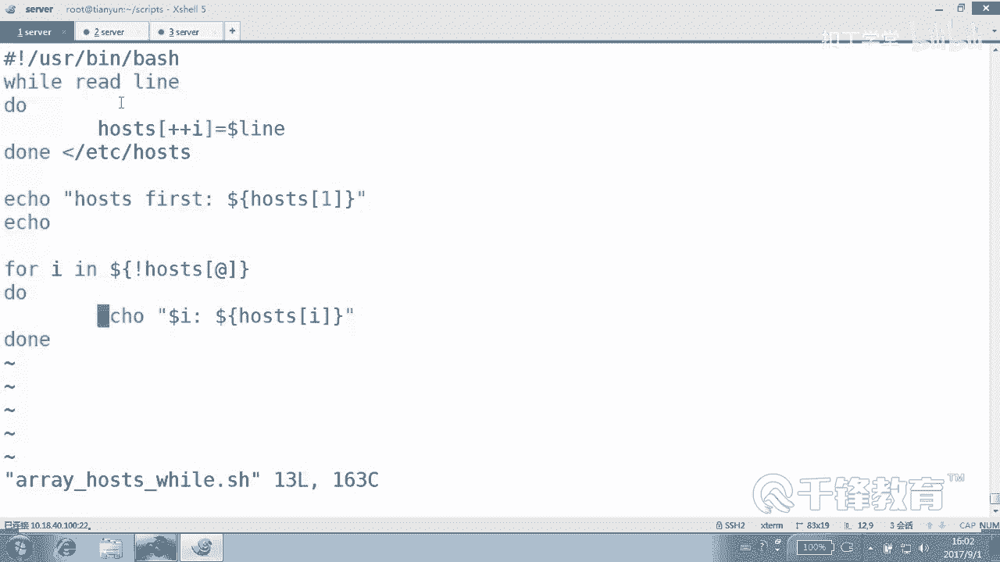

负值还有一个数组的什么便利。当是今天我们写了这么长的东西啊，我只是想说在我们明天或者后天讲AWK的时候。😊。

一行语句就搞定了，一条语句搞定。所以说。这个不是他的感觉不是他的强项，在这个笑里面不是他的强项，但是在AWK里面，一条语句特别简洁就搞定啊，也是数组，原理是一样的啊。😊，关于这个数组的定义。

各位有没有疑问？那没有疑问的话，我们后面就要用数组来真实的做一些事情哦。对不对？我们不是说定义玩的，定义呢是要定义的作用，更多的是一种统计。😊，我们后面要用它做一些事情，明白，无非就是怎么定义。

还要怎么去什么。😊。

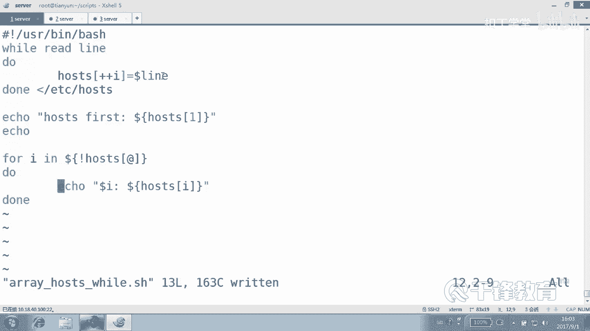

便利。

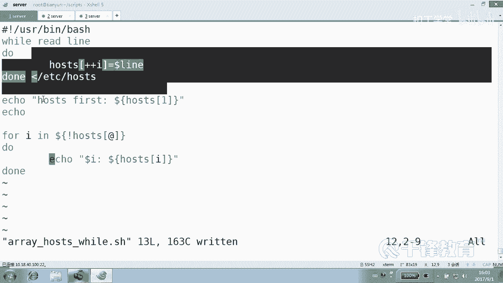

有没有有疑问吗？这有疑问吗？这如果有疑问的话，你就看屏幕，这是获得数组的什么？

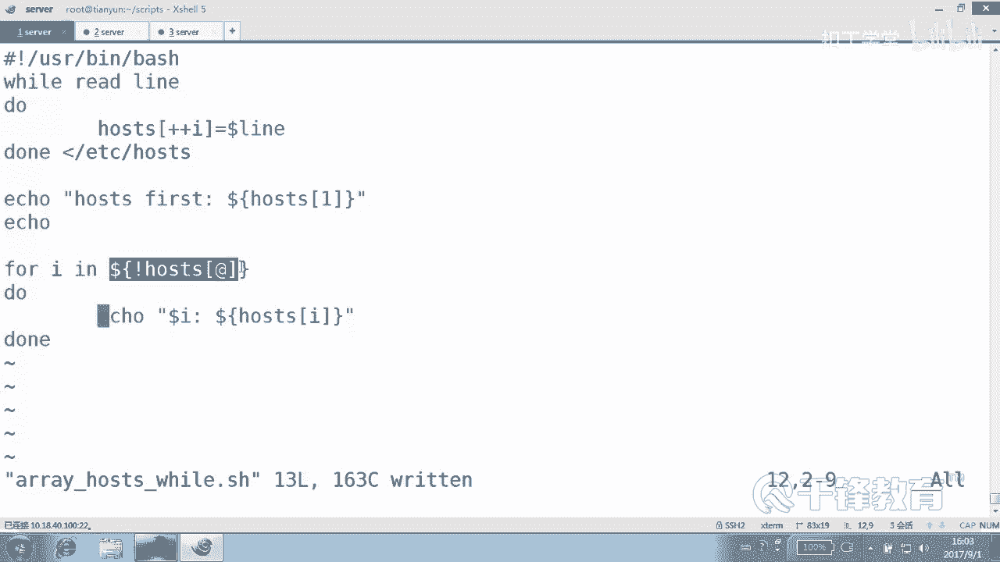

元素的索引。你看这条命令和上条命令有什么区别？啊，不不不是上一条，这条mining和第。

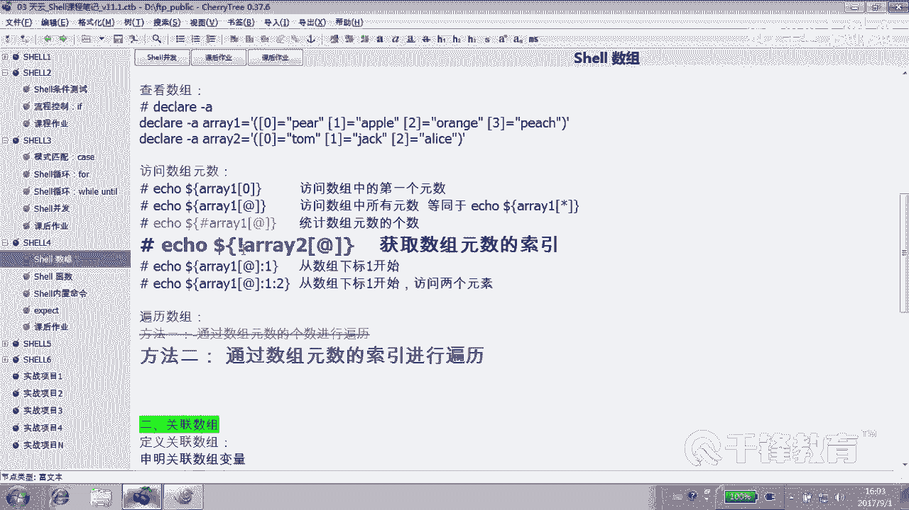

和这条。怎么你思他晃那去了，和这条有什么区别？

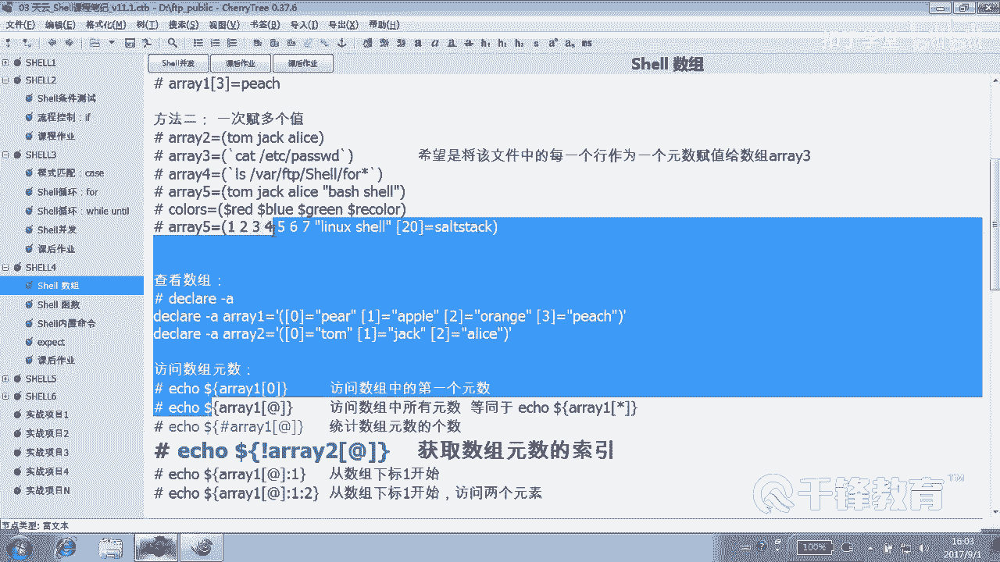

有什么区别？多了个叹号，好吧，不加叹号，这个是不是获得它所有的元素的值啊？😊，加看号获得它的什么相反的索引。另外，艾等价于星儿。明白。哎，你看很多地方是不是都是艾特等芯，而且大家也很清楚。

在以前我们在学校脚本的时候，在前面基础的时候，dollar它dollar什么？艾是所有参数吧，dollar新呢？😊，是不是也是所谓参数？明白吗？它是相通的这东西相通的，不是乱写的。好。

自己呢把这个数组呢。

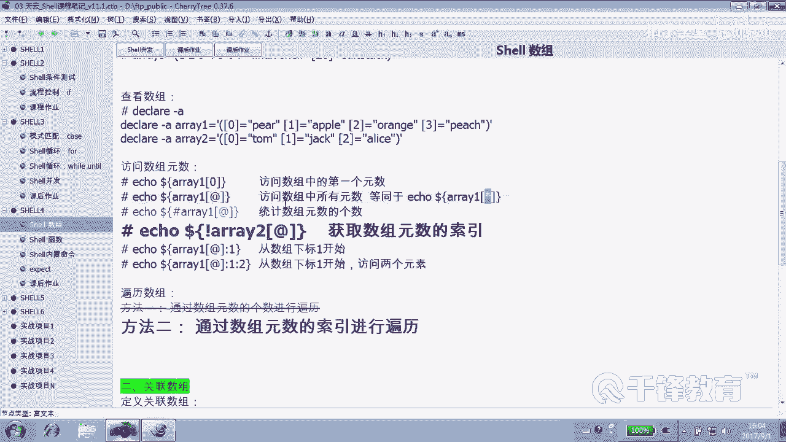

去看一下。

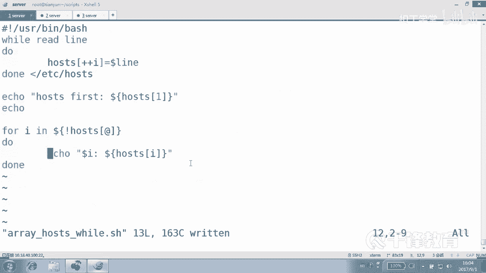