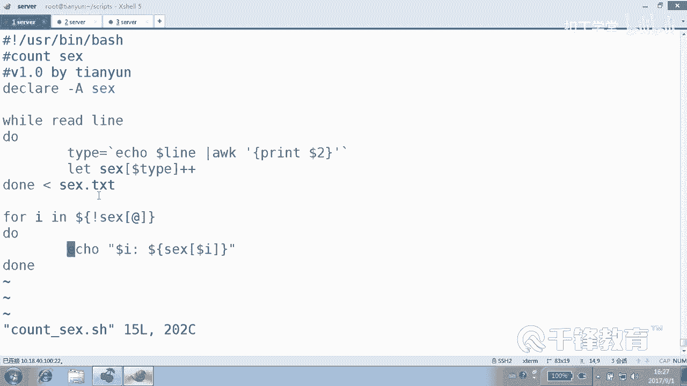
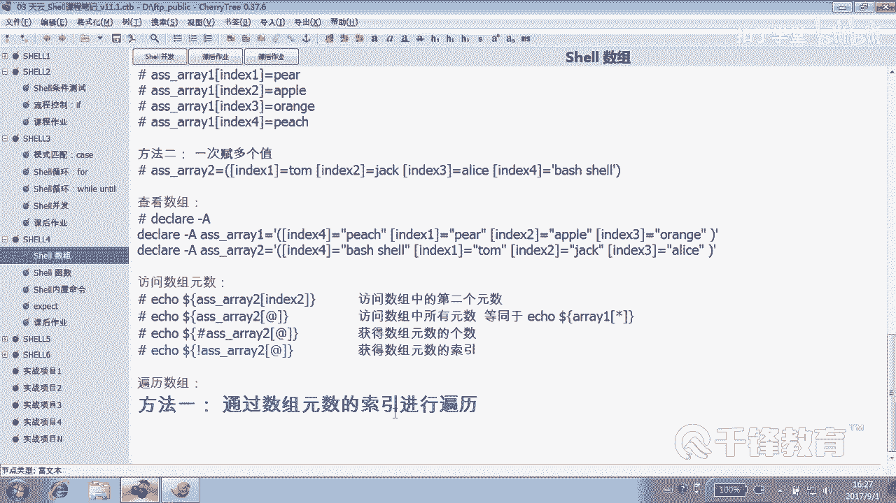
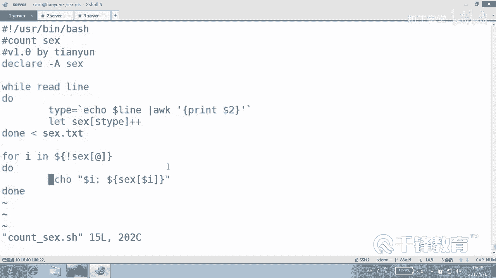

# 千锋扣丁学堂Linux云计算系列：Shell脚本自动化编程实战视频教程 - P38：6.3 array 实现性别统计 - 扣丁学堂 - BV1SE411q7vK

在前面了解了数组的基本的赋值和便利之后呢，我们下面来看如何去使用它来完成一些相应的一些操作。啊，那么下面呢我们有一个文件，各位看叫sex点TST。这里面呢分别有一些用户，用户名和他对应的性别是吧？O。

呃，当然这边我我简单的定义了几个用户而已。jackmaner ，爱ice非maner对吧？男女，tom男，rose女，罗bin男，猪猪女。这个只是定义了一下。OK好，我们要统计出它就是。😊。

男的有多少个，女的有多少个？其实当然如果用shall的话，一条命令就可以搞定。😊，明白。有se的讲过在前面。怎么一条没搞定AWK。😊，然后。打印一下第几列。打印print dollar51do two。

然后是six。是不是这个，然后再s一下，然后再是不是在unic一下。😊，杠杠C是不是可以搞定？那当然了，哎，这么三男三女的这这。😊，好，那如果使数组来怎么来做呢？很显然，这条命令呢有人说不高大上。😊。

哪那么多高大上的东西。只要能完成操作，最简单的是最好的，平凡才是最好的，对不对？😊，好，那我们呢使用数组来做一下，统计一下。😊，性别点SH这样一个脚本。减号叹号USR并下的bash。OK好，怎么统计呢？

还是一样，把那个文件是不是处理一下，用哪个加我。😊，read的。处理文件逐行处理。是不是歪了，付付付都已经说了不喜欢他了。😊，是不是这个结构还记得吗？是不是这个？然后读到一行以后。

各位是整个行是整个行都要都要付给那个数组吗？不是啊是还是不是。不是对吧？是里面的第二列，对不对？好的。那个怎么着？切啊，我们要。比方说要切一下，切成什么性别这个。性别，然后。Ele。

lan管道给AWK打印。第二列。有没有有没有问题，各位看。😊，没问题吧。没问题话，然后紧接着怎么做呢？😊，这个时候就有点不一样了。哎，不是把每一行都付给数组啊，是要统计啊，好吗？好。

下面呢有一个地方let。数组加加。数组的名字，数组的什么类型dollar TIPE。你好好好。佳佳，那这里就有一个问题了，什么问题？😊，我们这个数组的索引是什么？整数还是字符串啊？是是是整书还是肉串儿？

typeap哦，sorry，写type干嘛疯了。sex哦，这个有有的问题，这个名字不要不要这么来 mean好吗？这个就叫type。类型嘛是吧？这叫什么？Type。好，那这里呢我们看。😊。

我们获得每一行里面的性性别。然后呢，我们写了一个数组叫sex。内内型呢做加加。当然有同学说这这是。关联数组吧。所以应该在上面干嘛？叫哪个数字名叫什么？sex，好的，你要是不定义的话，这就不是关联数组。

大是同学可能看不懂这什么意思。好，有必要给你解释一下啊，看。😊，有必要解释一下？那let。A加加什么意思？应该懂吧。是不把它的值加1加1加1，请快速告诉我，现在应II应该是几？说。那为什么是2呢？

看来你要是没说说出二的人来说，肯定是前面我讲I加加和加加I的时候，你没有听。😊，我们要的是I的值，不是表达式的值。I的值一开是零，加了三字，肯定是三嘛，对不对？好，那我现在要的我现在加的不是它。

而是一个变量。😊，看啊。呃，我们写个叫什么呢？看这啊。关键数组是吧？信息或者叫就叫做性别吧。Okay。然后sex。什么。弹光号。然后是M的值是。一都不好阳。Okay。好。

现在告诉我这个数组当中有几个几个元素。怎么看？Ele dollar。sex，然后是。圈A是不是就一个元素？你白。好，这个哦这个是说错了，这不应该写阳，得重新换一下。😊，这个地方是是是那个一个一个数字。

好吧。那直接可以用M加加也可以。我们先加一先等于等于一吧，先等于一好吧。等于一现在现在的值呢肯定就是一，对不对？那我们再定一个看好了，F等于就是有一个女的。😊，现在里面有有几个元素。哎，怎么哦，重新。

M等于1F等于。他有几个收益。就一个F。哦，对，这个是这个是覆盖了，这个就覆盖了啊。嗯，那这怎么做？如果这样走的话，他就整个把那个整个覆盖掉了，像变量一样去覆盖掉了，是不是？我们可以这样做看啊。

再重新来付一下值。我们为了公正起见，我重新定义一下okK。然后。M等于。那你这个吧。现在里面是几个有几个元素。一个那不能再这么写了吧。这么写话出问题吧。就加一个元素，看到吗？是不是加一个元素？好。

这里面就变成了。是不两个元素？同样呢，它的索引是。F和M。明白。好，那我们这边是怎么用的呢？😊，我们这边在用的时候是用的是它的。现在已经现在已经啊你看。已经这个有两里里面有两个元素。

一个是M等M等于一个是什么？F等于一是不是？那我们来一个let。S。我不是想加一个元素，好吧，加一个元素是这么加，就增加一个新元素，是这么加的。我不打算再加一个元素，而是。这样做。把它的这个元素。

它的值再加个一。明白那，现在就变成两个篮子了，对不对？😊，然后再加个一，看到吗？那如果这边呢我又统计到一个女的，个女的加一。我又统计这个蓝的，就是蓝的加一。😊，相同的话就加一了。

所以因因因此最后我们看到这个结果是。我们看它的值，好吧。是不是两个。两个。F4个M。就是值加一，注意这里呢给大家解释一下，这个加等是元素加一个。整个元素加一个，而这个是什么呢？它的某一个元素的值。

某一个索引对应的值去加去做一个做一个自加。那只要相同了。也就是说我现在我们看到有一个。😊，萨克。哎，在哪儿啊？没有这个吗？sex点TIC在哪儿？在这儿啊看这边是不是有一个。😊，有一个这个saxTST。

我们把这个M作为什么呢？M或者F作为数组的索引就可以了。所以最后我们会有这样一个结果，就是相当于呢一个是M。是不是作位数字的缩引？如果统计到一个就怎么办？就加加就是加一，好吧。是不是统计到一个就加一。

比如我们第一个第一行读出来以后是M，对吧？好，那我们就sexM加加。😊，第二行统计到是什么呢？这不能不这么翘啊，前面是加let，是不是可以？😊，第二行如果统计到的是。F那就F加加。那么第一次我问大家。

第一次加完以后，这个值是几？😊，是不是一啊？它加完以后加到这儿，它只是减，它也是一，看到吗？😊，然后紧接着呢，我们统计到第三第三行的时候，是不是又是sXM加加？就是把它的什么，把它来作为数组的。

把你要统计的那个对象来统计的那个类型。让它成为数组的索引就可以。明白。好，也可能不太好理解啊可能不太好理解。但是呢这个这个有用。😊，就是把我们要统计的这个什么。注意这里的有要记住。let SEEX哦。

不是let SEX加等。这个是加一个。加一个什么新的一个元素，是不是？而我们呢这样的话是加一个新的元素，比方说加一个什么元素？😊，嗯，还有第三类人吗？这样的。等一。这个是加一个新的元素。

原来你看这个sixs里面有几个元，有有几个那个元素，一个是M，还有一个是F吧。我现在又加了一个。😊，这个不是这个是加多加一个元素，而我们现在要加什么？是加某一个元素对应的值。对，值怎么加？let。

sex，所以。加加这种形式，这两种加是不一样的。我们现在是加一个元素，还是加还是加个加个值啊，还是去加哪哪加它哪加它的值。😊，是不是哪哪加它的值？好，也就是说我们看到这个例子当中。你看读进来一行。

然后取到它的第二列，这个t是什么？这个type我们我们看一下刚才那个t里面的。这个tle是不是第一个是M呀？好，那我们就sex什么加佳。M加佳。是M加加。那么紧接着呢，第二次循环的时候统计到的是一个F。

那就sexF加加。那么如果第三列读到的时候又是一个M，那再次给M加加M就变成2了，看到了吗？是这样往后走的。就是你不管他有几几种人，你看就算他里面还有一种人什么人。😡，第三信三信的人看吗？狗狗。

狗狗可能是X这种性别。不是不知道什么性别。好的，没关系。你看最后是sexM加加s什么M加加sexM又加加。😊，就相当于那个你们原来因为看过那个投票写这个政字，那个还记得吗？有有那个印象吗？

就是选班长选选选中投统计到这儿，就在你那再画一票，统计到你统计到又是选你的话，又在你那画一票，看到吗？就和这个性质很相似？😊，O。行，我们看看最终结果。哪个脚本？A加Xs哎。奥瑞是不是？没写完我们。哦。

没保存吧。countt sex。A加X。Count。Thanks。Count。哦，后面没有哎，怎么没有东西啊？你知道为什么没东西吗？只是完成了一个什么。😊，数组的一个负值还差一个。我们首先获得数组的。

海le只能挨le一个。那你你怎么知道它里面有多少种内心？你只有便利的话，里面假如说100种类型呢。好，那我们是数组名字叫sax，然后所有元素取一个它的索引，是不是？然后do down。

ele哪种缩引到了I这种索引。它的值是刀根。sex对应那个I好，完成数组变历。来，我们先敲一下这个过程，好吧。诶。这了系。关系。发生事故。和快键速度一样便利，它怎么会不便利？关联我们就不是上方不是第。

不是找数。他的下标是。就是要他的M呀，这不是已经这不前面显示的就是FM吗？看到吗？😊，🤧咳。前面显示的本身就是FM嘛，对不对？我们哪儿写错了？Let sex。type加加。然后是在在在。哦。

这边呢这个不是整数了，是吧？这这边实际上一那个我们在一开始变利那个。什么数组？普通数组的时候没有加do是吧？这个地方呢？需要加do。但是你统一都养成加doller的习惯就行。好吧。

其实很少有哪个地方不用去引用变量的时候，不加dollar。OK这个时候就已经辨历出来了，一共男的有3个，女的有3个。还有一个性别的人呢，只有一个。好，整个过程我们再来看一下。😊。

我们首先定义一个关念数组，是不是？然后从那个sex里面去读入行取到第几列。第二列第二列呢，我们看到。可可能是M，也可能是什么F没关系，我们就s，比如说M加加读到M的时候，是不是就sexM加加。

这加的不是不是说多加一个元素，而是什么？😊，不是说多加一个元素，而是去加它的值，对不对？然后读到再如果读到一个M呢，那就再次sX什么M加加相同的话就加一就可以。如果读到F呢，那就是sF加加。

那么整个读完以后，那我们完成了一个数组的一个。赋值的操作。最后呢我们来便历便历的时候同样要干嘛？😊。

无论是普通数组还是关联数组，我们建议大家都只是通过索引便历，看到吗？索引便例。

那么这很显然，它获得的索引就是M或者F，还有X，是不是？这几类吧。然后这个是它的什么它的值。明白。好，给大家几分钟时间来把这个整个这个脚本呢。😊，看一下。好。

我们刚才所做的就是统计统计这个一个文件里面某一种类型出现的次数。方法就是什么？把你要统计的那个对象作为数组的。所以然后把它的值。累加一。遇到这玩意儿就加一，遇到这玩意儿就加一。明白。

