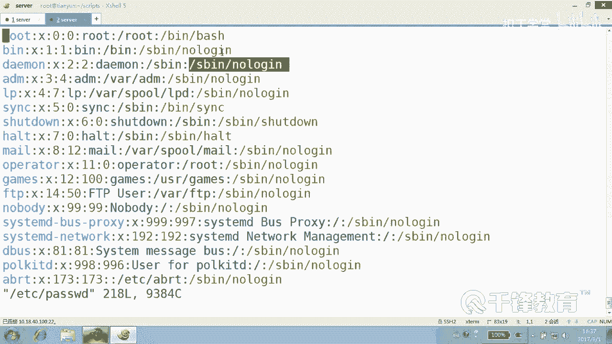

# 千锋扣丁学堂Linux云计算系列：Shell脚本自动化编程实战视频教程 - P39：6.4 array 统计不同类型shell的数量 - 扣丁学堂 - BV1SE411q7vK

好，各位狗人对刚才我们讲的那个性别统计呢，按那个方法不熟悉，还是那句话我再送给你就是。把要统计的那种什么对象。是不是？对象可能有可能有多种对象，是不是？作为什么作为数组的。数组。的索引。然后最后呢。

最后对他们的值进行。累加比如说sax。M。佳佳是不是？赛克斯什么？😡，遇到第二次，是不是同样还是赛axM？😡，佳佳。那也可能是sax是什么F。😊，加加注意加的是它们的值，而M和F是索引，明白。

你想统计什么东西，就把它统计的对象作为数组的索引。当然一定是关联数组才可以明白。😊，这句话最好记一下啊，就是。要统计什么东西，然后你把它作为数组的索引。这个话适用于我们后面讲到的。

其他的这个数组的这个使用方式。我们最后要的就是那个索引和对应的值。明白了吗？好，你们这个记笔记啊，就是不说记的话，就不记。我要说开始。有寄。我不可能把这东西留在屏幕上，留留留留一阵子。😡，好，各位。

那我们下面呢来统计一个东西，各位看。同样来看EBC下的。有一个叫password的文件，对吧？里面是不是出现了看。😊，好多种事啊。是不是我想统计出这种sll出现了多少次，这种sll出现多少次。

这种sll出现多多少次。那我还是那句话，把你要统计的对象作为什么？所以明白了吗？嗯。那么统计一下。Shells。的数量。BIM count shell数量。井号叹号USR并下的bash。

然后count什么hells。同样第一个关联数组。d杠A，我们就叫slls，好吧，这样一个数组。那么同样是不是使用well，我们说处理文件最凶的就是它了well read land do down。

EDCR的什么它word文件。好，那各位读过来的这一行，整个就是 shell的类型吗？😊，不是，那怎么办？那我们就截一下，还是一样用类型吧，好吧。用反引号echo dollar什么line。line。

然后管道给AWK。打注意这个地方要注意是按照冒号分割，按照冒号分割，最好使用双引号，把这个分割符引起来，打印你几列。注意一定不是第七列，为什么？有些行是第七列，有些行有哦冒号分割就是第七列。

冒号分割肯定是第七列。如果按空格分割的话，还不是。当然为了保险起见的话，可以使用NF就是最后一列。😊，明白吗？好了，各位我获得的是什么？😊，获者这个类型是什么东西？就是笑类型，一长串嘛，是不是一长串？

然后呢，我们讲过let书足。😊，ss，然后。dollar type加加完了就这样子，看到吗？你要统计啥，就把它找到以后，比如说我们第一次找到的是bsh是吧，那就加一啊。第二次找到了还是外事。😡。

那又加一，这票是不是又投给他的？第三次找到的是可能是lowlow gain，那就在lowlo gain上加一。😊，是多给你值加一，第四次找到的是b事okK又在b事上加一，最后你获得了很多票。😊，好。

那么这个脚本完成的工作就是数组的一个。负值对不对？我再说一遍，你看。ETCR的pass word。

第一行找到的是B下的拜事，是不是这个座为缩引？😊，看是不是ss什么。ss这个。

ss陛下跟下的并下的bash加一，它得几票，现在一票，然后请找第二然呢。😊。

这是不是又是ss跟下的并下的S并下lo了in加一，它是不是得一票了？第三行找到循环的时候，又来一个。又来1个SB noin，他是不是得两票，再来一个来一个来一个读到这儿的时候呢。😊。

放心，由于索引不一样，肯定不会加到他身上去。明白吗？那么不断的去做，无你不用管这里面有多少个，反正做一个累加就可以了。能听懂吗？各位。找到什么就在它的索引，它对应的那个值上加一加一加加加一，对不对？

能听懂吗？各位。好，然后呢我们做完以后，我们要想打印结果怎么办？forourIe数组的索引。Dollar。什么。这个。数组的名字叫slls，然后是艾所有元素，然后反向得到索引do。到。

你看数组的负值也是一个。循环数字的便利呢。也是循环，对不对？Ele。当然你可以显示一下dotaII是什么？I是我们的数组的，所以，也就是那个he的那那些hell，对不对？然后紧接着呢，doar。嗯。

slls。这边加上dollar。I。数组名加索引，那得到的是它的值。就是哪种索引有多少，它的值是多少？好，如此以来，我们就能够统计出。sell的一个数量。看一下看有没有有没有疑问这儿。有有没有疑问？

没有吧。好，如果没有的话呢，我们来试一下。就是我们在便利的时候，一直是按照索引变历，这个没有改变过，是不是？虽然说有呃虽然说呃它这个关联数组只有索引，而普通数组的话可以按照。😊，个数便利有多少个。啊。

保存。然后。给他一个。权限。Cot shell。哎，报错了。说明哪个地方有语法错误是吧？😊，哎，这看不出来啊。AWK打印地。最后一列。括号没有一号，单引号单引哦，没有加单引号。你看这个颜色上确实有点。

如果你仔细看的话，真看出来了。看这个后面那个括号是显示。一颜色不对啊。这才对吧？所以这这是一个原则上的错误。其实我我跟你说，有时候他这种检查是检查不出来的，他只能检查那种什么if服啊，house啊。

这种错误才能检查出来。但是他检查不出来你里面语句错误，他检查不到，他也不知道那些min是不是应跟他们敲的。😊，这个他判断不了，对不对？它检查的是shall的语法，而不是。某一条具体的。命令的语法。

明白吗？那个是只能靠人检查。啊，拜师学170呢已经别人均成了，和我身高一样高啊。😊，啊。😮，这个能看懂吗？各位打开，你们再搂一眼看。😊，其实这个和前面的那个写法是。一模一样吧。各位。

这里面最关键就是要先定义关联数组，你要是不定义。啥玩意儿都没有，啥玩意儿都是假的，好吧。😡，你要是不对意的话，他就是一个普通数字。😡，然后一切都是假的。当然。如果说你觉得这个sll比较讨厌的话呢。

当然这种这种事情真的不是sll的强项，明白吗？是谁的强项呢？😊，AWK后面AWK的想项。😊，嗯，如果说要这么做的话，其实我们前面也知道就是。应该这样做看AWK。骂号峰哥吧，打印第几年，哎呦。

又忘了写了一个单引号，这家伙。😊，打印到NF。哪个文件？他s word是不是最后一列？然后再。st，然后再什么unicical。杠C是不是一下就搞搞搞清楚了看。😊，实际上这个统计也是一样，很很简单的。

你有很多种方法。😊，但这个不高大上嘛，是不是？我烦。这高大上。あでそれは。我们还是现在在学数组啊，那我们还是用数组这种方式去看待ok。在数字里面呢就是这样。先把那个你要统计的对象给它弄出来。

来作为关联数组的。所以然后给他加加把它的这加加加的是什么？注意加加有两个东西。😊，加加的话是加了它的值，看到吗？不是增加一个。数组的一个元素OK而是加它值，而我们要的就是加它的值。能听懂吗？

各位最后遍利数组的时候，这儿要小心点，这儿不能再次使用那个叫。😊，不是。不是圈A，不能再能使，不不能再使用I，就这么简单的一个I要带上这个。dollar，但是你养成习惯，你就不要把它省掉就行。好吧。

这前面你是不是也不要省掉？好，这就是怎么去什么统计hell的一个数量。好，统计男女性别统计过了，统计sll统计过了，那还能统计什么呢？还有可统计的吗？一切都是可统计的。

