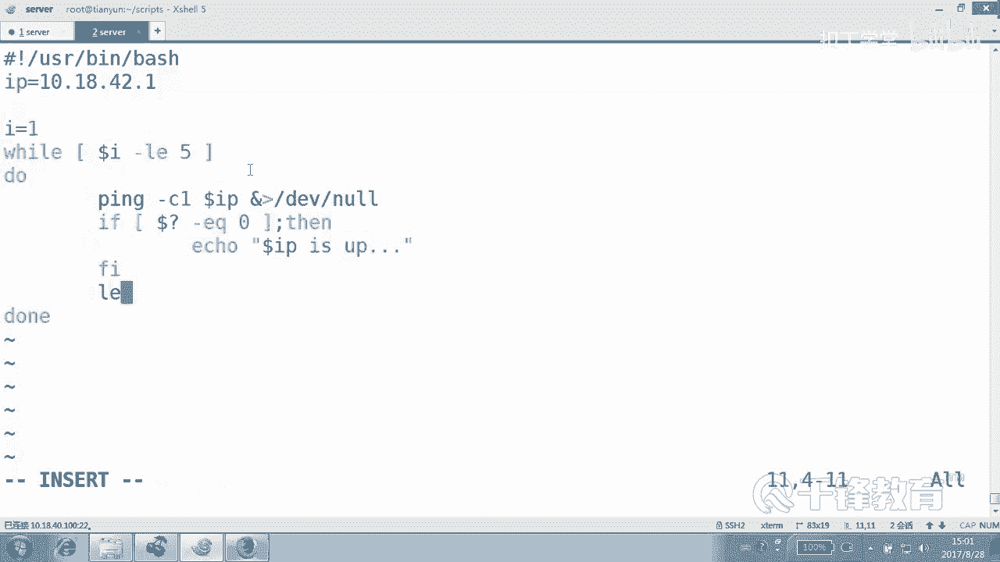

# 千锋扣丁学堂Linux云计算系列：Shell脚本自动化编程实战视频教程 - P3：2.5 变量 的运算 整数小数 - 扣丁学堂 - BV1SE411q7vK

好的，我们在这个变量的使用当中会用到变量的一些运算运算方式。这里呢。

所谓的变量运算就。加减乘除取对吧？或者是。

相应的这样一些动作。那么这个运算呢用来干什么呢？当然会有很多例子，这边呢我们来看一看。😊，先看一下我们比较常见的一些方法。我们一般所说的运算90%以上都是整数运算。数值的这种整数运算。啊。

用到的方法有这么几个看EXPR。😊，当了两个什么？小工号dollar放工号，还有呢let。当然，计算器呢也可以用于整数运算，也可以啊，我们一般用的比较多的呢是这这几种，这里面应该说最多的应该是。第一。

四种。let来做运算。好，首先呢我们来看看。😊。

通过EXPR，刚才我们用ele的方式，你看啊。我们用iccle一加上3，这肯定还是一加3是吧？纯粹是一个字符串。如果我们采用。😊，这就是4。虽然说。变量一的值是1，变量二的值呢是20。

但是实际上这里是还是我们说出所说的字符串吧。但如果说你使用EXPR。来将什么number一加上到number2，这个结果是30。注意到了吗？但这种方式用的相对来说少一点。

他是他是把两个值或者多个值呢，然后做一个运算，然后最后呢显示相应的值。大家有同学说，老师，我能不能把这两个值付给一个变量啊？😊。

就把这个预算结果付给别量，付给新编量，可不可以？可以这样吗？可以这样吗？可以吗？对，先人吗？先执行，然后把整个付给这个变量30，这个还挺麻烦的，看到吗？也就说你如果想把这个值，它本来EXPR的。

它的它的这个特点就是很容易去给你呈现出来这个结果是吧？但是你想付给某一个变量，这个有点不太舒服。😊。

这个加。加什么意思？不用讲了吧，减也不用讲了吧，乘由于这个乘号是有特殊含义的，所以呢。😊。

我们得转移一下，因为大家知道信号指的是。没有。信号指的是任意。任意多个字符，所以呢我们要使用转E。好，现在应该能看到dollar SUM应该是什么值？😊，10乘以20吧。

200嘛，对不对？没有问题。好，但是这不是我喜欢的这种方式。😊，这这种方式。这是什么？😡，这可不是取鱼啊。这除这是取是不是？好。这是第一种方式。呃。

之所以写出来的话呢是因为它也确实是我们整数运算的一种方法。但是呢。我不太喜欢它啊，那么第二种方式呢，其实也是一样，你看。😊，也是直接能够呈现出来。我们。用到的是。到了。两个人吗？

小括号的形式不是到了一个小括号，倒了两个小括号。😊。

看一下效果。dollar echo，你要是不icle的话，这样行吗？我记得有一个number。😊，dollar number什么一加上dollar什么number2，这是报错了，他认为这不是一条命令。

对不对？😊，我们可以把它作为。这样写可以吗？那结果是什么？😡，是吧这样写是可以的，当然你也可以直接把它整个给它。😊，显示出来也可以。没问题吧。在这里有个好处是，听好了。😊。

你甚至不需要写这里面的dollar，看在小框里面doar都不用写。这是加这是。Jie。这是。Cheng。储物。这个除为什么是这样一个效果啊？因为。整这个商微商对，没法没法没法来除啊，他整它只去90部分。

我们找一个数字，找一个number。一是。7、好吧。Number2是。2。然后最后呢，我们再来number一除以number23。然后如果取余数呢，应该是余一吧，对不对？当然甚至还可以怎么做。

我们就写数字吧。二的。三次方。注意下了吗？二的3次方3个2相乘，你们不是一直原来说二的10次方吗？1024是不是10024这样一个值。O。😊，也就是在这里面实际上是不用写那个叫什么。

变量的。do尔福的。它这里面信号也没问题，直接使用信号。因为在这在这个在这里面，当然有同学说。😊。

嗯，挺搞笑的是他说。😊，这是几个框。2。加3乘以5。得几。嗯，没错。5五二十五啊，所以有人问我说怎么三个括号，那不是那个括号，不是干那个事儿的，那个括号是改变运算什么顺序的啊，那个括号是干那个事儿的。

你可以多吃几个啊。😊，啊。好，注意这一点好吧。😊。

那这里呢这种方法其实也不是我特别喜欢的方式啊，也还可以用来两个数字相两个数字去那个做做运算，没问题。😊，然后呢，还有一种方法是我特别喜欢的就是dollar小方块2。😊。

直接。到了小方锅二，不是两个两个那个。2。加2。2减2。2除以22磨上2。是于林吧，还有呢二的。2次方。二的3次方。好的干脆来个十字方吧，1024，这个是一样的，这两种写法是一样的，看到吗？

当然也可以将这个结果直接付给谁。😊，收付给一个新的number。是不是也可以这？Do了。number1024。明白吗？

可以这样做。就是这个EXPR它要算，它是要借助于EXPR来算的。而本身人人家就能干什么。😡，就能算对，剩下就能够什么就能计算吧。只是为了干嘛的？😡，打印一下这个结果，你完全可以将这个运算的结果。

这个运算的结果复制给什么？😊，另外一个变量是不是？而这个ESPR我之所以看不起它，因为它本身它要算的话，还要借助于EXPR来算，明白。😊，好，那么这个比较喜欢的是这个东西let。我特别喜欢他。

let这种方式。Let。他这样写不行啊，1加2。这个写的结果。看不到是什么效果面吗？😡，你你可以呢同样付给一个什么？变量是不是3？耐。

那这边有人说这个算是干嘛的？在在我们在这个应用当中有没有运算的东西呢？有。😊，好，我们下面呢来看。看这么几个例子啊，来看一下这个运算在脚本当中的一些具体的一些使用，好吧。😊。

应该说经常使用。

经常使用。好，那么。我们举一个例子，我想知道我内存。现在。这个已经使用。占到了什么？总的使用的百分之多少？看明有吗？那是不是要算啊？当然在脚本里面算也可以，或者在命令行下算一算也可以吧。😊，好。

我们假如说随便写一个脚本叫MEM。备存的使用。是吧。好，类存使用点SH这个脚本。这里呢要需要一些东西，需要什么东西呢？你看第一，我要把这个数字抓出来，明白吗？😊，我开两个终端啊，一个终端在这边呢看着。

哦，这个状态怎么字体？不一样大。

啊，这个字己被我调小了，好像是吧？😊，好。左侧这个终端，我们来获得这个值，右侧终端呢来写。怎么获得这个值啊？我们现在先从命令行向演练一下。😊，一个是。内存的USE。USE吧点SH好吧。哦，高高位告诉我。

我怎么获得这个已使用。先是不是这样的，然后再管道给什么gra没错，gra过滤什么呢？以什么开头的？以MEMmo开头的。好，就是这样的吧。然后紧接着呢在AWK还记得吗？😊，上次谁说看到AW老在打。

这至于大吗？不就打印还得几列吗？第几列。😊，到了。3列好，是不是1114？14吧。不是你以为他不变呀。😡，这是内存的使用，它它应该变吧。对呀，凭什么它不变呢？好，另外一个这是这是什么，这是是不是已使用？

😊，一使用这个值。USUSED是吧，一使用。好，我们先得到两个变量。😊。

那个叹号USR并下的什么？但lash来第一个变量内存的。已使用。能直接这么写吗？到底是使用反引号还是使用那个叫什么？叫那个叫。这样可不可以？可不可以？另外一个MEM。

偷to。这个直接打印第几个。打印第二列就可以。好，获得这个值。同样这些东西都不是手动在脚本里面能够直接写出来的，而是要经过在命令行下去干嘛？😊。

试去敲一下。然后同样反引号也行，或者是。那个叫。到效果好。另外还有什么？😊，完比吧。好。我们来写一个百分比。内存的百分比是吧？好，这个时候是不是就要用来用来计算了？😊，看一下哎。

各位都一块看一下怎么计算。😊，用什么数除以什么数？嗯，你要使用的话，统一的话就要用什么方法，用什么方法吧，那我们也转一下这个dollar。一堆括号好吧，反正是都可以。😊，但是我的意思是尽量要统一嘛。

对吧？上下是不是统一一下，用dollar哎，其实不用写dollar也行了。😊，用MEM。这个去除以。你觉得有问题吗？😡，有没有问题，我们看一下表当前。内存。使用的。百分比是是吧。嗯。

我们假如说这么做一下，看啊，MEMper。好，试一下啊。给他一个。给他一个权限是吧？😊，Yeah。怎么会是0%呢？😡，难道难道他是不是算错了，这样听我说听我说，有些时候啊可能真的是脚本写错了。

有些时候对不对？所以我们执行的时候该以怎么执行？😊，杠VX以这种调试的方式执行。好，看到了，然后紧接后面加那个叫内存的百分比内存的使用VX你看到吗？它在整个执行的时候，是不是调试的方式。

他把这条命令的结果拿到了吧。😊。

这个命令结果你看。这些没都没有显示啊。😡，都没有显示，对不对？是不是拿到了，最后是不是用这个数字去除以这个数字得到了一个零呢？这个整个过程没有错，错在哪呢？错。😡，对场。对，这个不是取反了。

反倒是没有取反。就是说他取的是整数。所以我们既然知道要乘100，那还不如先什么。😊，乘以100。

或者是别的方法。

2%。是吧。看到了吗？是2%。嗯。1111111那个1113后面那个数字好大的那个数字是吧？OK明白了吧？所以运算是无处不在，我们很多时候都需要用的运算，而不是像我们刚才一样无聊的去什么去算个2加3。

不是我们要运算。😊，对不对？这什么意思啊？我们无论是硬盘还是内存，是不是都有可能去做这样的操作，去取道当前使用的情况，或者说剩余的空间再去干嘛？😊，再去那个除以总空间是吧？做这样的一些运算。好。

下面我们再给大家来看一个运算。看一个运算啊，来这个你们看到了吗？这个来再看一个。😊，这个呢。我们来写一个叫幸。评几呢？刚才有过好多聘了吧。来拼一下。叫叫001吧，点SH。换一个方式。

井号叹号USR并下的这个叫besh。然后这边呢。呃，今天同样不要太注重这个语法，好吧，语法我们在后面会详细讲，今天注注重的是我们先讲的是变量的运算，还记得吗？好，变量运算。😊。

那我们现在想做个什么事情呢？我们想写一个聘程序。大家知道拼的话。😊，拼的话默认是拼几次。默认是一直拼吧。那我们可以。只拼歌几次呢？只凭个。相应的次数。那这个时候可以用到循环是吧？这个循环的种类很多。

可以用到N种循环好，然后。😊，we are for循环，最简单的for循环for。😊，IE。然后拼几次，刚刚说了。比如说五次吧，好吧。度荡。然后我们来拼拼杠C1拼哪个主机呢？10。18点。40。点42。

1，同样将这个过程整个。不要。好，判断一下，如果什么。这个整个结构是先写完。如果。如果。到了问号EQ等于什么？等于你。那我们就说通，对不对？海口。主机但这边应该有第一个变量是吧？按照标准的话。

是不是应该定一个变量？10。18点多少42。1。下面拼这个。变量的值就可以。到了什么？IP。WIP is。Up。好，这个没有问题，这个小脚本呢就拼4次是吧？😊，这个本身没有问题，很简单，for循环。

第一次呢，这个是变量的名字。😊，这的名字是I吧，然后第一次会将这个一的这个值付给I，那就循环一次。然后完了以后呢，再办什么？😡，再把这个。第二个只覆盖循环一次。哦，当然实际上这边。这个用运算用不上。

这个for循环用运算用不上。因为for的话，每次。这个或取环用不上啊。好，我霍循环因为很固定的，就是一共就是什么。😊，就是4次，而且每次呢第一次是一，第二次是2。好，用外要询问。Y我们还没有讲过是吧？

Y循环。😊，嗯。当A小于。比方小于5小于等于5。首先呢。先给I付一个值。还是一。我们就改了一个小地方，看到吗？😊，I的值一开始是什么？一开始一一小于等于5吗？😊，小于吗？因为这个Y循环呢。😊。

虽然说还没有特别讲过，但是先告诉各位这个条件只要成立，反还为真，这个循环就会一直循环下去，看到吗？😊，好，各位看啊现在呢。😊，I的值这个要初值是一。然后紧接着呢，I的值小于等于5吗？小吗？嗯，小于内。

那循不循环拼完了以后呢，如果说你不加以干涉的话。😊，第二次循环的时候，I的值还是一一照样小于等于5。循环完了以后呢。I的值还是一，这就是一个死循环，看到吗？对，我们先看一下，然后再来回头来说一下。😊。

平。001。平001看一下。没有结束的时候，为什么？除非你扛住C。因为始终挨的只是解。😡，你看你没有预算呀，你这儿说的没错，I一开始等于一没有错。😡，但只要这个条件为真。就会循环是吧？

这个条件只要为真就会循环。那么第一次I的值小于等于5，这个LE是小于等于例思啊啊小于等于5。😊，那就循环下一次呢还是等于这个。所以我们应该做什么呢？在每次循环完了以后。

看到刚才我们有一个有一个这个let，我说我特别喜欢这种方式吧，let，然后I加加。😊。

就是把II加加什么意思呢？就是letI等于I加一就是把I的值能从原来基础上再加一个一，我们一般解就直接写成III什么加加就可以，这并不用给我呈现出I的值是多少，我不用知道，明白吗？我不用知道。

如果你真的想知道的话，你可以把这个把它的运算付给一个变量，是吧？我不想知道，我只是为了让下一次这个I的值呢能够去影响到我们后续的这个运行，对不对？你看。😊，第一次我们再说一遍，第一次I的值是几。😊。

初值是不是一一小不小于等于5，小不小于。😡，那就循环循循环结束，这次循环结束以后会怎么样？😊，会加一，那I变成几？二小于等于5吗？嗯，那就循环再加一三小于等于5吗？再加一四小于等于5吗？

循环完以后加一五小于等于5吗？😊，5小于等于5吗？小于等于5加1就六小于等于5吗？嗯，那就循环就结束了。好吧，看一下P00什么。一是不是5次？所以说在很多时候我们是需要用来干嘛的。

算的那这个地方是为了让变量的值自增。那还有很多时候什么？我们可以用它去统计，我们一共执行了多少次。😊，累去累计，我通过就一个简单的letI加加，我就最后能够知道I这个值是多少。😊。

那么做一次我们加一做一次是不是加一，所以我们可以用来统计，我们一共在这个事情上面所执行的次数都可以。因此let呢light并不一定给你呈现出这个值是多少，但是呢它用来做运算就可以了，明白吗？好。

这就是我们在经常在脚本当中，我刚刚举了两个例子，一个是内存的使用的一个运算是吧？很直接很干脆是吧？就是很明显的这种运算方式，那另外呢我们举了一个这个叫p001。然后呢去为了P5次，但是呢我们要做累加。

不然的话呢，下次那个值还是一对不对？是这样一个情况。😊。

好，当然有同学说老师那个我我我想要小数预算行吗？😊，这个计算器啊既可以走小数运算，也可以做整数运算。我们lininux有计算器，对吧？叫BC计算器，你可以把这个值把这个东西传给什么？

这个BC可以怎么用呢？可以这样用，看BC回车，这是交互式的对吧？是不是1加231除以2。😊。

但是他默认没有保保留那个什么。少数。

那你完全可以，因为交互的东西是很惨的，我们可以采用这种非交互的方式，整个把这个结果传给什么BC这是2乘以4，这是二等于什么？

这什么意思？no他不支持他支持的这个是这种方式，24次方。好吧，就是不同的软件是不一样的。大部分情况就是我们刚才前面讲过的那种两个信两个什么，两个信号。那么当然你也可以呢。😊。

scalar然后等于2，就是保留小数点，后面的什么？😊。

两位看一下这个效果。1。550好，把这两条命令都传给BC。当然你实际上你可以这样做BC，然后。三是吧，然后6除以什么？41。500是不是这样子？好，都可以，但尽量还是采用这种什么什么方式。😊。

非交货式方式。另外呢我们还可以在后面讲到AWK的时候，你看AWK很帅气啊，它用来算呢。😊。

怎么算？直接。这个还没有讲过，所以不要特别较真。然后你看是不是可以算一除2。😊，另外呢，python也是一样，我们用来算。这些都支持。小数是不是？当然你要用5除以2的话，就不是啊，5除以2的话。

它也是也是2，你要5。0除以2呢？啊，写错了，就是2。5，明白好，这些都是可以帮您算小数的。

我们一般用到的更多的还是整数运算啊这种方式。好，这就是变量的一个运算啊，大家更多的呢去。😊。

熟悉一下这四种方法。另外呢挑两种比较你自己比较什么喜欢的，在脚本当中用的比较多的呢？刚刚你们看过是哪两种？😊，是这两种，一种是。方法2，一种是方法4let。还有这个叫dollar什么？

小括号小括号这两个运算方式好吧。

