# 千锋扣丁学堂Linux云计算系列：Shell脚本自动化编程实战视频教程 - P40：6.5 array 统计TCP连接状态数量 - 扣丁学堂 - BV1SE411q7vK

OK那么我们来把一切可统计的都统计一遍啊，下面呢。下面这个我们要统计一下，有同学说，其实有一个最有最需要统计的，我们没有统计，那就是什么？那就是。阿帕奇NJX日志文件。我们之所以今天没碰它。

不代表不能不不用shall统计。我们要留给。AWK。因为人家是专业的，好吧。我就se的这个数组的就不要去染指人家了啊。好，那我们来统计一个，再统计一个东西，还是用sell吧。最后一个啊统计什么呢？

就是我们网站。访问的一个，大家还记得我们的各各个。TCB的一个状态嘛？好，当然这个需要各位访问一下这个网站才能够看到这个状态。来吧，你们访问一下。访问一下我们的服务器。100快点。哎，怎么突然就没了？

对。

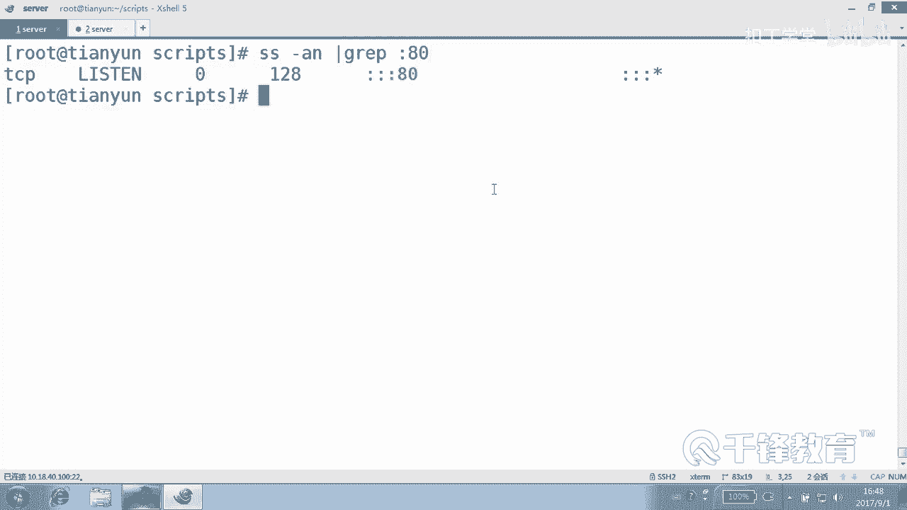

好，各位是不是有很多状态？😊，是吧很多状态，我想知道这个瞬时有多少状态怎么做，先先先不要仿了，现在防一会儿丢掉。我讲了以后我们再来。😊。

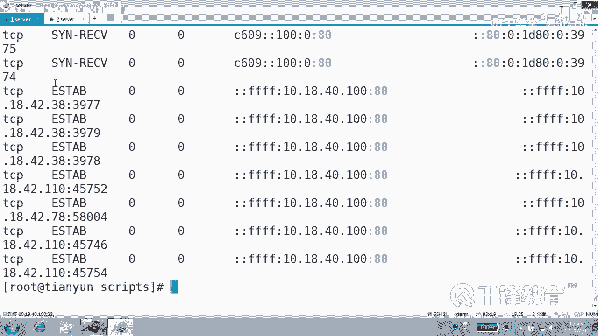

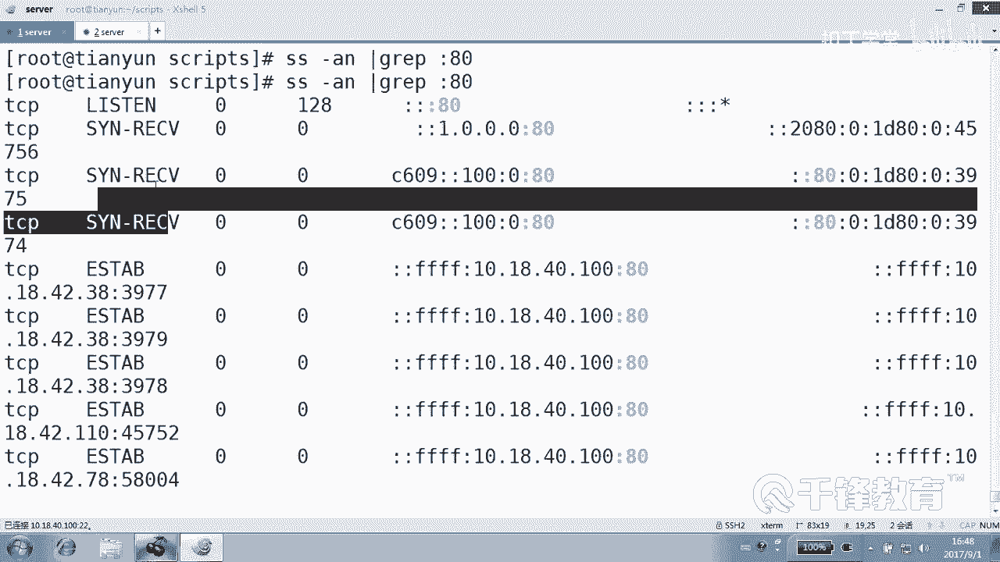

第几列？

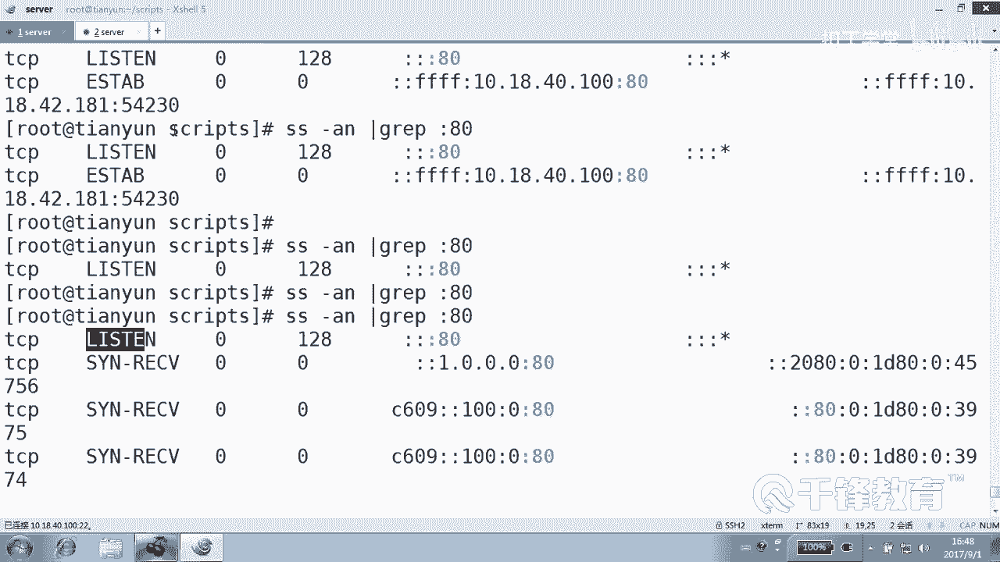

第几列第几列是你要统一的对象。是不是第第二的呀？

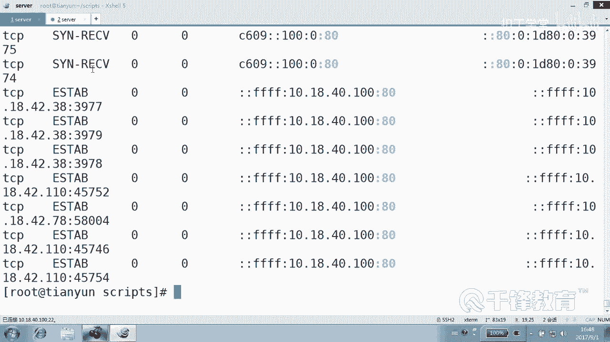

郭，我问一下这个跟同讯是有什么区别？😡，没什么区别。还是一样，把你要统计的对象作为数组的。

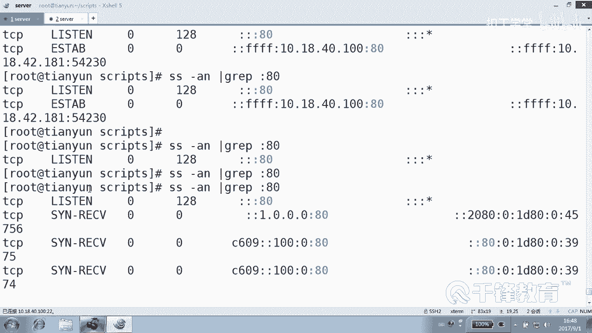

所以拿来哪家还是那个意思。好，那我们再来统计。TCP的一个连接的一个状态。然后。是stateate还是 status？好状态吧。好吧，哎，我们要统计TCV连接状态啊，看好了。😊，那么道理跟他一样。还是。

先定义好这个关联数组，是不是？很直白的一句话。呃。怎么获得TCP状态？先我们是不是还要定一个数组啊？😊，杠A。就叫这个名字，好吧。😊，好，那怎么去获得这个东西呢？😊。

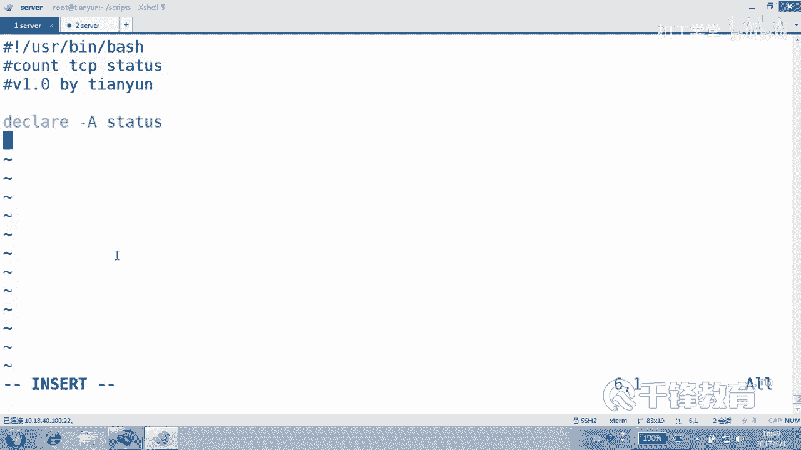

SS杠AN还记得吗？这个迷你刚我们是不是试过一次啊？

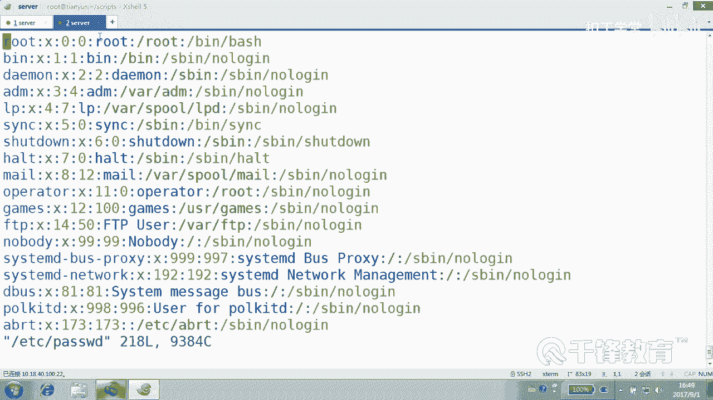

SN是不是，然后打印第几列？第二点。嗯，然后过滤一下什么。80端口，然后管道给AWK其实你应该复制过来，而不像我这样去敲出来。你除非你很清楚这个这个这条命令是干嘛的。好，就这样行吗？当然不行。

要付个一个变量。哦，这个变量呢最好。不要叫这个名字，名字和数族还是有一个区分。好吧，我们叫类型可以吗？这样写有没有问题？Yeah。现在写会报语法错误的，因为你较好的空格，设不备加双引号。😊，啊。

在双银行吗？😊，好吧。都要都要说加反引号，那我们加反引号。双引号的话，那就是一个字符串啊。好，各位现在这个类型当中是不是会保存很多很多种变量？😊，好，然后我们就使用。复循环。哎。

哎是现在有人说怎么不使w呢？😊，我们说哇是处理什么呢？文件的，现在没有文件啊，现在就就是一个。😊，数组的负值嘛，IE dollar。Tap。度。到。let什么加加谁数组名叫什么？😡，states。

所以你叫什么？😡，好像我从我一直用的是type是吧，那就加加了，这没什么说的。😊，好，那么这样的话是不是就完成了统计了？完了以后要干嘛？想统计完以后，整个统计完以后，是不是要看一下。😊。

看一下各个状态有多少多少种啊，那咱们就。for换个名儿吧，免得大家都都叫这个I的话，显得多么特别不专业。数组的什么？什么东西现在写什么这儿。是叫什么？我说的是索引，我一直跟你说索引索引。

叹号ts圈A或者是。7号。Ele。A种类型dollar G有多少个doar。大人儿。这好了，收工。嗯，有歧义有没有问题？有其有歧的话就就说。没有吧。好，各位这个跟以前不太一样，以前那个是。😊，对。

那问一个问题，能够把这条命令甩到这儿来吗？能吗？能够把这条命你整个这儿这个甩到这儿来，换上它可不可以？其实那感情好，但是有点长不好看，就是这个原因，所以我没有甩过来。能理懂吗？

这个地方不就是要一个列表吗？变量的一个列表一个值的列表吗？😡，就是第二列拿过来以后，是不是就是一个长列表？😊，所以这个地方之所以定义的变量是因为太长了，不像那个什么cut dollar一一样，那么简单。

而是很长一串。明白。啊。怎么了？有有哪一个问题？确定没问题。那这个I里面保存的是什么？😡，是不是那一堆的缩引啊？对，就是那个呃现在对一堆的可能找到的各种状态，一个一个排排成空格的过来的吧。

然后过来以后呢，我就。😊，系い。这这写错了，你们没看出来。😊，天，我差点没有执行啊。这么大错误。你不抬不来我来干什么，我的太不了你们那么多，我装不下呀。😊，我是一个一个的杀一个一个解决。😡。

泰国里面是不是有好多啊，这不拆漏笑话了，幸好还没有执行。😊，就出现效果不对啊。记。你预行结果对是吗？😡，你我翻老。我因为就一个，因为你的太里面如果就一个，那没这好说，我这儿是不是有好多个。

可能有上百个上千个。😊，那么是不是有一空咚咚咚咚咚这一堆，是巧合，你那不是巧合，你那就只有一个，所以没没办法测太假。哦，对你那就是t type和t I。一个意思，他就一个。😊，行不行？各位。

这里面还有错吗？你们仔细看一下。😊，别主要是想你检查出来，别让我就丢脸啊。有时候我也不是故意的，但是他就是抄错了。这么多刀的这么多符号，我敲着敲着，我眼睛也懵。😊，加上。这这讲这么长时间是吧？嗯。

加上我眼睛眼眼我的眼睛前面还有这么个东西晃着我看，我几乎只有一半眼睛在看他。😊，没错吧没错，王王彬冰是最擅长检查错误的，看一下看。😊，刚才有疑问他不好意思说啊，他昨天把我带到沟里面去了。

他他今天不敢说了。😊，好，那行，我现在就差你们访问了。😊，咋了吗？哎，这啥玩意儿，这几个，这是啥都不正常，你这多正常看。😡，看应该是越多越好吧，各种状态出来一堆吧，看。😊，有俩人正在握手是吧？

我有一个listen，有一个吧。😊，然后有6个人我已经跟他说再见了，我说你们走吧，还有还有6个人，还有72个人呢，我们在见在半路上的。😊，还有呢这个established正在连接的是18个。

当然再回车的话又会变。因为这东西是瞬瞬间的变化，明白吗？😊，好，那如果你想一直打印怎么做？😊，嗯好啦。啊不。获尺杠N1。杠N1。这也不对啊，这不是一条mini，后面主要是没。😡，这样。好吧。

那我我也想到了，我说我们就写个写个循环了。人家你看这小伙学的好。😊，watch一下，执行一下，看是不就是实时的看到它的变化。其实解个循环也可以。明白吗？这个watch呢没问题，去执行它。

然后以这个多长时间间隔一秒钟的时间。如果你觉得很快的话呢，你可以间隔2秒钟。是不是就实时的一个状态？啊。😮，如果非得使用一个循环的话，那怎么做？又来一个什么所谓的死循环。死循环在这里面就油。

你可不能把这个东西包到外面去喽。😊，他可是一直要要去。对，执行WIY do什么？荡好，当中这一段呢缩不缩紧呢？

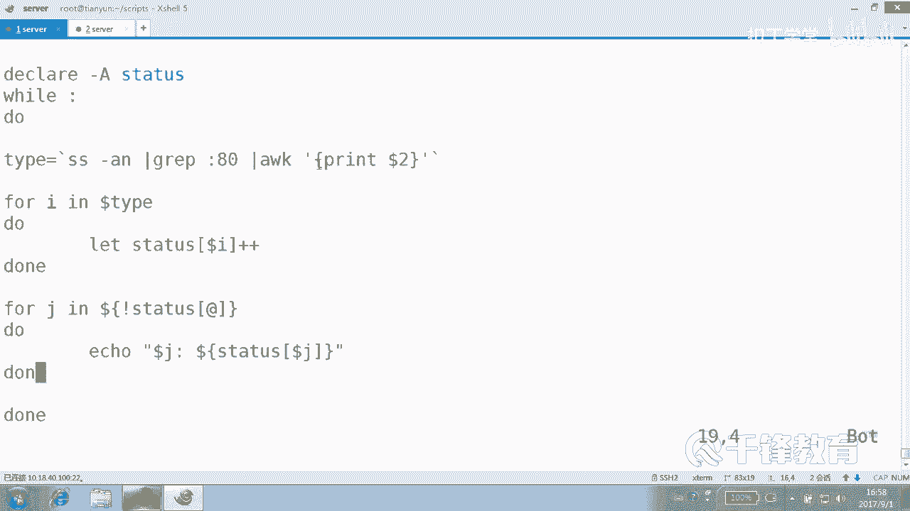

あそう。缩一下好看。

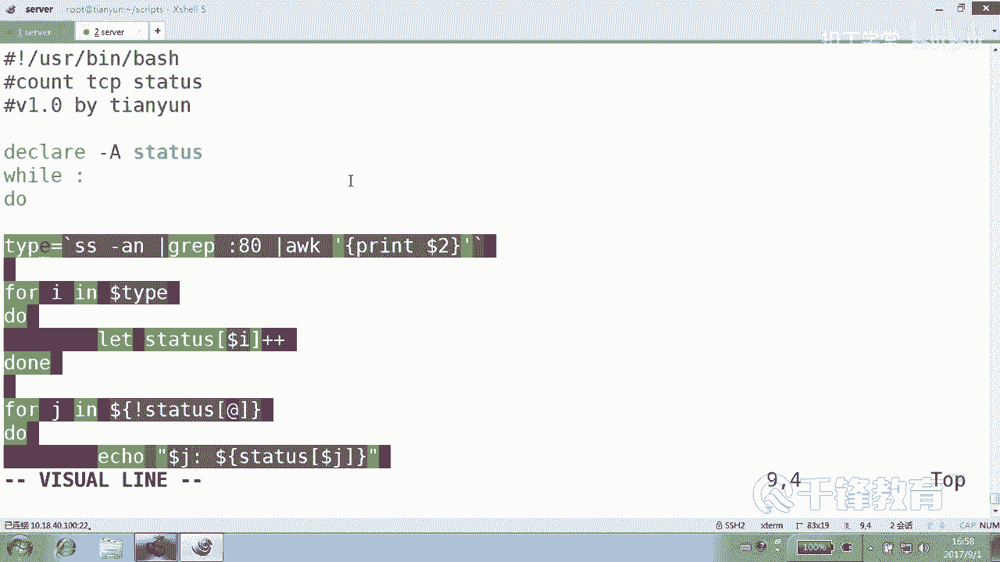

可以吗？说。好，这个事情做完以后，没错，在这下面呢。sleep1秒钟，然后是不是上去又又在打印。看。人家本身自带光环，不需要你那个watch。哦等等等等等会有个问题啊，清明，你要不清平的话呢。

显得不专业啊。😊，明白吗？啊，这个蹦一蹦的也也挺伤感的。😊，刚才那个是真蹦的吗？那个watch是真蹦的吗？😡，或怎怎么觉得没蹦那么欢欢快啊，感觉。😊，哇，现在你们访问我这么多，好吧。😊。

有人正在配合访问。好了，算了算了算了，就这么着吧。😊，这。好，看到了吗？各位，这就是那个我们写了这个统计TCP什么？😊，状态的这样一个脚本。你可以统计任何东西。任何东西只要把你要统计的对象来作为它的。

索引，然后再对它的值做一个累加。你看这里的复制非常简单，碰到A索引就加一，碰到B索引呢。😊，加一，那应该说在这儿就是碰到A状态，加一，再碰到什么B状态再加一。明白了吗？各位。好，始终是一个套路。

我套路都没有变化过。明白。另外我们在执行的时候，要不要使要不要这个像刚才一样使用watch去执行是吧，还是呢你自己就写一个。此循环。这个执行都可以，好吧，它都是去都可以去不断的去执行。

另外要不要清屏什么的啊？好，那个watch好像自带了清屏的功能哈，对不对？而我们使用这个循环呢，你得。😊，清一下屏，否则的话它会往下。往下蹦挨个挨个打印。好，最后再问一问有没有搞清楚。😊。

或者说把这个上面这段换下来。把这段摘下来可以吗？粘到这儿。好，我问一个小问题，怎样把这一小段。站到这儿来怎么站？是YY吗？可以两种方法鼠标复制，然后点右键复制，然后在这儿来粘贴。可以对。

ctrorl加V块选择还记得吗？然后按Y它复制的不是一行，而是。然后粘就到这儿来了。不要动不动，就是一行，可以不一行。好，但是现在呢我们看到这条命令获得的结果是不是就是。😊，好多好多的那个状态的名称啊。

然后去用。I呃用那个for做一个循环，循环的每一步循环就是干嘛呢？就是给数组赋值，就是做累加。是不是好，看看效果，然后我们再来最后看一下效果。哇，现在都已经很惨了这个样子了。😊，怎么雷on就变6了？

不正常吧，好像。😊，我可能有点不正常啊。呃，这这个能写到这儿吗？你注意看那than不可能是18呀。😡，你看这个。cond定是不是不断增加，不应该是这样的，这是错的。为什么？因为这个值听好了。

这个值放到这儿，其实我被我说错了。😊，这个方知为什么？它每次循环时去取一遍吗？😡，他是不是真着每次循环都有取一遍，那那那那行啊，而是是是干脆是不是一下在这一刻先。😊，取过来呃，肯定不能没。对。

这个地方我说说错了，因为这个只是变化着的，好吗？😊，这个是变化的。到德太多这个一旦取过来，是不是就死在这儿了，就不会再取了。好吧，你看刚才的每只循项都取一遍，这个是。😊，看aon是不可能。哎。

怎么还在家？😊，没事。哪的问题？写了个Y循环，居然成这样这个样子。佢时系似。一秒鉴定一次。嗯。嗯。重新复职。这个地方还不能随便使用W这种循环啊，循环的话它会。它会出问题啊。速度变空位。

对我们除非把那个数组在。把这个变量在在这儿来的时候，on set。Tpe。是onside type吗？还是数组的问题，数组的问题。对这个熊台太麻烦了。我考到这。数组是哪个数组？这不对了。好吧。

这个看来不太适合使用这种方式。我们的listen，我们刚才看到是不可能直接在往上涨的吧。😊，是啊。放到子孝里面去。应该正常的效果是这种效果。再执行的话得重来吧，你不能累累累加到这个lasson上去。

因为lason我们很清楚是只能是是一个。声明副里面。我さ。呃，这个重新声明的话行吗？每次什意well，然后do。到。当中再加加一个间隔EP1。没没时。没删那个。他哋さ。好，我们把这个数组呢也也也什么？

亲一下。是。Onside S TAT US。这麻烦了，把我们自己整麻烦了啊。😊，这可以了是吧？看可以了。好，因为数组了，他他在同一个笑当中，他其实已经有值了。😊，因如果我们没有删的话呢。它一直往上累加。

这是这个问题啊，所以我没问题啊，就是数组的原因，这个数组像变量一样。😊，我们需要重新把它这个取消掉，然后再次给它加一个。重新声明一个关念数组是吧？好，这点大家自己看一下。

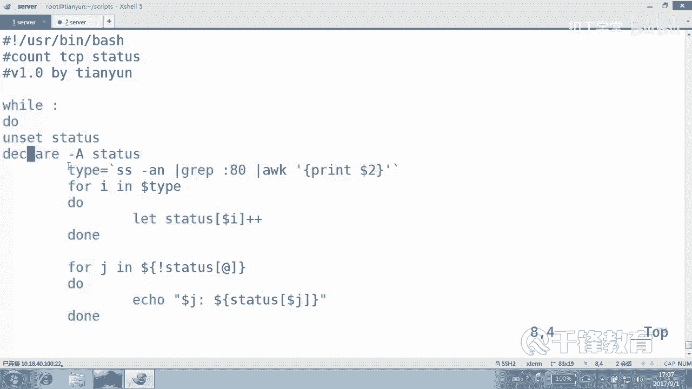