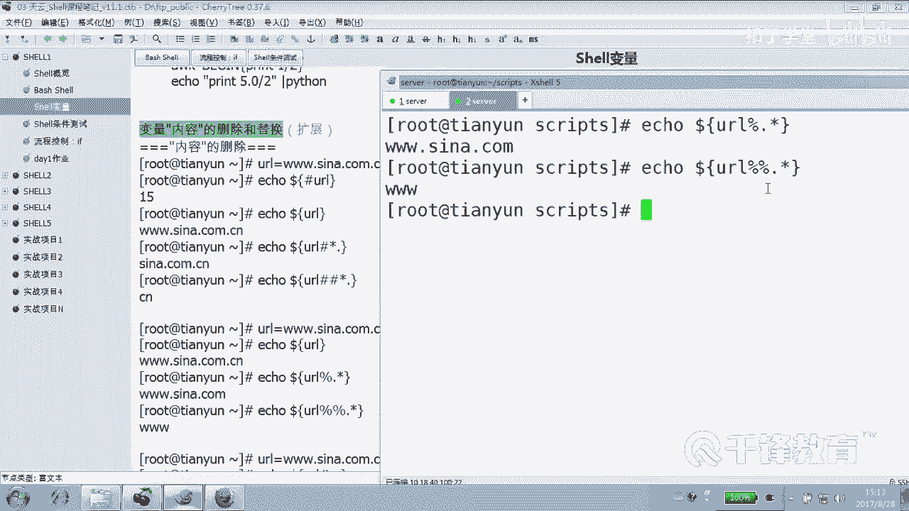
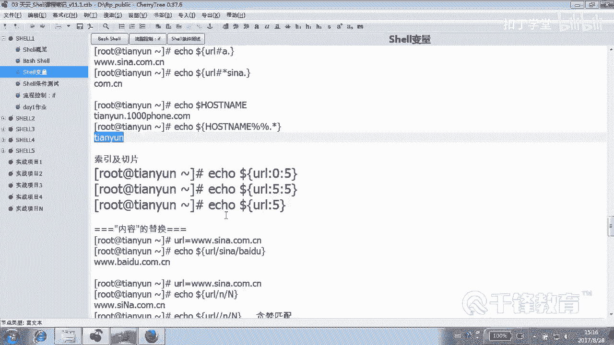
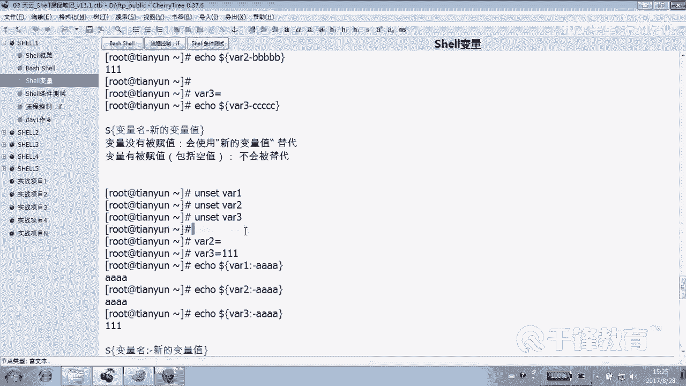

# 千锋扣丁学堂Linux云计算系列：Shell脚本自动化编程实战视频教程 - P4：2.6 变量 内容的删除 替换 替代 - 扣丁学堂 - BV1SE411q7vK

呃，变量内容的删除和替换这块是作为我们的扩展知识。但我个人认为这这块非常重要。所以呢希望大家能够理解。😊，因为实际上真的很有用这一块。好，这个例子呢我们需要给大家去展示一下，你看。

我们定义的一个变量叫3W点。心脏点com点CN是吧？这是一个变量的D那个变量。😊，没有什么特别的含义。然后紧接着呢我们打印一下这个变量的长度。哇，怎么出来的，我又忘了。几号URL各位是几啊？

长度15没问题，15。😊，怎么获得边量长度会吧？😡，以后我们看到数组的时候也是一样很类似的方式啊，变成长度。但是大家注意看看这块啊，我把后面的那个中文介绍给大家隐隐去了啊。😊，这个是变证的什么？😡。

如果就这么写的话，是变成的什么引用吧。😡，icle只是在这儿打酱油的。😊，艾克只是为了给大家去。展示一下，我们有时候可以不展示的。好，那当然不展示的话，在这儿想看出来的话是是不是那么明显。

这个是边端引用。😊，看这边这个井号新，我先来个简单的。3W点儿。猜一下什么意思。这个这边上面的标题叫变量的内容的什么删除，肯定这有关系吧。😊，就是把这段从前面这段删除，明白吗？那。这样呢。是不是也删除？

呃，当然变量实际上是没有真正的内容是没有删除的。你去看变量的值还是那个整个的，对不对？这个变量的值没有变，只是我们在这一次的什么。😊，使用或引用当中，我们用到了它其中一部分能听懂吗？乖。

你并没有把真正把变证内容给删除没有。😡，那删哪一部分？这写的好长啊，各位那能不能把前面这段使用什么？😡，信号啊。看到了吗？7号怎么解读，就是哒删3儿。😡，SI那是不是还剩的结果还是这个效果。😊。

看到了吗？那如果我删到点儿了。😊，你记住全变量是这个就是7号指的是什么意思？就是从前面当当当任何直到相当哪儿。😊，没错，一个点儿。那如果是仅仅呢。😡，来先看看原变量，原变量，这原变量这是删了一个。😊。

这原来的边章是这个这个能看懂吗？井号，哎，先说一下，井号是从前往后删。😊，O。😊，是从前往后吧，上上上上上大哪。😡，点儿，所以剩这么一堆，这个仅仅表示也是什么？从前往后删删到最后一个点儿。

就删到到到到到到到这儿。😊。

所以这两种，一个叫什么？叫最短匹配，一个叫贪婪匹配。😊。

贪婪这贪婪什么意思吗？あは。贪吃蛇。那么也就是说我们在引用一个变量的时候，有可能是想用到它其中的什么。一部分。那你可以采用删除。那这个是从前往后删各位。那如果。那如果说只删一个点，各位有什么实际意义。

留下的是什么域名吧，是域名。那如果从从后往前删呢？😡，来还是一样，先给我看一下这个变量的值是没有发生改变的。这变量值从后往前删就是。😊，百分号，当然这个然后我先跟你这样说一下，先怎么解读。😊。

删掉CN对吧？删掉CN点儿A不不A的这儿。是这样的吧。删掉这儿看到了吗？各位。就是从就是错了吗？😡，没变化这个。没变化，写错了吧。😊，CN应该是哦，M没有A。啊，有A，但是当中当中并没有说看到吗？

是应该是。M可以有变化是吧？好，那我想说的是后面就形了，直道删到什么。😊，M或者是点儿。就是从从后往前扇扇扇扇扇扇到那个点儿，同样两个白猫呢。😊，这个。当当当当当闪到最后一点。

这些技巧你可能觉得没什么用，但是你想的正好相反，我们在一些特别是在一些这个co级的例子当中，这种东西啊，你带来的这种快速的去取道变量里面的某一部分是非常的方便的。😊，这个编量内容的删除注意到了吗？好。

这这这个没有技巧，这只能说。😊。

就就完全什么靠。😡，就下次你用着的话，你你已就脑子里面想了点。你如果说想想取这个，就就现在你看啊。😊，当了。URL。就是假如说你就想取那个主机名怎么办？😊，你是不是要把后面删光啊？😡，后后面管他是什么。

是不是山光，那我们是不是可以采用从后往前删删到最后一个什么？😡，点儿贪婪匹配是不是可以了？那如果想取域名呢？😊，从先往后删删到第一个点，是不是这样子？道理也是一样，hos name。哦，当然很抱歉。

我这个主机名有点简单是吧？如果我的主机名叫做天云。😊，第二，千凤点com。好，各位看我主机名叫什么。那我问大家，我现在就想留留这个叫什么？😊，我就想留这个。留主机名怎么留？他怎么弄吧，说说直白一点。😡。

别如说说什么说，先跟我说变量叫什么？😡，这是一个哦，很抱歉，可能是由于由于我们并没有真正修改的原因。好吧，这是一个这是一个我们的内置的环境变量。好吧，那如果重新启动或者怎么样，它就会改成整个长的名称。

对不对？然后你在这个时候呢，可以采用从前往后删删到第一个点儿，是吧？或者什么从后往前删。😊，哦，不对对不对？井号C点儿这样的方式。上到低一点吧，或者是呢从后往。从后往前伸。删到。最后那边是心心到掉点。

看到吗？方向是反着的，一个是从前往后数，一个从往往前数，明白？😊。

这个是从后往前和从前往后的概念。

另外呢我们看到这边呢。😊，嗯。这怎么解读？为什么这个结果是不对的？😡，为什么这个结果并没有删任何东西？为什么？😡，因为你是从从前往后还是从后往前。😡，后A哪有A前面是吧？😡，Yeah。你说这儿有A是吧。

那这一部分怎么办呢？😡，对，除非前面加个信号，所以你要没有写正确的话，他就没办法帮你去删除，对不对？这是一条，其实是一条错误的一个结果，明白吗？那这个呢。😊，心新就是前面。😡，不管3道。

删道C浪点儿是不是comC。很好理解的，这个没什没什么技术含量，好吧，但是你需要理解一下，同样主机名各位看到主机名什么意思？😊，主记明这个在删除的时候取的是什么？最后。

从后往前是不是从后往前删到最后一个点，取得的是最后的。

天云的这个名字，对不对？好。

其实我们可以利用变量的。索引刚才你们可能会说老师从先往后从往前，我能不能取当中一部分可以啊，那叫做。😊。

按照索引的方式进行切片，就是切其中的哪一片儿。很，很有意思吧，这个。😊。

就是你可以完全可以选择去切其中的一片儿来看一下dollar。😊，URL。好，来给你讲一下。3。来，我们看啊3W点新浪点com点CN是吧？我给你呢。😊，给你归归一下，这是0123456789。

每一个数字都每一个字符都对应一个索引，一个标识，看到吗？那这个W呢对应的索引是0123456789，看到没？各位？好，我们把上面这个地方放这儿，然后icical dollar什么？URL。从第几个取。

第0个一共取几个。5个，那你告诉我会是什么效果。😡，出现上面哪些符哪些符号？😊，先な。对3WS。你你从第零是不是从零个，那你要说不喜欢那个，那好吧，我们从第。😡，比如从第5个还是取第5个。5个也用取。

从你5个5这边是几啊？到底是I呢还是几呢？😊，索引这是索引啊索引索引五十几。😊，是不是从I开始。然后A，然后取一个、2个、3个、4个、5个。是不是到C这个位置？你可以很啊，有问题吗？

你可以很随便的去从这个。编量当中去按照索引进行切片操作，你想切哪块儿，你选哪块肥就切哪块儿，好吧。😡，嗯，你喜欢哪块就切哪块。😡，那如果这么写呢，从第五个开始呢，后面不写了呢。😡，那就全切犬要。

注意到了吗？所以这个切片很有意思的，就是你可以。可以呢从前往后删，也可以从后往前删。你甚至可以什么就明确的要。😊，哪几个你记住这个索引，所以从几开始？0123456789这样的从这开始。所以从您开始。

就是每一个每一个这个上面都有一个索引编号，对不对？

好，这些功能呢，我刚刚讲我看起来非常的简单，但实际上呢用处非常大。😊，O。这儿所引所引及切片操作切片。什么叫切片，知道吧？就从你肚子上，或从你。腿上切。对，切一部分按照什么切呢？按索引标记切。

利用索引来进行切片。😡，就是每一个变量的每一个。每一个什么。😡，每一个字符都有一个索引标识。其实啊你们学过C的话，你知道。😊，在C里面，这个是不是我们的数组的概念？每一个数组的圆。

每一个这个下面的都有一个。在C里面，这就是一个这就是一个一个数组定义的一值嘛，对不对？每个下面都有一个索引标识，都有一个下标。😊，是不。他都有手影。我们可以很轻松的来进行切片操作。好。

这是我们的变量的什么？😊，删除和切片。那还有一个变量的什么内容的替换，这都是属于扩展知识啊，别吓着你好吧。😊，有时间就看看啊，反正绝对没有坏处。什么叫内容删除呢？😡，看到这边，我们再次来看，同样。

无论我怎么操作，这个变量的值没有发生变化，对不对？😊，Ele。到了。我将这里面的。心浪换成。百度。换了吧。是不是换成现在换成百度了？😊，那另外呢我也可以将这里面的N。😊，小恩换成什么？大恩换了吗？

他换了几个。你可以加一个双斜线贪婪匹配，明白吗？还下面的吗？那个就换一个，这就换两个。恩蛋。这叫变量的什么内容的。替换。当然这里面应该说最好玩的是替代。替待这个特别特别有意思。但是这里有好几个啊。

这个看你们能不能够大概能理解一下啊，看。😊。

这块你要是老袋大的话，就大吧，好吧。😊，这个这里呢我要解释一个变量，你看IP11。1。1。1，这个变量值是什么？😊，1。1吧on site IPPE就是把它变量给它什么取消掉，删除掉变量。

这个是没有没有这个变量了，看到吗？😊，是不是好，为了公平起见，我呢将VRE这个变量给它什么？😊，取消一下，或给他重置一下，删除一下。好。So。我艾cle一下，很明显这个VRE有值吗？有吗？何曾定义过。

有没有定义过？😊，没有好，现在呢我加1个A。😊，其实我我想说的是这个这一段就是引用哪个变量，引用VRE变量吧，但VRE变量有没有值啊？😊，有没有定义过？😡，所以给他的一个默认值，看到吗？

就如果哥们儿你有值怎么办？😡，那我不替代，哎，这是一一号看一号兄弟，一号兄弟完全是没有定义过吧。😡，那2号呢。2号我们V2等于1112号有定义过没有？😊，你看我们去引用这个变量。

然后同样呢用换一个随便换一个啊，用BBBBB。各位这个时候VR变论你它本身有没有值？😊，它有值，所以它有值是不能被替代的，看到吗？就是没有值的话，变什么替代。但是你看V23和V22和一有什么不同？😊。

V21压根儿就没有定义过。😡，V22呢有定义过，而且有值。V23有定义过，但是是什么值空值，这个它和一还是有本质上的什么？😊，区别吧。来，我们看看V23是什么一个一个状况。V23通过小杠的这种方式。😊。

谁是谁的。有被替代吗？没有，也就是一句话讲，就是凡是你这个变量有被什么被定义过，那我就不能替代。😡，那我先讲个什么东西？😡。

我讲的是这个。我讲的是这个小杠，好吧，小杠这个小小小杠，你们看这个主角是他吗？😊，所以下面有一个有一个什么？有一个总结，dollar变量名小杠新变量值。变量如果没有被负值，哪种属于属于这种情况。

哪种上面的三种，哪种是。😊，一所以肯定会变成吗？被这个默认指会为或者被我们的新值给什么替代。😊，变量有病复值呢，哪怕是什么空制都不会替代。那你怎么说？😡，就这个小杠干这种事的，以后。

你们见到这个小杠说哇这什么东西啊，这是。😊，这边凉替代。看到吗？好，各位如果说是你的话，你这里面哪个不满意，你告诉我，非要找个不满意的就不满意哪个，你觉得哪哪种替代不是你想要的那个效果？😊。

嗯。他说不满意，不是人家有职，你肯定不能替代啊。😡，这是不是人家有直，你替代的话，这是不要脸的行为是吧？这个确实不应该替代一。😡，压根没有定义过，然后最后给他换成一个新值，我们是不能忍。😊，33。

三虽然说有有定义过，但是是什么值？是空值。那。按照我们的想法，空指的话是不是也应该被替代？但是很抱歉，小杠。😊，做不到。那你请上第二位兄弟，猫号小刚。😡，好，为了公平、公正起见怎么办？😊。

这两者就一个区别。😡，看VR1有定义过吗？😡，没有好，回车一下，假装VRE没有定义过，好吧。😊。

看这边就是告诉你，假装VRE没有定义过，那你看你看不出来，我也没办法，VR2有定义过吗？😊。

有定义，还有VR2有定义过是空值。VR3有定义过吗？😊，嗯，它有值。好，现在我有三个变量，其实第一个变量是我自己造的，心心目中有这个变量叫VR1。😊，没有定义过吧。😡，哎，VRE有没有定义过？😡，V2。

有定义过V23有定义过。来，我们现在艾克一下什么V2级。😊，一好了，我们用的不是冒杠了，是什么？冒号小杠告诉我应该什么效果。😊，替代应该二呢。按照刚才那个一个纯粹是小杠的那个那个方法的话。

应该不会被替代吧。但是现在呢谁要你是空值呢？😊，三呢。人家有职，你不要表要脸了，好吧，就更不能替代人家，对不对？😡，就相当于我们认为你要是没有值或者是空值，我们给你一个默认值，好吧。

就这种形式就可以做默认值的方式。好，其实呢就两种很特殊的符号，一种叫什么小杠，一种叫什么猫号小杠。😊，看解除意解释一下这段怎怎么解读。猫小杠变量名猫小杠新值变量没有负值，只要没有负值，包括空值。

都会被替代。有病复值呢？当然，有变赋值呢指的是有值啊，就不会被替代，看到吗？😊，就是你光有你光。有还不行，你你光定义过还不行，必须还有什么有值才可以。😡，好，那么这里呢。给大家一个机会，好吧。

去研究一下加号，冒号加等号，冒号等问号冒号问。总点给你们一个机会，好吧。给你们个机会去研究一下这一段，看你能告诉我，我给你总结的是几个，我给你总结了一个杠和什么猫号杠。

那要求要求你给我总结加冒号加等冒号等问冒号问。😊。

这几个符号它发出出来的这种功能是非常的强大的。有时候你见到他以后，你你你要是不没见过啊，或者怎么着，你猛然间在某个脚本里面看到这样的符号出现，你会傻了的。😊，你不知道这这什么玩意儿。

这变量已经超出了我的。我的认知了看到吗？

好，所以但是这个非常有用，这种方法特别适合我们。我刚刚讲过干嘛？😊。

我让你输入一个什么。😡，我让你输入一个值，但是你小子不输，结果来了个回车，那我就应该给你个什么，给你一个默认值，是不是这样子？😡，我在引诱你的时候，我说由于你没输，所以给了你个默认值。😊，这种方式。

好，这就是变量的一个。叫什么？

删除还有替换。另外还有一个是替代给。

