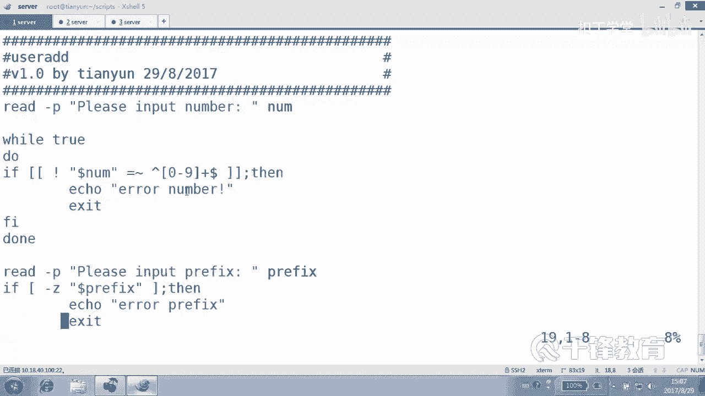

# 千锋扣丁学堂Linux云计算系列：Shell脚本自动化编程实战视频教程 - P6：2.8 Shell脚中各种奇怪的符号 - 扣丁学堂 - BV1SE411q7vK

好，刚才我们已经这个。按照我们的思路去创建了那个脚本是吧？而且呢来定义了什么，包括对数字的一个判断，还有对用户输入的长度的判断。

Z表示是零嘛，是吧？它的长度是零的话，我们就不接受。

这个没问题。在这里呢我们可以延展性的来扩一下，你看这是一个小脚本，这个脚本我不再不不打算敲了啊，请输一个数字。😊。

如果这个你输的数字它不匹配。这个数字是吧，模式，那我们就告诉你说的不是数字，乘序退出。那问一下，最后这个icleCC会执行吗？😊，只要退出的话，后面的任何代码都不会执行，对不对？从这儿就整个结束了。

这个能能看懂吧？刚才我们是不是用的就是这种方式？😊。

判断一个用户数的是不是数字。那么真的如果说想要用户输的。就是把这一段东西呢，可能大家看起来比较痛苦啊。😊，如果它不是数字怎么办？😡，始终让用户输一次，我们就可以。没没关系，你一开始可以像怎么做。

你可以你要实在看不懂的话，你可以把这段代码先复制一下，明白吗？😊，Okay。复制吧well这种方式。好，我们来简单做一下啊，我们把那个脚本做再再做一个。😊。

02再做一个0什么03的改进。看一眼好吗？观摩一下。好，各位现在现在他如果说的不是数字的话，他是不是就走了？😊，那能让他走啊。😡，我们。对我能让他过去，我们这边使用一个。处。😡，然后这个是度。哦。

杜写错了，do还有什么？😊，当A注意啊，刚才这段这个义父他是老大，因为刚才没有老大嘛，他是老大，所以他顶着边儿的先来了一个真正老大，他应该是什么？😊。

退位了怎么办？

缩进怎么缩进会吗？😊，会怎么做？先shift加V一行一行的选择。然后按左按照鼠标，然后呃不是扫什慢鼠标。按住shift键加键这个大于号键就是向右移动，看是不是移过来了。这个我讲过吗？😡。

你讲我说一下好吧。😡，这是VI的一个技巧。在命令模式里面按什么行，这叫行可视航模式吧，行选择这个能选吗？😊，怎么叫shift加V会吗？大V大V。😊，行选择选完以后，你想往右缩进。

就是你会你想减少缩进的话呢，就往那个左边那个尖间号就小于号，朝左朝右看那个符号了吗？😊，大于号小于号。😡，但是大于号小于号是不是在键的上面，所以需要安装什么键？shiftO缩进能看到吗？😊。

所以有时候我们没办法，因为刚才我们是这样想的，现在呢我们又这样想了。😊，真正老大来了以后，他应该推居二线吧。😡，好，那怎么做呢？看一下，听我说哎，听我说，如果他输的数字呢？😡，看如果他说的输怎么样。😡。

哎，如果他输的是数字，看它匹配的是数字，放过他吗？😊，放过他，那是不是应该怎么做？这个循环是一个死循环。😊，听我说是个死循环，well true true表示什么？😡，永远为真，看到吗？

所以这个YR循环理论上讲，它可以无限制的。😊，循环下去，你看如果它是数字怎么办？我们说是数字，你应该让他走啊，你应该放了人家是吧？😡，breakack跳出去。跳到哪去？跳出这个牢笼之外。

跳到这个外外面去，然后就往下走，看到吗？😡，如果是数字，那你就解放了。如果不是数字怎么办？哎，不要动不动退出，好吧，退出这个时候不好使了，不是数字，把上面这一行拿过来干嘛？😊，粘到这儿。

注意到了吗？看一下。😊，请输一个数值。这边当然可以可以稍微换一句话，叫做什么不数字，请什么。😊。

重复输入这样的东西。好，来一句中文吧。は。好吧。😊，你看各位来阅读阅读一下这一段哈，阅读一下这一段。😊，各位我们来一起来阅读一下这段这段什么意思？😊，上来以后，先让用户输一个数字吧，付给你的变量。😡。

那我们猜一下，我们看有两种可能，一种他说的是数字怎么办？😡，恭喜你第一次就成功了，怎么办？back跳出去。😡，不是except，ex是干嘛的？😡，是把整个程序给。😡，结束了no no no，不论结束。

而是干嘛跳出这个循环回到外面来。😡。

明白吗？那如果他说的。这个条件不成立呢，那就是说不是数字呢，那我们打印一个人吗？😡，你说的不对。😡，哦，但是。哦不就不用艾ical了，好吧。😊，read道本身就有acle意思的，在这里说不是数字怎么办？

请重新输入。好，各位他输完以后，紧接着又又怎么做，是不是又回到了这个循环这边，然后再判断。😊，明白？好，我们试一下效果，好吧。😊，然后执行一下user03。啊。😮，哦。😮，哦。😮，是吧。对不对啊？好走。

😊，是不是走了？😊，总总得给人家一个什么。😡，就是就算是你闯到那个。😡，什么那个叫。是什么地方？这个这个。魔界或哪个地方去以后。😊，它起码都有一个出口吧，那个结界是不是是不是？😡，这这个就是姐姐。

就是你输到数字的时候就能出去。😊，就能braack跳出去看到吗？好好，这边我就悠悠。😊，可以吗？

各位看下这边，我的屏幕上，我的这个教案上是有这个内容的，好吧，是有内容的，你可以照着输一下也可以，或者按我这个笔记，按我这个文档来写也可以看这里。😊。

首先请输入一个laer付给哪个变量？😊，number然后紧接着进入一个死循环。😊。

你这个循环当中可能你会你可能会在里面晃个20年、30年。😡，他有可能一辈子出不来。😡，只要你没碰到这个结界的话，你出不来了，对不对？那怎么办？😊。

你接着输输到输完以后，我们再判断。输完以后再判断。如果说你匹配数字，那我们就直接跳出循环。😡，叫出三阶外OK就可以了。

能不能看懂？这挺有意思吧，这个这直到你最后输的。😡。

书书那个叫什么？正确为止。好，下面这个可不可以这样做？下面这个。😊，下面可不可以像照着如如如法炮制的方式，可不可以这样做？😊，我们假如说来一个w。😊，处。度。但同样这一段谁是老大刚才。😊。

现在把他俩他们几个往后走。😊，请输入一个什么profix。如果说是什么。😡，如果说是。为长度是0，那我们就。可以把这句话拿过来，再往里面粘一下。😊，长度是零的话。还是提示用户，请输入一个前缀ok。

否则的话呢。明白。有不有时候不对，老师，你上面那个不是个写的上面，下面写下面的。😡，那这样的话。😮，那我们怎么写？飞空飞空说明输的有东西吧。😡，那为了照顾你们的习惯。把他俩换一个味儿。

反正是能理解就可以。如果是飞空的话。😊，非零的话，那我们就直接跳出去，说明你有树里有东西是吧？否则的话怎么做？😊，那我们继续输入。看一下啊，来，我们进入到这个混沌的视野当中去。😊，不行。不可以。

更不可以。6可以吧。然后第点回车回车回车回车回车。😊，不然好吵。收点东西吧。明白好，这就是一些利用这种方式来。只有当你输的对的时候，可能才让你去干嘛？跳出去，否则请你再次输，我再次复给这个变量。

再次进入到循环当中来判断，明白。😊，嗯，这就是这种方式。

好，屏幕上有好吧，这儿有。😊，那么这一小节呢，我们带大家来认识各种符号，各种特殊的符号，其实应该说是复习各种的符号。😊，好，各位还记得吗？😊，这个小郭是什么？后面写着的。😊，我问你们干嘛，这遮住才行。

😡，这是什么？这一个小括号是不是我们曾经讲过的子校？😊，是不是子孝是不是在子孝中执行？😊，明白。那小括号小括号什么意思呢？😊，一小于2吗？是不是这样子？是不是C风格的这种什么？😊，这个C风格的这种。

比较。我们在写C语言的循环的时候，大家应该很熟悉是不是这种方式啊？😊，I等于0。还有小于等于几，I加加是不是这种形式？😊，好，就是我们sell当中也可以写C语言的这种风格的循环，也可以。因此呢这个是。

😊，数值比较运算。C圆风格的。然后。do小括号，这个还记得和什么一样的吗？😊，和什么一样，和反引号，这叫什么？专业术语叫什么？叫命令替换，还记得吗？😊，好，就先执行里面的什么。😡，秘密但这样不行啊。

这样在这儿不行。😊，干这么打不行。得要个touch。可以吧。是不可以这样。好，那么。当了小括号小括号什么意思？啊。😮，干嘛？是不是运算啊？代括什么意思？没见过。他过。大括号可不是很么变量。

倒括号是不是集合呀？😡，待会是不是一个集合？只有dollar什么大括号才是我们变量的引用，对对？甚至变量的替换什么的，是不是都用到do大括号变量内容的替换替代都用到这个吧。😡，来方括号叫什么？😊。

条件测试哪几种条件测试哪几种。字这个文件测试整数数值比较，还有字符串的比较，是不是？那两个放括号呢。就是一个方括号所具备的两个方括号都有。一个方括号没有的话呢，两个方括号也有，那就是。😡，正则。

正按政策的方法去进行比较。正则。明白，那么有个特殊的符号叫做等号波浪线是吧？正则匹配正则匹配，按照正则模式这种方式去匹配，这个是它没有的。另外还要注意的是。😊，在一个方括号当中，两个条件是这样写的。

比方说。😊，刚D是个目录吗？是这样吧，并且呢。并且杠A吧。是不是刚A。它是一个。文件吗？是不这样子。但是如果换成两个方块呢。😡，这个语法就是。错的应该换成什么？对，and and。😡，是不一样的。好。

另外downner小方框什么意思？😊，没错，还是一样二的。十字方哎呦。2乘121次方是不是这么写的？104好，很多人连这些基本的符号都搞不清楚，所以更加不可能去谈什么写出什么高级的少脚本，不可能ok。

😊，sll的东西大家会发现，它的内容源自于生活。就源自于平时的这个对lininux和一些软件的使用，还有系统的使用，以及对这些基础的一些工具和方法的一个理解。然后再结合一些别人的一些思路和借验一些思路。

你才能创造出你的sll脚本，明白吗？😊，就包括有些变量一样，就很多时候大家会忽略那个环境变量。no那个很好吧。😊，你是不是可以快速获得你的某一些？😊，环境的一些东西啊。比如说像user。

像UID这都是是不是？最后呢这边有一个东西，这个其实给大家讲过，就不用再特别强调了。你看这里。😊，这个。这是路径吧。这个入计。这是绝对或相对，无论是绝对相对。那么在执行的时候是需要。😊。

执行权限的看到吗？而只有使用路径的方法去执行，我们才需要。执行权限。其他的你看无论是balash还是点R还是sourcece，都不需要一定要加什么所谓的执行权限，明白吗？😡，只有路径执行，需要执行权限。

无论是绝对还是相对。那么另外我们也知道这种方法执行是在什么执行。子孝，而这种方法直径是在什么孝之间，当前孝。😊，明白吗？那为什么我们已修改了EDC profilefi以后，要重新启动或者是重新s？

因为修改完这个文件以后，我们去s一下的话，它会在当前s效当中什么生效，明白吗？😊，那调试语法呢也很简单，杠N我们是不是会检查语法的一个错误啊？另外呢，杠VX是以什么？以调试的方式去执行。

以查询整个执行过程是不是哪个环节和我们预期的。😊，可能不一样。你要了吗？乖。好，这小节重点呢就是大家要识别这个hell当中的各种。符号。明白吗？啊，我说的这个符号不是不是那个原字符啊。

原字符是指的是星号。😊，问号。方括，还有那个叫什么？嗯。大括奥是吧，还有反斜线转移。那我这里所说的符号呢，不是源字符，而是这些个很特殊的一些符号。😊，这些跟shall都有关系。你看一个小括号。

两个小括号，dollar，一个小括号，dollar两个小括号，一个大括号，dollar两个dollar，一个什么大括号，一个方括号，两个方括号，dollar，一个方括号都是你看我分成三波的，看到吗？

小括号正营的大括号组的方括号，这一组的看到吗？😊，都有。很千奇百怪的一些符号。😊，是不是？好，那么到目前为止呢，我们应该准确的讲，我们借助我们也借助于了后面讲到的循环。还有呢就是条件判断。

我们把把那个sll的基础部分都已经什么。😊，彻底的讲完了，我说的是基础部分，纯基础部分啊，讲完了明白。😊，好，所以前面也是最重要的点，希望各位能够把这块的，包括条件测试，包括变量这两个重点。

条件测试和变量好好的去看一下，包括把我们前面讲过的脚本呢去梳理一下OK。😊。

