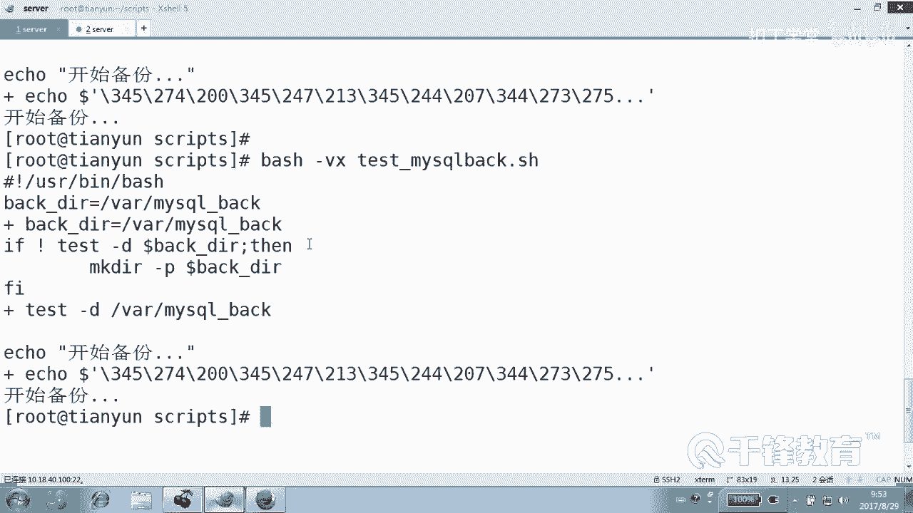
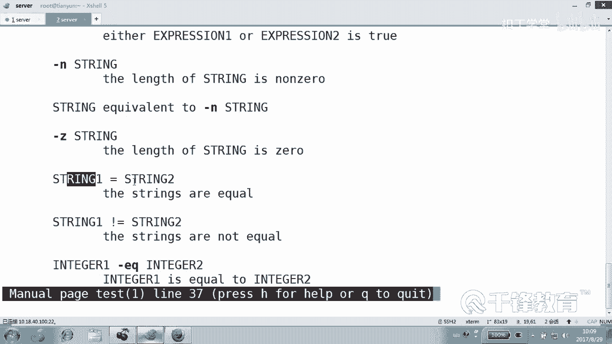
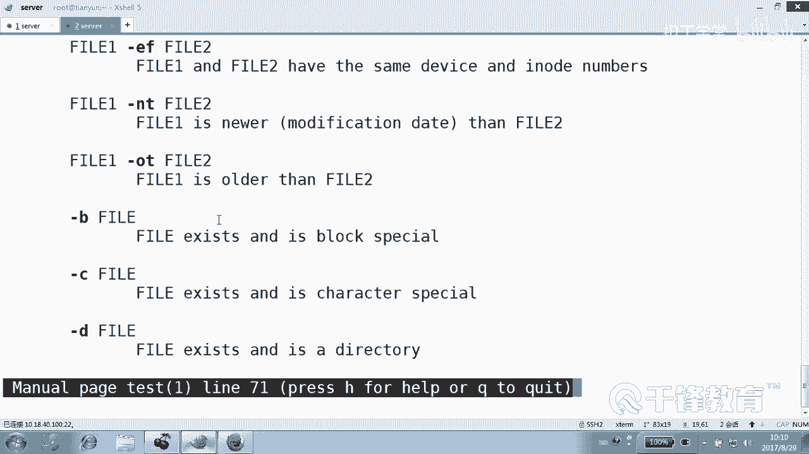

# 千锋扣丁学堂Linux云计算系列：Shell脚本自动化编程实战视频教程 - P7：3.1 条件测试概述 - 扣丁学堂 - BV1SE411q7vK

好，下面我们来给大家。😊，讲一下一个非常重要的一个点，就是笑当中。最核心的一个基础点就是条件测试。所谓的条件测试呢指的是判断某一某一个这个对象是不是成立的。比如说在设当中，条件测试呢主要分为三类。

一类叫文件测试。它主要用于测试文件。比如是不是一个常规文件，是不是一个设备文件。是不是有执行权限？是不是有写权限？是不是一个链接文件？甚至是不是一个管道文件做文件测试，或者甚至是呢这个文件存不存在。😊。

因为很多时候我们需要有这样一个条件，我们才能够做下一步操作，是吧？如果这个目录不存在呢？😊，我们可能就不能做下一步操作，明白吗？那比如说我们写一个mysq的备份脚本，咱们先不考虑mysq备份脚本本身。

好吧，但是我们要考虑的是。😊，如果这个目录不存在的话，怎么办？那我们备份肯定会有影响吧。因此我会先判断这个目录是不是。存在那怎么判断呢？我们下面来看一下。

test啊test这是。test是我们的条件测试的一个命令，好吧。啊，我们是写一个myac bank这样一个脚本。😊，点SH这样一个脚本啊，当然这个脚本呢其实今天并不能够实现mysql的备份。😊。

只是简单的啊帮我们来实现一个mycyclq备份，好吧。😊，就是只是简单的一个来测试这样的一个。判断目录的这样一个动作。来USR并下的bash。好，来，我们第一个变量叫做。😊，备份的什么目录，好吧。😡。

是哪个目录呢？这是一个变量嘛，对吧？是根下的。😊，比方说VR而下的。Myxico bank。这样一个目录。好，这只是一个变量。然后紧接着呢，我们上来以后我们。😊，打印一个，比如开始备份吧。

上来以后是不是要先测试一下，比如说这个目录是不存在啊？是不是先测这个目录存在？😊，那怎么测试？一般我们用到的语句就是if。😊，然后紧接着呢。我们要跟一个条件，这个条件的测试这个目录是不存在？怎么测试？

可以使用test。杠D它是不是一个目录？谁呀，哪个变量。Dollar back dear。注意这个命令的结果会返回什么？真和假，我们看一下啊，我们先来拿出来看一下。😊，Test。甘地ho。各位。

你告诉我这个命令的返回值应该是真还是假呀？😡，啊，应该是真是吧？那现在呢。😊，他你看这个命令本身不会报任何错误，它只是做测试，它只是帮你返回返回这个相应的值。然后哦它这个目录应该是为假吧。

因为我故意写了个HOEM这样一个目录，是不是？😊，那。所以呢我们可以使用ifif后面跟它就是一个条件判断语句，只要能够返回什么真和假的语句。如果。😊，它是一个目录，怎么办？有同学说它是一个目录。

我们是不是开始备份？😊，我觉得可以这样做。😊，注意啊。这样的话表示它是一个目录。我们可以在这个条件测试的前面加一个叹号取反，就是非就它如果什么。不是一个目录。那我们就先应该。创建那个目录。

甚至可能加杠P是吧？杠Pdollar BICKDR。😊，是不是好，我们可以这样做。那么其中我们用到了一个就是条件测试语句。😊，条件测试语句在我们的这个sh的使用当中是最为常见的。

那下面这个条件测试语句呢？从它本身来看，各位它只是用来判断它是不是一个目录吧。他如果不是一个木录怎么办？😡，那我们就创建这个目录，或者不存在的话，是不是创建这个目录？明白。好，创建这个目录。

然后创越完成完成以后呢，就会开始往下走。😊，是不是。好，当然也可以呢，如果说你可以说它如果不是一个目录，然后就退出艾克一下，就是说报错，说这个没有这个目录，请你创建这个目录，对不对？😊，好。

这就是一个非常典型的调音测试语句。来，我们看一下怎么执行。😊，给他一个。执心。执行权限。然后我们执行的时候，大家还记得我们可以加VX吧。😊，还记得吗？是不是以这种。调试的方式执行。

我们能看到整个执行的过程啊。😊，对吗？好，回车试一下。😊，看。他执行的时候。最后这个目录他测试这个目录，测完以后干了什么事情？😊，创建这个目录吧，然后开始什么打印备份啊，备份呢这边显示由于是中文的话。

它显示的是这种这种东西，对吧？😊，啊，当然如果说你仅仅是那如果再执行一遍会怎么样？

哎，你看跟上一边有什么不同。😊。

上一遍在执行的时候，由于没有这个目录，所以他创建了这个目录吧。😊，但是第二次执行的时候呢。

他没有创建，因为这个目录已经。存在了看VR下的mycyclq bank是不是存在了？😊，这就是一个非常典型非常简单的条件测试。我们刚才测试什么？😊。

我们刚刚是不是测试的是这个目录是不是存在啊？😡。

我们用的哪个命令？用的是哪个命令测试的？有一个专门的命令就叫test是吧？是test。😡，但是test。这个东西呢用着不舒服，为什么？用的特别的感觉特别这个不好看，我们重新改一下，换成什么。

换成这个符号。😊，看到这个命令了吗？就这个命令方括号这个命令和test的功能是。一样的。他取代了test。所以，使用test和使用方括号。其实是什么？一模一样。

不同的是test后面跟上一个表达式就可以了。但是什么方括号后面还要跟一个什么跟另外一个。😊，以内半拉方括号，但这两个方括号它的命运和它的。角色是不一样的，前面这个是条件测试命令。和test是什么？

一样的啊，后面这个只不过是它必须的一个参数，看到吗？而且很多人就是就说老师。😊，这边能不能不加空格啊，能不能？这个不能对吧？这是命令，这是我们的条件测试命令，这是什么选项和参数是吧？那么同样这是什么？

😊，这也是命令，命令选项和参数之间是不是一定要有空格呀？能明白吗？所以好多同学把这个地方少了一个空格，这个可不是少了个空格，这是做人原则的问题。😊，这是第一节课我们讲的第一节课讲sha要的语法的问题。

😊，这是为什么不加宫格？他说忘了，这不能叫旺。如果是忘了的话，你还你你怎么不这样写呢？😡，所以这如果说真的是没有加，我刚刚讲了，那已经不是忘了的问题，是人品的问题。怎么着，我知道你的意思，你的意思是说。

你老师这个CD我一看就是个命令。😡，test看是不是也是命令mini和后面之间是不是加空格，怎么你看这个翻括号，它就不是命令吗？😊，翻光，他哪儿不是秘i啊？它怎么就不是个命令，看到吗？

它是不是也一样是个命令，长得丑一点。😡，没有影响。另外还有这个这位兄弟，这位兄弟是他。必须的一个什么？😡，参数。能明白吗？好，那有同学说，那我先看看想看看帮助，看谁的帮助，是看方括号的帮助。😊，不好钱。

这个方框但是这个方框在这儿呢不是那个意思。😊，这个方瓜是别的意思啊。所以我是看帮助，看谁的帮助方框还是看test。😡。

🤧对，看tests的帮助，看到吗？好回车喽。你们注意看它的语法是什么？那他告诉你test是用来检测文件的什么类型，还有呢。😊，还有什么值？去做一些比较是吧，做一些比较这样比较，比较整数比较整数比较。😊。

主要用在做文件检测，还有一些比较。所以条件测试里面有三类，看。😊，文件测试和什么？字字5串比较，还有数值比较，一共就三种三种，你必须记住。

那这里的语法呢可以是test，后面加一个表达式，看到吗？😊，也可以是什么。😡，方括这个mining加一个表达式，但是注意后面的加什么？😊，你自己很清楚的看到这个方光号，这个方光号明显长得不一样吧。😊。

哪长得不一样。😡，啊。😮，一个是不是朝右，一个朝左啊。😡，う。这都看不出来，你你你这眼神是有问题吧。😡，明显是不是一个重一个一个浅啊，一个粗一个浅，人家是想突出表达表表现的是什么？这是一条命令。

这是什么？😊，虽然说你跟我混到一起。但是呢性质是不一样的。对不对？这是王宝强，这是马蓉。たのど。不谈政治啊。好，总之这两个是不一样的OK。还是那句话，如果说你不加空格的话，这只能说明你前面的基础。

是有问题的，就只能说明你不知道命令选项参数之间加空格这种说法。😡，所以不要跟我说以后教过学术老师。😡，我看到了以后，你说老师这我忘了加空格。😡，这不是忘的问题。这是你瞧不起这个符号。

好了，那怎么测呢？刚才我们是不是看过了。😊，看看这边。这样换成什么ts还要吗？😡，有test就没有那个方光号，他俩是什么？😡，是一样的，但是你就别忘了，还有那还有什么这样写对吗？😡，这样写叫什么命令？

这些东西啊这些都是命令，看到吗？准确的说，你看if是关键字。什么FI是不是关键字？😊，还有什么？😡，这是关音字，还要什么？翻括号是一个shll的内置命令，同时也是在哪儿呢？在我们USRB下的一个命令。

看到吗？😊，比如说至于那个兄弟呢。没有那个兄弟看到吗？它只是一个参数，它不是命令，对吧？它不是is not found。😡。

好，这里表示的是。😊，如果他这个表示它是不是一个目录啊？当如果是一个目录，这个表达式就为真。下反了。😊，大要是什么？😡，不是一个目录，这个不是一个目录，很很多时候很绕口啊。如果说我问你，我说你是好人吗？

😡，是好人是吧？我说你不是坏人吧。😡，也可以是不是也可以答是啊？能听懂吗？各位，所以这里呢就是你如果它不是一个目录呢。那如果真的它不是一个目录。😡，这个条件就就为人么？为帧为帧的话呢。

我们的if后面的语句是不是就会执行？😊，对吧它要是不是一个目录，那我们就创建。😡，不是，那也是为真的啊，对不对？好，这就是一个最简单条件测试，还有什么条件测试？😊，各位，刚才这是什么测试。

是文件还是数值比较？😊，是文件还是数字比较文件是吧？😡，好，那我们再来写一个，先看一下，先宏观性的看一下来测试。然后比如说我们要干什么事呢？我们要。😊，去install一个软件。安装软件是吧。

我们就写yM吧。😊，啊，这都是简单的啊。😊，我们要去装一个软件。几号？URC并下的什么？这个叫bash。好，紧接着我们是不是先要干嘛？我假如说我的目标是要装一个软件，装一个什么软件呢？VM好吧。

或者阿帕奇。😊，各位，我们首先要做什么事儿，告诉我。😊，你觉得是个人都可以装吗？😡，嗯。是要判断当前用户有没有。是不是入的用户啊，那怎么判断入的用户呢？😡，你们先说出来，然后我来洗。😡，是看他的什么。

有什么变量能够直观的帮我们来判断。😡，好，那这是不是就是一个肯定是一个这种符号。哎，这种符号。😊，这个先写上能看懂吗？这能看懂吗？那哥如果条件成立，那就怎么做？😡，好。哪个边呢？

我们是不是有一些内置变量？就是我们的环境面量叫做。😊，UID啊。或者是不用UID也行，就是。😡，user是不是等于root呀？来，我们试一下，我们先用UID dollarer什么？😊，UID。

注意这里的等于我们稍后会看，现在还不是正式讲的时候啊，只是在宏观性的看一下，明白吗？好，等于你后面没有空格，你不会饶饶住自己吧。😊，好，我是佳政，好吧。😊，如果它等于零的话。不等你干嘛？😡。

等于你打一个你好。😊，无聊吧，不是等于您退出。😡，我们先艾克一下，说你你你什么没有什么权限。😡，请写英文啊。😊，有吗有啊？那所以我们写一个什么符号，在这儿。有同学说，那你的UID不是等于0是吧？

其实没有那么复杂，这边有1个NE，就是你不是等于0，看到吗？😊，哎，你要不是等于零的话，我们就退出了。当然有同学说老师把这个exet退删掉会怎么样？😊，这个这这就是警告而已，这是啊说你没有权限。

然后你还是接着要装。😊，因为这个程序它并没有退出的意思是吧？它只是说你不能进呢，但是你你不要进呢。😡，他又不阻止你。好，所以这个时候我们给一个什么ac退出。😊，好，我们想说的是。😊。

这个地方是不就是一个标准的？😡，这是文件测试呢，还是数值比较啊？😡，啊。😮，这是文件测试还是梳理比较。😊，数值比较，那就是你的UID如果不是零呢？😡，那咱们就说没有权限。懂吗？或者是那如果写成这个叫。

😡，Useer。那user编证是什么？😡，那这个时候后面就不能够写NE了，这个写的是等号。😊，No。而且使的是双引号，看到吗？就是你这个字符串是不是等于0，这个等号可以是一个等号，也可以是两个等号。

这都一样。😊，所以我我在刚才给大家看到的是我们。😊，看到了三种，一种是。文件测试是吧，一种是什么？数值比较一种是什么？现在是字符串比较，这是三种比较典型的什么？😡，怎么着？条件测试的类型吧。看懂了吗？

好，我打错了。😊，我没打错是吧？啊，没咋说好。好，这边那我就我们执行一遍吧，A加Xt。😊，y好，test ya，我现在是root吗？😊，我怎么没有权限？😡，那个。你是目前谁在上显是目前执行。

我们看dollar哦，我先我先写的示入的是吧？😊，哦，我现在写的是是root退出。😊，那我们写个不不适入的，好吧。😊，好，总之是在装嘛，好吧，咱咱不管他装的上装不上，反正人家在在假装在装。😊。

说明那一关我们已经过去了，是吧？😊。

那要是给爱丽丝呢？😡，来，我们把这个小文件拷给谁？😡，这个小脚本拷给那个。home下的adice家里面，然后我们切换到adice里面去，看爱ice家里是不是有这个脚本。😊，他现在如果执行会怎么样？

没有权限。对吧。好，所以条件测试，我刚才举了这三个例子，就是想告诉你，条件测试无所不在，无处不在。明白吗？只不过我们怎么来用好这个条件测试，我们就需要来了解一下条件测试的一些具体的用法。😊。

首先。test的这种方式。虽然说他给我们提供了最原始的这种。这个叫什么最原始的方式，但是我还是建议大家尽量使用哪种方式？😊，框好吧，因为这个确实好看。😡，但是这里呢我想说的是这个方工号有两种。

一种是一个方工号，一种是什么？😊，两个方光，你喜欢哪种方光呢？😡，从喜欢的角度，你喜欢哪种呢？

看啊。一个方括号杠D是目录吗？这我这种写法能看懂吗？😡，前一个命令是不是有一个返回值，应该是为真。那两个方框呢。也是魏真，那你喜欢哪种？第一种。

啊，这玩意儿不是喜欢不喜欢的问题啊，是肯定它有它的不同的作用，明白？😊，好，来两个我们都要用。😊。

首先，条件测试慢的话是慢。慢这个。

test来看一下，读一下这段语法。

他这里的条件测试呢。

一共有几种啊？

如果这么写的话，表达式为真。如果这么写的话呢。为fse是吧，不为真。那另外呢表达式可以跟几个表达式。多个表的是之前用什么用什么来来那个串联起来。😊，刚A表示既满足。第一个表达式为真。

第二个表达式也为什么？也为真buss and，对不对？这两个表达式都为te才可以。而O是什么意思？只要其中有一个。为帧就可以。另外呢你看具体怎么比较，有三种，一个是字符串比较。

str看到字符上了吗？杠N它的我们先读一下，然后再来具体来写，好不好？😊，然后这个字符罩的长度是什么？😡。

长度是菲尼，看了吗？杠Z呢长度是什么？是0等号呢？😡。

差一等于什么？😡。

字符差2不等呢？字符差一不等于什么？字符差2还有整数是不是整数，字不整数一等于什么？😊。

等于。证书2。记忆呢。整数一什么？😡，大于整数2GT呢？

啊，不是不是大于啊，这个是大于等于好吧，大于或等于G大于或等于okKGT呢是纯粹的什么？大于LE呢？😊。

小于LT呢小这是小于等于这是小于NE呢不等于注意NE用在哪个地方？😊。

这个是整数比较。那字符串不等于用什么？😡。

叹号等注意到了吗？还有呢还有下面这是文件比较吧，是文件比较。😡。

好，最常见的就是。

这个比他要。就是吧。😡。

这个比他要什么，是不是不是比他新啊？😡，是不是这意思？还有呢这个文件如果杠B后面跟一个fell文件存在，并且是一个什么设备，框号设备文件存在，并且是一个字符设备，文件存在，它是一个目录。

文件只要存在就行。我管你是什么玩意儿呢？存在就行。😊。

文件存在并且是一个。普通文件。对常购文件这个文件存在是设置的什么s GID特殊权限，对吧？😊，对不对？😊，还有很多很多很多文件存在，并设置了stick away，就是那个我们叫年制位是吧？文件存在。

并且是一个simmber link符号链接，是不是文件存在，并且是一个有它是一个管道文件，文件存在，你必须有什么权限permission。😊。

read是吧。是不是毒群，还有呢？写权限，这设了赛的UID的。

是吧。好，这是什么可以什么写，这是可以什么执行。好，一共就三类，能明白吗？一共就三种。😊。

好，接下来我们来具体看一下，并且用示例给大家来展示一下这些测试到底呢他们应用在什么场景，好吧。😊。

