# 千锋扣丁学堂Linux云计算系列：Shell脚本自动化编程实战视频教程 - P8：3.2 条件测试 文件测试 - 扣丁学堂 - BV1SE411q7vK

好，我们在刚才大概的看了一下整个。条件测试的一个概览以后，下面我们具体来看一下这个这三种测试，还有他们的一些注意事项。第一，文件测试。他的语法是什么？操作符加文件或目录。

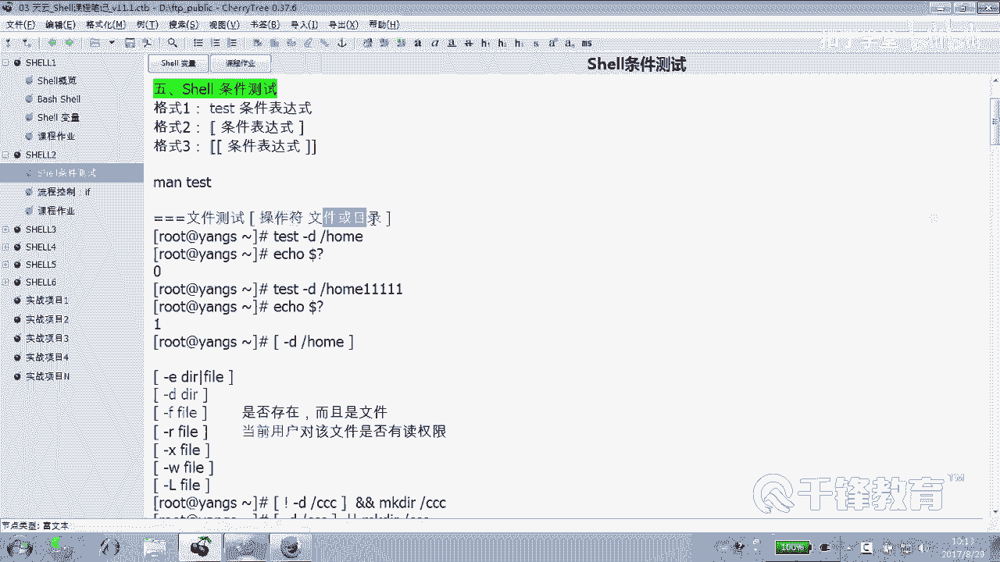

我们就不用ts，好吧，就直接用什么。😡，好，这边操作符再加上文件或目录。好，下面看到这里人吗？

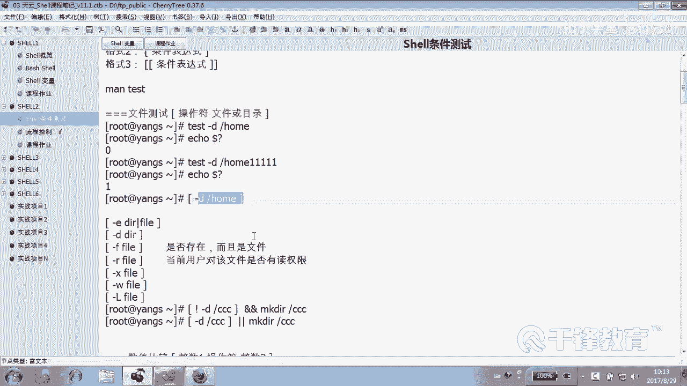

刚毅。是不是只是判断它是否存在，它后面既可以跟一个目录，也可也可以跟一个什么文件。就只要是只要这个对象存在，这个条件就为为真为真，是不是？😊，刚D呢是用来测试它是不是一个什么目录。

这个我们在刚才其实给大家已经测过是吧？它如果不是一个目录的话，那我们要创建，是不是？杠F呢？它是不是一个文件？杠R它是不是什么？有。读权限。杠X是不是有写权限？好，这边我加了一个很重要的一个一个前缀。

就是。😊，当前用户。好，举一个例子。

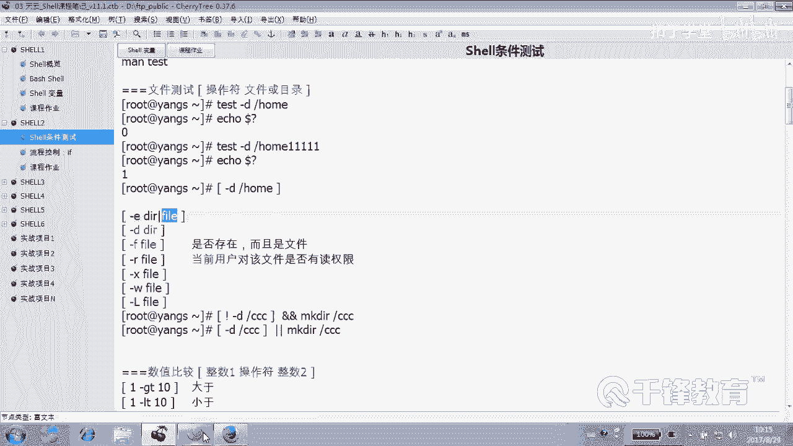

好。我在这边有一个叫IP点TSC文件是吧？😊，好。那各位。各位好好的看一下这个文件，好吧，来，我们来测一下杠R，我对这个文件有没有读权限。😊，你告诉我返回应该是为为什么？😡，为真还是伪假真。确定吗？

不是没有吗？这儿。root对我是root。回针是吧？那么同样。那个是。UG减去R。O加上R吧。IP点TST。好，总之是这么一个结果。现在入的用户有没有夺权限？😡，回车。为真还会假？怎么还是违信啊？万。

为什么容一吃。😊，我们看到明明就没有啊，就没有读权限。😊，当下我是试哪个用户测的？好像这种策法是没有意义的哈，是吧？😊，因为入的这个没法测，我们还是切换到。😊，切换到一个普通用户。好了。

那这边呢我们把这个文件呢给他一个，重新给他一个权限，哪个文件。😊，呃，600吧，home下的爱ice下的那个叫IP点TSD文件。诶。test哦，它叫test是吧？😊，OK来看看这个文件。😊。

爱用户有没有多选限？😡，盖尔。有没有test这个。没有。哎，不是前面有吗？前面那个。😡，20。那root的跟他没关系，所以记住一定是什么用户。😊。

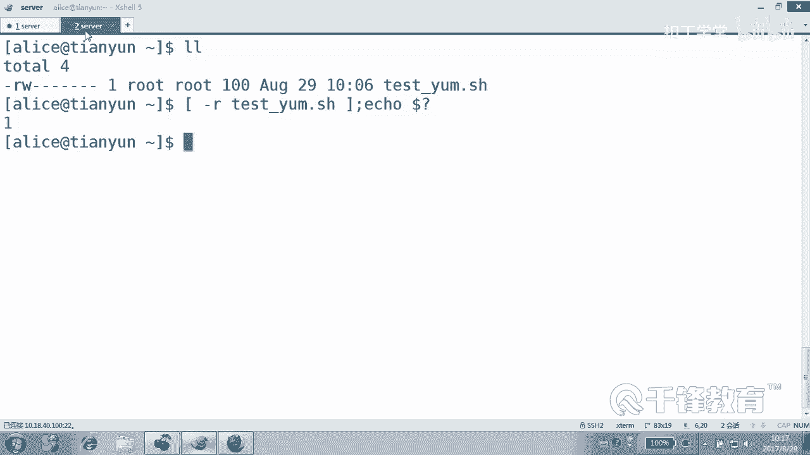

当前一户就是谁敲这个秘密。😡，测的就是谁，好吧。😡，谁敲这个命令测的就是谁对该文件有没有权限，所以不要看人家权限，那人家的权限。😊，就像昨天过七夕的时候，你看你自己就可以了，好吧。😊，でです。啊。

人家的媳妇儿跟你没关系。😊，是那个本应。所以这个社会确实适那，那可不一定。好，这是执行这什么？这是那个。

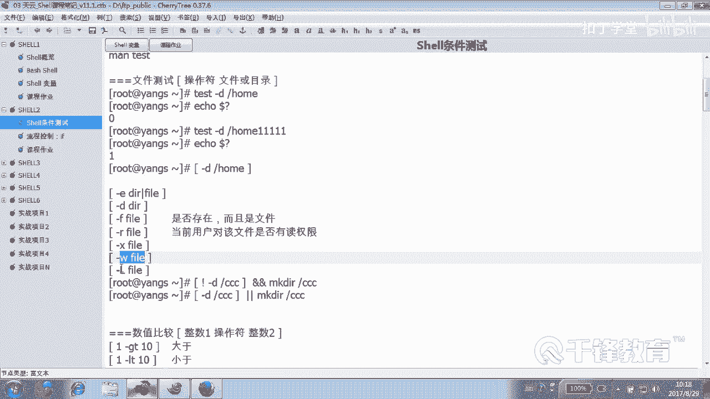

写什么叫IL呢？L是干嘛的？😊，它是不是链接吧。好，这个测试实际上是谁测都可以。你看我们现在看杠LEDCR的host4是链接吗？😊，他是链接吗？😡，不是对吧？反伪假吧。😡，来，我们再找一个。😊。

EDCR的RC点。local是链接吗？是它是链到这个位置，看到吗？他确实链接啊。所以L是指的是链接的意思。明白，那么同样我们看一个文件是设备文件吗？怎么怎么看操作服用用什么杠。😊，B。😡。

DEV下的SDA它是设备文件吗？是。他是字符设备吗？😡，他不是非非自由设备。看如果我这么写的话，大家应该能懂啊，它不是字符设备，对吗？😊，对对，是不是它确实不是自符设备。😡，对吧。

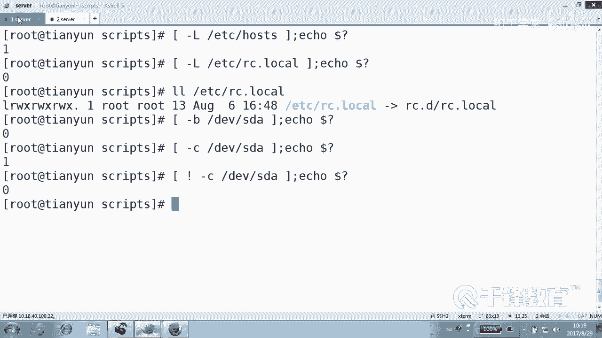

嗯。那下面呢我们看到这个例子呢，各位相信大家也看的很清楚看。😊，如果。这个目录。不存在，那我们就创建。因为这两个按的符号正好。😊，正好是不是指的是当前一个命令。成功。前个命义为真实，需要什么条件？😡。

它不是一个目录，那不是目录，那我去创建那。😡，这个怎么解读？他要是试一个步骤呢，那我就不创建。因为我的执行是需要前一个为假的。😡，嗯。这个如果说你分不清真假，我觉得也是正常的。

因为这个社会这个世界现在已经是真真假假。假假真正。所以我们也分不清楚。

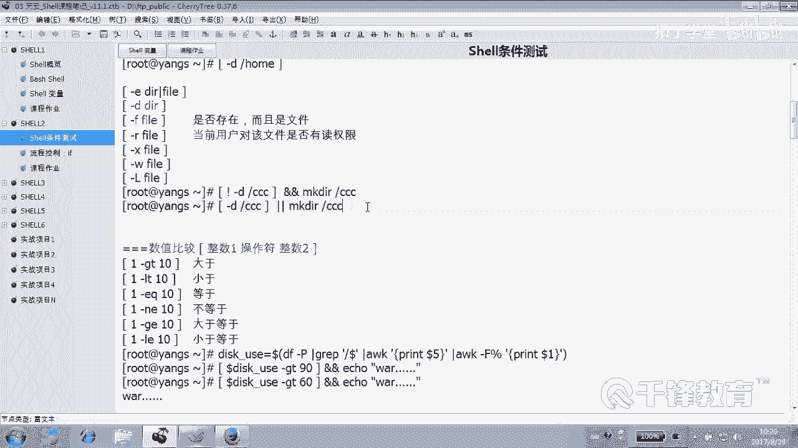

留他家估计也悬。好，所以呢这个目录文件测试会了吧这个。😊，好，比如说我们刚才给大家举这个例子，就如果说这个目录不存在，那我们是不是创建？😊，如果存在的话呢。那我们就不创建。

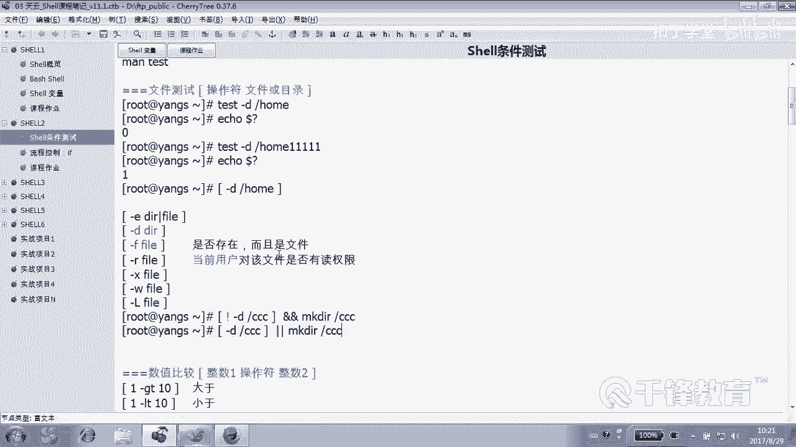

是吧好，那同学说你看啊我记得我刚刚我们写过一个test my变废是吧？看。😊，如果这个目录怎么着？😡，录不不是个目录，是不是我们就创建？😡，这没有没有毛病是吧？如果他不是目录就创建。那如果他是目录呢？

😡，你没必要去写是目录不是目录，它不是我们创建，是就啥也不不干呗。😡，是是这一小段儿就过去了呗。😡，如果你真的你是个目录，那你这个条件就。😡，不为真不为真，这事儿就不做不做就往后走呗。😡。

是不是这没有没有没有什么问题，好吧。😡。

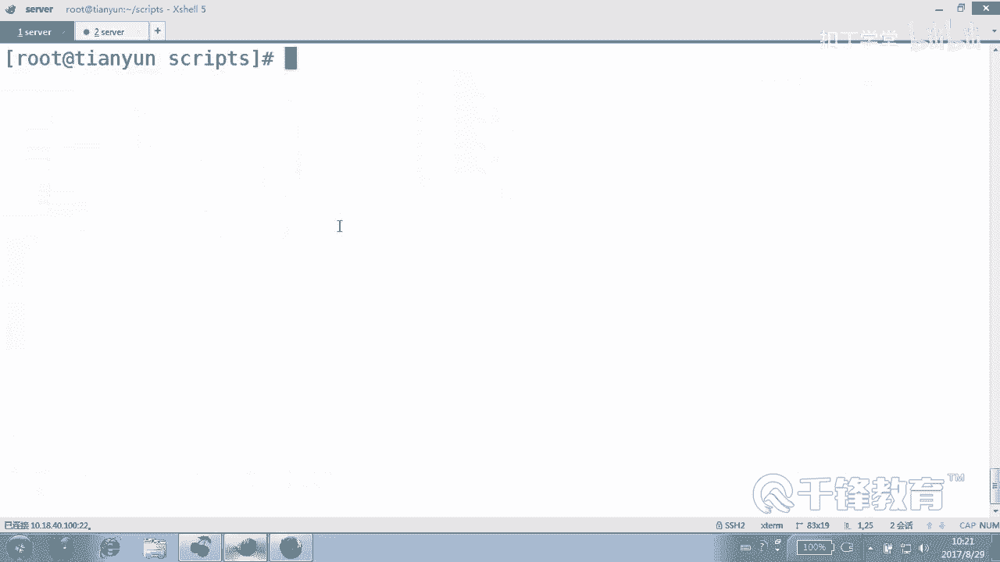

还有我们在在这个昨天我记得我们写过一个脚本，当时呢我们用到了一个当时你们用到了一个cat dollar一这样一个用法。😊。

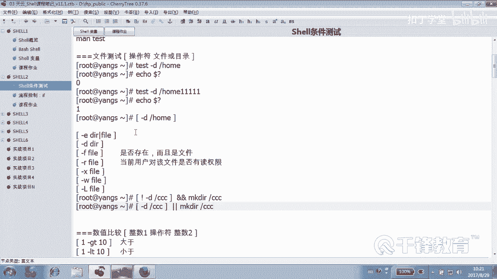

在哪个脚本里面写的？😊，P07里面写的吧，看到吗？好，我这种用法能看懂吗？你知道我为什么不敢用双引号吗？😊，我用双引号里面双引号是不是叫弱引用，双引号里面的变量，它还会挣扎一番吧。我说你别挣扎了。

你就就我就找的是什么刀一，你老老实实给待着。😡，带引号信号什么意思？从所有文件当中过滤内容包含什么？😡，好，不解释了，看一下。哇，这里面全是调音测试吧。😡，昨天我们讲的时候讲的是那个叫预定义变量。

但是呢这都是一个一个的典型的，都是。😊，条件测试你看。如果这个参数的个数。等于0各位，这是什么什么什么条件测试里面哪类？😊，数值比较还是字符串比较，还是文件的测试。值没错，是不是数值？😡。

你别告诉我小数啊，这里面全是整数啊。好，do点紧是不是参数个数等于零能不能写那个能不能写成那个等号，能不能。😊，能不能先等哈？😊，能不能写成两两个等号？😊，那是什那是什么测试？那字差比较吧。

当然能不能写量个等号呢？我想告诉你可以。😡，Yeah这。不是那个时候用到的不是方括号，是两个小括号C元结构的那种比较。😊，可以。好，没关系，一会儿给大家试，绝对可以的啊。😊，一切都是通用的。

就是se很多东西是和C呢在写法上是很相通的，很多地方都是都可以混用的。😊，好，这是不是我们的数值比较？那这是什么比较呢？😊，文件文件文件比较吧，我是不是文件测试，我想判断说哥们儿。😊。

如果就这样勾的勾成这样的话，表示。你是文件，我就为帧。我要的是你要是不是文件，我就告诉你什么，输错了，然后退出。😡，能看到吗？另外呢下面这个地方是不是更加是条件测试啊？😡，如果什么。😡。

设一个命令执如果上一个命令执行成功，预定一变量等于0，那我们就做什么事情，否则是不是做什么事情，条件为真，做什么事，条件为假呢？是不是做什么事？😊，看到了吗？各位。好。

所以文件测试这种方式也是非常常见的，用的最多最多的就是杠D杠F甚至杠E。

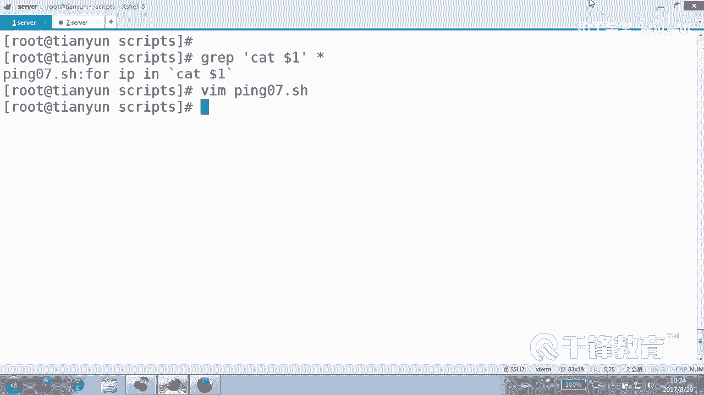

就用来判断我们的某一个文件是不是存在呀，或者是呢有没有权限啊，是不是链接文件，是不是管道文件是不是目录文件，对吧？可以做这样一些判断。😊，好，这就是关于呢。文件的一些测试的一些技巧。

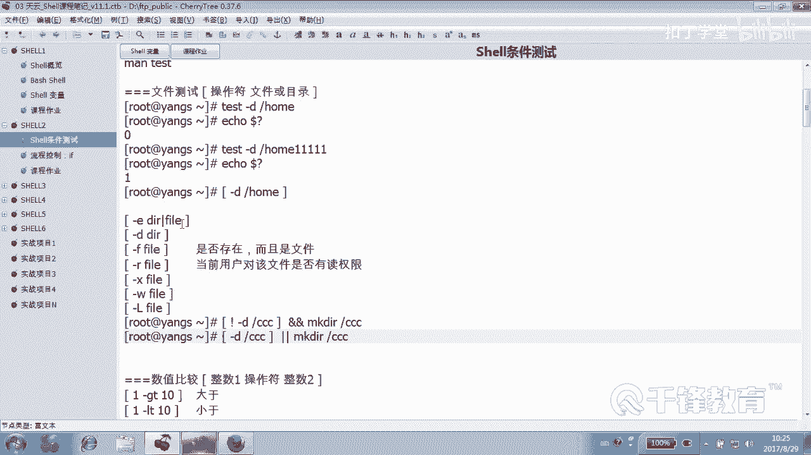

呃，当然这个数值比较呢，我们刚才也看到了是非常重要。当然有同学说老师你这么写是不是很无聊啊？😊，一大于10吗？一小于十吗？一等于1吗？一不等于1吗？一大于等于10吗？一。

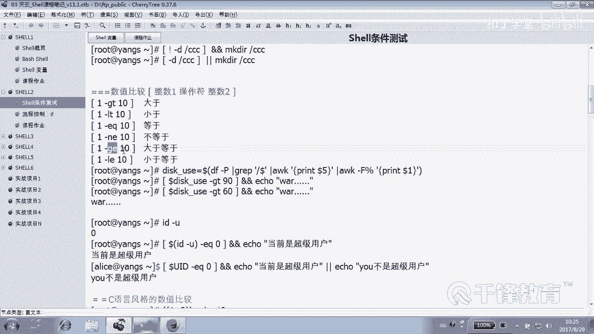

小于等于10吗？好，如果单从这个角度看呢，确实呢挺无聊的。😊。

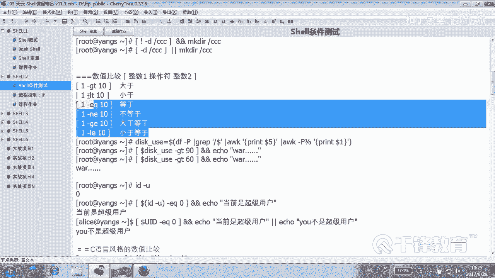

关键是我们更多的不是这么干的呀。😊。

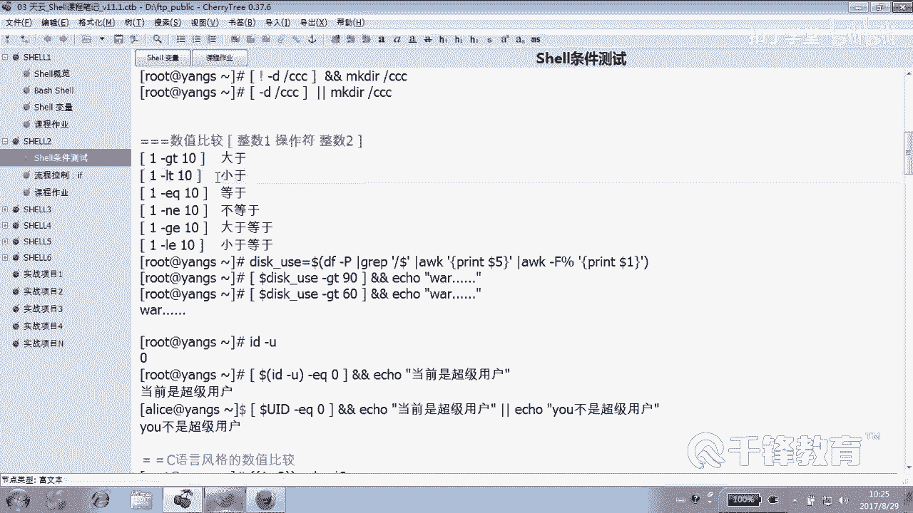

你看我们刚才的脚本当中。😊，哪个地方用哪个两个数字在存存在那比啊，有吗？肯定用到的是一个变量。去比是吧？是不用的变量去比。好，这是数值比较。来，我们现在呢我们写一个数值比较的一个小例子。

也是我们课后的一个作业。😊，就做什么事情呢？😡，请用户输入一个用户名。然后这个用户。就是请用户输一个用户名，我们要把这个用用户给他创建出来。但是呢我们可能需要判断它。😊，是不存在？最后创建完以后。

我们还要知道创建是成功还是失败的。😊，能理懂意思吗？这是第一。😊，就是我们的作用是要创建用户，这个用户是谁是谁输入的？是由用户输入，那用户输入怎么输入，用锐对吧？是不输入一个用户名。😊，输一个用户名。

比方说用户输的是爱ice，那我们是不是首先要判断那个爱ice是不是。😊，存在啊如果存在的话，我们要打印一个什么存在，否则的话呢，那就创建。😡，能听懂吗？好，相信这个思路呢应该没问题。来。

我们下面来写一个。😊，比方说。Great。user的一个小的脚本。这是个简单的叫01吧。😊，好。首先我们提示用户。是不是请输入一个。请输入一什么？用户名。好，我们给变量优点。😊。

这个当中这段大家都知道是肯定是可选的，可以没有吧。😊，但是最好还是有。然后呢怎么判断呢？怎么判断用户存在不存在。😡，は。各位审判的义务存在不存在？有有有人可能会告诉我说，是不是应该gra一下爱ice从。

😊，EDC pass word里面这个不对，这个算法不对，为什么不对？😡，万一它里面有一个用户叫id一呢？😡，万一我想创业用户就叫什么？就叫ALI。😊，那你告诉我有还是没有？😡。

这个用户现在有没有对你好，还有坚顾啊，其实没必要可以简单一点，就是ID爱ice。😊，I D， Jack， I D。Roy。看。ID是用来查看获得一个用户的信息嘛。同时，如果这个ID命令报错的话。

就是没有的话，那自然就是为假了，是不是？😡，好，因此我们可以先怎么做？先。😊，可以这样写ifID哪个用户user。当然这个过程我们可以不要，也就是把这个过程给丢到垃圾桶里面去。😊，好，如果这个条件为真。

什么情况为真？是不是返位置为。0啊零就指的是。银子是不是指的存在啊？如果存在的话，那我们就挨克一句话说什么？😡，说user谁doer。Your子。存在怎么打的这个单词。其实你看啊看是这样的。

很多mini呢系统当中会会有帮助。你看我们创建一个adice，他说什么？😊，你把这句话拿来是不是就可以用了？啊。用户谁？用户。Dollar user。Already。ext是吧，你是不是存在？😊，好。

那否则的话怎么办？😊，是不是创建这个用户，谁dollerus是不是这样子？然后紧接着。我们可以再加一个小的判断，在里面if。😊，如果什么当位问号EQ等于0，那我们就提示一下用户已经什么。

Dollar user。created创业成功。好，这边同样用到了我们的叫什么面料呃，什么呢那个测试方式。😊，如果你觉得这句话不太容易看懂的话呢，我们可以稍微换一下。😊，换成。

先来执行ID到了什么user。然后紧接着呢，我们使用。到了问号EQ等于什么0。是不是也可以啊？😊，你看先测一下用户是不是存在，如果存在等于零的话，说明什么？😊，这个命令的返位置为零的话，是不是用户存在？

否则的话怎么办？创建用户如果又再次做一个判断，如果等于零的话，那么我们就艾ical用户创建成功，是不是？😊，好，各位自己呢试一下，好吧。😊，好，这是刚才我们讲到的这个条件测试。这边呢。这边。

有同学呢刚才在问我的一个问题，说说那个。上面这条语句这条语句为什么是成功的？这个if后面啊我们虽然说还没有讲到，但是我们想告诉你的是，if后面可以跟任何一条语句，明白吗？

只要他其实想要的只是这个语句的返回值是成功还是失败。😊，所以不在乎后面跟什么语句，哪怕你这个E后面跟1个LS都可以，明白意思吗？😊。

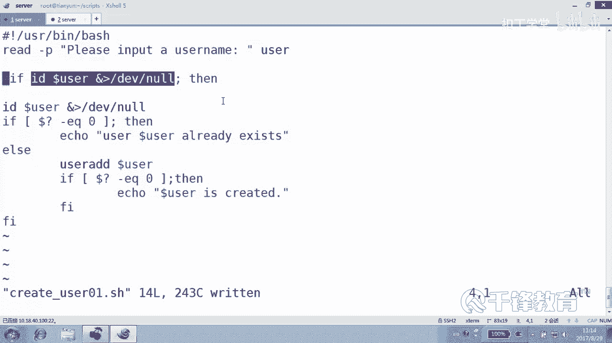

好。这是什么什么比较？这是数值吧。这个数值比较。那比如说我们的磁盘磁盘来讲。我们想要判断。我们想要什么呢？如果磁盘的使用量大于百分之根分区啊，如果它的使用量超过90%，然后我们就报警。懂明意思吗？

那怎么做？首先我们是不是要把磁盘的使用的这个量给它。😊。

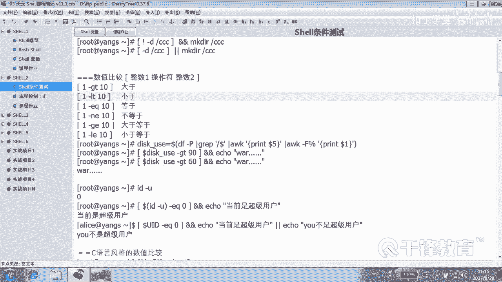

先提出来啊。是不是提出来怎么提出来呢？我们找一个找一个窗那个终端DF杠。T。它的使用是在这个位置吧。😡，怎么拿出来？😡，过滤一下什么。以什么结尾的？你是不是跟结跟结尾的是吧？我们只关性跟分区。

比如说只关心跟分区，然后在AWK打印什么？😊，好，这边我们开始写这个脚本啊，写一个disk use点SH的脚本。😊，啊，我们要达到的效果是。😊，如果使用量超过90%，就给爱丽丝报警，好吧。

就把这个消息发给。发给我们的X用户。简号叹号USR下并下的baash来先看下我这边写，好吧。然后先定一个变量叫什么？😊，我们先把这个磁盘的使用量给它取出来，能取出了吗？各位。😊，现在。打印你几年？呃。

这样吧，我们打印倒数第。倒数第二列是不是可以了，用NF减1。NF就是倒数第一列。NF减1倒数第二点，我们可以数，大家也可以像这样去打印，明白。😊，当然各位这个百分号9能够比较吗？😡，不能吧。

所以应该再次呢AWK给谁？😊，2一可以吗？不可以，为什么A家什么分割？😊，这边我们得使用。把分号分割好了，这就是我们要的结果，然后再将它付给一个变量。比如说。😊，Dsk。钥是。好，这样写可以吗？😊。

这样写不行，在前面我们都讲过，你这样写的话，第一有好多空格，后面就算加双引号是不是也不可以啊？加双引号，它只是把后面那整个那个字符串付给那个变量。😊，能听懂么各位。对，反引号。

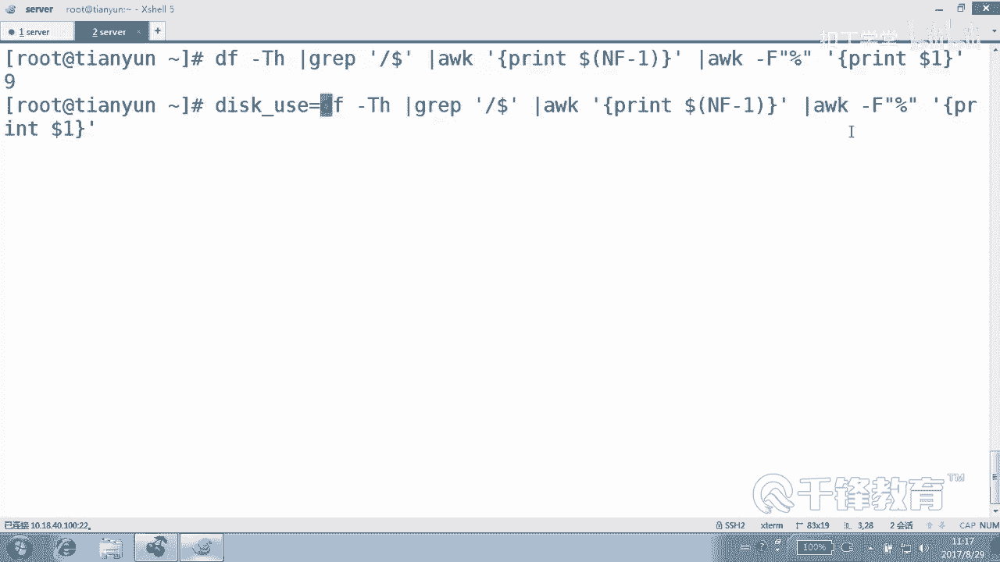

あらしょ。