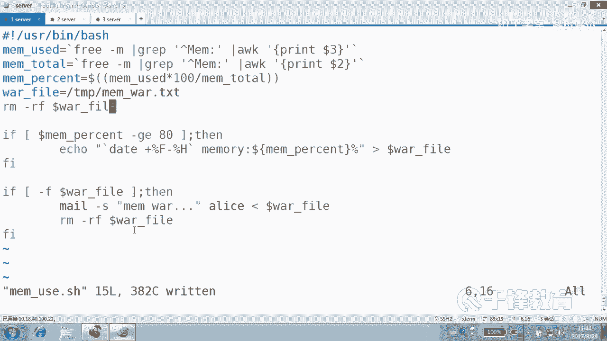
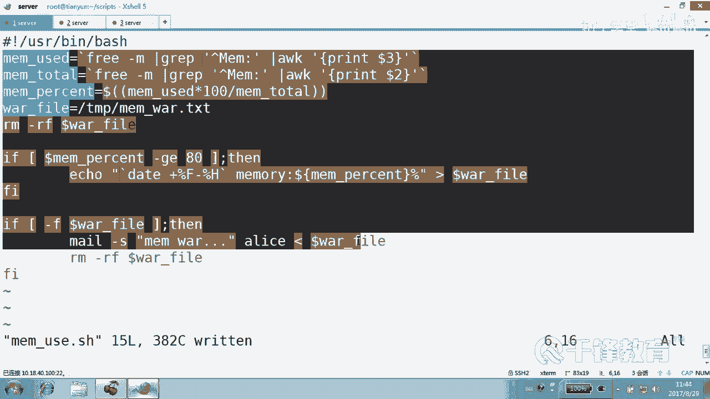
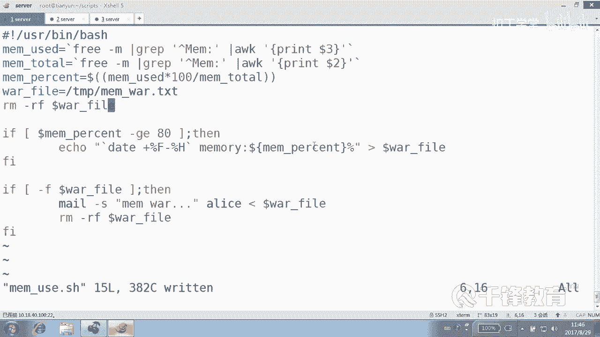

# 千锋扣丁学堂Linux云计算系列：Shell脚本自动化编程实战视频教程 - P9：3.3 条件测试 内存磁盘使用告警 - 扣丁学堂 - BV1SE411q7vK

okK我们将这个整个覆给一个变量是吧？覆给变量的方式可以使用反引号ctrl加E到最后去反引号。好，这样可以吗？ecle dollar。disk use是这个效果吧。好，这句话我我给大家讲过。

你不可能正常写出来，所以怎么办？😊，在这边敲敲完以后再粘到这儿来。好，当然不能不能换行是吧？老饭好吗？能换好吗？小黄可不可以？😊，斜线回车是不是可以，但是那个斜线后面不能再有。😊。

set list不能再有空格，明吗？旗限转移的是什么符号？😊，换行的符号是不是？如果你想换行的话，可以。如果你觉得这行你能接受的话呢，也可以，好不好嗯。😊，少一个引号。

翻引号那个set lot list。不要了，好吧。好，那各位现在是不是获得了dis的一个值啊，磁拍使用的值。😊，那怎么报警呢？我们刚刚有个条件，如果什么。这个是什么比较数值吧。😡，到了。

disk your大于。大于等于。GE还是GT啊？大于等于多少？90。那我们就报警是吧？现在是百分号，现在是9是吧？😊，9肯定不会大于90。正报警。报警呢，我们就用发邮件的方式。

大家应该还记得我们在在这里在那个文们文那个命令行下面发过邮件，比方说。😊，Hello。😊，爱丽丝是吧。然后发给谁呢？用管道给m杠S是主题，主题呢是hello one。发给谁呢？爱迪看到了吗？各位。😊。

这是这文，这是邮件的subject，这是邮件的对象。好，我们切到。😊，爱丽上去。看到这种有限了吧。😊，好，这是本期的监控邮件。那因此呢我们也可以怎么做echo。😊，艾克一段话。😊，艾克一段什么话呢？😡。

你可以加上时间几月几号。对吧加时间的方式呢，我们可以用反引号data加百分号什么F。但如果加百分号F，它只是显示年月日吧。😊，data加摆放F，它是不是年睿制？😊，如果说你在后面再加一个百分号M的话呢。

它会显示什么？😊，是几点了，这是。你想加上小时吗？8月29号21。data杠杠hap，我们看一下小时是哪个。哦，这是分。继续。Yeah。小时吧。是用24小时还是用那个。24小时法，那就是K是吗？再打K。

湖北哦，这个还不是。大H是不是？这种也可以啊。这个这不挺好看吗？多了一个多了一个。不是厘米。好，我们再加一个百分号。😊，H。是不是11点。好，也可以甚至可以加上详细的分钟。😊，这个小杠是你自己定义的。

你看小杠好，那我们在这边呢加上。😊，百分号H。几点几分？然后发一个什么内容呢？磁盘。使用率达到多少？dollar多少？Dsk yours。是发一个磁盘的一个使用率。然后能不能加版文号在这儿。😊。

可以加百分号吗？有没有歧义啊？😡，其实我们一直用过大括号是吧？好，这样的话你没问题。你看我们还是还原的时候，给用户展示的时候，还是让它变成百分之多少，是不是然后给谁呀？这是正文嘛，然后给M杠S。😊。

Disk warning。发给X用户。那么甚至你可以把那个mail用户也可以定义一个邮件，比如mail user是什么adice吧，下面我们使用变量。😊。

尽量的在在我们的脚本当中使用变量dollar mail。User。好了，看到了吗？各位。😊，这是一个简单的一个数值比较。当你的磁带空间使用率。超过90%。当然前提是你必须要先截取获得这个值。对不对？

然后紧接着呢，我们再去做这种数值比较。如果这个值大于等于90，那我们就发一段话。那么这段话的内容其实将作为邮件的正文，那你是可以自己自行定义的，对不对？然后最后m主题管道跟mail主题以及用户。好。

那我们怎么试一下呢？先看一下，我这边还是登到。艾ice上去，目前他没有。我把电话邮件收一下啊，目前他没有额外的有，嘿，怎么还有啊？😊，D。啊，收过了79啊D，然后把这款游给删了啊。😊，好。

现在没有邮件了吧。😊，好，这脚本呢我们给他一个权限。😊，disk use好，如果就这么执行的话，可能啥都不会啥都不会有反应。😊，因为没有输出的东西嘛，是不是？😡，那我们可以怎么执行？😊，还记得吗？

当有时候你不清楚脚本在整个执行过程当中到底做了什么，哪一步出错了，你也不知道，那你可以加一个调试的方式，以更加详细的方式去显示整个调试的过程，对不对？但是这样的话看起来可能会比较混乱。😊，好，回车喽。

😊，好，看到了吗？各位，这是我们是不是它执行的命令？😊，是不是他执行的命令？带加傲的是他执行的命令你看到吗？他执行过的。😊，得到数字是几？这老师说的是那个sorry。这个。变量的值是9是吧，9，然后。

优酷爱ice没问题，然后。这个九大于大于90吗？不大于，所以最后有没有发邮件？😡，没有好。那我们呢没有收到邮件。把这个数字稍微改一下，因为我们现在不可能把磁盘给称上去是吧？我们改一个数字。😊。

改成8行吗？应该会报警的吧。再看一下。有没有这个动作？看最后。这个数字是9大于等于8吗？大于等于8。所以呢最后这条命令执行了。因此。😊，好，2017年8月29号11点。磁盘达到了9%。

是不是这句话怎么写是完全是由你定义的。😡，你觉得应该再输出点什么东西，那你输出点什么东西，好不好？😡，看懂了没乖。好，那他说这个这么做好像挺不好的呀。😊，我们可以怎么做？还记得计划任务吗？😊。

还记得计划中务吗？😡，我们这个脚本的位置是在scip下的，这个叫。😊，disk use是个小本吧？好，我们让计划任务每隔。😊，CNTCRONTAB杠E。好，这边呢我们让它每隔5分钟。😊，是不是75。

新新新新新，然后去执行一下这个脚本。当然有同友说前面要不要加bsh？😊，你脚本有没有执行权限，有没有？😡，有的话是不是就不用加呀？有的话，他是不是本身就可以执行。如果脚本没有执行权限呢？

如果你不保证怎么办？你加个b师。因为大家知道我们使用b师去执行一个脚本的时候，无论你这个脚本有没有执行权限都可以吧。😊，是不是？是这样的吗？没有印象了。好，那总之是每隔5分钟去执行一下脚本。

当然我们为了看到效果呢，我们也可以选择暂时先每隔一分钟执行一下脚本。😊，好吧。那他就每隔一分钟会执行一下脚本，然后得到的结果采集到的数据是。😊，是什么？是那个会超了吧。好。这是关于磁盘的一个。统计。

那我们也可以把这种方法用到我们在前面讲的内存上去。😊，是不是内存上去？这个其实我们在前面写过，但是没有写报警。那下面我们来写一个内存的使用情况。对对。他好像有过了是吧？有的话，那直接用吧。😡。

这是内存的。已使用这个已使用怎么获得的话，其实你可以呢通过frreee mini杠M获得吧。过滤出什么？😡，以memory开始的这一行，然后这一段是不是已使这段是那个。已使用。这段是什么？

这个字段是总量是吧？好，我们获得第三一个段是已使用。或者第二个段呢，第二个字那个第二列呢是总量。第，然后紧接着我们定义了一个。😊，一个这个变量叫memory。person，然后也是百分比。在这里面呢。

我们用总量用那个一使用乘以百分之百去除以呢memory to。这个是在前面我们是不是讲过的？当时我们只是给了一个输出的一个简单的内存百分比。实际上我们可以用它来做什么？😊，做这个也来做一个报警的。好。

我们这边换一个方法看啊换一个方法。😊，我们再定一个告警的邮件。呃，告警的那个文件，也就是把那个错误消息啊输到那个文件当中去。输到文件里面去。这个文件呢这叫TMP下的叫memory。

50点TST这样一个文件。好，在这一切都是变量，对吧？😊，然后判断一下。看内存的使用有没有超过百分之。80。怎么判断用什么？先把这个结构写上，否则的话很容易出错。结构写上。dollar什么。MM。

它的百分比是不是能这样写吗？能不能描样写？好像不冷是吧。看起来是对的，但是不可以这样写，我们可以试一下。8。大于9对吗？不对吧。乱写的好吧，不没没法这样测，因为这里不支持什么。😡，但能不能写大于符号。

小于符号呢？可以就是。😊，八大于9吗？大于9吗？郭大雨。8。大于5吗？大于看到吗？这是C风格的这种判断方式。C风格的啊。所以我们的数字比较里面各位看清楚，除了上面这种这种我们这个sll的这种风格以外。

还有这是什么C语言的风格一小于2吗？😊，一、注意这里的等号，千万注意不是一个等号，一个等号在C里面是负值，是不是好，一等于二吗？一大于二吗？一大于等于2吗？一小于等于2吗？一不等于2吗？😊。

或者一个变量，这个一个命令执行的结果大于零吗？变量等于零吗？因此其实可以使用两种方式，一种是C风格的，一种是什么？😊，少风格的这种风格。好，当然其实我觉得你应该从一而终，你喜欢哪，你要是喜欢哪个，你就。

用哪个好吧。如果你喜欢这个呢，也没问题。总之，衣服是干嘛的，它的后面只要跟一个能够。😊，能够干嘛？得到这个返回值就可以，是真是假都可以。甚至当中这个符号空格都可以不要看到吗？😊，如果大于80，各位。

刚才那个上风格的写法，那个方括号写法应该各位都看得懂，对吧？好，大于80%怎么办？😊，还是刚刚那句话，data加百分号，什么F杠。😊，百分号H。呃，这个要怎么执行？这样执行吧。然后。几月几号内存。他的。

它的百分比是多少？然后这边呢听好了这边。😊，我们可以把它把这个结果是不是放到一个文件里面去啊？😊，可以直接传给m来直接发邮件，可以这样做，也可以呢放到一个文件里面去。😊，放到文件里面去呢。

我们是重令项是吧？放到这个文件里面去。😊，到哪个文件？到了。Worning。fi要这个文件吧。出到这个文件里面去。好，然后紧接着。😊，那这一段这个语句它仅仅是完成了一个条件测试，就比较是不是大于什么？

80如果大于的话呢，就做这个动作，不大于呢。不做一个动作。好，我们看一下刚才那封邮件啊，刚才可能收到的邮件已经不止一封两封了，所以我准备把它灭了，太太夸张了，好吧。😊，大家不要随便的使用这个命令啊。

这个命令是不是会把所有的计划任务清掉？那你得知道你其他计划任务得得没用啊。😊，好，不用重启，这就OK了，好吧。😊，好，然后。怎么发邮件？来一个文件测试。如果。这个文件存在哪个文件do。

orningfi fill这个文件存在。那我们就发邮件。mile杠S主题是什么？是内存报警。发给谁呢？😡，爱丽丝有没有正文啊？😡，各位看到了吗？各位其实当可以不用这么麻烦。

可以像刚才我们写磁盘的时候那样那样简单，也就是说直接把这个结果给什么？😊，通过管道是不是发给那个用户啊，也可以把这个写到一个文件里面去，然后再做一个发送。😊，如果这个文件存在说明什么？😡。

是不是需要报警？那不存在呢？😡，不需要报警。在这里有个问题。你看啊有什么问题呢？😡，我们执行一下。先检测一下这个脚本的语法，杠杠N检测一下这个语法，当然拜是杠N或者是。这个SH杠N都可以。

语法上大概没问题是吧？每少一个括号，少两个括号的。语法上基本没问题，你要想语法没问题的话呢，你就要记住在写的时候。😊，在写的时候，我们一定要成对的出现，无论是括号还是语句。好，这个语法没有问题。

而且呢我们看到这些我们在写，无论是注注意啊，无论是双引号还是单引号还是反引号，你都要成对一些，好吧。我们都要承队去写。而且呢这些符号要注意，当然我这边只是一个示例，实际上我们建议大家不要一会儿整这种。

😊，C风格的比较，一会儿整这种什么s的意思比较，这个还不妥的。好吧，这看起来怪怪的这种感觉。就这种方法可以。😊，啊，数值比较嘛？C里面也可以用啊，这种数值比较。😡，啊，如果想换掉怎么换？😡，换成那个。

放挂号吧。然后。放括号，那这里就不能使用那个大于号了吧，使用GGE。大于等于，而且还有空格。好，那现在呢我们看起来这个文件没有错。来，我现在呢把这个值给它稍微呃稍微小一点一会儿啊，我们先测一下。😊。

Memory。呃，为了看到效果，我们还是采用这种调试的方式，memory use。好，虽然说有点乱，但是呢能看到每一步执行的结果。好，先执行的是这一步，这条命令对不对？是不是这条命令？😊。

然后这个命令的执行的时候，一步一步执行的分解开的得到的值是1125。然后total呢是多少？48290，用它除以它现在使用才2%，很显然不会报警。是吧。并没有创建这个文件。啊，这只是变量。

下面呢我们看到。😊，这上面的变量啊变量的一个一个负值，这也是变量的负值，负了负了值，对不对？😊，这是这是那个脚本里面的语句，这是它执行的语句，加号是他执行过的。然后紧接着呢，我们看到这条语句。

二大于80吗？不大于等于8是吧。好，然后最后所以这个文件呢其实也没有，最后也没有创建。好，那我们把这个稍微改成那种很什么。好，最后有没有创这个文件，你自己看有没有创这个文件。😊，没有吧。

我们文件是放哪的？😊，TNP里面的吧。好，我告诉他只要大于等于2%会报警。再执行一遍，就这样执行喽。回说。自己看啊，无所谓，因为你在看你自己每部是干什么。😡，好，有同学可能看到现在呢二等于二大于等于2。

😊，所以eical说了这句话，并且呢这个文件应该产生了，而且发邮件的。😊，我们首先看一下TNB下是不是有一个文件叫做。叫memory warning是不是有有一个文件，有这样一个内容。

然后我们再看一下idice用户有没有收到一封新的邮件，第八封邮件。是不是有报警？好，我我觉得很乱。一到。把删了啊，现在没有了啊。😊，那现在呢如果我现在把这个脚本改回到正常，也就是说内存回归什么？

内存的使用回归正常了。各位大家告诉我，我现在在执疑脚本会不会报警。😊，想好好想好好想这个问题。😊，我现在在执行脚本会不会报警？而且我们刚才这边也看到了邮件是没有了吧。😊，来再质一遍，你们是准备。

就这样执行，好吧。辉车这样执行可能变得丑一点，但是没关系。好，上面是变量的负值，取到的是1129。没错，然后48290没错。然后紧接着呢，2大于等于80吗？😊，没有，但是最后有一句话有一个m这句话。

为什么？因为这个文件存在。😊，你上一次有残留，知道吗？😡，你上一次有残留这个文件存在。那你怎么乖？这个文件只要存在，时会报警。😡，所以报的应该还是上一次那个2%的井。那这个问题怎么处理呢？😊。

这个问题你要考虑到考虑到你用完以后，应该把这个文件。😡，是不是删除啊？😡，到了。wordning file是不是删除？甚至是在你用之前呢，应该干嘛？应该一开始也把这个文件呢。干掉。

因为在一开始你上来的时候，最好是没这个文件。然后根据你的情况来判断有没有这个文件。因为要不要产生这个文件。那当然我写这个脚本看起来有点有点那个复杂了，或者说我们刚才第一个脚本磁盘报警，是不是比较简单。

直接把那句话是不是就输出给m，没有判断一个所谓的文件是不是存在不存在。但如果你真的需要一个文件的话，那你要考虑到很多现象是什么现象？😊，第一，因为只要有这个文件在就会报警，是吧？😊，那所以你要注意的是。

上一次的残留的那个结果会不会对你有影响？因此，你可以在来之前怎么做扫一下房间，走之后呢。😊，再扫一下，在走之前来的时候扫一下，走的时候再扫一下，保证不给别人留下什么伤害。😊，明白吗？所以这些细节东西呢。

它不是说脚本的语法可以教到你的。😊，其实各位看到我们现在写了这么多行，当然这还是一个非常简单的脚本啊，非常简单的脚本。我们写了这么多行，大家注意观察一下这里面的语法是不是异常简单。😊。

虽然说我们还没有给大家特别去讲过if语句的这样一个结构。如果条件成立，那么怎么样是吧？你看这个if语句干了什么事？😊，他干的事儿就是是不是要输出一句话给那个给这个文件吧，这个if副语句干的什么事儿？😊。

判断这个文件存不存在，然后决定是不是发邮件啊。😊，没有别的操作呀。😡，所以每一个if服都是一个非常独立的一个个体，就非常简单。😊，而且这里面如果征收语法的话呢，最多就是if了。😊，如果条件成立。

那么怎么样如果条件成立，那么怎么样，这里面还没有否则是吧？异常简单，所以整个脚本的语法是特别简单，但为什么好多人写不出来呢？😊，他得要这个他得要这个他得要这个。是吧。他还是要怎么发邮件的这样的一些方式。

明白了吗？各位。也就是说，少脚本其实有时候你会发现在工作当中很多特别简单的命令来完成一个你可能意想不到的功能。但是需要的是你对整个lininux系统本身还有相关的一些知识点，还有一些系统管理啊。

服务配置啊，非常熟悉才能写。😊，从语法角度来讲，没有什么语法。😡，OK好，这就是我们的磁盘的和内存的一个告警的一个实例。😊，大家自己呢把这例子呢写一下，好吧。😊。

