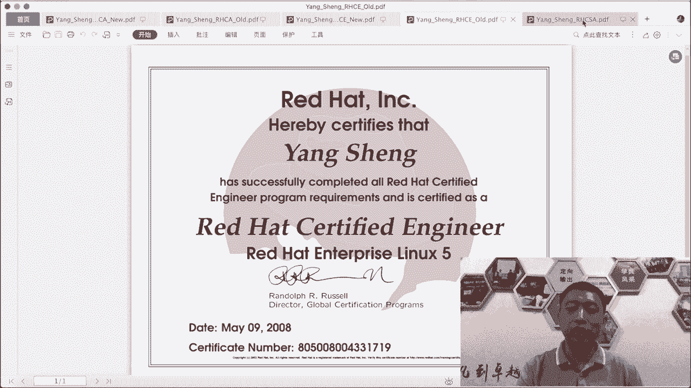
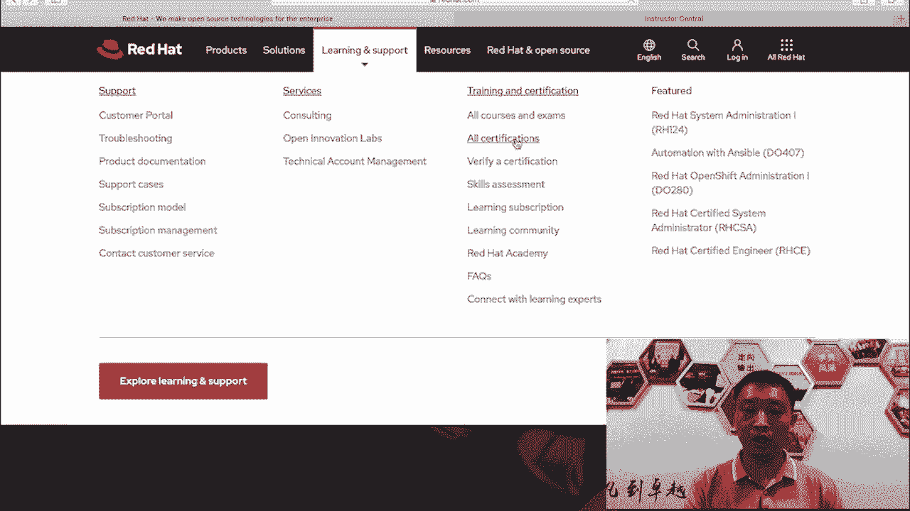
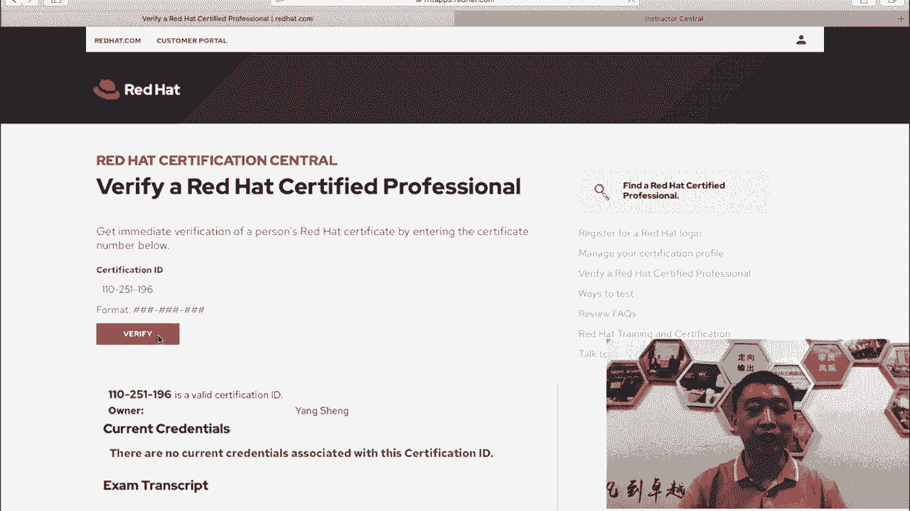
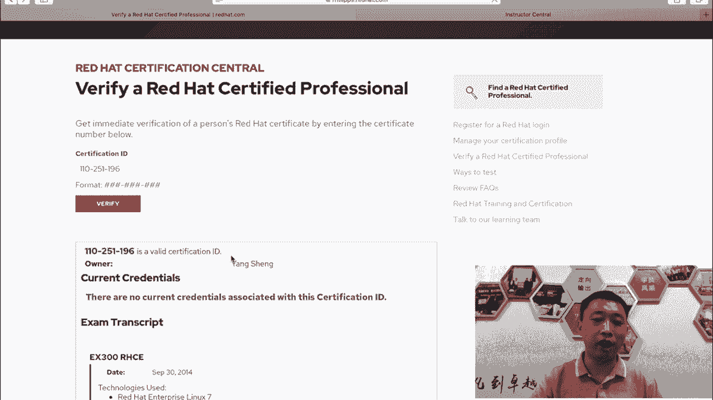
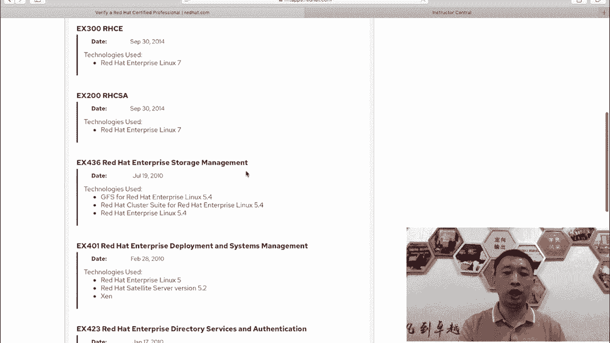
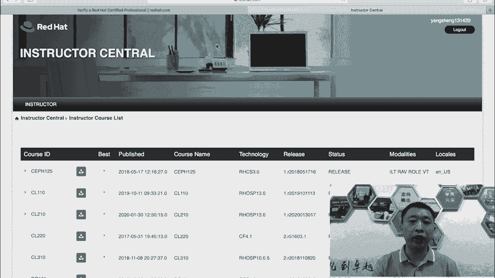
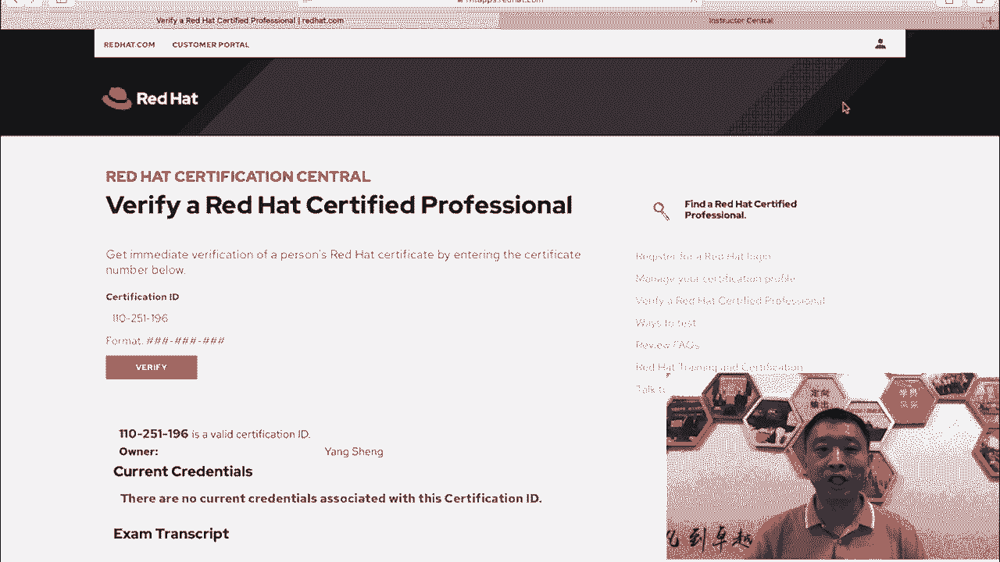

# 红帽认证课程：P1：红帽认证学习指南 🎯

在本节课中，我们将要学习红帽RHCSA和RHCE 8版本认证的基本情况、认证体系的价值以及正确的学习方法。课程将帮助你理解红帽认证的结构，并为后续的技术学习做好准备。

## 课程概述

我是杨哥。四年前，我曾录制过RHCE 7版本的考前辅导。从今天开始，我将为大家录制关于红帽8的RHCSA和RHCE考前辅导课程。

RHCE 7和8两个版本之间的变化比较大。许多同学应该知道，在RHCE 8的考试中，下午部分完全使用了Ansible自动化技术。因此，如果你没有看过我的视频，或者没有按照我的步骤进行练习，可能会遇到较大困难。

## 致谢与背景

首先，感谢各位同学的支持。我之前发布的RHCE 7视频获得了广泛认可。许多同学通过观看视频、按照步骤练习、并使用我提供的平台，成功通过了认证。这其中包括国内和台湾地区的同学。

这里要感谢红帽公司，特别是淮金阳（怀）老师对我的支持。我接触红帽的时间较早，始于2005年。红帽公司的开源理念在IT领域备受尊崇，对我的职业生涯影响深远。

同时，也感谢所有与我一同推广红帽产品和培训的合作伙伴。我们共同努力，为培养更多有用的人才而奋斗。

## 红帽认证的价值

红帽证书在企业，尤其是IT企业中的认可度和含金量非常高。我身边的许多同学都来考取这个认证。

红帽认证主要分为三个级别：
*   **RHCSA**：红帽认证系统管理员（初级）。
*   **RHCE**：红帽认证工程师（中级）。
*   **RHCA**：红帽认证架构师（高级）。

这三个证书会随着你技术的增长而逐步考取。特别是高级的RHCA认证，需要足够的技术积累。我本人在2010年通过了RHCA认证。

## 考试形式与难度

红帽认证考试确实相当有难度。它不同于其他类型的考试，整个考试过程全部是上机操作，分为上午和下午。

在我最早考取红帽证书（当时还叫RHCT）时，考试首先需要进行排错。如果前四道排错题没有在规定时间（约一小时）内通过，整个考试就会终止。

现在的情况稍好一些。从红帽7和8版本开始，如果RHCSA没过但RHCE过了，可以只补考没通过的那一部分。

## 讲师介绍与课程资源

我的本名叫杨生，目前就职于千锋教育，主要负责云计算（Linux运维/云计算架构）、Python人工智能以及网络安全这三个学科的管理、课程研发和团队带领工作。

我的网络名称是“天云”。我长期追随开源的脚步，并再次感谢红帽公司及淮静阳老师提供的支持。

我将把部分视频、资源以及练习环境开源，为各位同学提供便利。

## 关于证书的补充说明

红帽认证证书是进入行业的敲门砖，有时也是公司投标所需的资质。我个人考取过许多认证，但最喜爱的仍是红帽证书，因为其考试过程充满挑战，赋予的技术价值很高。

RHCE认证实际上包含RHCSA和RHCE两个证书，它们在同一天的上下午分别进行考试。

对于RHCA，我一般建议在工作经验能够支撑时再去考取。很多时候，考取RHCA的费用可以由公司报销。但请注意，一旦公司报销了培训费用，通常需要与公司签订服务协议，期限短则一年，长则两三年。

## 证书真伪验证

考取证书后，你可以在红帽官方网站 `redhat.com` 验证证书真伪。在网站“学习与支持”栏目下找到“校验证书”功能，输入证书编号即可查询。证书编号是唯一且跟随终身的。

我本人也是红帽认证的讲师（RCI），可以从官方讲师账号获取相应资源。

## 核心学习理念

最后需要明确，证书是敲门砖，但它与技术能力之间仍有一定距离。我现在从事的是技术技能培训，证书只是整个培训中的一个环节，是锦上添花的部分，旨在让大家的路走得更顺畅，少走弯路。

红帽公司设置考试的目的不是为了为难大家。虽然考试长达数小时，但红帽公司更希望大家通过学习、实践操作来真正掌握这些技术。掌握技术才是关键，它能变成你受用一生的技能。

## 课程总结

本节课中，我们一起学习了红帽认证的体系结构、各级别认证的价值、考试形式与特点，以及正确的学习态度。核心在于理解**证书是技能的证明，而掌握技能本身才是最终目标**。

从下一节开始，我们将正式带领大家一步步学习RHCE 8的新特性变化，并讲解与考试相关的技术知识点，通过练习帮助大家在考试时顺利通过。

再次感谢各位同学。