# 华为云PaaS微服务治理技术 - P100：08-云容器引擎CCE-创建集群-创建节点 - 开源之家 - BV1wm4y1M7m5

好，那接下来呢我们就开始第一个知识点的讲解啊，创建集群。那么我们在学习云容器CCE部署之前呢，我们首先要了解集群的概念。哎，并且呢稍后呢我们会呃来教大家怎么样来创建一个集群。好。

集群呢用于运行docker应用啊，集群是应用运行所需要的云资源的一个组合。大家注意啊，这个集群哎，这个集群它不是一个实物，哎，它是什么呀？你的所有应用所需要的所有云资源的组合。好。

那有人说老师这些云资源都包括哪些呢？这些云资源啊主要包括了就是云服务器。😊，就说我们我们说即使我们把系统不在云端部署，我们是不是也会在线下，然后呢去采购服务器，然后把我们的这个应用呢部署在服务器上。

对吧？而现在你要把应用部署到云端呢，那只是说哎华为把这个服务器的问题给你解决了。嗯，而只是说这个服务器的这个资源呢，它是共享的哎，你可以非常快速的来创建服务器节点。😊。

所以这里面我们说这个集群是应用运行所需要的云资源的组合。而这个组合当中其实最重要的哎就是我们说的云服务器。啊，一个一个云服务器就对应一个节点。所以说我们说一个集群，哎，它可以包括若干节点。

每个节点对应一个云服务器。那在云服务器上，我们运行什么样的软件呢？哎，每一台云服务器就运行了我们说的docker。😊，好，那大家可以看到这个图，那这个就是一个大的集群。那在这个图当中。

各位可以看到是不是包括了两个节点啊，当然这个节点的数量呢，它是还可以再增加。😊，那好了，那这个节点当中你没发现这个每一个节点是不是都是一个服务器？😊。

而每一个服务器上是不是就运行了我们说的docker容器啊？😊，当然可以运行若干个容器吧。大家可以看到这个图上边啊，第上面这个节点里面运行了三个容器。😊。

那各位这每个容器里边是不是就是我们用java所写的程序啊？然后你再看下边这个节点，下边这个节点里边是不是运行的我们说的这些中间件呢啊，有Nin呀，还有数据库啊等等。😊。

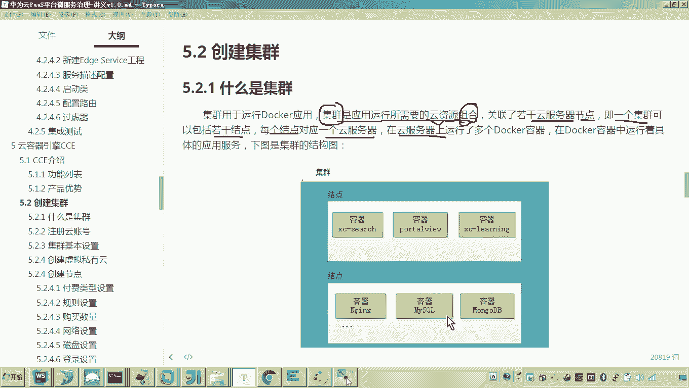

好，那么哎我们说对集群的概念呢有一个哎简单的了解了。好，那么在默认情况下呢，其实每个用户最多哎只能创建5个集群。啊，你说我我还想创建更多的集群怎么办呢？那你得给这个华为客服呢去申请了。😊。

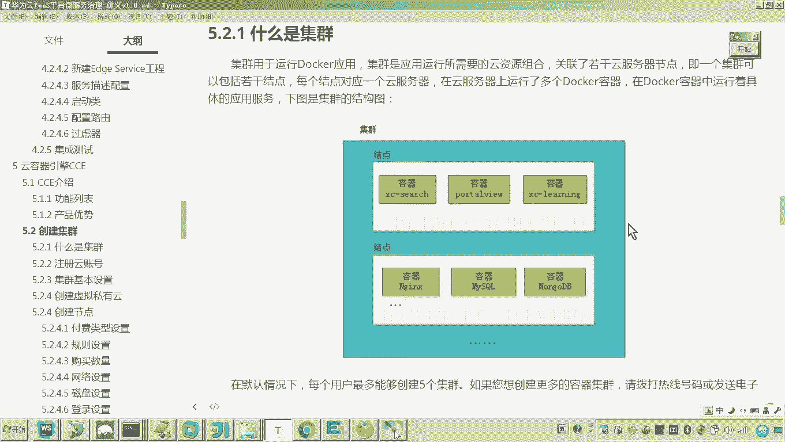

那有说老师这个才才才才中间5个集群太少了吧，对吧？那其实各位你要你要了解一个事儿啊，就这个集群里边是不是可以包括很多节点，也就是说可以包括很多服务器，对吧？

那你说我是不是可以把我们的应用不都部署在这一个集群当中的这若干个服务器上。所以说其实各位我们用一个集群，包括若干服务器。那这服务器上我们就可以跑我们的若干应用，对吧？哎，所以说这个集群的数量呢。

其实不用再不用太多。😊。

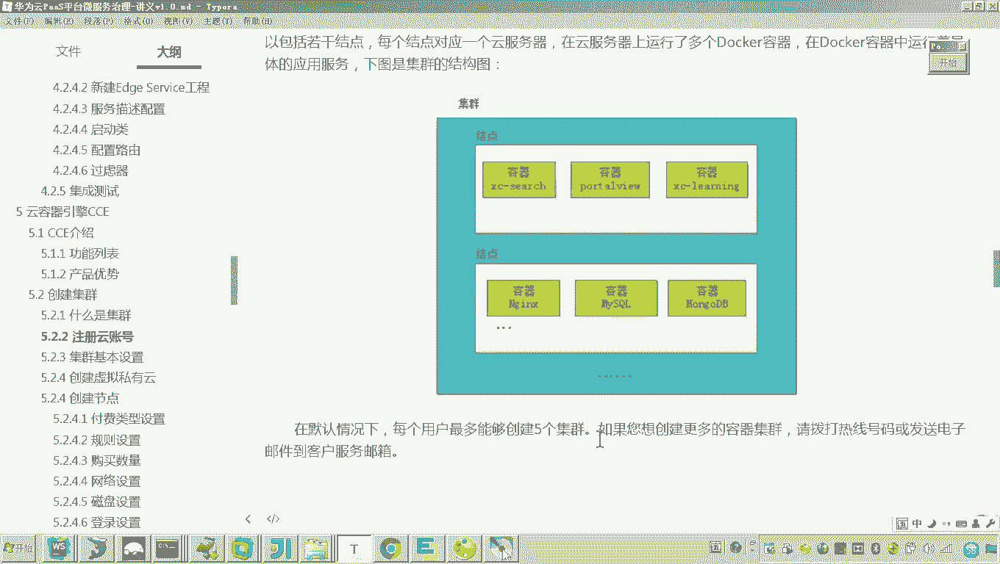

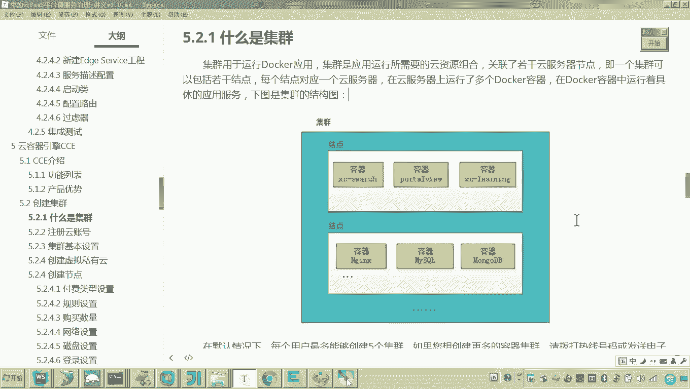

好了，那我把这个集群呢给大家介绍完了之后呢，哎我这样弄，咱们呢就按照咱们看到这个讲义的这个步骤呀，我们来创建一个集群。😊。

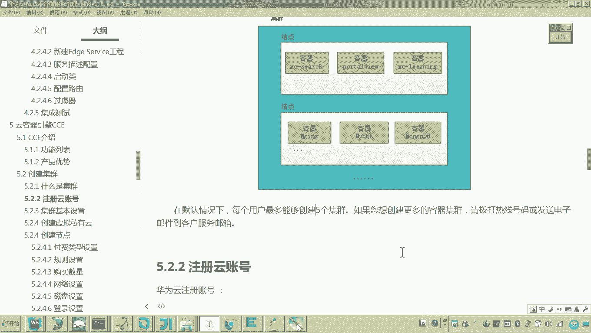

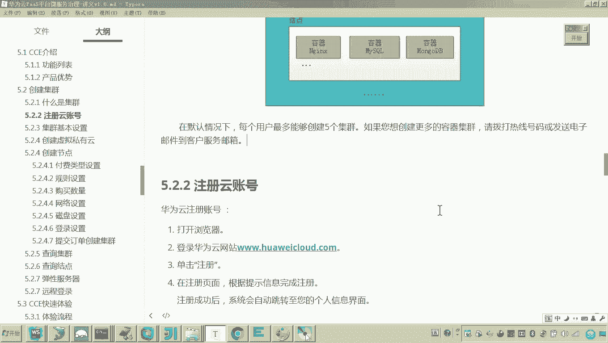

哎，我们体验一下，哎，在第一方面是体验一下这个创建集群的过程。啊，第二方面呢，我们是为后边啊我们要讲这个CCE的这个部署啊，把我们这个学生在线是不是要部署到CCE平台呀？所以啊我们呢对后边做一个准备啊。

好，那现在呢我们就开始创建吧。第一步，我们要在云上创建集群。那你是不是首先要注册一个云账号呀？好，那打开浏览器来输入华为云的这个网址，然后进行注册。那这个注册的过程呢，在早期哎我讲解CSE的时候。

是不是就我们已经有账号了吧？所以现在我们登上这个账号就可以了。😊。

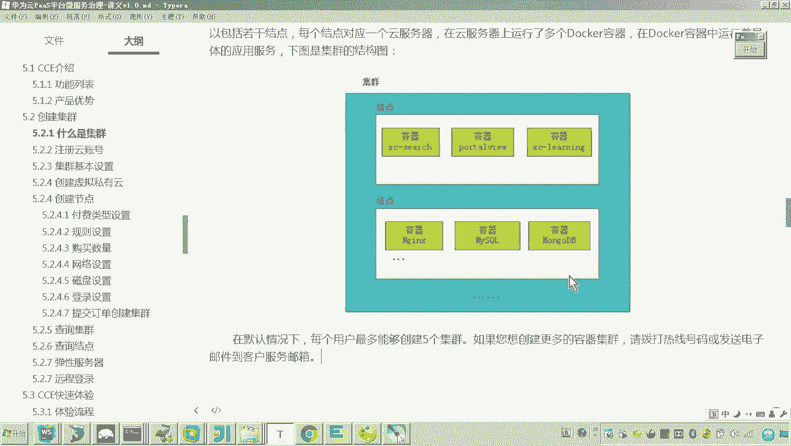

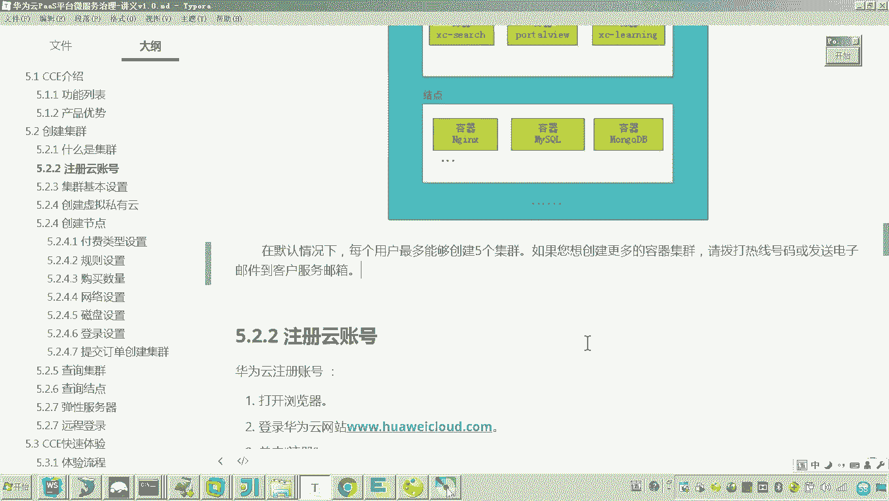

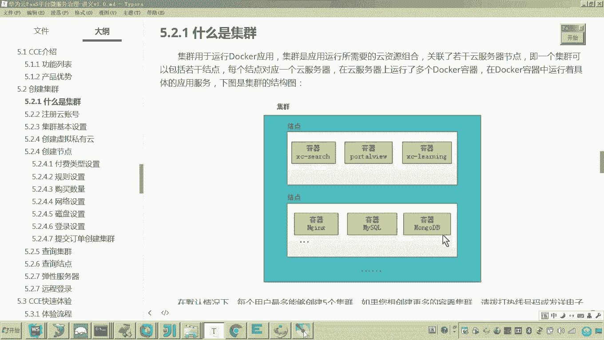

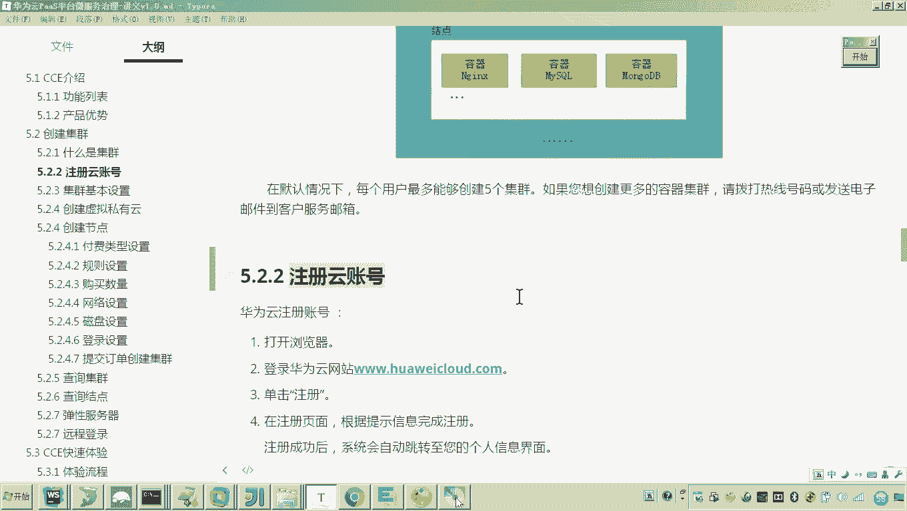

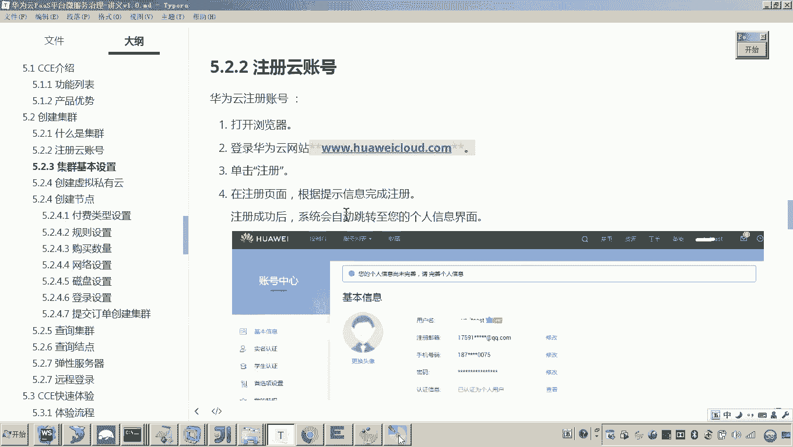

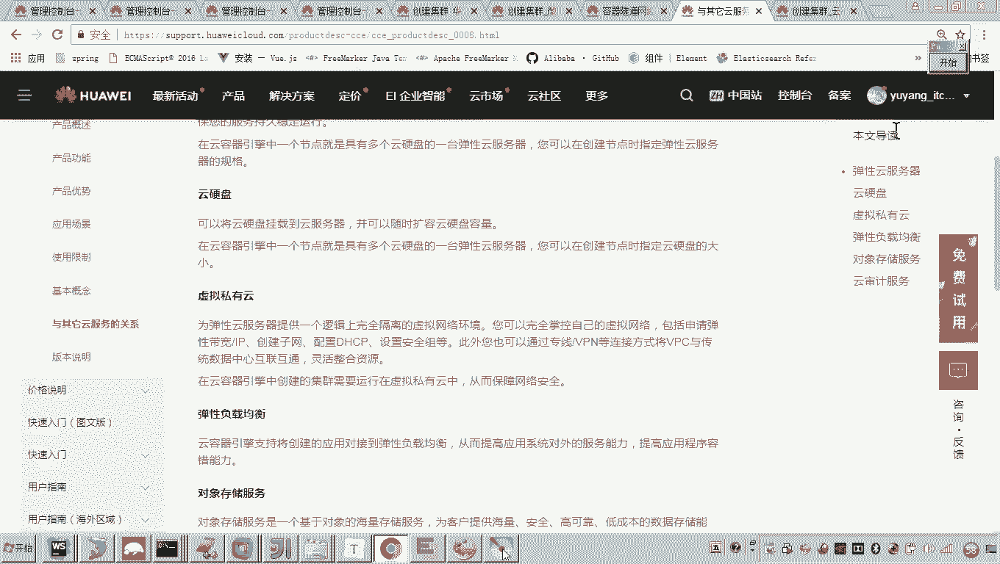

那这个大号账号我登录上去之后，接下来干什么呢？其实大家可以看到它是不是有一个服务列表，对吧？它有这么多服务，其实你现在在做的一件事呢，就是要进行什么云容器引擎CCE集群的创建。

所以这里边呢我们点云容器引擎CCE是不是就来到了这个操作界面，可以看到，对吧？而在这个界面当中，各位这里边有一个资源总览这么一块。那么这里边就是你所创建当前所创建的啊集群，还有包括的节点等等。

还有工作负载。什么。😊。

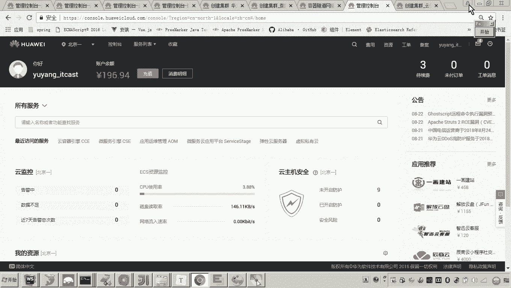

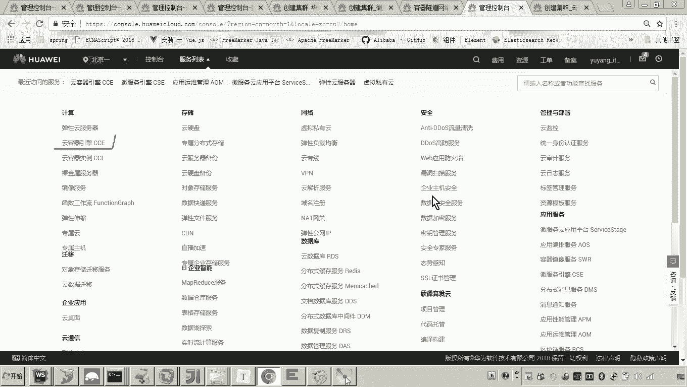

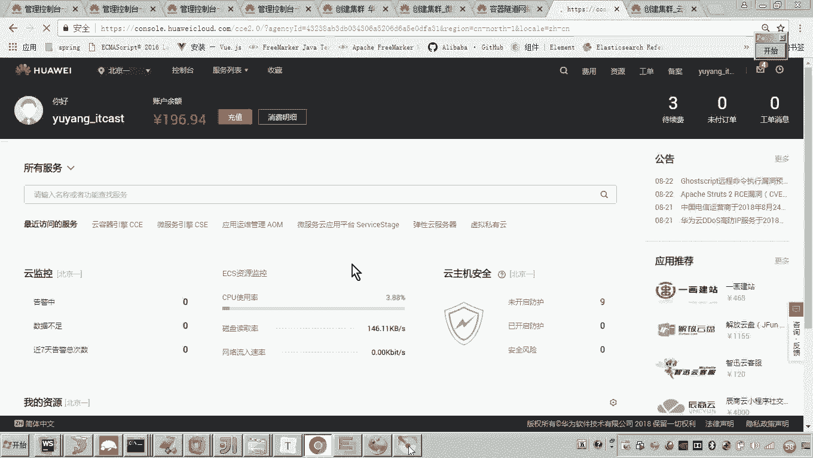

现在我呢想带着大家呢再创建一个集群。好，那么我们在这个界面上边下一步我们就要干嘛呢？来创建集群了。好，那怎么创建集群呢？首先各位。😊。

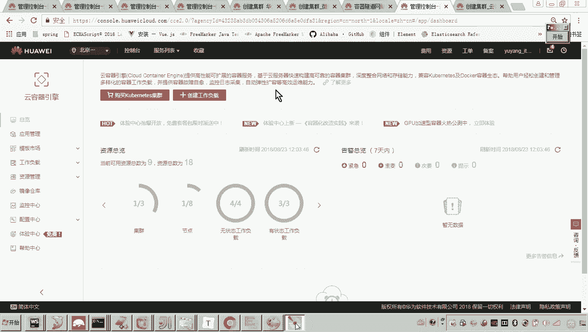

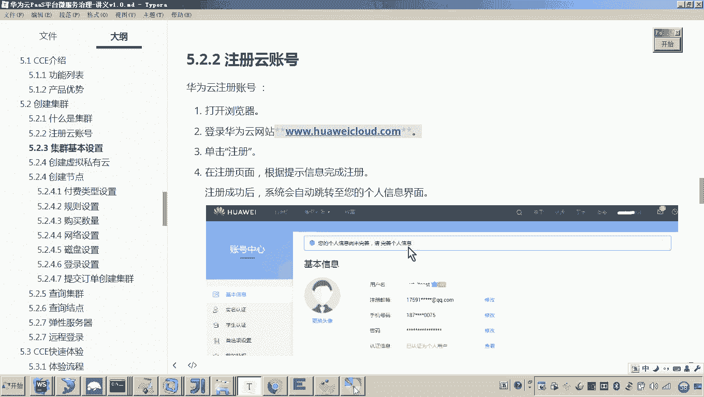

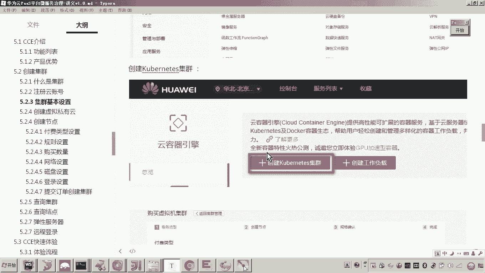

在这个最上边是不是有一个啊按钮叫做购买kuer呃cobernet集群呢？哎，那就说老师怎么还购买呢？没错，因为你在创建集群的时候呀，是不是就要申请节点呀？因为一个集群你至少是不得包括一个服务器节点呀？

😊，那你要要要要干嘛？要要包括这个服务器的话，那你是不是就要去购买呀？哎，那有人说老师是不是还得掏钱呀？那那掏钱算了，那我我我我就不练习了。那不是啊大家来看我给你创建完了之后。

你会发现啊这个我们这个掏这个这个金额呢是非常少的啊，甚至呢有些体验性的功能呢是完全不收费的我的目的只有一个哎，我们学会这个云平台云容器引擎CCE的这个部署的方法。好。

那现在我们先来点购买net集群这里边是不是就打开一个界面呢？啊，好，这里边呢看看计费方式啊。哎，那我我说我这个土豪哎，我这个是不是就可以包年了这一年是1000多块钱是吧？

有说老师我这个就是就是纯粹的练习嘛，啊我就不包你了，练习就是怎么弄啊？我测试了，我把服务器开开，我不测试，我就关了。好，那叫按需计费啊，你看这按需计费，你看。😊。

里面是集群管理费用免费嗯控制节点费用1小时2块多。所以一小时2块多是不是也挺贵啊？当然不是啊，你这个不用了，是不是把服务器关掉，是不是就不用再收费掏钱了吧？所以这里边我们选择按需计费。集群名称呢。

我们给它起一个名。哎，我们现在我们就以这个学生在线的名字命名吧。好，这里边呢我就在后边加1个02好，那这个版本呢，这里边net的版本我们默认就是1。9。7嗯。

这个集群的规模我们说这个集群最多可以创建多少节点呢？哎，50个节点，我们就够了。哎，50台这个云服务器高可用，我们选择否哎，如果你选择是的话，各位呃，那你首先来看这个配置费用是不是就有了。哎。

其次呢这个我们做测试啊，也不用高可用。😊，好，那现在我们还有一个叫虚拟私有云。看见这里边吗？因为你创建完这个集群之后，那你集群这个服务器呢，是不是之间要进行什么网络通信，对吧？

所以这里边呢哎我们就需要创建一个私有的这个云环境啊，也就是我们的这个网络环境好，这里边大家可以看到默认我这个里边是不是有很多呀？那如果说你这个哎刚开始这里边没有的话，你就点创建私有云打开。😊。

打开这个创建私有云之后呢，这里边你看有几个区域啊，有几个区域呃，有这个华北北京一、大连呃上海，还有广州。那么呃我们那你根据你的这个什么呀，你的这个位置吧。呃。

然后呢访问你要是你要是华北地区北京这一块的用户呢，那你就选择这个北京一华北这个区域的。然后这样的话，我们这个网速呢会稍微快一些。好，然后这个名称呢就给你这个私有云起个名就可以了。哎。

网段这里边呢我们是呃不用改的，这里边有一个建接的网段是吧？好，然后呢这些就不用写了。啊，然后这个子网的配置呢，这里边可用区呃，2呃，可用区一，这里边你选择哪一个都可以。好，将来呢我们去创建集群的时候呢。

默认这个服务器的这个子网的区域的，哎就会加到这个可用区二或可用区一当中了。好，那这样的话，我们去点击立即创建，是不是就把这个子网呢就创建好了，是吧？好，那么这个子网我们创建嗯，比如我这个叫EDU。😊。

啊，02，然后我们把这个指网创建一下。😊，哎，这是我们的这个私这个私有云的啊，然后呢，点击立即创建。😊。

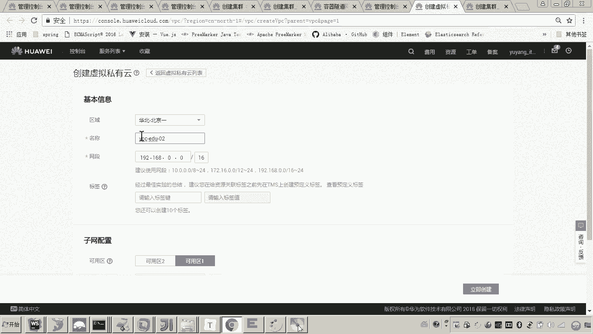

好，配额不足啊，我这个已经已经用了5个了是吧？好，那这里边呢我就不再创建了，不再创建的话，我就用以前的这个私有云了啊。好，那么以前私有云呢，我这里边就选择，然后选择这个子网，就是刚才你创建私有云的时候。

那个网络的那个什么那个配置。各位可以看到上面是一个私有云，下边是个子网的配置，对吧？好，创建完了之后，各位我们这里边是不是有一个网络模型啊。

网络模型这里边因为我们呃最终哎我们选择你看第二个是不同选一个私有云，只能创建一个VPC网络。而现在我们可以默认第一个叫容器随道网络。😊。

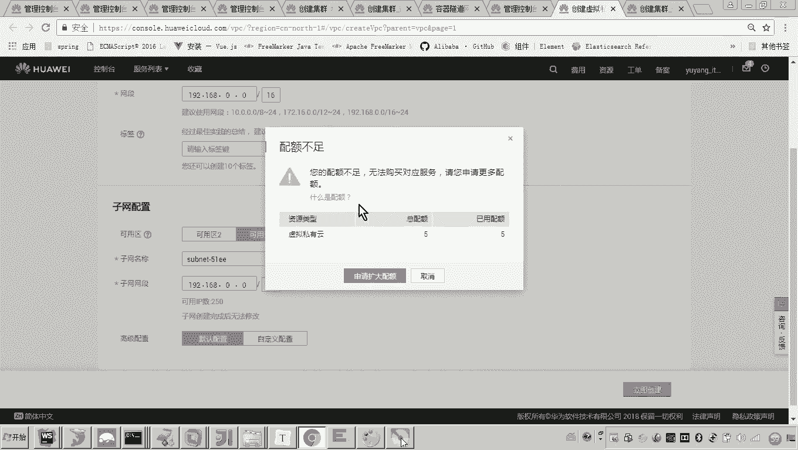

好，那这个容器随道网络默认当前支持的是什么呀？s有这个s透有有两种操作系统啊，我们用第二种啊，s透S7就可以了。好，这个熔断的默认不能改，还是这样一个熔断。😊，好，然后呢这个后边呢就是服务的转发模式啊。

服务的转发模式啊，这里边呢这个呃我们可以默认选第一个就可以了。哎，然后呢，你这个不太理解的话，呃，一般来说我们默认，然后呃就可以。好，后边呢呃叫什么呀？呃认证的方式默认啊，然后就没有了。

这个是不是有一个集群的描述呀，我们可以说这里边用于这个学程在线它这个项目的部署。😊，对吧？好，这样的话我们来看到啊，我们这个配置费用是不是现在还没有产生费用，对吧？然后现在我们就下一步。😊，好。

那么到这一步的话，各位我们是不是就开始来创建节点了？啊，因为一个集群嘛，至少是不是得包括一个节点呀？好，那这边创建节点是啊付费类型还是按需当前区域啊，选这个区域，然后可用区啊，我们用这个呃在同一地区下。

你可以简单看一下，说这个电力网络隔离的物理区可用区之间的内网互通啊，我们选择第一个记得这个名字。好，那这个节点名称呢，它默认给你的一个序号是吧？你也可以在后边去干嘛呀，去自己加一个序号。嗯，然后呢。

这个节点的什么规格，对吧？然后这就是你服务器的配置了。😊。

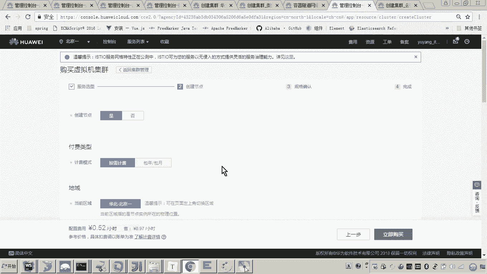

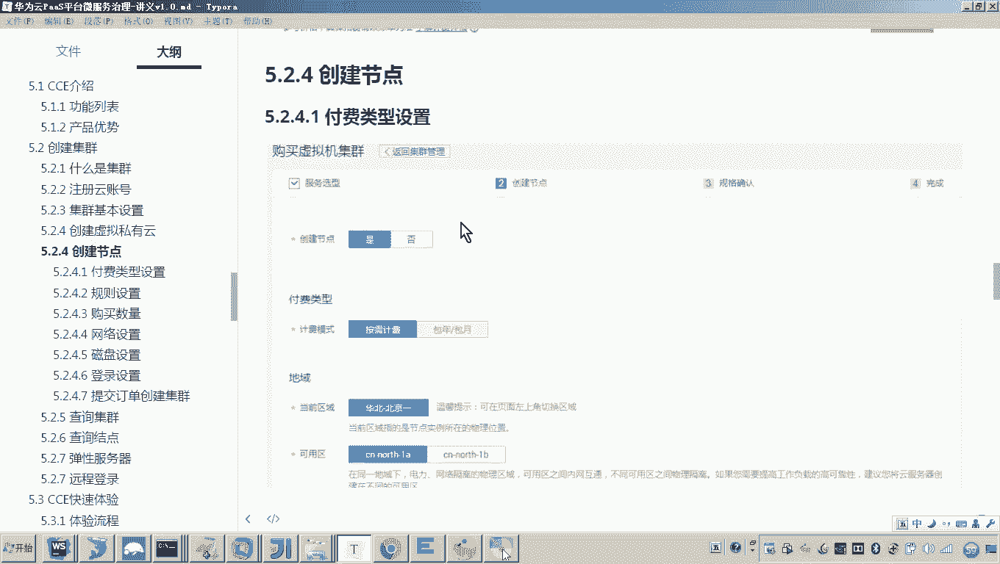

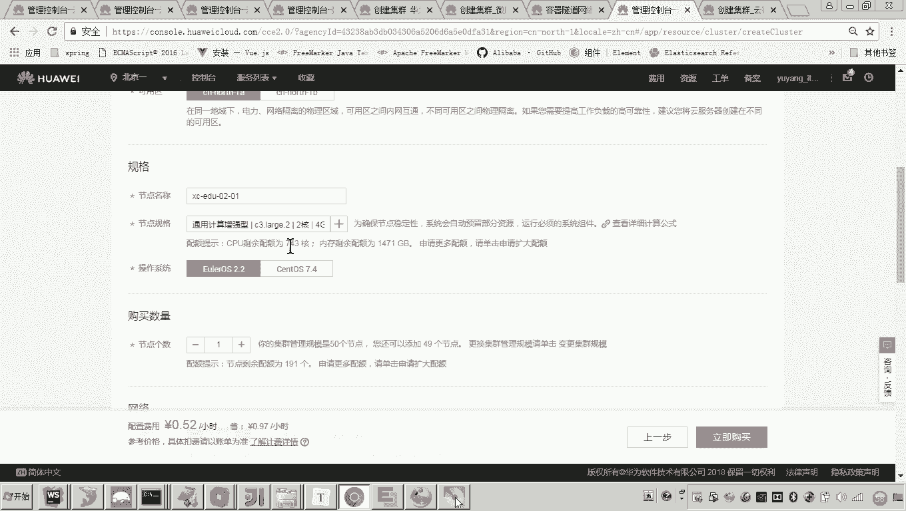

那你这个服务器的配置选哪个呀？有人说老师选个最最便宜的吧，选个这个两核4G的那你注意啊，因为我们是不是要做微服务开发，那上边我是要部署很多的这个容器啊，所以这个CPU的这个盒呢，你至少给我选8核。嗯。

好，然后呢选8核内存有就说选多少呢？呃，内存呃你给我选这个16个G就可以了。我们选这个。😊。

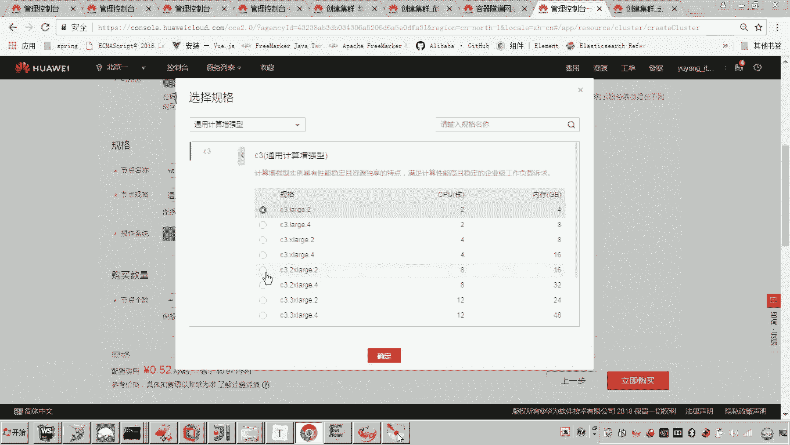

好，那点击确定。😡，那这里边呢我们来看选择操作系统sOS7。4购买的数量，我们先先购买一个节点啊，不用买那么多。然后呢，这里边呃弹性IP因为你这个云服务器买了之后。

你可能是为了管理方面是不是要公网去访问它，对吧？所以呢这个弹性IP一定是要购买的，嗯，要购买的。然后呢，购买的数量就是一个。嗯，然后采用这种全动态BGP的这种方式啊，不要用静态的啊。

用用用动态的这种方式，然后按带宽按流量计费。那我们选择按流量计费吧。其实这个就类似于什么呀？就是按需计费，是不是啊？然后呢，我们选择几兆呀，啊，往往往服务器上可能扫不了，会传个文件嘛，我们选择5兆。

我觉得就足够了。然后那个硬盘呢默认啊就可以。😊，好，那后边一种就是不就登录方式啊，你是这个登录这个云服务器，是采用这种密码的方式，还是密钥对啊。那这里边其实你要是密码的方式。

这里边你设置你的密码就可以了。那我建议你采用密钥对，嗯，建议采用密钥对。好，那这个密钥对，这里边呢，各位呃，你你你这里边就是你以前创建的密钥对啊。你说现在我我没有密钥对啊，我我想干嘛呀？

再创建一个行不行？你肯定是刚开始没有嘛？空的那我就再创建一个密钥对。😊。

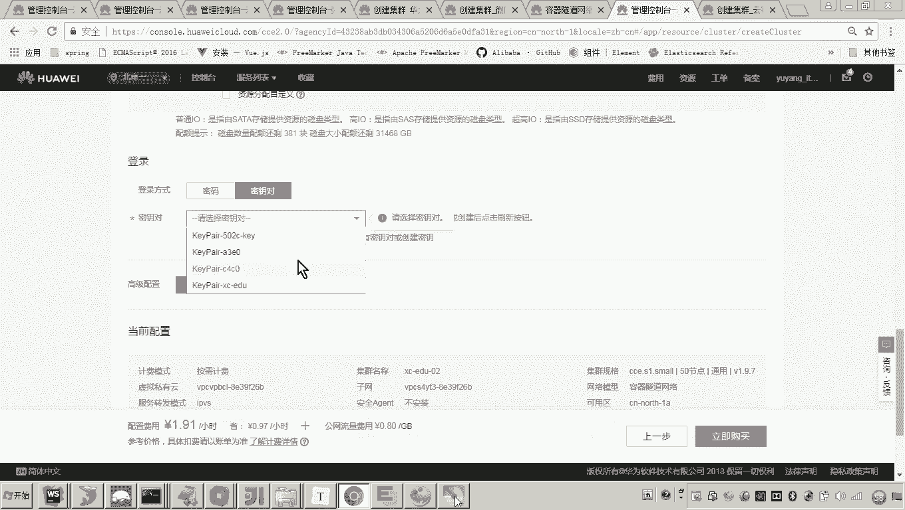

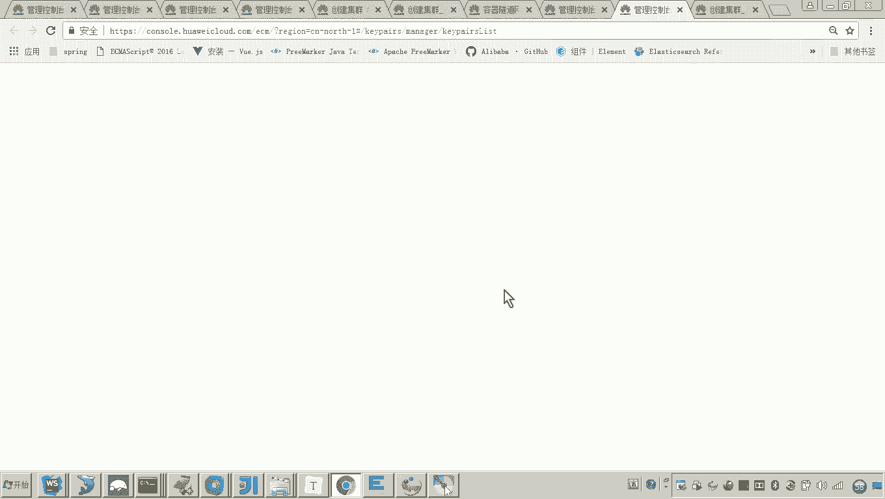

创一个妙度的话，这里边我们就可以呃写上哎叫XC。😊，杠IEDU02。好，这就是我创建的描对。😊。

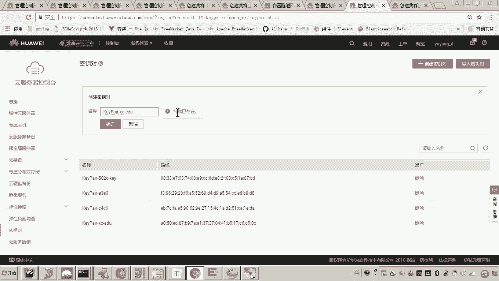

对，可以看一下啊，我这个密钥都是创建成功之后，是不是已经把这个文件保存在了我这个本地了，对吧？所以啊在这里你要刷新一下，把你刚才的那个创建的选中。😊。

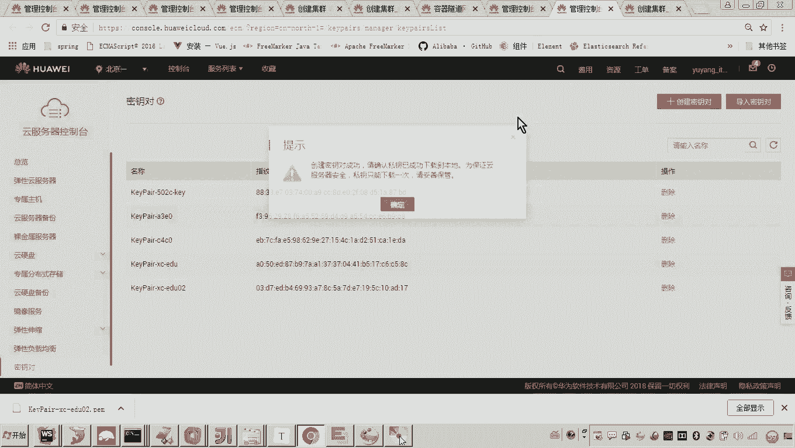

啊，并且人家说你确定已经获取这个密钥文件了吗？😡，有说老师这个密钥文件有啥用呢？这个密钥文件就是一会儿你在登录的时候要干嘛呀？要用这个SSH客户端要引入啊，要要引用这个文件。😊，好，一会儿我给你演示。

好，然后呢这样的话我们说高级配置我们暂时先不用配这儿我们就完成了什么呀？节点的创建。回顾一下啊。首先选择啊是付费的类型啊，地域可用区域啊，然后啊规格。😊。

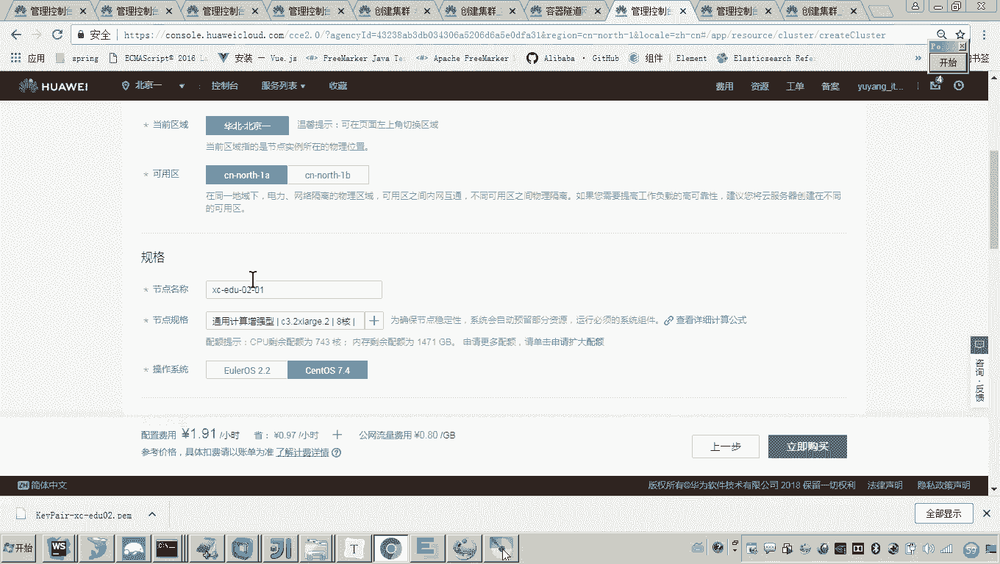

节点呢我们呃推荐用8核16G。

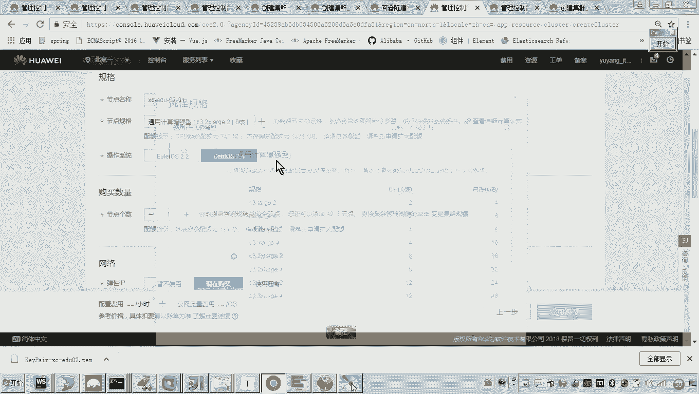

好，然后呢，操作系统节点的数量。网络现在购买弹性IP一会儿我们它就会自动给我们一个公网IP啊，我们可以通过公网IP来访问我们的这个弹性呃弹性这个服务器。😊，好，然后呢规格啊计费的方式好，这样没有问题呢。

我们就点击立即购买。😊，啊，确定嗯确保啊把这个勾上。走。好，这样的话，他是不是就是说哎你再确认一下有没有问题，没有问题，我就提交了啊。好，一提交。各位可以看一下。这样的话，我们这个集群呢就准备创建嗯。

大家可以看到这个这个这个集群的创建过程当中呢，可能会需要几分钟啊，6到10分钟。嗯，大概是这样一个情况。好，那么在刚才的这个课程当中，我是不是给大家讲了这个创建节点创建集群集群的信息的基本设置。

包括创建节点啊，然后在创建节点的时候呢，包括付费的类型规则，购买的数量，网络设置磁盘的设置，还有登录的设置，登录我们是不是采用密标对方式，对吧？好，然后现在我们提交集群啊，提交集群创建。好。

那么这个呢我们就等着啊稍后呢我们创建成功之后呢，哎，我们来查询一下这个集群的相关信息。好。😊。

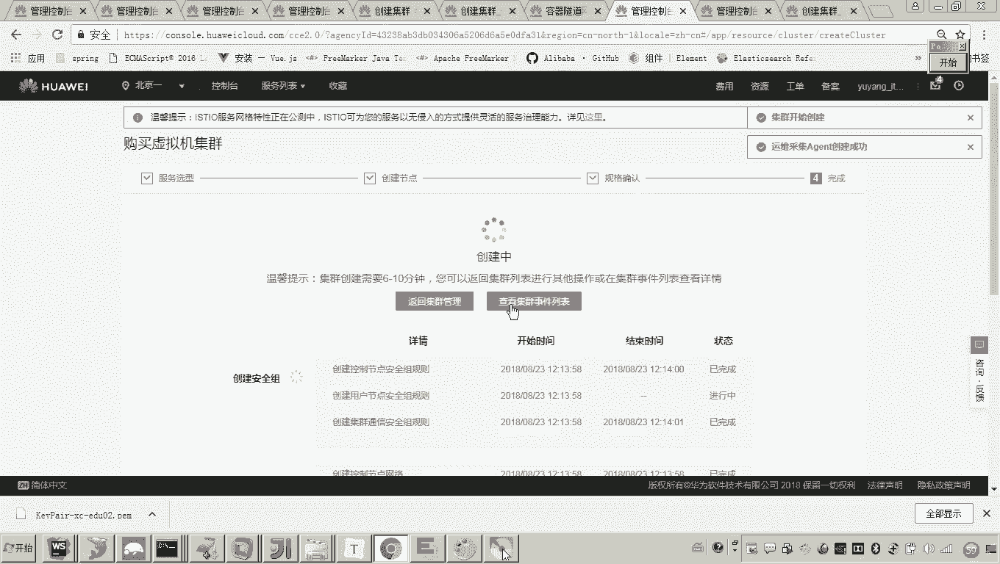

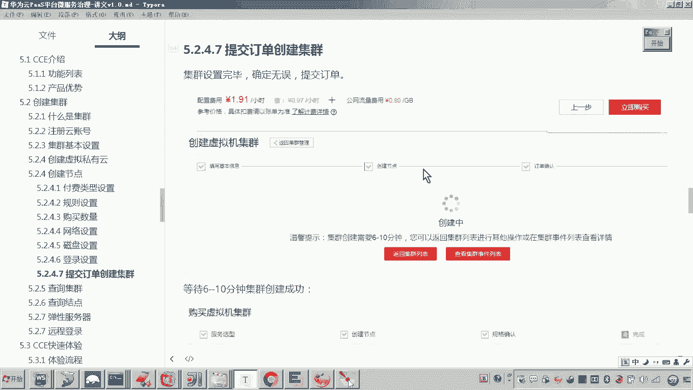