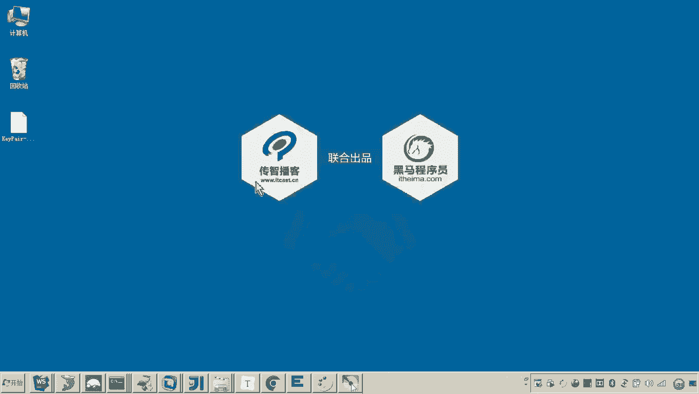

# 华为云PaaS微服务治理技术 - P101：09-云容器引擎CCE-创建集群-查询集群和远程登录 - 开源之家 - BV1wm4y1M7m5

好，那么我们现在看到一下这个集群呢，是不是就已经创建成功了，对吧？好，那么集群创建成功呢，我们现在来看啊，怎么样来查询一下集群呢？啊，还是进到这个服务列表，然后呢，云容器引擎啊CCE。😊，好。

然后呢点击大家可以看到这个界面呢呃在这一块是不是就显示了我们说的所有的集群，对吧？然后呢，再点一下这个集群，各位那就来到了哎来到了我们看到的刚才咱们所创建的这个XCEDU02这个集群。😊，好。

那么这个集群呢大家看到呃大概的情况呢，你应该能看到说计费模式是按需计费docker的版本，还有集群的版本。啊，然后呢各位呃这个节点是不是已经创建成功了，一个节点。嗯。

然后这个节点的呃这个节点的这个配置呢是8核CPU16G内存。好。这个集群创建成功之后呢，我们来看一下啊，首先来看一下怎么来查询这个节点呢啊，那么你在这个嗯在这个界面呢啊这里边你点击这个节点。

或者说哎在这个左侧这里头啊，然后这儿是不是有一个下拉条啊，那你点击这个下拉条，是不是就来到了这么一些嗯菜单呢那第二个菜单叫节点管理。😊，那么这里边各位可以看到是不是就列出了啊一个节点呀？哎。

这个节点的名称是不是刚才我起的那个名啊，它默认是不是后边给你一个自动的序号，我不是改成01了，对吧？还有印象哦。好，那这这里边这个节点的状态，是不是就是可用啊，然后规格8核16G。

然后嗯这个这个这个私有的IP啊，这个这个是它的这个内网的IP不用管啊，这大家看这个IP弹性IP地址，这是不是就是一个公网IP呀。😊。

对，那公网IP各位，我肯定在我的这个本地是不是就应该就可以拼得通啊？我们可以看一下啊，我拼一下。😊。

M。😊，还是有问题的。他这个聘应该是不让我聘，对吧嗯。那这个这个现在这个公网的这个IP地址是不是无法拼通啊？也就是说这个服务器现在从我的这个本地是不是连不上。哎，那好了，那那怎么回事，那怎么去处理呢？

好，那这里边呢各位他专门哎你要想管理这个服务器啊，他专门有一个呃这个菜单，哎，有一个菜单，哎，叫做弹性云服务器。😊，也就是在这个云容器引擎CCE的上面是不是有一个叫弹性云容器啊，弹性云服务器啊？😊。

然后这个弹性云服务器，各位我们来看在这儿。这个是不是就是我们说的那个。这个这个节这个服务器的这个节点名称了。嗯，然后这个就配置，各位可以看到是吧？好。😊。

那各位来看一下，这里边旁边是不是有一个按钮叫远程登录啊。😊。

啊，然后各位可以看一下，现在我是不是通过他这个按，他这个这个这个这个界面是不是就已经登上去了？😊，嗯，还没还没有起起来啊，等一会儿的，你看他的这个日志。

大家可以看到这些服务器启动的日志现在还没有完全起起来啊，这个需要我们稍微等一小会儿啊，等一会儿。😊。

好，那么在这个弹性云服务器这里边呢，哎我们来看一下这个菜单啊，点击嗯好，这里边有一些这个状态啊，然后包括我们刚才的一些配置啊，都在这里了嗯。😊，好了，那我们稍微等一下啊。

如果这这个这个服务器嗯可以去可以拼得通的话，我们一会儿呢啊我们准备登录进去哎。

好，在这放着。好，那么呃我们来看啊，那接下来的话，一会儿稍微他他如果一会儿拼得通的话，呃，这个服务器起来的话，那么我们就准备远程登录了。嗯，好，那这个远程登录怎么登录呢？大家还有印象。

刚才我们说这个在采用登录的密钥对的时候，呃，老师是不是在这个我的这个本地呢下载了一份它的这个密钥文件，有印象吧？啊，那这个密钥文件有如说老师那那这个密钥文件怎么用呢？各位。

那现在我要打开咱们的这个SSH的客户端。那我们准备来准备登录这个服务器啊，登录这个服务器。😊。

好，那登录这个服务器的话，我们呃首先新建一个连接。

新建一个连接，然后他这个IP地址。哦，注意了啊，IP地址。因为我这个好多这个XCDU注意注意这个名字啊，别弄错了，就是这个这是我们新建的这个节点是吧？😊，复制一下这个IP，然后呢把它贴进去贴到这儿。

然后主机啊端口默认就是22好。😊，我们连接。嗯，然后我们接受并保存。好，输入root。好，这个密码呢注意啊这个密码呀，你不要选择上边这个输入这个密码啊，你选择下边这个选择下边这个呢，你浏览哎。

浏览浏览浏览哪个呢啊，浏览这个我桌面上刚刚下载的这个密钥文件。😊，看见了吧？然后确定各位这是不是就登进去了？😊。

那大家可以看到啊呃这就是大概的这个这个这个服务器这个服务器啊，然后它的这个内网的IP可以看到是不是叫1921681。212，对吧？嗯，然后呢呃它的公网IP记的这个IP地址好。

然后呢你也可以看一下它的这个什么呀？它的配置啊，那这个配置呢？它是不是我们看到的这个CPU是不是就是8核，对吧？嗯，然后呢这个呃内存的这个配置呢？嗯，大家可以看到呃，这个内存的配置在哪里啊？

是不是就是16个G看见吗？哎啊，基本上这个服务器呢，现在我们是不是就可以登录上去。😊。

然后这个P呢应该是他禁用。嗯，他这个在这个他的防火枪已经把这个P给禁用了。所以现在我们用SSH的这个呃客户端工具，通过22端口，是不是就可以登录我们看到的这个服务器啊？😊，好。

那么到这儿我们是不是就已经完成了啊这个集群的创建，并且呢我们也从这个我们的客户端，我们的本地啊是不是远程登陆到了我们的这个服务器啊？

好。