# 华为云PaaS微服务治理技术 - P101：09-云容器引擎CCE-创建集群-查询集群和远程登录 🚀

在本节课中，我们将学习如何查询已创建的华为云CCE集群，并掌握通过SSH客户端远程登录到集群节点的具体方法。

## 概述

上一节我们介绍了如何在华为云CCE中创建集群。本节中我们来看看如何确认集群创建成功，并学习查询集群信息以及远程登录到集群节点的完整流程。

## 查询已创建的集群

集群创建成功后，需要进入控制台进行查看和确认。

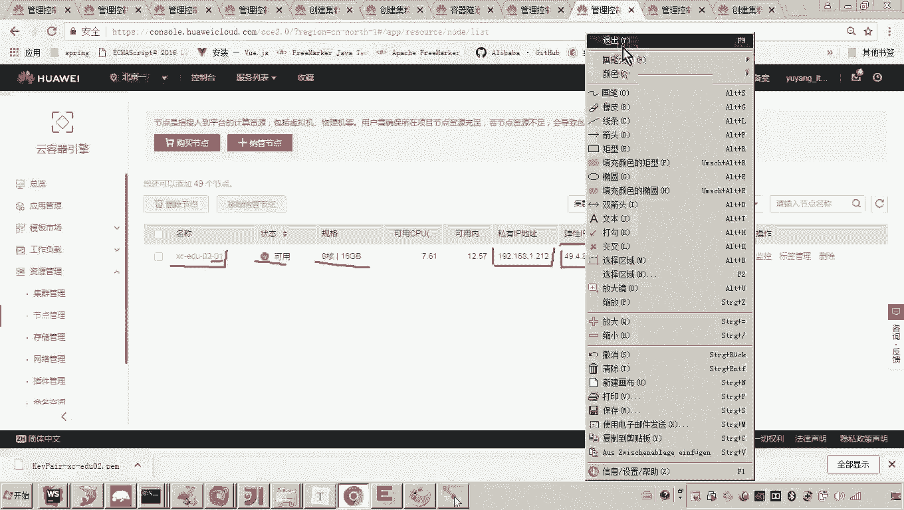

以下是查询集群的步骤：

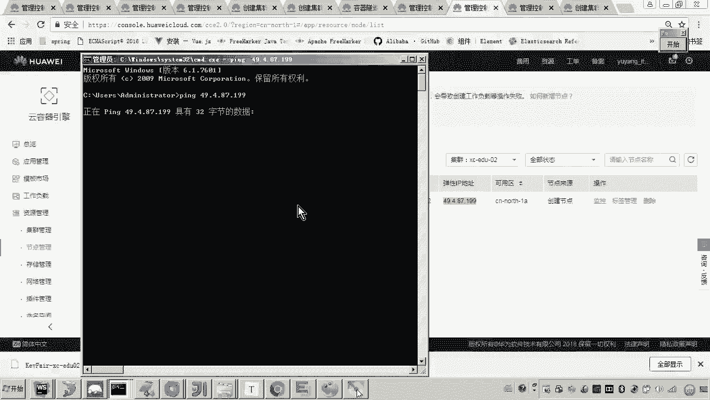

1.  登录华为云控制台，进入服务列表。
2.  在服务列表中找到并点击“云容器引擎 CCE”。
3.  进入CCE控制台后，主界面会显示所有已创建的集群列表。
4.  点击目标集群的名称（例如 `XCEDU02`），即可进入该集群的详情页面。

在集群详情页面，可以查看集群的基本信息，例如：
*   **计费模式**：如按需计费。
*   **Docker版本**：集群使用的Docker引擎版本。
*   **集群版本**：Kubernetes的版本号。
*   **节点数量**：显示已成功创建的节点数（例如1个节点）。
*   **节点配置**：例如 `8核CPU`， `16G内存`。

## 查看与管理集群节点

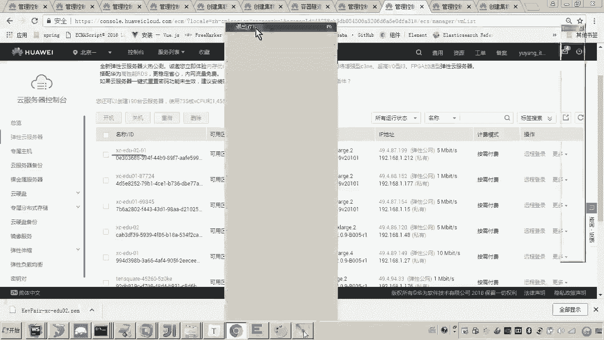

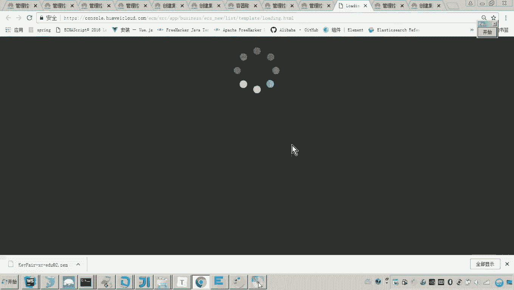

在集群详情页面，可以进一步管理集群中的节点。

以下是查看节点信息的步骤：

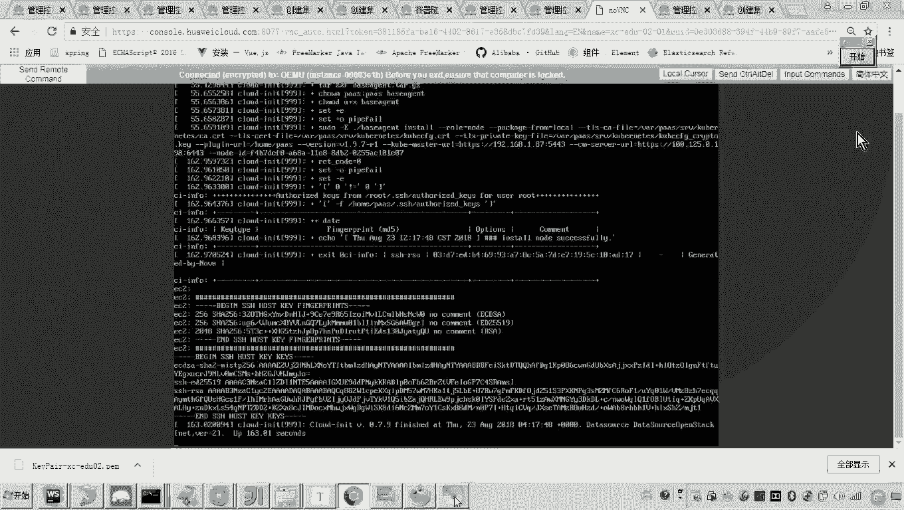

1.  在集群详情页，点击左侧导航栏的下拉菜单。
2.  在菜单中找到并点击“节点管理”。
3.  “节点管理”页面会列出该集群下的所有节点。

节点信息通常包括：
*   **节点名称**：创建时指定的名称（例如 `XCEDU02-01`）。
*   **状态**：显示节点的运行状态（例如“可用”）。
*   **规格**：节点的资源配置（例如 `8核16G`）。
*   **私有IP**：节点的内网IP地址。
*   **弹性IP**：节点的公网IP地址，用于从互联网访问。

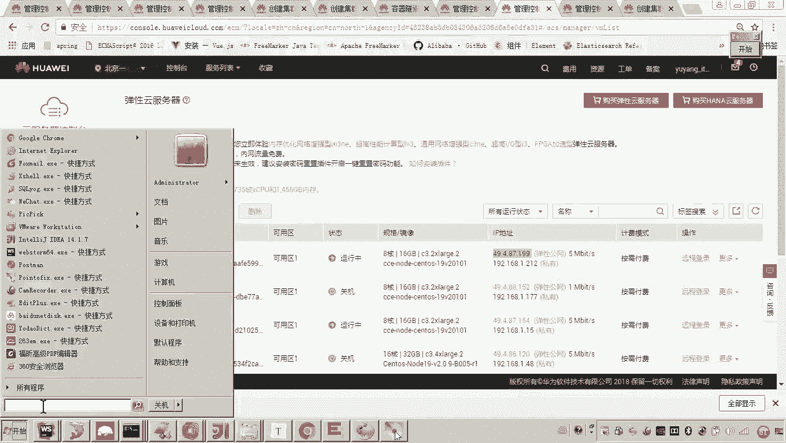

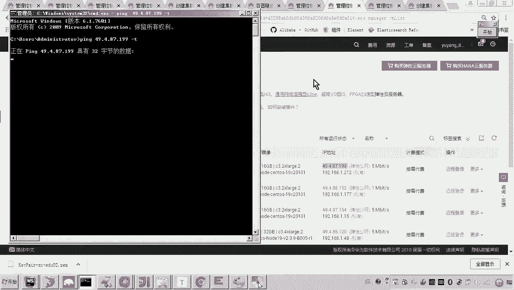

**注意**：有时从本地网络直接 `ping` 节点的公网IP可能无法连通，这是因为云服务器的安全组或防火墙默认禁用了ICMP协议（`ping` 所使用的协议）。这并不影响后续通过SSH进行登录。

## 通过弹性云服务器控制台登录

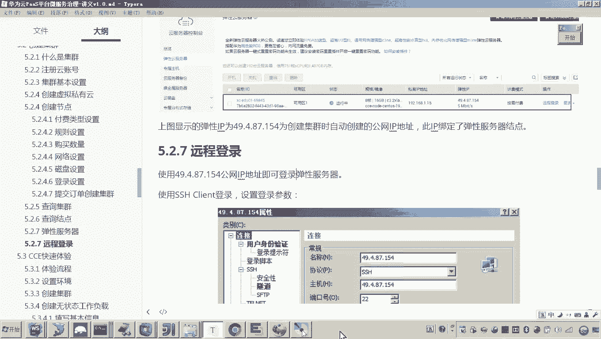

若需通过Web控制台直接操作服务器，可以使用“弹性云服务器”功能。

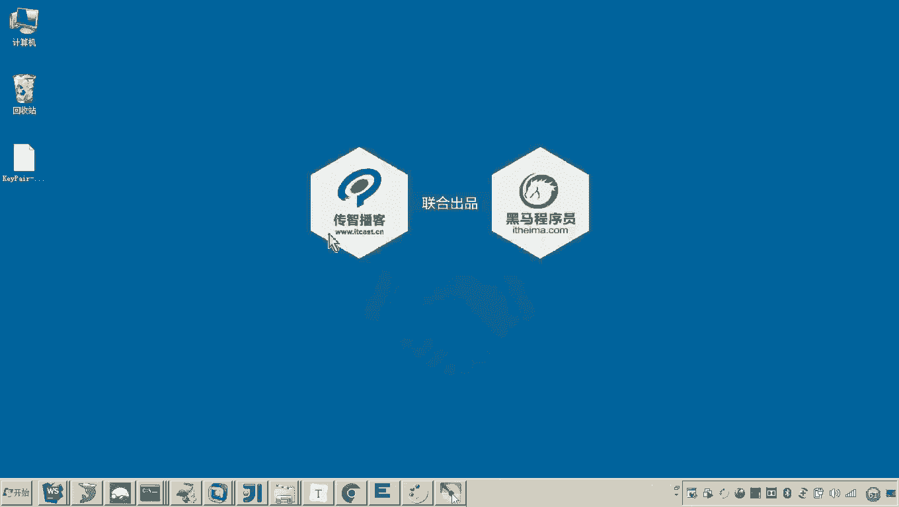

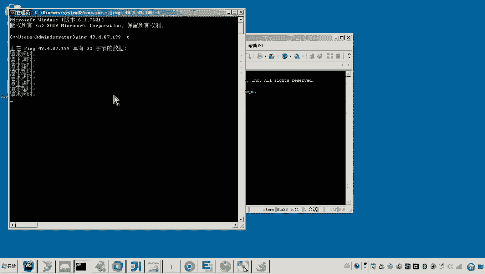

以下是操作步骤：

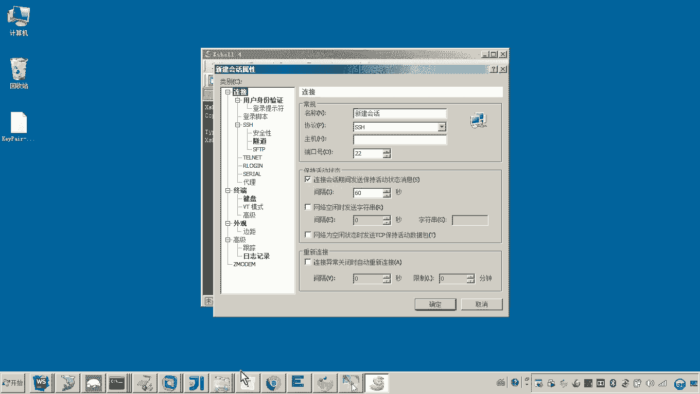

1.  在华为云控制台顶部的服务列表中，找到并进入“弹性云服务器 ECS”。
2.  在ECS实例列表中，找到对应CCE集群节点的服务器（名称通常与节点名相关）。
3.  点击该实例右侧的“远程登录”按钮。
4.  系统会弹出一个基于浏览器的VNC登录窗口，等待服务器启动完成即可进行操作。

这种方式适合进行紧急查看或初始化配置，但通常不如SSH客户端灵活。

## 使用SSH客户端远程登录

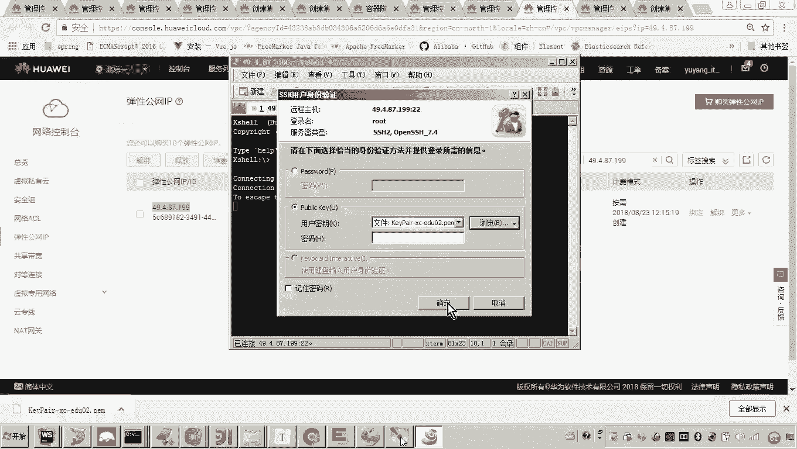

更常见的远程管理方式是通过SSH客户端（如Xshell、SecureCRT、Termius等）进行登录。这需要用到创建集群时下载的密钥对文件。

以下是使用SSH密钥登录的步骤：

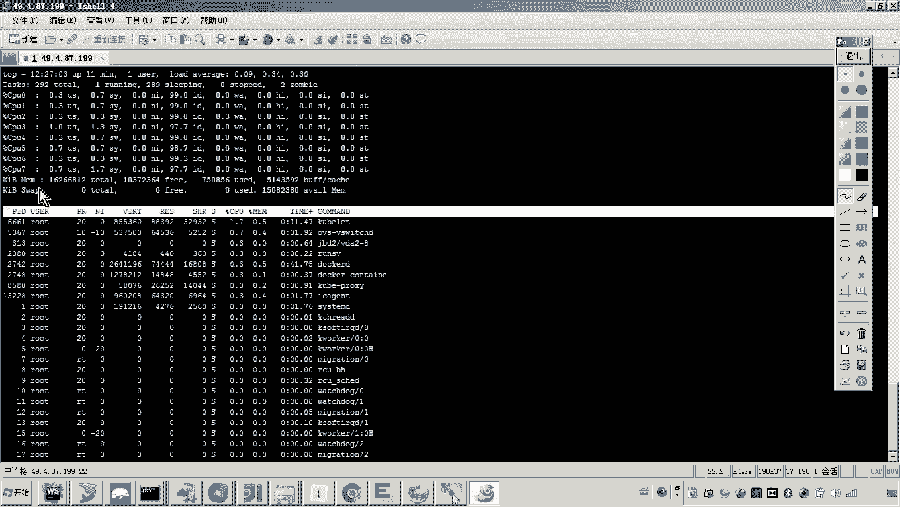

1.  打开本地SSH客户端工具，创建一个新连接。
2.  在连接设置中，填入以下信息：
    *   **主机**：节点的公网IP地址（弹性IP）。
    *   **端口**：`22`（SSH默认端口）。
3.  身份验证方法选择“Public Key”或“密钥”。
4.  在密钥路径设置中，浏览并选择之前下载的 `.pem` 格式密钥文件。
5.  连接时，用户名输入 `root`。
6.  发起连接，即可成功登录到云服务器。

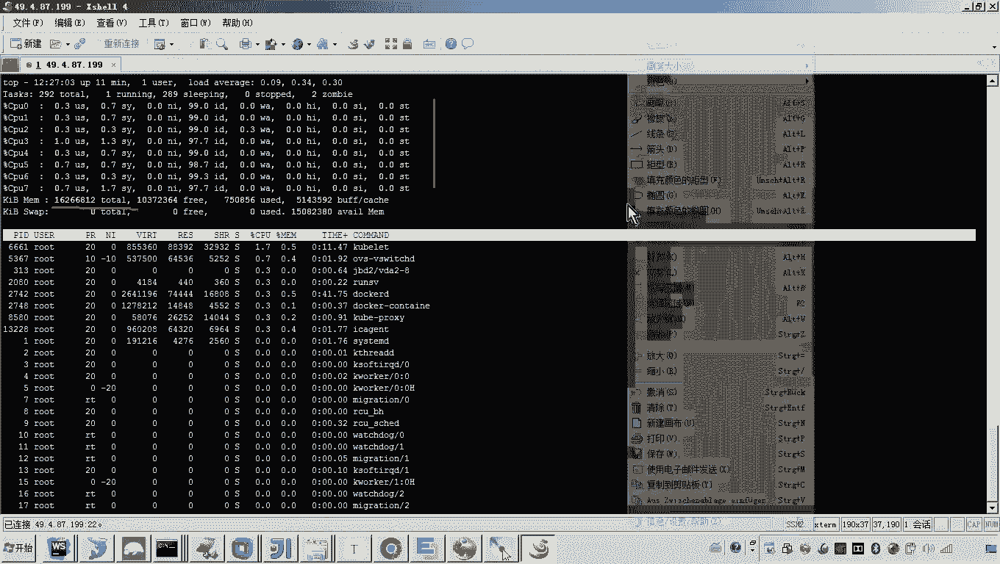

登录成功后，你可以在终端执行命令来验证服务器配置，例如：
*   使用 `cat /proc/cpuinfo | grep “processor” | wc -l` 查看CPU核数。
*   使用 `free -h` 命令查看内存大小。

## 总结

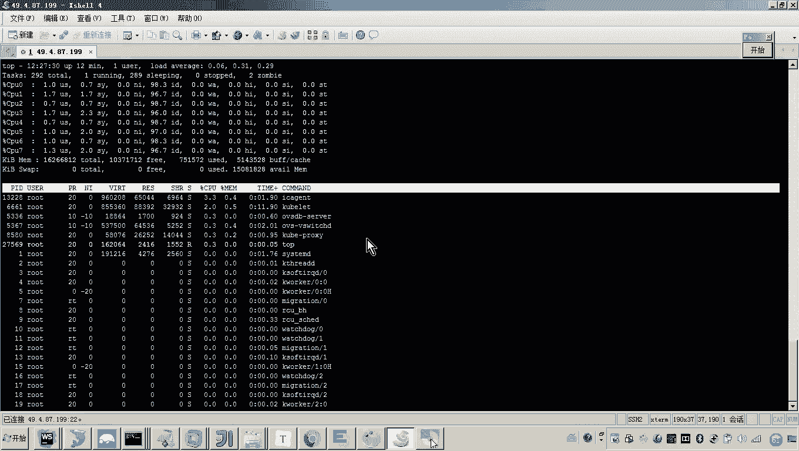

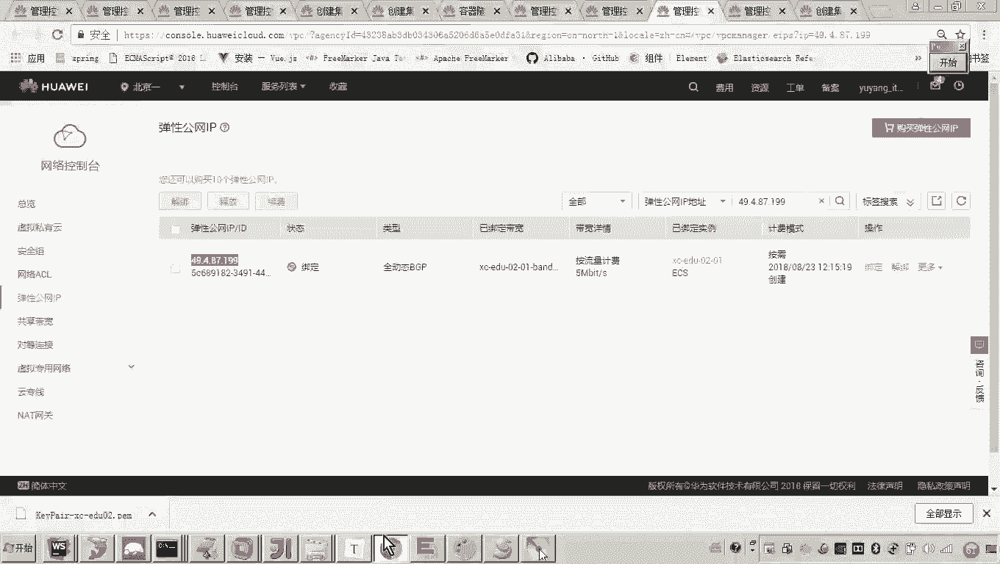

本节课中我们一起学习了华为云CCE集群创建后的后续操作。我们掌握了如何在控制台查询集群和节点的详细信息，理解了公网IP可能无法 `ping` 通的原因，并实践了通过Web控制台和SSH客户端两种方式远程登录到集群节点的方法。成功登录服务器是进行后续应用部署和运维管理的基础。