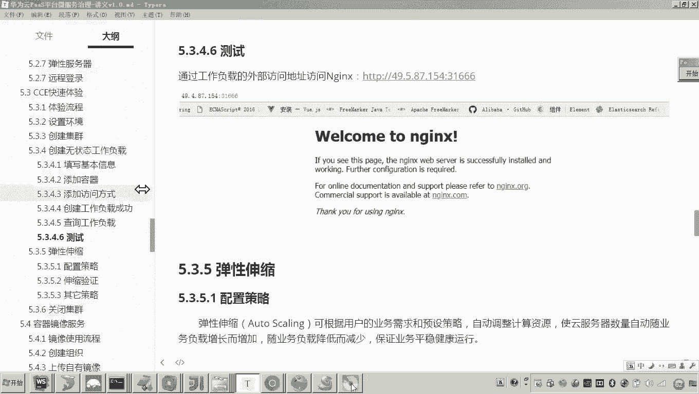

# 华为云PaaS微服务治理技术 - P102：10-云容器引擎CCE-CCE快速体验-创建无状态工作负载 - 开源之家 - BV1wm4y1M7m5

好，那么下边呢我们呃就来快速体验一下CCE部署应用的这个流程。好，那通过快速体验呢呃让大家对这个CCE平台呢，它的这个工作操作流程有一个直观的认识啊，为我们后边呢来部署我们的学生带线呢打一个基础。好。

那大家来看这个CCE快速体验的这个流程呢分成6步啊，那第一步呢，首先我们说是设置环境。那这个这个主要设置什么环境呢？大家注意啊，这个环境啊，主要是我们说的这个网络环境。哎，网络环境。

因为你要呃创建完集群之后呢呃各位首刚才其实创建集群呢，创建集群呢，应该说我们在最前边应该先创建我们的私有云，对不对？然后呢，我们这个集群的服务器呢可以在这个私有云里边呢进行通信啊。好，所以这个设置环境。

刚才我们已经做过了哎，创建私有云。然后第二步呢创建集群。哎，我们也已经做完了。嗯，好，那么我们现在呢就直接到第三步啊创建无状态工作负载。好，那么这个工作负载是什么呢？

这个工作负载其实是这个conet里边的这个概念啊，因为我们最终要使用这个docker容器来部署我们的这个应用服务。呃，其实啊一个容器啊，一个容器啊，你可以理解成一个负载。😊，好，那么这个工作负载分层啊。

一个无状态的负载和有状态的负载。那有状态的负载是什么呢？比如说哎我们现在要部署哎用容器啊部署一个mesl啊，那这个myql呢各位你也知道它是不是要对数据进行持久化呀。

所以我们说这种哎这种我们把它叫做有状态的这个负载。而这种无状态的负载。哎，好比举个例子，我们的这个微服务啊，那你这个程序啊部署部署我们的这个微服务啊，部署在这个容器当中。

我们说哎你可以非常快速的哎来横向扩展我们的这个微服务，什么意思呢？比如我现在部署一个无状态的工作负载。原来我是一个容器啊，一个容器。现在呢我说啊我现在呃一个容器我们可以把它作为可以给名字叫做实例吧。

一个实例。嗯，现在我们说一个实力。😊，不够用了，现在一个请求呢，一个实例，我们我们准备再扩一个哎，我们再扩一个。好，这里边大家看到我我在扩充这个实例的时候，是不是非常快速的，我是不是又扩了三个实例？😊。

看懂了吧？而你在扩去这三个实例的时候，其实就是非常简单的来不启动了三个容器。😊，啊，那这种就是叫做无状态的工作负载，就是它不涉及到这个数据的在这个呃数据的持久化方面。

而现在如果说如果说你现在想对my circle来进行什么哎扩展啊，你说现在原来我有一台myl。哎，现在我想再扩一台myql。那由于my circlel要对数据进行持久化，对吧？

而你就不能非常简单的来把这个my circlecle呢哎横向的去扩充成呃若干的这个实例。😊，为什么呢？因为mycycl涉及到这个数据日志的这个操作，哎，数据的存储。

所以这里边你就不能像微服务这样哎无状态工作负载这样非常快速的去横向扩展很多实力。哎，所以像mycyclcle这一种对数据进行持久化数据的呃这种有状态的嗯，需要保存状态的。我们把它叫做有状态工作负载。

而这一种可以非常快速的横向扩展这个呃容器实力啊，无需保存工作状态的叫无状态工作负载。😊，好，那现在呢我们在快速体验当中，我们想啊来创建一个无状态的工作负载。哎，用一个什么N in吧，我们准备部署一个N。

😊，那个说候老师安静是无状态还是有状态？😊，这个是不是就是一个web容器啊，哎，就是一个web服务器。那里边我们放一些这个HTM网页哎，是不是就可以去实现这个服务的呃对外提供这个服务的能力了，是吧？

所以这个呢你也可以它就无需保存这个数据的工作状态。那你就可以非常快速的把它横向扩展很多个实力，是这样一个意思吧。哎，好，那现在呢我们就嗯准备来部署一个。😊，首先这里边我们进入这个界面嗯，进入哪个界面呢？

工作负载的界面。😊，然后在工作负载界面当中，大家可以看到有两个菜单，一个是无状态，一个是有状态。那现在你要创建无状态的这个工作负载呢，你点击创建无状态工作负载。😊，然后在这个里面呢。

我们就填写哎咱们这个无状态工作负载的基本信息。现在我们是不是想创建一个呀？哎，那这个集群呢所在这个集群就是我刚刚创建的这个XCEDU02集群。嗯，然后这个实力的数量呢，它默认给你两个。哎。

因为也是高可用的需求嘛。现在我们测试的话，我们先部署一个实例，就是启动一个容器实力就可以了。时间的同步呢，我们开启嗯，然后就是开启后容器呃容器内，因为容器容器是不是也里边也也跑了一个微型的这个操作系统。

对吧？所以这个这个容器哎我们把这个容器的这个时间和我们数主机，容器所在的这个服务器的这个时间呢开启同步。好，然后呢再下一步。😊，这样的话我们是不是就叫到了一个添加容器的这个呃页面呢？

因为各位知道啊这个docker的概念，docker首首先是不是要有镜像，然后我们是不是才根据镜像创建很多容器啊，所以你在添加容器的时候啊，你要选择什么呀？镜像嗯选择镜像。好，那现在选择镜像，它有几种啊。

呃这个镜像稍后还会去详细讲解那这个镜像有我的镜像还有一个docker号的这个官方镜像。那现在呃你像创建一个的话，呃，这里边因为因为你这个初次的这个云账号，我的镜像当中肯定是空的啊。

因为这些镜像都是我自己上传的那所以说呢哎我们就可以从docker的这个官方，我们哎用它的镜像。好，那这里边我是不是选择了一个叫做这个什么呀？这个镜像没错吧。好，然后呢然后选择完了之后怎么弄啊？

你选择确定。😊，这样的话是不是就到达了一个来到了一个界面，哎，叫填写这个什么容器的基本信息了。嗯，这个容器的基本信息我们选择哪个版本呢？这个en，我们就选择一个稳定版就可以了。嗯，然后容器的名称啊。

我们给它随意起个名字就可以啊啊，我们给它起一个什么名字呢？😊，我们就叫做en尼克斯。好，就叫Nex。那这个容器的这个资源的这个分配呢，哎资源分配的话，它的这个最小给你刚开始就是这个容器只要一启动。

它它最小给你分配的CPU是0。25核。😊，你总共是不是8核呀？所以你这个最小的这个CPU分配的这里边呢，一定要谨慎使用啊。有人说老师最太小了，我弄个两盒吧，注意你要弄个两盒。😊，哎。

你不要看后边这个这个这个这个这个什么呢，这个提示是啥说啥呀，说这个资源申请值不可以大于资源限制值。那这个限制值是不是就是最大值了，最大值对不对？哎，呃你要弄个两盒的话，你要注意了。

就这两盒资源已经被这个容器给占了。其他的这个这个容器如果啊也在创建容器的话，那那他要干嘛呀。对他要在从这个原有的这个8盒里边减去两盒之后还剩6盒，他在这6盒里边才能找才能用资源，所以这个最小的资源分配。

一定要谨慎使用。就是啊够用啊，尽量的小够用就行。😊，而限制的这个资源呢，你可以对根据你的这个情况呢，适当的稍微大一些就可以了。好，内存的这个分配的话呃，我们就1024就可以嗯。😊，啊。

最大吧啊最最最小的话就512兆啊，当然这个这个资源内存的资源跟CPU的这个计算都差不多嘛。也是啊，如果你这个啊申请时候的这个资源被占住了。那么后边的容器就无法用你占助的这512这个512兆的这个内存了。

好，那现在我们说这个资源在呃分配的时候啊，尽量的呃申请的这个资源尽量的少啊，限制的资源呢，根据你的实际情况去选择就可以了。😊，好，那接下来呢我们是不是就可以去干嘛呀？

呃去这里边还有一堆啊有什么生命周期啊，就是启动容器的时候运行一些命令啊，然后呢健康检查啊，这这些我后边会说还有环境变量啊，环境变量，大家知道啊。

我们说这个呃去创建docker容器是不是可以配置一些环境变量啊。那现在我们这个N呢暂时用不到，还有这个数据存储啊，这个数据存储就是回头我会讲啊，这个数据券啊。

数据券就是数组服务器和这个容器的一个目录的对应关系。😊，好，这些东西呢我们暂时用不到。然后我们下一步。😊，然后到这一步的话，我们就要添加访问方式了。那就说怎么访问呢？就是当将来呀你要如何来访问这个容器。

😡。

各位，也就是说在早期，我们是不是手动的登到服务器来通过docker的命令来创建容器。而现在这个过程啊不用你做了，全部通过什么呀，这个CCE平台帮你完成了。😡。

就说我刚才做了这些事，你可能就不知道啥意思。有说老师你选择之后呢，选择了之后，只要你选择完成，然后呢提交那这个平台会自动的这个在你的这个云服务器上呢去下载你这个镜像，然后呢去创建容器，懂我意思吧？好。

那现在呢我们就添加呀添加服务这个服务又是啥玩意，就是将来你要访问你的容器怎么访问嗯，所以现在我就随便添一个服服务名称啊，随便命名我们叫，后你将来怎么访问呢？你是集群内内网访问吗？还是说公网访问呢？

那现在呢因为我们为了一会测试啊，我我准备公网去连接我们访问一下，所以我们选择公网访问。嗯访问的类型呢，你通过负载均衡，还是通过什么这个负载均衡。我说一下这个负载均衡也是云平台提供的一种资源。

也是需要购买的，所以这里边我们不通过负载均衡，回头我们用到再说我们通过。😊。

怎么样啊，弹性IP就可以了。因为IP这个我们购买的那个弹性IP是不是一个公网IP啊，我们通过IP访问。😊，好，那现在我们说那你填端口吧，容器的端口默认这个en它就是80了。😊。

然后你要通过这个呃弹性IP的什么端口啊，有人说老师那也是80呗，那不行。😡，什么意思？就是这个容器，就是你你创建这个刀块容器的这个里边的端口肯定是80的。但是你要通过这个外网的这个IP哎。

你你你也想通过80，你没发现吗？它最它的这个端口的范围就是3万到32767。😡，就你不可能说我将来我创建完了之后呢，我在我这个浏览器上边输入我这个啊公网的IP，然后冒号80就能访问不行。😊。

所以这个端口的范围被被干嘛被限制了。所以我们可以用让它自动生成就行了。嗯，好，下一步。😊，然后将来你这个工作负载的升级策略是怎么升级啊，是完全替换还是滚动升级啊，我们默认滚动升级就行了。什么意思呢？

将来我会给你演示啊，现在快速体验这一块呢，我们先暂时不管它。😊，然后这个呃缩容策略迁移策略我们暂时都不关，然后点创建。好，这个就创建成功。各位创建成功之后呢，你这次再来到这个工作负载无状态的这里。

各位是不是已经显示了一个记录叫en这个工作负载，没错吧，而这个en工作负载这里边呢，它这个状态是不是叫就绪啊？哎，你刷新。😊，哎，有人说老师这个你看这个这个这个这一直是没有就绪，对不对啊。

一直没有你点点进去点进去。然后在这个实例的实力列表，现在是不是有一个实力正在创建中啊，你看下这叫镜像拉取中，也就是现在正在哎正在从这个docker官方拉取镜像。😊。

嗯，你说老师这个我咋要看这个效果了呀？对，现在我是不是已经登录到了咱们那个云服务器，也就是现在这个CCE平台自动的正在哎正在你的云服务器去执行。哎，通过这个kuubernetes来执行什么呀。

拉取镜像的这个操作。😊，哎，大家可以看到啊，这里边这他他他拉到了吗？😊，看一下。那这里边呢我们就稍微等一会儿啊稍微等一会儿啊，还在哎哎，现在呢是不是就已经运行起来了，对吧？运行中运行中啊。

运行中我们看一下。😊。

嗯。然后呢，看PS看容器吧。哎，各位可以看一下，在容器这里头，各位是不是就有一个N了，看见吗？😊，那这个en在早期我这个服务器上是没有的对吧？而现在这个容器是不是已经被自动的拉取启动起来了？😊。

看懂了吧？哎，并且并且这个这个这个什么呀，这个访问的方式，你可以看一下呃，他这个端口自动给你生成的是个30893。😊，所以现在你点击各位，现在你看到的这个界面就是通过什么这个弹性IP来访问这个容器。

容器里边的这个en。看到这个画面是不是就表示可以这个这个容器正常了。😊，呃，这个就是我们说的这个一次快速体验来哎创建我们说的这个N容器这个工作负载。好，我们把整个流程呢再回顾一下啊，再回顾一下。😊。

首先我们说呃，那你在使用CCE的时候呢，最初你要去呃创建你的网络环境啊，私有云，然后呢再创建集群啊，集群我们在今天的这个CCE课程是不是第一步就已经做成做完了？😊，然后呢，再创建工作负载。工作负载。

刚才我是不是给大家解释了，包括两种，一种是无状态的，一种是有状态的那需要保存这个工作数据的这个状态。我们哎就创建有状态工作负载。那不需要保存无这个工作这个数据的状态。哎，我们说那你有无状态的工作负载。

😊，好，那这样的话，我们说呃针对数据库那一种呢，那你肯定是啊需要保存数据工作状态的那你也肯定要创建一个有状态的工作负载啊。针对微服务这些一般来说，我们都是无状态工作负载。

无状态的工作负载的特点是不是就可以啊非常快速的去横向扩展我们的容器实力啊？😊，好，那么填写基本信息啊，然后呢啊添加容器，添加容器的第一步其实就是干嘛呀？选择镜像，然后呢再填写你的容器的信息。😊。

然后我们啊再再选择你这个呃。这个容器的访问方式啊有有三种啊有三种。哎，我们说前两种前两种都是内网，后一种是不是就是公网啊啊，我们我们后边啊我们后边会公网和内网都用到。😊，哎，然后我们现在这个快速体验呢。

我们是暂时先用公网来访问N尼。好，然后呢，添加成功之后呢，呃呃大家可以看到我在查询工作负载，这里边是不是都已经可以看到这个工作负载应该可以正常的来干嘛运行了。😊，嗯。

大家可以看到他这个是不是就是运行中啊，然后你点击工作负载，这里边有一系列的菜单。😊，啊，然后呢，在工作负载运维这里，各位你也可以看到呃，各位可以看到什么呀？这个运行的日志，你可以通过这里查询。😊。

所以其实这个通过云平台啊，通过云平台来部署我们的应用服务，其实就是通过什么哎，就呃不用你再去人工登录服务器啊，然后呢哎再通过这些命令呢来操作哎来部署你的这个什么这个服务了。

你直接通过这个呃智能化的这个管理平台这个管理界面，我们就可以来实现这个部署。嗯，所以以上呢就是我们快速的在云平台部署了一个en啊，大家可以看到我通过这个公网，是不是也可以来访问我们的这个enin了。😊。

好，那么这个快速体验创建无状态工作负载呢，哎，我们呢先介绍到这里。

